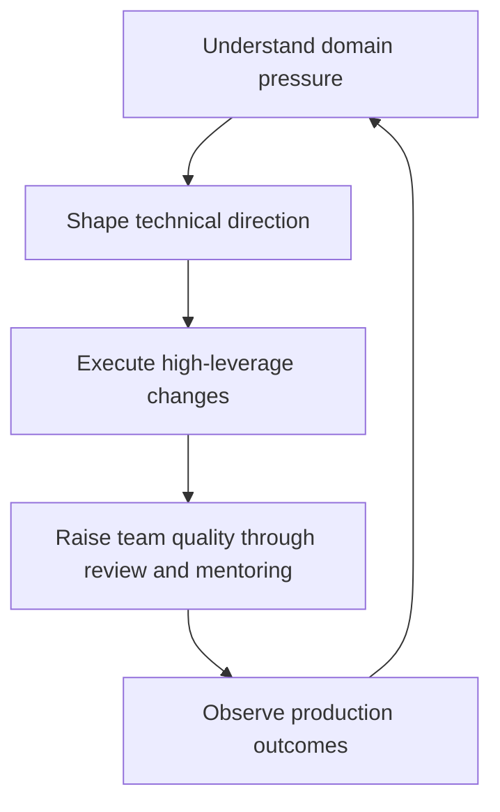
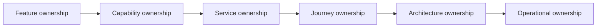
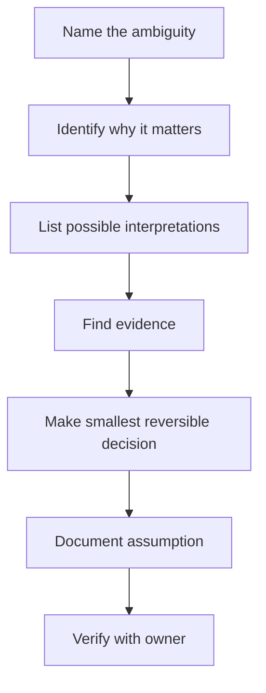

# Part 067 — Ownership, Mentoring, and Technical Leadership as a Senior Engineer

## 1. Source notes and scope boundary

This part uses public engineering leadership and software engineering practice references, especially:

- Google Engineering Practices on code review and code health.
- Google re:Work material on effective teams, managers, and psychological safety.
- Public engineering handbooks such as GitLab's handbook for examples of transparent engineering expectations and onboarding practice.
- Previous parts of this series on PR review, design docs, architecture review, operational readiness, and production data repair.

This part does **not** assume CSG has a specific engineering ladder, promotion rubric, team topology, ownership model, incident process, mentoring program, review policy, or architecture governance process.

Use the `Internal verification checklist` sections to validate the actual expectations for your team.

---

## 2. Core thesis

Senior engineering is not just stronger coding.

Senior engineering is the ability to increase the correctness, speed, safety, and judgment of the system and the team around you.

In a Quote & Order product, this matters because most expensive failures are not caused by isolated syntax mistakes. They come from weak ownership boundaries, implicit assumptions, incomplete lifecycle reasoning, unsafe migrations, poor communication, missing operational evidence, or decisions made without understanding downstream commercial impact.

A senior engineer should be able to answer:

> What part of the system am I responsible for making safer, clearer, more operable, and easier for the next engineer to change?

Not merely:

> Which tickets did I finish?

The real unit of senior impact is not a task. It is an improvement in the system's ability to evolve without losing correctness.

---

## 3. The senior engineer mental model

A senior engineer operates across five loops.

Each loop has a different failure mode.

| Loop | Good behavior | Weak behavior |
|---|---|---|
| Domain pressure | Understands quote/order business risk | Treats all tickets as generic backend work |
| Technical direction | Makes trade-offs explicit | Pushes preferred pattern without context |
| Execution | Delivers small, safe, verifiable changes | Creates large risky branches |
| Review/mentoring | Raises others' judgment | Blocks PRs with vague preferences |
| Production outcome | Learns from incidents and metrics | Declares done after merge |

In Quote & Order, this means your job is not only to implement an endpoint. Your job is to understand whether that endpoint changes pricing evidence, approval authority, order lifecycle, fulfillment state, tenant isolation, audit trail, customer integration, or billing handoff.

---

## 4. Senior vs staff/principal behavior

The titles vary by company, but the behavioral distinction is useful.

| Dimension | Mid-level engineer | Senior engineer | Staff/principal-level behavior |
|---|---|---|---|
| Scope | Completes assigned feature | Owns feature/system area | Shapes cross-system direction |
| Review | Finds local code issues | Finds domain, data, API, operational risk | Improves review standards and decision frameworks |
| Design | Implements chosen design | Proposes trade-offs | Aligns multiple teams and future constraints |
| Production | Reacts to issues | Designs for detection/recovery | Improves systemic reliability posture |
| Mentoring | Helps when asked | Actively grows team judgment | Builds reusable learning systems |
| Communication | Reports status | Explains risk and decisions | Creates shared clarity under ambiguity |

A senior engineer in Quote & Order should gradually become the person who can say:

- this pricing change needs approval invalidation logic,
- this order state transition needs idempotency protection,
- this DB migration is unsafe for on-prem customer upgrades,
- this Kafka event is not replay-safe,
- this API field is additive syntactically but breaking semantically,
- this support repair needs audit evidence,
- this design doc has not modelled fulfillment fallout.

That is leverage.

---

## 5. Ownership is a boundary plus a feedback loop

Ownership is often misunderstood as "being assigned to a component".

That is only inventory.

Real ownership means:

1. You understand the purpose of the area.
2. You know its users and downstream consumers.
3. You know its invariants.
4. You know its failure modes.
5. You know how it is deployed and observed.
6. You know what changes are risky.
7. You know where the bodies are buried.
8. You improve the area over time.
9. You help others modify it safely.

For a Quote & Order area, ownership should include at least these dimensions.

| Ownership dimension | Example for Quote & Order |
|---|---|
| Domain | Quote approval, order decomposition, catalog pricing, fulfillment fallout |
| Code | Java service, mapper layer, state transition package, adapter module |
| Data | PostgreSQL tables, migration history, outbox/inbox, audit tables |
| Contract | REST API, OpenAPI, TMF mapping, Kafka event schema |
| Operations | dashboards, alerts, runbooks, support procedures |
| Quality | unit/integration/contract/e2e tests |
| Security | tenant isolation, RBAC, audit, PII boundaries |
| Evolution | roadmap, known debt, safe refactoring plan |

If you only own code, you do not own the system.

## 5.1 Ownership questions

Ask these when taking responsibility for an area:

1. What business capability does this area provide?
2. What are its hard invariants?
3. What data does it authoritatively own?
4. Which APIs/events does it expose?
5. Which systems depend on it?
6. What happens when it is down?
7. What happens when it is slow?
8. What happens when it processes duplicate input?
9. What happens when a deployment is partially rolled out?
10. How do we repair bad data?
11. What is the highest-risk customer-specific behavior?
12. What is the most common support issue?
13. What is the most dangerous manual operation?
14. Which tests protect the area?
15. Which tests are missing?

These questions turn ownership from a label into a working model.

---

## 6. Ownership levels in a Quote & Order system

Not every engineer needs to own the whole product. But every senior engineer should know what layer they are operating at.

### 6.1 Feature ownership

Example:

- Add a new quote validation rule.
- Add an order search filter.
- Add a new event field.

Feature ownership requires correctness for that change.

### 6.2 Capability ownership

Example:

- Quote approval.
- Product offering price calculation.
- Order cancellation.
- Fulfillment fallout.

Capability ownership requires lifecycle reasoning and cross-feature consistency.

### 6.3 Service ownership

Example:

- Quote service.
- Catalog service.
- Ordering service.
- Fulfillment adapter service.

Service ownership requires deployment, observability, performance, security, and operational readiness.

### 6.4 Journey ownership

Example:

- configure → price → quote → approve → order.
- product order → decomposition → service order → inventory update.
- amend existing service → validate installed base → fulfill change.

Journey ownership requires cross-service reasoning and customer impact awareness.

### 6.5 Architecture ownership

Example:

- API compatibility strategy.
- Kafka event model.
- outbox/inbox pattern.
- catalog versioning strategy.
- tenant isolation strategy.

Architecture ownership requires durable decisions and future migration awareness.

### 6.6 Operational ownership

Example:

- incident runbooks.
- dashboard quality.
- alert correctness.
- repair procedures.
- release readiness.

Operational ownership requires accepting that production behavior is part of the design, not an afterthought.

---

## 7. The senior engineer's operating system

A senior engineer needs a repeatable operating rhythm.

### 7.1 Weekly inputs

Collect signals from:

- current sprint work,
- PRs reviewed,
- incidents/support escalations,
- slow queries,
- flaky tests,
- failed deployments,
- customer-specific bugs,
- design discussions,
- migration risks,
- team confusion.

### 7.2 Weekly outputs

Convert signals into:

- safer implementation,
- better review comments,
- small refactoring PRs,
- documentation update,
- test coverage improvement,
- dashboard/alert fix,
- design clarification,
- backlog item,
- mentoring conversation.

### 7.3 Monthly outputs

Produce something durable:

- a design doc,
- an ADR,
- a runbook,
- an architecture map,
- a migration playbook,
- a domain glossary,
- a test fixture library,
- a PR review checklist,
- a dashboard improvement,
- a debt reduction plan.

Senior impact compounds when outputs become reusable.

---

## 8. Mentoring as judgment transfer

Mentoring is not answering every question.

Mentoring is transferring judgment.

A weak mentoring pattern says:

> Do it this way.

A stronger mentoring pattern says:

> Here are the invariants. Here are the failure modes. Here are the trade-offs. Now choose the smallest safe path and explain it.

In Quote & Order, good mentoring teaches people to ask:

- Which lifecycle state allows this command?
- Is this quote price still valid?
- Does this update preserve approval evidence?
- Does this order transition emit a replay-safe event?
- Does this migration work during rolling deployment?
- Does this endpoint enforce tenant isolation?
- Can support reconstruct what happened later?

## 8.1 Mentoring modes

| Mode | When useful | Risk |
|---|---|---|
| Direct answer | Production incident or urgent blocker | Creates dependency if overused |
| Socratic questions | Building reasoning skill | Can feel slow if context is missing |
| Pairing | Complex codebase entry | Can become passive observation |
| Review comments | PR-specific judgment transfer | Can be perceived as criticism if poorly written |
| Design walkthrough | Architecture learning | Can drift into lecture |
| Postmortem discussion | Real failure learning | Needs psychological safety |
| Reading path | Onboarding and domain learning | Needs follow-up accountability |

Mentoring should be explicit about the mode.

Example:

> I will give the direct fix now because this is blocking the release. Afterward, let's spend 30 minutes on why this race existed.

That preserves urgency and learning.

---

## 9. High-quality review comments

A senior engineer's review comment should usually identify:

1. the risk,
2. the evidence,
3. the principle,
4. the suggested path,
5. the severity.

Weak comment:

> I don't like this.

Better comment:

> This update changes `order.status` without inserting a state history row. That weakens incident reconstruction and audit evidence for fulfillment fallout. Can we route this through the existing transition method or add the missing state history write in the same transaction?

Best comment:

> This is a blocking correctness issue because the order can become `FULFILLING` without a corresponding transition event. That breaks replay/reconciliation assumptions from Part 031/066. Suggested fix: move status mutation into `OrderLifecycleService.transition(...)`, persist state history, and publish through outbox in the same transaction. Add a test for duplicate command + state history idempotency.

## 9.1 Comment severity vocabulary

Use severity intentionally.

| Severity | Meaning |
|---|---|
| `blocking` | Must fix before merge because correctness/security/operation risk is material |
| `strong suggestion` | Should fix unless there is a clear reason not to |
| `question` | Reviewer needs clarity before judging |
| `nit` | Minor style/readability issue |
| `future` | Worth tracking but not required for this PR |

This reduces review ambiguity.

---

## 10. Technical leadership without authority

Senior engineers often lead without formal management authority.

This requires clarity, not force.

### 10.1 Use facts before opinions

Instead of:

> We should use outbox because it is best practice.

Say:

> This command updates the order and emits an event. If the DB commit succeeds but the Kafka publish fails, downstream fulfillment never sees the order. If Kafka publish succeeds but DB commit fails, consumers see an order that does not exist. A transactional outbox removes that dual-write gap.

### 10.2 Make trade-offs explicit

Instead of:

> This design is bad.

Say:

> This design optimizes implementation speed but increases replay risk because consumers cannot distinguish correction events from lifecycle events. A slightly more explicit event taxonomy costs more upfront but gives safer replay and observability.

### 10.3 Convert disagreement into decision criteria

When a team disagrees, ask:

- What invariant are we protecting?
- What failure mode is most likely?
- What failure mode is most expensive?
- What is the rollback plan?
- Which consumer will be broken?
- Which customer deployment mode constrains us?
- What evidence would change our mind?

Leadership is often moving a debate from taste to criteria.

---

## 11. Stakeholder communication for technical risk

Senior engineers must translate technical risk into stakeholder-relevant language.

| Technical issue | Stakeholder framing |
|---|---|
| Missing idempotency | Customer may receive duplicate order processing after retry |
| Stale price snapshot | Accepted quote may not match approved commercial terms |
| Unsafe migration | Upgrade may block production writes or fail on large customer data |
| Missing tenant predicate | One customer may see another customer's data |
| No audit event | Support/compliance cannot prove who approved or changed a quote |
| No dashboard | Incident detection depends on customer complaint |
| No rollback path | Release risk remains high even if tests pass |

This is not exaggeration. It is accurate translation.

---

## 12. Building trust as a new senior engineer

When you join a new team, the fastest way to lose trust is to prescribe before understanding.

The fastest way to gain trust is to:

1. learn the domain,
2. respect existing constraints,
3. ask precise questions,
4. make small useful improvements,
5. give helpful reviews,
6. document what was previously implicit,
7. avoid blaming past decisions without context.

Most legacy complexity exists because of customer commitments, deployment constraints, historical deadlines, or valid trade-offs at the time.

A senior engineer should not say:

> Why did they build it like this?

A better question is:

> What constraint made this design reasonable at the time, and is that constraint still true?

---

## 13. Technical debt ownership

Technical debt is not ugly code.

Technical debt is a future cost created by a current design or implementation choice.

In Quote & Order, meaningful debt includes:

- hidden lifecycle transitions,
- duplicated pricing logic,
- inconsistent quote/order state mapping,
- customer-specific branches without lifecycle policy,
- missing tenant isolation tests,
- unsafe migration patterns,
- event schemas without compatibility rules,
- manual repair scripts without audit,
- dashboards that do not explain business health,
- flaky tests that block safe change,
- no ownership for critical adapters.

## 13.1 Debt classification

| Debt type | Example | Why it matters |
|---|---|---|
| Correctness debt | approval logic duplicated in UI and backend | approval bypass risk |
| Operational debt | no alert for stuck order decomposition | customer discovers issue first |
| Data debt | old rows missing catalog version snapshot | amendment/reprice ambiguity |
| Integration debt | partner adapter has custom retry logic | unknown outcome and duplicate side effects |
| Security debt | tenant filter manually repeated in mapper SQL | cross-tenant leak risk |
| Test debt | only happy-path E2E test | failure paths regress silently |
| Documentation debt | state machine only exists in code | new engineers make invalid transition changes |

## 13.2 Debt should have a repayment strategy

A useful debt item includes:

- affected capability,
- current failure mode,
- business impact,
- production signal,
- safe repayment sequence,
- test strategy,
- migration plan,
- owner,
- priority trigger.

Bad debt item:

> Refactor order service.

Good debt item:

> Centralize order state transitions through `OrderLifecycleService` because three code paths currently mutate `order.status` directly. Risk: missing history/outbox event during cancellation and fallout recovery. Repayment: add characterization tests, introduce transition method, migrate two low-risk paths, then block direct mapper status update through review/static check.

---

## 14. Creating leverage through documentation

Documentation is not busywork when it reduces repeated explanation and prevents bad changes.

High-leverage docs for Quote & Order include:

- quote lifecycle state machine,
- order lifecycle state machine,
- quote-to-order conversion contract,
- catalog versioning model,
- pricing snapshot rules,
- approval authority model,
- outbox/inbox pattern guide,
- TMF API mapping notes,
- tenant isolation checklist,
- DB migration playbook,
- incident runbooks,
- customer-specific configuration guide,
- architecture decision records.

A senior engineer should write docs that answer:

- what is true,
- why it is true,
- when it fails,
- how to change it safely,
- who owns it,
- how to verify it.

---

## 15. Owning production outcomes

Production ownership has two directions:

1. backward-looking: learn from incidents and defects,
2. forward-looking: prevent recurrence and improve detection.

After a production issue, a senior engineer asks:

- Which invariant failed?
- Was the bug in code, data, integration, config, or operation?
- Did tests cover the scenario?
- Did monitoring detect it before customer impact?
- Was there a runbook?
- Was rollback possible?
- Was data repair safe?
- Was the root cause systemic?
- What small durable change prevents recurrence?

Avoid the common trap:

> The incident is fixed because the immediate bug is patched.

A better framing:

> The immediate failure is mitigated. The incident is not fully learned from until detection, prevention, and recovery are improved.

---

## 16. Handling ambiguity

Enterprise systems are full of ambiguity:

- unclear customer-specific requirement,
- incomplete TMF mapping,
- undocumented legacy behavior,
- conflicting downstream expectations,
- partial ownership boundary,
- missing production data,
- inconsistent terminology.

A senior engineer does not wait passively for perfect clarity.

They reduce ambiguity through bounded investigation.

### 16.1 Ambiguity reduction loop

Example:

> Ambiguity: Does `cancelled` mean order submission cancelled, fulfillment cancelled, or customer-visible product termination cancelled?
>
> Why it matters: API clients and fulfillment adapters may interpret it differently.
>
> Evidence needed: existing state machine docs, TMF622 mapping, production examples, support tickets, adapter code.
>
> Safe decision: do not reuse `cancelled` for item-level fulfillment failure until state semantics are clarified.

---

## 17. Mentoring through architecture review

Architecture review is one of the best mentoring surfaces.

Instead of only saying yes/no, teach the review frame.

Ask the author to explain:

1. domain invariant,
2. API/event contract,
3. data ownership,
4. consistency model,
5. failure modes,
6. observability,
7. rollout plan,
8. rollback/repair plan,
9. testing strategy,
10. operational ownership.

This creates a reusable mental model.

### 17.1 Architecture review question examples

For quote approval:

- What invalidates approval?
- What is the approval evidence?
- Can approval be replayed or reconstructed?
- Is approval tied to price snapshot or live price?
- Who can override approval?
- Is override audited?

For order decomposition:

- Is decomposition deterministic for the same order snapshot?
- What happens if catalog mapping changes mid-order?
- Are generated tasks idempotent?
- Can partial decomposition be resumed?
- How is fallout surfaced?

For Kafka events:

- What is the partition key?
- Are events replay-safe?
- Are correction events distinguishable from lifecycle events?
- Is schema change backward-compatible?
- Is causation traceable?

---

## 18. Team influence patterns

### 18.1 The useful skeptic

A useful skeptic challenges weak assumptions but also proposes a path.

Bad skepticism:

> This will never scale.

Useful skepticism:

> The design may bottleneck on pricing recalculation because every quote item calls catalog separately. Let's measure expected item count, add a bulk catalog lookup option, and define an SLO for quote price calculation.

### 18.2 The simplifier

A simplifier removes unnecessary complexity without flattening real domain constraints.

Bad simplification:

> Just make status a string.

Good simplification:

> We can keep the state machine explicit while removing duplicate transition code. One transition service plus a transition table gives us less code and stronger invariants.

### 18.3 The historian

The historian knows why things are the way they are.

Useful historical questions:

- Was this design created for a specific customer?
- Did it support on-prem constraints?
- Was it compensating for a downstream limitation?
- Did a previous incident create this guardrail?
- Has the original constraint expired?

### 18.4 The gardener

The gardener improves the codebase continuously.

Examples:

- improving test fixture names,
- removing dead config,
- adding missing dashboard panels,
- documenting lifecycle transitions,
- deleting obsolete compatibility paths after migration,
- tightening mapper SQL around tenant predicate.

Small cleanup matters when it reduces future error probability.

---

## 19. Ownership in distributed teams

Enterprise products often span multiple teams and time zones.

A senior engineer should make ownership explicit.

For every critical area, identify:

- primary owner,
- secondary owner,
- reviewer group,
- production escalation owner,
- data owner,
- API/event owner,
- customer-specific customization owner.

If ownership is unclear, systems rot.

Symptoms of unclear ownership:

- PRs wait because nobody knows who should review.
- Bugs bounce between teams.
- Dashboards exist but nobody watches them.
- Migrations are approved without data owner review.
- API fields are added without consumer review.
- Customer-specific behavior accumulates without cleanup.

---

## 20. Senior engineer anti-patterns

### 20.1 The pattern collector

Uses fashionable patterns without failure-mode reasoning.

Example:

> Let's use event sourcing.

Better:

> Which queries, audit requirements, replay needs, and migration constraints require event sourcing? What operational cost are we accepting?

### 20.2 The permanent critic

Finds problems but does not help create progress.

Good senior review should increase safety and forward motion.

### 20.3 The hero debugger

Fixes incidents alone and leaves no system improvement.

Heroics without durable learning create dependency.

### 20.4 The undocumented oracle

Knows everything but writes nothing down.

This creates a bottleneck.

### 20.5 The scope inflator

Turns every PR into a redesign.

A senior engineer must distinguish:

- must fix now,
- should fix soon,
- track as debt,
- intentionally defer.

### 20.6 The abstraction maximalist

Introduces generic frameworks before the domain is understood.

Quote & Order systems need explicit business language more than generic cleverness.

---

## 21. Internal verification checklist

Validate these items during onboarding and ongoing work.

### 21.1 Role and expectation

- What does CSG expect from a Senior Java Software Engineer in this team?
- What is the difference between senior, lead, staff, principal, architect, and manager roles internally?
- What behaviors are rewarded?
- What behaviors are considered risky?
- What level of production/on-call ownership is expected?

### 21.2 Ownership model

- Which services/modules are owned by this team?
- Is ownership service-based, capability-based, customer-based, or journey-based?
- Who owns APIs/events/schemas?
- Who owns DB migrations?
- Who owns dashboards/runbooks?
- Who approves customer-specific customization?

### 21.3 Review culture

- What PR size is considered healthy?
- Who must review domain changes?
- Who must review security-sensitive changes?
- Who must review DB migrations?
- Who must review public/customer-facing API changes?
- What is the escalation path for review disagreement?

### 21.4 Design governance

- When is a design doc required?
- When is an ADR required?
- Who approves architecture decisions?
- Where are old design docs stored?
- How are decisions superseded?
- Are customer-specific deviations documented?

### 21.5 Mentoring and team growth

- Is there a buddy/mentor system?
- Are senior engineers expected to mentor juniors/mids?
- Are there regular design reviews or learning sessions?
- Are postmortems shared widely?
- Are onboarding docs current?
- Is there a domain glossary?

### 21.6 Operational ownership

- Who is on call?
- What incidents happened recently?
- Where are runbooks?
- What dashboards matter most?
- What alerts are noisy?
- What data repair process exists?

---

## 22. Practical exercises

### Exercise 1 — Build your ownership map

Pick one area you touched recently.

Create a one-page map:

- purpose,
- owner,
- upstream systems,
- downstream systems,
- APIs,
- Kafka events,
- PostgreSQL tables,
- state machine,
- tests,
- dashboards,
- known risks.

Then ask a teammate to correct it.

### Exercise 2 — Convert review comments into principles

Review your last five PR comments.

Classify each comment as:

- style,
- correctness,
- domain invariant,
- security,
- data safety,
- compatibility,
- observability,
- testability,
- operations.

If most comments are style-only, increase your review depth.

### Exercise 3 — Run a mini failure-model session

Choose one feature.

Ask:

- What if the request is retried?
- What if the event is duplicated?
- What if DB commit succeeds but downstream call fails?
- What if deployment is partially rolled out?
- What if customer config is wrong?
- What if support needs to repair this later?

Document the answers.

### Exercise 4 — Mentor through one PR

Pick one teammate's PR.

Instead of only giving fix instructions, explain:

- the invariant,
- the failure mode,
- the safer pattern,
- the test that would prove it.

Keep the tone practical and respectful.

---

## 23. Senior engineer self-review checklist

Use this monthly.

### 23.1 System impact

- Did I reduce risk in an important area?
- Did I improve a lifecycle invariant?
- Did I improve observability or runbook quality?
- Did I prevent a compatibility issue?
- Did I make a migration safer?
- Did I reduce customer-specific complexity?

### 23.2 Team impact

- Did I help someone make a better design decision?
- Did I improve review quality?
- Did I document previously implicit knowledge?
- Did I reduce onboarding friction?
- Did I help resolve ambiguity?
- Did I make a disagreement more evidence-based?

### 23.3 Personal growth

- Which domain area do I understand better now?
- Which production signal can I interpret better now?
- Which internal assumption did I verify?
- Which area still feels vague?
- Which senior engineer should I learn from next?

---

## 24. What good looks like after this part

After this part, you should be able to:

- describe ownership as a full-system responsibility, not code assignment,
- review PRs for domain, data, API, security, observability, and operational risk,
- mentor by transferring judgment instead of only giving answers,
- communicate technical risk in business-relevant language,
- classify and repay technical debt safely,
- create durable docs/runbooks/checklists that improve team leverage,
- lead through clarity even without formal authority,
- treat production outcomes as feedback into design and team practice.

---

## 25. Final mental model

A senior engineer's highest-value behavior is not always writing the hardest code.

It is making the system and team more capable of safely changing hard code later.

In Quote & Order systems, that means protecting commercial correctness, lifecycle integrity, integration compatibility, operational recovery, tenant isolation, and audit defensibility while helping others learn to do the same.

That is senior ownership.
