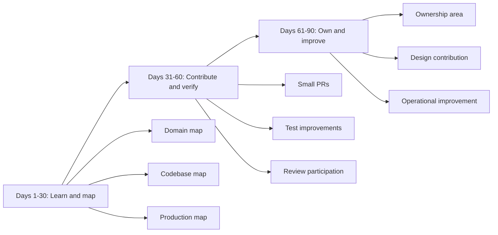
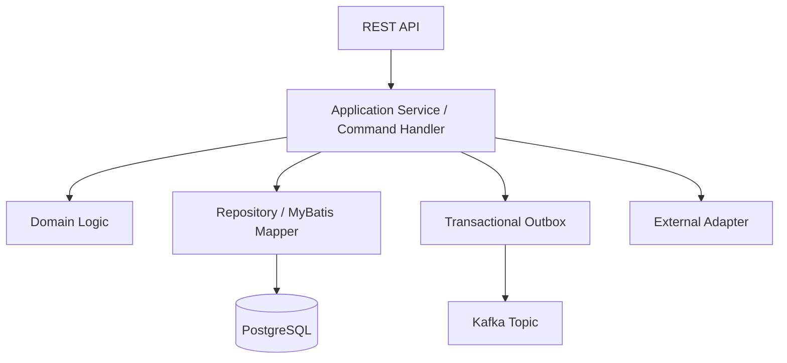

# Part 068 — 30/60/90-Day Learning and Contribution Plan

## 1. Source notes and scope boundary

This part uses public onboarding and engineering effectiveness references, especially:

- Atlassian material on 90-day plans as a structured way to onboard, set goals, and define milestones.
- Google re:Work material on onboarding and effective teams.
- Public engineering handbooks such as GitLab's handbook as examples of structured onboarding and transparent expectations.
- Previous parts of this series covering product/domain context, TM Forum, Java services, PostgreSQL, Kafka, Kubernetes, security, observability, testing, PR review, architecture review, and ownership.

This part does **not** assume CSG uses a specific onboarding template, manager expectation format, buddy program, team ritual, promotion rubric, or internal engineering ladder.

Use the `Internal verification checklist` sections to adapt this plan to your actual manager, team, product area, codebase, and customer commitments.

---

## 2. Core thesis

Your first 90 days should not be random learning.

They should be a controlled ramp from:

1. understanding,
2. contribution,
3. ownership.

For a Senior Java Software Engineer joining Quote & Order, the goal is not simply to "get familiar with the codebase".

The goal is to become trusted with changes that affect:

- quote correctness,
- pricing and approval evidence,
- order lifecycle integrity,
- catalog-driven configuration,
- TMF/API compatibility,
- Kafka event correctness,
- PostgreSQL data safety,
- Kubernetes deployment behavior,
- customer integration reliability,
- production incident recovery,
- team engineering standards.

A good 30/60/90 plan creates visible progress while reducing the risk of premature assumptions.

---

## 3. The onboarding risk model

New senior engineers have a unique risk profile.

They are experienced enough to move fast, but new enough to miss hidden product constraints.

Common risks:

| Risk | Why it happens | Mitigation |
|---|---|---|
| Premature redesign | Existing design looks wrong before history is known | Ask what constraint created it |
| Shallow code contribution | Fixes code without understanding lifecycle impact | Map domain invariant before change |
| Overconfidence with standards | Assumes TMF/OpenAPI shape equals internal truth | Verify mapping and divergence |
| Missing production context | Reads code but not dashboards/incidents | Study recent incidents and runbooks |
| Weak customer awareness | Treats all deployments as cloud-happy-path | Verify cloud/on-prem/customer variants |
| Unsafe PR review | Reviews style before business correctness | Use senior review checklist |
| Slow ramp | Consumes docs passively | Produce artifacts and small PRs |

The plan below is designed to counter these risks.

---

## 4. 90-day outcome map



The plan is successful if by day 90 you can:

- explain the end-to-end quote-to-order journey,
- modify one meaningful area safely,
- review PRs with domain and production judgment,
- understand at least one service from API to database to Kafka to deployment,
- identify and improve one real engineering risk,
- communicate architecture trade-offs clearly,
- operate as a trusted senior engineer in your area.

---

## 5. Days 1-30 — Learn, map, and verify

Theme:

> Build the mental model before changing the system aggressively.

Primary goal:

- understand product/domain context,
- map codebase and runtime architecture,
- verify assumptions,
- ship low-risk contribution,
- build trust through precision.

## 5.1 Week 1 — Orientation and boundary-setting

### Objectives

- Know the team mission.
- Know the product/module you are joining.
- Know the main repositories.
- Know the build/test/run path.
- Know who owns what.
- Know where internal documentation lives.

### Actions

1. Meet manager/team lead.
2. Meet buddy/mentor if assigned.
3. Clone repositories.
4. Run local build.
5. Run unit tests.
6. Run one service locally if feasible.
7. Read product overview docs.
8. Read current sprint board.
9. Read recent PRs.
10. Read recent incidents/support escalations.
11. Write your first assumption log.

### Assumption log template

| Assumption | Source | Confidence | Verification path | Owner |
|---|---:|---:|---|---|
| Quote service owns quote state transitions | observed package names | medium | ask team + inspect state mutation code | team lead |
| Catalog version is snapshotted on quote acceptance | expected domain invariant | low | inspect schema/tests | pricing/catalog owner |
| Kafka events use correlation ID | previous series expectation | low | inspect event envelope | platform owner |

Do not treat guesses as facts.

### Internal verification checklist — Week 1

- Team charter.
- Repo list.
- Local setup guide.
- Build/test commands.
- Main service ownership.
- Architecture docs.
- Product demo recording.
- Environment access.
- CI pipeline access.
- Dashboard access.
- Incident/postmortem archive.
- Runbook location.

## 5.2 Week 2 — Domain map

### Objectives

Build a working map of Quote & Order domain concepts.

Focus on:

- quote,
- quote item,
- product offering,
- product specification,
- price,
- discount,
- approval,
- customer,
- account,
- agreement,
- product order,
- order item,
- decomposition,
- fulfillment,
- fallout,
- product inventory,
- service order,
- audit.

### Deliverable: Domain glossary v0.1

Create a short glossary.

For each concept:

- business meaning,
- internal class/table/API if known,
- source of truth,
- lifecycle state if relevant,
- open question.

Example:

| Term | Meaning | Internal artifact | Source of truth | Open question |
|---|---|---|---|---|
| Quote | Commercial proposal before order commitment | TBD | quote service? | is versioning immutable? |
| Product Offering | Sellable offer from catalog | TBD | catalog service? | how are effective dates handled? |
| Product Order | Customer order for product offering/instance changes | TBD | order service? | how is cancellation represented? |

### Questions to ask product/domain people

- What is the most common quote-to-order journey?
- What is the most complex quote journey?
- What customer-specific behavior exists?
- What are the most expensive mistakes?
- What is the difference between amendment and new order?
- What does fallout mean operationally?
- What is the source of truth for installed base?
- What is the billing handoff boundary?
- What does support need when a customer asks "what happened to my order?"

## 5.3 Week 3 — Service and codebase map

### Objectives

Understand the architecture enough to modify a small area safely.

Map:

- services,
- modules,
- packages,
- controllers,
- command handlers,
- domain services,
- MyBatis mappers,
- database tables,
- Kafka producers/consumers,
- external adapters,
- tests.

### Deliverable: One-service map

Pick one service and document:



Fill this with real internal names after verification.

### Internal verification checklist — codebase

- Java version.
- Framework runtime.
- Package/layer convention.
- Maven module structure.
- Test categories.
- Error model.
- Tenant context handling.
- Transaction management.
- Mapper organization.
- Migration tool.
- Event envelope.
- Outbox/inbox implementation.
- API documentation generation.

## 5.4 Week 4 — Production and operations map

### Objectives

Understand how the system behaves outside the IDE.

Map:

- CI pipeline,
- deployment flow,
- environments,
- Kubernetes resources,
- config/secrets,
- dashboards,
- alerts,
- runbooks,
- incident history,
- data repair process.

### Deliverable: Runtime map v0.1

Document:

| Area | What to identify |
|---|---|
| Build | CI stages, test gates, artifact registry |
| Deploy | GitOps/IaC tool, promotion flow, rollback path |
| Runtime | Kubernetes namespaces, services, probes, resource limits |
| Data | PostgreSQL instances, migration process, backup assumptions |
| Events | Kafka clusters, topics, schema registry, DLQ/retry strategy |
| Observability | dashboards, logs, metrics, traces, correlation ID |
| Support | runbooks, data repair, escalation path |

### First 30-day contribution target

By the end of day 30, aim to complete at least one low-risk but useful PR.

Good candidates:

- improve a test fixture,
- add missing negative test,
- fix documentation that blocked your onboarding,
- add structured log field to an existing path,
- clarify error message,
- add small dashboard/runbook note,
- fix flaky test with evidence,
- improve mapper test coverage,
- remove obviously dead code after confirmation.

Avoid as first PR:

- large refactor,
- new framework,
- public API change,
- database migration touching hot tables,
- pricing behavior change,
- lifecycle state change,
- tenant/security-sensitive change.

---

## 6. Days 31-60 — Contribute, verify, and review

Theme:

> Move from understanding to safe contribution.

Primary goal:

- ship meaningful changes,
- participate in PR review,
- verify domain and production assumptions,
- strengthen tests/docs/observability,
- identify potential ownership area.

## 6.1 Contribution focus

Choose one capability area.

Possible areas:

- quote validation,
- pricing snapshot,
- approval workflow,
- order state machine,
- order decomposition,
- product inventory lookup,
- fulfillment adapter,
- Kafka event consumer,
- PostgreSQL performance hotspot,
- test infrastructure,
- observability/runbooks,
- migration reliability.

### Contribution ladder

| Level | Example |
|---|---|
| Small fix | Add missing negative test for invalid transition |
| Medium change | Add idempotency guard to command handler |
| System improvement | Add dashboard panel for stuck order state |
| Design contribution | Propose ADR for event envelope standardization |
| Ownership signal | Maintain and improve one capability area over multiple PRs |

Do not chase visible complexity. Chase useful risk reduction.

## 6.2 PR review participation

Start reviewing PRs in areas you understand.

Use the Part 061 review frame:

- domain correctness,
- lifecycle invariants,
- API compatibility,
- event compatibility,
- transaction/data safety,
- migration safety,
- tenant/security boundary,
- audit evidence,
- observability,
- test coverage,
- operational readiness.

### Review participation goals

By day 60:

- review at least 5 PRs meaningfully,
- ask at least 3 domain-clarifying questions,
- identify at least 1 real risk before merge,
- learn review expectations from senior teammates,
- improve your review comments from preference-based to evidence-based.

## 6.3 Technical deep dives

Schedule focused deep dives with owners.

Recommended sessions:

1. Quote lifecycle and approval.
2. Pricing/catalog versioning.
3. Order lifecycle and fallout.
4. Kafka/outbox/event schema.
5. PostgreSQL schema/migration/performance.
6. Deployment/GitOps/Kubernetes.
7. Observability/on-call/incidents.
8. Security/tenant isolation/audit.

For each session, prepare:

- current understanding,
- 5 precise questions,
- one diagram,
- one thing you might have misunderstood.

## 6.4 Build a risk register

Create a private or team-visible risk register depending on team norms.

| Risk | Evidence | Impact | Owner | Candidate mitigation | Status |
|---|---|---|---|---|---|
| Direct order status updates outside lifecycle service | code search | missing audit/event | order owner | centralize transition | verifying |
| No contract test for quote API enum expansion | CI check review | consumer breakage | API owner | OpenAPI diff gate | proposed |
| Slow quote search query | dashboard | support latency | DB owner | EXPLAIN + index review | investigating |

Do not frame this as criticism. Frame it as onboarding discovery.

## 6.5 Days 31-60 deliverables

By day 60, aim to produce:

- 2-5 merged PRs,
- one service/capability map corrected by an owner,
- one internal documentation improvement,
- one test/observability improvement,
- one PR review pattern learned from team,
- one candidate design/ADR topic,
- one proposed ownership area.

---

## 7. Days 61-90 — Own, improve, and lead

Theme:

> Become trusted with an area and improve it beyond assigned tickets.

Primary goal:

- own a bounded capability,
- lead a small design or improvement,
- improve operational or quality posture,
- mentor/review with confidence,
- prepare a durable 90-day summary.

## 7.1 Choose an ownership area

A good first ownership area is:

- important but not too broad,
- connected to real roadmap work,
- observable in production,
- has clear tests or missing tests,
- has an owner/mentor available,
- has known risk you can reduce.

Good examples:

- quote expiration and acceptance guard,
- approval invalidation rules,
- order cancellation command handling,
- outbox event retry visibility,
- mapper/test quality for quote search,
- catalog snapshot documentation,
- fulfillment adapter retry/runbook,
- tenant isolation test helper,
- migration testing pattern.

Bad first ownership area:

- redesign all pricing,
- rewrite order service,
- standardize every event,
- replace deployment system,
- own all TMF compliance.

## 7.2 Lead one small design

Pick a design that is small enough to complete but meaningful enough to show senior judgment.

Examples:

- ADR: quote price snapshot immutability rule.
- Design note: order transition audit and outbox consistency.
- Proposal: contract test gate for public OpenAPI change.
- Runbook: stuck order decomposition recovery.
- Migration plan: add nullable column and backfill safely.
- Observability plan: order lifecycle dashboard with stuck-state alert.

### Design artifact checklist

Your design should include:

- problem statement,
- goals and non-goals,
- current behavior,
- proposed behavior,
- alternatives,
- trade-offs,
- domain invariant,
- data model impact,
- API/event impact,
- migration/rollout plan,
- observability,
- testing,
- rollback/repair,
- internal verification required.

## 7.3 Improve one production signal

By day 90, try to improve at least one operational signal.

Examples:

- add missing metric for quote pricing latency,
- add dashboard panel for orders stuck in fallout,
- add log field for quote/order ID correlation,
- add consumer lag alert with runbook link,
- add outbox backlog visibility,
- add migration duration tracking,
- add structured audit verification query.

This demonstrates that you think beyond merge.

## 7.4 Mentor or enable someone

Senior impact by day 90 should include one enablement action.

Examples:

- pair with another engineer on a domain-heavy PR,
- write a short guide for a confusing service,
- explain a state machine in a team session,
- improve onboarding docs,
- create a mapper testing example,
- document how to trace one order through logs/Kafka/DB,
- give a review comment that teaches an invariant.

## 7.5 90-day summary

Prepare a concise 90-day summary for your manager/team lead.

Structure:

1. What I learned.
2. What I contributed.
3. What I verified.
4. What still seems risky or unclear.
5. What ownership area I propose.
6. What I will improve next.

Example:

> I mapped the quote acceptance path from REST API through domain service, mapper, state transition, outbox event, and audit history. I contributed tests for stale price acceptance and added a missing structured log field for quote ID correlation. I verified that quote versioning is handled in X module, but approval invalidation rules remain distributed across Y and Z. I propose taking ownership of quote acceptance/approval correctness and starting with an ADR to centralize approval invalidation semantics.

---

## 8. Detailed learning checklist by area

## 8.1 Product/domain

You should be able to explain:

- what CSG Quote & Order does from a public product perspective,
- quote-to-cash lifecycle,
- CPQ configure/price/quote responsibilities,
- product catalog vs product inventory,
- quote vs product order vs service order,
- amendment vs cancellation,
- fulfillment fallout,
- enterprise agreement influence on pricing/approval.

Internal verification:

- real product module names,
- customer journey variants,
- customer-specific workflows,
- quote/order status vocabulary,
- billing/fulfillment handoff boundary,
- support pain points.

## 8.2 TM Forum / telco

You should be able to explain:

- BSS vs OSS boundary,
- ODA/SID/eTOM purpose,
- TMF620 catalog,
- TMF648 quote,
- TMF622 product order,
- TMF629 customer,
- TMF637 product inventory,
- TMF641 service order,
- why internal models may diverge from TMF contracts.

Internal verification:

- which TMF APIs are exposed,
- versions supported,
- extension strategy,
- conformance expectations,
- mapping layer ownership,
- customer integration variants.

## 8.3 Java/codebase

You should be able to explain:

- service/module structure,
- package/layer convention,
- command handling pattern,
- transaction boundary,
- exception/error model,
- DTO/domain/persistence separation,
- Maven module/dependency management,
- test structure.

Internal verification:

- actual framework stack,
- Java version,
- coding standards,
- shared libraries,
- generated code,
- dependency upgrade policy.

## 8.4 PostgreSQL/MyBatis

You should be able to explain:

- key tables for your area,
- source of truth,
- transaction boundary,
- optimistic/pessimistic locking strategy,
- migration process,
- indexing/performance hotspots,
- MyBatis mapper conventions,
- tenant filtering.

Internal verification:

- actual schema,
- migration tool,
- slow query dashboard,
- DB ownership,
- backup/restore assumptions,
- data repair policy.

## 8.5 Kafka/event-driven architecture

You should be able to explain:

- event taxonomy,
- topic names,
- partition key strategy,
- event envelope,
- correlation/causation ID,
- schema compatibility,
- outbox/inbox pattern,
- retry/DLQ/replay policy,
- consumer lag monitoring.

Internal verification:

- schema registry usage,
- topic ownership,
- retention policy,
- replay tooling,
- DLQ handling,
- event contract tests.

## 8.6 Kubernetes/CI/CD/GitOps

You should be able to explain:

- how services are built,
- how images are created/scanned,
- how environments are promoted,
- how Kubernetes manifests are managed,
- readiness/liveness/startup probes,
- resource limits,
- rollback path,
- config/secrets strategy.

Internal verification:

- CI/CD provider,
- GitOps/IaC tool,
- deployment environments,
- cloud/on-prem differences,
- secret manager,
- release approval process.

## 8.7 Security/audit/tenant isolation

You should be able to explain:

- authentication boundary,
- authorization model,
- approval authority,
- tenant isolation strategy,
- audit event model,
- PII handling,
- service-to-service auth,
- security testing expectations.

Internal verification:

- identity provider,
- JWT validation policy,
- RBAC/ABAC implementation,
- tenant model,
- audit retention,
- security review process.

## 8.8 Observability/operations

You should be able to explain:

- how to trace one quote/order journey,
- relevant dashboards,
- alerts,
- SLOs if defined,
- runbooks,
- recent incidents,
- data repair process,
- support escalation path.

Internal verification:

- logging standard,
- metric names,
- trace propagation,
- alert routing,
- on-call model,
- postmortem archive.

---

## 9. Suggested calendar structure

This is a template. Adapt to team cadence.

| Timeframe | Focus | Deliverable |
|---|---|---|
| Week 1 | Setup, team context, product overview | Assumption log v0.1 |
| Week 2 | Domain glossary and journey map | Domain glossary v0.1 |
| Week 3 | Code/service deep dive | One-service architecture map |
| Week 4 | Production/deployment/observability map | Runtime map + first small PR |
| Weeks 5-6 | Meaningful contribution | 2-3 PRs + review participation |
| Weeks 7-8 | Testing/observability improvement | Test or dashboard improvement |
| Weeks 9-10 | Small design/ADR | Draft design doc or ADR |
| Weeks 11-12 | Ownership proposal | 90-day summary + next-quarter plan |

---

## 10. What to ask in 1:1s

## 10.1 Manager/team lead questions

- What does success look like in 30/60/90 days?
- Which area needs senior ownership most urgently?
- What should I avoid changing early?
- Which customer commitments constrain the system?
- What is the most painful operational issue?
- Which engineers should I learn specific areas from?
- What level of review/mentoring do you expect from me?
- How are architecture decisions made?
- What are the team's current technical priorities?
- What would make me trusted fastest?

## 10.2 Product/domain questions

- Which quote/order journeys matter most commercially?
- Which customer scenarios are hardest?
- What mistakes create revenue leakage?
- What approval rules are most sensitive?
- What is the installed-base/amendment story?
- Which TMF APIs matter to customers?
- What terminology causes confusion?

## 10.3 Senior engineer questions

- Which part of the codebase is most fragile?
- Which tests do you trust least?
- Which incidents shaped the current architecture?
- Which PRs are good examples?
- Which design docs are still accurate?
- Which docs are misleading or stale?
- What are the dangerous commands/scripts?
- Where do new engineers usually get confused?

## 10.4 SRE/platform/ops questions

- What are the top production alerts?
- Which dashboards matter during incidents?
- What does rollback look like?
- How are migrations deployed?
- What is the data repair approval flow?
- How are on-prem/customer-hosted deployments supported?
- What are common Kafka/PostgreSQL/Kubernetes failure modes?

---

## 11. First PR strategy

A good first PR should be small but high-signal.

It should show:

- you can follow team conventions,
- you can write tests,
- you can communicate clearly,
- you can avoid unnecessary scope,
- you can accept feedback well.

Good first PR examples:

- add missing unit test for invalid quote transition,
- add integration test for mapper query,
- fix onboarding doc command,
- add missing correlation ID to one log statement,
- improve error message for validation failure,
- add runbook link to alert description,
- remove dead config after confirmation,
- add explicit null handling in DTO mapping.

Bad first PR examples:

- rewrite service layering,
- change public API shape,
- introduce new framework,
- change pricing algorithm,
- migrate large table,
- refactor all mappers,
- rename domain concepts before understanding them.

---

## 12. First design contribution strategy

A good first design contribution should be bounded.

Candidate topics:

- Improve quote acceptance stale-price guard.
- Add idempotency key to one order command.
- Standardize event envelope for one producer/consumer pair.
- Add lifecycle history for one missing transition.
- Improve migration pattern for one nullable field rollout.
- Add dashboard/runbook for stuck order state.

Avoid designs that require broad authority before trust is built.

Better first design:

> Add lifecycle transition history for order cancellation.

Worse first design:

> Redesign order management architecture.

---

## 13. 30/60/90 scorecard

Use this to self-evaluate.

### Day 30 scorecard

| Capability | Target |
|---|---|
| Domain | Can explain happy-path quote-to-order journey |
| Codebase | Can navigate one service confidently |
| Data | Knows key tables for one area |
| Events | Knows main topics/events for one area |
| Deployment | Knows build/deploy flow at high level |
| Production | Knows dashboards/runbooks location |
| Contribution | Merged at least one low-risk PR |
| Trust | Has clear open questions, not hidden assumptions |

### Day 60 scorecard

| Capability | Target |
|---|---|
| Domain | Can explain failure paths for one capability |
| Codebase | Can implement medium change with tests |
| Data | Understands transaction/migration risk for area |
| Events | Understands idempotency/replay concerns |
| Review | Provides useful PR review comments |
| Production | Can trace one business journey in logs/metrics/events |
| Contribution | Multiple PRs merged |
| Design | Has one candidate design/ADR topic |

### Day 90 scorecard

| Capability | Target |
|---|---|
| Domain | Trusted in one bounded capability |
| Architecture | Can explain trade-offs and failure modes |
| Codebase | Can modify area safely and review others' changes |
| Data | Can reason about migration/repair for area |
| Operations | Improved one production signal/runbook/test |
| Team | Mentored/enabled another engineer |
| Ownership | Has proposed or accepted ownership area |
| Direction | Has next-quarter improvement plan |

---

## 14. Example 90-day plan for Quote Acceptance and Approval

This is an example specialization.

### Days 1-30

- Learn quote lifecycle.
- Map quote state machine.
- Read approval-related code.
- Identify quote versioning model.
- Inspect pricing snapshot behavior.
- Add one missing test or doc update.

### Days 31-60

- Implement small bugfix or validation improvement.
- Review quote-related PRs.
- Add negative test for invalid approval transition.
- Map audit event generation.
- Verify tenant/authorization guard.

### Days 61-90

- Propose ADR for approval invalidation semantics.
- Improve dashboard/logging for quote acceptance failures.
- Add contract/integration tests for quote acceptance edge case.
- Take ownership of quote approval correctness backlog.

---

## 15. Example 90-day plan for Order Decomposition and Fallout

### Days 1-30

- Learn product order lifecycle.
- Map decomposition flow.
- Identify generated fulfillment/service tasks.
- Read fallout handling code.
- Trace one order through logs/events if possible.

### Days 31-60

- Add test for idempotent decomposition command.
- Improve logging/correlation for decomposition failure.
- Review order/fallout PRs.
- Document retry/resume behavior.

### Days 61-90

- Propose improvement to stuck-order dashboard/runbook.
- Draft design for safer resume checkpoint or task idempotency.
- Own a small fallout recovery improvement.

---

## 16. Example 90-day plan for Kafka/Event Correctness

### Days 1-30

- Map event envelope.
- Identify topics and schemas.
- Understand outbox/inbox implementation.
- Check retry/DLQ/replay policy.

### Days 31-60

- Add test for duplicate event handling.
- Improve consumer lag/runbook visibility.
- Review event schema PRs.
- Document one event lifecycle.

### Days 61-90

- Propose compatibility checklist for event schema changes.
- Improve replay safety in one consumer.
- Draft ADR for correlation/causation metadata standard if missing.

---

## 17. Internal verification checklist

### 17.1 People and process

- Manager expectations for first 30/60/90 days.
- Team lead expectations.
- Buddy/mentor assignment.
- Primary team rituals.
- Sprint/release cadence.
- PR review norms.
- Architecture review process.
- On-call/support expectation.
- Customer escalation process.

### 17.2 Product and domain

- Official product/module ownership.
- Quote-to-order journey variants.
- Customer-specific workflows.
- Current product roadmap.
- Known product pain points.
- Domain glossary.
- TMF/API adoption scope.

### 17.3 Code and architecture

- Repository list.
- Service dependency map.
- Maven module structure.
- Java/framework version.
- API/OpenAPI location.
- Kafka schema/topic registry.
- PostgreSQL schema/migration location.
- Test framework and CI gates.

### 17.4 Production and operations

- Environment list.
- Deployment process.
- GitOps/IaC repositories.
- Kubernetes namespaces.
- Dashboard links.
- Alert routing.
- Runbooks.
- Incident archive.
- Data repair process.
- Release checklist.

### 17.5 Security and compliance

- Authentication provider.
- Authorization model.
- Tenant model.
- Audit log model.
- PII handling policy.
- Security review trigger.
- Vulnerability management process.

---

## 18. Artifacts to produce by day 90

Aim to leave behind durable artifacts.

Recommended minimum:

1. Assumption log.
2. Domain glossary correction or contribution.
3. One-service architecture map.
4. One runtime/observability map.
5. At least one meaningful PR.
6. At least one test/observability/doc improvement.
7. One design note or ADR draft.
8. 90-day summary.
9. Proposed ownership area.
10. Next-quarter improvement plan.

These artifacts prove learning and create team value.

---

## 19. What not to do in the first 90 days

Avoid:

- criticizing architecture without historical context,
- pushing generic patterns without failure-mode analysis,
- making broad refactors before tests exist,
- changing public/customer-facing contracts casually,
- assuming cloud-only deployment constraints,
- assuming TMF spec equals internal implementation,
- ignoring support/operations knowledge,
- asking vague questions repeatedly,
- staying passive until assigned perfect work,
- optimizing for individual visibility over team trust.

The best early impact is precise, useful, and safe.

---

## 20. Final 90-day review template

Use this as a written summary.

```md
# 90-Day Engineering Onboarding Summary

## 1. Context
- Team:
- Product/module:
- Primary services:
- Primary domain area:

## 2. What I learned
- Domain:
- Architecture:
- Codebase:
- Data/Kafka/API:
- Deployment/operations:
- Security/audit:

## 3. What I contributed
- PRs:
- Tests:
- Docs:
- Reviews:
- Operational improvements:

## 4. What I verified
- Assumption verified:
- Internal behavior confirmed:
- Divergence from public/industry standard:

## 5. Open questions
- Domain:
- Architecture:
- Operations:
- Security:

## 6. Risks/opportunities observed
- Risk:
- Evidence:
- Impact:
- Suggested next step:

## 7. Proposed ownership area
- Area:
- Why this area matters:
- Current pain/risk:
- First improvement:
- Support needed:

## 8. Next 90 days
- Technical goal:
- Production goal:
- Team/mentoring goal:
- Design/architecture goal:
```

---

## 21. What good looks like after this part

After this part, you should be able to:

- run your onboarding as a structured engineering program,
- avoid premature assumptions,
- convert learning into useful artifacts,
- contribute safely in the first month,
- review and improve real changes by the second month,
- own a bounded capability by the third month,
- communicate your progress and risk observations clearly,
- create a path from onboarding to senior-level impact.

---

## 22. Final mental model

Your first 90 days are not a probationary waiting period.

They are a design problem.

The system is complex, customer-impacting, domain-heavy, and production-sensitive. The right onboarding strategy is to build a verified mental model, make small safe contributions, learn from production reality, and then take ownership of a bounded area where your judgment can compound.

The target state is simple:

> By day 90, you should not merely know where the code is. You should know how to change one important part of the system safely, explain why the change is safe, and help others do the same.
