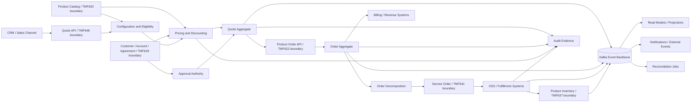
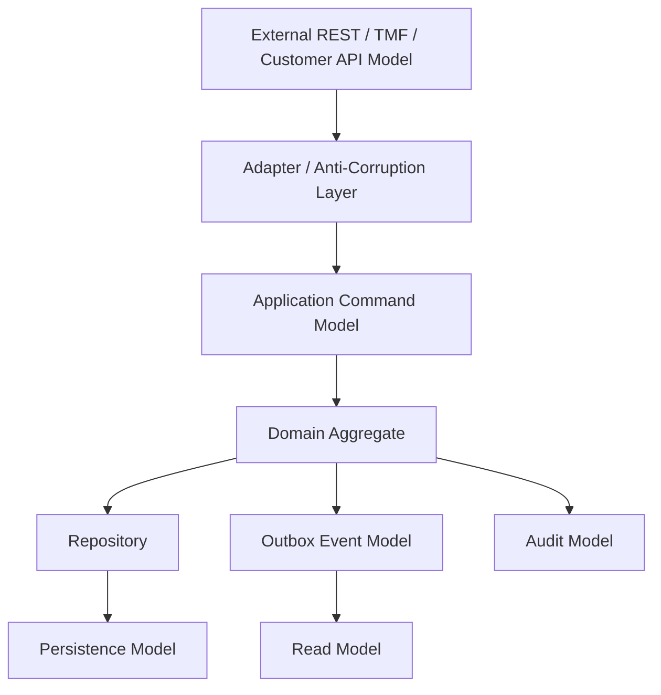

# Part 069 — Capstone: End-to-End Quote-to-Cash Reference Architecture

## 1. Source notes and scope boundary

This capstone connects the previous parts into a single reference architecture.

Public sources used as context:

- CSG publicly positions Quote & Order as CPQ and order management for complex enterprise and B2B telecom selling, including catalog-driven configuration, tailored pricing, enterprise agreements, order management, standard API integration, secure cloud-native platform, and microservices-based architecture.
- CSG describes quote-to-cash as spanning configure, price, quote, contract, order, orchestrate/automate, fulfill, and bill, with catalog-driven consistency across product and pricing information.
- TM Forum describes ODA as a standardized cloud-native enterprise architecture blueprint and the Open APIs as REST-based, technology-agnostic APIs for digital service scenarios.
- TMF620, TMF648, TMF622, TMF629, TMF637, and TMF641 are used as public industry vocabulary for catalog, quote, product order, customer, product inventory, and service order domains.
- Kafka, PostgreSQL, Kubernetes, OAuth2/JWT, OpenTelemetry, and SRE/Well-Architected references are used as public engineering references, not as proof of CSG internal implementation.

This part does **not** assert the real CSG internal architecture.

Treat the architecture below as a serious reference model you can use to ask better onboarding questions, review designs, and compare against the actual product architecture.

If the real system differs, do not assume it is wrong. Ask what constraints created the difference:

- customer deployment constraints,
- historical migration path,
- TMF version support,
- on-prem packaging,
- performance pressure,
- customer-specific integration,
- licensing/commercial requirements,
- operational support model,
- team ownership boundary.

---

## 2. Core thesis

An enterprise Quote & Order platform is not a set of independent CRUD services.

It is a revenue workflow control system.

Its architecture must preserve business truth across:

- product catalog definition,
- product configuration,
- pricing and discounting,
- quote versioning and approval,
- agreement and customer context,
- order capture and validation,
- order decomposition,
- service/fulfillment orchestration,
- inventory synchronization,
- billing handoff,
- audit evidence,
- customer integration,
- cloud/on-prem deployment,
- operational recovery.

The hard part is not that each component is complex in isolation.

The hard part is that each component creates commitments for the others.

A catalog change can invalidate pricing.
A pricing bug can produce revenue leakage.
An approval bug can produce unauthorized commercial commitment.
A quote conversion bug can create duplicate orders.
A decomposition bug can create wrong fulfillment work.
A Kafka replay bug can duplicate side effects.
A PostgreSQL migration bug can corrupt lifecycle history.
A tenant isolation bug can become a security incident.
A weak audit trail can make a correct system non-defensible.

The principal-level skill is to see these cross-entity consequences before production does.

---

## 3. Reference architecture goals

A good Quote-to-Cash architecture should optimize for these properties:

| Property | Meaning |
|---|---|
| Commercial correctness | Price, discount, approval, agreement, and margin logic are explainable and reproducible |
| Lifecycle correctness | Quote/order state transitions are explicit, guarded, and auditable |
| Catalog consistency | Quotes/orders are tied to effective catalog versions or snapshots |
| Integration stability | External contracts evolve without breaking customers or downstream systems |
| Failure containment | Partial failure does not silently corrupt business state |
| Replay safety | Events and jobs can be retried/replayed without duplicate side effects |
| Audit defensibility | The system can reconstruct who did what, when, under what authority, and using what business basis |
| Deployment portability | Cloud, customer-hosted, and on-prem constraints are considered early |
| Operational clarity | Logs, metrics, traces, dashboards, alerts, and runbooks explain system behavior |
| Change safety | PRs, migrations, releases, and data repairs have evidence and rollback/roll-forward thinking |

A weak architecture usually optimizes for local implementation convenience.

A strong architecture optimizes for long-term correctness under change.

---

## 4. End-to-end system map

A reference Quote-to-Cash flow can be modelled as:



The diagram is intentionally not a microservice diagram.

It is a domain consequence diagram.

The most important question is not "how many services exist?"

The better questions are:

- Which component owns the truth?
- Which component owns the decision?
- Which component owns the evidence?
- Which component owns recovery?
- Which component owns external compatibility?
- Which component is allowed to be eventually consistent?
- Which component must reject stale data?

---

## 5. Bounded context map

A practical bounded context map for Quote & Order should separate at least these concerns.

| Context | Primary responsibility | Common mistake |
|---|---|---|
| Catalog | Product/offering/price definitions, lifecycle, effective dates | Treating catalog as static lookup data |
| Configuration | Product compatibility, characteristic validation, bundle rules | Embedding catalog rules in UI only |
| Pricing | Price calculation, discounts, agreement overlays, taxes/fees where applicable | Making price non-reproducible |
| Quote | Commercial proposal, versioning, approval, acceptance | Letting quote mutate after acceptance |
| Approval | Authority, margin guardrails, maker-checker, approval evidence | Checking role but not commercial authority |
| Customer/Account | Customer identity, account hierarchy, party/account references | Copying PII everywhere |
| Agreement/Contract | Enterprise agreement, entitlement, commercial terms | Treating agreements as free-text metadata |
| Product Order | Customer commitment to acquire/change/disconnect products | Merging order capture and fulfillment blindly |
| Decomposition | Translating product intent to technical/service work | Hiding dependency graph in procedural code |
| Service Ordering/Fulfillment | OSS work execution, service activation, fallout | Assuming downstream success is synchronous |
| Product Inventory | Installed base/customer reality | Treating inventory as same thing as catalog |
| Billing Handoff | Financial downstream trigger | Emitting billing event before order is defensibly complete |
| Audit | Business evidence | Confusing debug logs with audit records |
| Integration | Anti-corruption, adapters, customer-specific protocol handling | Polluting core domain with partner quirks |
| Operations | Runbooks, dashboards, release readiness, recovery | Adding observability after incidents only |

Bounded contexts are not always deployed as separate services.

A single service may contain multiple contexts if the team deliberately keeps module boundaries clear.

Multiple services may still form one logical context if they share the same aggregate and release lifecycle.

The real question is not deployment topology.

The real question is semantic ownership.

---

## 6. Model separation: external, domain, persistence, event, and view

A production-grade enterprise system should avoid using one model everywhere.

| Model type | Purpose | Should optimize for |
|---|---|---|
| External API model | Stable contract for consumers | Compatibility, clarity, versioning |
| Domain model | Business rules and invariants | Correctness, expressiveness |
| Persistence model | Durable storage and query efficiency | Integrity, performance, migration safety |
| Event model | Integration and state propagation | Replay safety, compatibility, causation |
| Read model | Query/UI/reporting convenience | Performance, freshness, projection rebuild |
| Audit model | Evidence reconstruction | Immutability, authority, before/after basis |

The common failure is to let external API payloads become the internal domain model.

That creates several problems:

- TMF extension fields leak into core logic.
- Customer-specific fields become mandatory everywhere.
- Persistence schema is optimized for API shape rather than invariant enforcement.
- Event schema becomes too large and unstable.
- Domain refactoring becomes a breaking API change.

A better architecture uses translation layers deliberately.



This separation is not ceremony.

It is what lets the system evolve without breaking consumers or corrupting business truth.

---

## 7. Critical invariant catalog

Use this as a starting point for architecture review and onboarding verification.

### Catalog invariants

- A quote must be traceable to the catalog version or effective catalog snapshot used for configuration and pricing.
- A catalog offering cannot be removed or changed in a way that invalidates accepted quotes without explicit migration/compatibility handling.
- Effective dates must be interpreted consistently across UI, API, pricing, quote, and order conversion.
- Bundle/component relationships must be stable enough to reproduce quote/order decisions.

### Pricing invariants

- Accepted quote price must be reproducible or preserved as immutable snapshot.
- Discount stacking must be deterministic.
- Margin/approval thresholds must be evaluated against the correct customer/account/agreement context.
- Repricing must not silently change an already accepted commercial commitment.
- Manual override must be permissioned, justified, and audited.

### Quote invariants

- A quote cannot be accepted if required approval is missing, stale, or revoked.
- A quote cannot be converted to order twice unless the system explicitly supports multiple orders per quote under clear rules.
- Accepted quote content must be immutable except through explicit revision/amendment flow.
- Expired quote cannot be accepted without revalidation/repricing.

### Order invariants

- Order item action semantics must be explicit: add, modify, delete, noChange, or equivalent internal representation.
- Order state must be derived from item states and orchestration state using deterministic rules.
- Fulfillment cannot be marked complete unless required downstream work reached a terminal success condition.
- Retry must not duplicate external side effects.
- Cancellation is a workflow, not a deletion.

### Event invariants

- Events must include stable aggregate identity, event identity, event type, event version, occurred time, correlation ID, causation ID, tenant context, and producer identity where appropriate.
- Consumers must tolerate duplicate delivery.
- Replay must not produce unauthorized external side effects.
- Schema evolution must be backward/forward compatible according to the system's consumer migration strategy.

### Security and audit invariants

- Tenant context must be enforced in API, DB query, cache key, event, projection, and support tooling.
- Authorization must protect business transitions, not only endpoints.
- Audit must capture actor, authority, before/after, business basis, and correlation.
- Sensitive data must not leak into logs, events, exports, or error messages.

---

## 8. API architecture

The API layer has several jobs:

1. expose stable contracts,
2. validate request shape,
3. authenticate caller,
4. authorize action,
5. map external payload to internal command,
6. enforce idempotency and optimistic concurrency,
7. return useful, compatible errors,
8. attach trace/correlation context,
9. avoid leaking internal persistence model.

A useful API boundary for Quote & Order usually includes:

| API area | Public vocabulary reference | Internal design concern |
|---|---|---|
| Product Catalog | TMF620 | Versioning, effective dates, publish lifecycle |
| Quote Management | TMF648 | Quote item hierarchy, price snapshot, approval evidence |
| Product Ordering | TMF622 | Order item action, lifecycle, cancellation, amendment |
| Customer Management | TMF629 | Customer/account reference, PII boundary, source of truth |
| Product Inventory | TMF637 | Installed base, amendment input, inventory freshness |
| Service Ordering | TMF641 | Decomposition output, fulfillment lifecycle, fallout |

Do not treat TMF alignment as automatic correctness.

TMF can help standardize vocabulary and external integration.

It cannot decide your internal invariants, transaction boundaries, storage model, approval policy, or operational behavior.

### API review questions

- Is this an external API, internal API, or customer-specific adapter?
- Is the change additive or breaking?
- Does it change behavior even if the schema is compatible?
- Are enum additions safe for existing consumers?
- Are nullable fields handled by generated clients?
- Are error codes stable?
- Is idempotency defined for create/submit/convert actions?
- Is optimistic concurrency required?
- Does the response expose more data than necessary?
- Is tenant/account scope enforced before data lookup?

---

## 9. Event architecture

Kafka should be treated as a durable integration and propagation mechanism, not a magic consistency solution.

Use events when they represent something that already happened:

- `QuotePriced`
- `QuoteApprovalRequested`
- `QuoteApproved`
- `QuoteAccepted`
- `QuoteConvertedToOrder`
- `ProductOrderCreated`
- `ProductOrderValidated`
- `OrderDecompositionPlanned`
- `ServiceOrderSubmitted`
- `FulfillmentFalloutDetected`
- `ProductInventoryUpdated`
- `BillingHandoffRequested`

Avoid event names that hide intent:

- `QuoteUpdated`
- `OrderChanged`
- `StatusChanged`
- `PayloadSynced`

Those names often make consumer behavior dependent on payload diff interpretation.

### Event envelope

A serious event envelope should carry:

```json
{
  "eventId": "uuid",
  "eventType": "ProductOrderValidated",
  "eventVersion": 3,
  "aggregateType": "ProductOrder",
  "aggregateId": "order-123",
  "aggregateVersion": 17,
  "tenantId": "tenant-a",
  "occurredAt": "2026-07-08T10:15:30Z",
  "producer": "order-service",
  "correlationId": "corr-...",
  "causationId": "event-or-command-...",
  "schemaRef": "...",
  "payload": {}
}
```

### Event correctness checklist

- Is the event produced transactionally with state change?
- Does the consumer dedupe by event ID or business key?
- Does the partition key preserve required ordering scope?
- Is replay mode safe?
- Is schema evolution compatible?
- Is the event payload snapshot or reference?
- Is tenant context present and enforced?
- Are failed consumers observable?
- Is DLQ handling operationally defined?

---

## 10. PostgreSQL architecture

PostgreSQL is not just where data is stored.

For quote/order systems, it is where business memory becomes durable.

A reference persistence design should include:

| Concern | Possible structure |
|---|---|
| Quote aggregate | `quote`, `quote_item`, `quote_version`, `quote_price_snapshot`, `quote_state_history` |
| Pricing evidence | `price_component`, `discount_application`, `approval_basis`, `margin_snapshot` |
| Approval | `approval_request`, `approval_decision`, `approval_policy_snapshot` |
| Order aggregate | `product_order`, `product_order_item`, `order_state_history` |
| Decomposition | `decomposition_plan`, `fulfillment_task`, `task_dependency` |
| Integration | `integration_attempt`, `external_reference`, `callback_received` |
| Eventing | `outbox_event`, `inbox_processed_event` |
| Audit | append-only audit event tables or audit evidence store |
| Reconciliation | `reconciliation_run`, `reconciliation_discrepancy`, `repair_action` |

### Database design principles

- Use constraints for invariant fragments that the database can enforce reliably.
- Use optimistic locking for aggregate updates that can race.
- Use row locks for work claiming and serialized lifecycle transitions when needed.
- Keep append-only state history for lifecycle reconstruction.
- Prefer explicit columns for query-critical fields; use JSONB carefully for extension/flexible payloads.
- Use migrations as compatibility events, not local refactors.
- Treat backfills and repair scripts as production workflows.

### Database failure questions

- What happens if two requests convert the same quote at the same time?
- What happens if approval is granted while quote is being repriced?
- What happens if order submission succeeds but event publication fails?
- What happens if Kafka event is replayed after schema migration?
- What happens if migration partially completes for an on-prem customer?
- What happens if a support script misses tenant predicate?

If the answer is "that should not happen", the architecture is not done.

---

## 11. Security architecture

Security is not a separate layer after feature logic.

In Quote & Order, security directly protects revenue commitments.

### Authentication

- Validate issuer.
- Validate audience.
- Validate signature.
- Validate expiration and not-before.
- Handle key rotation.
- Distinguish user tokens from service tokens.
- Do not trust ID tokens as API access tokens unless explicitly designed.

### Authorization

Authorization must be checked at command/transition level.

Examples:

| Action | Required authorization question |
|---|---|
| Create quote | Can this actor create quote for this customer/account/tenant? |
| Apply discount | Can this actor apply this discount level under this agreement? |
| Approve quote | Does this actor have authority for this margin/discount/customer segment? |
| Accept quote | Is actor allowed to commit this quote and is approval still valid? |
| Submit order | Can this actor submit order for this account and offering? |
| Retry fulfillment | Is this operational action allowed and audited? |
| Repair data | Is break-glass authorization required? |

### Tenant isolation

Tenant isolation must be consistent across:

- request context,
- domain command,
- repository predicates,
- cache keys,
- Kafka event metadata,
- projection tables,
- logs/traces,
- exports,
- admin/support tools,
- background jobs,
- data repair scripts.

The most dangerous tenant bugs often appear outside normal API paths.

Examples:

- backfill job,
- export job,
- reconciliation query,
- support search screen,
- Kafka replay tool,
- data repair script,
- admin impersonation feature.

---

## 12. Deployment architecture

A reference deployment stack for this series assumes the system may run in different modes:

- managed cloud,
- customer-hosted cloud,
- connected on-prem,
- restricted network on-prem,
- potentially air-gapped environment.

That means architecture must avoid assuming:

- public internet is always available,
- managed Kafka/PostgreSQL behavior is identical everywhere,
- observability backend is centralized,
- CI/CD can directly deploy to all environments,
- secrets rotation is uniform,
- customers upgrade at the same cadence,
- feature flags can be toggled remotely,
- support engineers can directly inspect production resources.

### Kubernetes deployment concerns

- readiness probe must represent traffic readiness, not process existence;
- liveness probe must not kill slow-but-healthy Java startup;
- resource requests/limits must account for JVM/container behavior;
- rolling update must respect in-flight orders and Kafka consumers;
- graceful shutdown must commit/stop safely;
- pod disruption budget should protect availability;
- NetworkPolicy should reduce blast radius;
- config and secret changes must have rollout semantics;
- image provenance and vulnerability posture must be visible.

### GitOps/IaC concerns

- Git is desired state;
- artifact promotion must be immutable;
- environment overlays must be reviewable;
- drift must be detected;
- secrets should not live in plain Git;
- database migration must be coordinated with app rollout;
- rollback is not always possible after data migration;
- on-prem delivery may require packaging, documentation, and customer-run procedures.

---

## 13. Observability architecture

A Quote & Order system must be observable by business journey, not only by service.

You should be able to answer:

- What happened to quote `Q-123`?
- Which catalog version was used?
- Which pricing rules fired?
- Who approved it?
- Why was approval required?
- Which order was created?
- Which fulfillment tasks were produced?
- Which downstream system failed?
- Was the failure retried?
- Was customer impacted?
- Was billing triggered?
- Did audit capture the decision?

### Minimal signal set

| Signal | Examples |
|---|---|
| API latency/error | create quote, price quote, accept quote, submit order |
| Business funnel | quote created, priced, approval requested, approved, accepted, converted |
| Order health | order captured, validated, decomposed, in fulfillment, fallout, completed |
| Kafka health | consumer lag age, outbox backlog, DLQ count, poison message count |
| DB health | slow query, lock wait, deadlock, migration duration, connection pool saturation |
| Integration health | downstream timeout, retry rate, unknown outcome, reconciliation discrepancy |
| Security health | denied action, cross-tenant attempt, token validation failure, admin override |
| Audit health | missing audit event, delayed audit export, audit write failure |

### Trace identity

A trace ID tells you what happened in one technical trace.

A correlation ID ties together one business journey.

A causation ID explains why an event/command occurred.

All three are useful.

Do not collapse them into one magic field.

---

## 14. Testing architecture

A senior testing strategy maps tests to failure risk.

| Risk | Test type |
|---|---|
| Quote state transition bug | Unit/table-driven domain tests |
| Pricing rule regression | Unit + scenario tests with deterministic fixtures |
| MyBatis mapper bug | PostgreSQL integration tests |
| Transaction race | Concurrency integration tests |
| Kafka duplicate event | Consumer idempotency integration tests |
| API compatibility break | OpenAPI/contract tests |
| Event schema break | Schema compatibility tests |
| Migration failure | Migration/backfill tests |
| Tenant leakage | Security/authorization tests |
| Broken quote-to-order journey | E2E journey tests |
| Operational recovery weakness | Game day / runbook exercise |

Testing is not a pyramid copied from a blog.

Testing is a risk coverage strategy.

For mission-critical enterprise systems, the most valuable tests often encode:

- illegal transitions,
- stale snapshots,
- duplicate commands,
- concurrent updates,
- partial downstream failure,
- customer-specific configuration,
- tenant isolation,
- migration compatibility,
- event replay safety.

---

## 15. Operational readiness architecture

A feature is not production-ready because it merged.

It is production-ready when the team can:

- detect whether it works,
- detect whether it fails,
- determine blast radius,
- mitigate safely,
- roll forward or roll back,
- repair data if needed,
- explain customer impact,
- produce audit evidence,
- support cloud/on-prem deployment,
- document known limitations.

### ORR checklist

Before release, ask:

- What business invariant does this change affect?
- What data migration is required?
- What customer integrations can break?
- What Kafka events change?
- What dashboards prove health?
- What alerts detect failure?
- What runbook handles failure?
- What data repair might be required?
- What rollback is safe after migration?
- What on-prem/customer upgrade steps are needed?
- What support team instructions are needed?

---

## 16. Architecture failure model

A capstone architecture is incomplete without failure modelling.

| Failure | Bad architecture response | Strong architecture response |
|---|---|---|
| Duplicate quote acceptance | Creates two orders | Unique constraint + idempotency + audit |
| Pricing rule bug | Silent revenue leakage | Price snapshot + approval evidence + anomaly detection |
| Catalog republish | Accepted quotes mutate | Catalog version snapshot + compatibility checks |
| Kafka replay | External side effects duplicated | Replay-safe consumers + side-effect guard |
| DB migration lock | Production outage | expand-contract + lock testing + rollout plan |
| Fulfillment timeout | Order stuck forever | timeout state + retry/resume + fallout queue |
| Tenant predicate missing | Data leak | tenant enforcement in repository + tests + audit |
| Approval role misconfigured | Unauthorized discount | approval policy snapshot + SoD tests + anomaly alerts |
| On-prem upgrade skipped | Version drift | upgrade matrix + compatibility support window |
| Missing audit write | Non-defensible decision | transactionally written audit/outbox + alert |

Principal-level architecture review is mostly the discipline of asking these questions early.

---

## 17. Internal verification checklist

Use this checklist to compare the reference architecture against the real system.

### Product and domain

- What is the official internal Quote & Order product boundary?
- Which modules are in scope for the team?
- Which customer personas use the product?
- Which workflows are most business-critical?
- Which workflows are customer-specific?
- Which workflows create the most support tickets?

### Architecture and ownership

- What are the actual services/modules?
- Which team owns each domain area?
- What are the service dependencies?
- Where are the context boundaries documented?
- Which dependencies are historical rather than intentional?
- Which shared libraries are mandatory?

### TMF/API

- Which TMF APIs are exposed, consumed, or internally mapped?
- Which TMF versions are supported?
- What extensions are used?
- What conformance requirements exist?
- What API compatibility rules exist?
- Which customer integrations depend on older API behavior?

### Catalog/pricing/quote/order

- Where is catalog versioning implemented?
- Where is pricing calculated?
- Is pricing snapshot immutable after acceptance?
- Where is approval authority evaluated?
- How is quote-to-order idempotency enforced?
- What is the actual order state machine?
- How is amendment/cancellation implemented?

### Kafka/events

- What are the topic names?
- What is the partition key strategy?
- Is there a schema registry?
- What are compatibility rules?
- Is there an outbox/inbox pattern?
- How is replay performed?
- How are DLQ messages handled?

### PostgreSQL/data

- What is the tenant model?
- What are the most important aggregate tables?
- Which constraints enforce invariants?
- Which migrations were historically risky?
- How are backfills run?
- How are repair scripts approved and audited?

### Deployment/operations

- Which deployment modes are supported?
- Which cloud/on-prem variations matter?
- What GitOps/IaC tooling is used?
- What CI/CD gates are required?
- What dashboards are used during incidents?
- What SLOs exist?
- What runbooks exist?
- What recent incidents should be studied?

### Security/audit

- Which identity provider is used?
- How are JWTs validated?
- How is service-to-service auth done?
- How is RBAC/ABAC/approval authority modelled?
- How is tenant isolation tested?
- Where is audit evidence stored?
- What audit exports or compliance reports exist?

---

## 18. Capstone review exercise

Pick one real workflow from the internal system.

Examples:

- create enterprise quote,
- apply customer-specific discount,
- request approval,
- accept quote,
- convert quote to product order,
- decompose product order,
- submit service order,
- handle fulfillment fallout,
- update product inventory,
- trigger billing handoff.

Then produce a one-page architecture review:

1. domain intent,
2. involved contexts,
3. source of truth map,
4. API contract map,
5. state machine map,
6. transaction boundary,
7. Kafka event flow,
8. idempotency strategy,
9. audit evidence,
10. tenant/security boundary,
11. failure modes,
12. observability signals,
13. testing coverage,
14. release/rollback consideration,
15. open questions for senior/principal engineers.

The output should not be a diagram-only document.

The value is the reasoning.

---

## 19. Principal-level review rubric

Use this rubric when reviewing an architecture proposal.

| Dimension | Question |
|---|---|
| Domain correctness | Does the design preserve the actual business invariant? |
| Lifecycle clarity | Are states and transitions explicit? |
| Data ownership | Is source of truth clear? |
| API compatibility | Can consumers survive this change? |
| Event correctness | Are duplicate/replay/ordering/schema risks handled? |
| Transaction safety | Are race conditions and partial failures addressed? |
| Migration safety | Can this roll out safely across environments? |
| Security | Are auth, tenant isolation, PII, and audit addressed? |
| Observability | Can operators detect and diagnose failure? |
| Recovery | Is there a runbook/data repair/reconciliation path? |
| Supportability | Can support teams handle customer issues? |
| Simplicity | Is the complexity justified by real constraints? |
| Evolution | Can the design change without customer breakage? |

A strong design is not the one with the most patterns.

A strong design is the one whose assumptions, constraints, risks, and recovery paths are explicit.

---

## 20. Final mental model

The system has five layers of truth:

1. **Commercial truth** — what was offered, priced, approved, and accepted.
2. **Operational truth** — what was ordered, decomposed, fulfilled, failed, retried, or cancelled.
3. **Data truth** — what is durably recorded and queryable.
4. **Integration truth** — what was communicated to downstream/upstream systems.
5. **Evidence truth** — what can be reconstructed for audit, support, incident response, and customer trust.

A top-tier engineer learns to preserve all five.

That is the essence of production-grade Quote & Order engineering.
