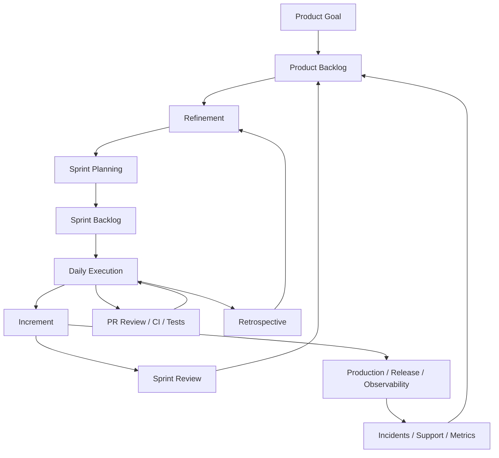

# Part 001 — Scrum as an Engineering Operating System

## 1. Source notes and scope boundary

This part uses public Scrum references and adapts them to senior engineering practice.

Primary public references to verify independently:

- The official 2020 Scrum Guide by Ken Schwaber and Jeff Sutherland.
- Scrum.org material on Scrum Team accountabilities, Scrum events, Product Goal, Sprint Goal, Definition of Done, and Scrum with Kanban.
- Google Engineering Practices on code review as a code-health mechanism.
- The previous Quote & Order engineering series for the enterprise engineering context.

This part does **not** assume CSG implements Scrum exactly according to the Scrum Guide.

Every organization adapts Scrum through tools, roles, delivery constraints, customer commitments, compliance gates, release trains, support models, architecture governance, and product ownership structure.

Use the `Internal verification checklist` sections to verify how your CSG team actually works.

---

## 2. Core thesis

Scrum is often misunderstood as a meeting schedule.

A more useful mental model for senior engineers is this:

> Scrum is an empirical operating system for turning uncertain product work into inspectable increments while continuously reducing delivery, technical, and production risk.

For a Senior Java Software Engineer in a Quote & Order team, Scrum should not mean:

- blindly pulling Jira tickets,
- estimating for the sake of estimation,
- reporting status every day,
- rushing to finish coding before QA,
- treating Sprint Review as a UI demo,
- treating Retrospective as complaint time,
- treating Definition of Done as a checklist nobody believes.

Scrum should mean:

- product uncertainty becomes visible,
- technical uncertainty becomes visible,
- integration risk becomes visible,
- production readiness becomes visible,
- work is sliced into inspectable increments,
- learning happens before the cost of being wrong becomes too high,
- the team adapts based on evidence.

In enterprise systems, this is crucial because the dangerous work is rarely only coding.

The dangerous work is hidden in:

- ambiguous requirements,
- customer-specific behavior,
- dependency on catalog/pricing/order/fulfillment/billing systems,
- API compatibility,
- Kafka event compatibility,
- database migration safety,
- tenant isolation,
- audit requirements,
- operational readiness,
- on-prem/cloud deployment differences.

Scrum can help reveal those risks early — but only if senior engineers use it as a risk-control system.

---

## 3. Scrum is empirical, not predictive

The Scrum Guide frames Scrum as empirical. Empiricism means decisions are based on observation and experience, not speculation.

That matters because enterprise software has high uncertainty:

- A story looks small but touches five services.
- A field looks optional but an external customer relies on it.
- A migration looks simple but locks a hot PostgreSQL table.
- A Kafka event addition looks backward compatible but breaks strict consumers.
- A pricing rule looks local but changes approval behavior.
- A quote state change looks harmless but affects order conversion.

A predictive process says:

> Plan everything, estimate everything, then execute the plan.

An empirical process says:

> Make uncertainty visible, build a small increment, inspect the result, adapt the plan.

Senior engineers must defend the empirical loop.

When a backlog item is unclear, do not pretend it is clear.

When a technical approach is risky, do not hide risk inside a story estimate.

When a release is not production-ready, do not call it done because code merged.

---

## 4. The three pillars translated for engineers

Scrum is commonly described through three pillars:

1. transparency,
2. inspection,
3. adaptation.

These can sound abstract. Translate them into engineering terms.

## 4.1 Transparency

Transparency means the real state of work is visible.

For engineering, transparency includes:

- unclear acceptance criteria are visible,
- dependencies are visible,
- technical risk is visible,
- incomplete tests are visible,
- migration risk is visible,
- production readiness gaps are visible,
- support/on-call impact is visible,
- blocked PRs are visible,
- flaky tests are visible,
- scope change is visible,
- unfinished definition of done is visible.

Bad transparency:

> The story is 80% done.

Better transparency:

> The API implementation is done, but we still lack Kafka contract verification, migration dry-run, tenant isolation negative test, and dashboard update. The work is not production-ready.

A senior engineer improves transparency by naming hidden work.

## 4.2 Inspection

Inspection means the team regularly checks reality.

Engineering inspection happens through:

- backlog refinement,
- Sprint Planning,
- Daily Scrum,
- PR review,
- CI feedback,
- test results,
- architecture review,
- Sprint Review,
- observability,
- support feedback,
- incident review,
- Retrospective.

Inspection is weak when it only asks:

> Are we on track?

Inspection is strong when it asks:

- Is the Sprint Goal still realistic?
- Did we discover new risk?
- Is the increment actually usable?
- Is the production path ready?
- Are we learning from the real system?
- Did customer/stakeholder feedback change priorities?
- Did this sprint reveal systemic friction?

## 4.3 Adaptation

Adaptation means changing behavior based on inspection.

Examples:

- split a story differently,
- change Sprint Goal scope,
- add a spike,
- stop starting new work and finish in-flight work,
- add missing contract test,
- improve Definition of Done,
- change PR review ownership,
- add runbook step,
- improve backlog item template,
- adjust team WIP limit,
- change release sequencing,
- create technical debt item from production incident.

The weakest Scrum teams inspect but do not adapt.

They notice the same problem every sprint and keep repeating it.

A senior engineer should help convert repeated friction into system change.

---

## 5. Scrum as an operating system

Think of Scrum as an operating system with several feedback loops.

Each loop has a purpose.

| Loop | Purpose | Senior engineer contribution |
|---|---|---|
| Product Goal → Backlog | Align work to product direction | Connect technical work to product outcomes |
| Refinement | Convert ambiguity into actionable items | Surface hidden technical/domain risk |
| Sprint Planning | Select achievable, coherent work | Protect Sprint Goal and capacity realism |
| Daily Execution | Inspect progress and blockers | Unblock, de-risk, reduce WIP |
| PR/CI/Test | Inspect implementation quality | Raise correctness and maintainability |
| Sprint Review | Inspect increment with stakeholders | Demo evidence, not just screens |
| Retrospective | Improve system of work | Convert friction into process change |
| Production feedback | Learn from real usage | Feed incidents/metrics/support into backlog |

This is why Scrum is more than meetings.

Scrum is the repeated synchronization of product learning, engineering execution, and production reality.

---

## 6. Why Scrum matters more in enterprise Quote & Order systems

In small products, a story may truly be self-contained.

In Quote & Order systems, a story often crosses many boundaries.

Example story:

> As a sales user, I want to apply a new enterprise discount rule so that eligible customers receive the correct commercial offer.

Hidden engineering surfaces:

- product catalog eligibility,
- price calculation,
- quote item hierarchy,
- discount stacking,
- approval threshold,
- audit evidence,
- quote acceptance,
- quote-to-order conversion,
- billing handoff,
- customer-specific configuration,
- migration of existing rule data,
- API contract for quote response,
- test fixture update,
- support explanation,
- release note,
- observability for pricing failures.

A weak Scrum implementation turns this into one ticket called "add discount rule".

A strong Scrum implementation reveals:

- discovery needed,
- acceptance criteria needed,
- test coverage needed,
- production signal needed,
- rollback/feature flag needed,
- stakeholder review needed.

Senior engineers are often the people who see this hidden work before it becomes a production issue.

---

## 7. Scrum artifacts as engineering control surfaces

Scrum has three artifacts:

1. Product Backlog,
2. Sprint Backlog,
3. Increment.

Each artifact has a commitment:

- Product Backlog → Product Goal,
- Sprint Backlog → Sprint Goal,
- Increment → Definition of Done.

Translate this to engineering.

## 7.1 Product Backlog

The Product Backlog is not just a queue.

It should represent:

- product value,
- risk,
- learning needs,
- technical debt,
- operational work,
- production defects,
- customer commitments,
- architecture evolution,
- compliance/security work.

Senior engineer questions:

- Does the backlog expose technical risk or hide it?
- Are large domain changes split responsibly?
- Are operational tasks visible?
- Are incidents feeding prevention work into the backlog?
- Are migration/refactoring tasks represented as product-enabling work?
- Is technical debt connected to business or operational impact?

## 7.2 Sprint Backlog

The Sprint Backlog is the plan for the Sprint.

It is not a contract that must be completed regardless of new evidence.

Senior engineer questions:

- Does the Sprint Backlog support one coherent Sprint Goal?
- Is the team carrying too much WIP?
- Are dependencies known?
- Are PR review and QA capacity considered?
- Is production support load considered?
- Are risky stories paired with spikes or design work?
- Is the plan adaptable if new risk appears?

## 7.3 Increment

The Increment is the usable output produced during the Sprint.

For enterprise backend systems, "usable" must include more than code merged.

An increment may need:

- tests,
- API documentation,
- contract compatibility,
- migration safety,
- observability,
- security checks,
- audit behavior,
- runbook updates,
- release note,
- feature flag plan.

Senior engineer question:

> Is this increment actually safe to release or only safe to demo?

---

## 8. Scrum events as engineering risk controls

## 8.1 Sprint

The Sprint is the container.

A Sprint creates a timebox for product learning and engineering execution.

For senior engineers, the Sprint should answer:

- What meaningful increment can we create?
- What risk can we reduce?
- What learning can we generate?
- What production readiness evidence can we produce?

A Sprint is not merely a two-week deadline.

## 8.2 Sprint Planning

Sprint Planning answers:

- Why is this Sprint valuable?
- What can be done this Sprint?
- How will the chosen work get done?

Senior engineer focus:

- challenge vague work before commitment,
- identify hidden dependencies,
- surface technical unknowns,
- ensure test/review/QA capacity,
- protect production readiness,
- connect work to Sprint Goal.

Weak Sprint Planning:

> We pulled 40 points because velocity says so.

Strong Sprint Planning:

> We selected three stories that together validate quote approval changes behind a feature flag. We are deliberately not pulling order conversion changes because catalog fixture readiness and approval audit behavior are still unknown.

## 8.3 Daily Scrum

Daily Scrum is not a manager status meeting.

It is a synchronization event for Developers.

Senior engineer focus:

- identify blockers early,
- expose dependency risk,
- reduce WIP,
- coordinate review/testing,
- adapt plan when evidence changes.

Good Daily Scrum language:

- "This story is blocked because the API contract for the downstream adapter is unclear. I need 30 minutes with the integration owner today."
- "The implementation is done, but the migration test failed on old fixtures. We should not pick new work until this is resolved."
- "The PR is waiting for domain review. Can we assign the right reviewer now?"

Bad Daily Scrum language:

- "Yesterday I worked on the ticket. Today I will continue. No blockers."

Even when blockers exist.

## 8.4 Sprint Review

Sprint Review inspects the increment and adapts the Product Backlog.

For enterprise engineering, it should be an evidence review.

Evidence can include:

- behavior demo,
- API example,
- event example,
- dashboard panel,
- runbook snippet,
- migration dry-run result,
- test coverage result,
- before/after metric,
- known limitation,
- stakeholder feedback.

A senior engineer can improve Sprint Review by showing production-relevant evidence, not just UI changes.

Example:

> We changed quote approval behavior. The demo shows the user flow, but we also show the audit event, approval invalidation test, API error response, and dashboard for approval failures.

## 8.5 Sprint Retrospective

Retrospective inspects the team's process.

A strong retro creates one or more real adaptations.

Senior engineer focus:

- convert symptoms into systemic causes,
- distinguish one-off issue from repeated pattern,
- create small actionable improvements,
- avoid blame,
- tie retro actions to measurable signals.

Weak retro action:

> Communicate better.

Strong retro action:

> Add a refinement checklist item for DB migrations: expected row count, lock risk, rollback/roll-forward strategy. Owner: A. Try for two sprints. Review whether migration surprises decrease.

---

## 9. Scrum values translated to enterprise engineering

Scrum names five values:

- commitment,
- focus,
- openness,
- respect,
- courage.

Translate them to senior engineering behavior.

| Scrum value | Senior engineer behavior |
|---|---|
| Commitment | Commit to the Sprint Goal and product quality, not blind ticket completion |
| Focus | Limit WIP and protect team attention from uncontrolled scope churn |
| Openness | Make uncertainty, risk, debt, and blockers visible early |
| Respect | Respect domain experts, QA, support, operations, and historical constraints |
| Courage | Say no-go when production risk is not controlled |

Courage is especially important.

A senior engineer sometimes must say:

- this story is not refined enough,
- this migration is not safe,
- this API change is breaking,
- this feature is not observable,
- this increment is not done,
- this release needs a rollback plan.

The goal is not to block delivery.

The goal is to protect sustainable delivery.

---

## 10. The real Definition of Done problem

Many teams have a Definition of Done that nobody uses deeply.

Example weak DoD:

- code complete,
- tests pass,
- reviewed,
- deployed to QA.

For enterprise Quote & Order work, this may be insufficient.

A stronger DoD may include conditional checks:

### For REST API change

- OpenAPI updated,
- backward compatibility reviewed,
- error model tested,
- authorization tested,
- tenant isolation tested,
- generated client impact considered.

### For Kafka event change

- schema compatibility checked,
- consumer impact reviewed,
- partition key reviewed,
- replay/idempotency considered,
- DLQ/runbook impact considered.

### For DB migration

- expand-contract considered,
- migration tested against old fixtures,
- lock risk reviewed,
- rollback/roll-forward documented,
- on-prem impact considered.

### For production behavior change

- dashboard/log/metric available,
- alert/watch plan considered,
- support/runbook impact considered,
- feature flag or rollback path considered.

Definition of Done is where Scrum and engineering quality meet.

---

## 11. Scrum anti-patterns senior engineers must recognize

## 11.1 Ticket factory Scrum

Symptoms:

- success measured only by ticket count,
- Sprint Goal is vague or absent,
- stories are unrelated,
- review focuses on output, not outcome,
- technical risk is invisible.

Senior response:

- ask for Sprint Goal clarity,
- group work by outcome,
- connect technical work to product risk,
- make hidden work visible.

## 11.2 Mini-waterfall Scrum

Symptoms:

- analysis sprint,
- dev sprint,
- QA sprint,
- hardening sprint,
- release sprint.

Senior response:

- move testing earlier,
- slice vertically,
- make increments usable sooner,
- reduce batch size,
- build DoD into every story.

## 11.3 Velocity theater

Symptoms:

- velocity treated as productivity score,
- estimates gamed,
- teams avoid necessary work because it hurts velocity,
- production incidents not counted but consume capacity.

Senior response:

- use velocity as planning signal only,
- expose interrupt load,
- track flow and quality metrics,
- discuss outcome and risk reduction.

## 11.4 Invisible architecture work

Symptoms:

- architecture decisions happen outside backlog,
- design work is unpaid hidden labor,
- refactoring is done secretly,
- debt is never prioritized.

Senior response:

- create visible spikes/design tasks,
- write ADRs,
- connect architecture work to delivery risk,
- slice architecture improvements into increments.

## 11.5 Done-but-not-releasable work

Symptoms:

- code merged but feature not observable,
- tests incomplete,
- migration not tested,
- support not ready,
- release blocked later.

Senior response:

- strengthen DoD,
- include production readiness in story scope,
- create release-readiness checklist,
- expose gap during Sprint Review.

---

## 12. Applying Scrum to a Quote & Order example

Suppose the Product Backlog item says:

> Support quote expiration rule based on customer segment.

A weak refinement might produce:

- add field `segmentExpirationDays`,
- update quote expiration calculation,
- test happy path.

A senior engineer uses Scrum as an operating system and asks:

### Product/value questions

- Which customer segments?
- Is this configurable per tenant/customer?
- What business outcome does this enable?
- Are existing quotes affected?

### Domain questions

- Does expiration apply to draft, priced, submitted, approved, or accepted quotes?
- Does approval expire independently?
- What happens if price is still valid but quote is expired?
- Can a quote be reactivated?

### API/contract questions

- Is expiration returned in quote API?
- Does error response change when accepting expired quote?
- Are external customers depending on old behavior?

### Data/migration questions

- Is a new column needed?
- Do existing quotes need backfill?
- Is the rule derived from config or persisted snapshot?

### Kafka/event questions

- Is a `QuoteExpired` event emitted?
- Is expiration evaluated synchronously or by scheduled job?
- Are duplicate expiration events safe?

### Testing questions

- Unit tests for calculation?
- Integration tests for persistence?
- E2E test for accept expired quote?
- Contract test for error model?

### Operations questions

- Dashboard for quote expiration failures?
- Runbook for customer complaint?
- Feature flag?
- Rollback path?

This is how Scrum becomes engineering discipline.

---

## 13. Senior engineer responsibilities in Scrum

A senior engineer is not the Product Owner.

A senior engineer is not the Scrum Master.

A senior engineer is not automatically the manager.

But a senior engineer has specific leverage inside Scrum.

### 13.1 During refinement

- surface hidden technical risk,
- propose better slices,
- clarify acceptance criteria,
- identify dependencies,
- suggest spikes when uncertainty is high,
- ensure operational/security/testing concerns are visible.

### 13.2 During Sprint Planning

- help align work to Sprint Goal,
- protect capacity realism,
- identify sequencing constraints,
- avoid overcommitment,
- ensure risky work has discovery/testing time.

### 13.3 During execution

- unblock teammates,
- review PRs effectively,
- reduce WIP,
- coordinate with owners,
- detect when plan needs adaptation.

### 13.4 During Sprint Review

- show technical evidence,
- explain risk reduction,
- gather stakeholder feedback,
- identify follow-up backlog items.

### 13.5 During Retrospective

- avoid blame,
- identify system causes,
- propose small process improvements,
- follow through on actions.

---

## 14. Internal verification checklist

Verify how Scrum actually works in your CSG team.

### 14.1 Scrum implementation

- Does the team explicitly use Scrum?
- Sprint length?
- Are all Scrum events held?
- Are events synchronous, async, hybrid?
- Is Sprint Goal used seriously?
- Is Definition of Done documented?
- Is Product Goal visible?
- Is Product Backlog ordered by Product Owner?
- Is backlog refinement scheduled?
- Are retrospectives action-oriented?

### 14.2 Tooling

- Jira, Azure DevOps, or another tracker?
- How are epics/stories/tasks/bugs/spikes represented?
- Are acceptance criteria required?
- Are dependencies tracked?
- Are technical debt items visible?
- Are support/incident items visible?
- Are release notes linked to backlog items?

### 14.3 Engineering process

- What must be true before merge?
- What must be true before release?
- What is the PR review policy?
- What CI gates exist?
- What test suites run on PR vs nightly vs release?
- Are DB migrations reviewed specially?
- Are API/event changes reviewed specially?
- Are security/tenant changes reviewed specially?

### 14.4 Production context

- Is production work counted in sprint capacity?
- How are incidents handled mid-sprint?
- How are support escalations triaged?
- Who decides if Sprint Goal changes?
- Are postmortem actions added to backlog?
- Are operational improvements prioritized?

### 14.5 Team dynamics

- Who acts as Product Owner?
- Who acts as Scrum Master?
- Is there a tech lead or engineering lead?
- How do senior engineers influence refinement?
- How are disagreements resolved?
- How are architecture decisions made?

---

## 15. Practical exercises

## Exercise 1 — Map Scrum events to engineering risk

For your team's last Sprint, list:

| Event | Risk discovered | Adaptation made | Missed opportunity |
|---|---|---|---|
| Refinement | | | |
| Sprint Planning | | | |
| Daily Scrum | | | |
| PR Review | | | |
| Sprint Review | | | |
| Retrospective | | | |

Ask:

- Which risk surfaced too late?
- Which event could have caught it earlier?
- What small change would improve the loop?

## Exercise 2 — Rewrite a ticket as an engineering increment

Take a current backlog item.

Rewrite it with:

- product outcome,
- domain invariant,
- acceptance criteria,
- API/event impact,
- data impact,
- test strategy,
- observability impact,
- release/rollback consideration.

## Exercise 3 — Find one done-but-not-releasable pattern

Find a recent story that was considered done but still needed release work.

Identify:

- what was missing,
- why it was discovered late,
- whether DoD should change,
- whether refinement should change,
- whether Sprint Review should show additional evidence.

## Exercise 4 — Create your personal Scrum operating checklist

Before each Sprint Planning, ask yourself:

- Which items hide architecture risk?
- Which items need API/event compatibility review?
- Which items need migration or data repair thinking?
- Which items need security/tenant/audit review?
- Which items need operational readiness?
- Which items are too large?
- Which dependencies are not visible?

---

## 16. What good looks like after this part

After this part, you should be able to:

- explain Scrum as an empirical engineering operating system,
- identify Scrum anti-patterns that hurt enterprise delivery,
- translate Scrum artifacts/events into engineering risk controls,
- use Sprint events to improve transparency, inspection, and adaptation,
- connect Definition of Done to production readiness,
- participate in Scrum as a senior engineer without confusing your role with Product Owner or Scrum Master,
- begin using backlog items as risk-discovery artifacts.

---

## 17. Key takeaways

Scrum is not valuable because it has meetings.

Scrum is valuable when those meetings create feedback loops that improve product decisions, engineering safety, and team learning.

For enterprise Quote & Order engineering, Scrum should reveal:

- unclear requirements,
- hidden integration risk,
- unsafe migrations,
- missing tests,
- API/event compatibility risk,
- operational readiness gaps,
- support and production consequences.

A senior engineer's job is to make these risks visible early and help the team adapt before the customer or production system pays the cost.
