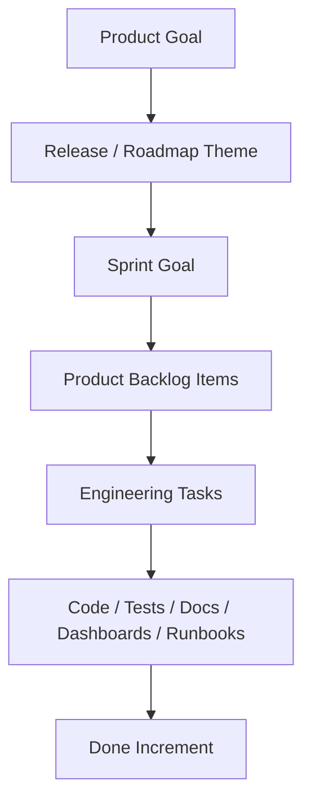

# Part 003 — Product Goal, Sprint Goal, and Engineering Focus

## 1. Source notes and scope boundary

This part uses public Scrum references and adapts them to senior engineering practice.

Primary public references to verify independently:

- The official 2020 Scrum Guide by Ken Schwaber and Jeff Sutherland.
- Scrum.org material on Scrum artifacts and their commitments.
- Scrum.org material on Sprint Goal.
- Previous Quote & Order engineering series content on product goals, quote-to-cash lifecycle, architecture review, production readiness, and technical leadership.

The Scrum Guide defines three artifact commitments:

- Product Backlog → Product Goal.
- Sprint Backlog → Sprint Goal.
- Increment → Definition of Done.

This part does **not** assume your CSG team uses Product Goal or Sprint Goal exactly as described in the official guide.

Some organizations use Jira epics, quarterly objectives, release goals, roadmap themes, PI objectives, customer commitments, or engineering themes instead of explicit Product Goal language.

The practical engineering skill is to find the real goal signal and connect it to daily technical decisions.

Use the `Internal verification checklist` sections to validate the actual goal language and decision process inside your team.

---

## 2. Core thesis

A senior engineer should not treat a Sprint as a container of unrelated tickets.

A senior engineer should ask:

> What product outcome is this Sprint trying to move, and what technical risk must be reduced so that outcome can become real?

In enterprise Quote & Order systems, a Sprint Goal is not only a planning sentence. It should focus engineering judgment.

It should help answer:

- Which backlog items belong together?
- Which item is essential and which is optional?
- Which technical risk threatens the goal?
- Which dependency must be resolved first?
- Which acceptance criteria are truly necessary?
- Which observability or migration work is part of Done?
- Which scope can be cut without destroying the goal?
- Which issue should trigger renegotiation mid-sprint?

Without Product Goal and Sprint Goal clarity, teams fall into ticket factory behavior.

They may complete many tasks while failing to produce a coherent, releasable, valuable, and safe increment.

---

## 3. Goal hierarchy

Think in layers.



A common delivery failure is losing the connection between layers.

Example:

- Product Goal: improve enterprise customer ordering accuracy.
- Sprint Goal: enable validated quote-to-order conversion for enterprise bundle quote.
- Product Backlog Item: convert accepted quote to product order.
- Engineering Task: add mapper for order item insert.

If the team only sees the mapper task, it may miss the real engineering requirements:

- preserve quote version,
- preserve price snapshot,
- create order exactly once,
- map quote item hierarchy correctly,
- emit ProductOrderCreated event,
- record audit event,
- reject stale/expired quote,
- enforce approval evidence,
- expose operational signal for conversion failure.

The goal gives meaning to the implementation.

---

## 4. Product Goal as engineering context

The Product Goal describes a future product state. For a senior engineer, it is not marketing language. It is context for architectural choices.

Example Product Goal:

> Enterprise customers can configure, price, quote, approve, order, and track complex bundled services consistently across sales and fulfillment channels.

Engineering implications:

- catalog versioning must be stable;
- pricing snapshot must be defensible;
- quote approval must be tied to commercial evidence;
- order creation must be idempotent;
- downstream fulfillment must be traceable;
- audit must reconstruct the business journey;
- APIs/events must remain compatible for external integrations;
- deployment model must support customer environments.

A weak engineer hears the Product Goal and waits for tickets.

A strong senior engineer hears the Product Goal and asks:

- Which technical constraints prevent this future state?
- Which existing design choices help?
- Which existing design choices block it?
- Which risks need discovery before commitment?
- Which capabilities need an architecture runway?
- Which operational signals prove progress?

---

## 5. Sprint Goal as engineering focus

A Sprint Goal is the single objective for the Sprint.

For engineering, it should create focus without pretending the exact implementation path is fully known.

Weak Sprint Goal:

> Finish tickets QO-101, QO-102, QO-103, QO-104.

Better Sprint Goal:

> Enable accepted quotes for the enterprise broadband bundle to create a draft product order with preserved quote pricing evidence and observable conversion failures.

The second goal gives the team decision power.

If scope pressure appears, the team can ask:

- Is UI polish essential to this Sprint Goal?
- Is full fulfillment integration essential, or can draft order creation be the increment?
- Is audit evidence essential? Yes, because pricing evidence is part of the goal.
- Is observability essential? Yes, because conversion failure must be diagnosable.
- Is supporting every product offering essential? No, if the Sprint Goal names a specific enterprise bundle.

A good Sprint Goal creates useful boundaries.

---

## 6. Sprint Goal quality rubric

Use this rubric during Sprint Planning.

| Quality | Weak | Strong |
|---|---|---|
| Outcome | Lists tasks | Names product/user/business outcome |
| Focus | Many unrelated objectives | One coherent objective |
| Flexibility | Locks exact implementation | Allows implementation adaptation |
| Testability | Hard to know if achieved | Has observable success criteria |
| Risk clarity | Hides uncertainty | Names risky boundary or assumption |
| Engineering relevance | Ignores quality/operations | Includes production-quality implications |
| Slicing | Too broad | Achievable in one Sprint |

Good Sprint Goal examples for Quote & Order:

- Enable sales users to create and price a simple enterprise quote using a stable catalog snapshot.
- Allow approved quotes to be accepted exactly once and converted into a draft product order.
- Make order fallout visible and resumable for one fulfillment adapter path.
- Add backward-compatible ProductOrderStateChanged event consumption for downstream reporting.
- Reduce quote search latency for support users by improving query/index behavior and dashboard visibility.

Bad Sprint Goal examples:

- Complete backend stories.
- Work on quote module.
- Finish phase 2.
- Refactor order service.
- Implement TMF API.

The bad examples may be real work areas, but they do not create a coherent inspectable outcome.

---

## 7. Engineering focus is not the same as sprint scope

Sprint scope is the set of selected Product Backlog Items.

Engineering focus is the reason those items belong together.

Example selected PBIs:

- Add quote acceptance endpoint.
- Add order creation service.
- Add order item mapper.
- Add outbox event.
- Add audit history.
- Add integration test.

Engineering focus:

> Convert an accepted quote into a durable, auditable, idempotent draft order.

This focus helps decide implementation details:

- transaction boundary around quote acceptance and order creation;
- unique constraint for quote-to-order conversion;
- outbox event emitted after durable state;
- audit history in same transaction;
- duplicate request behavior;
- error semantics when quote is expired;
- tests for duplicate acceptance and concurrent calls.

If an engineer works only from task scope, they may implement each item individually and miss the cross-cutting invariant.

---

## 8. Goal-oriented backlog selection

During Sprint Planning, a senior engineer should evaluate backlog items against the goal.

Ask:

1. Is this item essential to achieving the Sprint Goal?
2. Is this item supportive but optional?
3. Is this item unrelated but convenient?
4. Is this item a hidden dependency?
5. Is this item actually discovery work?
6. Is this item too risky to commit without spike/refinement?
7. Does this item require architecture, security, DB, or platform review?
8. Does this item produce a Done increment or only partial internal progress?

### Example

Sprint Goal:

> Allow enterprise sales user to submit discount-heavy quote for approval with audit evidence.

Candidate backlog items:

| Backlog item | Fit | Reason |
|---|---|---|
| Add approval-required calculation | Essential | Core behavior |
| Add submit-for-approval endpoint | Essential | Core behavior |
| Add approval audit event | Essential | Evidence requirement |
| Add UI page animation | Optional | Not necessary for outcome |
| Refactor all quote mappers | Unrelated/risky | Too broad unless blocking |
| Add discount threshold test fixtures | Essential/supportive | Needed for confidence |
| Add dashboard for approval failures | Supportive | Strong if release intends production use |

Goal clarity turns planning into prioritization.

---

## 9. Product Goal to architecture runway

Enterprise products need some architecture runway.

Architecture runway means technical capability built ahead of or alongside feature work to enable future value.

But architecture runway can become architecture theater if it is disconnected from Product Goal.

### 9.1 Valid architecture runway

Product Goal:

> Support customer-specific quote approval workflows for large enterprise deals.

Valid runway:

- define approval policy model;
- centralize approval authority checks;
- create audit event schema;
- add approval state machine tests;
- document extension points;
- add feature flag for tenant-specific rollout.

### 9.2 Weak architecture runway

Product Goal:

> Support customer-specific quote approval workflows.

Weak runway:

- introduce a generic workflow engine without proving domain fit;
- rewrite all quote services;
- create abstraction framework for all future approval types;
- build an internal platform before current workflow is understood.

Senior engineers should protect the team from both extremes:

- no runway, causing feature hacks;
- too much runway, causing speculative architecture.

---

## 10. Sprint Goal and technical debt

Technical debt should be connected to a product or operational goal.

Weak framing:

> We need to refactor this because it is ugly.

Stronger framing:

> The Sprint Goal depends on adding a new approval invalidation rule. Current approval logic is duplicated in three code paths, which makes the new rule likely to be inconsistent. We should include a small refactoring to centralize approval invalidation before adding the new rule.

This is not gold-plating. It is goal protection.

### 10.1 Technical debt inclusion test

Include a debt item in Sprint if it is needed for one of these:

- achieve the Sprint Goal safely;
- prevent high-risk regression;
- make acceptance criteria testable;
- reduce known incident recurrence;
- unblock future roadmap item;
- reduce production support burden;
- make migration/release safer.

Do not include it merely because it is annoying unless annoyance has measurable cost.

---

## 11. Sprint Goal and uncertainty

Some work is uncertain.

Scrum does not require pretending uncertainty does not exist.

A good Sprint Goal can include discovery if the goal is framed properly.

Weak Sprint Goal:

> Implement integration with fulfillment system.

Better discovery Sprint Goal:

> Prove whether the new fulfillment adapter can support order item completion callbacks with idempotent correlation, and produce a design decision for implementation.

Possible Sprint output:

- spike result;
- adapter contract analysis;
- failure mode list;
- prototype;
- ADR;
- next backlog split;
- test harness decision.

Discovery can be valuable if the output is a decision, not just activity.

---

## 12. Goal decomposition for Quote & Order work

Use this decomposition method.

### 12.1 Start with business capability

Example:

> Sales user can create an approved quote and convert it into a product order.

### 12.2 Identify domain invariants

- Quote must be valid.
- Price must be calculated from correct catalog/agreement context.
- Approval must exist when required.
- Accepted quote must be immutable or version-stable.
- Order must be created once.
- Audit must record acceptance/conversion.

### 12.3 Identify system boundaries

- REST API.
- Quote service.
- Pricing/catalog service.
- Approval service or module.
- PostgreSQL tables.
- Kafka outbox.
- Order service.
- Fulfillment adapter.
- Observability.

### 12.4 Choose a thin vertical slice

Good Sprint slice:

> Create draft product order from approved quote for one product bundle, without fulfillment submission yet, preserving quote price and audit evidence.

This is a coherent increment.

It does not attempt everything.

### 12.5 Define inspectable evidence

- API response shows created order.
- DB state has order and order items.
- Quote references order or conversion record.
- Audit event exists.
- Outbox event exists if required.
- Duplicate acceptance does not create second order.
- Dashboard/log can diagnose conversion failure.

---

## 13. Sprint Goal and Definition of Done

Sprint Goal says what the team is trying to achieve.

Definition of Done says what quality threshold the Increment must meet.

They should reinforce each other.

Example:

Sprint Goal:

> Enable quote acceptance to create a draft order for enterprise bundle quote.

Definition of Done implications:

- unit tests for lifecycle guards;
- integration tests for DB transaction and idempotency;
- API contract updated;
- audit event verified;
- outbox event verified;
- logs include correlation IDs;
- runbook/dashboard updated if released;
- migration backward compatible;
- security/tenant tests pass.

If the team says the Sprint Goal is achieved but DoD is not met, the Increment is not Done.

A senior engineer should not allow goal language to become a loophole for quality.

---

## 14. Goal conflicts

Enterprise teams often face conflicting goals.

Examples:

- Product wants feature scope.
- Security wants additional checks.
- Platform wants migration safety.
- Support wants diagnostics.
- Customer wants urgent fix.
- Engineering wants refactoring.

A senior engineer helps make trade-offs explicit.

### 14.1 Conflict template

Use this in planning or mid-sprint discussion:

```md
## Goal conflict

Sprint Goal:

Conflicting request:

Impact if included:
- Scope:
- Risk:
- Timeline:
- Quality:
- Production readiness:

Impact if deferred:
- Customer:
- Product:
- Technical:
- Operational:

Recommendation:

Decision owner:
```

This prevents hidden scope changes.

---

## 15. Mid-sprint adaptation

Sprint Goal gives flexibility.

If a selected backlog item becomes unnecessary or impossible, the team can adapt the Sprint Backlog while preserving the Sprint Goal.

Example:

Sprint Goal:

> Make order fallout visible and diagnosable for the fulfillment adapter.

Mid-sprint discovery:

- UI story is larger than expected.
- Backend already has hidden fallout state but no dashboard/log.

Possible adaptation:

- defer full UI page;
- add API endpoint plus dashboard/logging;
- create follow-up UI story;
- still achieve diagnosability goal.

Bad adaptation:

- abandon fallout goal;
- pull unrelated bug tickets;
- declare Sprint successful because many tasks were completed.

The Sprint Goal should guide adaptation.

---

## 16. Senior engineer behaviors during Sprint Planning

During Sprint Planning, a senior engineer should contribute more than estimates.

### 16.1 Ask goal-clarifying questions

- What outcome do we need by Sprint end?
- Which user/customer/system benefits?
- What is the minimum inspectable increment?
- Which behavior must be production-ready?
- What can be deferred without invalidating the goal?

### 16.2 Ask risk questions

- Which dependency is least understood?
- Which data migration is hidden?
- Which API/event contract changes?
- Which security/tenant boundary changes?
- Which test environment is required?
- Which downstream team must align?

### 16.3 Ask quality questions

- What does Done mean for this item?
- What tests are required?
- What logs/metrics/traces are required?
- Is a runbook or dashboard update required?
- Is customer documentation required?

### 16.4 Offer slicing options

Do not only say "too big".

Offer slices:

- one product type;
- one tenant configuration;
- API-only before UI;
- draft order before fulfillment;
- read path before write path;
- feature flag disabled by default;
- spike before implementation;
- migration expand phase before behavior change.

Senior engineers are useful when they turn risk into options.

---

## 17. Product Goal and engineering metrics

A Product Goal should influence which metrics matter.

Example Product Goal:

> Improve order fulfillment reliability for enterprise customers.

Relevant engineering/product metrics:

- order fallout rate;
- order completion latency;
- duplicate order rate;
- fulfillment adapter error rate;
- order stuck-state count;
- manual repair count;
- customer support tickets related to fulfillment;
- time to diagnose stuck orders.

Irrelevant or insufficient metrics:

- number of tickets closed;
- story points completed;
- number of commits;
- lines of code changed.

Velocity can be a planning signal, but it is not product progress.

A senior engineer should help connect Product Goal to outcome and health metrics.

---

## 18. Example: CPQ Product Goal to Sprint Goals

Product Goal:

> Enterprise sellers can create commercially accurate quotes for complex bundled products with auditable approval evidence.

Possible Sprint Goal sequence:

### Sprint A

> Establish stable catalog and pricing fixture for one enterprise bundle quote.

Engineering focus:

- catalog snapshot;
- price calculation;
- test fixture;
- line/total consistency.

### Sprint B

> Allow quote draft creation and pricing persistence for the enterprise bundle.

Engineering focus:

- quote aggregate;
- quote item hierarchy;
- pricing snapshot persistence;
- API contract.

### Sprint C

> Enable approval requirement detection and submit-for-approval workflow.

Engineering focus:

- approval threshold;
- state transition;
- audit event;
- negative authorization tests.

### Sprint D

> Enable approved quote acceptance with immutable commercial evidence.

Engineering focus:

- acceptance command;
- approval validity;
- stale price guard;
- audit;
- idempotency.

### Sprint E

> Convert accepted quote into draft product order without fulfillment submission.

Engineering focus:

- quote-to-order mapping;
- idempotent conversion;
- order item hierarchy;
- conversion event.

This is goal-driven slicing.

---

## 19. Example: Order Management Product Goal to Sprint Goals

Product Goal:

> Enterprise orders can be decomposed, fulfilled, monitored, and recovered reliably across downstream fulfillment systems.

Possible Sprint Goal sequence:

### Sprint A

> Model order decomposition output for one product family and validate task graph correctness.

### Sprint B

> Persist fulfillment tasks and emit service order request with idempotent correlation.

### Sprint C

> Process success/failure callbacks for the fulfillment adapter and update order item state.

### Sprint D

> Surface fallout state and provide operator-visible diagnostics.

### Sprint E

> Add safe retry/resume capability for failed fulfillment tasks.

Each Sprint is an increment toward the Product Goal.

Each Sprint also reduces a different technical risk.

---

## 20. Anti-patterns

### 20.1 Ticket bundle Sprint Goal

> Sprint Goal: finish QO-123, QO-124, QO-125.

This is not a goal. It is an inventory list.

### 20.2 Theme-only Sprint Goal

> Sprint Goal: work on quote improvements.

Too vague to guide trade-offs.

### 20.3 Architecture-only Sprint Goal

> Sprint Goal: refactor order service.

May be valid if linked to outcome, but weak alone.

Better:

> Centralize order state transitions so cancellation and fallout changes can be implemented with consistent audit and outbox behavior.

### 20.4 Fake commitment

The Sprint Goal says one thing, but the Sprint Backlog contains unrelated work because everyone had separate priorities.

### 20.5 No adaptation

Team discovers the plan is wrong but continues executing original tasks because "that is what we committed".

Scrum commitment is to the Sprint Goal, not blind adherence to a flawed task list.

### 20.6 Done theater

Team says Sprint Goal achieved, but tests, observability, documentation, migration safety, or security review are incomplete.

---

## 21. Internal verification checklist

Use this inside your CSG team.

### 21.1 Product Goal

- Is there an explicit Product Goal?
- If not, what artifact plays that role: roadmap, epic, OKR, release goal, customer commitment?
- Who owns it?
- How often is it reviewed?
- How do engineers see it?
- Is it connected to product metrics?
- Is it connected to architecture runway?

### 21.2 Sprint Goal

- Are Sprint Goals explicitly written?
- Are they outcome-based or ticket-list-based?
- Who drafts them?
- Does the team negotiate them?
- Are they used during Daily Scrum?
- Are they inspected during Sprint Review?
- Are missed Sprint Goals discussed in Retrospective?

### 21.3 Backlog selection

- Are backlog items selected because they support a goal?
- Are dependencies visible?
- Are technical enablers linked to product outcomes?
- Are spikes timeboxed with decision outputs?
- Are production-readiness tasks part of planning?

### 21.4 Engineering focus

- Does the team identify domain invariants during planning?
- Does the team identify API/event/DB/security impact?
- Does the team identify observability/runbook impact?
- Does the team define what can be cut if scope pressure appears?

### 21.5 Metrics

- Which metrics prove progress toward the Product Goal?
- Which metrics are only activity metrics?
- Are Sprint Review demos connected to outcome evidence?
- Are production signals used to adjust backlog priority?

---

## 22. Practical exercises

### Exercise 1 — Rewrite weak Sprint Goals

Rewrite these into stronger Sprint Goals.

1. Finish backend stories for quote approval.
2. Work on order management improvements.
3. Refactor pricing code.
4. Implement Kafka event changes.
5. Fix production bugs.

A strong rewrite should include:

- user/system outcome;
- capability boundary;
- risk or quality condition;
- inspectable evidence.

### Exercise 2 — Map one Sprint Backlog to one Sprint Goal

Take a recent Sprint Backlog.

Classify each item:

- essential to Sprint Goal;
- supportive;
- unrelated;
- hidden dependency;
- discovery;
- production readiness;
- tech debt.

Discuss whether the Sprint Goal was real or invented after selecting tickets.

### Exercise 3 — Identify architecture runway

Pick one roadmap item.

Ask:

- What technical capability must exist before the feature is safe?
- Which part can be built incrementally?
- Which part is speculative?
- Which part needs a spike?
- Which part needs ADR/design doc?

### Exercise 4 — Goal-to-DoD mapping

Pick one Sprint Goal.

Define what Done means across:

- code;
- tests;
- API contract;
- event contract;
- DB migration;
- security/tenant;
- audit;
- observability;
- runbook/release note.

---

## 23. Senior engineer self-check

At Sprint Planning, ask yourself:

- Can I explain the Sprint Goal without listing ticket IDs?
- Can I explain why each selected item matters?
- Can I identify the riskiest assumption?
- Can I suggest a smaller safe slice?
- Can I identify what must be included in Done?
- Can I tell what should be cut first if the Sprint is overloaded?
- Can I explain how this Sprint moves the Product Goal?

If the answer is no, your first contribution is not coding.

Your first contribution is clarity.

---

## 24. What good looks like after this part

After this part, you should be able to:

- distinguish Product Goal, Sprint Goal, Sprint Backlog, and task lists;
- connect engineering work to product outcomes;
- use Sprint Goal to guide backlog selection and trade-offs;
- identify goal-relevant technical risk;
- slice Quote & Order work into coherent increments;
- protect quality through Definition of Done;
- help a Scrum Team avoid ticket factory behavior.

---

## 25. Final mental model

Product Goal gives direction.

Sprint Goal gives focus.

Definition of Done gives quality threshold.

Senior engineering turns those three into daily technical decisions.

For enterprise Quote & Order work, this means every Sprint should move a real product capability while reducing the technical and operational risk that could prevent that capability from surviving production.
