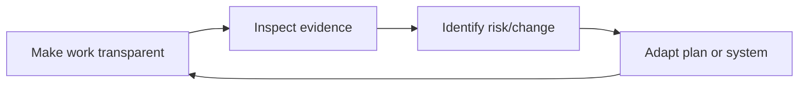

# Part 004 — Scrum Events as Risk Control Loops

## 1. Source notes and scope boundary

This part uses public Scrum references and adapts them to senior engineering practice.

Primary public references to verify independently:

- The official 2020 Scrum Guide by Ken Schwaber and Jeff Sutherland.
- Scrum.org material introducing Scrum Events.
- Previous Quote & Order engineering material on operational readiness, incident thinking, PR review, architecture review, production data repair, and technical leadership.

The Scrum Guide describes Scrum events as formal opportunities for inspection and adaptation.

This part does **not** assume your CSG team runs Scrum events exactly as written in the guide.

Some teams combine events, use async updates, operate across time zones, have additional release planning ceremonies, use Kanban flow metrics, or run architecture/security reviews outside Scrum events.

The practical skill is to use each event as a risk-control loop, not as meeting theater.

---

## 2. Core thesis

Scrum events are not meetings for reporting work.

They are structured control points for reducing uncertainty.

For senior engineers, each event should answer a risk question.

| Scrum event | Senior engineering risk question |
|---|---|
| Sprint | Can we create a Done, inspectable increment inside this timebox? |
| Sprint Planning | Are we committing to the right goal, scope, and risk profile? |
| Daily Scrum | Are we still on track, or has new risk emerged? |
| Sprint Review | Did we produce valuable evidence and what did we learn? |
| Sprint Retrospective | How must our system of work improve? |

If an event does not improve transparency, inspection, or adaptation, it is being underused.

In enterprise Quote & Order systems, the risk surface is too large for Scrum events to be casual.

A single Sprint can include:

- domain ambiguity,
- pricing correctness,
- approval authority,
- API compatibility,
- Kafka event behavior,
- PostgreSQL migration safety,
- tenant isolation,
- Kubernetes deployment changes,
- test environment problems,
- customer-specific behavior,
- support readiness.

Scrum events should expose these risks early enough to act.

---

## 3. The risk-control loop model

Every Scrum event should follow this pattern.



Weak event:

- people talk,
- status is shared,
- nothing changes.

Strong event:

- evidence is inspected,
- assumptions are challenged,
- decisions are made,
- backlog/sprint/process changes.

A senior engineer should help convert events from conversation into adaptation.

---

## 4. The Sprint as the container

The Sprint is the container for all other Scrum events and for creating an Increment.

From an engineering perspective, a Sprint creates constraints:

- limited time;
- selected goal;
- selected backlog;
- capacity assumptions;
- quality threshold;
- feedback opportunity at the end.

The constraint is useful.

It forces slicing.

It forces trade-offs.

It forces inspection.

But the Sprint becomes harmful when the team treats it as a mini-deadline for arbitrary scope.

### 4.1 Good Sprint behavior

A good Sprint has:

- coherent Sprint Goal;
- small enough backlog items;
- visible risk;
- active adaptation;
- integrated testing;
- production-readiness work;
- inspectable Increment.

### 4.2 Bad Sprint behavior

A bad Sprint has:

- unrelated tickets;
- hidden dependencies;
- testing deferred;
- PRs merged late with no review time;
- integration discovered after Sprint;
- no outcome demo;
- unfinished work renamed as done;
- Retrospective repeats same issues.

### 4.3 Senior engineer role during the Sprint

During the Sprint, a senior engineer should watch for drift:

- Is work still connected to Sprint Goal?
- Are hidden dependencies emerging?
- Are PRs too large or too late?
- Is testing lagging behind coding?
- Is quality being deferred?
- Are blocked items actually escalated?
- Does new discovery require renegotiation?
- Are production-readiness tasks still included?

Senior engineers should help the team adapt before the Sprint becomes a rescue mission.

---

## 5. Sprint Planning as commitment negotiation

Sprint Planning is not just selecting tickets.

It should answer:

1. Why is this Sprint valuable?
2. What can be Done this Sprint?
3. How will the selected work get Done?

For senior engineers, it is the main opportunity to prevent predictable failure.

### 5.1 Risks to inspect during Sprint Planning

| Risk type | Planning question |
|---|---|
| Domain ambiguity | Do we understand the business rule and lifecycle state? |
| Technical ambiguity | Do we know enough to implement, or is a spike needed? |
| Dependency risk | Are upstream/downstream teams ready? |
| Integration risk | Is the external API/event contract clear? |
| Data risk | Is a migration/backfill required? |
| Security risk | Does this touch auth, tenant, approval, audit, PII? |
| Quality risk | What tests prove Done? |
| Operations risk | What dashboard/runbook/alert is required? |
| Capacity risk | Is the Sprint overloaded given support/on-call load? |
| Review risk | Are there enough reviewers with the right domain knowledge? |

### 5.2 Planning output should be more than estimates

A strong Sprint Planning output includes:

- Sprint Goal;
- selected PBIs;
- rough implementation approach;
- risk list;
- dependency list;
- test strategy;
- review ownership;
- feature flag/release approach if relevant;
- DoD implications;
- cutline for optional work.

### 5.3 Quote & Order planning checklist

For each selected item, ask whether it touches:

- quote lifecycle;
- pricing snapshot;
- catalog version;
- approval authority;
- quote-to-order conversion;
- order state machine;
- fulfillment adapter;
- billing handoff;
- customer/account agreement;
- REST/TMF API;
- Kafka event;
- PostgreSQL schema;
- tenant isolation;
- audit evidence;
- migration/release/rollback.

If yes, planning must include more than story points.

### 5.4 Planning anti-patterns

#### Anti-pattern: pre-filled Sprint Backlog

The team arrives and the Sprint is already decided.

Impact:

- weak commitment;
- hidden risk;
- engineers become task takers;
- Sprint Goal becomes decorative.

#### Anti-pattern: estimate theater

Team spends time debating 5 vs 8 but does not discuss failure modes.

Impact:

- false precision;
- predictable surprises;
- risk ignored.

#### Anti-pattern: capacity denial

Team plans as if production incidents, reviews, support, and meetings do not exist.

Impact:

- chronic spillover;
- quality shortcuts;
- hidden overtime.

#### Anti-pattern: architecture invisible

Feature story requires design/migration/event compatibility, but planning only includes implementation task.

Impact:

- late blockers;
- rushed PR review;
- unsafe release.

---

## 6. Daily Scrum as engineering synchronization

Daily Scrum is often degraded into individual status reporting.

A better mental model:

> Daily Scrum is the team's shortest feedback loop for inspecting progress toward the Sprint Goal and adapting the Sprint Backlog.

The key question is not:

> What did everyone do yesterday?

The key question is:

> What changed that affects our ability to achieve the Sprint Goal safely?

### 6.1 Useful Daily Scrum signals

Raise signals such as:

- dependency blocked;
- requirement changed;
- test environment broken;
- migration risk discovered;
- PR too large;
- reviewer unavailable;
- API contract unclear;
- Kafka schema issue;
- production incident interrupt;
- flaky test blocking confidence;
- performance issue discovered;
- story bigger than expected;
- security concern discovered;
- Sprint Goal scope needs renegotiation.

### 6.2 Daily Scrum questions for senior engineers

Ask:

- Are we closer to the Sprint Goal than yesterday?
- What new information did we learn?
- Which item is most at risk?
- Which PR needs review today?
- Which test or environment issue blocks Done?
- Which decision is waiting for Product Owner, architect, security, platform, or downstream team?
- Is any work drifting outside the Sprint Goal?
- Do we need to adapt the Sprint Backlog?

### 6.3 Daily Scrum for asynchronous work

For distributed teams, async updates may help.

A good async update contains:

```md
## Sprint Goal impact
- On track / at risk / blocked

## Yesterday / latest progress
- Meaningful progress, not task trivia

## Today
- Next step toward goal

## Risks/blockers
- Explicit owner and needed action

## Review/help needed
- PR/design/test/support need
```

Do not turn async updates into logs nobody reads.

The team still needs adaptation.

### 6.4 Daily Scrum anti-patterns

#### Anti-pattern: manager status report

Everyone reports to one person.

Impact:

- team does not self-manage;
- blockers become invisible between engineers.

#### Anti-pattern: no adaptation

Blockers are mentioned, but no one changes the plan.

Impact:

- same blocker repeats for days.

#### Anti-pattern: too much detail

People explain every implementation step.

Impact:

- real risk is buried.

#### Anti-pattern: hidden work

Engineers work on unplanned or unrelated tasks without making it visible.

Impact:

- Sprint Goal becomes unreliable.

---

## 7. Sprint Review as evidence inspection

Sprint Review is not a demo ceremony.

It is a product and engineering inspection event.

The team inspects the Increment and adapts the Product Backlog.

For enterprise software, a review should show evidence.

### 7.1 Evidence demo vs feature demo

Weak demo:

> Here is the button. It works.

Strong evidence demo:

> A sales user can create a quote for this enterprise bundle, the price snapshot is persisted with catalog version, approval is required above threshold, unauthorized approval is denied, approved quote can be accepted once, and the audit trail shows actor/reason/correlation ID. The API contract and integration tests are included. Fulfillment integration is intentionally out of scope and is the next slice.

The strong demo helps stakeholders understand real capability and remaining risk.

### 7.2 What to demo for backend work

Backend work can be demoed.

Show:

- API request/response;
- state transition;
- event produced;
- DB evidence if appropriate;
- dashboard panel;
- log/trace correlation;
- error path;
- audit record;
- performance before/after;
- migration dry-run result;
- contract diff;
- test result summary;
- runbook update.

Sprint Review should not require a UI to be valuable.

### 7.3 Review questions for Quote & Order

Ask:

- What new product capability exists?
- Which customer/user/system can use it?
- Which lifecycle states are supported?
- Which edge cases are intentionally not supported yet?
- Which APIs/events changed?
- Which operational signals prove health?
- Which remaining risks should update the Product Backlog?
- Did we learn something that changes roadmap priority?

### 7.4 Product Backlog adaptation

A good Sprint Review often creates backlog changes:

- new edge case discovered;
- customer feedback changes priority;
- implementation reveals dependency;
- incident evidence changes risk priority;
- technical debt becomes product risk;
- performance measurement changes scope;
- support workflow needs improvement;
- rollout needs additional readiness work.

If Sprint Review never changes the backlog, it may not be inspecting deeply enough.

---

## 8. Sprint Retrospective as system improvement

Retrospective is not group therapy and not blame allocation.

It is the team's inspect-and-adapt loop for the way of working.

For senior engineers, Retrospective is where recurring engineering friction should become process/system improvement.

### 8.1 Retrospective input signals

Bring evidence:

- carryover items;
- blocked time;
- PR review latency;
- CI failures;
- flaky tests;
- escaped defects;
- production incidents;
- rework;
- unclear acceptance criteria;
- mid-sprint scope changes;
- dependency delays;
- deployment failures;
- support interrupts;
- missing runbooks;
- noisy alerts.

### 8.2 Retrospective output quality

Weak action item:

> Improve communication.

Better action item:

> Add a required `API/Event/DB/Security impact` section to refinement notes for Quote & Order stories touching public endpoints, Kafka events, migrations, or authorization. Trial for two Sprints. Owner: X. Inspect in next retro.

Good retro actions are:

- specific;
- owned;
- time-bounded;
- inspectable;
- connected to observed friction;
- small enough to try.

### 8.3 Retrospective patterns for engineering teams

#### Pattern: recurring blocker analysis

List top blockers and classify:

- environment;
- dependency;
- review;
- unclear requirement;
- flaky tests;
- architecture decision;
- production interrupt.

Pick one systemic fix.

#### Pattern: escaped defect analysis

For each escaped defect:

- Which test should have caught it?
- Was acceptance criteria missing?
- Was review checklist incomplete?
- Was domain invariant undocumented?
- Was production signal missing?

Create prevention action.

#### Pattern: flow review

Inspect:

- time in development;
- time waiting for review;
- time waiting for QA;
- time blocked by environment;
- time after merge before deploy.

Improve one bottleneck.

#### Pattern: DoD gap review

Ask:

- Which Done items were skipped or rushed?
- Why?
- Is DoD unrealistic or was planning overloaded?
- What change makes DoD achievable earlier?

### 8.4 Retrospective anti-patterns

#### Anti-pattern: repeated same complaint

If the same issue appears every retro, the retro system is failing.

#### Anti-pattern: no owner

Action item without owner is a wish.

#### Anti-pattern: too many actions

A long action list usually means no action.

#### Anti-pattern: blame language

Blame reduces transparency.

Use system language:

- What condition allowed this?
- What signal was missing?
- What guardrail would help?
- What decision was unclear?

---

## 9. Scrum events and production work

Production work often disrupts Scrum teams.

Examples:

- incident;
- customer escalation;
- data repair;
- urgent security issue;
- release rollback;
- flaky production deployment;
- environment outage;
- urgent support investigation.

Scrum events should make this visible.

### 9.1 Sprint Planning

Plan capacity realistically if support/on-call load exists.

Ask:

- Who is on call?
- What historical interrupt rate exists?
- What release work is expected?
- Is a buffer needed?
- Which Sprint Goal is resilient to interruptions?

### 9.2 Daily Scrum

Surface production interrupts immediately.

Ask:

- Does this threaten Sprint Goal?
- Is it a one-person investigation or team issue?
- Does PO need to renegotiate scope?
- Does it create follow-up backlog?

### 9.3 Sprint Review

Show production learning as product learning.

Example:

- incident revealed approval audit gap;
- support tickets show quote search poor UX;
- dashboard shows order fallout trend;
- customer escalation validates backlog priority.

### 9.4 Retrospective

Convert production interruptions into systemic improvement:

- better alert;
- better runbook;
- better test;
- better feature flag;
- better data repair tool;
- better ownership.

---

## 10. Scrum events and technical leadership

Senior engineers should not dominate Scrum events.

They should improve the quality of inspection and adaptation.

### 10.1 During Planning

Contribute:

- risk framing;
- slicing options;
- dependency clarity;
- technical enabler identification;
- DoD implications.

Avoid:

- taking over PO decision;
- turning planning into architecture lecture;
- blocking every item for perfect certainty.

### 10.2 During Daily Scrum

Contribute:

- blocker resolution;
- review prioritization;
- risk escalation;
- adaptation suggestion.

Avoid:

- status interrogation;
- solving every technical detail inside the event;
- creating dependency on yourself.

### 10.3 During Sprint Review

Contribute:

- evidence demo;
- technical risk explanation in product language;
- transparency about unfinished risk;
- backlog adaptation suggestions.

Avoid:

- hiding technical gaps;
- demoing only code internals;
- overwhelming stakeholders with implementation details.

### 10.4 During Retrospective

Contribute:

- system-level thinking;
- actionable improvements;
- psychological safety;
- follow-through.

Avoid:

- blame;
- cynicism;
- making every action a large platform project.

---

## 11. Event-by-event Quote & Order examples

### 11.1 Sprint Planning example

Sprint Goal:

> Enable approved quote acceptance to create a draft product order for one enterprise bundle.

Senior engineer risk prompts:

- Is approval evidence checked at acceptance time?
- Is quote price snapshot immutable?
- Is order creation idempotent?
- Which unique constraint prevents duplicate conversion?
- Does Kafka event represent committed state?
- Is tenant context enforced in quote and order tables?
- What test proves concurrent acceptance is safe?
- What dashboard/log helps diagnose conversion failure?

Planning outcome:

- reduce scope to one bundle;
- include duplicate acceptance test;
- include audit assertion;
- defer fulfillment submission;
- add follow-up for full product family support.

### 11.2 Daily Scrum example

Signal:

> I found the order creation path needs a migration to add quote version reference. The migration is additive but the current mapper assumes non-null order source. This may block Done.

Good adaptation:

- create migration task;
- review backward compatibility;
- adjust Sprint scope;
- ask DB reviewer early;
- update test fixture.

Bad behavior:

- mention it as status and continue alone.

### 11.3 Sprint Review example

Demo evidence:

- create approved quote through API;
- accept quote;
- show one order created;
- retry accept and show same order;
- show audit event;
- show ProductOrderCreated outbox event;
- show unsupported cases clearly.

Backlog adaptation:

- add next slice for fulfillment submission;
- add story for cancellation after conversion;
- add dashboard item for conversion failures.

### 11.4 Retrospective example

Observation:

- PR review for mapper/migration arrived late and caused spillover.

Systemic action:

> For stories touching PostgreSQL schema or MyBatis mappers, refinement must identify DB reviewer and migration risk before Sprint Planning. Trial for two Sprints.

---

## 12. Scrum events and artifacts alignment

Scrum events inspect artifacts.

| Artifact | Commitment | Event connection |
|---|---|---|
| Product Backlog | Product Goal | Sprint Review adapts it; Planning selects from it |
| Sprint Backlog | Sprint Goal | Daily Scrum inspects/adapts it |
| Increment | Definition of Done | Sprint Review inspects it; Retrospective improves ability to create it |

Senior engineers should ensure technical work is visible in the right artifact.

Examples:

- migration work belongs in backlog/sprint backlog, not hidden under feature task;
- runbook/dashboard work belongs in Done or explicit backlog item;
- architecture discovery belongs as spike/design item;
- technical debt belongs in Product Backlog if it affects product/operational outcomes;
- incident prevention belongs in backlog, not lost after postmortem.

---

## 13. Scrum events with Kanban/flow signals

Some Scrum teams use Kanban practices to improve flow.

This can help make risk visible.

Useful flow signals:

- work in progress;
- cycle time;
- blocked time;
- review queue age;
- test failure time;
- deployment queue time;
- carryover rate;
- interrupt load.

Use flow signals inside Scrum events.

### Planning

- Do we have too much WIP?
- Did previous cycle time show overload?
- How much interrupt capacity should we reserve?

### Daily Scrum

- Which item is aging?
- Which review is stuck?
- Which blocked card needs escalation?

### Review

- Did work flow to Done or pile up near the end?

### Retrospective

- Which bottleneck should we improve next?

Flow metrics should diagnose system health, not punish individuals.

---

## 14. Event health checklist

Use this to assess your Scrum events.

### 14.1 Sprint Planning health

Healthy signs:

- Sprint Goal is outcome-based;
- team understands selected work;
- risks are discussed;
- scope cutline is known;
- DoD implications are visible;
- dependencies are assigned;
- capacity is realistic.

Unhealthy signs:

- preselected tickets;
- no real Sprint Goal;
- estimates dominate;
- testing ignored;
- all uncertainty forced into commitment;
- no one knows what to cut.

### 14.2 Daily Scrum health

Healthy signs:

- blockers surface early;
- team adapts plan;
- PR/review needs are visible;
- risks are escalated;
- discussion stays goal-focused.

Unhealthy signs:

- status to manager;
- same blocker repeated;
- no adaptation;
- long implementation discussion;
- hidden work.

### 14.3 Sprint Review health

Healthy signs:

- stakeholders inspect real increment;
- product feedback changes backlog;
- technical evidence is visible;
- unsupported cases are transparent;
- production readiness is discussed where relevant.

Unhealthy signs:

- scripted demo only;
- unfinished work presented as done;
- no stakeholder feedback;
- no backlog adaptation;
- backend work not demonstrated.

### 14.4 Retrospective health

Healthy signs:

- evidence-based discussion;
- psychological safety;
- specific actions;
- owners assigned;
- previous actions inspected;
- process/system improvements made.

Unhealthy signs:

- complaint loop;
- blame;
- no action;
- too many actions;
- same issue every Sprint.

---

## 15. Internal verification checklist

Use this inside your CSG team.

### 15.1 Sprint Planning

- Who facilitates Sprint Planning?
- Is Sprint Goal written before or during Planning?
- Are engineers able to challenge scope?
- Are QA/security/platform dependencies included?
- Are production-readiness tasks planned?
- Is capacity adjusted for support/on-call/interrupts?
- Is design/spike work visible?

### 15.2 Daily Scrum

- Is it synchronous, async, or hybrid?
- Does it focus on Sprint Goal?
- Are blockers tracked to resolution?
- Are review bottlenecks discussed?
- Are production incidents surfaced?
- Does the team adapt the Sprint Backlog?

### 15.3 Sprint Review

- Who attends?
- Is backend/API/event work demoed?
- Is evidence shown or only UI?
- Does stakeholder feedback change backlog?
- Are Done and not-Done clearly separated?
- Are release readiness and risk discussed?

### 15.4 Retrospective

- Are action items tracked?
- Are recurring issues visible?
- Is retro safe enough for honest discussion?
- Are engineering system issues discussed?
- Are incident/postmortem learnings folded into retro?
- Does retro improve team working agreement?

### 15.5 Additional internal ceremonies

- Is there separate refinement?
- Is there architecture review?
- Is there release readiness review?
- Is there incident review/postmortem?
- How do these connect to Scrum events?
- Are decisions captured in backlog/ADR/runbooks?

---

## 16. Practical exercises

### Exercise 1 — Event purpose audit

For each Scrum event in your team, write:

- official purpose;
- actual behavior;
- useful output;
- missing output;
- one improvement.

Example:

| Event | Actual behavior | Missing output | Improvement |
|---|---|---|---|
| Planning | Estimate tickets | Risk list | Add API/Event/DB/Security impact review |
| Daily | Individual status | Adaptation decisions | Track blockers to owner/action |
| Review | UI demo | Backend evidence | Show API/event/audit/test evidence |
| Retro | Complaints | Owned actions | Limit to 1-2 actions with owner/date |

### Exercise 2 — Convert Daily Scrum to risk sync

For one week, track Daily Scrum signals:

- blocker;
- dependency;
- PR review need;
- test failure;
- scope change;
- production interrupt;
- unknown discovered.

At retro, ask which signal appeared too late.

### Exercise 3 — Evidence-based Sprint Review

Pick one backend story.

Design a Sprint Review demo showing:

- API behavior;
- state change;
- event/audit/log evidence;
- negative case;
- next backlog implication.

### Exercise 4 — Retro action quality

Take the last three retro actions.

Score each:

- specific?
- owned?
- time-bounded?
- inspectable?
- connected to observed problem?
- small enough to complete?

Rewrite weak actions.

---

## 17. Senior engineer self-check

Before Sprint Planning:

- Do I understand the intended outcome?
- Do I know the riskiest technical assumption?
- Can I propose a smaller slice?

During Daily Scrum:

- Did I surface risk early?
- Did I help unblock or adapt?
- Did I avoid turning it into status theater?

During Sprint Review:

- Did I show evidence, not only claims?
- Did I help stakeholders inspect real product progress?
- Did I make remaining risk transparent?

During Retrospective:

- Did I convert friction into system improvement?
- Did I avoid blame?
- Did I help create an action that will actually happen?

---

## 18. What good looks like after this part

After this part, you should be able to:

- explain each Scrum event as a risk-control loop;
- improve Sprint Planning with risk and DoD thinking;
- use Daily Scrum to synchronize around Sprint Goal;
- demonstrate backend work in Sprint Review with evidence;
- drive Retrospective toward systemic improvement;
- connect production incidents, support friction, and technical debt back into Scrum events;
- participate as a senior engineer without dominating or bypassing Scrum accountabilities.

---

## 19. Final mental model

Scrum events are not there to create calendar load.

They are there to make reality visible often enough that the team can adapt before risk becomes failure.

For a senior engineer in an enterprise Quote & Order team, every Scrum event is an opportunity to improve one of these:

- clarity,
- focus,
- flow,
- quality,
- production readiness,
- product learning,
- team learning.

If an event does not improve any of those, improve the event.
