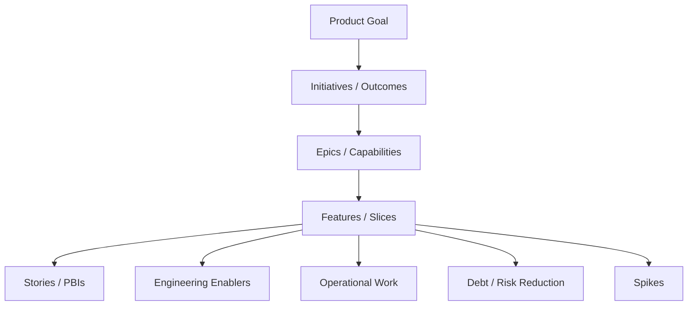

# Part 005 — Product Backlog as a Risk Map

## 1. Source notes and scope boundary

This part uses the public Scrum Guide and Scrum.org material as external reference.

Key public concepts:

- The Product Backlog is an emergent, ordered list of what is needed to improve the product.
- Product Backlog refinement breaks down and further defines Product Backlog items into smaller, more precise items.
- Ordering the Product Backlog can consider business value, risk, dependencies, return on investment, and impact.
- The Product Goal provides focus for the Product Backlog.

This part does **not** assume the exact CSG backlog tool, Jira workflow, issue type hierarchy, priority scheme, story point policy, release train, or internal Product Owner practice.

Use the `Internal verification checklist` sections to align this model with the real team process.

---

## 2. Core thesis

A Product Backlog is not a storage place for tickets.

A Product Backlog is the current visible model of what the product team believes matters next.

For a senior engineer, the backlog should be read as a map of:

- product value,
- customer commitments,
- domain uncertainty,
- integration dependency,
- architecture pressure,
- operational risk,
- security exposure,
- data migration risk,
- technical debt,
- learning still required.

In a complex Quote & Order system, a backlog item that looks simple may hide deep risk.

Example:

> Add `cancelReason` to product order cancellation.

This might involve:

- API contract change,
- order state transition semantics,
- TMF622 mapping,
- audit evidence,
- fulfillment cancellation integration,
- customer-facing error text,
- migration for existing rows,
- reporting/export changes,
- support runbook update,
- contract tests,
- E2E test for cancellation in progress.

If the Product Backlog only says “add field”, the risk is invisible.

A senior engineer helps make that risk visible before Sprint Planning.

---

## 3. The Product Backlog as a model, not an inventory

A ticket system can contain thousands of items.

That does not mean the Product Backlog is healthy.

A healthy Product Backlog is:

- ordered toward a Product Goal,
- transparent enough for decisions,
- detailed enough near the top,
- coarse enough farther away,
- regularly refined,
- honest about uncertainty,
- connected to customer/product outcome,
- connected to technical readiness.

A weak backlog is:

- a dumping ground,
- a wish list,
- a bug cemetery,
- a hidden architecture roadmap,
- a support queue,
- a collection of vague epics,
- a sprint planning surprise machine.

The senior engineer's job is not to own the Product Backlog. That is the Product Owner's accountability.

The senior engineer's job is to contribute engineering truth so the backlog can be ordered and refined intelligently.

---

## 4. Backlog item risk dimensions

Every Product Backlog Item can be examined through these dimensions.

| Dimension | Question | Example risk in Quote & Order |
|---|---|---|
| Value | What product/customer outcome does this enable? | Reduces quote approval turnaround time. |
| Domain uncertainty | Do we understand the business rule? | Approval invalidation after quote repricing unclear. |
| Technical uncertainty | Do we know how to implement it safely? | Existing order state machine has multiple mutation paths. |
| Data risk | Does it change persisted state? | Migration adds required field to accepted quote table. |
| API risk | Does it change public/partner/customer contract? | Adds enum value consumed by strict client. |
| Event risk | Does it change Kafka topics/events? | Changes partition key for order events. |
| Integration risk | Does it depend on another system? | Fulfillment adapter must accept new cancellation reason. |
| Operational risk | Can support/on-call diagnose failures? | No dashboard for failed cancellation propagation. |
| Security risk | Does it change authorization/tenant/audit boundary? | Support role can override quote status. |
| Delivery risk | Can it fit inside a Sprint with evidence? | Requires schema migration plus UI plus adapter plus E2E. |

A senior engineer should train themselves to see these dimensions quickly.

---

## 5. Risk map vs priority list

A priority list says:

1. Feature A
2. Feature B
3. Bug C
4. Tech debt D

A risk map says:

- Feature A is high customer value but has unresolved integration risk.
- Feature B is medium value but low risk and can be delivered safely.
- Bug C is low visible priority but indicates an invariant weakness.
- Tech debt D is not cosmetic; it causes repeated Sprint spillover.

The backlog still needs ordering, but ordering improves when risk is explicit.

### 5.1 Backlog item risk card

Use this lightweight shape:

```md
## Backlog Item Risk Card

Item: <title>
Product outcome:
Affected domain:
Affected services:
Affected APIs/events:
Affected tables/migrations:
Known dependencies:
Unknowns:
Primary failure mode:
Testing evidence needed:
Operational evidence needed:
Recommended next action:
```

This does not need to be attached to every small item.

Use it for items that touch:

- pricing,
- approval,
- order lifecycle,
- fulfillment,
- billing handoff,
- customer integration,
- tenant isolation,
- data migration,
- event schema,
- public API.

---

## 6. Backlog ordering from an engineering perspective

Scrum gives the Product Owner accountability for ordering the Product Backlog.

But the Product Owner needs accurate information.

Senior engineers help by exposing engineering factors:

- dependency sequence,
- risk reduction sequence,
- architectural prerequisite,
- migration lead time,
- test environment need,
- security review need,
- customer deployment constraint,
- production readiness work.

### 6.1 Engineering input to ordering

Example backlog:

1. Add quote approval delegation.
2. Add quote approval audit export.
3. Refactor approval rule evaluation.
4. Add new enterprise discount threshold.

A product-only ordering might choose the new discount threshold first.

Engineering input may reveal:

- current approval rule evaluation is duplicated,
- audit export depends on consistent approval evidence,
- delegation changes authority semantics,
- discount threshold will be unsafe until approval evidence is centralized.

A better order might be:

1. Characterize approval rule behavior.
2. Centralize approval evidence creation.
3. Add delegation with audit model.
4. Add threshold change.
5. Add audit export.

This is not engineering overriding product.

It is engineering making safe sequencing visible.

---

## 7. Backlog smells

Backlog smells are signals that future Sprint execution will hurt.

### 7.1 Vague business outcome

Smell:

> Improve quote flow.

Better:

> Reduce failed quote acceptance caused by stale pricing by requiring explicit repricing when price snapshot is expired.

### 7.2 Implementation-only item with no product context

Smell:

> Refactor `OrderProcessor`.

Better:

> Centralize order state transitions to prevent missing audit/outbox records during cancellation and fallout recovery.

### 7.3 One item hiding multiple systems

Smell:

> Support order cancellation.

Hidden work:

- API,
- state machine,
- permission,
- fulfillment adapter,
- inventory impact,
- billing impact,
- audit,
- Kafka event,
- UI,
- reporting,
- support runbook.

### 7.4 No acceptance criteria for negative paths

Smell:

> As a user, I can cancel an order.

Missing:

- cannot cancel completed order,
- cannot cancel other tenant's order,
- duplicate cancel is idempotent,
- cancellation during fulfillment produces known state,
- failed downstream cancellation enters fallout,
- audit includes actor and reason.

### 7.5 “Just backend” or “just UI” labels

In enterprise systems, backend and UI are often only visible slices.

A “backend only” change may still need:

- contract test,
- migration,
- dashboard,
- feature flag,
- support note.

A “UI only” change may still need:

- server-side authorization,
- API pagination behavior,
- audit visibility,
- accessibility,
- localization,
- customer configuration.

### 7.6 Tech debt with no consequence

Smell:

> Clean up code.

Better:

> Remove duplicate quote price calculation path because it produced two inconsistent approval threshold decisions in incident/support case X.

Debt should be tied to consequences.

---

## 8. Engineering taxonomy for backlog items

Use a taxonomy to reason about work type.

| Type | Example | Refinement focus |
|---|---|---|
| Feature | Add quote delegation | Behavior, AC, UX/API, security, audit |
| Bug | Accepted quote can be converted twice | Root cause, invariant, prevention |
| Spike | Investigate event replay strategy | Hypothesis, decision output, timebox |
| Enabler | Add contract testing for quote API | Future risk reduction |
| Migration | Add quote approval evidence hash | Expand-contract, backfill, rollback |
| Refactor | Centralize order transition logic | Characterization tests, incremental plan |
| Operational | Add dashboard for stuck orders | Signal, threshold, runbook |
| Security | Enforce tenant predicate in search | Negative tests, audit, policy |
| Performance | Optimize quote search | baseline, query plan, regression guard |
| Supportability | Add repair runbook | symptom, diagnosis, safe action |

This taxonomy helps the team avoid treating all backlog items as the same shape.

A migration item needs different refinement from a UI feature.

A supportability item needs different acceptance criteria from a customer-facing enhancement.

---

## 9. Backlog item anatomy for enterprise backend work

A high-quality backlog item usually includes these fields, even if not all are formal fields in your tool.

### 9.1 Product intent

What outcome should change?

Example:

> Sales users should be prevented from accepting quotes whose approved price snapshot has expired, so customers do not place orders using stale commercial terms.

### 9.2 User or actor

Actor could be:

- sales user,
- approver,
- order manager,
- support operator,
- integration client,
- downstream fulfillment service,
- batch job,
- customer admin,
- system consumer.

Do not force every item into a human end-user story if the actor is a system.

### 9.3 Domain object and lifecycle state

Specify:

- quote state,
- order state,
- order item state,
- catalog version,
- approval status,
- fulfillment task state,
- billing handoff state.

### 9.4 Boundaries touched

List:

- REST API,
- Kafka event,
- PostgreSQL table,
- UI,
- adapter,
- batch job,
- audit,
- metrics,
- runbook.

### 9.5 Acceptance criteria

Include both positive and negative cases.

### 9.6 Evidence required

State evidence:

- unit tests,
- integration tests,
- contract tests,
- E2E test,
- migration dry run,
- dashboard screenshot,
- manual verification note.

---

## 10. Product Backlog layers

For enterprise products, backlog items exist at multiple layers.



The danger is when lower layers are disconnected from upper layers.

Example:

- Product Goal: Improve order reliability.
- Epic: Reduce stuck orders.
- Feature: Add fallout resume flow.
- Enabler: Add order transition history.
- Operational: Add stuck order dashboard.
- Spike: Investigate duplicate callback patterns.
- Debt: Remove direct status mutation.

This set is coherent.

A bad backlog separates these items so the feature ships without the enabler, dashboard, or debt repayment.

---

## 11. Backlog refinement input from production

Production should feed the backlog.

Signals:

- incidents,
- customer escalations,
- support tickets,
- data repair cases,
- slow queries,
- Kafka DLQ,
- flaky deployments,
- alert noise,
- failed migrations,
- manual support workarounds,
- repeated PR review concerns.

If production signals are not converted into Product Backlog Items, the team keeps paying the same tax.

### 11.1 Incident-derived backlog item example

Incident:

> Several orders were stuck in `FULFILLING` because duplicate fulfillment callbacks were ignored incorrectly.

Bad backlog item:

> Fix stuck orders.

Better set:

1. Repair affected orders with approved runbook.
2. Add idempotency test for duplicate fulfillment callback.
3. Add dashboard for orders in `FULFILLING` longer than threshold.
4. Add transition history for callback processing.
5. Update runbook for callback replay.
6. Add retrospective action to review callback consumer pattern.

This turns an incident into system improvement.

---

## 12. Backlog refinement input from architecture

Architecture work should not live only in diagrams.

It should translate into backlog items.

Examples:

| Architecture concern | Backlog expression |
|---|---|
| Event replay unsafe | Add replay idempotency test and consumer guard |
| State transition duplicated | Introduce lifecycle service behind characterization tests |
| API compatibility weak | Add OpenAPI diff gate |
| DB migration risky | Add migration dry-run pipeline |
| Tenant predicate duplicated | Create tenant-scoped repository helper and tests |
| Support cannot diagnose fallout | Add order fallout dashboard and runbook |
| Approval evidence incomplete | Add approval evidence snapshot and audit test |

If architecture decisions do not become backlog items, they remain aspirations.

---

## 13. Product Backlog and technical debt

Technical debt belongs in the Product Backlog when it affects product value, delivery speed, operational safety, or customer trust.

But debt must be expressed in outcome terms.

### 13.1 Weak debt backlog item

> Refactor quote pricing code.

### 13.2 Strong debt backlog item

> Centralize quote price total calculation because line total, quote total, and approval threshold currently use separate calculation paths. This creates risk of approved price mismatch and slows pricing rule changes. Done when the three paths use one tested calculation module, existing behavior is characterized, and approval threshold tests cover enterprise discount examples.

Now the Product Owner can understand the risk.

### 13.3 Debt ordering inputs

Order debt by:

- incident recurrence,
- customer impact,
- feature delay impact,
- security risk,
- migration risk,
- operational toil,
- number of teams affected,
- proximity to upcoming roadmap work.

Do not order debt by engineer annoyance alone.

---

## 14. Backlog item examples for Quote & Order

### 14.1 Weak story

> Add approval delegation.

### 14.2 Stronger story

> As an enterprise approver, I can delegate quote approval authority for a bounded period, so urgent quotes are not blocked when I am unavailable.

Acceptance criteria:

- delegation has start and end time,
- delegate cannot exceed delegator authority,
- delegation is tenant/account scoped,
- maker-checker policy remains enforced,
- approval audit records original authority and delegate actor,
- expired delegation cannot approve,
- delegation changes are audited,
- API rejects cross-tenant delegation,
- quote acceptance preserves approval evidence.

Engineering notes:

- affects approval authorization,
- may require new table/migration,
- may affect audit export,
- needs security review,
- needs integration tests for authority checks.

### 14.3 Weak bug

> Quote acceptance broken.

### 14.4 Stronger bug

> Quote acceptance allows retry to create duplicate product orders when the first response times out after order creation but before client receives response.

Acceptance criteria:

- same idempotency key returns same order,
- different idempotency key cannot create second order for same accepted quote version,
- concurrency test covers simultaneous accept,
- audit shows one accepted transition,
- outbox emits one logical `ProductOrderCreated` event,
- duplicate attempt is observable in logs/metrics.

---

## 15. How senior engineers should participate in backlog ordering

Senior engineers should not dominate backlog ordering.

They should supply decision-quality information.

Useful phrases:

- "This item is product-small but architecture-large because it changes the event contract."
- "This can be sliced if we separate API exposure from internal data model migration."
- "This needs a spike because we do not yet know the fulfillment adapter behavior."
- "This should be pulled earlier because it reduces risk for the next three features."
- "This looks low priority, but it caused two support incidents and blocks reliable release."
- "This can be behind a feature flag, but the data written under the flag must remain compatible."
- "This story needs a negative acceptance criterion for cross-tenant access."

Avoid phrases:

- "This is easy" without evidence.
- "This is technical, product does not need to care."
- "We can fix it later" without naming the risk.
- "Just add it to the sprint" when dependencies are unclear.

---

## 16. Backlog review questions by work type

### 16.1 Feature

Ask:

- What user/customer/system outcome changes?
- Which lifecycle state does it affect?
- What is the negative path?
- What existing behavior must remain compatible?
- Is this releasable independently?

### 16.2 Bug

Ask:

- What invariant failed?
- Is data repair needed?
- How will we prevent recurrence?
- Does the bug reveal missing test/alert/runbook?
- Is the root cause local or systemic?

### 16.3 Spike

Ask:

- What decision will this enable?
- What hypothesis are we testing?
- What is the timebox?
- What artifact will be produced?
- What happens if uncertainty remains?

### 16.4 Migration

Ask:

- Is it expand-contract?
- Does old app work with new schema?
- Is backfill needed?
- Is lock risk understood?
- Is rollback/roll-forward defined?

### 16.5 Refactor

Ask:

- What behavior must not change?
- Are characterization tests available?
- Can this be sliced safely?
- What risk is reduced?
- What cleanup criteria exists?

### 16.6 Operational work

Ask:

- What signal is missing?
- What incident/support flow improves?
- Who will use the dashboard/runbook?
- What threshold or action is defined?
- How will we know it works?

---

## 17. Product Backlog readiness gradients

Not all Product Backlog Items need equal detail.

Use detail gradients.

| Backlog horizon | Detail level |
|---|---|
| Current Sprint candidate | clear outcome, AC, dependencies, test evidence, risk known |
| Next 1-2 Sprints | enough detail for sizing and sequencing |
| Roadmap-level | outcome and uncertainty known, not over-specified |
| Discovery area | hypothesis and learning goal |
| Parking lot | may be intentionally vague, but not pretending to be ready |

A common anti-pattern is over-refining distant work while under-refining near work.

Another anti-pattern is keeping everything vague until Sprint Planning.

---

## 18. Internal verification checklist

Check these in the actual CSG/team context.

### 18.1 Tooling and structure

- Which tool is used for Product Backlog: Jira, Azure DevOps, GitHub Issues, or other?
- What issue types exist: epic, feature, story, task, bug, spike, enabler?
- How are dependencies represented?
- How are customer commitments represented?
- How are production bugs represented?
- How is technical debt represented?
- How are operational tasks represented?

### 18.2 Ordering and ownership

- Who orders the Product Backlog?
- How does the Product Owner get technical risk input?
- Are architects, QA, security, platform, and support involved when needed?
- Are customer deadlines visible?
- Are release dependencies visible?
- Are on-prem constraints visible?

### 18.3 Refinement quality

- How often does refinement happen?
- Who attends refinement?
- Are Product Backlog Items refined before Sprint Planning?
- Are acceptance criteria consistently useful?
- Are engineering risks recorded?
- Are spikes timeboxed?
- Are refinement outcomes documented?

### 18.4 Production feedback

- Do incidents create backlog items?
- Do support cases create backlog items?
- Do flaky tests create backlog items?
- Do slow queries create backlog items?
- Do data repairs create prevention backlog items?
- Do postmortem action items get prioritized?

### 18.5 Quality of ordering

- Are high-risk items pulled early enough?
- Are dependencies discovered before Sprint Planning?
- Are debt items linked to product/operational impact?
- Are near-term items detailed enough?
- Is there a visible Product Goal?
- Does the top of the backlog support the Product Goal?

---

## 19. Practical exercise: backlog risk review

Pick the top 10 Product Backlog Items in your team.

For each, fill this table:

| Item | Product value | Main risk | Hidden dependency | Evidence missing | Recommended action |
|---|---|---|---|---|---|
| Item A | | | | | |
| Item B | | | | | |

Then classify each item:

- ready for Sprint Planning,
- needs refinement,
- needs spike,
- needs architecture review,
- needs security review,
- needs dependency resolution,
- should be split,
- should be deferred.

The goal is not to block work.

The goal is to make the backlog more truthful.

---

## 20. Practical exercise: rewrite weak backlog items

Rewrite these weak items.

### Weak item 1

> Add order status filter.

Improve by specifying:

- actor,
- status vocabulary,
- tenant/account scope,
- pagination/sorting,
- performance expectation,
- authorization,
- API/UI behavior,
- test evidence.

### Weak item 2

> Fix Kafka consumer issue.

Improve by specifying:

- topic,
- event type,
- failure mode,
- idempotency behavior,
- retry/DLQ path,
- production symptom,
- prevention test.

### Weak item 3

> Refactor pricing.

Improve by specifying:

- duplicated behavior,
- affected pricing cases,
- characterization tests,
- migration path,
- business risk reduced,
- acceptance criteria.

---

## 21. Senior engineer operating habits

Weekly:

- scan top backlog items for hidden risk,
- ask whether production incidents created prevention items,
- identify one vague item and improve it,
- identify one item that needs technical discovery,
- identify one dependency likely to block next Sprint,
- identify one debt item that needs better business framing.

Before Sprint Planning:

- review candidate items for readiness,
- flag high-risk items early,
- suggest splits,
- identify architecture/design needs,
- check test/observability implications,
- align with Sprint Goal.

After Sprint Review/Retro:

- ensure learning becomes backlog action,
- convert repeated friction into improvement item,
- remove stale/no-longer-relevant backlog items if appropriate through the Product Owner.

---

## 22. Summary

A Product Backlog is not merely a list of work.

For senior engineers, it is a living risk map.

A strong Product Backlog makes visible:

- value,
- uncertainty,
- dependencies,
- technical risk,
- operational risk,
- customer impact,
- learning needs.

A weak Product Backlog hides these until Sprint Planning or production.

In enterprise Quote & Order work, backlog quality directly affects production safety.

The senior engineer's contribution is to make engineering reality visible early enough that the Scrum Team can adapt.

That is how backlog work becomes technical leadership.
