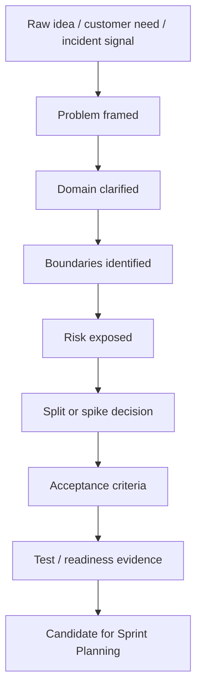

# Part 006 — Backlog Refinement for Complex Enterprise Domains

## 1. Source notes and scope boundary

This part uses public Scrum material as external reference.

Key public concepts:

- Product Backlog refinement is the act of breaking down and further defining Product Backlog items into smaller, more precise items.
- Refinement is ongoing work, not a single mandatory Scrum event in the official Scrum Guide.
- Scrum.org describes refinement sessions as focused discussions to build shared understanding of Product Backlog Items and discuss ordering.
- Product Backlog attributes such as description, order, and size often vary by domain of work.

This part does **not** assume the exact CSG refinement cadence, Jira workflow, planning process, Product Owner practices, Scrum Master facilitation, or architecture governance.

Use the `Internal verification checklist` sections to verify the real process in your team.

---

## 2. Core thesis

Backlog refinement is where complex work becomes executable.

For simple work, refinement may clarify a user story and acceptance criteria.

For enterprise Quote & Order work, refinement must also expose:

- domain semantics,
- state transitions,
- customer-specific behavior,
- API compatibility,
- Kafka event semantics,
- PostgreSQL migration risk,
- integration dependencies,
- security and tenant isolation,
- observability,
- release strategy,
- support and data repair implications.

Refinement is not just preparation for estimation.

Refinement is risk discovery.

If refinement is weak, risk moves downstream into:

- Sprint Planning surprise,
- PR churn,
- blocked development,
- late QA discovery,
- release delay,
- production incident,
- customer escalation.

A senior engineer uses refinement to reduce unknowns before commitment.

---

## 3. What refinement should produce

A refinement session should produce one or more of these outcomes:

- item is clear enough for Sprint Planning,
- item is split into smaller slices,
- item needs a spike,
- item needs product decision,
- item needs architecture review,
- item needs external team dependency,
- item needs security review,
- item needs data migration plan,
- item is not worth doing now,
- item is duplicated or stale,
- item should become multiple backlog items.

A refinement session that only produces story points may be shallow.

A good refinement session produces clarity.

---

## 4. Refinement participants and responsibilities

Refinement is a Scrum Team responsibility, but complex enterprise work may need additional input.

| Participant | Contribution |
|---|---|
| Product Owner | value, priority, customer need, acceptance intent |
| Developers | feasibility, design, slicing, risks, estimates |
| Senior engineer | hidden risks, domain invariants, architecture, data, operations |
| QA/test engineer | acceptance criteria, test scenarios, regression risk |
| Scrum Master | facilitation, process health, impediment visibility |
| Architect/staff engineer | cross-system design, standards, long-term trade-offs |
| Security engineer | auth, tenant, audit, PII, threat model |
| Platform/SRE | deployment, observability, runtime, capacity |
| Support/operations | production symptoms, runbook, customer pain |
| Domain SME | business semantics and edge cases |

Not everyone attends every session.

But the team must know when to involve them.

---

## 5. The refinement funnel

Backlog items move through clarity states.



The key is not to make every item perfect.

The key is to make the top of the backlog honest enough for commitment.

---

## 6. Refinement question stack

Use a layered question stack.

### 6.1 Product question

- What outcome should change?
- Who benefits?
- What is the customer/user pain?
- How will we know the outcome improved?
- Is this aligned with Product Goal?

### 6.2 Domain question

- Which domain concept is affected?
- Which lifecycle state is affected?
- Which business invariant must hold?
- What are the edge cases?
- What terminology is ambiguous?

### 6.3 Technical boundary question

- Which service/module owns the behavior?
- Which APIs are touched?
- Which events are produced/consumed?
- Which tables are touched?
- Which adapters are affected?
- Which environment/deployment mode is affected?

### 6.4 Risk question

- What can fail?
- What is the worst customer/business impact?
- What data can become inconsistent?
- What old behavior must remain compatible?
- What dependency could block Sprint execution?

### 6.5 Evidence question

- What tests prove it?
- What contract/migration/security evidence is needed?
- What dashboard/log/audit signal is needed?
- What runbook/support note is needed?

A strong refinement session walks down the stack until the team has enough confidence.

---

## 7. Refinement for CPQ and Quote scenarios

Quote and CPQ work often hides commercial risk.

### 7.1 Refinement questions for quote creation

Ask:

- Which customer/account context applies?
- Which product offering or catalog version is used?
- Are characteristic constraints involved?
- Is the quote draft, priced, pending approval, approved, accepted, expired, rejected, cancelled?
- Is a price snapshot required?
- Is catalog snapshot or live catalog lookup expected?
- What validation errors should be user-facing?
- What should be audited?
- Is tenant/account authorization involved?

### 7.2 Refinement questions for pricing

Ask:

- What price components are affected: recurring, non-recurring, discount, fee, tax, one-time charge?
- What currency and rounding rules apply?
- Is enterprise agreement involved?
- Are discounts stackable?
- Does this change approval thresholds?
- Does repricing invalidate approval?
- Does quote acceptance freeze price?
- Are old quotes affected?
- Are generated invoices/billing handoff affected?

### 7.3 Refinement questions for approval

Ask:

- Who can approve?
- What authority threshold applies?
- Is maker-checker required?
- Can approval be delegated?
- What invalidates approval?
- Is approval time-bound?
- What evidence is required?
- How is denial represented?
- How is approval audited?
- What happens on retry/duplicate approval command?

### 7.4 Example refinement outcome

Raw item:

> Add approval delegation.

Refined into:

1. Spike: verify current approval authority model and delegation constraints.
2. Story: create delegation model and audit event.
3. Story: enforce delegation in approval command.
4. Story: show delegation in approval UI/API if required.
5. Story: add contract/security tests for delegation.
6. Story: add runbook/support note for delegation troubleshooting.

This is better than one giant story.

---

## 8. Refinement for Order Management scenarios

Order work hides lifecycle and async risk.

### 8.1 Refinement questions for order capture

Ask:

- Is order created from accepted quote or direct product offering?
- Is idempotency required?
- Can the same quote create more than one order?
- What fields are snapshotted from quote?
- What validation occurs before order creation?
- What event is emitted?
- What audit event is created?

### 8.2 Refinement questions for order state machine

Ask:

- What states exist?
- What transition is added/changed?
- Who can trigger it?
- Is transition idempotent?
- Does it emit event?
- Does it create history/audit?
- Are in-flight orders affected?
- Can old app version interpret new state?
- Are reports/search filters affected?

### 8.3 Refinement questions for decomposition

Ask:

- Is decomposition deterministic from order snapshot?
- What catalog/product data is used?
- Are tasks generated once?
- What happens on partial failure?
- Can decomposition resume?
- What downstream systems receive tasks?
- What correlation is stored?
- What is the fallout path?

### 8.4 Refinement questions for fulfillment callbacks

Ask:

- How is callback authenticated?
- Is callback idempotent?
- What if callback is duplicated?
- What if callback is out of order?
- What if callback references unknown task?
- What if callback arrives after cancellation?
- What audit/event is produced?
- What dashboard signal exists for stuck tasks?

---

## 9. Refinement for API and contract changes

API work should never be refined only as code shape.

Ask:

- Is this API internal, customer-facing, partner-facing, or public?
- Is it TMF-aligned?
- Which OpenAPI spec changes?
- Is change additive or breaking?
- Are nullable/required fields changed?
- Are enum values added?
- Are error codes changed?
- Are old clients compatible?
- Are generated clients impacted?
- Is idempotency preserved?
- Does authorization/tenant scope change?

### 9.1 API refinement output

For an API item, refinement should produce:

- endpoint/resource impacted,
- request/response examples,
- error examples,
- compatibility statement,
- contract test need,
- generated client impact,
- versioning/deprecation need if any.

---

## 10. Refinement for Kafka and event-driven work

Event work must include schema and semantics.

Ask:

- What event type is involved?
- Is event new or changed?
- What topic?
- What partition key?
- What aggregate ID?
- What event version?
- Is schema backward compatible?
- Are old consumers known?
- What is replay behavior?
- Is duplicate event handling defined?
- What DLQ/retry path exists?
- Does event include tenant/correlation/causation ID?
- Does event expose PII/commercial sensitive data?

### 10.1 Event refinement output

Produce:

- event example,
- compatibility statement,
- consumer impact list,
- replay/idempotency expectation,
- schema registry/test need,
- operational signal.

---

## 11. Refinement for database migration work

DB migration is often underestimated in Scrum teams.

Ask:

- Which table(s) are affected?
- How many rows in production-like environment?
- Is table hot?
- Is migration additive or destructive?
- Is expand-contract needed?
- Does old app work with new schema?
- Does new app work with old data?
- Is backfill needed?
- Is backfill chunked and resumable?
- What locks will be taken?
- Is `CREATE INDEX CONCURRENTLY` needed?
- Is rollback or roll-forward realistic?
- Is on-prem upgrade impacted?

### 11.1 Migration refinement output

Produce:

- migration strategy,
- data volume assumption,
- test/dry-run need,
- rollout sequence,
- validation query,
- rollback/roll-forward statement.

---

## 12. Refinement for security and tenant work

Security is not a final review checkbox.

It must be refined early.

Ask:

- Who is the actor?
- What permission is required?
- Is authorization object-scoped?
- Is it state-sensitive?
- Is tenant ID derived from trusted context?
- Does any request body include privileged fields?
- Does API reveal object existence across tenant boundary?
- Is audit required?
- Is support/admin tooling involved?
- Is PII exposed in logs/events/exports?

### 12.1 Security refinement output

Produce:

- permission matrix snippet,
- negative test cases,
- audit expectation,
- tenant isolation expectation,
- security review trigger if needed.

---

## 13. Refinement for observability and supportability

A story is not production-ready if nobody can diagnose it.

Ask:

- What business metric changes?
- What failure signal is needed?
- Which logs need quote/order/correlation IDs?
- Is trace propagation required?
- Does support need a dashboard?
- Does on-call need a runbook?
- Is there a new alert or manual watch criterion?
- What data repair path exists if this fails?

### 13.1 Observability refinement output

Produce:

- log fields,
- metrics,
- dashboard panel,
- alert/watch criteria,
- runbook update,
- support note.

---

## 14. Story splitting during refinement

Large enterprise work must be split carefully.

Do not split only by technical layer:

- backend,
- frontend,
- database,
- QA.

That often produces partial work that cannot be inspected as product increment.

Prefer vertical or risk-reduction slices.

### 14.1 Split by lifecycle state

Example: order cancellation.

Slices:

1. Cancel draft/validated order before fulfillment.
2. Cancel order during fulfillment with downstream cancellation request.
3. Cancel partially fulfilled order with fallout support.
4. Add cancellation reporting/export.

### 14.2 Split by actor

Example: approval delegation.

Slices:

1. Admin creates delegation.
2. Delegate approves within authority.
3. Delegation expiry enforced.
4. Audit/export visibility.

### 14.3 Split by integration boundary

Example: billing handoff.

Slices:

1. Produce internal billing handoff event.
2. Adapter sends to billing simulator.
3. Handle billing rejection.
4. Add reconciliation/reporting.

### 14.4 Split by risk reduction

Example: new pricing engine.

Slices:

1. Characterization tests for old behavior.
2. Shadow-run new calculation.
3. Compare outputs for representative catalog.
4. Enable for one low-risk tenant/product.
5. Expand rollout.

### 14.5 Split by read/write path

Example: new quote approval evidence field.

Slices:

1. Add nullable field and write for new approvals.
2. Read with fallback.
3. Backfill historical approvals.
4. Validate and require for new flow.
5. Remove fallback later.

---

## 15. Spikes during refinement

A spike is useful when the team cannot make a safe commitment yet.

### 15.1 Good spike characteristics

A good spike has:

- hypothesis,
- decision to enable,
- timebox,
- owner,
- evidence output,
- next action.

Example:

```md
Spike: Determine safe order cancellation behavior during active fulfillment

Hypothesis:
  Downstream fulfillment adapter supports cancellation for accepted-but-not-completed tasks.

Questions:
  - Which task states are cancellable?
  - Is cancellation idempotent?
  - What callback is sent after cancellation?
  - What happens if task completes while cancellation is in flight?

Output:
  - adapter behavior matrix
  - recommended order state transitions
  - story split proposal
  - risks needing product decision

Timebox:
  2 days
```

### 15.2 Bad spike

> Investigate order cancellation.

This has no decision boundary.

It can expand endlessly.

---

## 16. Refinement anti-patterns

### 16.1 Refinement as estimation meeting

If the only output is story points, the team may still not understand the work.

### 16.2 Product-only refinement

If engineers see work first during Sprint Planning, risk is discovered too late.

### 16.3 Engineering-only refinement

If product intent is missing, engineers may overbuild or solve the wrong problem.

### 16.4 Acceptance criteria as UI checklist

Backend/API/event/migration/security acceptance is often missing.

### 16.5 Splitting by component only

Backend story done, frontend story done, QA story pending, release impossible.

### 16.6 Spikes with no output

A spike without a decision artifact is just unstructured research.

### 16.7 Ignoring production readiness

The story is functionally complete but has no metric, log, runbook, or alert.

### 16.8 Refining too late

If refinement happens immediately before Sprint Planning, dependencies and unknowns cannot be resolved in time.

---

## 17. Refinement facilitation pattern

Use this structure for complex items.

### 17.1 Before session

- Product Owner shares item context.
- Senior engineer identifies likely technical boundaries.
- QA/test identifies likely test dimensions.
- Dependencies are listed.
- Unknowns are explicit.

### 17.2 During session

Agenda:

1. Product outcome.
2. Domain behavior.
3. Scope and non-scope.
4. Technical boundaries.
5. Edge cases.
6. Dependencies.
7. Risk classification.
8. Split/spike decision.
9. Acceptance criteria.
10. Evidence needed.
11. Next owner/action.

### 17.3 After session

- Update backlog item.
- Add diagrams/examples if useful.
- Create spike or dependent items.
- Record open questions.
- Reorder if risk/dependency changed.

---

## 18. Refinement templates

## 18.1 Complex feature refinement template

```md
# Refinement Notes: <item title>

## Product outcome

## Actor / customer / system

## Domain concepts

## Current behavior

## Desired behavior

## Non-goals

## Affected boundaries
- API:
- UI:
- Kafka:
- DB:
- External integrations:
- Security/tenant:
- Audit:
- Observability:

## Edge cases

## Dependencies

## Risks

## Acceptance criteria

## Evidence needed

## Split/spike decision

## Open questions
```

## 18.2 Bug refinement template

```md
# Bug Refinement

## Symptom

## Customer/business impact

## Affected tenants/customers if known

## Expected invariant

## Actual behavior

## Root cause known?

## Data repair needed?

## Prevention needed
- Test:
- Alert:
- Runbook:
- Code guard:

## Fix strategy

## Acceptance criteria
```

## 18.3 Technical debt refinement template

```md
# Technical Debt Refinement

## Current friction/risk

## Evidence
- Incidents:
- Bugs:
- Slow delivery:
- Review comments:
- Operational pain:

## Business/production consequence

## Safe repayment sequence

## Tests/characterization needed

## Rollout/migration risk

## Definition of Done
```

---

## 19. Refinement examples

### 19.1 Raw item

> Add quote expiry handling.

### 19.2 Refined understanding

Product outcome:

- Prevent customers from accepting quotes after commercial validity expires.

Domain behavior:

- Quote has validity window.
- Expired quote cannot be accepted.
- Repricing may create new quote version or update draft depending on policy.
- Approved quote may require reapproval after repricing.

Affected boundaries:

- quote API,
- pricing service,
- approval workflow,
- audit,
- order conversion,
- UI warning,
- Kafka event maybe `QuoteExpired`,
- scheduled job maybe.

Risks:

- accepted stale price,
- approval evidence mismatch,
- old draft quotes without expiry field,
- timezone bugs,
- customer-specific validity policy.

Split:

1. Spike: verify current quote validity model and customer-specific rules.
2. Story: enforce expiry at acceptance API.
3. Story: show expiry warning in UI/API response.
4. Story: audit/reprice behavior after expiry.
5. Story: migration/backfill validity for existing quotes if needed.

Acceptance criteria for first enforcement story:

- cannot accept expired quote,
- can accept unexpired approved quote,
- error code stable and actionable,
- acceptance attempt audited if policy requires,
- API returns correlation ID,
- tests cover boundary time using deterministic clock,
- tenant-specific validity policy applied.

---

## 20. Refinement quality checklist

Before an item enters Sprint Planning, ask:

- Is the product outcome clear?
- Is the actor clear?
- Are domain concepts clear?
- Is current behavior known?
- Is desired behavior known?
- Are non-goals explicit?
- Are affected services/APIs/events/tables known?
- Are dependencies visible?
- Are edge cases listed?
- Are negative paths included?
- Is security/tenant impact considered?
- Is data migration impact considered?
- Is observability/support impact considered?
- Is test evidence known?
- Can the item fit in a Sprint?
- Does it need splitting?
- Does it need a spike?
- Does it support the Product Goal/Sprint Goal?

If many answers are unknown, do not force estimation.

Create discovery work.

---

## 21. Internal verification checklist

### 21.1 Refinement process

- How often does refinement happen?
- Is it synchronous, async, or both?
- Who facilitates it?
- Who usually attends?
- Are QA/test engineers included?
- Are architecture/security/platform/support included when needed?
- How are refinement outcomes recorded?
- How are open questions tracked?

### 21.2 Backlog item fields

- Where are acceptance criteria recorded?
- Where are dependencies recorded?
- Where are risks recorded?
- Where are design links recorded?
- Where are test notes recorded?
- Where are release notes recorded?
- Where are customer commitments recorded?

### 21.3 Readiness expectations

- Does the team have Definition of Ready?
- Is DoR explicit or informal?
- What makes an item too vague for Sprint Planning?
- How are spikes created?
- How are stories split?
- How are architecture tasks represented?
- How are production readiness tasks represented?

### 21.4 Common refinement failure modes

- Which items often spill over?
- Which items often block development?
- Which items cause PR churn?
- Which items cause late QA defects?
- Which items cause release delay?
- Which items cause production issues?
- What refinement gap caused each one?

---

## 22. Practical exercise: facilitate a refinement session

Choose one upcoming backlog item.

Prepare:

1. Product outcome.
2. Domain concepts.
3. Current/desired behavior.
4. Affected boundaries.
5. Edge cases.
6. Risks.
7. Split options.
8. Spike need.
9. Acceptance criteria.
10. Evidence needed.

Run a 30-minute refinement with Product Owner, QA, and at least one engineer.

Afterward, evaluate:

- Did everyone understand the same behavior?
- Did risk become clearer?
- Was the item split or clarified?
- Were open questions assigned?
- Could the item now be considered for Sprint Planning?

---

## 23. Practical exercise: refine an incident-derived item

Take a recent bug or incident.

Create backlog items for:

- immediate fix,
- data repair if needed,
- prevention test,
- monitoring/alert improvement,
- runbook update,
- root-cause refactor or debt repayment.

This teaches the team that refinement is not only for features.

It is also how production learning enters product development.

---

## 24. Senior engineer operating habits

Before refinement:

- scan item for hidden boundaries,
- prepare domain questions,
- inspect related code/tests if possible,
- identify likely dependencies,
- bring one suggested split.

During refinement:

- make ambiguity explicit,
- avoid premature solutioning when product intent is unclear,
- explain risk in business language,
- help split work,
- suggest spikes when unknowns are material.

After refinement:

- update diagrams/notes if useful,
- create follow-up items,
- verify assumptions,
- help Product Owner understand technical ordering implications.

---

## 25. Summary

Backlog refinement is the Scrum Team's main mechanism for converting vague future work into executable product increments.

For complex enterprise domains, refinement must go beyond user story wording.

It must clarify:

- domain semantics,
- lifecycle states,
- API/event contracts,
- data migration risk,
- security/tenant boundaries,
- operational readiness,
- testing evidence,
- supportability.

A senior engineer brings hidden engineering reality into the conversation early.

Done well, refinement prevents Sprint chaos.

Done exceptionally well, refinement becomes technical leadership.
