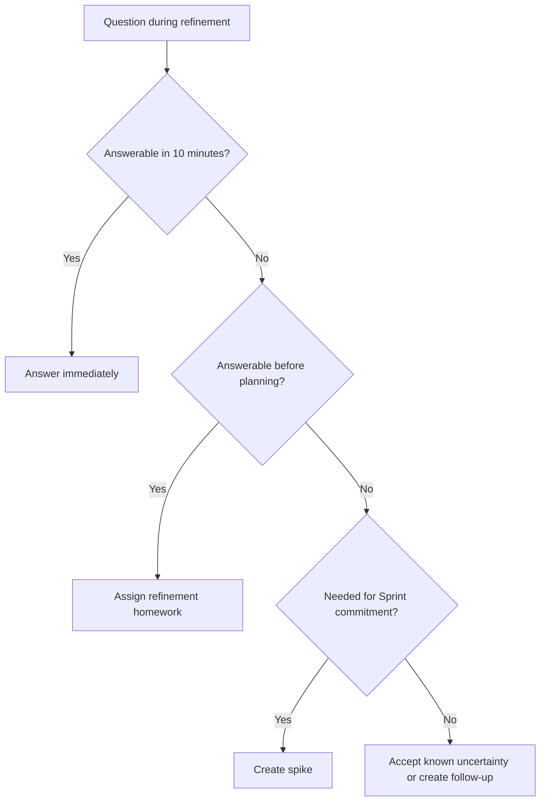

# Part 010 — Spikes, PoC, and Technical Discovery

## 1. Source notes and scope boundary

This part uses public Scrum practice discussions and general engineering discovery patterns.

Public references to verify independently:

- Scrum.org public articles describe spikes as research or technical discovery work that may help a team learn enough to size or deliver future Product Backlog Items.
- Scrum Guide does not define spike as a formal Scrum event or artifact. A spike is a practice teams may use inside their Product Backlog and Sprint planning.
- Scrum's empirical foundation makes discovery legitimate when it increases transparency and enables better inspection and adaptation.

This part does **not** assume CSG uses a formal spike template, PoC approval process, architecture runway policy, or Jira issue type called Spike.

Verify internally how discovery work is represented, estimated, reviewed, and accepted.

---

## 2. Core thesis

A spike is not "time to investigate".

A spike is a bounded learning investment that must reduce uncertainty enough to enable a better decision.

For senior engineers, the output of a spike is not code.

The output is decision-quality knowledge.

A good spike answers:

- what did we learn,
- what decision can we now make,
- what risk remains,
- what delivery slice is now possible,
- what should we not do,
- what evidence supports the conclusion.

A bad spike ends with:

> We looked into it. More investigation is needed.

Sometimes that is true, but if it happens repeatedly, the spike was not designed sharply enough.

---

## 3. Why spikes matter in enterprise Quote & Order

Quote & Order work often contains hidden uncertainty.

Examples:

- Can an existing quote state machine support a new cancellation path?
- Can old accepted quotes survive a pricing snapshot change?
- Can a Kafka consumer be made replay-safe?
- Can a PostgreSQL migration run safely on a large table?
- Can a TMF-aligned API extension be added without breaking customers?
- Can a fulfillment adapter handle duplicate callbacks idempotently?
- Can a customer-specific approval rule be expressed through configuration?
- Can a new index improve quote search without hurting write performance?
- Can a feature be deployed behind a tenant-specific flag?

Committing delivery work without reducing these uncertainties creates Sprint churn.

A spike makes uncertainty visible and timeboxed.

---

## 4. Spike vs PoC vs prototype vs experiment

These terms are often mixed.

Use them deliberately.

| Term | Primary purpose | Expected output |
|---|---|---|
| Spike | Reduce uncertainty enough to plan/deliver | Decision, recommendation, next slice |
| PoC | Prove feasibility of a technical approach | Evidence that approach can/cannot work |
| Prototype | Explore user/product interaction or design shape | Learnability/usability/design feedback |
| Experiment | Test hypothesis with measurable result | Data supporting/invalidating hypothesis |
| Architecture investigation | Compare design alternatives | Trade-off analysis and ADR/design note |
| Production investigation | Understand real system behavior | Evidence, diagnosis, runbook/backlog item |

A spike may contain a PoC.

A PoC without decision criteria is just tinkering.

---

## 5. When to create a spike

Create a spike when uncertainty is too high for responsible Sprint commitment.

### 5.1 Good reasons for a spike

- Unknown technical feasibility.
- Unknown legacy behavior.
- Unknown performance characteristic.
- Unknown migration safety.
- Unknown integration contract.
- Unknown domain rule interpretation.
- Unknown production data shape.
- Unknown deployment/platform constraint.
- Multiple architecture options with meaningful trade-offs.
- Team cannot estimate because a key assumption is unverified.

### 5.2 Bad reasons for a spike

- Avoiding a hard conversation.
- Doing design without Product Owner visibility.
- Hiding architecture work outside backlog.
- Starting implementation without acceptance criteria.
- Open-ended research.
- Learning a tool with no delivery decision.
- Delaying commitment because item is too big but not slicing it.

Spikes are legitimate work.

They should be visible.

---

## 6. Anatomy of a good spike

A spike should include these fields.

```md
# Spike: <title>

## Question
What specific uncertainty are we reducing?

## Context
Why does this matter for product, delivery, architecture, or production?

## Hypothesis
What do we currently believe?

## Timebox
How much time will we spend?

## Approach
What will we inspect/build/measure/read/test?

## Decision criteria
What result will let us decide?

## Output
What artifact will be produced?

## Non-goals
What will we intentionally not solve?

## Follow-up
What delivery/design/backlog action may follow?
```

If a spike cannot be expressed this way, it is probably too vague.

---

## 7. Spike outputs

A spike should produce one or more durable outputs.

Valid outputs:

- ADR,
- design note,
- decision recommendation,
- trade-off matrix,
- risk assessment,
- updated story slicing,
- updated acceptance criteria,
- proof-of-concept branch,
- benchmark result,
- migration dry-run result,
- compatibility test result,
- production data analysis,
- runbook or diagnostic procedure,
- backlog items created/refined.

Invalid or weak outputs:

- "looked into it",
- "seems hard",
- "more research needed" without explanation,
- unmerged code with no learning summary,
- tool demo detached from delivery decision,
- private notes not shared with team.

---

## 8. Timeboxing spikes

Timebox based on decision value.

Typical timeboxes:

| Spike size | Use when |
|---|---|
| 2–4 hours | Verify one assumption, inspect code/data, answer bounded question |
| 1 day | Compare small alternatives, run focused experiment |
| 2–3 days | Build PoC, benchmark, trace integration behavior |
| 1 Sprint | Large architecture discovery with explicit outputs and review |

A spike that consumes a whole Sprint must have strong justification.

For most enterprise delivery, prefer smaller spikes that unlock the next slice.

---

## 9. Spike examples for Quote & Order

### 9.1 Pricing snapshot feasibility spike

Question:

> Can we derive a stable approval basis hash from existing quote price and discount data without changing accepted quote semantics?

Context:

- Approval invalidation needs stable evidence.
- Existing data may not contain enough snapshot detail.

Approach:

- Inspect quote/pricing tables.
- Review approval audit records.
- Test hash generation on sample fixture.
- Identify missing fields.

Decision criteria:

- If all required fields exist and are immutable, create implementation story.
- If not, create migration/snapshot design story.

Output:

- data field map,
- recommendation,
- follow-up backlog items.

### 9.2 Kafka replay-safety spike

Question:

> Can the order consumer replay `QuoteAccepted` events from the last 30 days without creating duplicate orders?

Approach:

- Inspect idempotency key model.
- Inspect order uniqueness constraints.
- Run replay in controlled test environment.
- Check duplicate order prevention.

Decision criteria:

- Replay is safe if duplicate event processing returns existing order and does not emit duplicate downstream side effects.

Output:

- replay test result,
- identified gaps,
- idempotency improvement story.

### 9.3 PostgreSQL migration spike

Question:

> Can we add an index to the quote search table without unacceptable lock/write impact?

Approach:

- Inspect table size and write rate.
- Run `EXPLAIN` on target query.
- Test `CREATE INDEX CONCURRENTLY` in staging-like dataset.
- Measure runtime and query improvement.

Decision criteria:

- If runtime and lock behavior are acceptable, create migration story.
- If not, consider partial index, query rewrite, or rollout window.

Output:

- query plan before/after,
- migration risk note,
- recommended index strategy.

### 9.4 TMF extension spike

Question:

> Can the required customer-specific quote attribute be represented as a governed TMF extension without breaking existing API consumers?

Approach:

- Inspect existing OpenAPI/TMF mapping.
- Identify consumers.
- Compare extension options.
- Build example payloads.
- Run compatibility check.

Output:

- recommended API shape,
- compatibility note,
- contract test updates.

---

## 10. PoC discipline

A PoC should be disposable by default.

Do not let PoC code sneak into production without review.

### 10.1 PoC rules

- Label PoC branch clearly.
- Keep code minimal.
- Avoid production secrets/data.
- Avoid irreversible migrations.
- Avoid changing shared environments without approval.
- Capture assumptions.
- Capture results.
- Delete or rewrite PoC code before production implementation.

### 10.2 PoC anti-pattern: prototype becomes production

Symptom:

> The PoC worked, so we merged it with minor cleanup.

Risk:

- no error handling,
- no observability,
- no tests,
- no security review,
- no migration strategy,
- no operational readiness,
- hidden shortcuts become permanent.

Better:

- use PoC to learn,
- document decision,
- create production-grade implementation story,
- apply Definition of Done fully.

---

## 11. Technical discovery in refinement

Not all discovery needs a Sprint spike.

Some discovery can happen during refinement.

Examples:

- quick code search,
- quick schema check,
- quick API contract inspection,
- quick dashboard lookup,
- quick conversation with domain owner,
- quick existing test review.

Use a spike only when the discovery needs focused time and visible backlog treatment.

### 11.1 Discovery escalation ladder



This avoids turning every question into a spike.

---

## 12. Spikes and estimation

A spike may improve estimation, but estimation is not the only purpose.

A spike can reduce uncertainty in:

- feasibility,
- scope,
- risk,
- design,
- testability,
- migration path,
- rollout strategy,
- operational support,
- customer impact.

After the spike, update:

- story split,
- estimate,
- acceptance criteria,
- architecture decision,
- Definition of Done expectations,
- risk register.

If a spike does not change anything, ask whether it was necessary.

---

## 13. Spike acceptance criteria

A spike needs acceptance criteria too.

But they are learning-oriented, not feature-behavior-oriented.

Example:

```md
Acceptance criteria:
- Identify whether existing order table has uniqueness protection for quote-to-order conversion.
- Verify duplicate QuoteAccepted event processing in local integration test.
- Document whether replay creates duplicate order or returns existing order.
- Recommend one of: no change needed, add idempotency key, add unique constraint, redesign consumer flow.
- Create follow-up Product Backlog Items with proposed slices.
```

This makes the spike inspectable.

---

## 14. Measuring spike success

A spike succeeds if it enables a better decision.

Success outcomes:

- delivery story becomes ready,
- story is split safely,
- design option selected,
- risky option rejected,
- effort estimate improved,
- hidden dependency exposed,
- production risk identified early,
- architecture decision recorded,
- team gains shared understanding.

A spike can succeed even if the answer is:

> Do not proceed with this approach.

That may be the most valuable result.

---

## 15. Common spike anti-patterns

### 15.1 Endless research

No timebox, no decision criteria, no output.

Fix:

- write question,
- set timebox,
- define decision criteria.

### 15.2 Coding addiction

Engineer builds a broad PoC instead of answering the narrow question.

Fix:

- focus on evidence,
- delete non-essential code,
- avoid production implementation inside spike.

### 15.3 Hidden spike

Engineer quietly investigates for days inside a delivery story.

Fix:

- make uncertainty visible,
- create explicit spike or split item.

### 15.4 Spike not reviewed

Output stays in one engineer's head.

Fix:

- present result in refinement,
- attach notes to backlog item,
- create ADR/design note when decision is durable.

### 15.5 Spike without follow-up

Team learns something but backlog does not change.

Fix:

- create follow-up items immediately,
- update story acceptance criteria,
- update risk/dependency notes.

---

## 16. Senior engineer role in spikes

Senior engineers should make spikes sharper.

### 16.1 Narrow the question

Weak:

> Investigate Kafka replay.

Strong:

> Determine whether replaying `QuoteAccepted` events can create duplicate product orders under the current idempotency model.

### 16.2 Define decision criteria

Weak:

> See if it works.

Strong:

> We can proceed with delivery if replay test proves duplicate events return the existing order and do not emit duplicate fulfillment tasks.

### 16.3 Protect production quality

Senior engineers should ensure spike output feeds into:

- tests,
- design docs,
- ADRs,
- migration plans,
- runbooks,
- observability.

### 16.4 Prevent spike theater

Spike theater is discovery work that creates the appearance of progress without changing decisions.

Symptoms:

- many spikes,
- few decisions,
- no delivered increments,
- no updated backlog,
- vague summaries.

Senior engineers should ask:

> What decision does this spike unlock?

---

## 17. Discovery artifacts

Use the smallest artifact that preserves decision quality.

### 17.1 Spike note

For small discoveries.

```md
# Spike Result: <title>

## Question

## Summary answer

## Evidence

## Options considered

## Recommendation

## Remaining risks

## Follow-up backlog items
```

### 17.2 ADR

For durable architecture decisions.

Use when the decision affects:

- API/event contract,
- data model,
- deployment model,
- consistency model,
- major dependency,
- security boundary,
- migration strategy.

### 17.3 Design doc

Use when:

- multiple services involved,
- rollout/migration is complex,
- multiple alternatives exist,
- production readiness matters,
- cross-team alignment needed.

### 17.4 Runbook/update note

Use when discovery changes operational handling.

Examples:

- new stuck order diagnosis,
- new DLQ replay process,
- migration failure recovery,
- pricing discrepancy analysis.

---

## 18. Spike-to-delivery transition

A spike should end by creating or refining delivery work.

Transition questions:

- What is now ready for Sprint Planning?
- What story split is recommended?
- What acceptance criteria changed?
- What tests are required?
- What migration/rollout plan is needed?
- What design decision was made?
- What risk remains?
- Who should review the next work?

Example:

Spike result:

> Replay is unsafe because duplicate `QuoteAccepted` events can create duplicate order attempts when the idempotency record is missing.

Follow-up slices:

1. Add unique constraint for quote-version-to-order mapping.
2. Add consumer idempotency lookup before order creation.
3. Add replay integration test.
4. Add DLQ replay runbook warning.
5. Add dashboard panel for duplicate conversion attempts.

This is good discovery because it creates actionable delivery.

---

## 19. Internal verification checklist

Validate these in your actual team context.

### 19.1 Process

- Does the team have a spike issue type?
- Are spikes estimated?
- Are spikes timeboxed?
- Are spike outputs reviewed?
- Are spikes allowed inside Sprint Backlog?
- How are spikes linked to follow-up stories?
- Who approves architecture spikes?

### 19.2 Artifact expectations

- Is there a spike template?
- Is there an ADR template?
- Is there a design doc template?
- Where are spike notes stored?
- Are PoC branches preserved or deleted?
- Are findings shared in refinement or review?

### 19.3 Engineering constraints

- Can engineers access staging-like data?
- Can PoCs run against test Kafka/PostgreSQL?
- Are security restrictions clear?
- Are production data samples allowed?
- Are feature flags available for later delivery?
- Is local/test environment realistic enough?

### 19.4 Cultural risks

- Are spikes used to avoid commitment?
- Are spikes hidden inside delivery stories?
- Are spikes treated as not real work?
- Are technical discoveries visible to PO?
- Are findings converted into backlog decisions?

---

## 20. Practical exercises

### Exercise 1 — Rewrite vague spikes

Rewrite these into good spikes:

1. Investigate pricing.
2. Look into Kafka replay.
3. Try new migration approach.
4. Research TMF quote API.
5. Explore order cancellation.

For each, define:

- question,
- hypothesis,
- timebox,
- decision criteria,
- output.

### Exercise 2 — Spike result review

Find a recent spike or investigation.

Ask:

- What decision did it enable?
- What evidence was captured?
- Was output shared?
- Did backlog change?
- Did acceptance criteria change?
- Did tests/design/runbook improve?

### Exercise 3 — Design a spike for a risky story

Pick a high-risk backlog item.

Design a spike that reduces one uncertainty.

Limit it to one or two days.

Define exactly what the team should know at the end.

---

## 21. Summary

Spikes, PoCs, and technical discovery are legitimate Scrum work when they reduce uncertainty and improve decisions.

For enterprise Quote & Order systems, spikes are especially useful for:

- legacy behavior,
- domain ambiguity,
- Kafka replay/idempotency,
- PostgreSQL migration safety,
- API/TMF compatibility,
- performance risk,
- security/tenant boundaries,
- operational readiness.

A senior engineer makes discovery visible, bounded, evidence-based, and connected to delivery.

The best spike does not merely produce knowledge.

It changes what the team does next.
