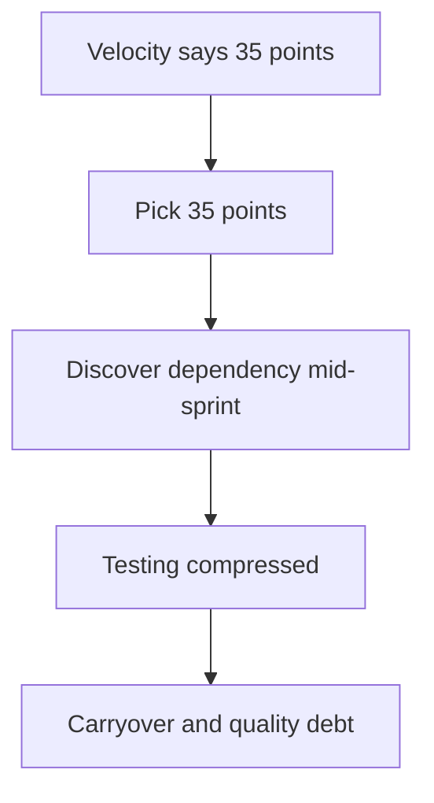
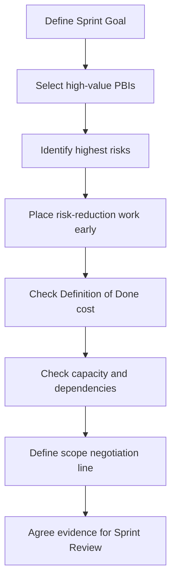

# Part 011 — Sprint Planning for Senior Engineers

## 1. Source notes and scope boundary

This part uses public Scrum guidance and enterprise engineering practice.

Public references to verify independently:

- The Scrum Guide says Sprint Planning initiates the Sprint by laying out the work to be performed, and the plan is created by the collaborative work of the entire Scrum Team.
- The Scrum Guide describes Sprint Planning around why the Sprint is valuable, what can be done, and how the chosen work will get done.
- Scrum.org describes the Sprint Goal as created during Sprint Planning and added to the Sprint Backlog.
- Scrum.org notes that if work becomes more or less complex than expected during the Sprint, Developers collaborate with the Product Owner to negotiate Sprint Backlog scope without affecting the Sprint Goal.

This part does **not** assume CSG uses a specific planning template, velocity method, story point scale, Jira workflow, sprint length, release train, capacity model, or Sprint Goal quality bar.

Use the `Internal verification checklist` sections to validate the actual process in your team.

---

## 2. Core thesis

Sprint Planning is not a meeting to fill engineer calendars.

Sprint Planning is the moment where the Scrum Team decides:

> What valuable outcome can we realistically pursue in this Sprint, given current product priorities, engineering capacity, uncertainty, dependencies, production load, and quality expectations?

For a Senior Java Software Engineer in a Quote & Order team, Sprint Planning is not passive.

You should help the team reason about:

- Sprint Goal quality;
- Product Backlog Item readiness;
- hidden domain risk;
- integration dependency;
- API/event compatibility;
- database migration safety;
- testability;
- rollout constraints;
- incident/support load;
- Definition of Done cost;
- architecture and technical debt impact;
- realistic capacity.

A weak Sprint Planning session asks:

> How many story points can we fit?

A strong Sprint Planning session asks:

> Which coherent set of work can we complete to produce a valuable, verifiable, production-relevant Increment without hiding unacceptable risk?

---

## 3. Sprint Planning is commitment negotiation, not capacity stuffing

The most common planning anti-pattern is treating Sprint Planning as packing items into a fixed-size box.



This is not planning. This is optimistic inventory loading.

Real Sprint Planning must negotiate between:

- Product Goal;
- Sprint Goal;
- product value;
- engineering risk;
- known capacity;
- uncertainty;
- dependency;
- Definition of Done;
- current production responsibilities.

The Sprint Backlog should not be merely a list of tickets. It should be a plan for achieving a Sprint Goal.

---

## 4. The three planning questions

A useful senior-engineer frame is to separate Sprint Planning into three questions.

### 4.1 Why is this Sprint valuable?

This is the Sprint Goal conversation.

Ask:

- What business outcome matters this Sprint?
- What risk are we reducing?
- What customer/product capability are we improving?
- What production problem are we addressing?
- What learning do we need before a larger delivery?
- How does this connect to the Product Goal?

Weak Sprint Goal:

> Complete tickets QO-123, QO-124, QO-125.

Better Sprint Goal:

> Enable safe quote acceptance for enterprise discount scenarios by preserving approval evidence and preventing stale-price acceptance.

Strong Sprint Goal characteristics:

- outcome-oriented;
- understandable by product and engineering;
- narrow enough for a Sprint;
- flexible enough to allow scope negotiation;
- connected to Product Goal;
- testable through evidence;
- not just a ticket list.

### 4.2 What can be done this Sprint?

This is scope selection.

Ask:

- Which PBIs support the Sprint Goal?
- Which PBIs are ready enough?
- Which PBIs are too risky or ambiguous?
- Which dependencies must be resolved first?
- Which work is required by Definition of Done?
- Which work is production support or interrupt load?
- Which items are hard commitments vs stretch?

### 4.3 How will the chosen work get done?

This is engineering planning.

Ask:

- What implementation path is expected?
- Which services/tables/events/APIs are touched?
- What tests are needed?
- What migration or rollout steps exist?
- What design decisions are unresolved?
- Who pairs or reviews?
- What should be done first to de-risk the Sprint?
- What could block us by day 2?

The `how` conversation does not need full task-level micromanagement, but it must expose non-obvious engineering risk.

---

## 5. The senior engineer's role before Sprint Planning

Good Sprint Planning begins before the meeting.

A senior engineer should arrive with context.

### 5.1 Pre-planning checklist

Before planning, review:

- Product Goal / roadmap context;
- top ordered Product Backlog Items;
- refinement notes;
- acceptance criteria quality;
- open dependencies;
- recent incidents;
- production bug load;
- CI/test health;
- release calendar;
- team availability;
- on-call/support rotation;
- pending reviews;
- carryover work;
- architecture/design decisions in progress.

### 5.2 Pre-planning questions for the Product Owner

Ask:

- Which outcome matters most this Sprint?
- Which items are must-have vs negotiable?
- Which customer commitment or date is driving this?
- Which acceptance criteria are product-level vs engineering assumptions?
- Which edge cases are explicitly in scope?
- Which edge cases can be deferred safely?
- What demo/evidence would satisfy the Sprint Review?

### 5.3 Pre-planning questions for engineers

Ask:

- Which items still have unknowns?
- Which item needs a spike before delivery?
- Which item touches risky data or migration?
- Which item touches public API or Kafka event?
- Which item is likely to require another team's input?
- Which previous work might carry over?
- Which test environment is unstable?

A prepared senior engineer helps the meeting become decision-oriented instead of discovery chaos.

---

## 6. Capacity is not just people multiplied by days

Capacity must account for real work.

Common capacity drains:

- vacations/holidays;
- onboarding;
- on-call;
- production support;
- customer escalation;
- release work;
- design review;
- PR review load;
- flaky CI investigation;
- team ceremonies;
- cross-team meetings;
- mandatory training;
- environment instability;
- context switching;
- unresolved carryover.

A team with eight engineers is not automatically eight engineers of feature capacity.

### 6.1 Capacity model

A practical planning model:

```text
Available capacity
  - planned absence
  - recurring meetings
  - on-call/support buffer
  - release/operational work
  - expected review/mentoring load
  - known carryover
  - uncertainty buffer
= realistic sprint capacity
```

### 6.2 Capacity for senior engineers

Senior engineers often carry invisible work:

- reviewing complex PRs;
- unblocking others;
- architecture discussion;
- incident follow-up;
- production diagnosis;
- mentoring;
- cross-team alignment.

If planning ignores this, the team creates a hidden bottleneck.

A senior engineer should say:

> I can own this story, but I also expect to review the DB migration work and support the incident follow-up. I should not be planned at 100% feature capacity.

That is not lack of commitment. That is honest planning.

---

## 7. Sprint Planning for Quote & Order work types

Different work types require different planning depth.

### 7.1 Pure UI or copy change

Planning questions:

- Does it affect customer-visible terminology?
- Does it need localization?
- Does it depend on backend state?
- Does it affect role-based UI visibility?

Usually lower risk unless it changes business meaning.

### 7.2 Backend behavior change

Planning questions:

- Which domain invariant changes?
- Which state transition changes?
- Which tests prove old and new behavior?
- Does it affect existing quotes/orders?
- Does it affect support/audit?

### 7.3 API contract change

Planning questions:

- Is this additive or breaking?
- Is OpenAPI updated?
- Are generated clients impacted?
- Are error semantics changed?
- Are old consumers safe?
- Is versioning/deprecation needed?

### 7.4 Kafka event change

Planning questions:

- Which topic/schema changes?
- Is schema backward-compatible?
- Are consumers known?
- Is replay safe?
- Is partition key unchanged?
- Are correlation/causation IDs preserved?

### 7.5 PostgreSQL migration

Planning questions:

- Is the migration expand-contract safe?
- Does it lock hot tables?
- Does old code work after migration?
- Does new code tolerate partial backfill?
- Is migration tested with production-like data?
- Is rollback/roll-forward understood?

### 7.6 Integration adapter work

Planning questions:

- Is downstream sandbox available?
- Is simulator needed?
- Are timeouts/retries/idempotency defined?
- What happens on unknown outcome?
- Is callback security handled?
- Is support runbook updated?

### 7.7 Security/tenant/audit work

Planning questions:

- Which actor/role/tenant boundary changes?
- Are negative tests included?
- Is audit evidence required?
- Does UI hiding match backend enforcement?
- Is security review needed?

### 7.8 Operational work

Planning questions:

- What production signal improves?
- Is there a measurable before/after?
- Does this reduce incident risk?
- Is runbook linked?
- Is alert noise considered?

---

## 8. Sprint Goal examples for Quote & Order

### 8.1 Weak examples

- Finish quote approval tickets.
- Complete order story points.
- Work on Kafka events.
- Improve tests.

These do not guide trade-offs.

### 8.2 Stronger examples

- Make quote acceptance safe for expired pricing by preventing stale accepted quotes and exposing clear user/API errors.
- Enable order cancellation before fulfillment starts with audited lifecycle transitions and idempotent retry behavior.
- Reduce production diagnosis time for stuck order decomposition by adding correlation, dashboard visibility, and runbook guidance.
- Prepare catalog version migration by adding backward-compatible schema expansion and migration tests.
- Add contract-safe optional field to quote API and verify old generated clients remain compatible.

These goals help the team decide what can be cut without losing the Sprint purpose.

---

## 9. Planning anti-patterns

### 9.1 Ticket packing

Selecting work until velocity is filled, without a coherent Sprint Goal.

Symptom:

- Sprint Review shows disconnected fragments.
- Mid-sprint trade-offs are impossible.
- Developers cannot explain why work matters.

Correction:

- Start from Sprint Goal.
- Choose PBIs that support it.
- Put unrelated items below a clear line.

### 9.2 Hidden Definition of Done

Planning only implementation tasks, then discovering tests, migration, security, docs, and observability later.

Correction:

- Include DoD work in capacity.
- Make AC explicit.
- Split work if DoD makes it too large.

### 9.3 Optimistic dependency planning

Assuming another team, environment, or external system will be ready without confirmation.

Correction:

- Name dependency.
- Identify owner.
- Define fallback.
- Put dependency-resolution task early.

### 9.4 Senior engineer overcommit

A senior engineer takes multiple hard stories plus reviews plus incidents plus mentoring.

Correction:

- Plan visible senior capacity.
- Distribute ownership.
- Pair earlier.
- Create reviewer backups.

### 9.5 Testing pushed to the end

Implementation occupies the first 80% of Sprint; integration/testing starts too late.

Correction:

- Start test design on day 1.
- Deliver vertical slice early.
- Integrate continuously.
- De-risk unknowns first.

### 9.6 Sprint Goal ignored after planning

The Sprint Goal is written but never used.

Correction:

- Use Sprint Goal in Daily Scrum.
- Use Sprint Goal for scope negotiation.
- Use Sprint Goal in Sprint Review.

---

## 10. Risk-first planning sequence

For complex enterprise work, plan in this order.



### 10.1 Risk-reduction first

If a story depends on unknown API behavior, downstream simulator, DB migration feasibility, or security approval, do that early.

Do not leave the riskiest discovery until the last two days.

### 10.2 Scope negotiation line

Split Sprint Backlog into:

- committed core needed for Sprint Goal;
- negotiable supporting work;
- stretch work;
- explicitly deferred work.

This helps the team adapt when reality changes.

---

## 11. Planning for incidents and interrupts

Enterprise teams often support production.

Pretending incidents will not happen creates false commitment.

### 11.1 Interrupt buffer

If historical data shows frequent support load, plan a buffer.

Examples:

- one engineer rotating as interrupt owner;
- reserve capacity for critical production bugs;
- split sprint work so interrupt owner has smaller/less blocking items;
- define policy for when interrupt work enters Sprint Backlog.

### 11.2 Incident during Sprint

If a production incident appears mid-sprint:

- identify severity;
- contain production issue;
- make impact visible to Product Owner;
- renegotiate Sprint Backlog scope;
- protect Sprint Goal if possible;
- capture prevention work as backlog;
- do not hide incident work as invisible overtime.

Scrum is empirical. New information must affect the plan.

---

## 12. Planning output quality

A good Sprint Planning outcome includes:

- Sprint Goal;
- selected PBIs;
- expected evidence/demo;
- key risks;
- key dependencies;
- first de-risking tasks;
- owner/coordination points;
- review/test strategy;
- scope negotiation boundary;
- Definition of Done expectations;
- production/release considerations.

Weak output:

> We selected 30 points.

Strong output:

> Sprint Goal: make quote acceptance safe for stale pricing. Core scope: stale-price guard, API error model, audit event, unit/integration tests. Risk: legacy accepted quote fixtures may not have price snapshot. First two days: verify data shape and add characterization test. Stretch: UI warning. Sprint Review evidence: API call rejection, accepted quote success path, audit event, and dashboard/log trace.

---

## 13. Senior engineer planning checklist

Use this during Sprint Planning.

### 13.1 Sprint Goal

- Is the Sprint Goal outcome-oriented?
- Does it connect to Product Goal or release goal?
- Can it guide trade-offs?
- Can Sprint Review demonstrate it?
- Is it narrow enough for one Sprint?

### 13.2 Scope

- Do selected PBIs support the Sprint Goal?
- Are unrelated PBIs clearly marked as secondary?
- Is core vs stretch explicit?
- Are carryover items understood?

### 13.3 Readiness

- Are acceptance criteria clear enough?
- Are dependencies identified?
- Are unknowns spike-worthy?
- Is design sufficient for the risk level?
- Is DoD cost included?

### 13.4 Engineering risk

- API contract?
- Kafka event?
- DB migration?
- security/tenant/audit?
- performance?
- observability?
- rollback/release?
- customer/on-prem impact?

### 13.5 Capacity

- Who is absent?
- Who is on-call?
- Who has support load?
- Who is onboarding/mentoring?
- Who is required for review?
- Is senior capacity overbooked?

### 13.6 Execution strategy

- What starts first?
- What risk is de-risked first?
- Where can we get early feedback?
- What test can be written early?
- What review should happen before implementation goes too far?

---

## 14. Planning template for a Quote & Order Sprint

```md
# Sprint Planning Notes

## Sprint Goal
<Outcome-oriented goal>

## Product context
- Product Goal / roadmap link:
- Customer/release driver:
- Business risk addressed:

## Core Sprint Backlog
| PBI | Why it matters | Risk | Owner | Evidence |
|---|---|---|---|---|

## Stretch / negotiable work
| PBI | Condition for taking it |
|---|---|

## Dependencies
| Dependency | Owner | Needed by | Fallback |
|---|---|---|---|

## Capacity notes
- Absences:
- On-call/support:
- Review bottlenecks:
- Carryover:

## Engineering risk notes
- API:
- Kafka:
- DB/migration:
- Security/tenant/audit:
- Observability:
- Release/rollback:

## First de-risking actions
1.
2.
3.

## Sprint Review evidence
- Demo:
- Tests:
- Logs/metrics/traces:
- Contract/migration evidence:
```

---

## 15. Internal verification checklist

Verify these inside your team:

- Sprint length.
- Sprint Planning duration and structure.
- Who facilitates planning.
- Who defines Sprint Goal.
- How capacity is calculated.
- Whether story points, t-shirt sizing, or no-estimates are used.
- How incident/support work is planned.
- How carryover is handled.
- How architecture/design tasks enter Sprint Backlog.
- How spikes are planned.
- Whether scope renegotiation during Sprint is normal.
- What Definition of Done requires.
- Whether QA/test work is planned inside Sprint.
- How release work is represented.
- How cross-team dependencies are tracked.
- Whether Sprint Review expects production evidence or only feature demo.

---

## 16. Practical exercise

Take the next planned Sprint Backlog.

Rewrite it in this format:

1. Sprint Goal.
2. Core PBIs supporting the goal.
3. Negotiable PBIs.
4. Highest engineering risks.
5. First two de-risking actions.
6. Review/test strategy.
7. Production/release considerations.
8. Capacity adjustment.

Then ask:

- What would we drop if a production incident consumes 20% capacity?
- What must still be completed to preserve the Sprint Goal?
- What risk must be resolved by day 2?

This is how Sprint Planning becomes real engineering planning.

---

## 17. Key takeaways

- Sprint Planning is commitment negotiation, not calendar stuffing.
- The Sprint Goal should guide scope trade-offs during the Sprint.
- Senior engineers must expose hidden domain, integration, data, security, and production risk.
- Capacity must include review, mentoring, support, incident, and release work.
- Complex Quote & Order work should be planned risk-first.
- A good Sprint Backlog contains both selected PBIs and a strategy for achieving the Sprint Goal.
