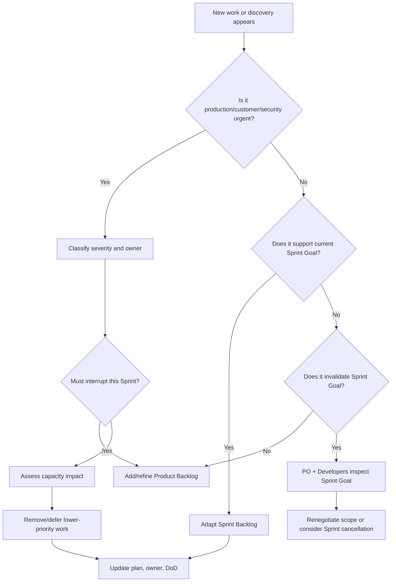

# Part 014 — Mid-Sprint Scope Change and Trade-offs

## 1. Source notes and scope boundary

This part uses the public Scrum Guide and Scrum.org material for Scrum vocabulary.

The Scrum Guide says no changes are made that would endanger the Sprint Goal, quality does not decrease, and the Sprint Backlog may be adjusted throughout the Sprint as more is learned. Scrum.org also explains that a Sprint Goal should not change during the Sprint, although a discovery may invalidate it and require a larger Scrum Team decision, potentially including Sprint cancellation.

This part does **not** assume the exact CSG interrupt policy, incident severity model, customer escalation process, support SLA, on-call rotation, release process, or PO/engineering-manager decision boundary.

Use the internal verification checklist to adapt the playbook to the real team process.

---

## 2. Core thesis

Mid-sprint change is normal.

Mid-sprint chaos is optional.

Enterprise systems constantly produce new information:

- a production incident happens;
- customer escalation arrives;
- API consumer breaks in staging;
- migration dry run reveals lock risk;
- QA finds a critical defect;
- support reports data inconsistency;
- security review blocks a path;
- platform dependency slips;
- domain expert clarifies acceptance criteria differently;
- developer discovers hidden legacy behavior.

Scrum is designed for empiricism, not rigid plan worship.

But adaptation must protect:

- Sprint Goal;
- quality;
- product value;
- transparency;
- team focus;
- production safety;
- sustainable pace.

A senior engineer helps the team transform surprise into explicit trade-off.

---

## 3. The key distinction: plan changes vs goal changes

The Sprint Backlog is a plan.

The Sprint Goal is the commitment.

A plan can adapt.

A goal should be protected.

### 3.1 Example: plan changes but goal survives

Sprint Goal:

> Enable approved quote acceptance for enterprise discount workflow.

Mid-sprint discovery:

- The team learns that an old API client fails when a new enum value appears.

Adaptation:

- Remove low-value UI cleanup from Sprint Backlog.
- Add backward-compatible enum handling.
- Add API contract test.

Goal survives.

### 3.2 Example: goal is invalidated

Sprint Goal:

> Release new order decomposition path for fiber bundle orders.

Mid-sprint discovery:

- Fulfillment adapter cannot support the generated task graph without a downstream change that will not be ready this month.

Possible adaptation:

- Reframe work as discovery/design only;
- cancel or renegotiate Sprint Goal if it no longer makes sense;
- create new backlog items for adapter contract and decomposition design.

Goal may not survive.

This is not failure if discovered early and made transparent.

---

## 4. Types of mid-sprint change

Not all changes are equal.

| Change type | Example | Recommended response |
|---|---|---|
| Clarification | AC detail clarified | Update tasks/tests; preserve goal |
| Discovery | hidden technical risk found | Adapt plan; maybe spike |
| Defect | bug in current sprint work | Fix within same work if related |
| Production incident | live issue consumes capacity | Replan with PO/team |
| Customer escalation | urgent customer-impacting work | Explicit priority trade-off |
| Security issue | vulnerability or auth gap | Treat as high-risk interrupt |
| Dependency slip | platform/adapter unavailable | Re-scope or simulate |
| Quality gap | tests/DoD missing | Add quality work; remove lower priority scope |
| Goal invalidation | Sprint Goal no longer valuable/possible | Scrum Team decision; possibly cancel Sprint |

A senior engineer should classify the change before reacting.

---

## 5. Mid-sprint decision algorithm

Use this algorithm when new work appears.



Questions:

1. Is it urgent or merely important?
2. Does it affect current Sprint Goal?
3. Does it affect production/customer/security?
4. What work must be removed if this is added?
5. What quality criteria must not decrease?
6. Who decides product priority?
7. Who decides technical feasibility?
8. What evidence do we need today?

---

## 6. Trade-off language

A senior engineer should avoid vague statements like:

- "We can squeeze it in."
- "It should be fine."
- "This is small."
- "We just need to fix it quickly."

Use explicit trade-off language.

### 6.1 Trade-off template

```md
New work:
Why it matters:
Urgency:
Impact if not done this Sprint:
Estimated effort / uncertainty:
Risk:
Current Sprint Goal impact:
Work to remove/defer:
Quality criteria that must remain:
Decision owner:
Decision:
```

### 6.2 Example: production bug

```md
New work:
Fix duplicate quote acceptance for tenant A.

Why it matters:
Potential duplicate order creation if customer retries after timeout.

Urgency:
High. Customer-visible and revenue-impacting.

Impact if not done this Sprint:
Support must manually monitor affected quotes; risk continues.

Estimated effort / uncertainty:
Medium. Root cause likely idempotency record race; needs investigation.

Sprint Goal impact:
Consumes capacity from planned order search improvement.

Work to remove/defer:
Defer lower-priority UI filter polish.

Quality criteria:
Must include regression test for duplicate accept and data repair/runbook note if affected data exists.

Decision:
PO agrees to replace UI polish with production fix.
```

This keeps Scrum transparent.

---

## 7. Handling production incidents during Sprint

Production incidents are not "extra work" outside reality.

They consume capacity.

If a production incident takes two engineers for a day, the Sprint plan changed.

### 7.1 Incident impact checklist

Ask:

- Which engineers are involved?
- How much capacity is affected?
- Does incident relate to current Sprint work?
- Does the incident create new urgent backlog items?
- Is there data repair work?
- Is there postmortem/prevention work?
- Does current Sprint Goal remain achievable?
- What lower-priority work should be removed?

### 7.2 Incident-derived work categories

| Work | Treat as |
|---|---|
| Immediate mitigation | Interrupt work |
| Root cause fix | Product Backlog item, may enter current Sprint if urgent |
| Data repair | Controlled production correction work |
| Detection improvement | Operational hardening item |
| Test regression | Quality improvement item |
| Postmortem action | Backlog item with owner |

Do not hide incident work.

Make it visible.

---

## 8. Handling urgent customer escalation

Customer escalation must be handled transparently.

A common failure mode:

- customer request arrives;
- senior engineer starts working directly;
- sprint board remains unchanged;
- planned work slips;
- PO discovers late;
- team blames "interrupts".

Better pattern:

1. Capture escalation as visible work.
2. Classify severity and customer impact.
3. Ask PO for priority trade-off.
4. Ask Developers for feasibility/risk.
5. Remove or defer work explicitly.
6. Define Done for the escalation.
7. Capture prevention follow-up if needed.

### 8.1 Customer escalation Done criteria

For Quote & Order customer issues, Done may include:

- root cause understood;
- customer-specific configuration reviewed;
- fix implemented;
- regression test added;
- data repair completed if needed;
- support note created;
- affected tenant/customer verified;
- deployment path agreed;
- monitoring checked after release.

A customer escalation is not done when code is merged.

It is done when customer/business risk is resolved or explicitly accepted.

---

## 9. Handling discovery during development

Discovery is normal in complex domains.

Example discoveries:

- Quote acceptance depends on payment terms, not only price.
- Old order states exist in production but not in enum code.
- Catalog fixture does not cover retired offering version.
- Kafka consumer assumes event ordering that producer does not guarantee.
- DB migration touches a table with far more rows than expected.
- Tenant-specific configuration changes behavior of validation rule.

### 9.1 Discovery response pattern

When discovery appears:

1. Name the discovery.
2. Explain why it matters.
3. Estimate impact on Sprint Goal.
4. Decide whether to adapt implementation, create spike, split work, or defer.
5. Update backlog/story/design docs.
6. Add test if discovery changes expected behavior.

### 9.2 Discovery statement example

```text
We discovered that accepted quotes can still be amended in one legacy flow. This affects the current stale-price acceptance story because our proposed invariant assumes accepted quote is terminal. We need a domain decision: either exclude amendment flow from this story or update the invariant and tests.
```

This is more useful than:

```text
This story is bigger than expected.
```

---

## 10. Handling dependency slips

Dependencies slip frequently in enterprise systems.

Examples:

- platform environment not ready;
- security review delayed;
- downstream adapter not available;
- QA test data missing;
- customer config not provisioned;
- schema registry permission missing;
- cloud/on-prem packaging dependency delayed.

### 10.1 Dependency response options

| Option | When useful | Risk |
|---|---|---|
| Wait | Dependency likely resolves quickly | hidden idle time |
| Pair/escalate | Dependency owner available | context switching |
| Simulate/fake | Contract known and stable | false confidence if fake unrealistic |
| Split story | independent part still valuable | partial value may be small |
| Replace scope | higher-priority work exists | Sprint Goal may change |
| Cancel/replan | goal invalidated | costly but transparent |

### 10.2 Senior engineer role

The senior engineer should clarify:

- is the dependency real or imagined?
- is there an agreed contract?
- can we test against simulator?
- what assumption must be verified later?
- what is the cost of waiting?
- what work can continue independently?

---

## 11. Scope negotiation with Product Owner

The Product Owner owns Product Backlog ordering and value decisions.

Developers own the plan for creating the Increment and technical feasibility.

Scope negotiation should respect both.

### 11.1 Good negotiation

```text
We can still achieve the Sprint Goal if we drop the advanced search filter and focus on quote acceptance plus approval evidence. The contract test and duplicate-accept regression are necessary for Done. Do you agree to defer advanced search to protect the Sprint Goal?
```

### 11.2 Bad negotiation

```text
We added the production bug, so we probably won't finish some stuff.
```

Good negotiation names exactly what changes.

---

## 12. Quality does not decrease

Mid-sprint pressure often attacks quality first.

Common compromises:

- skip tests;
- skip contract compatibility;
- skip migration dry run;
- skip audit assertion;
- skip runbook update;
- skip security negative test;
- merge giant PR late;
- mark story done but not releasable.

The Scrum Guide principle that quality goals do not decrease is crucial for enterprise backend work.

If capacity changes, reduce scope.

Do not reduce quality silently.

### 12.1 Scope vs quality example

Bad:

> We can still finish the order cancellation feature if we skip duplicate callback tests.

Better:

> Duplicate callback tests are part of Done because cancellation interacts with fulfillment callbacks. We should reduce UI polish or defer one non-critical cancellation reason code, not skip idempotency tests.

---

## 13. Mid-sprint change for Quote & Order work types

### 13.1 API contract change

If new requirement changes API behavior mid-sprint:

Check:

- OpenAPI diff;
- old client compatibility;
- error model;
- idempotency;
- authorization;
- documentation;
- contract tests.

Trade-off:

- add compatibility work;
- defer behavior;
- version endpoint;
- feature flag;
- split story.

### 13.2 Kafka event change

Check:

- schema compatibility;
- consumer list;
- replay safety;
- partition key;
- DLQ behavior;
- event metadata.

Trade-off:

- keep old event and add new optional field;
- create new event type;
- delay consumer behavior;
- add contract/replay test.

### 13.3 PostgreSQL migration change

Check:

- lock risk;
- old/new app compatibility;
- backfill;
- rollback/roll-forward;
- on-prem upgrade;
- production-like data.

Trade-off:

- split expand from contract;
- make migration additive;
- defer constraint;
- create spike;
- remove from Sprint Goal path.

### 13.4 Security/tenant change

Check:

- auth path;
- tenant predicate;
- cache key;
- audit;
- negative tests;
- support/admin tooling.

Trade-off:

- block merge until reviewed;
- reduce feature scope;
- add security spike;
- escalate.

### 13.5 Production bug fix

Check:

- blast radius;
- root cause;
- customer impact;
- data repair;
- regression test;
- release path.

Trade-off:

- interrupt current sprint;
- defer lower-value feature work;
- split mitigation from full prevention;
- add postmortem action.

---

## 14. Mid-sprint replanning mini-template

Use this when Sprint plan changes.

```md
# Mid-Sprint Replanning Note

## Trigger
- What changed?

## Impact
- Sprint Goal:
- Capacity:
- Risk:
- Customer/production impact:

## Options
1. Keep original plan:
2. Add new work and remove X:
3. Split/defer:
4. Cancel/reframe Sprint Goal:

## Decision
- Chosen option:
- Work added:
- Work removed/deferred:
- Quality criteria preserved:
- Owner:
- Review date:
```

Keep it lightweight.

The purpose is transparency, not bureaucracy.

---

## 15. Anti-patterns

### 15.1 Invisible work

Production/support work happens but is not on board.

Result:

- capacity looks fake;
- Sprint appears failed;
- learning is lost.

### 15.2 Everything is urgent

If every request interrupts the Sprint, the team has no product focus.

Use severity and impact.

### 15.3 PO bypass

Engineers accept scope changes directly from stakeholders without PO visibility.

Result:

- Product Backlog ordering becomes meaningless.

### 15.4 Quality bargaining

Team preserves scope by dropping tests/DoD.

Result:

- Sprint output looks complete but production risk increases.

### 15.5 Late surprise

Team knows by day 3 that Sprint Goal is at risk but waits until Sprint Review to say it.

Result:

- Scrum loses adaptation value.

### 15.6 Scope hiding inside refactor

Engineer expands a story into broad refactor without surfacing impact.

Result:

- review risk, testing risk, missed goal.

### 15.7 Incident work without prevention

Team fixes production issue but never adds test/alert/runbook improvement.

Result:

- recurrence.

---

## 16. Internal verification checklist

Verify with your CSG team:

- How are urgent production issues handled during a Sprint?
- Who can add work to current Sprint?
- How does PO approve mid-sprint trade-offs?
- What is the incident severity model?
- Does the team reserve interrupt buffer?
- How is on-call/support work reflected in capacity?
- What work can bypass normal Sprint Planning?
- How are customer escalations prioritized?
- What is the rule for Sprint Goal renegotiation?
- Has the team ever cancelled a Sprint? Under what condition?
- Does quality/DoD ever get negotiated down?
- How are postmortem action items added to backlog?
- Are data repair tasks visible on the board?
- How are cross-team blockers escalated?
- How is scope removed when new urgent work is added?

---

## 17. Senior engineer checklist for mid-sprint change

When new work appears, ask:

1. Is this urgent, important, or simply new?
2. Is customer/production/security impact real?
3. Does it support or threaten Sprint Goal?
4. What must be removed if this is added?
5. What quality criteria are non-negotiable?
6. Does this require PO priority decision?
7. Does this require technical feasibility decision?
8. Does this require architecture/security/platform input?
9. Does this require data repair or operational readiness?
10. How will we know the adapted plan worked?

A senior engineer makes trade-offs explicit before they become failure.

---

## 18. Practical exercise

Take one real mid-sprint interruption from your team.

Classify it:

- production incident;
- customer escalation;
- technical discovery;
- dependency slip;
- quality gap;
- stakeholder request.

Then write:

```md
Trigger:
Why it mattered:
Original Sprint Goal:
Impact on Sprint Goal:
Work added:
Work removed/deferred:
Quality criteria preserved:
Decision owner:
What we learned:
Prevention/follow-up:
```

Discuss in Retrospective:

- Was the interruption handled transparently?
- Did the team adapt early enough?
- Was quality preserved?
- Did Product Backlog ordering remain meaningful?
- Did the team create prevention work if needed?

---

## 19. Part summary

Mid-sprint change is not a Scrum failure.

It is the normal result of empirical product development.

The failure is when change becomes invisible, unmanaged, or quality-eroding.

For senior engineers, the job is to help the Scrum Team:

- classify new information;
- protect Sprint Goal;
- preserve quality;
- expose capacity impact;
- negotiate scope transparently;
- handle production/customer urgency responsibly;
- convert surprises into learning.

Good Scrum does not mean the plan never changes.

Good Scrum means the team changes the plan intelligently.
