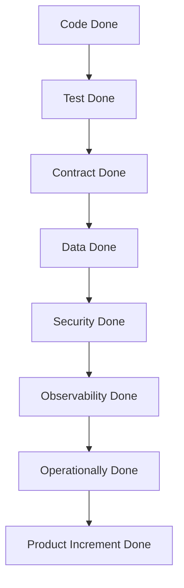

# Part 016 — Definition of Done for Enterprise Backend Work

## 1. Source notes and scope boundary

This part uses public Scrum references and enterprise backend engineering practice, especially:

- The Scrum Guide definition of the Increment and Definition of Done.
- Scrum.org guidance that Definition of Done describes the state of the Increment when it meets product quality measures.
- The previous parts on acceptance criteria, story slicing, production readiness, testing, security, observability, Kafka, PostgreSQL, Kubernetes, and operational readiness.

This part does **not** assume your team already has a mature DoD, release gate, ORR process, observability standard, database migration standard, security checklist, or platform engineering checklist.

Use the `Internal verification checklist` sections to adapt the model to your actual CSG team agreements.

---

## 2. Core thesis

Definition of Done is the Scrum Team's shared quality contract.

For enterprise backend work, Done cannot mean:

- code written;
- PR merged;
- unit tests passed;
- QA said okay;
- deployed to test environment;
- feature works on happy path.

Done should mean:

> The Increment meets the agreed product quality bar and has no hidden work required to make it usable, supportable, secure, observable, and safely releasable according to the team's context.

For Quote & Order systems, this is crucial.

A story can be functionally correct but not Done if:

- audit event is missing;
- tenant isolation is untested;
- Kafka event contract is not compatible;
- DB migration is unsafe;
- old quotes/orders cannot survive version skew;
- logs do not include correlation ID;
- support cannot diagnose fallout;
- runbook is missing;
- feature flag state is unclear;
- on-prem upgrade path is unverified;
- release/rollback plan is unknown.

DoD is how a Scrum Team prevents “done in development” from becoming “not ready for production”.

---

## 3. Acceptance Criteria vs Definition of Done

Acceptance Criteria and Definition of Done are related but different.

| Concept | Scope | Example |
|---|---|---|
| Acceptance Criteria | Specific to one Product Backlog Item | Quote cannot be accepted after price expiry |
| Definition of Done | Shared quality standard for every Increment | Code reviewed, tests pass, audit/security/observability considered |

Acceptance Criteria answer:

> Did this item implement the expected behavior?

Definition of Done answers:

> Is the resulting Increment complete at the required quality level?

A story may satisfy acceptance criteria but fail DoD.

Example:

- AC: API returns `409 QUOTE_PRICE_EXPIRED` when quote price is expired.
- Missing DoD: no integration test, no audit/log correlation, no API contract update, no negative security test, no support note.

The behavior exists, but the work is not production-grade.

---

## 4. DoD as a quality floor, not a wish list

A weak DoD is vague:

```md
- Code complete
- Tested
- Reviewed
- Documented
```

A useful DoD is specific enough to guide decisions:

```md
- Code reviewed by appropriate owner.
- Relevant unit/integration/contract tests pass.
- Public API/event/schema changes are documented and compatibility-checked.
- DB migrations are backward-compatible or have approved rollout plan.
- Security/tenant/audit impact has been assessed.
- Logs/metrics/traces expose required diagnostic signals.
- Feature is deployable and rollback/disable path is understood.
```

The DoD should be:

- clear;
- realistic;
- enforceable;
- inspectable;
- evolved through Retrospective;
- adapted to product risk;
- not so bloated that every story becomes impossible.

A DoD that nobody can meet becomes theater.

A DoD that is too weak creates production risk.

---

## 5. Layers of Done

For enterprise backend work, it helps to distinguish layers.



### 5.1 Code Done

- implementation complete;
- code style/conventions followed;
- complexity acceptable;
- no dead/debug code;
- error handling meaningful;
- transactional boundaries intentional.

### 5.2 Test Done

- unit tests for domain logic;
- integration tests for DB/Kafka/external boundary where relevant;
- contract tests for API/event changes;
- negative tests for error/security cases;
- flaky tests not ignored.

### 5.3 Contract Done

- OpenAPI updated if REST API changed;
- event schema updated if Kafka payload changed;
- consumer compatibility considered;
- error codes stable/documented;
- generated clients or examples updated if relevant.

### 5.4 Data Done

- migration safe;
- backfill plan exists if needed;
- old/new version compatibility considered;
- query performance checked for hot paths;
- tenant predicates preserved.

### 5.5 Security Done

- auth/authz impact reviewed;
- tenant isolation preserved;
- audit requirements met;
- secrets not exposed;
- PII/commercial-sensitive data not logged improperly.

### 5.6 Observability Done

- logs include key identifiers;
- metrics/traces support diagnosis;
- dashboards/alerts updated if operational behavior changes;
- runbook updated if support path changes.

### 5.7 Operationally Done

- deployable;
- configurable;
- rollback/disable path known;
- support/QA/product verification complete;
- release notes or enablement notes ready if needed.

---

## 6. Generic DoD for enterprise backend teams

A baseline DoD might look like this.

```md
# Definition of Done — Enterprise Backend Baseline

A Product Backlog Item is Done only when:

## Behavior
- Acceptance Criteria are satisfied.
- Business edge cases and failure paths relevant to the item are handled.
- Domain invariants are preserved.

## Code Quality
- Code follows team conventions.
- Code is reviewed and approved by appropriate owners.
- Complexity is reasonable and naming is clear.
- No temporary/debug code remains.

## Tests
- Relevant unit tests are added/updated.
- Relevant integration tests are added/updated.
- Contract tests are added/updated for API/event changes.
- Migration tests are added/updated for DB changes.
- Tests pass in CI.

## Data and Compatibility
- Database migrations are safe for deployment topology.
- Backward/forward compatibility is considered.
- Existing data and in-flight workflows are not broken.
- Query performance impact is considered for hot paths.

## Security and Compliance
- Authentication/authorization impact is reviewed.
- Tenant isolation is preserved.
- Audit events are added/updated where required.
- Sensitive data is not exposed in logs, metrics, traces, events, or errors.

## Observability and Operations
- Logs/metrics/traces are sufficient to diagnose failures.
- Dashboards/alerts/runbooks are updated when operational behavior changes.
- Feature flag/config changes are documented.
- Rollback/disable/repair path is understood.

## Documentation and Communication
- API/event/docs/examples are updated if user/consumer-facing behavior changes.
- Product/QA/support notes are updated if needed.
- Known limitations are explicit.
```

The team should tailor this.

DoD should be a team agreement, not a copy-paste checklist from another organization.

---

## 7. DoD by work type

A single baseline DoD is useful, but different work types need extra clauses.

## 7.1 DoD for REST API changes

Additional Done conditions:

- OpenAPI specification updated.
- Request/response examples updated.
- Error model documented.
- Backward compatibility checked.
- Authentication/authorization behavior tested.
- Pagination/filtering/sorting semantics tested if affected.
- Idempotency behavior tested if command endpoint.
- Consumer impact reviewed.
- API logs include correlation ID and business key where safe.

Quote & Order examples:

- `POST /quotes/{id}/accept` must be idempotent.
- `GET /orders/{id}` must enforce tenant and account scope.
- API error `QUOTE_PRICE_EXPIRED` must be stable and machine-readable.

## 7.2 DoD for Kafka event changes

Additional Done conditions:

- Event schema updated.
- Schema compatibility checked.
- Event versioning strategy followed.
- Partition key reviewed.
- Required metadata present: event ID, tenant ID, aggregate ID, event type, occurred time, correlation ID, causation ID.
- Producer test added.
- Consumer compatibility considered.
- Replay/idempotency behavior considered.
- DLQ/retry behavior understood.
- Event does not leak forbidden data.

Quote & Order examples:

- `QuoteAccepted` event must represent committed quote state.
- `ProductOrderStateChanged` must be replay-safe.
- Duplicate callback must not create duplicate completion event.

## 7.3 DoD for PostgreSQL migration changes

Additional Done conditions:

- Migration reviewed for lock/runtime risk.
- Backward compatibility with currently deployed app considered.
- Forward compatibility with new app considered.
- Expand-contract used if needed.
- Large-table operation assessed.
- Backfill is chunked/idempotent if needed.
- Rollback or roll-forward strategy documented.
- Query plan impact checked for hot paths.
- On-prem/customer upgrade path considered if relevant.

Quote & Order examples:

- Adding a non-null approval evidence column requires staged rollout.
- Adding an index to hot order table requires lock analysis.
- Changing order state enum requires old data compatibility.

## 7.4 DoD for security-sensitive changes

Additional Done conditions:

- Authn/authz matrix reviewed.
- Negative authorization tests added.
- Cross-tenant tests added if relevant.
- Service-to-service identity behavior verified.
- Audit event created/updated.
- Error response does not leak sensitive information.
- Logs/traces/events do not expose PII or sensitive commercial details.
- Security owner review if required.

Quote & Order examples:

- Approval authority change must test insufficient authority.
- Tenant filter change must test direct object access across tenants.
- Admin repair action must require reason and audit.

## 7.5 DoD for observability changes

Additional Done conditions:

- Metric names/tags reviewed for cardinality and sensitivity.
- Logs include correlation ID and safe business identifiers.
- Trace propagation preserved.
- Dashboard updated if new operational state introduced.
- Alert/runbook updated if new failure mode introduced.
- Synthetic or manual verification path documented if needed.

Quote & Order examples:

- New order decomposition path needs fallout/error metric.
- New Kafka consumer needs lag/DLQ visibility.
- New pricing rule needs error/latency monitoring.

## 7.6 DoD for feature flags/configuration

Additional Done conditions:

- Default value documented.
- Flag owner identified.
- Rollout scope defined.
- Kill switch behavior tested.
- Flag state observable.
- Flag combinations considered.
- Cleanup/removal plan exists.
- Customer/tenant-specific behavior documented.

Quote & Order examples:

- New decomposition algorithm behind tenant-scoped flag.
- New pricing validation behind default-off flag until verified.
- Old path removal tracked after rollout.

---

## 8. DoD and release readiness

A Scrum Increment can be Done before being released, depending on organizational context.

But if Done work still requires major hardening before release, the DoD is probably too weak.

Use this distinction:

| State | Meaning |
|---|---|
| Code complete | Implementation likely finished |
| Merged | Code integrated into branch |
| Done | Meets team quality standard |
| Releasable | Can be released safely according to release process |
| Released | Available in production/customer environment |
| Enabled | Feature active for target user/tenant/customer |

For enterprise products, the gap between Done and Released can be real:

- release train schedule;
- customer maintenance window;
- on-prem packaging;
- feature flag enablement;
- staged rollout;
- compliance approval.

But DoD should minimize hidden engineering work after Sprint.

If every Sprint produces work that needs a hardening sprint, inspect the DoD.

---

## 9. DoD and Sprint Planning

During Sprint Planning, ask:

- Can this item meet DoD within the Sprint?
- Which DoD clauses are likely expensive?
- Does this story need DB migration evidence?
- Does this story need API/event compatibility review?
- Does this story need security review?
- Does this story need test data or simulator support?
- Does this story need runbook/dashboard update?
- Does this story need support/product documentation?

If the team cannot realistically meet DoD, do not pretend.

Options:

- split the story;
- create a spike;
- reduce scope;
- add missing enabler work;
- clarify acceptance criteria;
- change Sprint Goal;
- explicitly defer nonessential work only if quality is not compromised.

DoD makes planning honest.

---

## 10. DoD and Daily Scrum

Use DoD during Daily Scrum.

Questions:

- Which active item is at risk of missing DoD?
- Which item has code done but test not done?
- Which item has API behavior done but contract not done?
- Which item has implementation done but observability missing?
- Which item needs security/domain review today?
- Which item is blocked by environment/test data?
- Which item is Done except runbook/release notes?

This prevents late-sprint surprise.

---

## 11. DoD and Sprint Review

Sprint Review should inspect Done Increment evidence.

For backend work, evidence may include:

- API behavior demo;
- event emitted and consumed;
- dashboard panel;
- audit event;
- test report;
- migration dry run;
- feature flag behavior;
- runbook snippet;
- performance comparison;
- trace/log correlation;
- support workflow.

Do not force every backend change into a UI demo.

A production-grade backend demo can show evidence.

Example Sprint Review demo:

> We added quote acceptance rejection for expired pricing. Here is the API response, audit event, metric, log correlation, integration test result, and Product Owner-visible behavior. The feature is behind flag X and default on for test tenant only.

That is much stronger than:

> The ticket is done.

---

## 12. DoD and Retrospective

DoD should evolve through inspection.

Retro questions:

- Which Done items still caused bugs?
- Which quality gaps were discovered after Sprint?
- Which DoD clauses were unclear?
- Which DoD clauses were unrealistic?
- Which DoD clauses were skipped under pressure?
- Which recurring defect should become a DoD clause?
- Which obsolete DoD item should be removed?

Examples:

- Escaped defects show tenant isolation tests missing → add tenant check to relevant DoD category.
- Repeated production issue due to missing logs → add correlation ID/logging clause.
- PRs blocked by vague review ownership → add reviewer ownership clause.
- Migration caused lock issue → add migration lock analysis clause.

DoD is not static.

It should learn from production.

---

## 13. DoD anti-patterns

### 13.1 Done means merged

This creates hidden QA, documentation, and production-readiness work.

### 13.2 Done means QA tested it later

Testing becomes a phase, not part of Increment creation.

### 13.3 DoD is too generic

“Tested” and “documented” mean different things to different people.

### 13.4 DoD is impossible

A DoD requiring full performance test, full E2E, security review, and architecture approval for every text change creates bureaucracy.

Use risk-based categories.

### 13.5 DoD is ignored under deadline

If deadline pressure always bypasses DoD, DoD is not the real quality contract.

### 13.6 DoD is only engineering-owned

Product, QA, security, support, and operations expectations may also define what usable quality means.

DoD is a Scrum Team agreement but should be informed by stakeholders.

### 13.7 DoD hides release work

If release notes, runbooks, dashboards, migration evidence, and support handoff always happen after the Sprint, the Increment may not be truly usable.

---

## 14. DoD examples by Quote & Order scenario

## 14.1 Quote approval rule change

Done means:

- rule behavior implemented;
- approval threshold edge cases tested;
- unauthorized approver negative test added;
- quote modification invalidates approval if required;
- audit event includes actor/authority/reason;
- API error model updated if changed;
- metrics/logs support diagnosis;
- product owner verifies business examples;
- no accepted quote compatibility issue.

## 14.2 Order cancellation endpoint

Done means:

- allowed/forbidden states tested;
- idempotent repeated cancellation tested;
- downstream fulfillment cancellation behavior tested/mocked;
- order item state transition consistent;
- Kafka event emitted after commit;
- audit event written;
- tenant and authorization negative tests added;
- runbook updated for stuck cancellation if relevant.

## 14.3 Kafka event field addition

Done means:

- schema updated;
- field optional or compatibility-safe;
- producer populated correctly;
- consumer tolerance verified;
- event example updated;
- no sensitive data leak;
- replay behavior unaffected;
- contract/schema compatibility gate passes.

## 14.4 PostgreSQL index addition

Done means:

- query plan before/after reviewed;
- migration safe for hot table;
- index name and predicate clear;
- runtime/lock behavior considered;
- rollback/cleanup plan documented;
- migration test passes;
- on-prem DB version constraints considered if relevant.

## 14.5 New feature flag

Done means:

- default state defined;
- flag owner documented;
- behavior tested on/off;
- tenant/customer scope tested if relevant;
- observability shows flag state or behavior path;
- cleanup/removal task created;
- support/product knows how it is enabled.

---

## 15. Risk-based DoD tailoring

Not every item needs every check.

Use risk-based tailoring.

### 15.1 Low-risk item

Example:

- internal wording improvement;
- documentation update;
- minor refactor with characterization tests.

Required:

- review;
- relevant tests if code changed;
- no behavioral/contract/security/data impact.

### 15.2 Medium-risk item

Example:

- optional API field;
- small validation rule;
- dashboard metric;
- low-risk internal workflow change.

Required:

- targeted tests;
- compatibility check;
- observability if behavior changes;
- documentation/examples if consumer-facing.

### 15.3 High-risk item

Example:

- pricing/approval logic;
- order state transition;
- Kafka schema change;
- DB migration;
- tenant/security behavior;
- customer-facing API change.

Required:

- domain tests;
- integration/contract tests;
- migration/security/observability review;
- rollout/rollback thinking;
- runbook/support note if operational behavior changes.

### 15.4 Critical-risk item

Example:

- destructive data migration;
- auth framework change;
- tenant isolation architecture change;
- billing handoff behavior;
- on-prem upgrade behavior;
- broad order orchestration change.

Required:

- design/architecture review;
- ORR-style readiness;
- security review;
- production-like validation;
- explicit go/no-go;
- data repair plan;
- stakeholder communication.

---

## 16. DoD and engineering ownership

A DoD is only useful if people own the hard parts.

Ask:

- Who reviews DB migrations?
- Who reviews public API contracts?
- Who reviews Kafka event schema changes?
- Who reviews security-sensitive changes?
- Who owns runbooks?
- Who owns dashboards?
- Who verifies product acceptance?
- Who approves feature flag rollout?

If the DoD requires an activity but no one owns it, work will stall.

This connects DoD to flow.

A DoD clause without ownership becomes a queue.

---

## 17. Implementing DoD in tools

Do not rely only on memory.

Make DoD visible in the workflow.

Options:

- checklist in ticket template;
- PR template;
- automated CI gates;
- code owners;
- migration review label;
- API contract diff gate;
- security review label;
- dashboard/runbook checklist;
- release checklist;
- Definition of Done page linked from board.

### 17.1 PR template example

```md
## Intent
What behavior changes?

## Affected surfaces
- API:
- Kafka:
- DB/migration:
- Security/tenant/audit:
- Observability:
- Deployment/config:

## Tests
- Unit:
- Integration:
- Contract:
- Migration:
- E2E/manual:

## Compatibility and rollout
- Backward compatibility:
- Feature flag:
- Rollback/disable:

## Definition of Done
- [ ] Acceptance Criteria satisfied
- [ ] Relevant tests pass
- [ ] API/event/docs updated if applicable
- [ ] Migration/security/observability impact reviewed
- [ ] No hidden production-readiness work remains
```

Automation should support judgment, not replace it.

---

## 18. Internal verification checklist

Validate these in your actual CSG/team context.

### 18.1 Existing DoD

- Does the team have a written Definition of Done?
- Where is it stored?
- Is it actually used?
- Is it risk-based or one-size-fits-all?
- Who can update it?
- Is it reviewed in Retrospective?

### 18.2 Quality gates

- Which tests are mandatory in CI?
- Are integration tests required?
- Are contract tests required for API/event changes?
- Are migration tests required?
- Are security scans required?
- Are flaky tests tolerated?

### 18.3 Domain/product acceptance

- Who verifies acceptance criteria?
- Does QA participate in refinement?
- Does Product Owner verify backend behavior through evidence?
- Are edge cases captured before Sprint?

### 18.4 Architecture and compatibility

- When is design review required?
- When is ADR required?
- How are API changes reviewed?
- How are Kafka schema changes reviewed?
- How are DB migrations reviewed?
- How is on-prem compatibility checked?

### 18.5 Operations

- Are logs/metrics/traces part of DoD?
- Are dashboards/runbooks part of DoD?
- Is rollback/disable path part of DoD?
- Are feature flags tracked?
- Are release notes/support notes required?

### 18.6 Security and audit

- Are auth/tenant/audit checks in DoD?
- Are negative security tests required?
- Is PII/logging reviewed?
- Who approves security-sensitive changes?

---

## 19. Senior engineer DoD review checklist

When reviewing whether a story is Done, ask:

### Behavior

- Are acceptance criteria actually satisfied?
- Are important edge cases tested?
- Are illegal lifecycle transitions prevented?
- Does behavior match Product Owner expectation?

### Data

- Is persisted state valid?
- Does migration preserve old data?
- Is version skew safe?
- Are tenant predicates preserved?

### Contract

- Did API/event schema change?
- Are consumers compatible?
- Are error codes stable?
- Are examples/docs updated?

### Security/audit

- Is authorization correct?
- Is tenant isolation tested?
- Is audit evidence sufficient?
- Is sensitive data protected?

### Observability/operations

- Can support diagnose failure?
- Are logs/metrics/traces sufficient?
- Is alert/runbook needed?
- Is rollback/disable path understood?

### Flow

- Is anything still waiting after “Done”?
- Is QA/product verification complete?
- Is release readiness hidden in another queue?

---

## 20. Practical exercise: improve your team DoD

Take your current team DoD, or draft one if it does not exist.

Classify each item:

| DoD item | Clear? | Enforceable? | Risk-based? | Owner known? | Evidence source |
|---|---|---|---|---|---|
| Code reviewed | yes | yes | all work | reviewer | PR approval |
| Tested | no | weak | unclear | unclear | unclear |
| Logs updated | maybe | weak | only operational changes | team | dashboard/log review |

Then improve the weakest three items.

Do not try to create a perfect DoD immediately.

Start with the gaps that caused real defects, rework, or release delays.

---

## 21. Practical exercise: create DoD variants

Create DoD addenda for these work types:

1. REST API change.
2. Kafka event change.
3. PostgreSQL migration.
4. Security/tenant change.
5. Production incident fix.
6. Feature flag rollout.
7. Customer-specific configuration change.

For each, specify:

- required tests;
- required review;
- required documentation;
- required observability;
- required rollback/repair consideration.

This turns DoD into a usable engineering tool.

---

## 22. Summary

Definition of Done is the Scrum Team's shared quality contract.

For enterprise backend engineering, DoD must cover more than code and tests.

It should include:

- business behavior;
- domain invariants;
- API/event compatibility;
- database migration safety;
- security and tenant isolation;
- audit evidence;
- observability;
- runbooks/supportability;
- rollout/rollback readiness;
- documentation and stakeholder communication.

The key principle:

> A Product Backlog Item is not Done because implementation stopped. It is Done when the Increment meets the product's agreed quality bar and can be trusted by users, operators, consumers, and future engineers.
