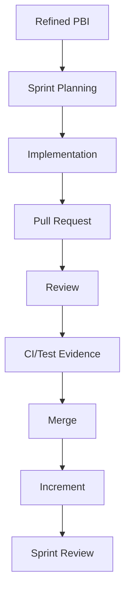

# Part 018 — PR Review as Sprint Quality Control

## 1. Source notes and scope boundary

This part uses public engineering practice references, especially:

- Google Engineering Practices on code review quality and code health.
- Scrum Guide concepts around Done Increment, Sprint Backlog adaptation, and Developers' accountability for creating a usable Increment.
- Previous parts on PR review, testing strategy, Definition of Done, and flow/WIP.

This part does **not** assume CSG uses GitHub, GitLab, Bitbucket, Gerrit, a specific branch strategy, mandatory reviewer rules, CODEOWNERS, merge queues, trunk-based development, release branches, or a particular internal review culture.

Verify internally:

- PR tooling,
- reviewer assignment policy,
- approval rules,
- branch strategy,
- merge queue policy,
- CODEOWNERS or ownership mapping,
- review SLA expectations,
- CI requirements,
- security review triggers,
- architecture review triggers.

---

## 2. Core thesis

PR review is not a bureaucratic checkpoint.

PR review is a Sprint quality-control loop.

It protects the Increment before the cost of change increases.

For a senior engineer, PR review should answer:

> Does this change preserve product correctness, system safety, maintainability, operability, and team understanding?

Not merely:

> Does this code look stylistically acceptable?

In Quote & Order systems, a PR can break production even if code style is perfect.

Review must reason about:

- quote lifecycle,
- pricing and approval rules,
- order state transitions,
- API compatibility,
- Kafka event compatibility,
- PostgreSQL transaction safety,
- migration risk,
- tenant isolation,
- audit evidence,
- observability,
- rollback and supportability.

---

## 3. PR review in Scrum flow

A PR is not separate from Scrum.

It is where Sprint Backlog work becomes inspectable technical evidence.



If PR review is slow, shallow, or late, Sprint flow suffers.

Symptoms:

- work piles up at end of Sprint,
- review queue becomes bottleneck,
- defects escape because reviews are rushed,
- Done becomes ambiguous,
- Sprint Review demos incomplete work,
- engineers avoid small PRs because review is painful.

A healthy team treats review as part of execution, not an afterthought.

---

## 4. Review dimensions

A good senior review checks multiple dimensions.

| Dimension | Review question |
|---|---|
| Product behavior | Does it implement the intended business behavior? |
| Domain invariant | Does it preserve quote/order/pricing/approval lifecycle rules? |
| API contract | Is REST/OpenAPI/TMF behavior compatible? |
| Event contract | Are Kafka events schema-compatible and replay-safe? |
| Data safety | Are transactions, locks, migrations, and tenant predicates safe? |
| Security | Are authentication, authorization, tenant isolation, and audit correct? |
| Observability | Can failure be detected and diagnosed? |
| Testing | Does evidence match risk? |
| Maintainability | Is the code understandable and localized? |
| Sprint flow | Is PR scope reviewable and mergeable? |

Style is one dimension.

It should not crowd out correctness.

---

## 5. PR review starts before the PR

Many PR review problems are really refinement/planning problems.

If the story is vague, PR review becomes requirement discovery.

If the story is too large, PR review becomes architecture review.

If the design is unclear, PR review becomes debate.

If acceptance criteria lack testing detail, PR review becomes quality negotiation.

A senior engineer should prevent review overload by improving earlier Scrum events.

### 5.1 Before implementation

Ask:

- Is the story small enough for one PR or predictable PR sequence?
- Is architecture direction clear?
- Are API/event changes agreed?
- Are migration risks known?
- Are tests expected?
- Who should review?
- Is security/architecture/platform review needed?

### 5.2 During implementation

Encourage draft PRs for early feedback when:

- design is uncertain,
- mapper query is complex,
- event schema change is risky,
- migration is non-trivial,
- external integration is involved,
- PR may grow too large.

Draft PRs are excellent Scrum transparency tools.

---

## 6. PR size and review quality

Small PRs improve flow and review accuracy.

But “small” does not mean trivial.

A good PR is:

- coherent,
- reviewable,
- testable,
- revertible or safely roll-forwardable,
- aligned with one behavior or technical step.

### 6.1 PR slicing examples

Bad PR:

- new quote approval feature,
- DB migration,
- API response change,
- UI change,
- Kafka event change,
- refactor approval service,
- add dashboard,
- fix unrelated mapper bug.

Better sequence:

1. Add approval domain tests and internal model.
2. Add DB schema expand migration.
3. Add API behavior behind flag.
4. Add Kafka event field compatibly.
5. Add UI flow.
6. Add observability/runbook.
7. Remove old path after rollout.

Each PR should have its own evidence.

---

## 7. PR description as review artifact

A good PR description reduces reviewer cognitive load.

Template:

```md
## Summary
What changed and why?

## Business/domain impact
Which quote/order/pricing/catalog behavior is affected?

## Technical impact
API:
Kafka:
DB/migration:
Security/tenant/audit:
Observability:

## Test evidence
Unit:
Integration:
Contract:
Migration:
Security:
E2E/manual:

## Rollout/rollback
Feature flag:
Migration sequencing:
Rollback/roll-forward:

## Known gaps / follow-ups
What is intentionally deferred?
```

This template is especially useful for high-risk enterprise backend PRs.

---

## 8. Reviewing Java service code

When reviewing Java backend code, look beyond syntax.

### 8.1 Layering and responsibility

Check:

- Does controller handle HTTP concerns only?
- Does application service coordinate use case?
- Is domain logic in domain/application layer, not mapper/controller?
- Is persistence model leaking into API model?
- Are transactions at correct boundary?
- Are external calls inside transactions avoided unless intentionally safe?
- Are exceptions mapped consistently?

### 8.2 Domain language

Check:

- Are names aligned with product/domain vocabulary?
- Does code distinguish quote, quote version, quote item, order, order item?
- Are lifecycle states explicit?
- Are ambiguous terms clarified?
- Is customer-specific behavior named and isolated?

### 8.3 Complexity

Check:

- Is branching justified by domain rules?
- Are large methods hiding multiple behaviors?
- Can tests explain the rule matrix?
- Would a future engineer know where to add a new rule?

---

## 9. Reviewing Quote & Order domain correctness

For quote work, ask:

- Does this affect draft, priced, pending approval, approved, accepted, expired, or rejected quotes?
- Does it preserve quote versioning?
- Does it preserve pricing snapshot?
- Does it preserve catalog version/effective date?
- Does it preserve approval evidence?
- Can accepted quotes be modified accidentally?
- What happens on duplicate accept request?
- Is stale price handled?

For order work, ask:

- Does this affect order header state or item state?
- Are state transitions legal?
- Does parent state match child states?
- Is decomposition idempotent?
- Is cancellation/amendment considered?
- What happens on duplicate callback?
- What happens on partial fulfillment?
- Is fallout visible and recoverable?

For catalog/pricing work, ask:

- Is latest catalog being used where snapshot should be used?
- Are effective dates handled?
- Are retired offerings handled?
- Are money/currency/rounding rules explicit?
- Is customer agreement overlay correct?
- Are approval thresholds recalculated correctly?

---

## 10. Reviewing API changes

API review should include compatibility and semantics.

Check:

- Is OpenAPI updated?
- Is endpoint behavior backward-compatible?
- Are new fields optional where needed?
- Are required fields safe?
- Are enum changes safe for consumers?
- Are error codes stable?
- Are idempotency semantics preserved?
- Are pagination/filtering semantics preserved?
- Are auth scopes documented and enforced?
- Are TMF-aligned fields used consistently?

### 10.1 API review comment example

Weak:

> Why did you change this response?

Better:

> This changes `quoteStatus` from `APPROVED` to `APPROVED_WITH_EXCEPTION`. That may be additive from our perspective, but consumers with exhaustive enum handling could fail. Can we confirm OpenAPI/client compatibility and add this to the API changelog or use an extension field if the state is internal-only?

---

## 11. Reviewing Kafka/event changes

Event changes need special review.

Check:

- Is event type new or changed?
- Is schema backward-compatible?
- Is partition key unchanged?
- Is event emitted after DB commit?
- Is outbox used where needed?
- Is event replay-safe?
- Is duplicate handling safe?
- Are correlation and causation IDs present?
- Is tenant ID present?
- Are consumers known?
- Are DLQ/retry implications understood?

### 11.1 Event review comment example

> This publishes `ProductOrderCompleted` directly after the downstream callback before the DB transaction commits the item states. If DB commit fails, consumers may observe completion that source-of-truth does not contain. Can we persist state and outbox event in the same transaction, then let the relay publish after commit?

---

## 12. Reviewing PostgreSQL/MyBatis changes

Database review is production safety review.

Check:

- Does SQL include tenant predicate?
- Is query indexed for expected access pattern?
- Is result mapping correct?
- Does update use optimistic locking/version where needed?
- Does transaction boundary protect invariant?
- Is migration backward-compatible?
- Does migration lock a hot table?
- Is backfill chunked?
- Are constraints/indexes safe for production volume?
- Are old rows handled?

### 12.1 MyBatis review questions

- Is dynamic SQL safe and readable?
- Are optional filters handled correctly?
- Is ordering deterministic for pagination?
- Is count query semantically same as data query?
- Are nested result maps causing N+1 behavior?
- Are timestamps/time zones handled consistently?
- Are decimal/money fields mapped safely?

### 12.2 DB review comment example

> This `findById` query filters only by `quote_id`. In a multi-tenant system, direct lookup should include `tenant_id` unless IDs are globally unique and authorization is enforced elsewhere. Can we either add tenant predicate here or document/prove the trusted boundary? Please add cross-tenant negative integration test.

---

## 13. Reviewing security and audit

Security review must be negative-case oriented.

Check:

- Can unauthenticated user access this?
- Can wrong role access this?
- Can same-tenant but wrong account user access this?
- Can another tenant access this by direct ID?
- Can request body set privileged fields?
- Does service identity have least privilege?
- Is callback sender validated?
- Is action audited?
- Are denied privileged attempts logged/audited where required?
- Are sensitive fields redacted?

### 13.1 Security review comment example

> The UI hides the approve button for SalesRep, but the API endpoint only checks authentication, not approval authority. Please add server-side authorization for approval threshold and a negative test where quote creator attempts self-approval.

---

## 14. Reviewing observability

A change is not production-ready if failure is invisible.

Check:

- Are structured logs useful?
- Do logs include correlation ID?
- Are quote/order IDs included where safe?
- Are metrics emitted for success/failure/latency?
- Are new failure modes visible?
- Does alert/runbook need update?
- Are audit events sufficient?
- Are traces propagated across service boundary?

### 14.1 Observability review comment example

> This introduces a new `ORDER_DECOMPOSITION_SKIPPED` path, but there is no metric or structured log field for skip reason. If this misfires in production, support will only see order stuck. Can we emit a counter with reason and include order/correlation ID in logs?

---

## 15. Reviewing tests

Review tests as carefully as production code.

Check:

- Do tests cover important risk or only happy path?
- Are edge cases represented?
- Are negative authorization/tenant tests included?
- Are tests deterministic?
- Is time controlled?
- Is money precision checked?
- Are database tests using realistic behavior?
- Are Kafka tests duplicate/replay-aware?
- Is manual testing documented if automation is deferred?

### 15.1 Test review comment example

> The test proves approved quote can be accepted, but it does not cover the main regression risk: accepted quote after price expiry. Can we add a deterministic clock test for expired price acceptance returning the expected conflict/error?

---

## 16. Review comments as mentoring

PR review is one of the best mentoring surfaces in Scrum.

A good comment teaches a principle.

Weak:

> This is wrong.

Better:

> This bypasses the lifecycle transition service, so status changes will not create state history or outbox events. In this codebase, order status changes should go through `OrderLifecycleService` to preserve audit/replay behavior. Can we move the mutation there and add a test for state history?

The better comment explains:

- what is wrong,
- why it matters,
- codebase convention,
- suggested fix,
- test expectation.

---

## 17. Review severity and language

Use severity explicitly.

| Label | Meaning |
|---|---|
| Blocking | Must fix before merge |
| Strong suggestion | Should fix unless there is good reason |
| Question | Need clarification |
| Nit | Minor preference/style |
| Future | Good follow-up, not for this PR |

Good review culture avoids hidden power games.

Be clear about what blocks merge.

### 17.1 Examples

Blocking:

> Blocking: this migration adds a non-null column to an existing table without default/backfill strategy. This can fail or lock production depending on data volume. Please use expand-contract approach.

Question:

> Question: should this error be `409` instead of `400` because the request is syntactically valid but quote state conflicts with acceptance?

Nit:

> Nit: consider renaming `data` to `quoteSnapshot` for readability.

Future:

> Future: after this PR, we should centralize duplicate idempotency handling for all quote commands.

---

## 18. Review speed and Sprint flow

Slow review is a flow problem.

Review latency can cause:

- carryover,
- context switching,
- merge rush,
- lower quality,
- frustrated developers,
- delayed feedback.

### 18.1 Healthy review practices

- Keep PRs small.
- Open draft PR early.
- Identify reviewers during planning.
- Use CODEOWNERS/ownership maps.
- Reserve review time daily.
- Escalate blocked reviews quickly.
- Avoid end-of-Sprint PR dump.
- Pair review for complex changes.

### 18.2 Daily Scrum review signal

At Daily Scrum, ask:

- Which PRs are blocked?
- Which PRs need domain owner review?
- Which PRs need security/DB/event review?
- Which PRs are too large and should be split?
- Which review comments reveal scope/risk discovery?

This keeps review inside Sprint adaptation.

---

## 19. CI and review relationship

CI does not replace review.

Review does not replace CI.

CI catches:

- test failures,
- formatting/lint issues,
- dependency/security scans,
- static checks,
- contract diff gates,
- migration smoke failures.

Review catches:

- wrong domain behavior,
- missing edge case,
- poor abstraction,
- unsafe migration strategy,
- weak observability,
- semantic compatibility issue,
- unclear rollout/repair plan.

A senior engineer should push automatable review comments into CI over time.

Examples:

- formatting,
- generated code check,
- OpenAPI diff,
- forbidden direct status update static check,
- migration naming convention,
- test coverage gate for critical modules,
- dependency vulnerability gate.

Human review should focus on judgment.

---

## 20. Handling disagreement in review

Disagreement is normal.

Handle it with decision criteria.

Ask:

- Is this about correctness, maintainability, style, or preference?
- What risk are we trying to reduce?
- Is there a documented convention?
- What is the smallest safe change?
- Is this blocking or future debt?
- Who owns the decision?
- Does it need design discussion outside PR?

Avoid endless PR debates.

If disagreement becomes architectural, move to:

- short design note,
- ADR,
- pairing session,
- architecture review,
- team convention update.

---

## 21. PR review anti-patterns

### 21.1 Style-only review

Review catches formatting but misses lifecycle bugs.

### 21.2 Late review pile-up

All PRs arrive at end of Sprint.

### 21.3 Review as approval theater

Reviewers click approve because CI is green or author is senior.

### 21.4 Scope inflation

Reviewer requests unrelated refactor and blocks delivery.

### 21.5 Vague criticism

Comments say “bad design” without explaining risk or path.

### 21.6 Rubber stamping large PRs

Large risky changes receive shallow review because they are overwhelming.

### 21.7 No learning loop

Same comments repeat across PRs but no convention/test/tooling is improved.

---

## 22. Internal verification checklist

Verify internally:

- Which PR tool is used?
- What branch strategy is used?
- Are draft PRs encouraged?
- Are PR templates required?
- Is CODEOWNERS used?
- What approvals are mandatory?
- What CI checks block merge?
- What review SLA is expected?
- How are security-sensitive PRs identified?
- How are database migration PRs reviewed?
- How are API/event contract PRs reviewed?
- Who can approve architecture changes?
- How are review disagreements resolved?
- Are PR review metrics tracked?
- Is review queue visible in Daily Scrum?
- Are recurring review issues converted into standards/tooling?

---

## 23. Practical exercise

Take one recent PR and review it with this matrix:

| Dimension | Question | Finding |
|---|---|---|
| Domain | Which invariant changed? | |
| API | Any contract impact? | |
| Event | Any Kafka impact? | |
| DB | Any migration/query/transaction risk? | |
| Security | Any auth/tenant/audit risk? | |
| Observability | Can failure be diagnosed? | |
| Testing | Is evidence aligned with risk? | |
| Flow | Was PR size reviewable? | |

Then rewrite one review comment to make it more useful:

- risk,
- evidence,
- severity,
- suggested path,
- test expectation.

---

## 24. Summary

PR review is where Scrum execution meets engineering quality.

A senior engineer uses PR review to protect:

- product behavior,
- domain invariants,
- compatibility,
- data safety,
- security,
- observability,
- maintainability,
- team learning,
- Sprint flow.

The goal is not to block work.

The goal is to make the Increment safer, clearer, and more maintainable before it reaches production.
