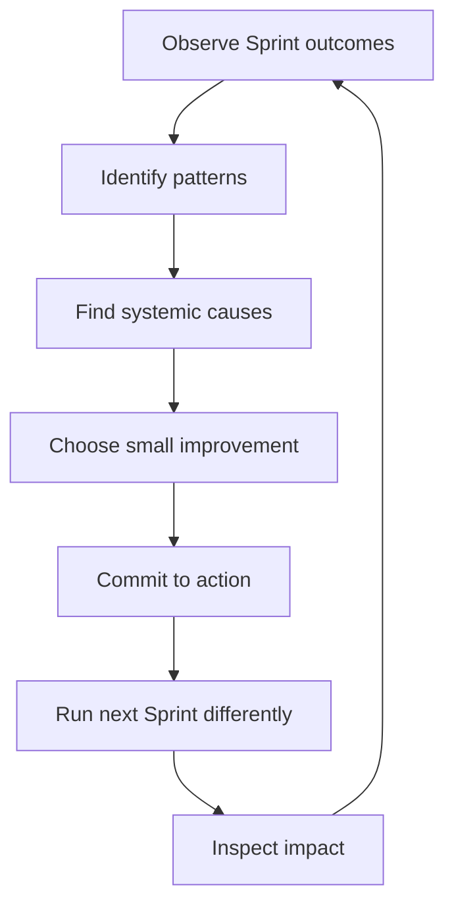

# Part 024 — Retrospective for Systemic Improvement

## 1. Source notes and scope boundary

This part is grounded in the Scrum Guide and Scrum.org's explanation that the purpose of the Sprint Retrospective is to plan ways to increase quality and effectiveness. The Scrum Team inspects how the last Sprint went regarding individuals, interactions, processes, tools, and Definition of Done.

This part adapts the retrospective for enterprise engineering teams working on complex systems such as Quote & Order, CPQ, Java microservices, Kafka, PostgreSQL, Kubernetes, cloud/on-prem deployment, and production operations.

This part does **not** assume CSG uses a specific retrospective format, Scrum Master facilitation style, retro board tool, action tracking system, psychological safety program, or team health metric.

Use the internal verification checklist to map the ideas to your actual team.

---

## 2. Core thesis

A retrospective is not a complaint session.

A retrospective is not a team therapy session.

A retrospective is not a ritual to say "what went well / what didn't" and then forget.

A strong retrospective is a systemic improvement loop.

It answers:

> What did our last Sprint reveal about our system of work, and what small change will increase quality, effectiveness, flow, safety, or learning in the next Sprint?

For senior engineers, the retrospective is one of the most important leverage points in Scrum because it can improve the engineering system itself.

A single good retro action can reduce future bugs, review delays, unclear stories, flaky tests, failed deployments, recurring incidents, or onboarding friction.

---

## 3. The retrospective feedback loop

A healthy retrospective creates this loop:



The loop fails when:

- observations stay anecdotal;
- causes stay personal;
- action items are vague;
- nobody owns follow-up;
- improvements are too big;
- previous actions are never inspected;
- psychological safety is low;
- hard topics are avoided.

---

## 4. What senior engineers should look for

A senior engineer should listen for patterns, not isolated frustration.

### 4.1 Flow patterns

Signals:

- stories start late;
- many items are in progress at once;
- PRs wait too long;
- QA/verification queues pile up;
- work spills over repeatedly;
- blockers are discovered late;
- dependencies are unmanaged.

Possible systemic causes:

- Sprint Planning overcommits;
- stories are too large;
- WIP is too high;
- review ownership is unclear;
- refinement misses dependency risk;
- team ignores work item age.

### 4.2 Quality patterns

Signals:

- escaped defects;
- flaky tests;
- bug fixes create more bugs;
- DoD bypassed;
- insufficient negative tests;
- PRs merge with weak acceptance evidence;
- incidents reveal missing test scenario.

Possible systemic causes:

- acceptance criteria are shallow;
- testing is deferred;
- DoD is not work-type-specific;
- no test data ownership;
- code review focuses on style only;
- domain invariants are undocumented.

### 4.3 Domain clarity patterns

Signals:

- stories change meaning mid-sprint;
- PO and Developers interpret terms differently;
- QA finds missing edge cases late;
- customer-specific behavior surprises team;
- Sprint Review reveals stakeholder mismatch.

Possible systemic causes:

- refinement lacks domain SME;
- glossary is missing;
- acceptance criteria lack examples;
- Product Goal/Sprint Goal not connected to PBIs;
- architecture or data constraints not visible to PO.

### 4.4 Production readiness patterns

Signals:

- work is coded but not release-ready;
- dashboards missing;
- runbook missing;
- migration risk discovered late;
- incident interrupts repeat;
- support cannot diagnose issue.

Possible systemic causes:

- Definition of Done excludes operations;
- ORR happens too late;
- observability tasks are not backlog items;
- production bugs are treated as interruptions only, not learning signals.

### 4.5 Team health patterns

Signals:

- people avoid disagreement;
- one person dominates technical decisions;
- juniors do not ask questions;
- review comments feel personal;
- retro repeats same issue;
- burnout signs appear.

Possible systemic causes:

- low psychological safety;
- unclear decision rights;
- hidden hierarchy;
- pressure to commit beyond capacity;
- lack of facilitation;
- action items not followed through.

---

## 5. From symptom to system cause

A weak retrospective stops at symptoms.

Example symptom:

> The story spilled over.

Possible system causes:

- story was too large;
- acceptance criteria were vague;
- dependency was not identified;
- reviewer was unavailable;
- environment was unstable;
- production incident consumed capacity;
- architecture uncertainty required a spike;
- team ignored WIP limit;
- Definition of Done was unclear.

The retro should not ask only:

> Why did this person not finish?

It should ask:

> What about our system of work made this outcome likely?

---

## 6. Retrospective inputs

Do not run retros only from memory.

Bring evidence.

### 6.1 Delivery evidence

- committed vs Done PBIs;
- carryover count;
- blocked items;
- cycle time;
- work item age;
- WIP chart;
- PR review latency;
- CI failure patterns;
- deployment status.

### 6.2 Quality evidence

- escaped defects;
- bug count by source;
- flaky test count;
- failing test categories;
- rework percentage;
- production incident links;
- severity of defects;
- root-cause tags.

### 6.3 Product/domain evidence

- stakeholder feedback;
- Sprint Review outcomes;
- changed backlog ordering;
- customer escalation;
- unclear acceptance criteria;
- domain questions discovered during development.

### 6.4 Operational evidence

- alerts triggered;
- incident interrupts;
- support tickets;
- dashboard gaps;
- runbook gaps;
- deployment friction;
- migration problems.

### 6.5 Team evidence

- anonymous retro input if needed;
- repeated blockers;
- meeting load;
- review bottlenecks;
- interruption load;
- on-call/support impact.

Evidence does not replace conversation.

It improves conversation quality.

---

## 7. Retrospective format for senior engineering teams

A good format for enterprise teams:

### 7.1 Check previous action

Start with:

- what action did we commit to last retro?
- was it done?
- did it help?
- should we continue, adjust, or stop?

If previous action is ignored, retro credibility decays.

### 7.2 Inspect Sprint Goal outcome

Ask:

- did we achieve the Sprint Goal?
- if yes, what enabled success?
- if no, what changed or blocked us?
- was the Sprint Goal too broad or unclear?
- did we protect quality?

### 7.3 Inspect system of work

Use categories:

- refinement;
- planning;
- daily synchronization;
- WIP/flow;
- review;
- testing;
- deployment;
- production interrupts;
- collaboration;
- stakeholder feedback.

### 7.4 Select one or two improvements

Do not create ten action items.

Choose one or two that are:

- specific;
- small;
- owned;
- testable in next Sprint;
- connected to a real pain;
- likely to improve quality/effectiveness.

### 7.5 Define measurement

Every action should have a signal.

Example:

- action: limit active PBIs to 3 at a time;
- signal: fewer carryovers and shorter review queue;
- owner: Developers;
- review: next retrospective.

---

## 8. Action item quality

Bad action item:

> Improve communication.

Better action item:

> During Daily Scrum, explicitly name any PBI with no next action or blocked dependency. Scrum Master records blockers, owner, and escalation path. Review blocker aging next retro.

Bad action item:

> Write better tests.

Better action item:

> For every quote/order state transition PBI, add at least one negative transition test and one audit assertion. Senior reviewer checks this in PR review for the next Sprint.

Bad action item:

> Reduce PR delays.

Better action item:

> Add reviewer at PR creation, keep PRs under roughly one vertical slice, and check review queue after Daily Scrum. Measure PR review wait time next retro.

Good action items are experiments.

They do not need to solve everything.

They need to produce learning and improvement.

---

## 9. Retrospective themes for Quote & Order teams

### 9.1 Refinement quality retro

Questions:

- Which PBIs were unclear after Sprint start?
- Which acceptance criteria were missing edge cases?
- Which domain terms were ambiguous?
- Which dependencies surprised us?
- Which stories needed a spike but did not get one?
- Which risk should have been discovered earlier?

Possible actions:

- add refinement checklist for Kafka/API/DB/security;
- require example scenarios for quote/order state changes;
- invite QA/support/domain SME to refinement for high-risk items;
- add spike template.

### 9.2 PR/review flow retro

Questions:

- Which PRs waited longest?
- Were reviewers clear?
- Were PRs too large?
- Did review comments catch important risks?
- Did CI failures slow review?
- Did late review force rework?

Possible actions:

- define reviewer ownership per area;
- split PRs by vertical slice;
- add PR description template;
- create review checklist for migrations/events/security;
- set review queue check after Daily Scrum.

### 9.3 Testing retro

Questions:

- Which bugs escaped tests?
- Which tests were flaky?
- Which test category was missing?
- Did QA receive testable increments early?
- Were acceptance criteria testable?
- Did CI feedback come too late?

Possible actions:

- add contract test for public API changes;
- add integration fixture for order fallout;
- tag flaky tests and assign owner;
- add test data builder;
- add DoD item for audit assertions.

### 9.4 Production interrupt retro

Questions:

- How many interruptions happened?
- Were they true incidents or support questions?
- Did we have runbooks?
- Did support have enough information?
- Did incident work affect Sprint Goal?
- Did postmortem actions enter backlog?

Possible actions:

- create interrupt buffer;
- tag production bug source;
- add runbook for repeated support issue;
- add dashboard panel;
- improve alert/actionability;
- create prevention PBI.

### 9.5 Technical debt retro

Questions:

- Which debt slowed us this Sprint?
- Which debt caused defects?
- Which debt increased review complexity?
- Which debt made estimation unreliable?
- Which debt should be converted to backlog item?

Possible actions:

- create debt item with evidence;
- repay one small debt next Sprint;
- add characterization tests;
- add ADR for repeated architecture ambiguity;
- delete obsolete feature flag after verification.

---

## 10. Psychological safety and retrospectives

A retrospective requires enough safety for people to say what is true.

If people cannot safely say:

- this story was unclear;
- this estimate was pressured;
- this design decision felt rushed;
- I did not understand the domain;
- review comments felt personal;
- our DoD was bypassed;
- I am overloaded;

then the team cannot inspect reality.

Senior engineers contribute to safety by:

- criticizing systems, not people;
- admitting their own mistakes;
- asking before judging;
- making disagreement evidence-based;
- avoiding sarcasm in review/retro;
- protecting juniors from blame;
- naming pressure honestly;
- turning problems into experiments.

Safety does not mean avoiding hard conversations.

It means hard conversations are possible without humiliation.

---

## 11. Blamelessness without accountability theater

Blameless retrospective does not mean nobody is accountable.

It means accountability focuses on system improvement rather than personal blame.

Bad framing:

> Developer X forgot to add a test.

Better framing:

> Our DoD and review checklist did not make the negative transition test explicit, and the PR template did not ask for domain edge cases. We will update the checklist and require one negative transition test for lifecycle changes.

Accountability exists in the action:

- checklist updated;
- reviewer owner assigned;
- test added;
- follow-up verified.

Blame produces fear.

Accountability produces improvement.

---

## 12. Retro action backlog

Not every improvement fits in the next Sprint.

Create a visible improvement backlog.

Fields:

- problem;
- evidence;
- impact;
- candidate action;
- owner;
- target Sprint;
- status;
- result.

Example:

| Problem | Evidence | Action | Owner | Result |
|---|---|---|---|---|
| PRs wait too long | median review wait 2.5 days | add reviewer at PR open, daily review queue check | team | inspect next retro |
| quote state bugs escape | 2 bugs in invalid transition | add transition test checklist | senior engineer | track next 3 PRs |
| support asks same question | repeated stuck order ticket | add runbook/dashboard panel | ops owner | support feedback |

This prevents retro insights from disappearing.

---

## 13. Metrics in retrospectives

Metrics should support learning, not punishment.

Useful retro metrics:

- cycle time;
- throughput;
- work item age;
- WIP;
- blocked time;
- PR review wait time;
- CI failure rate;
- flaky test count;
- escaped defects;
- incident count;
- carryover count;
- Sprint Goal success;
- support interrupt count.

Dangerous uses:

- comparing individual story points;
- pressuring team to inflate estimates;
- punishing people for uncertainty;
- using velocity as productivity score;
- ignoring quality and incident load.

A metric should answer:

> What should we inspect more closely?

Not:

> Whom should we blame?

---

## 14. Senior engineer facilitation moves

Even if you are not Scrum Master, you can improve the retro.

Useful phrases:

- "Can we separate symptom from cause?"
- "What evidence do we have?"
- "Did this affect the Sprint Goal?"
- "Is this a one-off or a pattern?"
- "What small experiment can we try next Sprint?"
- "Who owns the action?"
- "How will we know it helped?"
- "Should this change our Definition of Done?"
- "Should this become a backlog item?"
- "Was there a production/customer impact?"

Avoid phrases:

- "That is just how it is."
- "You should have known."
- "This always happens."
- "Let's fix everything next Sprint."
- "We just need to work harder."

---

## 15. Retrospective anti-patterns

### 15.1 Repeated issue, no action

Same issue appears every retro.

Fix:

- choose one concrete experiment;
- assign owner;
- inspect next time.

### 15.2 Action-item overload

Team creates too many improvements.

Fix:

- pick one or two high-leverage actions.

### 15.3 Manager-dominated retro

People optimize for saying safe things.

Fix:

- clarify retro purpose;
- use anonymous input if needed;
- facilitate equal participation.

### 15.4 Tool-focused retro

Team blames Jira/board/process but not underlying behavior.

Fix:

- ask what decision or behavior the tool is hiding or amplifying.

### 15.5 Personal blame retro

Discussion focuses on individuals.

Fix:

- redirect to system causes and improvement actions.

### 15.6 Feel-good only retro

Team celebrates but avoids hard learning.

Fix:

- include evidence and one improvement commitment even after successful Sprint.

---

## 16. Retrospective templates

### 16.1 Systemic improvement template

```md
# Sprint Retrospective — Systemic Improvement

## Previous action review
- Action:
- Done? Yes/No
- Impact:
- Continue/adjust/stop:

## Sprint Goal outcome
- Achieved?
- Evidence:
- What helped?
- What hurt?

## Observations
- Flow:
- Quality:
- Product/domain clarity:
- Production/operations:
- Collaboration/team health:

## Patterns
- Pattern 1:
- Pattern 2:

## Root/system causes
- Cause 1:
- Cause 2:

## Improvement experiment
- Action:
- Owner:
- When:
- Signal of success:
- Review date:
```

### 16.2 Production-learning retro template

Use after a Sprint with incident/support load.

```md
# Sprint Retro — Production Learning

## Incident/support summary
- What happened?
- Customer/business impact:
- Sprint impact:

## Detection
- Did we detect before customer/support?
- What signal existed?
- What signal was missing?

## Response
- Was there a runbook?
- Was ownership clear?
- What slowed us?

## Prevention
- Test gap:
- Observability gap:
- Design gap:
- Process gap:

## Actions
- Short-term:
- Backlog item:
- DoD/update:
```

### 16.3 Flow retro template

```md
# Sprint Retro — Flow

## Flow data
- Started items:
- Done items:
- Carryover:
- WIP peak:
- Longest work item age:
- Longest PR wait:
- Blocked items:

## Bottleneck
- Where did work wait?
- Why did it wait?

## Experiment
- WIP policy:
- Review policy:
- Slicing change:
- Measurement:
```

---

## 17. Internal verification checklist

Verify in your CSG/team context:

- Who facilitates retrospectives?
- Are retros every Sprint?
- Are previous action items reviewed?
- Where are retro actions tracked?
- Are action owners explicit?
- Are improvements visible in the Product Backlog or team improvement backlog?
- Are engineering metrics available for retros?
- Are production incidents reviewed in retros or separate postmortems?
- Are psychological safety issues surfaced?
- Are managers present? If yes, does it help or inhibit?
- Are remote/time-zone constraints handled?
- Do retro actions change DoD, refinement, planning, testing, or review practices?
- Are repeated issues tracked as patterns?
- Are support/customer escalations included as learning?
- Does the team inspect quality, not only delivery quantity?

---

## 18. Practical exercise

Take your team's last retrospective action item.

Evaluate it:

1. Was it specific?
2. Did it have an owner?
3. Was it small enough for one Sprint?
4. Did it have a success signal?
5. Was it reviewed in the next retro?
6. Did it improve quality/effectiveness?
7. Did it address a system cause or only a symptom?

Rewrite it into a stronger action item.

Example:

Weak:

> Improve refinement.

Strong:

> For the next Sprint, every Quote & Order lifecycle PBI must include at least one concrete example scenario, one negative case, and affected API/event/DB surface. PO and one senior engineer review this during refinement. Success signal: fewer mid-sprint clarifications and no PBI blocked by missing domain example.

---

## 19. Key takeaways

- Sprint Retrospective is the Scrum Team's system-improvement loop.
- Strong retrospectives inspect individuals, interactions, processes, tools, and Definition of Done through evidence.
- Senior engineers should look for patterns across flow, quality, domain clarity, production readiness, and team health.
- Good retro actions are small, owned, testable experiments.
- Psychological safety enables honest inspection; accountability turns inspection into improvement.
- Retrospectives should improve the engineering system, not merely discuss feelings or complaints.

A great retrospective changes how the next Sprint is executed.

If nothing changes afterward, the team did not really adapt.
