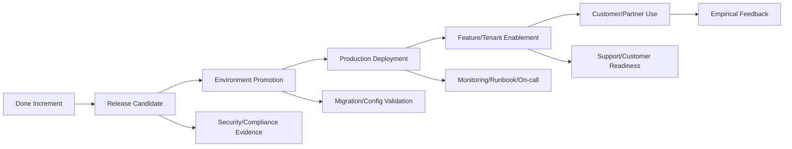

# Part 027 — Release Planning with Scrum

## 1. Source notes and scope boundary

This part uses public Scrum and release-management references, especially:

- The Scrum Guide, which defines the Increment, Definition of Done, Sprint Backlog, Sprint Goal, and Sprint as a container event.
- Scrum.org material on forecasting and release planning.
- General modern delivery practices around GitOps, CI/CD, progressive rollout, feature flags, operational readiness, and empirical feedback.
- The previous Quote & Order engineering series on deployment, GitOps, ORR, testing, observability, and production data repair.

This part does **not** assume CSG uses any specific release train, GitOps platform, deployment window, feature flag system, on-prem installer, approval board, or customer enablement process.

Use the `Internal verification checklist` sections to validate the actual CSG/team process.

---

## 2. Core thesis

Scrum does not mean “ignore release planning”.

Scrum means release planning should be empirical, incremental, and continuously adapted based on real evidence.

For a Senior Java Engineer in Quote & Order, release planning means understanding the difference between:

- work merged,
- Sprint item done,
- Increment done,
- release candidate built,
- deployed to an environment,
- enabled for a tenant/customer,
- externally communicated,
- operationally supported,
- validated in production,
- producing customer/business feedback.

These are not the same thing.

A healthy Scrum team can produce a Done Increment every Sprint. But enterprise release reality can include customer rollout windows, on-prem packaging, regulatory validation, staged enablement, customer-specific configuration, integration testing, security review, and support readiness.

The goal is not to water down Scrum.

The goal is to make the path from Increment to customer value explicit and safe.

---

## 3. Scrum Increment vs release

A Scrum Increment is a usable, integrated piece of product work that meets the Definition of Done.

A release is the decision and process of making value available to users, customers, tenants, environments, or downstream consumers.

They are related but not identical.

| Concept | Meaning | Senior engineer question |
|---|---|---|
| Code complete | Developer believes implementation is finished | Are tests and review complete? |
| Story done | PBI meets acceptance criteria and DoD | Is it part of a usable Increment? |
| Increment done | Integrated product meets Definition of Done | Is it potentially releasable? |
| Release candidate | Build/artifact chosen for promotion | Is it validated and traceable? |
| Deployed | Artifact runs in an environment | Is it healthy and observable? |
| Enabled | Feature/config/tenant rollout active | Who can use it and how do we disable it? |
| Released | Value available to intended users/customers | Is support/customer communication ready? |
| Validated | Evidence confirms intended outcome | Did product/operations/customer feedback confirm it? |

The danger is pretending these states are equivalent.

Example:

> A quote approval feature is “done” in a Sprint, but the feature flag is disabled, customer-specific approval thresholds are not configured, support runbook is missing, and the audit dashboard has not been updated.

That may be a Done code change, but it is not customer-enabled value.

---

## 4. The enterprise release gap

In enterprise systems, a Done Increment often passes through additional gates before customer value appears.

A senior engineer should make this gap visible.

If the team says “we finished it last Sprint”, ask:

- Was it deployed?
- Was it enabled?
- Was it used?
- Was it measured?
- Was it supported?
- Did it produce feedback?

Scrum’s empirical loop weakens when teams stop at “merged”.

---

## 5. Release planning as forecasting, not false certainty

Release planning in Scrum should be treated as forecast, not guarantee.

A forecast combines:

- Product Goal,
- Product Backlog ordering,
- historical throughput,
- work size,
- risk,
- dependency,
- Definition of Done,
- release constraints,
- customer timing,
- operational readiness.

A release forecast should be updated as evidence changes.

### 5.1 Weak release forecast

> Feature X will be released in Sprint 8 because it is estimated at 21 points and we usually do 25 points.

Problems:

- velocity treated as deterministic,
- risk ignored,
- dependency ignored,
- release readiness ignored,
- customer enablement ignored.

### 5.2 Stronger release forecast

> We forecast feature X can be customer-enabled after two Sprints if the pricing API contract is finalized this Sprint, the migration dry run passes on production-like data, and the feature flag rollout starts with one internal tenant. Confidence is medium because the fulfillment adapter behavior is still unknown. We will reforecast after the spike result and migration test.

This is honest and useful.

---

## 6. Release planning inputs

A strong release plan uses multiple inputs.

### 6.1 Product inputs

- Product Goal.
- Business milestone.
- Customer commitment.
- Roadmap sequence.
- Contractual date.
- Regulatory/compliance need.
- Revenue impact.
- Customer support expectation.

### 6.2 Engineering inputs

- Technical dependency.
- Architecture decision.
- API contract status.
- Kafka event compatibility.
- DB migration readiness.
- Feature flag strategy.
- CI/CD readiness.
- Test coverage.
- Observability.
- Runbook.
- Operational risk.

### 6.3 Delivery inputs

- Team capacity.
- Support/on-call load.
- Production incident trend.
- Cross-team availability.
- Review bottleneck.
- Environment stability.
- Release calendar.
- On-prem packaging timeline.

A Product Owner may own ordering, but Developers are accountable for the plan to create a Done Increment. Senior engineers must bring these engineering inputs to planning.

---

## 7. Release planning for Quote & Order work

Quote & Order release planning is different from simple CRUD product planning because the release may affect long-running business commitments.

### 7.1 Quote/pricing release concerns

Ask:

- Does the release affect existing draft quotes?
- Does it affect approved but not accepted quotes?
- Does it affect accepted quotes not yet converted to orders?
- Does it change pricing snapshot behavior?
- Does it change discount/approval threshold behavior?
- Does it change catalog version interpretation?
- Can support explain price differences after release?

### 7.2 Order management release concerns

Ask:

- Does it affect in-flight orders?
- Does it change order item state semantics?
- Does it change cancellation/amendment behavior?
- Does it change decomposition logic?
- Does it change fulfillment adapter mapping?
- Does it affect fallout recovery?
- Does it require downstream coordination?

### 7.3 Kafka/event release concerns

Ask:

- Are event consumers known?
- Is the schema backward-compatible?
- Does partition key change?
- Can old and new producers coexist?
- Can old and new consumers coexist?
- Is replay safe?
- Is DLQ/runbook ready?

### 7.4 Database release concerns

Ask:

- Is migration expand-contract?
- Can old code run on new schema?
- Can new code run with old data?
- Is backfill chunked and observable?
- Are lock risks understood?
- Does on-prem upgrade path work?

---

## 8. Release slicing patterns

Release planning is easier when features are sliced for incremental enablement.

### 8.1 Hidden release slice

Deploy backend path behind flag.

Useful for:

- new pricing calculation,
- new decomposition planner,
- new event producer,
- new API field not yet exposed.

Risk:

- dead code path if never enabled,
- untested flag combinations,
- data written under flag may be incompatible.

### 8.2 Internal tenant slice

Enable for internal/test tenant first.

Useful for:

- end-to-end validation,
- production runtime smoke,
- dashboards/runbooks.

Risk:

- internal tenant may not represent real customer data.

### 8.3 Customer cohort slice

Enable for one customer/cohort.

Useful for:

- customer-specific workflows,
- high-risk business behavior,
- new integration adapter.

Risk:

- customer support must be ready,
- rollback may be customer-visible.

### 8.4 Read-only slice

Release read path or shadow calculation before write path.

Useful for:

- new price engine comparison,
- new order decomposition preview,
- query optimization,
- reporting read model.

Risk:

- read-only success does not prove write-side side effects.

### 8.5 Compatibility slice

Release schema/API/event compatibility first, behavior later.

Useful for:

- DB schema expansion,
- event envelope addition,
- optional API field,
- generated client compatibility.

Risk:

- partial compatibility path can linger forever without cleanup.

---

## 9. Release train vs continuous delivery

Some organizations release on trains. Others release continuously.

Scrum can work with both, but the trade-offs differ.

### 9.1 Release train

Advantages:

- predictable customer communication,
- coordinated testing,
- easier on-prem packaging,
- release notes grouped,
- compliance signoff easier.

Risks:

- large batch size,
- delayed feedback,
- more integration risk,
- hardening phase temptation,
- hidden unfinished work.

### 9.2 Continuous delivery

Advantages:

- small batch size,
- fast feedback,
- lower merge/release risk,
- easier rollback for small changes,
- more frequent customer value.

Risks:

- requires high automation,
- requires mature observability,
- requires feature flag discipline,
- customer communication complexity,
- on-prem constraints may limit applicability.

### 9.3 Hybrid enterprise reality

Many enterprise products use a hybrid:

- continuous deployment to internal environments,
- frequent cloud releases,
- controlled customer enablement,
- periodic on-prem packages,
- special release windows for high-risk changes.

A senior engineer should understand which layer is continuous and which layer is controlled.

---

## 10. Release readiness matrix

Use this matrix before customer enablement.

| Area | Question | Evidence |
|---|---|---|
| Product value | What customer/user value is released? | PBI, acceptance evidence, demo |
| Compatibility | Does it break API/event/client behavior? | OpenAPI diff, contract tests |
| Data | Does it migrate or reinterpret data? | migration dry run, validation |
| Runtime | Can it run safely? | rollout result, probes, resources |
| Security | Does auth/tenant/audit behavior hold? | negative tests, audit checks |
| Observability | Can failures be detected? | dashboard, alerts, logs/traces |
| Support | Can support diagnose issues? | runbook, support note |
| Rollback | Can it be disabled/rolled back? | rollback plan, feature flag |
| Customer rollout | Who receives it first? | cohort plan, enablement plan |
| Feedback | How do we know it worked? | metrics, customer/support signal |

---

## 11. Sprint Review and release planning

Sprint Review should feed release planning.

During Sprint Review, inspect:

- what Increment exists,
- what has not met DoD,
- what is release-ready,
- what is deployed but not enabled,
- what feedback changed backlog ordering,
- what operational risk remains,
- what release constraints are now known.

A good Sprint Review output might be:

> The quote approval API behavior is done and demonstrated with audit evidence. The backend is release-ready behind flag. Customer enablement is not ready until support has updated approval-threshold runbook and one more tenant-specific configuration test is complete. Product Backlog is updated with support readiness and tenant rollout items.

This is much better than:

> Story done.

---

## 12. Release planning by work type

### 12.1 REST API change

Release plan must include:

- OpenAPI update,
- compatibility diff,
- generated client impact,
- API documentation,
- auth/tenant check,
- error model stability,
- rollout sequencing.

### 12.2 Kafka event change

Release plan must include:

- schema compatibility,
- consumer list,
- old/new producer coexistence,
- replay safety,
- DLQ plan,
- monitoring.

### 12.3 PostgreSQL migration

Release plan must include:

- expand-contract steps,
- migration ordering,
- old/new app compatibility,
- dry run,
- lock/performance analysis,
- rollback/roll-forward.

### 12.4 Feature flag rollout

Release plan must include:

- default value,
- owner,
- target tenants,
- metrics,
- kill switch,
- cleanup plan.

### 12.5 On-prem package

Release plan must include:

- supported upgrade versions,
- installer steps,
- migration sequencing,
- customer DBA expectations,
- offline/air-gapped constraints,
- support documentation.

---

## 13. Forecasting examples

### 13.1 Bad forecast

> We can release order cancellation in two Sprints because the stories add up to 20 points.

### 13.2 Better forecast

> We can probably release the first order cancellation increment in two Sprints if we limit scope to pre-fulfillment cancellation. Cancellation after fulfillment start is excluded. API contract and audit are included. Downstream cancellation callback is a separate release slice. Confidence is medium because fulfillment adapter behavior is not yet verified.

This is a forecast tied to scope boundaries and risk.

### 13.3 Best forecast

> Release slice 1: pre-fulfillment cancellation for internal tenant, behind flag, with audit and event emission. Release slice 2: one customer cohort after fulfillment adapter test passes. Release slice 3: support-runbook enabled customer rollout. No on-prem enablement until migration/installer validation. We will reforecast after spike on downstream cancellation semantics.

This forecast is actionable.

---

## 14. Release anti-patterns

### 14.1 Sprint equals release

A Sprint can produce a Done Increment, but enterprise release may require additional enablement.

Do not blur the states.

### 14.2 Release planning as date theatre

A date without assumptions, scope, risk, confidence, and feedback points is not a forecast.

It is wishful thinking.

### 14.3 Hardening as normal process

A recurring hardening sprint usually means Definition of Done is too weak or work is batched too long.

### 14.4 Feature flags without cleanup

Flags are useful for release control, but permanent flags create configuration debt.

### 14.5 Releasing without support readiness

If support cannot diagnose, the release is not operationally mature.

### 14.6 Releasing schema before understanding old versions

Cloud and on-prem version skew can turn simple schema changes into customer outages.

---

## 15. Internal verification checklist

Verify these inside your team:

- What does “released” mean internally?
- What does “deployed” mean?
- What does “enabled” mean?
- Does the team release every Sprint, continuously, or via release train?
- Who decides what and when to release?
- How are customer cohorts selected?
- How are on-prem packages created?
- How are release notes written?
- How are feature flags managed?
- What release approval gates exist?
- What production readiness checklist exists?
- What rollback process exists?
- What dashboards are watched during rollout?
- How is customer/support feedback fed back into Product Backlog?
- How are release failures analyzed?

---

## 16. Senior engineer release planning checklist

Before saying “ready to release”, ask:

- Does this Increment meet Definition of Done?
- Is it integrated with the rest of the product?
- Is it compatible with current consumers?
- Can it be deployed safely?
- Can it be enabled safely?
- Can it be disabled safely?
- Are data migrations safe for rolling deploy and on-prem?
- Are Kafka consumers/producers version-compatible?
- Is support ready?
- Is observability ready?
- Is the customer rollout plan explicit?
- Is the feedback plan explicit?
- Are known risks documented?

---

## 17. Practical exercise

Pick one recently completed story.

Classify it:

- code complete?
- story done?
- part of Done Increment?
- release candidate?
- deployed?
- enabled?
- customer-used?
- feedback collected?

Then identify the gap between “Sprint done” and “value released”.

This exercise often reveals the real release system.

---

## 18. Summary

Release planning with Scrum is not big upfront planning.

It is continuous forecasting and adaptation around Done Increments.

For enterprise Quote & Order systems, release planning must account for:

- business lifecycle risk,
- API and event compatibility,
- database migration safety,
- cloud/on-prem deployment reality,
- feature flag and tenant enablement,
- operational readiness,
- support readiness,
- empirical customer feedback.

A senior engineer’s job is to make release risk visible early enough that the Scrum Team can adapt without panic.

