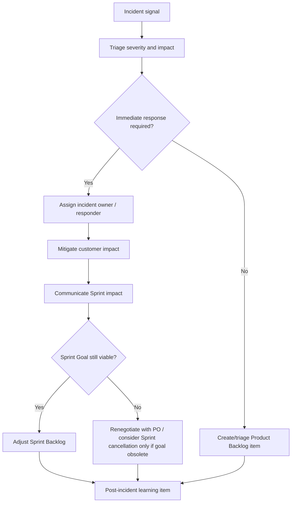

# Part 028 — Production Incidents During the Sprint

## 1. Source notes and scope boundary

This part uses public Scrum and incident-management references, especially:

- The Scrum Guide, which states Sprint Backlog is adapted as more is learned and that quality goals do not decrease during the Sprint.
- Google SRE incident management guidance, especially preparation, timely alerting, actionable alerts, incident coordination, mitigation, and learning.
- Atlassian incident management and postmortem material as a public example of severity classification and blameless postmortem practice.
- Previous parts of this series on Daily Scrum, mid-sprint trade-offs, production readiness, metrics, and systemic retrospectives.

This part does **not** assume CSG has a specific incident severity model, on-call process, SLA, support team workflow, incident commander role, or postmortem template.

Use the `Internal verification checklist` to validate actual practice.

---

## 2. Core thesis

Production incidents are not interruptions to “real work”.

For enterprise products, production incidents are evidence about the product, architecture, process, and Definition of Done.

A Scrum team must handle incidents without pretending Sprint commitments are unchanged.

A senior engineer should help the team answer:

- Is this incident more important than the Sprint Goal?
- Does it require immediate mitigation?
- Who owns incident response?
- What Sprint work must pause?
- What Product Backlog item must be created afterward?
- What systemic improvement prevents recurrence?

The anti-pattern is absorbing production work invisibly and then blaming the team for missing Sprint commitments.

---

## 3. Incident work categories

Not all unplanned work is the same.

| Category | Example | Sprint handling |
|---|---|---|
| Critical incident | Quote acceptance broken for many customers | Immediate response; Sprint Goal may be renegotiated |
| High-severity customer escalation | One strategic customer cannot submit product orders | Triage with PO/support; may interrupt Sprint |
| Production bug with workaround | Fallout dashboard wrong but support can query manually | Backlog item; schedule based on impact |
| Alert noise | Non-actionable CPU alert | Improve alert later; do not derail Sprint unless causing harm |
| Data correction | Incorrect order state needs repair | Controlled correction workflow; may require incident process |
| Operational debt discovered | Runbook missing during incident | Retro/backlog improvement |

A senior engineer must classify before reacting.

---

## 4. Incident severity and product impact

Severity should be based on customer/business impact, not developer anxiety.

For Quote & Order, severity dimensions include:

- ability to create quotes,
- ability to price quotes correctly,
- ability to approve/accept quotes,
- ability to create product orders,
- order lifecycle stuck or duplicate,
- fulfillment fallout volume,
- billing handoff correctness,
- tenant isolation/security exposure,
- data corruption,
- audit evidence loss,
- customer count affected,
- workaround availability,
- revenue/commercial impact,
- regulatory/compliance impact.

### 4.1 Example severity mapping

| Severity | Quote & Order example | Response |
|---|---|---|
| SEV1 | Cross-tenant data exposure or quote/order creation down globally | Immediate incident response, executive/customer comms as policy requires |
| SEV2 | Major customer cohort cannot convert quotes to orders | Incident response, Sprint disruption likely |
| SEV3 | Order fallout dashboard inaccurate with workaround | Triage, backlog/prioritized fix |
| SEV4 | Non-critical report stale | Backlog item, normal planning |

Internal definitions may differ. Verify them.

---

## 5. Scrum response model

When an incident occurs mid-Sprint, do not silently absorb it.

Use a clear adaptation flow.



The team should adapt based on evidence.

Scrum does not require pretending the Sprint plan is frozen.

---

## 6. Sprint Goal protection

Production incidents can threaten Sprint Goal.

The key question:

> Can we still meet the Sprint Goal with acceptable quality after incident response work?

If yes:

- update Sprint Backlog,
- reduce lower-value scope,
- make the incident work visible,
- keep quality bar unchanged.

If no:

- discuss with Product Owner,
- decide whether Sprint Goal should change in practice,
- communicate impact,
- avoid hiding missed work.

If the Sprint Goal becomes obsolete, Scrum allows Sprint cancellation by the Product Owner. That is rare and serious.

Most incidents require replanning, not cancellation.

---

## 7. The senior engineer's incident role

During an incident, a senior engineer may act as:

- technical investigator,
- incident commander if the process supports it,
- domain interpreter,
- mitigation designer,
- data repair reviewer,
- communication translator,
- rollback/roll-forward advisor,
- postmortem contributor,
- prevention owner.

The role is not to heroically solve everything alone.

The role is to reduce uncertainty, coordinate technical reasoning, and preserve system safety.

### 7.1 Senior engineer first questions

Ask:

- What is the customer impact?
- Is it still ongoing?
- What changed recently?
- What is the safest mitigation?
- Is data being corrupted right now?
- Are duplicate side effects possible?
- Is rollback safe?
- Is feature flag disable safer?
- Do we need to pause a consumer/job?
- Who must be informed?
- How does this affect Sprint work?

---

## 8. Product Owner collaboration during incidents

Incidents often require product trade-offs.

The Product Owner needs engineering facts:

- severity,
- affected customers,
- workaround,
- estimated mitigation options,
- risk of waiting,
- risk of interrupting Sprint,
- backlog impact,
- customer communication needs.

Senior engineers should avoid dumping raw technical details.

Translate:

> The outbox relay is lagging and ProductOrderCreated events are delayed.

Into:

> Orders are being created, but downstream fulfillment may not receive them on time. New orders could appear stuck to customers/support. We can mitigate by increasing relay capacity or temporarily pausing affected order creation for one tenant. Pausing is safer if duplicates are suspected.

This helps the PO make informed ordering decisions.

---

## 9. Daily Scrum during incident weeks

Daily Scrum should adapt when incident work is active.

Focus questions:

- Is the Sprint Goal still realistic?
- Which planned work is blocked by incident response?
- Who is actively responding to the incident?
- What work should be paused or handed off?
- What incident follow-up must become visible backlog work?
- What quality risk is increasing because of pressure?

Avoid:

- status theatre,
- pretending capacity is unchanged,
- shaming people for incident response,
- continuing all planned work while key reviewers are unavailable.

---

## 10. Incident response and Scrum artifacts

### 10.1 Product Backlog

Incident follow-up should become Product Backlog items:

- root cause fix,
- regression test,
- alert improvement,
- runbook update,
- data repair tool improvement,
- architecture debt item,
- support documentation.

### 10.2 Sprint Backlog

If incident work must happen now, make it visible in Sprint Backlog.

Do not hide production work under existing unrelated tasks.

### 10.3 Increment

If an incident fix is shipped during Sprint, it must meet Definition of Done unless emergency policy explicitly defines a controlled exception.

Emergency fixes still need:

- review,
- tests proportionate to risk,
- observability,
- rollback/mitigation plan,
- follow-up cleanup if shortcuts were taken.

---

## 11. Production incident examples in Quote & Order

### 11.1 Pricing regression

Symptom:

- quote totals are wrong for enterprise agreements.

Immediate questions:

- Are incorrect quotes still being created?
- Were quotes accepted with wrong price?
- Are affected quotes draft, approved, accepted, or ordered?
- Can pricing path be disabled or reverted?
- Is data repair required?
- Is customer communication required?

Sprint impact:

- likely interrupts planned feature work,
- may require hotfix and repair backlog,
- Sprint Goal may need renegotiation.

Follow-up backlog:

- pricing regression tests,
- approval snapshot validation,
- before/after pricing diff in release readiness,
- alert for unusual pricing failure rate.

### 11.2 Duplicate order creation

Symptom:

- retrying quote acceptance creates two product orders.

Immediate questions:

- Are duplicates still being created?
- Are downstream fulfillment/billing side effects duplicated?
- Is idempotency table missing or failing?
- Can quote acceptance be temporarily disabled for affected path?
- Can duplicate order be safely cancelled?

Follow-up backlog:

- idempotency fix,
- unique constraint,
- duplicate command test,
- data repair/reconciliation runbook,
- outbox duplicate detection.

### 11.3 Kafka consumer lag causing fulfillment delay

Symptom:

- orders created but not reaching fulfillment.

Immediate questions:

- Is lag growing?
- Is it one partition/topic/consumer group?
- Is DLQ increasing?
- Is the consumer failing on one poison event?
- Can we pause/reprocess safely?
- Are retries causing duplicate downstream calls?

Follow-up backlog:

- better lag-age alert,
- poison message handling,
- replay runbook,
- consumer performance improvement,
- event contract test.

### 11.4 Failed migration during deployment

Symptom:

- deployment blocked or service fails startup after migration.

Immediate questions:

- Is DB partially migrated?
- Can old app still run?
- Was migration transactional?
- Are locks blocking production traffic?
- Is rollback safe or roll-forward required?
- Is on-prem upgrade affected?

Follow-up backlog:

- migration test fixture,
- expand-contract change,
- lock timeout standard,
- rollback/roll-forward runbook.

---

## 12. Interrupt buffer and capacity planning

Teams with production responsibility should plan for interrupts.

Options:

### 12.1 Explicit interrupt buffer

Reserve capacity for:

- on-call,
- production bugs,
- customer escalations,
- support requests.

This improves realism.

### 12.2 Rotating responder

One engineer handles interrupts for a period.

Benefits:

- protects others' focus,
- creates clear ownership,
- improves support knowledge.

Risks:

- responder burnout,
- knowledge concentration,
- interruptions may exceed one person's capacity.

### 12.3 Separate support lane

Track unplanned work separately.

Useful when:

- incident/support work is frequent,
- PO needs visibility,
- team wants flow metrics.

Danger:

- support lane becomes invisible dumping ground if not reviewed.

---

## 13. Emergency fix discipline

Emergency does not mean undisciplined.

A hotfix should answer:

- What is the minimal safe fix?
- What evidence proves it addresses current impact?
- What risks does it introduce?
- What tests are required now?
- What tests can be added immediately after?
- Who reviewed it?
- How will it be rolled back or disabled?
- What follow-up is required?

### 13.1 Emergency PR template

```md
# Emergency PR

## Incident
- Incident ID:
- Severity:
- Customer impact:

## Fix summary
- What changed:
- Why this mitigates the incident:

## Risk
- Data risk:
- API/event risk:
- Rollback risk:

## Evidence
- Test run:
- Manual validation:
- Dashboard/metric:

## Follow-up
- Additional tests:
- Refactor/cleanup:
- Postmortem action:
```

This prevents emergency changes from becoming permanent mystery code.

---

## 14. Post-incident backlog discipline

After an incident, avoid only creating a bug fix.

Create backlog items for:

- prevention,
- detection,
- mitigation,
- recovery,
- documentation,
- testing,
- architecture cleanup,
- data repair tooling,
- support readiness.

Example incident:

> Duplicate quote acceptance created duplicate orders.

Backlog items:

1. Add idempotency key enforcement.
2. Add unique constraint for quote version to order conversion.
3. Add duplicate accept concurrency test.
4. Add alert for multiple orders per accepted quote.
5. Add data repair runbook for duplicate order suppression.
6. Add postmortem action to review other command handlers.

This converts incident pain into system improvement.

---

## 15. Retrospective integration

Sprint Retrospective should inspect incident impact.

Questions:

- Did the incident reveal a weakness in Definition of Done?
- Was the alert actionable?
- Was the runbook useful?
- Was incident work visible in Sprint Backlog?
- Did we protect quality while responding?
- Did communication with PO/stakeholders work?
- Was follow-up added to Product Backlog?
- Did the Sprint Goal need earlier renegotiation?

Do not treat incident retro and Sprint Retrospective as unrelated if the incident disrupted the Sprint.

---

## 16. Metrics for incident impact on Scrum

Track:

- interrupt count per Sprint,
- incident hours consumed,
- planned vs unplanned work,
- Sprint Goal hit/miss with incident context,
- average incident response time,
- repeat incident count,
- escaped defect rate,
- postmortem action completion,
- support ticket aging,
- on-call load distribution.

Use metrics for improvement, not blame.

If every Sprint is derailed by production work, that is not a team discipline problem alone.

It may indicate product quality, operational debt, support process, or capacity mismatch.

---

## 17. Internal verification checklist

Verify internally:

- What is the incident severity model?
- Who declares an incident?
- Who is incident commander?
- Who communicates to customers/support?
- What is the on-call model?
- How is incident work represented in Jira/board?
- Is interrupt capacity planned?
- Who decides Sprint trade-offs during incident?
- What hotfix process exists?
- What review/testing exceptions are allowed?
- Where are postmortems stored?
- Are postmortem actions tracked in Product Backlog?
- What recurring incidents affect Sprint delivery?
- How are data repair incidents governed?
- How is customer escalation prioritized against Sprint Goal?

---

## 18. Senior engineer checklist during an incident Sprint

Ask daily:

- Is customer impact contained?
- Is data corruption still possible?
- Is the Sprint Goal still viable?
- Is incident work visible?
- Is someone overloaded?
- Are planned PRs blocked due to missing reviewers?
- Is emergency fix quality acceptable?
- Is support communication aligned?
- Is follow-up backlog created?
- Are we learning or just firefighting?

---

## 19. Anti-patterns

### 19.1 Invisible incident work

The team loses capacity but board shows no change.

### 19.2 Hero culture

One senior engineer fixes everything, but the system does not improve.

### 19.3 Sprint commitment denial

The team insists Sprint Goal is unchanged while half the team is on incident response.

### 19.4 Hotfix without follow-up

Emergency shortcuts become permanent architecture.

### 19.5 Postmortem theater

Postmortem produces document but no backlog action.

### 19.6 Blaming people instead of improving systems

This destroys learning and hides future incidents.

---

## 20. Practical exercise

Take one recent production issue or support escalation.

Document:

1. Severity.
2. Customer impact.
3. Sprint impact.
4. Work that was paused or delayed.
5. Whether Sprint Goal changed.
6. Fix or mitigation.
7. Follow-up backlog items.
8. Prevent/detect/recover improvements.
9. What should change in DoD/refinement/planning.

This turns incident work into Scrum learning.

---

## 21. Summary

Production incidents during a Sprint are not exceptions to Scrum.

They are part of empirical product development in a real production system.

A mature Scrum team:

- classifies incident impact,
- makes unplanned work visible,
- protects quality,
- renegotiates scope honestly,
- collaborates with Product Owner,
- communicates with stakeholders,
- adds prevention work to Product Backlog,
- improves Definition of Done and operational readiness.

A senior engineer's job is to make incident response safe, transparent, and learning-oriented.

