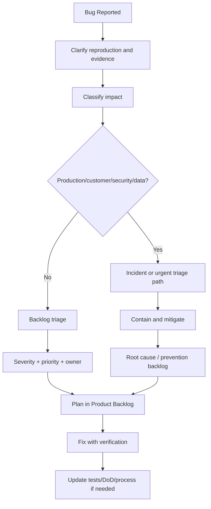

# Part 029 — Bug Triage and Defect Economics

## 1. Source notes and scope boundary

This part uses public Scrum and reliability references, especially:

- Scrum Guide concepts around Product Backlog, Sprint Backlog, Increment, Sprint Goal, and Definition of Done.
- Scrum.org discussions and guidance on handling defects transparently in Scrum.
- Google SRE postmortem culture for learning from production incidents without blame.
- DORA metrics as delivery-performance signals, especially change failure rate and failed-deployment recovery time.

This part does **not** assume CSG has a specific defect workflow, Jira scheme, severity definition, support escalation model, customer SLA, incident policy, or bug-priority rubric.

Use the `Internal verification checklist` sections to adapt this model to your actual CSG team process.

---

## 2. Core thesis

A bug is not merely a task.

A bug is a signal that some expectation in the system was violated.

That expectation may come from:

- product behavior,
- customer contract,
- API contract,
- event contract,
- data invariant,
- security policy,
- tenant isolation rule,
- operational readiness expectation,
- performance expectation,
- supportability expectation,
- Definition of Done.

For senior engineers, bug triage is not simply asking:

> Who can fix this fastest?

A better question is:

> What does this defect reveal about our product assumptions, engineering process, testing gaps, operational signals, and backlog priorities?

In enterprise Quote & Order systems, bugs can have commercial consequences:

- wrong quote price,
- approval bypass,
- duplicate order,
- stale catalog usage,
- failed order decomposition,
- tenant data exposure,
- missing audit trail,
- missing billing handoff,
- stuck fulfillment fallout,
- broken customer integration.

So bug triage must combine product judgment, technical judgment, and economic judgment.

---

## 3. Bug taxonomy for enterprise Quote & Order

Do not put all bugs in one bucket.

Classify defects by the expectation they violate.

| Bug class | Example | Why it matters |
|---|---|---|
| Functional bug | Quote cannot be submitted for approval | Feature unusable |
| Domain invariant bug | Accepted quote can be repriced silently | Commercial correctness risk |
| Lifecycle bug | Completed order has active child items | State machine inconsistency |
| Pricing bug | Discount stacking wrong for enterprise agreement | Revenue leakage or customer dispute |
| Catalog bug | Retired offering still selectable | Invalid sales/order flow |
| Integration bug | Fulfillment callback updates wrong order item | Downstream state corruption |
| Event bug | `ProductOrderCreated` event missing tenant ID | Consumer/security risk |
| Database bug | Query misses tenant predicate | Cross-tenant leakage risk |
| Migration bug | Old quote rows fail after deployment | Upgrade/release risk |
| Security bug | User can approve own quote when SoD forbids it | Governance/compliance risk |
| Observability bug | Order stuck but no alert/dashboard signal | Customer discovers first |
| Performance bug | Quote search takes 30 seconds | Support/productivity impact |
| Test bug | Flaky E2E hides real regression | Delivery confidence erosion |
| Documentation bug | Runbook says wrong recovery command | Incident recovery risk |

A senior engineer should classify bugs by **risk surface**, not merely by code area.

---

## 4. Severity vs priority

Severity and priority are often confused.

### 4.1 Severity

Severity describes impact.

Examples:

- How many customers are affected?
- Is production down?
- Is money/commercial correctness affected?
- Is security/tenant isolation affected?
- Is data corrupted?
- Is there a workaround?
- Is the issue customer-visible?
- Is the issue still actively worsening?

### 4.2 Priority

Priority describes ordering.

Examples:

- Should we fix it before current sprint work?
- Should it block release?
- Should it be fixed this sprint?
- Should it be planned next sprint?
- Should it be grouped with related refactoring?
- Should it be handled as incident prevention work?

High severity often implies high priority, but not always.

Example:

- A critical production data corruption bug that is already mitigated may need careful planned repair rather than fastest code patch.
- A low-severity but high-frequency bug may deserve high priority because support cost is large.
- A medium-severity bug in quote pricing may block release because commercial confidence is at stake.

---

## 5. Bug economics

A defect has multiple costs.

### 5.1 Direct cost

- Engineering fix time.
- QA validation time.
- Support handling time.
- Customer communication.
- Hotfix/release effort.
- Data repair effort.

### 5.2 Indirect cost

- Lost trust.
- Slower future changes.
- Increased regression fear.
- More manual testing.
- More review caution.
- More noisy alerts.
- More production interrupts.

### 5.3 Opportunity cost

Every urgent bug displaces planned work.

The Scrum Team should ask:

> What did this defect force us not to do?

This is not for blame.

It is for backlog economics.

If bugs repeatedly consume 30–40% of sprint capacity, the team does not have a bug problem only. The team has a quality economics problem.

---

## 6. Defect discovery timing

When a bug is discovered matters.

| Discovery time | Meaning | Scrum handling |
|---|---|---|
| During development before PR | Normal engineering feedback | Fix inside current work |
| During PR review | Review quality signal | Fix before merge or split intentionally |
| During sprint testing | Increment not Done yet | Replan Sprint Backlog if needed |
| During Sprint Review | Stakeholder feedback / acceptance gap | Product Backlog adjustment |
| After Sprint before release | Release readiness gap | Prioritize against release risk |
| In production | Escaped defect / incident signal | Triage, mitigate, learn, add backlog prevention |
| During customer upgrade | Compatibility/packaging gap | Release process and test matrix issue |

A defect found inside the sprint usually means the work is not Done yet.

A defect found after the sprint often means the Definition of Done, testing strategy, review process, or acceptance criteria missed something.

---

## 7. Bug triage flow

A practical triage flow:



The key is that triage does not end when the bug is assigned.

Triage ends when the team understands:

- impact,
- urgency,
- owner,
- verification path,
- prevention path.

---

## 8. Minimum bug report quality

A bug report should be useful enough for engineering action.

Minimum fields:

- summary,
- environment,
- tenant/customer impact if safe to include,
- business object IDs if safe,
- reproduction steps,
- expected behavior,
- actual behavior,
- screenshots/logs/traces if relevant,
- first observed time,
- frequency,
- workaround,
- severity proposal,
- suspected area,
- related release/PR if known.

For Quote & Order, add domain-specific fields:

- quote ID,
- quote version,
- order ID,
- order item ID,
- product offering ID,
- catalog version,
- customer/account/agreement reference,
- tenant,
- correlation ID,
- Kafka event ID,
- API endpoint,
- state before/after,
- approval status,
- pricing snapshot version.

Do not expose sensitive customer data in general bug systems unless internal policy allows it.

---

## 9. Severity rubric

Adapt this internally.

### Severity 0 — Critical incident

Examples:

- production-wide outage,
- cross-tenant data exposure,
- large-scale quote/order failure,
- wrong pricing at scale,
- duplicate orders at scale,
- security breach,
- data corruption still active,
- customer-impacting billing/fulfillment failure.

Handling:

- incident process,
- mitigation first,
- PO and stakeholders informed,
- Sprint Goal likely renegotiated,
- postmortem/prevention backlog mandatory.

### Severity 1 — High impact

Examples:

- major customer cannot quote/order,
- important workflow broken,
- workaround costly,
- release-blocking regression,
- high-risk data inconsistency contained.

Handling:

- immediate triage,
- may interrupt sprint,
- fix or mitigation planned urgently,
- tests/prevention expected.

### Severity 2 — Medium impact

Examples:

- partial feature failure,
- workaround exists,
- limited customers,
- non-critical integration issue,
- support-visible but manageable defect.

Handling:

- Product Backlog ordering,
- planned into sprint based on value/risk,
- root cause considered.

### Severity 3 — Low impact

Examples:

- cosmetic issue,
- low-frequency edge case,
- internal tooling defect,
- documentation mismatch with low operational risk.

Handling:

- backlog item,
- batch with related work,
- fix opportunistically if cheap.

---

## 10. Priority decision model

Priority should consider:

1. customer impact,
2. commercial impact,
3. security/compliance impact,
4. data integrity impact,
5. workaround availability,
6. frequency,
7. affected customer tier or contract commitment,
8. release blocking status,
9. operational cost,
10. prevention value.

A useful priority formula:

```txt
Priority = Impact × Urgency × Frequency × Strategic Relevance × Cost of Delay
```

Do not pretend this is mathematical precision.

Use it to structure conversation.

---

## 11. Bug triage meeting format

A bug triage meeting should be short and decision-oriented.

### Inputs

- new defects,
- production incidents,
- support escalations,
- failed release validations,
- escaped defect trend,
- flaky/regression signals,
- recurring bug clusters.

### Participants

Depending on risk:

- Product Owner,
- senior engineer,
- QA/test owner,
- support representative,
- Scrum Master,
- affected component owner,
- security/platform/DB owner if needed.

### Decisions

For each bug:

- Is this an incident?
- What is severity?
- What is priority?
- Should current sprint change?
- Who investigates?
- What evidence is missing?
- What verification is required?
- Is prevention work needed?
- Should DoD/testing/refinement change?

---

## 12. Bugs and Sprint Planning

Bugs belong in the same product economics conversation as features.

A Product Backlog that hides bugs in a separate ignored list loses transparency.

In Sprint Planning, bug work should be explicit:

- planned bug fixes,
- production bug interrupt buffer,
- release-blocking defects,
- prevention tasks,
- test hardening,
- data repair follow-up,
- runbook/observability correction.

### 12.1 Capacity model

If the team historically spends 20% capacity on defects/interrupts, pretending 100% capacity is available for feature work is false planning.

Use historical reality:

```txt
Effective feature capacity = Total capacity - support/on-call load - planned bug work - known dependency load - improvement work
```

This is not pessimism.

It is transparency.

---

## 13. Bugs discovered during a Sprint

When a bug appears mid-sprint, ask:

1. Is this related to current sprint work?
2. Does it prevent the current Increment from being Done?
3. Is it production/customer-impacting?
4. Does it threaten the Sprint Goal?
5. Does the Product Owner need to reorder work?
6. Is the team over capacity?
7. What can be descoped?
8. What evidence is needed before acting?

### 13.1 If bug is part of current PBI

Fix it inside the PBI.

Do not close the story and create a separate bug just to preserve velocity.

### 13.2 If bug is unrelated but urgent

Make the interruption visible.

Update Sprint Backlog.

Renegotiate scope if needed.

### 13.3 If bug is unrelated and not urgent

Add to Product Backlog.

Triage and prioritize normally.

---

## 14. Escaped defects and Definition of Done

An escaped defect is feedback about the system.

Ask:

- Did acceptance criteria miss this?
- Did tests miss this?
- Did review miss this?
- Did refinement miss this?
- Did observability miss this?
- Did release readiness miss this?
- Did domain knowledge miss this?
- Did customer-specific behavior miss this?

If the answer is yes, update one or more:

- Definition of Done,
- test strategy,
- refinement checklist,
- PR review checklist,
- release checklist,
- runbook,
- dashboard/alert,
- domain documentation.

A fix without prevention is incomplete for repeated/high-impact bug classes.

---

## 15. Root cause analysis for bugs

Root cause analysis should not stop at "developer made mistake".

Better categories:

| Category | Example prevention |
|---|---|
| Requirement ambiguity | Better refinement and AC template |
| Domain model gap | State machine documentation and tests |
| Test gap | Add integration/contract/e2e coverage |
| Review gap | Update PR checklist/ownership |
| Operational signal gap | Add dashboard/alert/log field |
| Data model gap | Add constraint/index/invariant test |
| Migration gap | Add dry-run/backward compatibility test |
| Security gap | Add negative authorization/tenant tests |
| Process gap | Update DoD/ORR/triage flow |
| Knowledge gap | Mentoring/doc update |

The goal is prevention, not blame.

---

## 16. Quote & Order bug examples

### 16.1 Pricing bug

Symptom:

- Enterprise discount applied twice for a subset of quotes.

Triage questions:

- Which customers/tenants?
- Which catalog version?
- Which agreement type?
- Were quotes accepted?
- Were orders created?
- Was billing handoff affected?
- Are audit/pricing snapshots correct?
- Is there a mitigation or feature flag?

Prevention:

- golden pricing test cases,
- before/after price diff,
- approval threshold regression,
- pricing snapshot invariant,
- release watch metric.

### 16.2 Duplicate order bug

Symptom:

- Two orders created from same accepted quote after retry.

Triage questions:

- Was idempotency key missing?
- Was unique constraint missing?
- Did transaction commit but response timeout?
- Were downstream service orders emitted?
- Was billing affected?
- Can duplicate be cancelled safely?

Prevention:

- idempotency tests,
- unique quote-to-order constraint,
- outbox correctness,
- duplicate command scenario in E2E,
- data repair runbook.

### 16.3 Tenant leak bug

Symptom:

- Search result contains object from another tenant.

Triage questions:

- Was data exposed to customer?
- Which endpoint/query/cache path?
- Was direct ID access also affected?
- Did event/search projection contain wrong tenant?
- Is this security incident?

Prevention:

- tenant predicate integration tests,
- cache key review,
- search/export authorization test,
- security review,
- incident/compliance process.

---

## 17. Bug metrics without gaming

Useful signals:

- escaped defects per release,
- production incidents by root cause category,
- defect age,
- repeat defect category,
- customer-reported vs internally detected,
- time to triage,
- time to mitigation,
- time to permanent fix,
- defect reopen rate,
- flaky test count,
- bug-to-prevention ratio,
- change failure rate,
- failed-deployment recovery time.

Dangerous uses:

- comparing individual bug counts,
- rewarding teams for closing low-value bugs,
- hiding bugs to protect velocity,
- declaring success because backlog count dropped after bulk closure,
- treating severity labels as political weapons.

Metrics should help the team ask better questions.

---

## 18. Bug triage anti-patterns

### 18.1 Severity inflation

Every bug becomes urgent.

Result:

- sprint chaos,
- team burnout,
- priority loses meaning.

### 18.2 Severity suppression

Serious defects are downplayed to protect release timeline.

Result:

- customer impact,
- incident escalation,
- trust loss.

### 18.3 Bug list outside Product Backlog

Defects live in a shadow system.

Result:

- no transparency,
- PO cannot order work against features,
- debt accumulates.

### 18.4 Fix-only mindset

Team fixes symptom without updating tests/process.

Result:

- repeated defect class.

### 18.5 Velocity protection

Story marked Done while related defects are split out.

Result:

- fake progress,
- low-quality Increment.

### 18.6 No customer impact framing

Bug title says "NPE in mapper" instead of "Order search fails for support users".

Result:

- poor prioritization.

---

## 19. Senior engineer triage checklist

For any non-trivial defect, ask:

### Impact

- Who is affected?
- Is this production/customer visible?
- Is there data corruption?
- Is there security/tenant risk?
- Is commercial correctness affected?
- Is there a workaround?

### Technical scope

- Which service/module?
- Which API/event/table?
- Which release introduced it?
- Is it still ongoing?
- Is it reproducible?
- Is it isolated or systemic?

### Scrum handling

- Does it affect current Sprint Goal?
- Should Sprint Backlog be replanned?
- Should PO reorder Product Backlog?
- Should this be incident work?
- Should a prevention PBI be created?

### Verification

- What test proves fix?
- What regression test prevents recurrence?
- What dashboard/alert/log would detect it?
- Is data repair required?
- Is support/customer communication needed?

---

## 20. Bug-to-backlog conversion template

```md
# Bug / Defect PBI

## Summary

## Customer/business impact

## Severity

## Priority rationale

## Reproduction / evidence

## Expected behavior

## Actual behavior

## Suspected area

## Affected surfaces
- API:
- Kafka:
- DB:
- UI:
- Security/tenant:
- Audit:
- Observability:

## Acceptance criteria
- Functional fix:
- Regression test:
- Data repair if needed:
- Observability/update if needed:
- Documentation/runbook if needed:

## Prevention hypothesis

## Owner
```

---

## 21. Internal verification checklist

Validate these inside your CSG team:

- What severity levels are used?
- What priority levels are used?
- Who assigns severity?
- Who assigns priority?
- Which bugs become incidents?
- Which bugs block release?
- Are defects stored in the Product Backlog or separate workflow?
- Are production bugs linked to postmortems?
- Are root cause categories tracked?
- Are escaped defects reviewed in retrospective?
- Does DoD change after repeated bug class?
- Are support/customer-reported bugs visible to the Scrum Team?
- Is there a customer SLA?
- Is there a defect triage meeting?
- Are data repair bugs handled differently?
- Are security/tenant bugs escalated differently?
- Are flaky tests tracked as defects?
- Are bug metrics used safely?

---

## 22. Practical exercise

Take the last 10 bugs from your team.

For each, classify:

- defect class,
- discovery timing,
- severity,
- priority,
- affected domain invariant,
- escaped or caught before release,
- root cause category,
- prevention action,
- whether DoD/test/review/refinement should change.

Then answer:

1. Which defect class repeats most?
2. Which bugs were discovered too late?
3. Which bugs should have been prevented by AC/DoD?
4. Which bugs reflect unclear product/domain behavior?
5. Which bugs reflect insufficient observability?
6. Which bugs consumed sprint capacity unexpectedly?

The goal is not blame.

The goal is to convert defect history into engineering improvement.

---

## 23. Part summary

Bug triage is product economics, quality engineering, and risk management.

For senior engineers, the job is to ensure bugs become transparent signals:

- signal about product impact,
- signal about engineering quality,
- signal about operational readiness,
- signal about backlog ordering,
- signal about Definition of Done,
- signal about team process.

A mature Scrum Team does not hide defects, game metrics, or repeatedly fix the same class of bug.

It learns from defects and improves the system that allowed them to escape.
