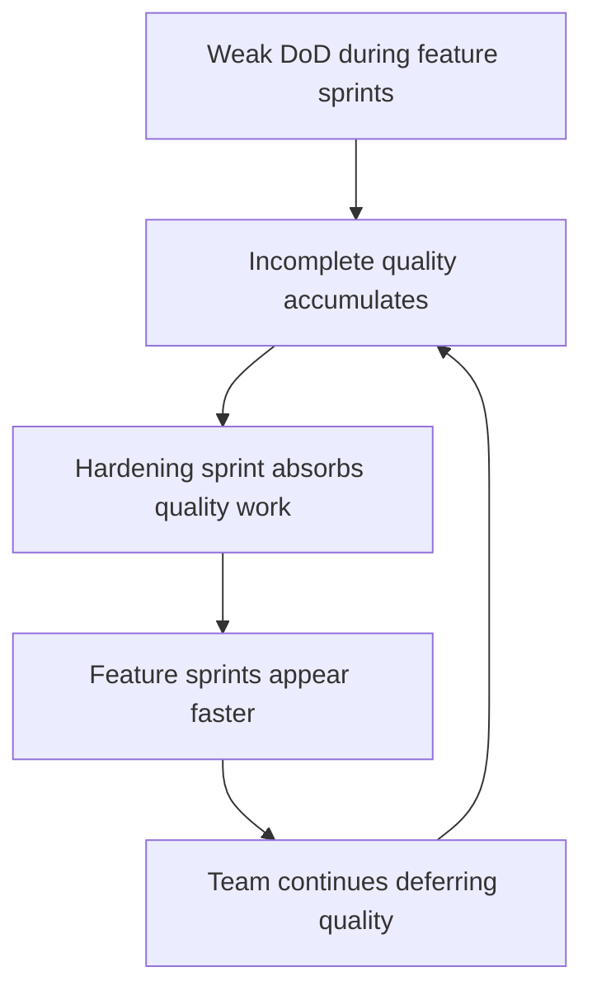
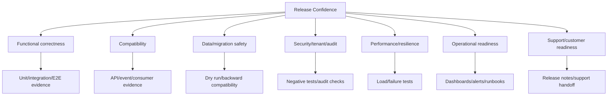

# Part 030 — Hardening, Stabilization, and Release Confidence

## 1. Source notes and scope boundary

This part uses public Scrum and reliability practice references, especially:

- Scrum Guide concepts around Increment and Definition of Done.
- Scrum.org discussions that treat hardening sprints as a smell when quality work is deferred.
- DORA delivery-performance metrics as signals of release confidence and change quality.
- Google SRE practice around learning from incidents and improving preparedness.

This part does **not** assume CSG uses hardening sprints, release trains, stabilization branches, dedicated QA phases, on-prem release windows, feature flags, or a specific release governance process.

Use the `Internal verification checklist` sections to adapt to your actual team.

---

## 2. Core thesis

Hardening is sometimes necessary.

Hardening should not become the normal way quality happens.

If every release requires a long stabilization phase, the team is not doing Scrum badly because it has a hardening phase. The team has a deeper engineering system problem:

- Definition of Done is weak,
- tests are late,
- integration risk is hidden,
- architecture work is deferred,
- bugs are normalized,
- release readiness is not part of sprint work,
- production feedback arrives too late.

A senior engineer should ask:

> Are we hardening because this release has unusual risk, or because every sprint produced unfinished quality work?

The first can be responsible engineering.

The second is quality debt.

---

## 3. What hardening means

Hardening is work that increases confidence, resilience, and readiness before release.

It may include:

- regression testing,
- performance testing,
- security validation,
- migration dry runs,
- data repair rehearsals,
- runbook validation,
- observability verification,
- failure scenario testing,
- dependency compatibility checks,
- customer/on-prem upgrade validation,
- release notes/support handoff,
- bug fixing from final validation.

Hardening is not:

- finishing incomplete stories,
- writing tests that should have been part of Done,
- making broken integration finally work,
- fixing defects knowingly deferred from multiple sprints,
- compensating for no Definition of Done,
- delaying all quality to the end.

---

## 4. Stabilization vs hardening vs release readiness

These terms are often mixed.

| Term | Meaning | Healthy use | Unhealthy use |
|---|---|---|---|
| Hardening | Confidence-building and risk reduction | Special high-risk release validation | Default quality phase |
| Stabilization | Reducing known instability before release | Release candidate defect burn-down | Hiding unfinished feature work |
| Release readiness | Evidence that release can go to production/customer | ORR, dashboards, rollback, support handoff | Checklist theatre |
| Regression testing | Checking old behavior still works | Automated + targeted manual validation | Manual big-bang every release |
| Bug bash | Exploratory testing focused on gaps | Timeboxed discovery | Substitute for systematic testing |

---

## 5. Why hardening sprints become a smell

Hardening sprints are often introduced because teams feel pain:

- too many escaped defects,
- integration fails late,
- QA overloaded at the end,
- release candidates unstable,
- stakeholders distrust increments,
- production readiness always missing,
- cross-team dependencies discovered late.

The hardening sprint seems to solve it.

But it can create a dangerous feedback loop:



The team starts relying on the hardening sprint.

Velocity appears high.

Release confidence remains fragile.

---

## 6. When hardening is legitimate

Hardening can be legitimate when risk is exceptional and explicit.

Examples:

- major cloud/on-prem release with many customers,
- large data migration,
- cross-service event model change,
- new integration with external fulfillment/billing system,
- security boundary change,
- high-volume performance-sensitive release,
- customer-specific upgrade with unusual constraints,
- regulatory/compliance validation,
- platform runtime upgrade,
- disaster recovery or game-day validation.

Healthy hardening has:

- clear risk statement,
- explicit scope,
- timebox,
- evidence goals,
- owners,
- exit criteria,
- no hidden feature completion,
- follow-up to reduce future need.

---

## 7. Release confidence model

Release confidence is not a feeling.

It is a judgment based on evidence.



A release should not be considered ready because "QA passed" alone.

It should be ready because each relevant risk surface has evidence.

---

## 8. Stabilization as backlog work

Stabilization work should be visible.

Do not hide it in vague tasks like:

- "fix bugs",
- "stabilize release",
- "QA support",
- "cleanup",
- "hardening".

Break it into explicit PBIs:

- Verify quote acceptance regression suite.
- Run migration dry run on production-like dataset.
- Fix order cancellation flaky E2E test.
- Validate Kafka consumer replay for `ProductOrderStateChanged`.
- Add dashboard panel for outbox backlog.
- Update runbook for stuck fulfillment tasks.
- Fix release-blocking defect: duplicate order from retry.
- Validate on-prem upgrade from supported version N-2.

Each should have acceptance criteria.

---

## 9. Exit criteria for stabilization

A stabilization period must have exit criteria.

Example exit criteria:

- No open Sev0/Sev1 release blockers.
- All Sev2 blockers have PO/engineering decision.
- Regression suite green for defined scope.
- Migration dry run passed.
- API/event compatibility checks passed.
- Performance smoke baseline within agreed tolerance.
- Security/tenant tests passed for changed surfaces.
- Dashboards and runbooks reviewed.
- Support/release notes ready.
- Rollback/roll-forward plan reviewed.
- Known risks accepted explicitly.

If exit criteria are vague, stabilization becomes endless.

---

## 10. Hardening by work type

### 10.1 REST API change

Hardening evidence:

- OpenAPI diff reviewed,
- contract tests passed,
- generated clients compile if applicable,
- old clients tolerate response changes,
- auth/tenant tests passed,
- error model checked,
- idempotency behavior verified,
- API metrics/dashboard present.

### 10.2 Kafka event change

Hardening evidence:

- schema compatibility check,
- consumer contract verification,
- replay test,
- duplicate event test,
- DLQ behavior tested,
- consumer lag dashboard,
- event metadata/correlation checked.

### 10.3 PostgreSQL migration

Hardening evidence:

- migration dry run,
- lock/runtime analysis,
- old/new app compatibility,
- backfill idempotency,
- query plan regression check,
- rollback/roll-forward plan,
- on-prem upgrade validation if relevant.

### 10.4 Quote pricing change

Hardening evidence:

- golden pricing cases,
- before/after diff,
- agreement/discount scenarios,
- approval threshold scenarios,
- stale price/quote expiry tests,
- audit snapshot check,
- pricing latency/error dashboard.

### 10.5 Order lifecycle change

Hardening evidence:

- state transition matrix,
- invalid transition tests,
- duplicate command tests,
- async callback tests,
- fallout/resume tests,
- audit/outbox checks,
- stuck-order dashboard/runbook.

### 10.6 Security-sensitive change

Hardening evidence:

- threat model delta,
- negative auth tests,
- tenant isolation tests,
- audit evidence tests,
- PII/log redaction check,
- security review.

---

## 11. Common stabilization activities

### 11.1 Regression suite review

Ask:

- Which journey is covered?
- Which journey is not covered?
- Which tests are flaky?
- Which tests are slow?
- Which tests do not assert meaningful business evidence?
- Which tests hide failures through retries?

Regression suites need ownership.

A regression suite nobody trusts does not create confidence.

### 11.2 Exploratory testing

Exploratory testing is useful when:

- domain behavior is complex,
- edge cases are unknown,
- UI workflows are new,
- customer-specific behavior exists,
- integration behavior is hard to automate completely.

Exploratory testing should be chartered.

Example charter:

> Explore quote approval and stale price behavior for enterprise agreement customers when catalog effective date changes after quote creation but before acceptance.

Bad charter:

> Test quote module.

### 11.3 Performance smoke

For enterprise backend changes, performance hardening may include:

- quote search latency,
- pricing calculation latency,
- order creation latency,
- Kafka consumer lag,
- outbox relay throughput,
- PostgreSQL lock waits,
- slow query review,
- JVM memory/GC.

### 11.4 Observability rehearsal

Verify:

- dashboards show expected signals,
- logs contain correlation IDs,
- alerts have correct routing,
- runbook links work,
- metric labels are safe,
- trace spans are useful,
- support can identify affected quote/order.

---

## 12. Release candidate discipline

A release candidate should be treated as an artifact with known content and evidence.

Record:

- build version,
- commit SHA,
- image digest,
- migration version,
- config version,
- feature flag state,
- included PBIs,
- known defects,
- test result summary,
- environment tested,
- release notes,
- rollback plan.

Do not let release candidate identity drift.

If you keep changing code after every validation, you are not stabilizing one candidate. You are creating multiple untracked candidates.

---

## 13. Release blockers

Define blocker categories.

Potential release blockers:

- wrong pricing,
- approval bypass,
- quote/order data corruption,
- duplicate orders,
- migration failure,
- API breaking change,
- Kafka consumer incompatibility,
- tenant isolation bug,
- audit gap for regulated action,
- no rollback for high-risk change,
- no observability for changed workflow,
- unsupported customer upgrade path.

Non-blockers may include:

- cosmetic UI issue,
- low-risk documentation typo,
- internal tooling inconvenience,
- known low-impact bug with workaround and PO acceptance.

Make blocker policy explicit before release pressure arrives.

---

## 14. Hardening and Definition of Done

If hardening repeatedly discovers the same gaps, update DoD.

Examples:

| Hardening finding | DoD update |
|---|---|
| API field breaks old client | OpenAPI diff + compatibility check required |
| Migration fails on old data | Migration test with previous-version fixture required |
| Order stuck without alert | Dashboard/runbook required for new async workflow |
| Security bug in new endpoint | Negative auth/tenant tests required |
| Pricing bug found manually | Golden pricing regression required |
| Kafka replay unsafe | Replay/idempotency test required for consumers |

Hardening should improve future sprint quality.

Otherwise it becomes recurring waste.

---

## 15. Hardening and technical debt

A hardening phase often exposes technical debt.

Examples:

- tests too slow,
- fixtures unstable,
- environment drift,
- manual deployment steps,
- no contract tests,
- no migration dry-run tooling,
- no feature flag cleanup,
- no dashboard ownership,
- customer-specific behavior undocumented.

Do not simply fix symptoms.

Create technical debt PBIs with:

- evidence,
- impact,
- repayment path,
- owner,
- urgency,
- link to release risk.

---

## 16. Hardening in Scrum without waterfall

A healthy pattern:

1. Most quality work happens inside each Sprint.
2. Definition of Done includes production-readiness expectations.
3. High-risk release gets targeted hardening based on explicit risks.
4. Hardening findings update backlog and DoD.
5. Future need for broad hardening decreases.

An unhealthy pattern:

1. Feature sprints focus on coding only.
2. QA/testing/integration deferred.
3. Hardening sprint discovers many defects.
4. Team patches frantically.
5. No DoD/process improvement.
6. Pattern repeats.

---

## 17. On-prem and enterprise-customer stabilization

Enterprise products often require more stabilization than pure SaaS products because customers may have:

- older supported versions,
- custom configuration,
- controlled maintenance windows,
- restricted network environments,
- customer-managed databases,
- customer-specific integrations,
- slower upgrade cadence,
- regulatory validation.

Hardening for on-prem/customer release may include:

- upgrade from N-1/N-2,
- installer/package validation,
- migration rollback assumptions,
- air-gapped artifact validation,
- customer-specific config tests,
- support runbook update,
- release note accuracy,
- compatibility with external adapters.

This can be legitimate hardening if explicit and planned.

---

## 18. Stabilization board design

Create explicit columns:

```txt
Ready for stabilization
In validation
Defect found
Fix in progress
Fix ready for verification
Verified
Accepted risk
Blocked
Done
```

Track:

- owner,
- affected release candidate,
- severity,
- priority,
- evidence link,
- validation environment,
- risk acceptance.

Do not mix stabilization work invisibly into regular sprint flow if release pressure is high.

---

## 19. Stabilization metrics

Useful stabilization metrics:

- open blocker count,
- blocker age,
- defect arrival rate,
- defect fix rate,
- defect reopen rate,
- release candidate churn,
- regression pass rate,
- flaky test count,
- manual validation remaining,
- change failure rate,
- failed deployment recovery time,
- time from defect discovery to verified fix.

Interpretation matters.

If defect arrival rate remains high late in stabilization, release confidence is low.

If release candidate churn is high, validation evidence may be stale.

If flaky test count is high, automation confidence is weak.

---

## 20. Hardening anti-patterns

### 20.1 Hardening as hidden QA phase

Testing happens after development.

Result:

- late discovery,
- rework,
- sprint illusion.

### 20.2 Hardening without exit criteria

Team cannot decide when release is ready.

Result:

- endless stabilization,
- political release decisions.

### 20.3 Feature completion during hardening

Stories that were not Done are finished in hardening.

Result:

- Definition of Done becomes meaningless.

### 20.4 Bug bash without prevention

Bugs are found and fixed, but no process/test improvements occur.

Result:

- same class returns.

### 20.5 Manual regression as only confidence

Manual testing compensates for missing automation.

Result:

- slow release,
- inconsistent validation,
- fragile confidence.

### 20.6 Hardening every release equally

Low-risk and high-risk releases get same process.

Result:

- waste on low-risk releases,
- insufficient focus on high-risk releases.

---

## 21. Senior engineer hardening checklist

Before accepting a hardening/stabilization plan, ask:

### Scope

- What release/change is being hardened?
- What risk is exceptional?
- Which workflows are in scope?
- Which customers/deployment modes are in scope?
- Which areas are explicitly out of scope?

### Evidence

- What tests must pass?
- What manual validation is required?
- What migration dry run is required?
- What dashboards/runbooks must be ready?
- What security/tenant validation is required?
- What support evidence is required?

### Exit

- What blocks release?
- What can be accepted risk?
- Who can accept risk?
- What is the go/no-go date?
- What is the rollback/roll-forward plan?

### Improvement

- Which gaps should update DoD?
- Which gaps become technical debt PBIs?
- Which tests should be automated later?
- Which documentation/runbook should be improved?

---

## 22. Template: targeted hardening plan

```md
# Targeted Hardening Plan

## Release/change

## Why hardening is needed

## Risk surfaces
- Domain:
- API:
- Kafka:
- Database/migration:
- Security/tenant/audit:
- Performance/resilience:
- Observability/support:
- Customer/on-prem:

## Validation scope

## Exclusions

## Entry criteria

## Exit criteria

## Blocker policy

## Test plan

## Manual exploratory charters

## Migration/upgrade validation

## Operational readiness checks

## Known risks

## Owners

## Timeline/timebox

## Follow-up improvements to DoD/backlog
```

---

## 23. Practical exercise

Review the last release/stabilization period your team had.

Answer:

1. How many defects were found during hardening?
2. Which defect classes repeated?
3. Which defects should have been caught during sprint work?
4. Which defects were legitimate release-environment discoveries?
5. Which manual checks should become automated?
6. Which hardening tasks should become DoD?
7. Which tests were flaky or distrusted?
8. Which dashboard/runbook was missing?
9. Was there explicit exit criteria?
10. Did hardening reduce future risk or only fix this release?

Then propose one DoD improvement and one test/observability improvement.

---

## 24. Part summary

Hardening and stabilization are not inherently bad.

They become harmful when they normalize deferred quality.

For enterprise Quote & Order systems, targeted hardening may be responsible for:

- high-risk releases,
- migration-heavy changes,
- customer/on-prem upgrades,
- security-sensitive changes,
- cross-service integration changes,
- major pricing/order lifecycle changes.

But the long-term goal is still clear:

> Most quality must be built into each Sprint's Increment through strong Definition of Done, testing, review, observability, and release readiness.

A senior engineer uses hardening not as a crutch, but as feedback to improve the engineering system.
