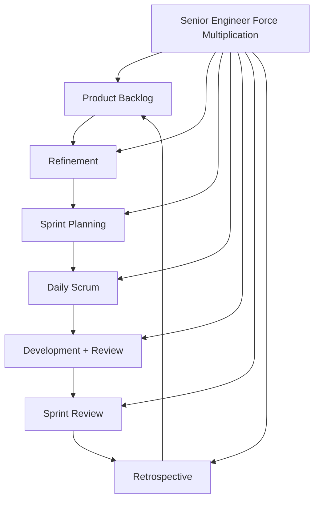
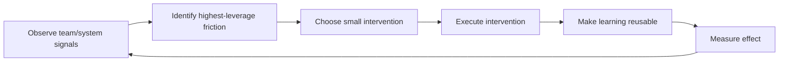

# Part 031 — Senior Engineer as Force Multiplier in Scrum

## 1. Source notes and scope boundary

This part uses public engineering and Scrum references, especially:

- The Scrum Guide and Scrum.org material on Scrum Teams, self-management, Developers, Scrum Values, and empirical process control.
- Google Engineering Practices on code review and maintaining long-term code health.
- Google re:Work material on effective teams and psychological safety.
- Prior parts of this series on Scrum events, backlog refinement, flow, Definition of Done, production readiness, and PR review.

This part does **not** assume a specific CSG engineering ladder, official senior engineer rubric, team topology, management structure, or promotion criteria.

Use the `Internal verification checklist` sections to validate how senior engineer expectations are defined inside your actual team.

---

## 2. Core thesis

A senior engineer is a force multiplier when the team's ability to deliver correct, valuable, production-ready increments improves because of their presence.

This does not mean the senior engineer writes the most code.

It means the senior engineer improves:

- problem framing;
- backlog clarity;
- technical decisions;
- risk visibility;
- code review quality;
- test strategy;
- architecture coherence;
- operational readiness;
- incident learning;
- team judgment;
- delivery flow.

In a Scrum team, force multiplication is especially important because Scrum is built on inspection and adaptation. A senior engineer should help the team inspect the right things and adapt in ways that improve the product, not merely the sprint board.

For CSG Quote & Order style work, this means helping the team see risks such as:

- quote state transition ambiguity;
- pricing snapshot correctness;
- approval authority edge cases;
- product catalog version mismatch;
- quote-to-order idempotency;
- order decomposition fallout;
- Kafka event replay safety;
- PostgreSQL migration risk;
- tenant isolation gaps;
- audit evidence gaps;
- production observability blind spots.

A senior engineer becomes a bottleneck when all difficult thinking must go through them.

A senior engineer becomes a force multiplier when the team learns to think better without waiting for them.

---

## 3. Force multiplier vs hero engineer

| Behavior | Hero engineer | Force multiplier |
|---|---|---|
| Incident response | Fixes alone at 2 AM | Fixes, documents, improves detection, and teaches recovery path |
| PR review | Blocks with personal preference | Explains domain risk, severity, and safer path |
| Architecture | Makes decisions privately | Frames trade-offs and creates decision artifacts |
| Backlog refinement | Waits for tickets | Helps expose ambiguity, risk, and slicing options |
| Mentoring | Answers every question | Transfers decision-making judgment |
| Delivery | Takes hardest tickets forever | Helps team split hard work into safe increments |
| Quality | Personally catches issues | Improves tests/checklists/DoD so issues are caught earlier |
| Knowledge | Keeps context in head | Creates maps, runbooks, examples, and shared vocabulary |

Hero behavior may be useful in emergencies.

But hero behavior as a long-term operating model weakens the team.

The senior engineer's goal is not to be indispensable.

The goal is to make the team more capable.

---

## 4. Scrum context: self-managing team, not senior-directed team

Scrum Teams are intended to be self-managing and cross-functional. That matters because senior engineers must avoid turning Scrum into command-and-control through technical authority.

A senior engineer should not behave as a hidden project manager.

A senior engineer should not unilaterally decide Sprint scope.

A senior engineer should not override the Product Owner's value decisions.

A senior engineer should not become the only person allowed to touch important code.

Instead, the senior engineer contributes deep technical judgment so the Scrum Team can make better self-managed decisions.

### 4.1 Healthy senior influence

Healthy influence sounds like:

- "This story touches order state transitions, so we need a state-machine acceptance criterion."
- "This Kafka event looks additive structurally, but it may break old consumers because the enum expansion is not tolerated."
- "We can still meet the Sprint Goal if we cut the UI export option and preserve the API/invariant work."
- "This production bug should become both a fix and a prevention backlog item."
- "Let's split this into an observable backend slice first, then expose it in UI next Sprint."

Unhealthy influence sounds like:

- "Do it my way because I have more experience."
- "No one should approve this except me."
- "Velocity is low because people are slow."
- "Architecture work cannot fit Scrum."
- "Testing can happen after development."

The difference is not confidence. The difference is whether the team becomes smarter.

---

## 5. The senior engineer's leverage surfaces in Scrum

A senior engineer has leverage at every Scrum surface.

### 5.1 Product Backlog leverage

Help the team see:

- hidden dependencies;
- unclear acceptance criteria;
- architecture runway needs;
- data migration risk;
- security/tenant impact;
- API/event compatibility;
- operational readiness;
- customer-specific complexity;
- technical debt interest.

Example:

> A backlog item says "Support quote approval override." Senior contribution: clarify actor, authority threshold, quote state, audit evidence, approval invalidation, API contract, and negative tests.

### 5.2 Refinement leverage

Help convert ambiguity into executable work.

Ask:

- What business invariant are we changing?
- What states are involved?
- What old data must continue to work?
- Which API/event contracts are affected?
- Which tests would prove correctness?
- What is the smallest vertical slice?
- What is unknown enough to require a spike?

### 5.3 Sprint Planning leverage

Help plan based on risk, not optimism.

Ask:

- Is the Sprint Goal coherent?
- Is capacity realistic after incidents/on-call/support?
- Are review and QA capacity included?
- Are dependencies available?
- Is migration work sequenced?
- Is the Sprint Backlog too WIP-heavy?
- Is there a cut line if scope must shrink?

### 5.4 Daily Scrum leverage

Help the team inspect progress toward the Sprint Goal.

Look for:

- hidden blockers;
- work stuck in review;
- unreviewed architecture risk;
- untested migration;
- unclear acceptance criteria;
- production interrupt stealing capacity;
- story that grew beyond its slice.

### 5.5 Development and PR review leverage

Use review to improve team quality, not to impose personal style.

Review for:

- domain correctness;
- transaction boundaries;
- idempotency;
- tenant isolation;
- audit evidence;
- API/event compatibility;
- test adequacy;
- observability;
- rollback/repair implications.

### 5.6 Sprint Review leverage

Help demonstrate evidence, not activity.

For enterprise backend work, evidence may include:

- API behavior;
- event emitted;
- migration dry run;
- dashboard panel;
- audit record;
- error handling;
- support workflow;
- feature flag behavior;
- production readiness status.

### 5.7 Retrospective leverage

Help convert friction into systemic improvement.

Examples:

- recurring review bottleneck → PR size policy and reviewer rotation;
- recurring unclear stories → refinement checklist;
- recurring incident interrupt → interrupt capacity and bug triage policy;
- recurring flaky tests → flaky test ownership and quarantine policy;
- recurring migration fear → migration test template.

---

## 6. Leverage through better questions

The fastest way to improve a team is often to ask better questions earlier.

### 6.1 Refinement questions

For Quote & Order work:

- Which customer journey does this support?
- What lifecycle states are affected?
- Does this touch pricing, approval, order conversion, or fulfillment?
- Is the behavior new, changed, deprecated, or corrected?
- What old data must still work?
- What happens on retry?
- What happens on duplicate event?
- What happens if downstream is slow or unavailable?
- What must be audited?
- What must be observable?
- What must be customer-configurable?

### 6.2 Design questions

- What is the source of truth?
- What is the consistency model?
- What is the transaction boundary?
- What is the rollback path?
- What is the data repair path?
- What is the API/event compatibility story?
- What is the migration sequence?
- What failure mode is most expensive?
- What behavior is intentionally out of scope?

### 6.3 Review questions

- Does this code protect the invariant?
- Does this test fail for the bug we fear?
- Does this mapper query include tenant scope?
- Does this command write audit evidence?
- Does this event represent committed state?
- Is this endpoint idempotent where retries are expected?
- Can this fail after DB commit but before external side effect?
- Is this easy for support/on-call to diagnose?

### 6.4 Retrospective questions

- What surprised us this Sprint?
- Where did we learn too late?
- Which blocker was predictable?
- Which review comment repeated a pattern?
- Which test failure was signal, not noise?
- Which production issue revealed missing DoD?
- Which process created unnecessary WIP?
- What one change would reduce future friction?

Better questions create better adaptation.

---

## 7. The force multiplier operating loop

A practical weekly loop:

### 7.1 Observe signals

Signals include:

- PR review queue;
- blocked work age;
- escaped defects;
- incident interrupts;
- unclear acceptance criteria;
- repeated architecture questions;
- flaky tests;
- slow deployments;
- production alerts;
- support tickets;
- Sprint carryover;
- team confusion.

### 7.2 Identify highest-leverage friction

Not all friction deserves immediate action.

Choose friction that is:

- repeated;
- expensive;
- affecting Sprint Goal;
- causing production risk;
- blocking multiple people;
- easy to reduce with small change.

### 7.3 Choose small intervention

Examples:

- add a PR template section for migration risk;
- create a one-page state machine diagram;
- pair with engineer on a risky refactor;
- add a negative test helper;
- write a runbook for stuck order;
- propose a spike with explicit output;
- split a story into backend observable slice and UI slice;
- clarify DoD for Kafka event changes.

### 7.4 Make learning reusable

A conversation helps one person.

A reusable artifact helps the team.

Reusable artifacts include:

- checklist;
- test helper;
- architecture map;
- ADR;
- example PR;
- runbook;
- dashboard panel;
- debugging guide;
- glossary entry;
- backlog template.

---

## 8. Avoid becoming the bottleneck

Senior engineers often become bottlenecks accidentally.

### 8.1 Bottleneck symptoms

- Every complex PR waits for you.
- People ask you privately instead of discussing in team channels.
- You rewrite others' designs instead of teaching framing.
- You carry too many critical stories yourself.
- You are the only person who understands a module.
- Work stalls when you are in meetings.
- You fix incidents but do not document recovery.
- You review late because you are overloaded.

### 8.2 Bottleneck reduction patterns

| Bottleneck | Force-multiplier response |
|---|---|
| Only you know a module | Create module map and pair two engineers through a change |
| Only you review risky PRs | Define review checklist and rotate reviewers with support |
| Only you can debug incidents | Create runbook and teach diagnosis path |
| Only you understand architecture | Write ADR/design notes and host walkthrough |
| Only you can split stories | Build story slicing examples and coach refinement |
| Review queue waits for you | Clarify ownership and reviewer selection policy |

The goal is not to disappear from important decisions.

The goal is to make important decisions less dependent on your availability.

---

## 9. Senior engineer as risk translator

A senior engineer translates technical risk into product and delivery language.

| Technical observation | Product/delivery translation |
|---|---|
| Missing idempotency key | Customer retry may create duplicate order |
| No approval audit event | We cannot prove who approved a commercial exception |
| Index missing on search path | Support/customer search may degrade under load |
| Event field removed | Existing consumer may fail after release |
| Migration locks large table | Release may block quote/order writes |
| Tenant not in cache key | Customer data isolation may be violated |
| Test only mocks database | We may miss PostgreSQL transaction/query behavior |
| No runbook | Incident recovery depends on tribal knowledge |

This translation helps Product Owners and stakeholders make informed trade-offs.

It also prevents engineers from hiding risk behind technical jargon.

---

## 10. Force multiplication by work type

### 10.1 For feature work

Senior engineer contribution:

- refine acceptance criteria;
- identify smallest vertical slice;
- add domain invariant tests;
- choose safe rollout path;
- review API/event impact;
- ensure observability and supportability.

Example:

> Feature: allow quote approval override.
>
> Senior force multiplier: split into backend authority validation, audit evidence, API contract, UI enablement, and support/reporting visibility. Add negative tests for self-approval and insufficient authority.

### 10.2 For bug work

Senior engineer contribution:

- classify severity and customer impact;
- find invariant failure;
- decide whether hotfix or backlog item;
- add prevention tests;
- improve detection;
- create follow-up debt item.

### 10.3 For migration work

Senior engineer contribution:

- require expand-contract reasoning;
- validate old/new app compatibility;
- ask for production-like dry run;
- review lock and runtime risk;
- ensure rollback/roll-forward plan;
- ensure on-prem upgrade consideration.

### 10.4 For Kafka/event work

Senior engineer contribution:

- ask about schema compatibility;
- validate partition key;
- check duplicate/replay behavior;
- ensure event represents committed state;
- check consumer ownership;
- define DLQ/retry behavior.

### 10.5 For operational work

Senior engineer contribution:

- connect runbook to alert;
- improve dashboard actionability;
- classify noisy alerts;
- add business metrics;
- ensure incident learning creates backlog improvements.

---

## 11. Influence through small standards

A team does not improve only through large initiatives.

Small standards compound.

Examples:

### 11.1 PR description standard

Every non-trivial PR should include:

- why this change exists;
- risk surface;
- tests run;
- API/event/DB impact;
- rollout/flag impact;
- screenshots/evidence if UI;
- observability/runbook note if operational.

### 11.2 Backlog item standard

Every PBI should state:

- user/business value;
- acceptance criteria;
- out of scope;
- dependencies;
- risk notes;
- test expectations;
- production readiness expectations.

### 11.3 Incident follow-up standard

Every incident should produce:

- immediate fix;
- prevention item;
- detection improvement;
- recovery/runbook improvement;
- ownership assignment.

### 11.4 Migration standard

Every high-risk migration should include:

- old/new compatibility;
- dry run result;
- lock risk;
- backfill plan;
- rollback/roll-forward plan;
- validation query.

These standards should be lightweight, not bureaucratic.

They should reduce repeated thinking, not replace thinking.

---

## 12. Handling disagreement as a senior engineer

Disagreement is normal in high-quality engineering.

The senior engineer's job is to make disagreement productive.

### 12.1 Convert disagreement into criteria

Instead of arguing:

> Should we use synchronous API call or event-driven flow?

Ask:

- Does the caller need immediate committed response?
- What is the failure mode if downstream is unavailable?
- Do we need retry/replay?
- What is the user-visible latency expectation?
- Which system owns the transaction?
- How will support diagnose partial progress?
- What is the simplest safe model for this slice?

### 12.2 Use decision records

When a decision is important, write an ADR or design note.

Do this especially when the decision affects:

- public API;
- event schema;
- state machine;
- database migration strategy;
- security boundary;
- operational model;
- customer-specific behavior.

### 12.3 Distinguish reversible and irreversible decisions

Reversible decisions can move faster.

Irreversible or expensive-to-reverse decisions need more review.

Examples of expensive decisions:

- event partition key;
- public API semantics;
- accepted quote pricing model;
- product order state model;
- tenant partitioning;
- audit record meaning;
- destructive migration.

---

## 13. Scrum Values in senior engineering practice

Scrum values are not motivational posters. They are operating constraints.

### 13.1 Commitment

A senior engineer commits to the Sprint Goal, product quality, and team learning — not just personal ticket completion.

### 13.2 Focus

A senior engineer protects focus by limiting WIP, reducing unnecessary context switching, and surfacing interrupts explicitly.

### 13.3 Openness

A senior engineer makes risk visible early:

- estimate uncertainty;
- dependency risk;
- unknown production impact;
- weak tests;
- ambiguous acceptance criteria.

### 13.4 Respect

A senior engineer respects Product Owner value decisions, Scrum Master facilitation, QA expertise, support knowledge, and junior engineer learning pace.

### 13.5 Courage

A senior engineer has courage to say:

- this is not ready;
- this release lacks rollback evidence;
- this debt is now business risk;
- this metric is being gamed;
- this incident follow-up is insufficient;
- I was wrong about the design.

---

## 14. Internal verification checklist

Validate these in your actual CSG/team context.

### 14.1 Role expectations

- What does "Senior Java Software Engineer" mean in this team?
- Is there an internal engineering ladder?
- Is technical leadership expected from seniors?
- Are seniors expected to mentor?
- Are seniors expected to lead design docs/ADRs?
- Are seniors expected to participate in incidents/on-call?
- What is the difference between senior engineer, tech lead, architect, engineering manager, and Scrum Master?

### 14.2 Scrum implementation

- Does the team run Scrum strictly or Scrum with Kanban?
- Who facilitates Scrum events?
- How is Sprint Goal defined?
- How is carryover handled?
- How are incidents handled during Sprint?
- How is technical debt represented?
- How is architecture work represented?

### 14.3 Review and ownership

- Who owns each service/capability?
- Who must review DB migrations?
- Who must review API/event contract changes?
- Who must review security-sensitive work?
- What is the expected review turnaround?
- Is review quality measured or discussed?

### 14.4 Production and operations

- What dashboards matter most?
- Which alerts are noisy?
- Which incidents happened recently?
- Where are runbooks?
- How are production bugs triaged?
- How does incident learning feed backlog?

### 14.5 Team health

- Where are the recurring bottlenecks?
- Where is knowledge concentrated?
- Which work gets stuck most often?
- Which topics create repeated disagreement?
- Which parts of the product are hardest to explain to new engineers?

---

## 15. Practical exercise: force multiplier map

Create a one-page force multiplier map for your Scrum Team.

| Area | Current friction | Evidence | Small intervention | Owner | Expected effect |
|---|---|---|---|---|---|
| Refinement | AC missing operational criteria | repeated review questions | add AC checklist | you + PO | fewer late surprises |
| PR review | reviews wait for one senior | PR age dashboard | rotate reviewers + checklist | team | lower cycle time |
| Testing | migration tests inconsistent | escaped migration bug | migration test template | DB owner | safer releases |
| Incidents | stuck order diagnosis slow | recent incident | runbook + dashboard link | on-call | faster recovery |

Pick one intervention for the next Sprint.

Keep it small enough to finish.

---

## 16. Practical exercise: convert one bottleneck into a team capability

Choose one bottleneck where people depend on you.

Examples:

- quote approval rules;
- order state transitions;
- Kafka replay debugging;
- migration review;
- production incident diagnosis.

Then create:

1. a short explainer;
2. a checklist;
3. an example PR or test;
4. a pairing session;
5. a follow-up PR by someone else.

You have succeeded when someone else can make a safe change without waiting for you.

---

## 17. Senior force multiplier anti-patterns

### 17.1 The bottleneck reviewer

Reviews everything important but too slowly.

Fix:

- define review ownership;
- create checklists;
- train secondary reviewers;
- reduce PR size;
- review earlier in design/refinement.

### 17.2 The architecture astronaut

Creates designs disconnected from Sprint delivery.

Fix:

- connect architecture work to Product Backlog;
- slice into increments;
- define evidence;
- demo architecture outcomes.

### 17.3 The private fixer

Solves production issues but leaves no trace.

Fix:

- write runbook;
- add alert/dashboard;
- create prevention item;
- share learning.

### 17.4 The pattern preacher

Advocates patterns without failure-mode reasoning.

Fix:

- explain risk;
- compare options;
- show cost;
- align with current constraints.

### 17.5 The velocity enforcer

Pushes team to finish more points while ignoring quality and production readiness.

Fix:

- use flow and quality metrics;
- protect Definition of Done;
- surface unsustainable pace;
- prioritize systemic improvement.

---

## 18. What good looks like

After applying this part, you should be able to:

- improve Sprint outcomes without controlling the team;
- make technical risk visible earlier;
- help Product Owner and Scrum Master with engineering clarity;
- reduce bottlenecks in review, design, and incident response;
- turn incidents and defects into systemic improvements;
- mentor through artifacts and better questions;
- protect product quality while maintaining delivery flow;
- strengthen self-management rather than replacing it with senior authority.

The senior engineer's highest leverage is not being the smartest person in the room.

It is making the room smarter.
