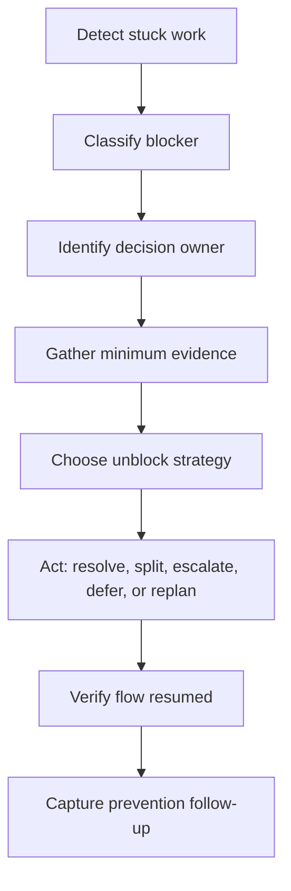

# Part 033 — Unblocking Complex Work

## 1. Source notes and scope boundary

This part uses public Scrum and engineering practice references:

- The Scrum Guide describes Scrum Teams as cross-functional and self-managing.
- The Scrum Guide says Daily Scrum is used by Developers to inspect progress toward the Sprint Goal and adapt the Sprint Backlog.
- Scrum.org describes Daily Scrum as improving communication, identifying impediments, and promoting quick decision-making.
- Atlassian's public dependency management material describes dependency management as useful for improving timeline accuracy, identifying risks, and keeping work on track.

This part does **not** assume CSG's internal Jira workflow, escalation path, support model, architecture forum, Scrum Master responsibilities, engineering manager responsibilities, or dependency board.

Use the internal verification sections to adapt the playbook to the actual team.

---

## 2. Core thesis

Unblocking is not asking people to "work faster".

Unblocking is the disciplined act of discovering why valuable work cannot flow, then reducing the smallest constraint that prevents progress toward the Sprint Goal.

For a senior engineer, unblocking complex work means:

- clarifying ambiguous domain behavior;
- identifying hidden dependencies;
- reducing technical unknowns;
- aligning reviewers and decision owners;
- making environment failures visible;
- breaking oversized work into safe slices;
- escalating with evidence;
- protecting the Sprint Goal without hiding risk;
- helping the team regain flow without creating a hero bottleneck.

In CSG Quote & Order-like enterprise systems, blockers are often not simple coding issues. They are usually intersections between product rules, architecture, data, integration, deployment, and operations.

Example blockers:

- Product Owner cannot answer whether quote approval should be invalidated after discount recalculation.
- Kafka event schema owner has not reviewed an enum change.
- PostgreSQL migration strategy is unclear for on-prem upgrades.
- QA cannot test because catalog fixture is unstable.
- PR is waiting for architecture/security review.
- A downstream fulfillment simulator is unavailable.
- CI is failing because a shared integration environment is polluted.
- Sprint work depends on another team's API that is not ready.
- Production incident consumes the only engineer who understands the order state machine.

The senior engineer's job is to make these constraints explicit, then move the system toward a decision.

---

## 3. Impediment vs blocker vs dependency vs uncertainty

Use language precisely.

| Term | Meaning | Example | Typical response |
|---|---|---|---|
| Blocker | Work cannot proceed now | PR cannot merge because required security review is missing | Escalate and resolve path |
| Impediment | Something slows or prevents Scrum Team effectiveness | CI takes 90 minutes and fails randomly | Improve system/process |
| Dependency | Work requires another person/team/system/artifact | Order feature needs platform topic ACL | Track, negotiate, sequence |
| Uncertainty | Unknown information prevents safe decision | Unknown if old customer adapters tolerate new API field | Spike or decision session |
| Risk | Potential future negative outcome | Migration may lock hot quote table | Mitigate before release |

A dependency is not automatically a blocker.

A dependency becomes a blocker when it prevents current progress.

Uncertainty becomes a blocker when the team cannot safely proceed without learning or deciding.

---

## 4. The unblocking loop

Use a simple loop:



The loop matters because many teams jump from detection to escalation without classification.

That creates noise.

Good unblocking asks:

1. What exactly is blocked?
2. What value or Sprint Goal does it affect?
3. What decision or artifact is missing?
4. Who can decide?
5. What evidence is needed?
6. What is the smallest safe next step?
7. What prevention change should be captured?

---

## 5. Blocker taxonomy for enterprise Scrum work

## 5.1 Domain ambiguity blocker

Symptoms:

- Acceptance criteria are vague.
- Engineers implement different interpretations.
- QA asks questions the story cannot answer.
- Product Owner says "just follow existing behavior" but existing behavior is inconsistent.
- Code review turns into business policy debate.

Quote & Order examples:

- Does quote expiration invalidate approval?
- Can an accepted quote be amended, or must a new quote be created?
- Does cancellation mean quote cancellation, order cancellation, service termination, or fulfillment task cancellation?
- Should product order item failure make parent order failed or partially completed?
- Is an approval threshold based on list price, net price, margin, or discount percentage?

Unblock strategy:

- Name the ambiguity.
- Create two or three concrete examples.
- Ask the Product Owner/domain SME to choose behavior.
- Capture decision in story/AC or ADR if durable.
- Add tests for chosen behavior.

Template:

```md
## Domain ambiguity

Story: <link>
Ambiguous rule: <statement>
Why it blocks: <risk>
Observed interpretations:
1. <option A>
2. <option B>
3. <option C>
Decision needed from: <PO/domain owner>
Suggested decision meeting: <time>
Evidence/examples attached: <yes/no>
```

## 5.2 Architecture decision blocker

Symptoms:

- Team knows what feature should do but not where responsibility belongs.
- Several services could own the behavior.
- Implementation path would duplicate logic.
- Reviewers disagree about design.
- Work touches public API, Kafka event, database, or security boundary.

Examples:

- Should quote-to-order conversion call order service synchronously or publish command event?
- Should approval evidence be stored inside quote aggregate or approval context?
- Should catalog version snapshot be copied into quote item or referenced by version ID?
- Should fulfillment callback update order directly or go through an orchestration command?

Unblock strategy:

- Convert debate into design decision criteria.
- Timebox a mini-design session.
- Write a lightweight ADR.
- Choose smallest reversible path if possible.
- If irreversible, escalate to architecture owner.

Decision criteria:

- domain ownership;
- consistency needs;
- failure modes;
- rollback path;
- data migration impact;
- event compatibility;
- observability;
- operational support;
- customer/on-prem constraints.

## 5.3 Review bottleneck blocker

Symptoms:

- PR waits several days.
- Required reviewer is overloaded.
- Comments arrive late and require large rework.
- Reviewers disagree and no decision owner is clear.
- PR is too large to review safely.

Unblock strategy:

- Split PR if possible.
- Ask for review by risk area, not only by person.
- Summarize risk and requested review focus.
- Schedule 15-minute walkthrough for complex PR.
- Escalate if review is blocking Sprint Goal.

Good review request:

```md
Can someone review this by tomorrow? Focus areas:
- API compatibility: new optional field in quote response
- DB safety: migration adds nullable column only
- Audit: approval reason preserved
- Tests: added stale-price acceptance negative test

This blocks Sprint Goal because quote approval story cannot be completed until this merges.
```

Weak review request:

```md
Please review.
```

## 5.4 Environment blocker

Symptoms:

- Local setup cannot run.
- Shared integration environment is unstable.
- Test data polluted.
- Downstream simulator unavailable.
- CI passes locally but fails in pipeline.
- Credentials/config are missing.

Unblock strategy:

- Confirm whether it is local-only, CI-only, or shared environment.
- Capture exact reproduction steps.
- Identify owner of environment/config.
- Create temporary local/test double path if safe.
- Add prevention item if recurring.

Evidence to collect:

- environment name;
- service version;
- config version;
- failing command;
- logs;
- trace/correlation ID;
- last known good build;
- affected stories;
- owner needed.

## 5.5 Dependency blocker

Symptoms:

- Upstream API not ready.
- Platform team has not provisioned Kafka topic/ACL.
- Security review not scheduled.
- DBA/architecture review required.
- Customer configuration input missing.
- QA data setup depends on another team.

Unblock strategy:

- Make dependency explicit.
- Negotiate date and deliverable.
- Define fallback or mock/stub path.
- Split work to proceed independently.
- Escalate only after requester/respondent alignment fails.

Dependency card shape:

```md
Dependency: <what>
Requester: <team/person>
Provider: <team/person>
Needed by: <date/sprint>
Required artifact: <API, schema, decision, config, topic, environment>
Impact if late: <Sprint Goal / release / customer>
Fallback: <stub, feature flag, partial slice, defer>
Status: requested / accepted / at risk / blocked / done
```

## 5.6 Technical unknown blocker

Symptoms:

- Estimate keeps changing.
- Engineers are debating without evidence.
- Implementation reveals hidden integration behavior.
- Story was planned as straightforward but is actually discovery.

Unblock strategy:

- Convert unknown into spike.
- Define hypothesis and output.
- Timebox investigation.
- Stop when decision criteria are met.
- Replan delivery story based on evidence.

Spike output should be:

- decision;
- rejected alternatives;
- risk list;
- recommended implementation path;
- test strategy;
- open questions.

Not just:

- "investigated".

## 5.7 Data/migration blocker

Symptoms:

- Cannot decide if migration is safe.
- Existing data violates expected constraint.
- Backfill runtime unknown.
- On-prem upgrade path unclear.
- Old app/new schema compatibility not verified.

Unblock strategy:

- Run schema/data exploration.
- Count affected rows.
- Create migration compatibility matrix.
- Add dry-run/backfill plan.
- Ask for DB/platform review.
- Split expand step from contract step.

For Quote & Order, treat migration blockers as high-risk if they touch:

- quote state;
- quote pricing snapshot;
- approval evidence;
- order lifecycle;
- tenant ID;
- audit;
- outbox/inbox;
- customer-specific configuration.

## 5.8 Security/compliance blocker

Symptoms:

- Authorization model unclear.
- Tenant boundary not reviewed.
- New endpoint exposes sensitive data.
- Audit evidence requirement unclear.
- Security review not scheduled.

Unblock strategy:

- Identify exact security question.
- Attach request/response examples.
- Show actor/role/tenant matrix.
- Propose secure default.
- Route to security/architecture owner early.

Secure default examples:

- deny by default;
- tenant from trusted auth context, not request body;
- audit privileged actions;
- do not expose object existence across tenant boundary unless policy says so;
- feature behind disabled flag until review completes.

---

## 6. Detecting stuck work before it is obvious

Good teams do not wait until the end of Sprint.

Use signals.

### 6.1 Flow signals

- Work item age increasing.
- PR age increasing.
- Review queue growing.
- Many items in "In Progress".
- CI retry count rising.
- A story moves backward repeatedly.
- Developers repeatedly say "almost done".
- QA starts late in the Sprint.
- Stories are waiting for environment/data.

### 6.2 Conversation signals

- "We just need one small thing."
- "I am waiting for X."
- "I think this is product behavior, not technical."
- "It works locally."
- "The reviewer has not had time."
- "We can clean this up later."
- "This should not affect production."
- "We do not know who owns this."

These phrases are not bad. They are cues to inspect risk.

### 6.3 Senior engineer response

Ask:

- What is the next decision needed?
- Who owns that decision?
- What evidence do we have?
- What is the smallest useful slice still possible this Sprint?
- What must be escalated now?
- What can be deferred safely?

---

## 7. Unblocking during Daily Scrum

Daily Scrum should reveal impediments, not solve all of them inside the 15-minute event.

Good pattern:

1. Identify blocker.
2. Assign follow-up owner.
3. Schedule after-party if needed.
4. Return to Sprint Goal inspection.

Example:

```md
Blocker: quote approval story is stuck because product behavior for reprice-after-approval is unclear.
Impact: blocks Sprint Goal story 2/4.
Follow-up: PO + senior engineer + QA 20 minutes after Daily.
Output needed: acceptance criteria decision and tests to add.
```

Bad pattern:

- 25-minute debate in Daily Scrum;
- no owner;
- no decision;
- same blocker repeated tomorrow.

---

## 8. Escalation without drama

Escalation is not blame.

Escalation is moving a decision to the right level when the current level cannot resolve it.

Escalate when:

- Sprint Goal is materially at risk;
- decision owner is unavailable;
- cross-team dependency has no commitment;
- production/customer risk is high;
- security/tenant/audit risk is unclear;
- architecture disagreement is blocking progress;
- environment issue affects multiple stories or teams.

### 8.1 Escalation template

```md
## Escalation: <short title>

Sprint Goal impact:
- <impact>

Current blocker:
- <what is blocked>

Decision needed:
- <specific decision>

Evidence:
- <facts, links, logs, examples>

Options:
1. <option A + trade-off>
2. <option B + trade-off>
3. <option C + trade-off>

Recommended path:
- <recommendation>

Decision owner needed:
- <person/team>

Decision needed by:
- <date/time>
```

Escalation should include options, not just a complaint.

---

## 9. Unblocking by slicing

Sometimes the best unblock is to reduce scope.

Original story:

> Implement full order cancellation for all order states, downstream fulfillment systems, billing handoff, inventory correction, UI, audit, and customer notification.

This is too large.

Slice options:

1. Cancel order before fulfillment submission.
2. Cancel order after fulfillment accepted but before work starts.
3. Cancel one failed item in fallout.
4. Add cancellation audit only.
5. Add cancellation API contract behind disabled feature flag.
6. Add simulator support for cancellation callback.
7. Add state transition matrix and tests.

Each slice can reduce risk.

The senior engineer should ask:

- Which slice gives usable value?
- Which slice reduces the most uncertainty?
- Which slice creates a safe foundation?
- Which slice can be Done in this Sprint?
- Which slice avoids irreversible data/contract changes?

---

## 10. Unblocking by making work visible

Invisible work kills Scrum flow.

Examples of invisible work:

- waiting for architecture decision;
- debugging shared environment;
- manual QA data setup;
- writing migration dry run;
- waiting for security review;
- support investigation;
- resolving flaky CI;
- coordinating with platform team.

Make it visible in the Sprint Backlog when it consumes capacity or affects Sprint Goal.

Visibility is not bureaucracy.

Visibility protects planning truth.

---

## 11. Quote & Order unblocking examples

### 11.1 Quote approval ambiguity

Blocker:

- Engineer cannot finish story because it is unclear whether modifying a quote after approval invalidates approval.

Unblock:

- Create examples: discount change, product characteristic change, customer account change, expiration extension.
- Ask PO/domain SME for rule per change type.
- Capture matrix in story.
- Add tests.
- Consider ADR if rule is durable.

### 11.2 Kafka topic provisioning dependency

Blocker:

- Order event producer cannot be tested because topic ACL is not provisioned.

Unblock:

- Add dependency card with platform owner.
- Continue local/component tests with Testcontainers.
- Define topic name/schema/ACL request.
- If topic not available by mid-Sprint, split story into producer code + deployment enablement.

### 11.3 Migration safety blocker

Blocker:

- Story adds non-null column to hot order table.

Unblock:

- Split into expand migration, application dual-write, backfill, validation, contract migration.
- Add production-like row count estimate.
- Ask DB/platform review.
- Defer constraint enforcement to later story.

### 11.4 PR review bottleneck

Blocker:

- Large PR for quote-to-order conversion is waiting for one overloaded reviewer.

Unblock:

- Split by safe boundaries: API DTO, domain tests, mapper change, outbox event, conversion handler.
- Request focused reviewers per risk area.
- Schedule walkthrough.
- Keep blocking review only for high-risk slices.

### 11.5 Environment instability

Blocker:

- Integration test environment has stale catalog fixture and fails order E2E.

Unblock:

- Capture failure with run ID and fixture version.
- Move deterministic fixture setup into test harness if possible.
- Add environment issue card.
- Continue API/component tests locally.
- Update retro action if recurring.

---

## 12. Unblocking anti-patterns

### 12.1 Hero unblocking

Senior engineer personally fixes everything and becomes a bottleneck.

Better:

- clarify path;
- pair or mentor;
- delegate ownership;
- document pattern.

### 12.2 Escalation without evidence

"Platform is blocking us" is weak.

Better:

- exact dependency;
- requested date;
- impact;
- current status;
- fallback.

### 12.3 Scope cutting that destroys value

Reducing scope is good only if remaining slice is still coherent.

Bad slice:

- database column added but no behavior.

Better slice:

- API accepts new optional field, persists it, and returns it for one use case behind flag.

### 12.4 Silent waiting

Waiting without visibility makes Sprint planning false.

If work is blocked, say so early.

### 12.5 Treating blockers as individual failure

Many blockers are system design issues, not personal productivity issues.

A mature team improves the system.

---

## 13. Senior engineer unblocking checklist

When someone says work is blocked:

- What exactly cannot proceed?
- Which Sprint Goal or PBI is affected?
- Is it domain, technical, dependency, environment, review, security, or data blocker?
- Who owns the missing decision/artifact?
- What evidence is available?
- Is there a safe parallel task?
- Can the story be sliced?
- Can we use a spike?
- Is escalation needed today?
- Is this a recurring impediment that belongs in retro?
- What prevention action should be captured?

---

## 14. Internal verification checklist

Verify these inside your CSG/team context:

- Who removes impediments in practice: Scrum Master, Developers, team lead, manager, or shared responsibility?
- How are blockers represented in Jira/Azure board?
- Is there a field for blocked reason or dependency?
- What is the escalation path for architecture review?
- What is the escalation path for security review?
- What is the escalation path for platform/environment issues?
- How are cross-team dependencies tracked?
- How are production incidents represented in Sprint Backlog?
- How are PR review bottlenecks handled?
- Is there a policy for interrupt work?
- Which recurring blockers appeared in the last 3 Retrospectives?
- Which environment issues repeatedly block testing?
- Which knowledge silos create bottlenecks?
- Which team has dependency on your team most often?
- Which external team do you depend on most often?

---

## 15. Practical exercise

Choose one blocked or recently delayed PBI.

Write:

1. PBI title.
2. Sprint Goal impact.
3. Blocker category.
4. Exact missing decision/artifact.
5. Current owner.
6. Evidence collected.
7. Options.
8. Recommended unblock path.
9. Prevention follow-up.

Then discuss with your Scrum Master, Product Owner, or senior teammate.

The goal is not to blame.

The goal is to turn stuck work into visible, solvable work.

---

## 16. Summary

Complex work gets blocked because enterprise software is full of hidden dependencies, ambiguous domain rules, environment constraints, review bottlenecks, and production risk.

A senior engineer unblocks by making constraints explicit, reducing uncertainty, choosing safe slices, escalating with evidence, and improving the system so the same blocker is less likely to repeat.

The best unblocking behavior strengthens self-management.

It does not create dependency on the senior engineer.
