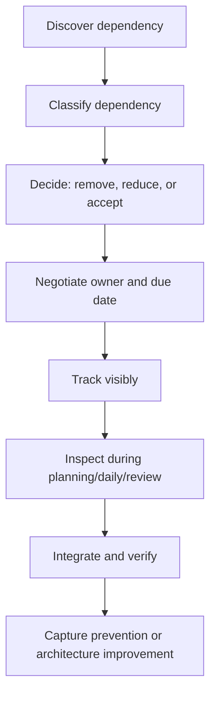
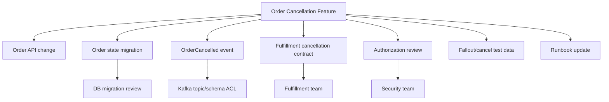

# Part 034 — Cross-Team Dependency Management

## 1. Source notes and scope boundary

This part uses public Scrum and agile dependency references:

- The Scrum Guide describes Scrum Teams as cross-functional and self-managing.
- Scrum.org's Nexus Guide describes Nexus as a framework that minimizes cross-team dependencies and integration issues when multiple Scrum Teams work together.
- Scrum.org Nexus material highlights dependency awareness and cross-team issues as important at scale.
- Atlassian's dependency management material frames dependency management as useful for identifying risks and improving timeline accuracy.

This part does **not** assume CSG uses Nexus, SAFe, LeSS, Scrum@Scale, Jira Align, a release train, a dependency board, or a specific cross-team planning ceremony.

Use the internal verification checklist to discover the actual coordination mechanism used by your organization.

---

## 2. Core thesis

Cross-team dependencies are not inherently bad.

They become dangerous when they are invisible, late, unowned, unnegotiated, or incompatible with Sprint and release goals.

In enterprise Quote & Order systems, one meaningful feature can depend on:

- Product Owner for behavior decision;
- architecture owner for service boundary;
- platform team for Kafka topic/ACL;
- security team for authorization review;
- QA team for fixture/test plan;
- database owner for migration review;
- fulfillment team for downstream contract;
- billing team for handoff semantics;
- customer integration team for adapter compatibility;
- release team for customer/on-prem rollout;
- support team for runbook and operational readiness.

A senior engineer should not try to eliminate all dependencies immediately. Some dependencies reflect real specialization and ownership.

The goal is to:

1. detect dependencies early;
2. reduce unnecessary dependencies;
3. negotiate necessary dependencies explicitly;
4. sequence work to preserve flow;
5. make integration risk visible;
6. prevent dependency surprises near Sprint end or release cut.

---

## 3. Dependency taxonomy

Use clear dependency types.

| Dependency type | Example | Risk if unmanaged |
|---|---|---|
| Product decision | PO/domain SME must decide approval invalidation rule | wrong behavior or blocked implementation |
| API contract | Downstream team must expose endpoint | waiting, contract mismatch |
| Event contract | Kafka schema/consumer alignment required | breaking consumers, DLQ |
| Platform | Topic, secret, namespace, ingress, DB access | blocked deployment/testing |
| Security | Auth/tenant/audit review required | late rejection or vulnerability |
| Data/migration | DB review or migration window required | unsafe release |
| QA/test | Fixture, simulator, E2E plan needed | late testing and defects |
| Release | Shared release train/customer window | feature done but not enabled |
| Customer/integration | Customer adapter behavior needed | production incompatibility |
| Knowledge | Only one person understands subsystem | bottleneck and risk |

A dependency should have:

- requester;
- provider;
- deliverable;
- due date/sprint;
- acceptance criteria;
- fallback path;
- risk if late;
- owner for follow-up.

---

## 4. Dependency lifecycle



The most important step is often step C.

Not every dependency should be managed.

Some should be removed by changing architecture, slicing, test strategy, or ownership.

---

## 5. Remove, reduce, or accept

### 5.1 Remove dependency

Remove when the dependency is accidental.

Examples:

- every story needs manual test data from QA because fixture setup is not automated;
- every API change needs one overloaded architect because ownership is unclear;
- every deployment needs platform ticket because config is not self-service;
- every mapper change needs DB expert because tests are missing.

Removal strategies:

- automate fixture setup;
- create service ownership map;
- provide self-service platform templates;
- add migration/testing playbook;
- document architecture decision rules;
- spread knowledge through pairing.

### 5.2 Reduce dependency

Reduce when dependency is real but can be narrowed.

Examples:

- Instead of waiting for complete downstream fulfillment API, use simulator for first slice.
- Instead of needing full security review, use existing approved auth pattern for internal endpoint.
- Instead of needing all TMF mapping decisions, slice one resource/action first.
- Instead of waiting for final catalog model, use stable synthetic catalog fixture.

### 5.3 Accept dependency

Accept when dependency reflects legitimate ownership.

Examples:

- security team must review tenant isolation change;
- platform team must provision production Kafka ACL;
- downstream team owns billing handoff contract;
- Product Owner must decide customer-visible behavior.

Accepted dependencies need explicit agreement.

They should not be hidden inside vague comments.

---

## 6. Cross-team dependency card

Use a standard card.

```md
# Dependency: <short name>

## Requester
- Team:
- Owner:

## Provider
- Team:
- Owner:

## Required deliverable
- API / schema / environment / decision / config / review / test data / release slot:

## Needed by
- Sprint:
- Date:
- Why this date matters:

## Acceptance criteria
- How do we know the dependency is satisfied?

## Current status
- proposed / requested / accepted / at risk / blocked / done

## Impact if late
- Sprint Goal impact:
- Release impact:
- Customer impact:

## Fallback or mitigation
- Stub, simulator, feature flag, partial slice, defer, manual step:

## Check-in cadence
- Where/when will this be inspected?
```

This turns dependency management from memory into a visible artifact.

---

## 7. Dependency discovery during refinement

Refinement is the best time to discover dependencies.

Ask per PBI:

### 7.1 Product/domain

- Does this require a decision from PO or domain SME?
- Does it affect customer-visible behavior?
- Does it depend on customer-specific rules?
- Does it need support/customer-facing input?

### 7.2 API/event

- Does this change REST API contract?
- Does this change TMF mapping?
- Does this change Kafka event schema?
- Do consumers need to update?
- Is a schema/topic/ACL needed?

### 7.3 Data/migration

- Does this need DB migration?
- Does it touch hot tables?
- Does it affect on-prem upgrade?
- Is backfill needed?
- Does another team own source of truth?

### 7.4 Security/compliance

- Does it change auth/permission?
- Does it affect tenant isolation?
- Does it expose PII/commercial data?
- Is audit evidence required?
- Is security review needed?

### 7.5 Testing/release

- Does QA need fixture/simulator/data?
- Does this require E2E environment stability?
- Does this need release coordination?
- Does it need feature flag configuration?
- Does support need runbook/update?

If the answer is yes, create dependency card or split the story.

---

## 8. Dependency management during Sprint Planning

Before Sprint commitment, inspect dependency risk.

### 8.1 Planning questions

- Which selected PBIs depend on another team?
- Has the provider team accepted the dependency?
- Is the due date inside the Sprint?
- What if it is late?
- Can the team still meet Sprint Goal without it?
- Is there a safe fallback slice?
- Does this dependency consume review/test/deployment capacity?

### 8.2 Commitment smell

Bad Sprint commitment:

> We will complete the order integration if platform provisions topic, security approves endpoint, fulfillment team finishes callback, and QA prepares data.

This is not a commitment. It is a dependency gamble.

Better:

> Sprint Goal: complete order event producer implementation and contract verification against local simulator. Platform topic provisioning is tracked as dependency; production enablement is not committed this Sprint.

That preserves transparency.

---

## 9. Dependency management during Daily Scrum

Daily Scrum should inspect cross-team dependencies when they affect Sprint Goal.

Good update:

```md
Dependency: Platform topic ACL for ProductOrderCreated.
Status: accepted by platform, expected Wednesday.
Impact: deployment test blocked, local Testcontainers path complete.
Mitigation: if ACL slips past Thursday, story will be split and production enablement moves to next Sprint.
Owner: Asha follows up after Daily.
```

Bad update:

```md
Still waiting for platform.
```

The first one creates action.

The second one creates drift.

---

## 10. Dependency management during Sprint Review

Sprint Review should not hide unresolved dependencies.

Show:

- what is Done;
- what is not Done;
- what dependency remains;
- what evidence exists;
- what decision is needed;
- what changes to Product Backlog are recommended.

Example:

> We completed the order event producer, schema compatibility test, and local component verification. Production enablement is not Done because platform ACL provisioning is still pending. The Product Backlog should keep the enablement item separate with platform dependency accepted for next Sprint.

This is honest.

It protects trust.

---

## 11. Dependency management in Retrospective

Retro should inspect recurring dependency patterns.

Ask:

- Which dependencies surprised us?
- Which dependencies were discovered too late?
- Which dependencies were avoidable?
- Which dependencies had unclear owner?
- Which dependency blocked Sprint Goal?
- Which dependency should become self-service?
- Which dependency indicates architecture coupling?
- Which dependency needs cross-team agreement?

Turn recurring dependency into improvement item.

Examples:

- create platform request template;
- automate fixture setup;
- create API change review checklist;
- establish Kafka schema review SLA;
- document tenant isolation review trigger;
- create cross-team office hour;
- reduce coupling through event contract.

---

## 12. Quote & Order dependency examples

### 12.1 Pricing feature depends on catalog team

Dependency:

- New pricing rule depends on catalog characteristic availability.

Risks:

- pricing implemented against wrong characteristic;
- quote accepted with incomplete data;
- customer-specific catalog variant breaks.

Management:

- define characteristic contract;
- use synthetic catalog fixture;
- agree effective date behavior;
- add catalog snapshot test;
- capture owner and date.

### 12.2 Order feature depends on fulfillment adapter team

Dependency:

- Order cancellation requires downstream fulfillment cancellation API.

Risks:

- order appears cancelled locally but work continues downstream;
- duplicate cancellation requests;
- customer-visible mismatch.

Management:

- define callback contract;
- implement local state guard first;
- create simulator mode;
- agree idempotency key;
- add runbook for stuck cancellation.

### 12.3 API story depends on customer integration team

Dependency:

- New quote response field affects external customer adapter.

Risks:

- strict client deserialization fails;
- customer regression;
- release blocked late.

Management:

- OpenAPI diff;
- compatibility review;
- generated client test;
- customer adapter smoke test;
- release note.

### 12.4 Migration depends on platform/DBA/on-prem release

Dependency:

- Backfill migration for order item table needs runtime estimate and on-prem upgrade support.

Risks:

- locks hot table;
- customer upgrade fails;
- rollback unsafe.

Management:

- production-like row count;
- expand-contract split;
- dry run;
- migration review;
- on-prem instruction update.

### 12.5 Security dependency for tenant isolation

Dependency:

- New admin export endpoint requires tenant/security review.

Risks:

- cross-tenant data exposure;
- PII leakage;
- audit gap.

Management:

- actor/role/tenant matrix;
- negative tests;
- audit expectation;
- security review scheduled before Sprint commitment.

---

## 13. Cross-team integration risk

Dependency management is not complete until integration works.

Integration risks:

- both teams deliver but contracts mismatch;
- API compiles but semantics differ;
- event schema compatible but partition key wrong;
- endpoint exists but auth scope wrong;
- staging works but production config missing;
- release order creates temporary incompatibility;
- old consumer cannot tolerate new event;
- downstream is not idempotent.

Integration checklist:

- contract examples exchanged;
- version compatibility checked;
- auth/tenant behavior agreed;
- retry/idempotency agreed;
- error model agreed;
- staging verification completed;
- rollback/disable path known;
- observability across boundary exists.

---

## 14. Dependency visualizations

For complex work, draw the dependency graph.



The diagram reveals sequencing.

If all edges are required before anything can merge, the story is too coupled.

Split it.

---

## 15. Cross-team dependency anti-patterns

### 15.1 Dependency discovered during last two days of Sprint

Usually indicates weak refinement or planning.

### 15.2 Dependency accepted verbally but not tracked

Memory is not a dependency system.

### 15.3 Dependency assigned to a team, not a person

A team can own capability, but follow-up needs a named contact.

### 15.4 No fallback path

If dependency slips, Sprint collapses.

### 15.5 Over-escalation

Every small dependency becomes management escalation.

This creates noise and erodes trust.

### 15.6 Under-escalation

Team silently waits until Sprint Goal is impossible.

### 15.7 Local optimization

One team completes its ticket while integrated Increment is still broken.

### 15.8 Hidden architecture coupling

Frequent dependencies may reveal wrong service boundaries or missing platform self-service.

---

## 16. Senior engineer role in dependency management

A senior engineer should:

- identify hidden dependencies during refinement;
- distinguish real dependency from accidental dependency;
- help split stories to reduce dependency risk;
- communicate technical dependency in product/release terms;
- make integration criteria explicit;
- negotiate with other engineers respectfully;
- escalate with evidence when needed;
- improve systems that create repeated dependencies;
- avoid becoming the permanent dependency router.

The senior engineer is not a project manager.

But they are responsible for making technical risk visible enough for Scrum Team decisions.

---

## 17. Internal verification checklist

Verify these internally:

- How are cross-team dependencies tracked?
- Is there a formal dependency board or only Jira links?
- Is Jira Align or another portfolio tool used?
- Are dependencies negotiated during PI/release planning, Sprint Planning, or refinement?
- What is the escalation path for missed dependencies?
- Are platform requests self-service or ticket-based?
- Who owns Kafka topic/schema/ACL provisioning?
- Who owns OpenAPI/TMF contract review?
- Who owns DB migration approval?
- Who owns security review?
- Who owns QA/test data environments?
- Who owns on-prem release packaging?
- How are dependencies surfaced in Sprint Review?
- Which dependencies repeatedly delay this team?
- Which dependencies repeatedly delay other teams because of this team?
- Are there architecture initiatives to reduce dependencies?

---

## 18. Practical exercise

Choose one upcoming Epic or complex PBI.

Create a dependency map:

1. Product decision dependencies.
2. API/event dependencies.
3. Database/migration dependencies.
4. Platform/environment dependencies.
5. Security/audit dependencies.
6. QA/test data dependencies.
7. Release/customer dependencies.
8. Knowledge/reviewer dependencies.

For each dependency, decide:

- remove;
- reduce;
- accept and track.

Then rewrite the Epic into smaller slices that reduce dependency risk.

---

## 19. Summary

Cross-team dependencies are normal in enterprise products, but unmanaged dependencies destroy Sprint predictability, release confidence, and team trust.

A senior engineer helps by making dependencies visible early, reducing accidental coupling, negotiating necessary work explicitly, and focusing the team on integrated, Done, usable outcomes.

Dependency management is not paperwork.

It is risk management for complex product delivery.
