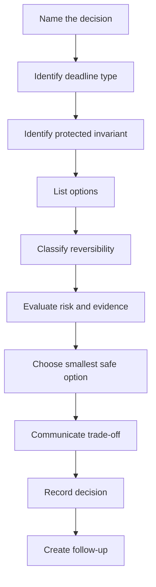

# Part 035 — Technical Decision-Making Under Deadline

## 1. Source notes and scope boundary

This part uses public engineering and Scrum references:

- Scrum Guide: Sprint Backlog is updated throughout the Sprint as more is learned, while the Sprint Goal remains the objective of the Sprint.
- Google Engineering Practices: code review and engineering decisions involve trade-offs, with long-term code health as a major concern.
- AWS Well-Architected Framework: architecture work should consider operational excellence, security, reliability, performance, cost, and sustainability.
- Martin Fowler's Architecture Decision Record guidance: ADRs capture a decision, context, and consequences in a short durable record.

This part does **not** assume CSG has a specific decision framework, architecture approval board, escalation policy, or risk acceptance template.

Use the internal verification sections to map this guidance to your actual team process.

---

## 2. Core thesis

A senior engineer is often valuable not because they always know the best answer, but because they can make a defensible decision when the answer is incomplete.

In Scrum, deadlines appear as:

- Sprint Goal pressure,
- release window pressure,
- customer commitment pressure,
- incident pressure,
- dependency pressure,
- on-prem packaging pressure,
- security/compliance pressure,
- support escalation pressure.

Under deadline, weak teams often choose between two bad extremes:

1. **reckless speed** — merge now and discover consequences in production;
2. **analysis paralysis** — keep discussing until the opportunity or deadline is gone.

Senior engineering judgment is the third path:

> Make the smallest safe-enough decision that protects the most important invariant, preserves future options, and makes risk explicit.

For CSG Quote & Order work, this matters because a rushed decision can affect pricing correctness, approval authority, order lifecycle, Kafka event compatibility, PostgreSQL data safety, tenant isolation, or customer-facing delivery timelines.

---

## 3. Deadline pressure changes the decision problem

Under normal conditions, engineers can optimize for elegance, completeness, and long-term fit.

Under deadline, the optimization function changes.

You must balance:

- customer impact,
- Sprint Goal,
- delivery commitment,
- quality bar,
- rollback safety,
- observability,
- operational burden,
- future migration cost,
- stakeholder trust.

The key is not to ignore quality.

The key is to identify which quality properties are non-negotiable and which can be paid down safely later.

### 3.1 Non-negotiable properties

For enterprise Quote & Order systems, these are usually non-negotiable:

- tenant isolation,
- authorization correctness,
- pricing evidence integrity,
- approval authority enforcement,
- quote/order lifecycle invariants,
- data migration safety,
- customer-visible API compatibility,
- no duplicate commercial commitments,
- audit evidence for sensitive actions,
- rollback or roll-forward clarity for high-risk release.

### 3.2 Negotiable properties

These may be negotiable under deadline if documented:

- UI polish,
- internal implementation elegance,
- broad generalization,
- advanced automation,
- full dashboard refinement,
- refactoring all historical code paths,
- optimizing for every future variant,
- replacing a manual support step with automation.

The distinction must be explicit.

Bad decision:

> We will skip testing to meet the deadline.

Better decision:

> We will ship a narrower slice: API + backend behavior + integration tests + audit. We will defer UI polish and extended reporting. The deferred work is tracked as follow-up, and the feature remains behind a tenant-scoped flag until the reporting view is ready.

---

## 4. Decision pressure taxonomy

Different deadlines require different decision behavior.

| Deadline type | Example | Correct senior response |
|---|---|---|
| Sprint deadline | PBI not complete by final day | Negotiate scope against Sprint Goal and DoD |
| Release window | On-prem package cut tomorrow | Protect compatibility and upgrade safety |
| Customer escalation | Specific tenant blocked | Contain, fix minimal path, document risk |
| Incident | Production broken now | Mitigate first, then repair/design properly |
| Dependency deadline | Upstream team needs schema today | Provide stable contract or explicit stub |
| Regulatory/security | Audit/security requirement due | Escalate, avoid unsafe exception without owner |
| Architecture uncertainty | Design not settled | Timebox spike and capture decision |

Never treat every deadline the same.

An incident may justify temporary mitigation.

A release window may justify deferring a feature.

A security deadline may require blocking release.

A Sprint deadline does not justify violating Definition of Done.

---

## 5. The senior decision loop

Use this loop under pressure:



This loop is intentionally lightweight.

It prevents panic-driven decisions without requiring a 20-page design doc for every urgent issue.

---

## 6. Step 1 — Name the decision

Many teams argue because they have not named the decision.

Weak discussion:

> Should we do it properly or quickly?

Better decision statement:

> Should we include approval invalidation in the first Sprint slice of this discount feature, or ship discount calculation behind a disabled flag and implement approval invalidation in the next Sprint before enabling it for any tenant?

Good decision statements include:

- what is being decided,
- what options exist,
- what constraint creates urgency,
- what consequence matters.

### 6.1 Decision statement template

```md
## Decision
We need to decide whether to <option area> because <deadline/constraint>.

## Context
- Current Sprint Goal:
- Customer/release constraint:
- Affected domain:
- Affected systems:

## Options
1. <Option A>
2. <Option B>
3. <Option C>

## Protected invariant
The decision must not violate: <invariant>.
```

---

## 7. Step 2 — Identify the protected invariant

Under deadline, the most important question is:

> What must not be broken?

For Quote & Order, protected invariants often include:

### 7.1 Quote invariants

- accepted quote must preserve commercial terms,
- quote cannot be accepted after price expiry unless policy explicitly allows it,
- approval must match the quote version and price snapshot,
- accepted quote cannot be silently repriced,
- quote-to-order conversion must be idempotent.

### 7.2 Pricing invariants

- line totals must reconcile with quote total,
- discount authority must be enforced,
- rounding/currency rules must be stable,
- pricing snapshot must be explainable,
- agreement terms must be applied consistently.

### 7.3 Order invariants

- order state must be derivable from item/task state,
- duplicate order must not be created from one accepted quote,
- cancellation must not leave active downstream tasks uncontrolled,
- completed order must not contain active required items.

### 7.4 Event invariants

- event represents committed state,
- event has tenant/correlation/causation metadata,
- consumer processing is idempotent,
- replay does not produce unsafe side effects,
- schema changes are backward compatible.

### 7.5 Security/audit invariants

- tenant isolation is preserved,
- authorization is server-side,
- privileged action is audited,
- denied action does not mutate state,
- PII/commercial sensitive data is not leaked.

If a deadline decision violates one of these, it must be escalated.

---

## 8. Step 3 — Classify reversibility

A decision's risk depends heavily on reversibility.

| Decision type | Meaning | Example |
|---|---|---|
| Highly reversible | Can be undone through config/code rollback | UI copy, dashboard panel, disabled feature flag |
| Reversible with cost | Rollback possible but needs coordination | API behavior behind feature flag |
| Hard to reverse | Data/events/customer behavior already observed | Kafka schema change, pricing logic enabled |
| Irreversible/externally visible | External side effects cannot be undone cleanly | duplicate order to fulfillment, billing handoff |

Under deadline, prefer reversible decisions.

### 8.1 Two-way door decisions

Good candidates for fast decision:

- internal implementation detail behind stable contract,
- feature flag default off,
- additive log/metric,
- narrow test infrastructure change,
- documentation update,
- temporary adapter timeout tuning with rollback.

### 8.2 One-way door decisions

Require more rigor:

- public API contract change,
- event schema/partition key change,
- DB destructive migration,
- pricing calculation change,
- approval authority change,
- tenant isolation model change,
- order state model change,
- customer-visible lifecycle behavior,
- on-prem upgrade packaging change.

A senior engineer slows down one-way doors and speeds up two-way doors.

---

## 9. Step 4 — Create options, not binaries

Deadline pressure often creates false binaries:

- ship or slip,
- refactor or hack,
- fix now or ignore,
- rollback or roll forward.

Senior engineers create more options.

### 9.1 Option patterns

| Pattern | Use when |
|---|---|
| Narrow slice | Full feature too risky for Sprint |
| Feature flag | Deploy separately from enablement |
| Tenant-scoped rollout | Risk differs by customer/tenant |
| Shadow mode | Need evidence before switching behavior |
| Manual operational step | Automation too risky now, volume low |
| Spike | Unknown blocks safe estimation/decision |
| Contract-first stub | Downstream dependency not ready |
| Roll-forward patch | Rollback would corrupt or strand data |
| Partial revert | Only one behavior unsafe |
| Read-only release | Need observability before mutation path |

### 9.2 Example: CPQ discount feature under deadline

False binary:

- ship full discount feature now,
- or miss release.

Better options:

1. Ship discount calculation behind disabled flag.
2. Ship discount calculation for internal test tenant only.
3. Ship read-only preview calculation without quote acceptance.
4. Ship backend + tests, defer UI exposure.
5. Ship only below-threshold discount path, defer approval-required path.
6. Defer release because approval invalidation is not safe.

The senior role is to make options visible.

---

## 10. Step 5 — Use a decision matrix

When time is short, a simple matrix is better than unstructured debate.

```md
| Option | Customer value | Delivery speed | Correctness risk | Operational risk | Reversibility | Recommendation |
|---|---:|---:|---:|---:|---:|---|
| A | high | high | high | medium | low | reject |
| B | medium | high | low | low | high | choose |
| C | high | low | low | medium | medium | defer |
```

For Quote & Order, include these columns when relevant:

- domain invariant risk,
- API/event compatibility,
- data migration risk,
- tenant/security risk,
- audit evidence,
- customer/on-prem impact,
- rollback path.

---

## 11. Step 6 — Decide at the right level

Not every decision needs the same forum.

| Decision | Decision owner/forum |
|---|---|
| Local implementation detail | Engineer + reviewer |
| Sprint scope trade-off | Developers + Product Owner, often Scrum Master facilitation |
| API/event contract risk | Owning team + consumers + architecture/API governance |
| Security exception | Security owner + accountable engineering/product owner |
| Production incident mitigation | Incident commander/response process |
| Customer-facing release delay | Product/release/customer stakeholders |
| Architecture direction | Architecture review/ADR owners |
| Data repair | Incident/change/data owner approval |

Senior engineers should not hoard decisions.

They should route decisions to the right accountable people with clear framing.

---

## 12. Decision quality vs outcome quality

A good decision can have a bad outcome because the world is uncertain.

A bad decision can have a good outcome because the team got lucky.

Senior engineers evaluate decision quality by asking:

- Did we name the decision?
- Did we identify the protected invariant?
- Did we list realistic options?
- Did we evaluate reversibility?
- Did we consult the right owners?
- Did we document trade-offs?
- Did we create follow-up?
- Did we observe production outcome?

This matters in retrospectives.

Do not punish reasonable decisions that had unpredictable outcomes.

Do not reward reckless decisions just because production survived.

---

## 13. Scenario 1 — Sprint deadline and unfinished PBI

### Context

A story adds approval invalidation when quote price changes. Coding is done, but tests for stale approval and audit evidence are missing. Sprint ends tomorrow.

### Bad choices

- merge without tests,
- mark story done and create bug later,
- hide unfinished work,
- claim DoD exception without approval.

### Better decision

Options:

1. Finish tests and drop lower-priority work.
2. Split story: merge internal helper behind no behavior change, keep behavior PBI open.
3. Keep story not done, explain why Sprint Goal risk emerged.
4. Move feature behind disabled flag and do not count as done if DoD unmet.

Recommended senior stance:

> Do not count behavior as done if approval invalidation tests and audit evidence are missing. Either complete the minimum safety tests or narrow the increment.

### Why

Approval invalidation protects commercial authority and accepted quote correctness.

This is not cosmetic.

---

## 14. Scenario 2 — Customer escalation and hotfix pressure

### Context

A customer cannot submit orders because a new validation rejects a rare installed-base case. The sprint is mid-flight.

### Decision questions

- Is the behavior actually wrong or is customer data inconsistent?
- Which tenants are affected?
- Can the validation be tenant-scoped or feature-flagged?
- Does bypassing validation create invalid orders?
- Is there a manual workaround?
- Is data repair needed?
- Is audit/support communication required?

### Better options

1. Roll back the validation if safe.
2. Add a narrow exception for the affected product/configuration with audit.
3. Repair installed-base data if source data is wrong.
4. Pause order submission for affected path and communicate ETA.
5. Ship hotfix with integration/regression test for that case.

### Senior stance

Fix customer impact, but do not create a broader lifecycle hole.

If bypassing validation can create invalid fulfillment orders, it is not an acceptable quick fix.

---

## 15. Scenario 3 — Kafka event schema needed by another team

### Context

Downstream billing/integration team needs a new field in `ProductOrderCompleted` by end of Sprint.

### Decision questions

- Is the field additive?
- Is it required or optional?
- Can old consumers ignore it?
- Does it contain PII/commercial sensitive data?
- Is schema registry compatibility enforced?
- Is field available at event emission time?
- Is it stable across replay?
- Is it derived from source of truth or projection?

### Better options

1. Add optional field with default absent semantics.
2. Add new event type if semantics differ.
3. Publish new field only in v2 topic if compatibility cannot be preserved.
4. Provide temporary lookup API instead of event expansion.
5. Delay until downstream contract is precise.

### Senior stance

An event field is a contract, not a convenience.

Deadline does not justify semantic ambiguity.

---

## 16. Scenario 4 — PostgreSQL migration before release

### Context

A release needs a new non-null column on a large `quote` table.

### Bad choice

```sql
ALTER TABLE quote ADD COLUMN approval_basis_hash text NOT NULL;
```

### Risk

- existing rows violate constraint,
- table rewrite/lock risk,
- old app may not write field,
- on-prem upgrade may fail,
- rollback uncertain.

### Better options

1. Add nullable column.
2. Deploy app writing both old/new data.
3. Backfill in chunks.
4. Validate completeness.
5. Enforce not-null later.

### Senior stance

Use expand-contract. If release pressure prevents safe migration, scope the feature differently.

Database safety is not optional because of Sprint timing.

---

## 17. Scenario 5 — Security exception request

### Context

A customer integration cannot complete OAuth setup before deadline. Someone suggests allowing an API key bypass for one endpoint.

### Decision questions

- What data/actions does endpoint expose?
- Is endpoint read-only or state-changing?
- Is tenant isolation enforceable?
- How is key rotated/revoked?
- Is request audited?
- Is IP allowlist/mTLS available?
- Who approves security exception?
- What is expiration date?

### Senior stance

Do not invent security bypasses informally.

If a temporary exception is truly necessary, it must be approved, scoped, monitored, audited, and time-bounded.

---

## 18. Communication under deadline

Decision communication must be concise and explicit.

### 18.1 Good update structure

```md
Decision needed: <specific decision>
Deadline: <date/time/reason>
Protected invariant: <must not break>
Options considered:
- A: pros/cons
- B: pros/cons
Recommendation: <option>
Risk accepted: <known risk>
Mitigation: <how controlled>
Follow-up: <tracked item>
Owner: <person/team>
```

### 18.2 Bad communication patterns

Avoid:

- "should be fine",
- "quick hack",
- "temporary" without expiry,
- "we can clean later" without backlog item,
- "business wants it" without risk framing,
- "engineering says no" without alternatives,
- "tests pass" without explaining coverage.

### 18.3 Stakeholder translation

Translate engineering concerns into business risk.

| Engineering issue | Business framing |
|---|---|
| no idempotency | retry can create duplicate order |
| weak migration | release can block production writes |
| missing approval invalidation | quote can be accepted with stale approval |
| event incompatibility | downstream integration may fail silently |
| no audit | support cannot prove who approved/change happened |
| no rollback | release issue may require data repair, not simple redeploy |

---

## 19. Decision record under time pressure

Not every urgent decision needs full design doc.

But important decisions need a trace.

### 19.1 Lightweight decision record

```md
# Decision Record: <title>

Date:
Owner:
Decision type: sprint / release / incident / architecture / security
Deadline reason:

## Context

## Decision

## Alternatives considered

## Protected invariant

## Risks accepted

## Mitigations

## Follow-up

## Supersedes / superseded by
```

This can be an ADR, issue comment, incident note, release note, or design doc section depending on team practice.

The point is not format purity.

The point is future recoverability.

---

## 20. Using Scrum events for deadline decisions

### 20.1 Sprint Planning

Use it to decide:

- what risk fits the Sprint,
- which work needs spike,
- which work threatens Sprint Goal,
- which DoD elements are non-negotiable,
- where capacity buffer is needed.

### 20.2 Daily Scrum

Use it to surface:

- emerging deadline risk,
- unexpected complexity,
- blocked reviews,
- dependency slip,
- production interrupt.

### 20.3 Sprint Review

Use it to inspect:

- whether delivered increment is valuable,
- whether release assumptions still hold,
- whether stakeholders accept deferred scope,
- what changed in product environment.

### 20.4 Retrospective

Use it to ask:

- did the deadline decision work?
- did we protect quality?
- did we communicate early enough?
- did our process create the pressure?
- what system improvement prevents repeat?

---

## 21. Anti-patterns

### 21.1 Hero decision-making

One senior engineer silently decides everything under pressure.

Risk:

- no shared ownership,
- poor buy-in,
- invisible assumptions,
- weak learning.

Better:

- frame decision clearly,
- involve right owners,
- choose a time-boxed path,
- record rationale.

### 21.2 Deadline as quality waiver

Claiming deadline automatically lowers quality.

Better:

- narrow scope,
- protect core invariants,
- defer non-critical work explicitly.

### 21.3 Fake reversibility

Saying rollback is available when data/events/external effects make rollback unsafe.

Better:

- distinguish code rollback, config rollback, data repair, and roll-forward.

### 21.4 Permanent temporary solution

Shipping temporary bypass with no owner, no expiry, no alert.

Better:

- create expiry, backlog item, owner, and monitoring.

### 21.5 Design debate in incident channel

During incident, mitigation comes before full redesign.

Better:

- mitigate, stabilize, then create post-incident design follow-up.

---

## 22. Internal verification checklist

Verify these inside your team:

- Who can accept technical risk?
- Who can accept product scope risk?
- Who can accept security risk?
- Who can approve a DoD exception?
- Are DoD exceptions allowed?
- Where are urgent decisions recorded?
- When is ADR required?
- When is architecture review required?
- How are hotfixes handled?
- How are Sprint Goal changes handled?
- How are production incidents represented in Sprint Backlog?
- How are release blockers decided?
- How are customer escalations prioritized?
- How is technical debt from deadline decisions tracked?
- Who follows up on temporary solutions?

---

## 23. Practical exercise: decision under deadline

Scenario:

A CPQ feature introduces a new discount rule. The calculation works, but approval invalidation for changed quote items is incomplete. The customer demo is in 3 days.

Create a decision record with:

1. decision statement,
2. protected invariant,
3. options,
4. reversibility classification,
5. recommendation,
6. risk accepted,
7. mitigation,
8. Sprint Backlog update,
9. follow-up item.

Strong answer:

- does not count unsafe behavior as done,
- proposes a demo-safe slice,
- protects accepted quote correctness,
- documents approval invalidation as blocking before customer enablement.

---

## 24. Summary

Technical decision-making under deadline is not about being fearless.

It is about being explicit.

A senior engineer under pressure should:

- name the decision,
- identify the protected invariant,
- classify reversibility,
- create real options,
- evaluate risk with evidence,
- route decision to the right owner,
- communicate trade-offs clearly,
- record rationale,
- create follow-up,
- learn from outcome.

In Scrum, this helps the team adapt without abandoning quality.

In Quote & Order, it protects commercial correctness, customer commitments, production safety, and team trust.
