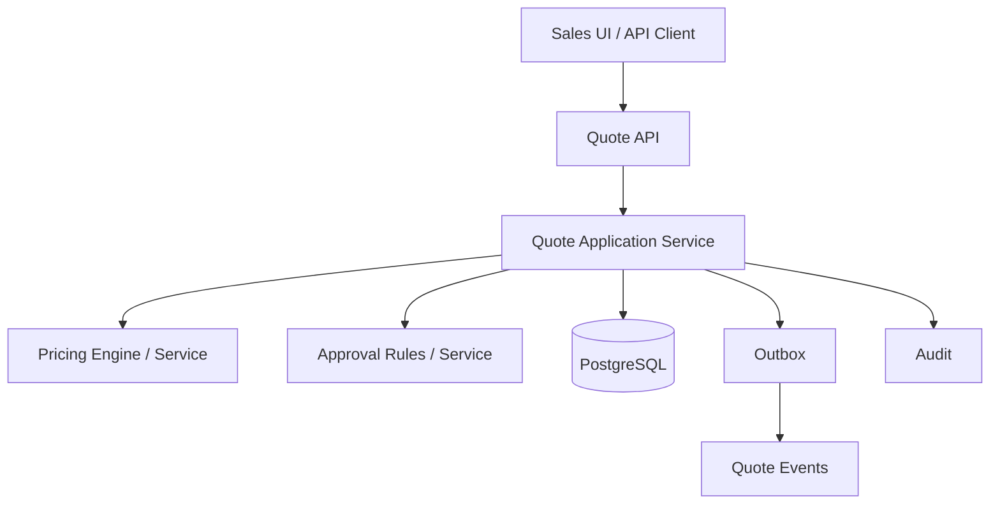

# Part 036 — Capstone 1: Scrum Playbook for a CPQ Feature

## 1. Source notes and scope boundary

This capstone applies the earlier Scrum engineering material to one realistic CPQ feature.

Public references:

- Scrum Guide: Scrum is based on empiricism and lean thinking; Scrum events enable inspection and adaptation; Product Backlog, Sprint Backlog, and Increment each have commitments.
- Scrum.org material on Product Backlog refinement, Sprint Planning, Sprint Review, Definition of Done, and evidence-based management.
- Previous series material on CSG Quote & Order context, CPQ, catalog-driven architecture, Java services, Kafka, PostgreSQL, security, observability, testing, and operational readiness.

This part does **not** assume the exact internal CSG product flow, repository structure, team process, customer commitment, or feature flag system.

Treat this as a playbook to adapt, not as a claim about internal implementation.

---

## 2. Capstone feature scenario

We will use this example feature throughout the part:

> **Feature:** Enterprise discount approval for configured quotes.
>
> Sales users can apply enterprise discounts during quote creation. Discounts below threshold are allowed automatically. Discounts above threshold require approval by an authorized approver. If the quote price, discount, or quote items change after approval, the approval must be invalidated and requested again. Accepted quotes must preserve approved commercial terms and audit evidence.

This feature touches many CPQ surfaces:

- quote creation,
- product configuration,
- pricing,
- discount rules,
- approval threshold,
- authorization,
- audit,
- quote versioning,
- quote acceptance,
- quote-to-order conversion,
- API contract,
- persistence,
- events,
- observability,
- Sprint Review evidence.

It is a good capstone because it looks like a business feature but hides architecture and production risk.

---

## 3. Product Goal alignment

Before refinement, ask how the feature connects to Product Goal.

Weak framing:

> Add enterprise discount approval.

Better framing:

> Improve enterprise sales quote governance by allowing controlled discounting while preserving margin approval evidence and quote acceptance integrity.

This framing reveals the real value:

- faster enterprise quoting,
- controlled discount authority,
- reduced manual approval friction,
- defensible audit evidence,
- safer conversion from quote to order.

### 3.1 Product Goal questions

Ask Product Owner/domain SME:

- Which customer segment needs this?
- What business problem exists today?
- What manual workaround exists?
- What risk does approval prevent?
- What discount thresholds matter?
- Who can approve?
- Is maker-checker required?
- What must audit prove?
- Is this cloud-only or on-prem/customer-specific?
- Is the feature needed for a committed customer release?

### 3.2 Senior engineer contribution

The senior engineer should translate this into risk-aware backlog language.

Example:

> This is not only a UI discount field. It changes pricing, approval authority, quote versioning, acceptance rules, audit evidence, and likely API contract. We should split it into safe increments and decide which path must be production-ready before enablement.

---

## 4. Discovery and current-state mapping

Before writing stories, map current behavior.

### 4.1 Current-state questions

- How are discounts represented today?
- Are discounts line-level, quote-level, or both?
- Are discounts percentage, amount, or agreement-derived?
- Where is pricing calculated?
- Where is quote price snapshot stored?
- Does quote version change on price/discount/item edit?
- Is approval already implemented for any scenario?
- How is approver authority represented?
- How is quote acceptance validated?
- What audit events exist?
- What API/event contracts expose discount/approval state?

### 4.2 Current-state artifact

Create a lightweight map:



Replace names with actual internal components after verification.

### 4.3 Discovery output

A discovery output should include:

- current flow,
- unknowns,
- affected services,
- affected tables,
- affected APIs/events,
- existing tests,
- known production risks,
- proposed slicing strategy.

If discovery produces only vague notes, it is not done.

---

## 5. Backlog refinement

The Product Backlog should not contain one giant item:

> Implement enterprise discount approval.

That hides too much risk.

Instead, break into a capability map.

### 5.1 Capability map

| Capability | Risk |
|---|---|
| Capture discount request | API/UI contract and validation |
| Calculate price with discount | pricing correctness and rounding |
| Determine approval requirement | business rule and authority threshold |
| Submit quote for approval | lifecycle transition |
| Approve/reject discount | authorization and audit |
| Invalidate approval after quote change | commercial correctness |
| Accept approved quote | state machine and idempotency |
| Preserve approval evidence in quote-to-order | audit/contract integrity |
| Emit events | compatibility and downstream behavior |
| Observe/report failures | operational readiness |

### 5.2 Refinement questions by dimension

#### Business behavior

- What discount types are supported?
- What thresholds apply?
- Are thresholds tenant/customer/product-specific?
- Can discounts stack with agreement pricing?
- Can approver modify discount or only approve/reject?
- What happens when quote expires?

#### Lifecycle

- Which quote states allow discount edit?
- Which quote states allow approval request?
- Does approval create a new quote version?
- What invalidates approval?
- Can accepted quote be modified?

#### Authorization

- Who can request discount?
- Who can approve?
- Can creator approve own quote?
- Are approver limits monetary, percentage-based, role-based, or account-based?

#### Data

- Where is discount stored?
- Where is approval stored?
- Does approval reference quote version/hash?
- Is migration needed?
- Are historical quotes affected?

#### API/event

- Are fields additive?
- Do public customers see approval status?
- Are Kafka events needed?
- Are existing consumers affected?

#### Observability/support

- How will support see why quote requires approval?
- How will support see who approved?
- What metrics indicate approval failures?
- What audit is required?

---

## 6. Story slicing

A safe slice sequence might look like this.

### Slice 1 — Internal discount model and validation

Goal:

- represent discount request safely without exposing full workflow.

Possible PBI:

> As a sales user, I can include a discount request in a draft quote, and the system validates basic discount format/range without changing approval or acceptance behavior.

Acceptance criteria:

- draft quote accepts supported discount format,
- invalid discount is rejected with machine-readable error,
- discount is persisted with quote version,
- tenant isolation preserved,
- audit/logging does not expose sensitive margin data incorrectly,
- tests cover invalid values.

### Slice 2 — Pricing calculation with discount

Goal:

- price quote with discount while preserving totals and rounding.

PBI:

> As a sales user, I can calculate quote price with a supported discount, and totals reconcile with quote line items.

Acceptance criteria:

- line totals + quote total reconcile,
- recurring/non-recurring handling correct,
- rounding rules verified,
- agreement pricing interaction defined,
- pricing snapshot stored,
- pricing regression tests added.

### Slice 3 — Approval requirement detection

Goal:

- determine when approval is required.

PBI:

> As a sales user, when requested discount exceeds my threshold, the quote is marked as requiring approval before acceptance.

Acceptance criteria:

- below threshold: no approval required,
- above threshold: approval required,
- threshold is based on trusted server-side authority,
- quote cannot be accepted while approval required,
- audit/metric created for approval-required transition.

### Slice 4 — Approval/rejection action

Goal:

- authorized approver can approve or reject.

PBI:

> As an authorized approver, I can approve or reject a discount request and the system records decision evidence.

Acceptance criteria:

- unauthorized user cannot approve,
- approver threshold enforced,
- maker-checker rule enforced if applicable,
- approval reason captured if required,
- audit event records actor/authority/reason,
- quote state changes predictably.

### Slice 5 — Approval invalidation

Goal:

- preserve correctness when quote changes after approval.

PBI:

> If a quote's price, discount, or quote items change after approval, approval is invalidated and quote cannot be accepted until reapproved.

Acceptance criteria:

- price change invalidates approval,
- discount change invalidates approval,
- item add/remove/change invalidates approval,
- non-commercial note change does not invalidate if policy says so,
- audit records invalidation reason,
- stale approval cannot be reused.

### Slice 6 — Quote acceptance and order conversion

Goal:

- accepted quote preserves approved terms.

PBI:

> A quote requiring approval can be accepted only after valid approval, and quote-to-order conversion preserves approved commercial terms.

Acceptance criteria:

- valid approval required,
- quote acceptance idempotent,
- accepted quote snapshot immutable,
- order references accepted quote version,
- audit event exists,
- event emitted if required.

### Slice 7 — Production readiness and enablement

Goal:

- enable feature safely.

PBI:

> The enterprise discount approval feature is observable, documented, supportable, and safely enabled for selected tenants.

Acceptance criteria:

- dashboard/metrics available,
- support view/runbook updated,
- feature flag default verified,
- tenant enablement process defined,
- release note prepared,
- rollback/disable plan documented.

---

## 7. Sprint Planning approach

Do not plan all slices blindly.

Plan based on Sprint Goal.

### 7.1 Example Sprint Goal 1

> Establish safe backend support for discount capture and pricing calculation without enabling approval workflow.

Candidate PBIs:

- Slice 1: internal discount model and validation,
- Slice 2: pricing calculation with discount,
- technical PBI: add regression test fixture for enterprise agreement pricing,
- documentation PBI: update domain glossary around discount types.

Do not include approval UI if backend pricing behavior is still uncertain.

### 7.2 Example Sprint Goal 2

> Make approval requirement and approval decision enforceable for quote acceptance.

Candidate PBIs:

- Slice 3: approval requirement detection,
- Slice 4: approval/rejection action,
- Slice 5 partial: invalidation for discount change only,
- testing PBI: authorization matrix tests.

### 7.3 Example Sprint Goal 3

> Enable approved discount quotes to become orders with audit and operational evidence.

Candidate PBIs:

- Slice 5 completion,
- Slice 6: quote acceptance/order conversion,
- Slice 7: production readiness,
- E2E evidence demo.

---

## 8. Definition of Done for the feature

A CPQ feature like this is not done when UI field appears.

### 8.1 Domain DoD

- discount rules implemented server-side,
- quote lifecycle transitions legal,
- approval requirement enforced,
- stale approval invalidated,
- quote acceptance guarded,
- quote-to-order conversion preserves terms.

### 8.2 API DoD

- request/response contract updated,
- error model documented,
- OpenAPI updated if applicable,
- backward compatibility reviewed,
- generated clients or examples updated if applicable.

### 8.3 Data DoD

- schema migration safe,
- historical quotes behavior defined,
- quote versioning/snapshot tested,
- indexes reviewed if query path changes,
- data repair/migration not needed or documented.

### 8.4 Security/audit DoD

- authorization tested,
- maker-checker tested if applicable,
- tenant isolation tested,
- audit event for approval/rejection/invalidation/acceptance,
- sensitive pricing/margin data redacted where required.

### 8.5 Testing DoD

- unit tests for rules,
- integration tests for persistence/transaction,
- authorization tests,
- API contract tests,
- E2E journey for approved quote acceptance,
- negative test for stale approval,
- duplicate accept/idempotency test if relevant.

### 8.6 Observability DoD

- structured logs include quote ID/correlation ID,
- metrics for approval required/approved/rejected/invalidated,
- dashboard panel or query for stuck approval quotes,
- support runbook updated.

### 8.7 Release DoD

- feature flag strategy defined,
- rollout scope defined,
- rollback/disable path defined,
- release note drafted,
- Sprint Review evidence prepared.

---

## 9. Implementation execution inside Sprint

### 9.1 Keep PRs aligned to slices

Bad PR:

- 2,000 lines touching UI, pricing, approval, order conversion, migration, events, and dashboards.

Better PR sequence:

1. data model + validation,
2. pricing calculation + tests,
3. approval requirement rule,
4. approval command + authorization,
5. invalidation logic,
6. acceptance guard,
7. observability/runbook.

### 9.2 Daily Scrum signals

During Sprint, raise:

- rule ambiguity,
- test fixture missing,
- approval authority uncertainty,
- pricing disagreement,
- migration risk,
- API contract issue,
- PR review bottleneck,
- unexpected customer-specific behavior.

Do not wait for Sprint Review to reveal that the acceptance path is unsafe.

### 9.3 Pairing opportunities

Good pairing points:

- pricing rule interpretation with domain SME,
- approval authorization with security-aware engineer,
- quote versioning with senior domain owner,
- migration with DB/platform owner,
- E2E journey with QA.

---

## 10. Testing strategy for the capstone

### 10.1 Unit tests

Test:

- discount threshold below/above,
- unsupported discount type,
- rounding,
- approval required decision,
- invalidation conditions,
- acceptance guard.

### 10.2 Integration tests

Test:

- discount persisted with quote version,
- approval decision persisted transactionally,
- audit/outbox writes in same transaction if applicable,
- stale approval cannot be used after quote update,
- tenant isolation in approval lookup.

### 10.3 Contract/API tests

Test:

- API error for approval required,
- API error for unauthorized approval,
- response shape compatibility,
- enum expansion compatibility,
- error code stability.

### 10.4 E2E tests

Journey:

1. Sales user creates quote with high discount.
2. System marks approval required.
3. Sales user cannot self-approve if policy forbids.
4. Authorized approver approves.
5. Sales user changes discount.
6. Approval is invalidated.
7. Sales user re-requests approval.
8. Approver approves.
9. Sales user accepts quote.
10. Order is created once.
11. Audit and events exist.

This is a high-value E2E test because it crosses business, authorization, lifecycle, data, and audit boundaries.

---

## 11. Sprint Review as evidence demo

The Sprint Review should show evidence, not just a screen.

### 11.1 Demo structure

1. Product context: why feature matters.
2. Business scenario: enterprise discount quote.
3. Happy path: discount below threshold.
4. Approval path: discount above threshold.
5. Negative path: unauthorized approval denied.
6. Safety path: quote change invalidates approval.
7. Acceptance path: approved quote becomes order.
8. Evidence: audit, metrics, logs, tests.
9. Remaining work: rollout/support/on-prem if any.

### 11.2 Evidence artifacts

Bring:

- test result summary,
- API examples,
- audit event sample,
- metric/dashboard screenshot or query,
- release readiness note,
- known limitation list.

### 11.3 Stakeholder questions to answer

Product Owner:

- Does behavior match intended customer workflow?
- Which scope remains?

QA:

- Which negative paths are covered?
- Which exploratory paths remain?

Support:

- How do we diagnose stuck approvals?
- Where is approval evidence visible?

Security/compliance:

- Who can approve?
- Is maker-checker enforced?
- Is audit complete?

Architecture/platform:

- Is data/event/API compatibility safe?
- Is rollout controlled?

---

## 12. Release planning and enablement

This feature should likely be enabled gradually.

### 12.1 Release states

| State | Meaning |
|---|---|
| code merged | implementation exists |
| deployed | service version running |
| flag available | feature can be enabled |
| internal tenant enabled | team can validate in controlled environment |
| pilot tenant enabled | limited customer/user scope |
| broadly enabled | default behavior for target users |

Do not confuse these states.

### 12.2 Rollout checklist

- feature flag default safe,
- tenant enablement controlled,
- approval thresholds configured,
- support docs available,
- dashboard available,
- rollback/disable path tested,
- customer communication prepared if needed,
- on-prem configuration/upgrade path understood.

---

## 13. Retrospective and learning

After delivering the feature, inspect process quality.

Ask:

- Did refinement discover key risks early?
- Did story slicing reduce risk?
- Did estimates reflect uncertainty?
- Did tests happen inside Sprint?
- Did PR reviews catch meaningful issues?
- Did Sprint Review create useful feedback?
- Did any production readiness work arrive too late?
- Which DoD item should be improved?
- Which reusable pattern can be documented?

A strong retrospective turns one feature into better future delivery.

---

## 14. Capstone templates

### 14.1 CPQ feature refinement template

```md
# Feature: <name>

## Product value

## Actors

## Business rules

## Lifecycle states affected

## Pricing/catalog impact

## Approval/authorization impact

## API impact

## Event impact

## Data/migration impact

## Audit/observability impact

## Testing strategy

## Slicing proposal

## Open questions
```

### 14.2 CPQ Sprint Planning checklist

```md
## Sprint Goal

## PBIs selected

## Protected invariants

## Risks accepted

## Dependencies

## Test strategy

## Review ownership

## Demo evidence

## Release/readiness expectation
```

### 14.3 CPQ Sprint Review evidence checklist

```md
- Business behavior demo
- Negative path demo
- API example
- Audit evidence
- Test evidence
- Metrics/log evidence
- Known limitation
- Follow-up backlog
```

---

## 15. Anti-patterns in CPQ Scrum execution

### 15.1 UI-first illusion

Adding a discount field in UI creates the illusion of progress while backend lifecycle, pricing, approval, audit, and order conversion remain unsafe.

### 15.2 One giant approval story

A story that includes all approval behavior hides too much risk and blocks inspection.

### 15.3 Approval as workflow only

Approval is not just a task assignment workflow.

It is commercial authority and audit evidence.

### 15.4 Pricing test only happy path

Discount features need threshold, boundary, rounding, agreement, invalidation, and stale price tests.

### 15.5 Done but not enabled

If a feature cannot be safely enabled, it is not truly done unless the Sprint Goal was explicitly deploy-only or discovery-only.

### 15.6 Sprint Review without evidence

A UI demo that does not show audit, negative path, and readiness evidence is incomplete for this feature class.

---

## 16. Internal verification checklist

Verify these with your actual CSG team:

- Are discounts supported today?
- Where are discount rules implemented?
- Where is pricing calculated?
- How are quote versions represented?
- How is approval represented?
- Is maker-checker required?
- What authorization model controls approvers?
- Which API exposes quote approval state?
- Which events are emitted for quote approval/acceptance?
- What audit events exist?
- What feature flag system exists?
- How are customer-specific thresholds configured?
- Is this cloud-only or on-prem relevant?
- Which QA tests already cover CPQ approval?
- Which dashboards show quote approval failures?
- How would support repair a stuck approval?

---

## 17. Practical exercise

Take a real or hypothetical CPQ feature from your backlog.

Create:

1. Product value statement.
2. Capability map.
3. Risk map.
4. Slice sequence.
5. Sprint Goal for first slice.
6. Acceptance criteria for first two PBIs.
7. Definition of Done additions.
8. Test strategy.
9. Sprint Review evidence plan.
10. Release readiness checklist.

Then ask:

- Which risk did we discover late?
- Which slice is too large?
- Which acceptance criterion is vague?
- Which stakeholder should be involved earlier?
- Which production signal is missing?

---

## 18. Summary

A CPQ feature in an enterprise Quote & Order product is rarely just a UI or API change.

It often touches:

- product configuration,
- pricing,
- discount policy,
- approval authority,
- quote lifecycle,
- order conversion,
- data model,
- API/event contracts,
- security,
- audit,
- observability,
- release readiness.

Scrum helps when it is used as an empirical engineering operating system:

- refine for clarity,
- slice for value and risk,
- plan around a Sprint Goal,
- execute with daily risk synchronization,
- keep testing inside the Sprint,
- review with evidence,
- retrospect for systemic improvement.

The senior engineer's job is to make hidden CPQ risk visible early enough that the team can deliver safely.
