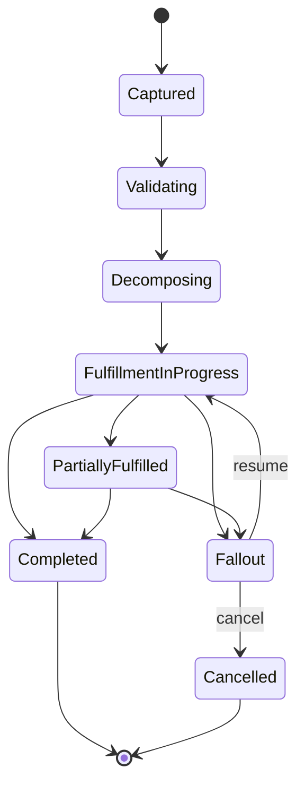

# Part 037 — Capstone 2: Scrum Playbook for an Order Management Feature

## 1. Source notes and scope boundary

This part uses public Scrum concepts, public software-delivery practice, and the domain model from the previous CSG Quote & Order series.

Public references to verify independently:

- Scrum Guide: Sprint, Sprint Planning, Daily Scrum, Sprint Review, Retrospective, Product Backlog, Sprint Backlog, Increment, Sprint Goal, Definition of Done.
- Scrum.org guidance on Sprint Planning, Daily Scrum, Sprint Review, and empirical process control.
- Prior engineering concepts in this series: Definition of Done, production readiness, PR review, dependency management, release planning, incidents, and technical decision-making.

This part does **not** assume CSG's actual order management service names, fulfillment systems, Kafka topic names, state names, Jira workflow, Sprint cadence, or internal release process.

Use this as a playbook template. Replace every example with the real internal names after verifying them.

---

## 2. Capstone scenario

Feature example:

> Add controlled partial fulfillment fallout handling for product orders so that when one order item fails fulfillment while other items succeed, the order remains operationally actionable, support can resume the failed item safely, downstream systems receive correct events, and the customer-facing status remains consistent.

This is intentionally more complex than a simple CRUD feature.

It touches:

- order lifecycle;
- order item lifecycle;
- decomposition;
- fulfillment adapter;
- async callback handling;
- Kafka events;
- PostgreSQL state;
- idempotency;
- audit;
- support workflow;
- observability;
- Sprint Review evidence;
- production readiness.

This is the kind of feature where Scrum can either help the team learn safely in increments, or degrade into ticket movement without real delivery confidence.

---

## 3. Why order management work is uniquely hard

Order management is hard because it is a long-running business process.

A quote can often be reasoned about as a bounded commercial proposal. An order, however, becomes a distributed workflow across fulfillment, inventory, billing, customer communication, support, and external partner systems.

Common failure modes:

- order created twice after quote acceptance retry;
- order item state diverges from parent order state;
- fulfillment callback arrives twice;
- fulfillment callback arrives out of order;
- one item fails and parent order is incorrectly completed;
- cancellation races with fulfillment completion;
- support resumes failed item and creates duplicate downstream task;
- Kafka event emitted before transaction commit;
- read model shows complete while source of truth still in progress;
- audit cannot reconstruct who resumed fallout;
- customer sees wrong status;
- billing receives completion event for incomplete order.

A Scrum plan for order management must therefore include both product behavior and operational behavior.

---

## 4. Product Goal and Sprint Goal framing

A weak Product Goal framing:

> Improve order management.

A stronger Product Goal framing:

> Enable reliable handling and recovery of partially fulfilled product orders so customers and support teams can see accurate order status and resume failed fulfillment safely.

A weak Sprint Goal:

> Finish fallout tickets.

A stronger Sprint Goal:

> Deliver a first production-ready slice of partial fulfillment fallout handling for one supported order type, including state transition safeguards, support-visible status, audit, event emission, and operational observability.

The Sprint Goal should express a coherent outcome, not a list of implementation tasks.

---

## 5. Stakeholder map

Order management work often crosses many stakeholders.

| Stakeholder | Concern | What they need from the team |
|---|---|---|
| Product Owner | customer/support value | clear behavior and release scope |
| QA | testable scenarios | deterministic data and acceptance criteria |
| Fulfillment team | integration semantics | callback contract and retry policy |
| Platform/SRE | runtime safety | dashboard, alert, runbook, rollback plan |
| Support | operational recovery | readable state, reason codes, repair/resume path |
| Security/compliance | audit and authority | actor, reason, tenant scope, privileged action audit |
| Architecture | lifecycle consistency | state model, event model, backward compatibility |
| Customer-facing team | impact and messaging | known limitations and expected behavior |

A senior engineer should make this map visible during refinement.

---

## 6. Discovery questions before refinement

Before splitting stories, ask:

### 6.1 Domain questions

- What does `partial fulfillment` mean in business language?
- Is it customer-visible or support-only?
- Can one failed item block the whole order?
- Can successful items remain fulfilled while failed items are retried?
- Does cancellation affect all items or only failed items?
- Are there order types where partial fulfillment is not allowed?
- What is the difference between `failed`, `fallout`, `held`, `in progress`, `completed`, and `cancelled`?

### 6.2 State machine questions

- What are valid order states?
- What are valid order item states?
- Is parent state derived from child states or independently persisted?
- Which transitions are terminal?
- Which transitions are reversible?
- Which actor can trigger each transition?
- Which transition must emit events?
- Which transition requires audit?

### 6.3 Integration questions

- Which downstream fulfillment system sends callbacks?
- Are callbacks idempotent?
- Can callbacks arrive out of order?
- What identifiers correlate downstream tasks to order items?
- What is the retry policy?
- What happens if downstream accepts request but callback never arrives?
- Is there a DLQ or manual replay path?

### 6.4 Data questions

- Which tables represent order, item, task, event, audit, and history?
- Are state transitions versioned?
- Are there unique constraints preventing duplicate task creation?
- Does tenant ID exist on all relevant rows?
- Are old orders compatible with new fallout state?
- Is a migration required?

### 6.5 Operations questions

- How does support find a stuck order today?
- What dashboard shows order fallout?
- What alert exists for long-running orders?
- How is data repaired today?
- Is there a safe resume command?
- What runbook exists?

---

## 7. Refinement output

By the end of refinement, the team should have:

- clear user/business behavior;
- state transition diagram;
- affected APIs/events;
- affected database tables;
- migration/backward compatibility plan;
- test strategy;
- observability plan;
- support workflow;
- release strategy;
- known risks;
- candidate story slices.

If refinement produces only estimates, it failed.

Refinement should reduce uncertainty.

---

## 8. State model artifact

Create a lightweight state model before committing.

Example:



Questions:

- Are these actual internal state names?
- Which states are header-level vs item-level?
- Which states are derived?
- Which states are externally visible?
- Which states map to TMF/product-order status if applicable?
- Which states are support-only?

Do not treat this diagram as implementation truth until verified.

---

## 9. Story slicing strategy

Avoid layer-only slicing:

- story 1: add database column;
- story 2: add backend logic;
- story 3: add UI;
- story 4: add tests;
- story 5: add dashboard.

This produces no usable increment until the end.

Prefer behavior slices.

### Slice 1 — Detect and persist item-level fulfillment failure

Outcome:

- when fulfillment callback reports item failure, system persists item failure state and reason code.

Includes:

- callback validation;
- idempotency check;
- order item state update;
- state history;
- audit event;
- basic metric/log;
- tests.

Excludes:

- support resume UI;
- customer notification;
- billing integration;
- broad order type support.

### Slice 2 — Derive parent order fallout/partial state

Outcome:

- parent order state reflects mixed item outcomes safely.

Includes:

- aggregation rule;
- concurrency guard;
- illegal transition tests;
- event emission;
- read API update;
- audit.

### Slice 3 — Support-visible reason and search filter

Outcome:

- support can find orders needing action.

Includes:

- API filter;
- reason code;
- query/index review;
- UI/read-model if applicable;
- operational dashboard.

### Slice 4 — Resume failed item safely

Outcome:

- authorized support/order manager can resume failed item without duplicating successful work.

Includes:

- permission check;
- resume command;
- idempotency key;
- downstream task correlation;
- audit reason;
- duplicate resume test.

### Slice 5 — Release hardening and broader order types

Outcome:

- expand from one order type to supported variants.

Includes:

- customer-specific cases;
- performance check;
- on-prem upgrade note;
- runbook;
- Sprint Review evidence.

Each slice should be potentially shippable or at least deployable behind a feature flag.

---

## 10. Product Backlog Item template

Use this template for each slice.

```md
# PBI: <behavior outcome>

## Business outcome
What user/customer/support/product outcome becomes possible?

## Scope
Included:
- ...

Excluded:
- ...

## Domain rules
- ...

## State transitions
- from:
- to:
- actor:
- reason:
- invalid transitions:

## API/event impact
- REST:
- Kafka:
- external callback:

## Data impact
- tables:
- migration:
- compatibility:

## Security/audit
- permission:
- tenant scope:
- audit event:

## Observability
- logs:
- metrics:
- dashboard:
- alert/runbook:

## Acceptance criteria
- ...

## Test evidence
- unit:
- integration:
- contract:
- E2E:
- exploratory:

## Risks/open questions
- ...
```

This makes the work visible as engineering work, not just a ticket title.

---

## 11. Sprint Planning for the first slice

Suppose the team chooses Slice 1.

Sprint Goal:

> Safely detect and persist item-level fulfillment failure for one supported order type, with idempotent callback handling and basic operational evidence.

Candidate Sprint Backlog:

1. Clarify callback failure contract with fulfillment owner.
2. Add characterization test for current callback behavior.
3. Add item failure reason model if not present.
4. Implement idempotent callback update path.
5. Persist state history/audit.
6. Emit/avoid event based on agreed contract.
7. Add mapper integration tests.
8. Add metric/log field.
9. Update runbook note.
10. Prepare Sprint Review evidence.

Capacity questions:

- Is a fulfillment owner available?
- Is test environment stable?
- Is migration needed?
- Is there production support load this Sprint?
- Which item is the riskiest?
- What can be cut while preserving Sprint Goal?

---

## 12. Definition of Done for this feature

For each slice, Done should include:

### 12.1 Domain Done

- state transition rule implemented;
- invalid transitions tested;
- parent/child consistency tested;
- duplicate callback behavior tested;
- failure reason code defined;
- existing orders remain compatible.

### 12.2 API/Event Done

- API response behavior documented;
- event schema compatible;
- callback contract verified;
- idempotency behavior explicit;
- error model stable.

### 12.3 Data Done

- migration is backward compatible;
- tenant filter preserved;
- indexes reviewed for new query path;
- repair/reconciliation implications understood;
- state history/audit persisted if required.

### 12.4 Security/Audit Done

- resume/support actions permissioned;
- tenant isolation tested;
- audit event includes actor, reason, order ID, item ID, previous/new state;
- sensitive data not logged.

### 12.5 Observability Done

- structured logs contain correlation/order/item IDs;
- metric exists for fulfillment item failure;
- dashboard/watch query exists;
- runbook updated for first-line diagnosis.

### 12.6 Test Done

- unit tests for transition rules;
- integration tests for DB state;
- callback idempotency tests;
- contract tests if callback/event schema changed;
- one E2E or workflow test for selected order type;
- regression test for duplicate callback.

---

## 13. Daily Scrum signals

During the Sprint, Daily Scrum should inspect progress toward the Sprint Goal.

Good signals:

- callback contract is still unclear;
- migration is larger than expected;
- test environment cannot simulate failed callback;
- PR is blocked on architecture review;
- downstream team found a different failure code;
- item state update works but parent aggregation is unsafe;
- duplicate callback test exposed idempotency bug.

Weak signals:

- I worked on the backend yesterday;
- I will continue today;
- no blockers.

Senior engineer contribution:

- surface hidden dependency;
- propose smaller slice;
- call out Sprint Goal risk;
- help unblock review;
- protect quality when deadline pressure appears.

---

## 14. PR strategy

Do not make one huge PR.

Recommended PR sequence:

1. Characterization tests for current behavior.
2. State model/test fixture update.
3. Callback validation/idempotency logic.
4. Persistence/state history/audit update.
5. Event/observability update.
6. Runbook/doc update.

Each PR should include:

- risk explanation;
- test evidence;
- migration impact;
- rollout impact;
- review focus requested.

Example PR description:

```md
## What changed
Adds idempotent handling for fulfillment item failure callback for order type X.

## Why
Prevents duplicate callbacks from creating inconsistent item state and prepares first slice of fallout handling.

## Risk
Touches order item state transition and fulfillment callback path.

## Safeguards
- Duplicate callback test.
- Invalid transition test.
- Mapper integration test.
- Audit assertion.

## Not included
- Resume command.
- UI/search filter.
- Additional order types.
```

---

## 15. Testing plan

### 15.1 Unit tests

Test:

- valid item failure transition;
- invalid transition from terminal completed state;
- duplicate failure callback;
- failure then success callback policy;
- parent state derivation rule;
- reason code mapping.

### 15.2 Integration tests

Test with real database behavior:

- state update and history in one transaction;
- optimistic locking/version conflict;
- tenant predicate;
- idempotency record;
- outbox row creation or non-creation;
- query performance for support filter.

### 15.3 Contract tests

If callback or event schema changes:

- old callback payload still accepted if supported;
- new failure reason is compatible;
- event schema passes compatibility;
- generated client/consumer fixtures still work.

### 15.4 Workflow/E2E tests

Scenario:

1. Create product order for supported order type.
2. Decompose order.
3. Simulate success for item A.
4. Simulate failure for item B.
5. Assert parent state.
6. Assert support-visible reason.
7. Assert audit/event/metrics.
8. Send duplicate failure callback.
9. Assert no duplicate side effect.

---

## 16. Sprint Review as evidence demo

Do not demo only UI.

Demo evidence:

- order before callback;
- fulfillment failure callback payload;
- order item state after callback;
- parent order state;
- audit entry;
- event emitted or intentionally not emitted;
- structured log/correlation ID;
- metric/dashboard panel;
- duplicate callback behavior;
- known limitations and next slice.

Stakeholder framing:

- Product Owner: support can now identify one class of failed fulfillment.
- QA: deterministic scenario exists for regression.
- Support: reason code and order lookup are visible.
- Platform/SRE: signal exists for fallout growth.
- Architecture: state transition and idempotency are controlled.

---

## 17. Retrospective focus

After the Sprint, inspect:

- Did the slice stay coherent?
- Did refinement miss a dependency?
- Did callback contract ambiguity delay work?
- Did PR size slow review?
- Did tests catch unexpected behavior?
- Did the Sprint Goal remain meaningful?
- Was the demo evidence useful?
- What should be added to the Definition of Done for future order work?

Possible improvement actions:

- create order state transition checklist;
- build fulfillment simulator fixture;
- add dashboard panel for stuck item state;
- document callback idempotency policy;
- add story template for order lifecycle PBIs.

---

## 18. Release planning

Order management features may need staged rollout.

Options:

- deploy behind feature flag;
- enable for one order type;
- enable for one tenant/customer group;
- run shadow detection before enforcement;
- first support-visible only, then customer-visible;
- no downstream side-effect until confidence established.

Release readiness questions:

- Are old in-flight orders compatible?
- Is feature flag state observable?
- Can it be disabled safely?
- Does rollback understand new state values?
- Are support runbooks ready?
- Is data repair path known?
- Is dashboard baseline known?

---

## 19. Production incident scenario

Assume after release, many orders enter fallout unexpectedly.

Immediate questions:

- Is this real failure or new detection of old failures?
- Which tenants/order types are affected?
- Did a downstream callback contract change?
- Did the new code misclassify transient errors as fallout?
- Is parent state derivation too aggressive?
- Are duplicate callbacks causing repeated fallout?
- Is there a feature flag to disable new behavior?
- Are support queues overwhelmed?

This scenario should be discussed before release, not after.

---

## 20. Internal verification checklist

Verify internally:

- actual order state names;
- order item state names;
- fulfillment adapter ownership;
- callback contract;
- retry policy;
- DLQ/replay path;
- outbox/inbox implementation;
- support workflow;
- order search/index path;
- audit requirements;
- tenant model;
- feature flag system;
- release process;
- customer/on-prem rollout constraints.

---

## 21. Senior engineer review checklist

When reviewing an order management PBI/PR:

- Is the lifecycle transition valid?
- Are parent and child states consistent?
- Is duplicate input safe?
- Is callback ordering handled?
- Is state persisted with history/audit?
- Is tenant isolation preserved?
- Are downstream side effects idempotent?
- Is Kafka event schema compatible?
- Are old in-flight orders compatible?
- Is support able to diagnose and recover?
- Is observability sufficient?
- Is rollout reversible or at least containable?
- Is data repair path known?

---

## 22. Summary

Order management work tests whether Scrum is functioning as an empirical delivery system.

A healthy Scrum team does not hide complexity until late integration. It makes complexity visible during refinement, slices work by behavior, protects the Sprint Goal, tests lifecycle invariants, demonstrates evidence in Sprint Review, and feeds operational learning into the backlog.

For senior engineers, the essential skill is not only implementing order logic.

It is shaping order work so that every Sprint reduces real production risk while delivering a coherent business capability.
