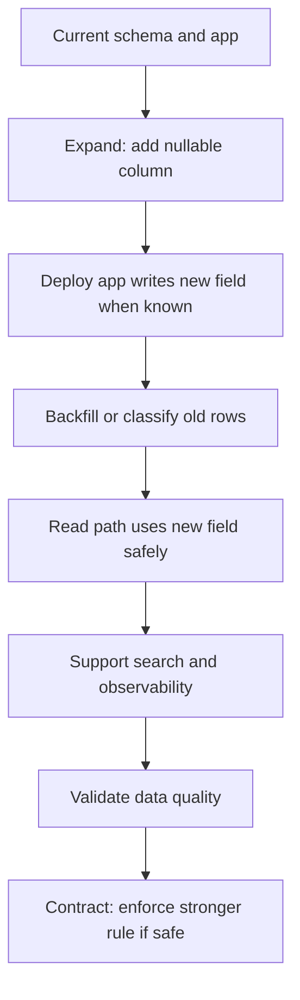

# Part 038 — Capstone 3: Scrum Playbook for Migration and Refactoring Work

## 1. Source notes and scope boundary

This part uses public Scrum concepts, Martin Fowler's public writing on legacy modernization/refactoring patterns, PostgreSQL documentation, and the prior engineering materials in this series.

Public references to verify independently:

- Scrum Guide: Increment, Definition of Done, Product Backlog, Sprint Backlog, Sprint Goal.
- Martin Fowler: Strangler Fig Application and Branch by Abstraction as incremental modernization techniques.
- PostgreSQL documentation: migration-sensitive operations such as index creation, locking, and transactional behavior.

This part does **not** assume CSG's actual migration tool, branching strategy, deployment topology, database size, release cadence, or internal refactoring governance.

Use this as a playbook template and validate every operational detail internally.

---

## 2. Core thesis

Migration and refactoring work belongs in Scrum.

But it must be expressed as product-relevant risk reduction, not hidden engineering preference.

A weak framing:

> Refactor order service.

A stronger framing:

> Reduce the risk of invalid order lifecycle transitions by routing all order state changes through a single transition boundary, while preserving existing API behavior and production compatibility.

A weak framing:

> Migrate database schema.

A stronger framing:

> Add backward-compatible order item failure reason storage so the team can support fallout handling without blocking writes during deployment or breaking old app versions.

Scrum can handle technical work when the team makes its value, risk, acceptance criteria, and Definition of Done explicit.

---

## 3. Why migration/refactoring work often fails in Scrum

Common failure modes:

- work is invisible because it is hidden inside feature tickets;
- work is too large and becomes a multi-Sprint black hole;
- Product Owner cannot see business value;
- team estimates by optimism rather than uncertainty;
- refactoring changes behavior unintentionally;
- migration breaks rolling deploy compatibility;
- tests are missing, so refactor confidence is low;
- cleanup never happens after branch-by-abstraction;
- old and new paths diverge for too long;
- Definition of Done lacks observability and rollback;
- Sprint Review cannot demonstrate value;
- technical debt is discussed only when feature work becomes impossible.

The solution is not to avoid technical work.

The solution is to convert technical work into safe incremental outcomes.

---

## 4. Capstone scenario A: database migration

Scenario:

> The order system needs to store item-level fallout reason codes. Existing orders and existing application versions do not have this field. The team must add the field, backfill where possible, update write/read paths, expose support search, and later enforce stronger invariants.

Risk:

- old app versions may not write the field;
- new app may assume field exists too early;
- large table migration may lock production;
- support search may need an index;
- old orders may have unknown reason;
- on-prem customers may upgrade from older versions;
- feature may emit new events before consumers are ready.

This is not one story.

It is a sequence.

---

## 5. Migration slicing with expand-contract

Use expand-contract thinking.

Candidate PBIs:

### PBI 1 — Expand schema safely

Outcome:

- database can store fallout reason code without requiring app behavior change.

Acceptance criteria:

- nullable column added;
- migration works on empty and previous-release DB;
- old application still starts and writes;
- no blocking lock risk for production-sized table;
- migration documented.

### PBI 2 — Write reason code for new failures

Outcome:

- new app writes reason code when fulfillment failure callback includes reason.

Acceptance criteria:

- valid reason persisted;
- unknown reason handled safely;
- duplicate callback idempotent;
- audit/log includes reason where allowed;
- old rows remain readable.

### PBI 3 — Support read/search

Outcome:

- support can filter by fallout reason.

Acceptance criteria:

- API filter added;
- tenant scope preserved;
- index/query plan reviewed;
- search result stable;
- dashboard updated.

### PBI 4 — Backfill/classify historical rows

Outcome:

- historical failed items are classified where evidence exists; unknowns remain explicit.

Acceptance criteria:

- dry run count;
- chunked backfill;
- idempotent;
- validation query;
- no tenant leakage;
- repair/audit record if required.

### PBI 5 — Strengthen invariant

Outcome:

- future failed item state requires reason code if business policy demands it.

Acceptance criteria:

- validation confirms no violating rows;
- app guards in place;
- optional DB constraint staged safely;
- rollback/roll-forward documented.

Each PBI is potentially valuable and inspectable.

---

## 6. Capstone scenario B: legacy refactoring

Scenario:

> Multiple services/classes update `order.status` directly. Some paths miss audit, some miss outbox event, and some skip invalid transition checks. The team wants to centralize order state transitions.

Risk:

- direct refactor may break many flows;
- behavior is not fully documented;
- old tests are weak;
- customer-specific paths may depend on quirks;
- state transitions are production-critical;
- change may span multiple Sprints.

This is a classic refactoring-in-Scrum problem.

---

## 7. Refactoring slicing strategy

Do not create one large story:

> Refactor order lifecycle.

Create a sequence of behavior-preserving slices.

### Slice 1 — Characterization tests

Outcome:

- current behavior is documented by tests.

Acceptance criteria:

- tests cover major direct status update paths;
- tests capture current audit/event behavior;
- tests include at least one customer-specific or edge path;
- no production behavior change.

### Slice 2 — Introduce transition boundary

Outcome:

- new `OrderLifecycleTransition` or equivalent abstraction exists without changing call sites.

Acceptance criteria:

- abstraction compiles;
- no behavior change;
- naming matches domain;
- tests prove current path unaffected.

### Slice 3 — Migrate one low-risk path

Outcome:

- one direct status mutation path uses transition boundary.

Acceptance criteria:

- behavior unchanged or explicitly improved;
- audit/event behavior verified;
- rollback is easy;
- PR small enough for focused review.

### Slice 4 — Migrate high-risk paths behind feature flag or guard

Outcome:

- critical paths move gradually with observability.

Acceptance criteria:

- flag or control plane if needed;
- comparison/logging for old vs new behavior;
- failure signal available;
- no broad cleanup yet.

### Slice 5 — Prevent regression

Outcome:

- new direct status mutations are prevented.

Acceptance criteria:

- review checklist;
- code search/static check if possible;
- tests;
- documentation;
- team agreement.

### Slice 6 — Cleanup old path

Outcome:

- old duplicated code removed after migration confidence.

Acceptance criteria:

- usage count zero;
- fallback not needed;
- telemetry confirms path unused;
- ADR/design doc updated.

---

## 8. Branch by abstraction in Scrum

Branch by abstraction is useful when a change is too large to complete safely in one branch or Sprint.

The pattern:

1. introduce abstraction around old behavior;
2. route existing behavior through abstraction;
3. implement new behavior behind abstraction;
4. switch callers gradually;
5. remove old implementation;
6. remove temporary abstraction if no longer needed.

Scrum fit:

- each step can be a Product Backlog Item;
- each Sprint can produce an Increment;
- Sprint Review can demonstrate risk reduction;
- Definition of Done can require cleanup tracking.

Anti-pattern:

- abstraction remains forever;
- both paths diverge;
- feature flag never removed;
- nobody owns cleanup.

---

## 9. Strangler-style modernization in Scrum

Strangler-style modernization is useful when replacing a deeply embedded legacy capability.

Example:

> Replace old order search implementation with a new indexed/search-optimized path.

Incremental path:

1. characterize existing API behavior;
2. add observability around query patterns;
3. build new read model in shadow;
4. compare old/new results for selected tenants;
5. route small read-only traffic;
6. expand traffic;
7. remove old path after confidence.

Scrum fit:

- each Sprint produces evidence;
- stakeholders see risk reduction;
- old behavior remains available until confidence is earned;
- migration is reversible at routing layer.

---

## 10. Refinement checklist for migration/refactoring work

Before Sprint Planning, answer:

### 10.1 Value

- What risk or future cost is reduced?
- Which product capability is enabled?
- Which incident/support pain does this address?
- What customer risk decreases?

### 10.2 Scope

- Which code paths are included?
- Which code paths are excluded?
- Which data is affected?
- Which deployment modes are affected?

### 10.3 Compatibility

- Can old app run with new schema?
- Can new app read old data?
- Can old consumers process new events?
- Can new consumers process old events?
- Can rollback work?

### 10.4 Testing

- What characterization tests exist?
- What integration tests prove behavior?
- What migration tests prove safety?
- What contract tests prove compatibility?
- What E2E test proves the journey?

### 10.5 Operations

- How will we detect failure?
- What dashboard changes are needed?
- What runbook changes are needed?
- What repair path exists?

---

## 11. Sprint Planning patterns

### Pattern 1 — Risk-first Sprint Goal

Weak Sprint Goal:

> Work on order lifecycle refactor.

Better Sprint Goal:

> Prove the new order transition boundary works for cancellation without changing external behavior, including audit and outbox consistency.

### Pattern 2 — Timeboxed discovery before commitment

If the team cannot estimate safely, create a spike:

- inspect call sites;
- classify direct mutations;
- identify unknown states;
- propose migration sequence;
- produce decision record.

The spike output must be a decision or plan, not merely learning.

### Pattern 3 — Small PR sequence

Migration/refactoring PRs should be small.

Example sequence:

1. tests only;
2. abstraction only;
3. one path moved;
4. observability;
5. second path moved;
6. cleanup.

This keeps review tractable and lowers merge risk.

---

## 12. Definition of Done for migration work

A migration PBI is Done only when:

- migration runs from supported previous version;
- migration runs on empty database;
- old app/new schema compatibility is known;
- new app/old data behavior is safe;
- lock/runtime risk is evaluated;
- rollback/roll-forward strategy documented;
- validation query exists;
- on-prem/customer upgrade impact considered;
- runbook/release note updated if needed.

For PostgreSQL specifically, consider:

- lock level;
- index creation strategy;
- concurrent index limitations;
- long transaction impact;
- table rewrite risk;
- statement/lock timeout;
- invalid index cleanup;
- replication lag if applicable.

---

## 13. Definition of Done for refactoring work

A refactoring PBI is Done only when:

- behavior-preserving intent is clear;
- characterization tests exist for affected behavior;
- migrated path has equivalent or improved behavior;
- old/new path divergence is controlled;
- observability exists for risky switch;
- feature flags/fallbacks are documented;
- cleanup work is tracked;
- team knows new extension point;
- no hidden public contract change occurred.

Refactoring is not Done if it simply creates a second implementation and leaves both forever.

---

## 14. Sprint Review for migration/refactoring

Migration/refactoring work can and should be demoed.

Evidence demo examples:

- show old and new tests passing;
- show before/after architecture diagram;
- show migration dry-run result;
- show query plan improvement;
- show feature flag state;
- show telemetry proving old path usage decreased;
- show no API/event contract change;
- show one risky path now goes through safer transition boundary;
- show rollback/roll-forward plan.

Stakeholder framing:

- Product Owner: this reduces risk of future order bugs and enables upcoming fallout feature.
- QA: regression suite now protects existing behavior.
- Support: state/audit consistency improves diagnosis.
- Architecture: lifecycle mutation boundary is now explicit.
- Platform/SRE: migration risk has been tested and observed.

---

## 15. Retrospective for technical work

Inspect:

- Was the technical work visible enough in backlog?
- Did stakeholders understand value?
- Was scope small enough?
- Did tests give confidence?
- Did PR review bottleneck?
- Did cleanup remain tracked?
- Did any hidden dependency appear?
- Did the work actually reduce future cost?

Possible retro actions:

- create migration PBI template;
- create refactoring checklist;
- add code search to prevent old pattern;
- add ADR cleanup policy;
- reserve capacity for debt repayment;
- improve Definition of Done.

---

## 16. Product Owner collaboration

Technical work needs product collaboration.

Do not say:

> We need two Sprints to refactor.

Say:

> The upcoming fallout feature requires safe order state transitions. Today, status changes happen in multiple paths and some do not consistently write audit/outbox. We can reduce this risk in three increments: characterization tests, transition boundary for cancellation, then transition boundary for fulfillment failure. This lowers risk for the feature and makes support diagnosis safer.

Product Owners can prioritize technical work when risk and enablement are visible.

---

## 17. Estimation under uncertainty

Migration/refactoring estimates should express uncertainty.

Use confidence bands:

- small known migration: 2–3 points;
- migration with lock uncertainty: spike first;
- refactor with unknown call sites: spike first;
- refactor with weak tests: add characterization tests before estimating full change;
- cross-service migration: break into discovery and executable slices.

Never hide uncertainty inside a large estimate.

Large estimate without clarity is often a warning sign.

---

## 18. Anti-patterns

### 18.1 The invisible refactor

Engineer changes large internals inside feature PR without making risk visible.

Problem:

- review is weak;
- Product Owner cannot plan risk;
- testing may be insufficient;
- rollback is harder.

### 18.2 The endless abstraction

Temporary abstraction never gets removed.

Problem:

- complexity increases;
- both paths diverge;
- future engineers do not know which path is authoritative.

### 18.3 The migration surprise

Schema change appears late in Sprint.

Problem:

- no lock analysis;
- no on-prem review;
- no rollback plan;
- release risk grows.

### 18.4 The hardening escape hatch

Team delays all testing and cleanup to a later hardening Sprint.

Problem:

- quality is not part of Increment;
- defects accumulate;
- release confidence becomes late and expensive.

### 18.5 The rewrite fantasy

Team wants a rewrite because legacy is painful.

Problem:

- domain behavior may not be fully understood;
- customer-specific edge cases are lost;
- release takes too long;
- new system repeats old mistakes.

---

## 19. Internal verification checklist

Verify internally:

- migration tool;
- supported previous versions;
- cloud vs on-prem upgrade path;
- release cadence;
- rollback policy;
- feature flag system;
- code ownership;
- architecture review process;
- ADR location;
- production database size;
- lock timeout defaults;
- slow query dashboard;
- data repair approval;
- refactoring policy;
- test coverage expectations;
- technical debt backlog.

---

## 20. Senior engineer checklist

For migration/refactoring PBIs, ask:

- What future risk is reduced?
- What product capability is enabled?
- Is this sliced into inspectable increments?
- Is behavior preserved or intentionally changed?
- Do characterization tests exist?
- Is compatibility maintained?
- Is migration safe for rolling deploy?
- Is on-prem impact known?
- Is cleanup tracked?
- Is there observability for the switch?
- Is rollback/roll-forward possible?
- Can Sprint Review demonstrate evidence?

---

## 21. Practical playbook: from debt to Sprint Backlog

Step 1 — Name the debt.

> Direct order status mutations bypass lifecycle guard.

Step 2 — State the risk.

> Some transitions may miss audit/outbox and allow invalid parent/child state.

Step 3 — Link to product outcome.

> Upcoming partial fallout handling depends on reliable transition semantics.

Step 4 — Split into PBIs.

- characterize current behavior;
- introduce transition boundary;
- migrate cancellation path;
- migrate fulfillment failure path;
- add prevention check;
- cleanup old direct writes.

Step 5 — Define evidence.

- tests;
- PR review;
- dashboard/logs;
- Sprint Review demo;
- reduced direct write count.

Step 6 — Track cleanup.

Debt repayment is incomplete until old risk is removed or accepted.

---

## 22. Summary

Migration and refactoring work can be excellent Scrum work when it is transparent, incremental, evidence-based, and connected to product risk.

The senior engineer's job is to translate technical debt and migration risk into backlog items that the whole Scrum Team can inspect, plan, deliver, and review.

Good migration/refactoring in Scrum has these properties:

- small slices;
- clear value;
- explicit risk;
- characterization tests;
- compatibility discipline;
- production readiness;
- Sprint Review evidence;
- cleanup ownership.

That is how enterprise teams modernize safely without stopping product delivery.
