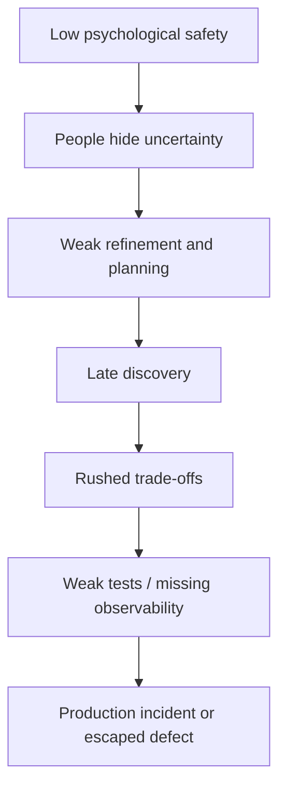
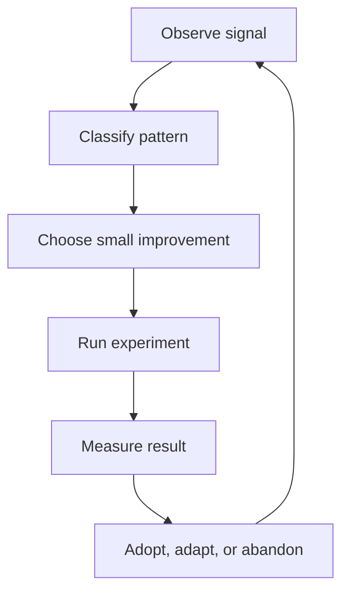

# Part 039 — Team Health, Continuous Improvement, and Engineering Culture

## 1. Source notes and scope boundary

This part uses public Scrum and team-effectiveness references, especially:

- The Scrum Guide and Scrum.org material on Scrum Values: Commitment, Focus, Openness, Respect, and Courage.
- Scrum.org material on Sprint Retrospective as the event for planning ways to increase quality and effectiveness.
- Google re:Work material on team effectiveness and psychological safety.
- Scrum with Kanban material on flow, WIP, and delivery predictability.
- Previous parts of this series on flow, metrics, PR review, retrospectives, production readiness, and senior engineer leverage.

This part does **not** assume CSG has a specific team health survey, engineering culture framework, manager rubric, retro format, psychological safety program, or official continuous-improvement process.

Use the `Internal verification checklist` sections to adapt this material to the actual CSG team context.

---

## 2. Core thesis

Engineering culture is not posters, slogans, or motivational language.

Engineering culture is the set of repeated behaviors that determine how the team handles pressure, ambiguity, defects, incidents, disagreement, review, learning, and accountability.

In a Scrum team working on enterprise Quote & Order systems, culture directly affects production quality.

A team with weak health will often show symptoms in technical systems:

- vague backlog items;
- rushed acceptance criteria;
- oversized stories;
- PRs that wait too long;
- brittle tests ignored as normal;
- Sprint Goals that nobody protects;
- production incidents treated as interruptions rather than learning signals;
- architecture disagreements hidden until late;
- support pain never translated into backlog improvement;
- technical debt discussed emotionally but not managed economically;
- engineers afraid to say “I do not understand this requirement”.

A healthy team does not mean a team without conflict.

A healthy team is one that can surface conflict, risk, and uncertainty early enough to adapt.

---

## 3. Scrum Values as engineering behavior

The Scrum Values are not abstract virtues.

They become real only when they change daily engineering behavior.

| Scrum Value | Weak interpretation | Strong engineering interpretation |
|---|---|---|
| Commitment | Promise all tickets will finish | Commit to Sprint Goal, quality, and transparency |
| Focus | Work alone on my assigned tickets | Limit WIP and focus on finishing valuable increments |
| Openness | Give status updates | Surface risk, uncertainty, blockers, and learning honestly |
| Respect | Be polite | Respect product, QA, support, platform, and legacy constraints |
| Courage | Work nights to hit deadline | Say no to unsafe shortcuts and expose hard truth early |

For a senior engineer, Scrum Values are operational tools.

Examples:

- **Commitment** means refusing to call a Kafka event change done without schema compatibility evidence.
- **Focus** means helping the team finish two valuable slices instead of starting eight half-done items.
- **Openness** means saying during Daily Scrum: “This migration risk is larger than we thought; Sprint Goal may need replanning.”
- **Respect** means asking why a legacy implementation exists before proposing a rewrite.
- **Courage** means telling stakeholders that a pricing change is not production-ready because approval invalidation is untested.

---

## 4. Team health as production risk control

Team health is often treated as soft.

In enterprise systems, it is hard risk management.

Low team health creates delayed information.

Delayed information creates late rework.

Late rework creates release risk.

Release risk creates production incidents.



A healthy Scrum team is not merely happier.

It is better at detecting reality.

---

## 5. Practical signs of healthy engineering culture

Look for observable behaviors.

### 5.1 During refinement

Healthy signs:

- engineers ask domain questions;
- Product Owner welcomes technical risk input;
- QA/test perspectives appear early;
- architecture unknowns become spikes;
- stories are split around business value and risk;
- assumptions are documented;
- dependencies are named.

Unhealthy signs:

- refinement is only estimation;
- people hesitate to ask basic domain questions;
- acceptance criteria are copied from vague customer language;
- engineers silently assume implementation details;
- no one asks about migration, observability, or rollback;
- all complexity is pushed into the Sprint.

### 5.2 During Sprint Planning

Healthy signs:

- Sprint Goal is clear;
- capacity includes review, testing, support, and incident load;
- team discusses risk before commitment;
- technical debt and production readiness are visible;
- work is sliced small enough to finish;
- dependencies have owners.

Unhealthy signs:

- team fills capacity to 100 percent;
- Sprint Goal is a list of tickets;
- known risks are ignored to preserve optimistic plan;
- technical debt is always deferred;
- testing is assumed to happen at the end;
- review queue is not considered.

### 5.3 During Daily Scrum

Healthy signs:

- people discuss progress toward Sprint Goal;
- blockers get owners;
- PR/review delays are visible;
- production interrupts are handled transparently;
- scope trade-offs are escalated early;
- developers adapt the Sprint Backlog.

Unhealthy signs:

- daily becomes manager status report;
- people say “no blockers” while work is stuck;
- review bottlenecks are invisible;
- risks are discovered only in the last two days;
- incident work happens outside the Sprint Backlog.

### 5.4 During PR review

Healthy signs:

- comments explain risk and principle;
- reviewers distinguish blocking vs nit;
- domain correctness is reviewed, not only style;
- reviewers teach through comments;
- large PRs are challenged constructively;
- follow-up debt is captured.

Unhealthy signs:

- review is mostly formatting preference;
- senior engineers become bottlenecks;
- comments feel like personal criticism;
- risky changes merge because CI is green;
- nobody reviews DB migration/API/Kafka/security impact.

### 5.5 During Retrospective

Healthy signs:

- team discusses system causes;
- action items are small and owned;
- Definition of Done is adapted when needed;
- production defects feed improvement;
- recurring issues are measured;
- people can discuss uncomfortable truths safely.

Unhealthy signs:

- retro repeats same complaints;
- action items are vague;
- no owner or deadline;
- root causes stay at “people should communicate better”;
- team avoids discussing leadership/product/process constraints.

---

## 6. Psychological safety in technical work

Psychological safety means people believe they can take interpersonal risks without being punished or humiliated.

In engineering, this includes the ability to say:

- “I do not understand this domain rule.”
- “This estimate has high uncertainty.”
- “I think this migration is unsafe.”
- “I made a mistake.”
- “This incident exposed a process gap.”
- “I disagree with this design, and here is why.”
- “I need help.”

Psychological safety does not mean lack of standards.

A high-performing team can be both psychologically safe and technically rigorous.

The combination is powerful:

- people surface risk early;
- senior engineers can challenge designs without blame;
- incidents become learning opportunities;
- junior engineers ask questions before guessing;
- technical debt is discussed honestly;
- stakeholder pressure is handled transparently.

## 6.1 Senior engineer behavior that increases safety

Do:

- ask clarifying questions without contempt;
- admit your own uncertainty;
- praise early risk discovery;
- explain why a review comment matters;
- separate person from problem;
- use blameless language after incidents;
- invite quieter engineers into technical discussion;
- make assumptions visible.

Avoid:

- sarcasm in PR review;
- “obviously” and “just” language;
- treating questions as weakness;
- rewriting teammates' work without explanation;
- using seniority as final argument;
- blaming individuals for systemic defects;
- rewarding heroics over prevention.

---

## 7. Continuous improvement loop

Continuous improvement is not one retro every two weeks.

It is a loop across Scrum events, production signals, and engineering practice.



Signals include:

- repeated story carryover;
- repeated PR review delays;
- rising cycle time;
- flaky test failures;
- recurring incidents;
- unclear acceptance criteria;
- too much WIP;
- release defects;
- noisy alerts;
- slow environment setup;
- repeated support escalations.

A senior engineer should help turn these into concrete improvement experiments.

Example:

| Signal | Hypothesis | Experiment | Measure |
|---|---|---|---|
| PRs wait 2 days | PRs are too large and reviewer ownership unclear | Limit PR size and assign reviewer at planning | review latency |
| Stories carry over | AC missing integration/migration details | Add refinement checklist for API/Kafka/DB risk | carryover cause tags |
| Escaped defects in quote acceptance | Edge cases not tested before sprint close | Add acceptance invalidation test template | escaped defect trend |
| Daily has no blockers but work stalls | People do not expose aging work | Discuss work item age daily | aging items count |

---

## 8. Engineering culture metrics without gaming

Do not measure culture with vanity metrics only.

Use mixed signals.

### 8.1 Flow signals

- cycle time;
- work item age;
- WIP;
- blocked time;
- PR review latency;
- deployment queue time;
- carryover count.

### 8.2 Quality signals

- escaped defects;
- defect recurrence;
- flaky test rate;
- failed deployment rate;
- rollback frequency;
- incident count and severity;
- change failure rate.

### 8.3 Learning signals

- retro action completion;
- incident follow-up completion;
- documentation improvements;
- design decisions recorded;
- test gaps closed;
- onboarding friction reduced.

### 8.4 Team health signals

- people speak up in refinement;
- disagreement is respectful and evidence-based;
- support/QA/product feel heard;
- new engineers can ask questions;
- no single person is critical bottleneck;
- team can say no to unsafe scope.

Metrics should inform conversation.

They should not become weapons.

---

## 9. Retro action quality

A weak retro action says:

> Improve communication.

A stronger retro action says:

> For the next two Sprints, every PBI involving Kafka event changes must include event compatibility notes in the story before Sprint Planning. Owner: senior backend engineer. Measure: number of event-change PRs without compatibility notes.

Good retro actions are:

- small;
- owned;
- time-bounded;
- measurable;
- connected to an observed pattern;
- within team influence or clearly escalated;
- reviewed in the next retro.

## 9.1 Retro action template

```md
## Improvement experiment

Signal:
Hypothesis:
Action:
Owner:
Duration:
Expected improvement:
Measurement:
Review date:
Decision: adopt / adapt / abandon
```

---

## 10. Common culture failure modes in Scrum teams

### 10.1 Ticket factory culture

Symptoms:

- Sprint Goal has no meaning;
- developers only pull assigned tickets;
- no one optimizes whole-team flow;
- Review and Retro are weak;
- Done means moved to final column.

Correction:

- make Sprint Goal explicit;
- review work against goal;
- use WIP and flow metrics;
- define production-grade DoD;
- inspect outcomes in Sprint Review.

### 10.2 Hero culture

Symptoms:

- incidents solved by the same person;
- last-minute work normalized;
- knowledge hoarded unintentionally;
- prevention is deprioritized;
- team praises rescue more than risk reduction.

Correction:

- write runbooks;
- rotate ownership;
- pair during incidents;
- reward prevention;
- include incident learning in backlog.

### 10.3 Fear culture

Symptoms:

- people hide blockers;
- estimates are padded silently;
- PR comments become defensive;
- incident reviews blame individuals;
- bad news travels slowly.

Correction:

- model vulnerability from seniors;
- use blameless review language;
- praise early risk discovery;
- make trade-offs explicit;
- improve psychological safety.

### 10.4 Local optimization culture

Symptoms:

- each engineer starts new work instead of helping finish;
- dev complete piles up before QA/review;
- teams optimize velocity but not release confidence;
- architecture debt grows because feature tickets are done in isolation.

Correction:

- limit WIP;
- swarm on bottlenecks;
- measure cycle time and aging work;
- make production readiness part of DoD;
- align work to Sprint Goal.

### 10.5 Ritual compliance culture

Symptoms:

- Scrum events happen but do not change decisions;
- Daily is status report;
- Review is demo theater;
- Retro has no follow-up;
- Planning ignores historical evidence.

Correction:

- re-anchor events to inspection/adaptation;
- use evidence in each event;
- track decisions and experiments;
- remove low-value ceremony.

---

## 11. Senior engineer responsibilities for team health

Senior engineers are not managers by default, but they strongly influence culture.

### 11.1 During refinement

A senior engineer can:

- ask domain clarity questions;
- expose technical uncertainty;
- propose spikes;
- identify missing acceptance criteria;
- split work safely;
- explain risk in product language.

### 11.2 During planning

A senior engineer can:

- challenge overcommitment;
- surface hidden testing/review/migration work;
- align work to Sprint Goal;
- reserve capacity for known support load;
- identify risky dependencies.

### 11.3 During execution

A senior engineer can:

- unblock without taking over;
- review early;
- pair on high-risk work;
- keep WIP low;
- help replan when facts change;
- ensure quality is not traded away silently.

### 11.4 During Review

A senior engineer can:

- demonstrate evidence beyond UI;
- explain technical readiness in stakeholder terms;
- expose remaining risk honestly;
- invite product feedback;
- capture next backlog adaptations.

### 11.5 During Retro

A senior engineer can:

- shift blame to system analysis;
- propose small experiments;
- connect incidents to process gaps;
- help choose actionable improvements;
- follow through.

---

## 12. Culture and enterprise constraints

A Quote & Order team operates under real constraints:

- customer commitments;
- cloud/on-prem deployment differences;
- regulatory/security expectations;
- product roadmap pressure;
- legacy integrations;
- cross-team dependencies;
- support escalations;
- release windows;
- data migration risk.

A healthy culture does not pretend these constraints do not exist.

It makes them visible and manageable.

Example:

Instead of saying:

> Product always changes requirements.

Say:

> We are discovering customer-specific integration requirements late. Let's add integration-contract questions to refinement and include support/customer-facing input for PBIs touching external adapters.

Instead of saying:

> QA is slowing us down.

Say:

> Test evidence is arriving too late. Let's involve QA during refinement and include test design in Sprint Planning capacity.

Instead of saying:

> Platform keeps blocking us.

Say:

> Environment dependencies are not represented in the Sprint Backlog. Let's create dependency cards with owner/date/impact.

---

## 13. Internal verification checklist

Verify these inside your CSG/team context.

### 13.1 Scrum and team health

- Are Scrum Values explicitly discussed or implicit?
- How does the team define healthy Sprint execution?
- What are recurring retro themes?
- Are retro actions tracked and completed?
- Is psychological safety measured or discussed?
- Can engineers openly challenge unsafe scope?
- Can junior/mid engineers ask questions safely?

### 13.2 Flow and quality

- What is average cycle time?
- Which workflow state causes the most delay?
- How large is review queue?
- What is typical PR size?
- How much work carries over?
- What is escaped defect trend?
- What is flaky test trend?
- What production incidents repeated recently?

### 13.3 Collaboration

- Does Product Owner attend refinement with enough context?
- Is QA involved before work starts?
- Are support/customer issues visible to engineers?
- Are platform/security dependencies surfaced early?
- Are architecture decisions documented?
- Are disagreements resolved with evidence?

### 13.4 Learning

- Where are postmortems stored?
- Are incident learnings converted to backlog items?
- Are onboarding docs current?
- Does the team have domain glossary?
- Are state machines documented?
- Are runbooks maintained?

---

## 14. Practical exercises

### Exercise 1 — Team health signal map

Create a table with current team signals:

| Signal | Current observation | Risk | Improvement experiment |
|---|---|---|---|
| PR review latency | TBD | delayed delivery | TBD |
| Story carryover | TBD | overcommit/unclear scope | TBD |
| Flaky tests | TBD | weak confidence | TBD |
| Production defects | TBD | quality gap | TBD |
| Retro action completion | TBD | weak learning loop | TBD |

Use facts, not vibes.

### Exercise 2 — Convert complaint to experiment

Take one recurring complaint and rewrite it.

Complaint:

> Requirements are unclear.

Better:

> PBIs involving external integration often enter Sprint without error/retry/timeout acceptance criteria. For two Sprints, add an integration-risk checklist during refinement. Measure number of integration PBIs changed after Sprint start.

### Exercise 3 — Scrum Values behavior audit

For each Scrum Value, identify one behavior the team does well and one behavior to improve.

| Value | Good behavior | Improvement |
|---|---|---|
| Commitment | TBD | TBD |
| Focus | TBD | TBD |
| Openness | TBD | TBD |
| Respect | TBD | TBD |
| Courage | TBD | TBD |

---

## 15. Senior engineer final checklist

A senior engineer improves culture by repeatedly asking:

- Are we learning fast enough?
- Are risks visible early enough?
- Are we finishing valuable work or just starting work?
- Are our retrospectives changing behavior?
- Are incidents creating prevention work?
- Are PR reviews transferring judgment?
- Are metrics helping conversation or causing gaming?
- Are people safe to say hard truths?
- Are we protecting quality under pressure?

Team health is not separate from engineering excellence.

It is the environment that allows engineering excellence to happen consistently.

---

## 16. Summary

A high-performing Scrum team is not defined by perfect velocity or smooth ceremonies.

It is defined by its ability to inspect reality and adapt behavior before risk becomes customer pain.

For enterprise Quote & Order engineering, team health directly influences:

- backlog clarity;
- domain correctness;
- production readiness;
- incident prevention;
- release confidence;
- mentoring;
- architecture quality;
- sustainable pace.

The senior engineer's role is to make the system of work healthier, not merely to complete more individual work.

That is engineering culture in action.
