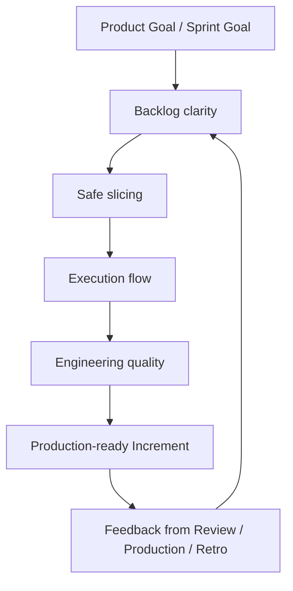
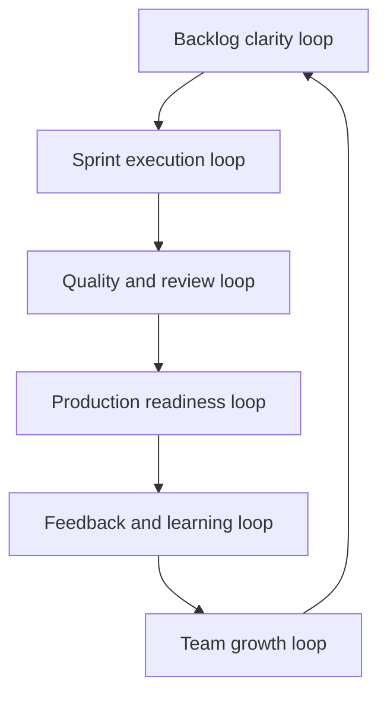

# Part 040 — Final Part: Senior Engineer Scrum Operating Model

## 1. Source notes and scope boundary

This final part synthesizes the entire series.

It uses:

- Scrum Guide concepts: Scrum Team, Product Backlog, Sprint Backlog, Increment, Product Goal, Sprint Goal, Definition of Done, Scrum Events, and Scrum Values.
- Scrum.org material on flow, Product Backlog refinement, Sprint Planning, Daily Scrum, Sprint Review, and Retrospective.
- Google Engineering Practices on code review quality.
- Google re:Work material on effective teams and psychological safety.
- The prior CSG Quote & Order engineering series covering domain, Java, Kafka, PostgreSQL, Kubernetes, observability, testing, operational readiness, and production correction.

This is not an official CSG operating model.

It is a practical personal/team playbook you can adapt after verifying internal team norms.

---

## 2. Core thesis

A senior engineer in Scrum needs an operating model.

Without one, the workday becomes reactive:

- attend meetings;
- pull tickets;
- answer Slack;
- review PRs late;
- rush testing;
- react to production issues;
- carry over unfinished work;
- repeat same retro topics.

With an operating model, a senior engineer creates leverage:

- backlog becomes clearer;
- Sprint Goals become more realistic;
- work is sliced safer;
- risks surface earlier;
- PR review improves quality;
- production readiness becomes part of Done;
- teammates learn faster;
- incidents improve the system;
- engineering culture compounds.

This part turns the whole series into daily practice.

---

## 3. The senior engineer mission in Scrum

Your mission is not simply to complete your assigned tickets.

Your mission is to help the Scrum Team deliver valuable, usable, production-ready increments while improving the system's ability to change safely.

For CSG Quote & Order context, that means protecting:

- quote correctness;
- pricing evidence;
- approval authority;
- catalog snapshot integrity;
- order lifecycle safety;
- fulfillment/fallout recovery;
- API and TMF compatibility;
- Kafka event correctness;
- PostgreSQL data safety;
- tenant isolation;
- audit defensibility;
- deployment and release readiness;
- team learning and flow.

This is the senior engineer's Scrum lens:



---

## 4. Daily operating model

Use this every working day.

### 4.1 Start-of-day scan

Ask:

1. What is the Sprint Goal?
2. Which work item most affects the Sprint Goal today?
3. Which item is aging or blocked?
4. Which PR needs review to unblock flow?
5. Is there production/support noise that changes the plan?
6. Is quality risk growing silently?

This takes five minutes.

It prevents local optimization.

### 4.2 Daily Scrum contribution

Do not give only status.

Bring useful information:

- risk discovered;
- dependency status;
- review need;
- test failure pattern;
- production interrupt;
- scope trade-off;
- Sprint Goal confidence.

Example:

> The quote approval story is coded, but the stale-approval invalidation test exposed an ambiguity. I need product/domain confirmation today. Without it, this story should not be counted as Done.

This is more useful than:

> Yesterday I worked on approval. Today I continue. No blockers.

### 4.3 PR review habit

Every day, review flow before starting new work.

Ask:

- Which PR is closest to Done?
- Which PR blocks someone else?
- Which PR has high domain/API/DB/security risk?
- Which PR can I review quickly to improve team flow?

Senior engineer rule:

> Starting new work while critical review work is blocked may reduce team throughput.

### 4.4 Risk note habit

Keep a lightweight risk note.

Format:

```md
## Risk note
Date:
Area:
Observation:
Potential impact:
Evidence:
Next action:
Owner:
```

Not every risk needs escalation.

But writing it down prevents vague anxiety and creates evidence for refinement, planning, or retro.

---

## 5. Weekly operating model

Use this once per week.

### 5.1 Backlog health review

Look at upcoming PBIs.

Classify:

- clear and ready;
- needs domain clarification;
- needs technical discovery;
- needs dependency alignment;
- needs acceptance criteria;
- needs test strategy;
- needs architecture decision;
- needs production readiness criteria.

For each unclear item, propose one improvement:

- refinement question;
- spike;
- story split;
- design note;
- dependency card;
- DoD addition.

### 5.2 Flow health review

Check:

- WIP;
- work item age;
- blocked items;
- review queue;
- QA/test queue;
- environment blockers;
- carryover risk.

Ask:

> What should we stop starting and start finishing?

### 5.3 Quality health review

Check:

- flaky tests;
- recurring bug category;
- escaped defects;
- failed deployments;
- migration issues;
- alert noise;
- support escalations.

Convert one recurring issue into an improvement experiment.

### 5.4 Stakeholder sync

For senior engineers, stakeholder sync is not politics.

It is risk alignment.

Useful weekly syncs:

- Product Owner: upcoming ambiguity and priority trade-offs.
- QA: test strategy and edge cases.
- Scrum Master: flow/blocker/systemic improvement.
- Platform/SRE: deployability and operability.
- Security: tenant/auth/audit-sensitive changes.
- Support/customer-facing team: production pain signals.

---

## 6. Sprint operating model

### 6.1 Before Sprint Planning

Prepare:

- understand Product Goal and candidate Sprint Goal;
- review top PBIs for readiness;
- identify hidden work;
- identify architecture/risk spikes;
- identify dependencies;
- check known interrupt load;
- check unfinished/carryover work;
- check production incidents or support load.

Senior contribution:

> Help the team commit to a meaningful Sprint Goal, not just a capacity-filled backlog.

### 6.2 During Sprint Planning

Ask:

- What outcome matters most this Sprint?
- Which PBIs directly support the Sprint Goal?
- Which PBIs are too risky or unclear?
- What testing/review/migration/observability work is included?
- What dependencies could block us?
- What trade-off will we make if something slips?
- What is the smallest valuable Increment?

Make hidden engineering work visible.

### 6.3 During Sprint execution

Behaviors:

- limit WIP;
- review early;
- pair on high-risk work;
- keep test evidence current;
- update Sprint Backlog when facts change;
- escalate blockers early;
- protect quality goals;
- help finish work before starting new work.

### 6.4 Before Sprint Review

Prepare evidence:

- business behavior;
- API contract;
- Kafka event behavior;
- database/migration evidence;
- security/audit behavior;
- observability signals;
- release readiness;
- known limitations;
- next decisions needed.

Sprint Review is not a stage show.

It is product and technical feedback.

### 6.5 During Sprint Retrospective

Bring system observations:

- what slowed us down;
- what created rework;
- what improved quality;
- what risk was discovered late;
- what signal from production matters;
- what one experiment should we run next.

Push for small owned actions.

---

## 7. Monthly operating model

Each month, produce one durable improvement.

Examples:

- improve one runbook;
- document one state machine;
- add one missing dashboard panel;
- create one test fixture pattern;
- reduce one flaky test class;
- write one ADR;
- remove one unsafe legacy path;
- improve one refinement checklist;
- mentor one engineer through a complex PR;
- close one incident follow-up.

Monthly leverage comes from making future work safer and faster.

### 7.1 Monthly self-review

Ask:

- What did I personally deliver?
- What did I help the team deliver?
- What risk did I reduce?
- What ambiguity did I clarify?
- What production signal did I improve?
- What teammate did I help grow?
- What debt did I make more visible or smaller?
- What should I stop doing?

---

## 8. Quarterly operating model

Each quarter, align with larger goals.

### 8.1 Ownership map

Update your ownership map:

- capability;
- services;
- APIs/events;
- data tables;
- operational dashboards;
- known risks;
- roadmap items;
- debt items;
- key stakeholders.

### 8.2 Risk register

Maintain a small risk register.

| Risk | Impact | Evidence | Mitigation | Owner | Status |
|---|---|---|---|---|---|
| Approval logic duplicated | approval bypass or stale approval | code search/tests | centralize invalidation | TBD | proposed |
| Order fallout lacks dashboard | support finds issue late | incident history | add dashboard/runbook | TBD | active |
| Event schema compatibility unclear | consumer breakage | missing gate | add schema checklist | TBD | proposed |

### 8.3 Growth focus

Choose one growth theme:

- domain depth;
- architecture review;
- production operations;
- mentoring;
- delivery flow;
- security/tenant isolation;
- data/migration safety;
- stakeholder communication.

Do not try to improve everything at once.

---

## 9. Event-specific senior engineer playbooks

### 9.1 Refinement playbook

Before refinement:

- read PBI;
- identify domain unknowns;
- identify API/event/DB/security/operability impact;
- prepare questions.

During refinement:

- ask business-invariant questions;
- propose split options;
- expose dependencies;
- propose spike if uncertainty is high;
- clarify acceptance criteria;
- connect work to Sprint/Product Goal.

After refinement:

- capture open questions;
- update risk note;
- follow up with owner.

### 9.2 Planning playbook

Ask:

- Is the Sprint Goal coherent?
- Is work small enough?
- Is capacity realistic?
- Is review/testing included?
- Are production incidents/support load considered?
- Are dependencies owned?
- Is the Definition of Done understood?

### 9.3 Daily Scrum playbook

Bring:

- Sprint Goal confidence;
- blocker needing owner;
- review queue issue;
- high-risk technical discovery;
- production interruption;
- trade-off proposal.

### 9.4 PR review playbook

Review for:

- domain correctness;
- lifecycle state safety;
- transaction boundary;
- idempotency;
- API/event compatibility;
- PostgreSQL/migration safety;
- tenant/security/audit;
- observability;
- test evidence;
- maintainability.

### 9.5 Sprint Review playbook

Show:

- what business behavior changed;
- how it was verified;
- what is production-ready;
- what is not enabled yet;
- what feedback is needed;
- what risk remains.

### 9.6 Retrospective playbook

Bring:

- one observed pattern;
- evidence;
- likely root cause;
- one small experiment;
- proposed owner and measurement.

---

## 10. Work-type operating checklists

### 10.1 REST API change

Check:

- OpenAPI updated;
- backward compatibility reviewed;
- error model stable;
- auth/tenant policy enforced;
- contract tests updated;
- observability added;
- rollout impact known.

### 10.2 Kafka event change

Check:

- schema compatibility;
- partition key;
- event envelope;
- replay safety;
- consumer impact;
- DLQ behavior;
- correlation/causation IDs;
- tests and dashboard.

### 10.3 PostgreSQL migration

Check:

- expand-contract plan;
- old/new app compatibility;
- lock/runtime analysis;
- backfill strategy;
- rollback/roll-forward;
- on-prem implications;
- validation queries.

### 10.4 Security-sensitive change

Check:

- auth boundary;
- authorization rule;
- tenant isolation;
- audit evidence;
- negative tests;
- PII/logging;
- security review trigger.

### 10.5 Production bug

Check:

- customer impact;
- severity/priority;
- containment;
- root cause category;
- test to prevent recurrence;
- backlog follow-up;
- retro learning.

---

## 11. Communication templates

### 11.1 Risk escalation

```md
Risk:
Impact:
Evidence:
Options:
Recommendation:
Decision needed by:
Owner:
```

### 11.2 Scope trade-off

```md
Sprint Goal:
New fact discovered:
Impact on current plan:
Options:
- Drop/split:
- Defer:
- Add capacity:
- Accept risk:
Recommendation:
```

### 11.3 PR review comment

```md
Concern:
Why it matters:
Example failure mode:
Suggested fix:
Blocking? yes/no
```

### 11.4 Retro experiment

```md
Signal:
Hypothesis:
Experiment:
Owner:
Duration:
Measure:
Review date:
```

---

## 12. Senior engineer anti-patterns to avoid

### 12.1 Ticket executor

Completes assigned work but does not improve system flow, quality, or clarity.

Correction:

- review backlog health;
- help unblock;
- improve one team signal.

### 12.2 Shadow manager

Controls others' work without formal role or team consent.

Correction:

- enable self-management;
- clarify decisions;
- mentor without taking ownership away.

### 12.3 Architecture astronaut

Creates abstractions detached from Sprint Goal and product value.

Correction:

- tie design to risk and delivery;
- slice architecture work;
- use ADRs.

### 12.4 Permanent blocker

Finds issues but offers no path forward.

Correction:

- distinguish must-fix vs follow-up;
- propose safe incremental path;
- make trade-offs explicit.

### 12.5 Hero rescuer

Solves emergencies alone but does not improve system or team capability.

Correction:

- document;
- pair;
- add tests/runbooks;
- convert incident to prevention.

---

## 13. Internal verification checklist

Use this to adapt the operating model to CSG/team reality.

### 13.1 Scrum implementation

- Sprint length?
- Sprint Planning format?
- Daily Scrum format?
- Sprint Review audience?
- Retrospective follow-up process?
- Product Backlog tool and fields?
- Definition of Done?
- Definition of Ready, if any?
- Release cadence?

### 13.2 Role boundaries

- Product Owner decision rights?
- Scrum Master responsibilities?
- Engineering manager role?
- Tech lead/architect role?
- QA role?
- Security/platform review triggers?

### 13.3 Engineering practice

- PR review expectations?
- CI/CD gates?
- Test categories?
- API contract process?
- Kafka schema process?
- DB migration process?
- Runbook/ORR process?
- Incident process?

### 13.4 Personal operating rhythm

- When do you review PRs?
- When do you prepare for refinement?
- When do you inspect flow?
- When do you update risk register?
- When do you mentor/pair?
- When do you work on durable improvement?

---

## 14. Final integrated model

A senior engineer in Scrum should operate through six continuous loops.



### 14.1 Backlog clarity loop

Convert ambiguity into executable work.

### 14.2 Sprint execution loop

Protect Sprint Goal and flow.

### 14.3 Quality and review loop

Ensure correctness, maintainability, and learning.

### 14.4 Production readiness loop

Make Done mean usable, observable, supportable, and releasable.

### 14.5 Feedback and learning loop

Use Review, Retro, incidents, metrics, and stakeholder input to adapt.

### 14.6 Team growth loop

Transfer judgment and reduce dependency on individual heroes.

---

## 15. Final practical exercise

Create your personal Scrum operating model.

Fill this template:

```md
# My Senior Engineer Scrum Operating Model

## My team context
- Sprint length:
- Main product area:
- Main services:
- Main stakeholders:

## My ownership area
- Capability:
- APIs/events:
- Data tables:
- Production signals:
- Known risks:

## Daily habits
- Start-of-day scan:
- PR review window:
- Risk note habit:

## Weekly habits
- Backlog health:
- Flow health:
- Quality health:
- Stakeholder sync:

## Sprint habits
- Before planning:
- During execution:
- Before Review:
- During Retro:

## Monthly improvement
- One durable improvement I will produce:

## Current top risks
1.
2.
3.

## Next experiment
- Signal:
- Hypothesis:
- Experiment:
- Measure:
```

Review it with your manager, team lead, buddy, or another senior engineer.

---

## 16. Final summary of the series

This 40-part series translated Scrum from ceremony into engineering operating practice.

The main ideas:

1. Scrum is an empirical system for learning under uncertainty.
2. Sprint Goal matters more than ticket completion theater.
3. Backlog refinement is risk discovery.
4. Story slicing must preserve product value and system safety.
5. Acceptance criteria and Definition of Done must include production reality.
6. Testing, review, architecture, debt, and operations belong inside Scrum, not after it.
7. Metrics should diagnose, not punish.
8. Production incidents are feedback into backlog and process.
9. Senior engineers are force multipliers when they improve team judgment and flow.
10. Engineering culture is the behavior system that determines whether Scrum works.

For a Senior Java Software Engineer in CSG Quote & Order, the highest-value Scrum behavior is this:

> Make risk visible early, help the team slice work safely, protect production-quality Done, and turn every Sprint into a learning loop that improves both product and engineering system.

That is Scrum as enterprise engineering practice.
