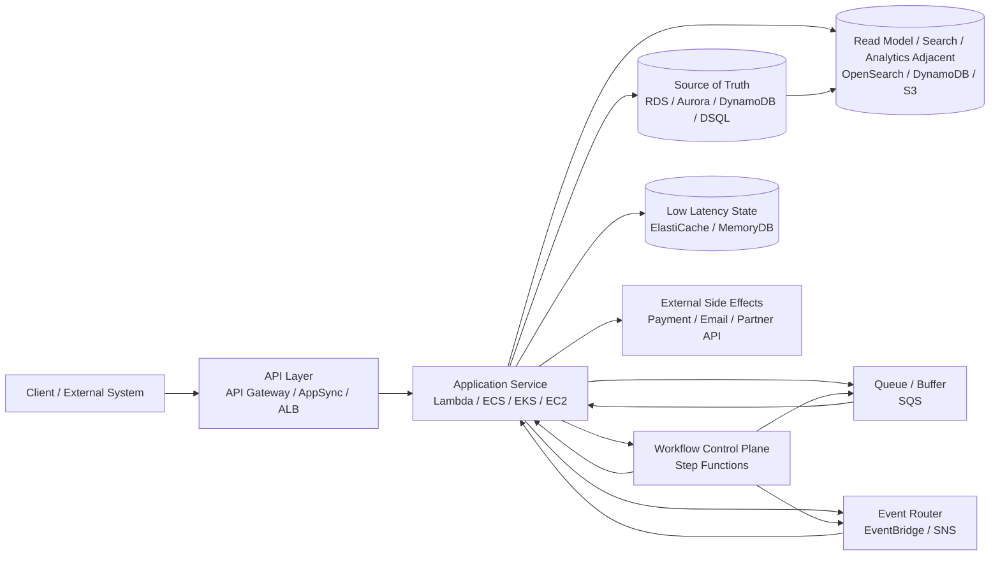
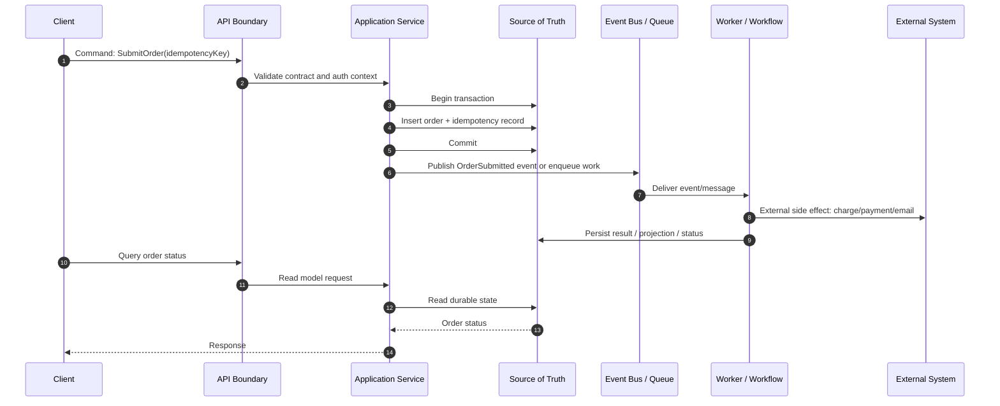
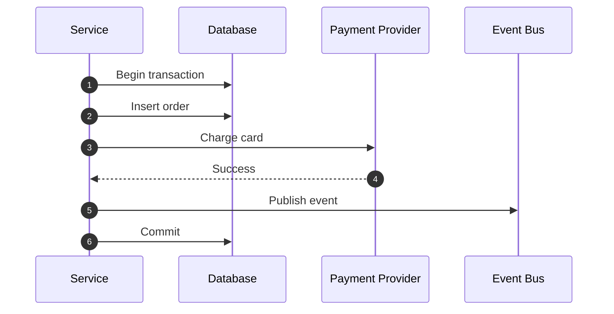
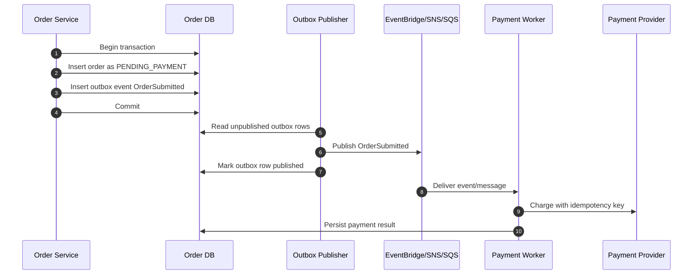
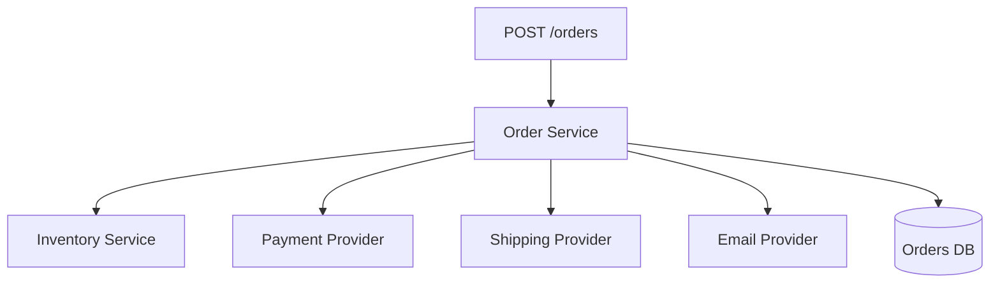
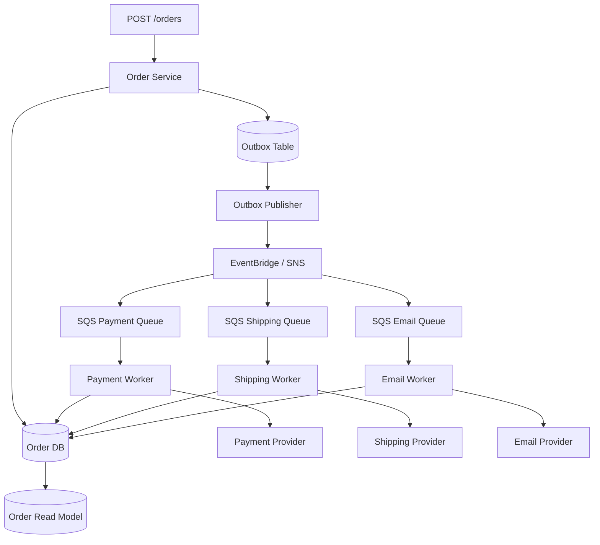
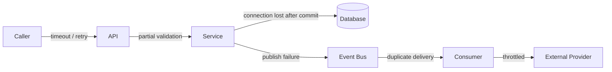

# Part 001 — System Map: Application Layer dan Database Layer sebagai Satu Runtime System

> Tujuan bagian ini bukan menghafal service AWS. Tujuan bagian ini adalah membangun **peta mental**: ketika sebuah request masuk ke sistem, apa yang berubah, siapa yang mengontrol perubahan itu, di mana state disimpan, bagaimana side effect terjadi, bagaimana failure menyebar, dan bagaimana kita membuktikan sistem tetap benar.

Di level basic, kita sering melihat AWS sebagai daftar service:

- API Gateway untuk API.
- SQS untuk queue.
- SNS untuk pub/sub.
- EventBridge untuk event routing.
- Step Functions untuk workflow.
- RDS atau Aurora untuk relational database.
- DynamoDB untuk NoSQL.
- ElastiCache untuk cache.

Di level production, daftar itu tidak cukup. Yang penting adalah **hubungan antar service**.

Sistem application + database yang baik biasanya tidak gagal karena salah memilih service saja. Ia gagal karena boundary salah:

- API memegang transaction terlalu lama.
- Queue dipakai untuk menyembunyikan overload permanen.
- Event dianggap source of truth padahal tidak ada event log yang benar.
- Cache berubah menjadi database tanpa operational discipline.
- Workflow engine dipakai untuk logic yang seharusnya transactional.
- Database schema berubah tanpa strategi kompatibilitas.
- Retry dilakukan tanpa idempotency.
- Observability baru ditambahkan setelah incident.

Bagian ini akan membangun fondasi agar seluruh part berikutnya bisa dipahami sebagai engineering system, bukan kumpulan template.

---

## 1. Apa yang Sedang Kita Pelajari?

Seri ini membahas dua area AWS yang sebenarnya tidak bisa dipisahkan:

1. **Application Integration**  
   Bagaimana komponen aplikasi berkomunikasi, dikoordinasikan, dipisahkan, diberi buffer, diberi workflow, dan diberi mekanisme failure handling.

2. **Database and Data State**  
   Bagaimana state disimpan, dimodelkan, dibaca, direplikasi, diproyeksikan, dimigrasikan, dan dipulihkan.

Pada sistem nyata, keduanya membentuk satu runtime:



Peta di atas sengaja tidak dimulai dari service. Ia dimulai dari **jenis tanggung jawab**:

| Area | Pertanyaan utama | Contoh AWS service |
|---|---|---|
| API boundary | Siapa boleh meminta apa, dengan contract seperti apa? | API Gateway, AppSync |
| Application compute | Siapa menjalankan business logic? | Lambda, ECS, EKS, EC2 |
| Durable state | Apa sumber kebenaran utama? | Aurora/RDS, DynamoDB, Aurora DSQL |
| Coordination | Siapa mengatur urutan langkah? | Step Functions |
| Decoupling | Bagaimana sistem menyerap variasi load dan failure? | SQS, SNS, EventBridge |
| Projection | Bagaimana data dibentuk ulang untuk query? | DynamoDB, OpenSearch, S3, materialized view |
| Low-latency derived state | Apa yang boleh stale demi latency? | ElastiCache, MemoryDB |
| External side effect | Apa yang tidak bisa di-rollback dengan database transaction? | payment, email, shipping, partner API |

Mental model utama:

> **Application Integration menentukan bagaimana perubahan mengalir. Database menentukan apa yang tetap benar setelah perubahan terjadi.**

---

## 2. Kenapa Application dan Database Tidak Boleh Dipisahkan secara Mental?

Banyak desain terlihat bagus di diagram, tetapi gagal ketika bertemu realitas berikut:

- Request bisa timeout setelah database berhasil commit.
- Client bisa retry command yang sama.
- Consumer queue bisa menerima message yang sama lebih dari sekali.
- Event bisa diproses terlambat.
- Cache bisa menyimpan nilai lama.
- Database failover bisa memutus connection pool.
- Read replica bisa lag.
- Schema baru bisa belum dipahami consumer lama.
- External provider bisa sukses, tetapi response hilang.

Semua contoh itu berada di batas application + database. Tidak bisa diselesaikan hanya dengan “gunakan managed service”.

AWS Well-Architected Framework menekankan pengambilan keputusan arsitektur berdasarkan trade-off, best practice, dan evaluasi workload secara konsisten. Framework tersebut mencakup operational excellence, security, reliability, performance efficiency, cost optimization, dan sustainability. Seri ini memakai cara pikir yang sama, tetapi diterjemahkan ke level implementasi application/database.

---

## 3. Runtime System: Bukan Sekadar Architecture Diagram

Architecture diagram biasanya menunjukkan komponen. Runtime system menunjukkan **apa yang terjadi saat waktu berjalan**.

Untuk sistem application + database, runtime system minimal terdiri dari enam aliran:

1. **Command** — permintaan untuk mengubah state.
2. **Query** — permintaan membaca state.
3. **Event** — fakta bahwa sesuatu sudah terjadi.
4. **Workflow** — koordinasi beberapa langkah yang mungkin lama, retryable, dan partially failing.
5. **State mutation** — perubahan yang harus durable dan konsisten.
6. **Side effect** — efek ke dunia luar yang biasanya tidak bisa di-rollback.



Diagram tersebut menyembunyikan banyak hal penting:

- Apa yang terjadi jika `Publish OrderSubmitted` gagal setelah commit?
- Apa yang terjadi jika client retry `SubmitOrder`?
- Apa yang terjadi jika worker memanggil payment gateway dua kali?
- Apa yang terjadi jika event terkirim sebelum database commit?
- Apa yang terjadi jika query membaca projection yang belum update?

Top 1% engineer tidak hanya menggambar happy path. Mereka membuat sistem tetap benar ketika urutan kejadian tidak ideal.

---

## 4. Service Map: Fungsi, Bukan Nama Service

AWS punya banyak service. Cara buruk memilih service adalah mulai dari katalog. Cara yang lebih kuat adalah mulai dari **fungsi sistem**.

### 4.1 API Boundary

API boundary menjawab:

- Apa contract request dan response?
- Apa error model yang stabil?
- Apa batas timeout?
- Apakah command idempotent?
- Apakah API synchronous atau hanya menerima pekerjaan?
- Apakah caller butuh hasil final atau cukup acknowledgement?

Contoh AWS service:

- Amazon API Gateway untuk REST/HTTP/WebSocket API.
- AWS AppSync untuk GraphQL, resolver, subscription, dan realtime use case.

API boundary bukan tempat semua business logic. API boundary adalah tempat contract diekspresikan dan traffic dari luar dikendalikan.

### 4.2 Application Service

Application service menjawab:

- Apa business capability yang dimiliki service ini?
- State apa yang boleh ia ubah?
- Command apa yang ia terima?
- Event apa yang ia hasilkan?
- Query apa yang ia layani?

Compute bisa Lambda, ECS, EKS, atau EC2, tetapi seri ini tidak mengulang compute detail. Kita hanya peduli bagaimana compute menjalankan application/database pattern.

### 4.3 Source of Truth

Source of truth menjawab:

- Data mana yang canonical?
- Siapa owner perubahan?
- Apa invariant yang harus dijaga?
- Apa transaction boundary?
- Apa consistency model?
- Bagaimana restore dilakukan?

Contoh AWS service:

- Amazon RDS / Aurora untuk relational transactional workload.
- Amazon DynamoDB untuk key-value/document workload dengan access pattern eksplisit.
- Amazon Aurora DSQL untuk distributed SQL use case tertentu.
- Amazon DocumentDB, Neptune, Keyspaces, Timestream untuk workload khusus.

### 4.4 Integration Fabric

Integration fabric menjawab:

- Apakah komunikasi harus synchronous?
- Apakah perlu buffer?
- Apakah perlu fanout?
- Apakah perlu event routing berdasarkan rule?
- Apakah perlu workflow yang durable?
- Apa retry dan dead-letter strategy?

Contoh AWS service:

- SQS untuk queue dan load leveling.
- SNS untuk pub/sub fanout.
- EventBridge untuk event bus, event routing, archive/replay, dan integration antar producer/consumer.
- Step Functions untuk durable orchestration.

### 4.5 Derived State

Derived state menjawab:

- Apakah data ini bisa dibangun ulang dari source of truth?
- Seberapa stale data ini boleh?
- Bagaimana invalidation dilakukan?
- Bagaimana backfill dilakukan?
- Apa yang terjadi ketika projection tertinggal?

Contoh:

- Cache di ElastiCache.
- Search index di OpenSearch.
- Read model di DynamoDB.
- Analytical copy di S3.

Prinsipnya:

> Jika sebuah state bisa hilang dan dibangun ulang, ia bukan source of truth. Jika tidak bisa dibangun ulang, perlakukan ia sebagai database dengan operational discipline penuh.

---

## 5. Cara Membaca AWS Application + Database Architecture

Ketika melihat desain, jangan bertanya dulu “pakai service apa?”. Tanyakan ini:

1. **Apa command utama sistem?**
2. **Apa query utama sistem?**
3. **Apa source of truth setiap entity?**
4. **Apa event yang merupakan fakta, bukan instruksi?**
5. **Apa pekerjaan yang boleh asynchronous?**
6. **Apa operasi yang harus serial?**
7. **Apa invariant yang tidak boleh rusak?**
8. **Apa side effect yang tidak bisa di-rollback?**
9. **Apa kondisi retry yang aman?**
10. **Apa sinyal operasional yang membuktikan sistem sehat?**

Contoh buruk:

> “Kita pakai EventBridge supaya decoupled.”

Contoh lebih baik:

> “Order service mem-persist `OrderSubmitted` sebagai state canonical. Setelah commit, event dipublikasikan lewat outbox ke EventBridge. Consumer boleh terlambat dan boleh menerima duplicate. Setiap consumer wajib idempotent berdasarkan `eventId`. Projection boleh eventual consistent maksimal 60 detik. Jika backlog melebihi 5 menit, alarm aktif dan replay dibekukan.”

Kalimat kedua bukan hanya memilih service. Ia mendefinisikan contract runtime.

---

## 6. Lima Bentuk Coupling yang Sering Tidak Terlihat

Application integration biasanya dijual sebagai decoupling. Namun decoupling tidak otomatis terjadi karena memakai queue atau event bus.

### 6.1 Temporal Coupling

Sistem A harus menunggu sistem B saat itu juga.

- Contoh: API `SubmitOrder` menunggu payment gateway menyelesaikan charge.
- Risiko: latency dan availability caller bergantung pada semua dependency.
- Solusi: ubah menjadi accepted command + asynchronous workflow jika hasil final tidak harus langsung.

### 6.2 Schema Coupling

Consumer mengasumsikan struktur payload producer.

- Contoh: consumer gagal karena field baru dianggap breaking.
- Risiko: perubahan producer memecahkan consumer.
- Solusi: contract versioning, additive change, schema registry, consumer-driven compatibility test.

### 6.3 State Coupling

Banyak service menulis state yang sama.

- Contoh: Order service dan Payment service sama-sama update tabel `orders.status` tanpa ownership jelas.
- Risiko: race condition, audit ambiguity, invariant sulit dibuktikan.
- Solusi: single writer per aggregate atau explicit coordination boundary.

### 6.4 Operational Coupling

Kesehatan satu komponen menentukan kesehatan komponen lain.

- Contoh: queue backlog meledak dan semua consumer mencoba catch up sampai database collapse.
- Risiko: cascading failure.
- Solusi: bounded concurrency, load shedding, DLQ, redrive control, priority queue, backpressure.

### 6.5 Semantic Coupling

Payload terlihat generik, tetapi maknanya disepakati secara informal.

- Contoh: event `StatusChanged` dengan field `status=PENDING` yang dimaknai berbeda oleh tiga consumer.
- Risiko: consumer membuat business decision dari makna yang tidak stabil.
- Solusi: domain event eksplisit seperti `PaymentAuthorized`, `PaymentCaptureFailed`, `OrderExpired`.

---

## 7. Source of Truth, Projection, Cache, dan Event

Empat konsep ini sering tercampur. Kita harus tegas.

| Konsep | Fungsi | Boleh hilang? | Boleh stale? | Contoh |
|---|---|---:|---:|---|
| Source of truth | State canonical | Tidak | Biasanya tidak untuk command path | Aurora, RDS, DynamoDB, DSQL |
| Projection/read model | Bentuk baca turunan | Ya, jika bisa rebuild | Ya | DynamoDB read model, OpenSearch index |
| Cache | Optimasi latency | Ya | Ya, sesuai TTL/invalidation | ElastiCache, in-memory cache |
| Event | Fakta perubahan | Tergantung event log strategy | Tidak relevan; event immutable | EventBridge event, outbox event, stream record |

Kesalahan umum:

- Cache dipakai sebagai source of truth tanpa durability dan restore model.
- Event bus dianggap event store permanen tanpa retention/replay design.
- Search index dipakai sebagai canonical data store.
- Projection diupdate manual oleh banyak service.
- Database relational dipakai bersama semua service tanpa ownership boundary.

Prinsip:

> State yang menentukan keputusan bisnis harus punya owner, durability, backup/restore, migration strategy, dan audit path.

---

## 8. Transaction Boundary: Tempat Banyak Sistem Rusak

Dalam satu database, transaction relatif mudah dipahami:

```sql
BEGIN;
UPDATE account SET balance = balance - 100 WHERE id = 'A';
UPDATE account SET balance = balance + 100 WHERE id = 'B';
COMMIT;
```

Masalah muncul ketika transaction melewati boundary:



Desain di atas berbahaya karena:

- External payment tidak ikut rollback database.
- Event bisa terkirim sebelum transaction commit.
- Transaction menahan lock sambil menunggu jaringan eksternal.
- Jika commit gagal setelah payment sukses, sistem butuh recovery manual.

Versi lebih aman:



Versi ini tidak membuat distributed transaction palsu. Ia mengakui bahwa:

- Database commit adalah boundary durable pertama.
- Event publish adalah side effect yang perlu recovery.
- Payment call harus idempotent.
- Worker boleh retry.
- Status order harus bisa menunjukkan intermediate state.

Ini contoh pola yang akan sering muncul di seri ini.

---

## 9. Command, Event, dan Query: Jangan Dicampur

### Command

Command adalah niat untuk mengubah state.

Contoh:

```json
{
  "commandId": "cmd-9f31",
  "type": "SubmitOrder",
  "customerId": "cust-123",
  "idempotencyKey": "client-req-7788",
  "items": [
    { "sku": "book-1", "qty": 1 }
  ]
}
```

Karakteristik command:

- Bisa diterima atau ditolak.
- Bisa gagal validasi.
- Bisa menghasilkan state baru.
- Biasanya butuh idempotency.
- Caller peduli response.

### Event

Event adalah fakta bahwa sesuatu sudah terjadi.

```json
{
  "eventId": "evt-1144",
  "eventType": "OrderSubmitted",
  "occurredAt": "2026-07-06T02:30:00Z",
  "aggregateId": "order-991",
  "version": 1,
  "data": {
    "customerId": "cust-123",
    "totalAmount": "49.00",
    "currency": "USD"
  }
}
```

Karakteristik event:

- Tidak meminta consumer melakukan sesuatu secara langsung.
- Tidak boleh berubah setelah diterbitkan.
- Consumer boleh banyak dan tidak dikenal producer.
- Harus versioned.
- Delivery bisa duplicate, tergantung transport.

### Query

Query membaca state.

```http
GET /orders/order-991
```

Karakteristik query:

- Tidak mengubah state bisnis.
- Bisa menggunakan read model/projection.
- Bisa stale jika contract menyatakan demikian.
- Harus jelas consistency expectation-nya.

Kesalahan desain umum:

| Kesalahan | Dampak |
|---|---|
| Event berisi instruksi seperti `SendEmailNow` | Producer tahu terlalu banyak tentang consumer |
| Command dikirim lewat event bus tanpa owner jelas | Tidak jelas siapa wajib memproses |
| Query membaca cache tanpa stale contract | User melihat state yang membingungkan |
| API command synchronous menunggu semua side effect | Latency tinggi dan failure meluas |

---

## 10. Integration Pattern sebagai Pilihan Semantik

### 10.1 Direct synchronous call

Gunakan ketika:

- Caller benar-benar butuh jawaban segera.
- Dependency cukup reliable untuk berada di critical path.
- Timeout dan retry jelas.
- Operation idempotent atau aman tidak di-retry.

Risiko:

- Cascading failure.
- Tail latency memburuk.
- Caller bergantung pada availability dependency.

### 10.2 Queue

Gunakan ketika:

- Work bisa diproses nanti.
- Load perlu diratakan.
- Consumer perlu retry independen.
- Producer tidak perlu tahu worker mana yang menjalankan.

Risiko:

- Backlog bisa menjadi incident tersembunyi.
- Message bisa duplicate.
- Ordering tidak otomatis, kecuali pattern tertentu seperti FIFO/message group.
- Queue tidak memperbaiki kapasitas downstream yang secara permanen kurang.

### 10.3 Pub/Sub

Gunakan ketika:

- Satu fakta perlu diketahui banyak consumer.
- Producer tidak boleh tahu consumer.
- Consumer dapat bertambah tanpa mengubah producer.

Risiko:

- Schema drift.
- Semantic coupling tersembunyi.
- Replay bisa memicu side effect ulang jika consumer tidak idempotent.

### 10.4 Event bus

Gunakan ketika:

- Routing event perlu berbasis rule.
- Ada banyak producer/consumer.
- Event perlu diarsip/replay.
- Integrasi antar akun atau service diperlukan.

Risiko:

- Event taxonomy kacau.
- Event terlalu generik.
- Consumer bergantung pada field internal producer.

### 10.5 Workflow orchestration

Gunakan ketika:

- Proses punya banyak langkah.
- Ada timeout, retry, compensation, approval, atau long-running process.
- Urutan dan state workflow perlu durable.
- Operator perlu melihat execution history.

Risiko:

- Workflow menjadi tempat semua business logic.
- State tersebar antara workflow state dan database state tanpa aturan.
- Compensation dianggap rollback padahal tidak selalu bisa mengembalikan dunia nyata.

---

## 11. Decision Matrix Awal

| Kebutuhan | Pattern awal | Kandidat AWS service |
|---|---|---|
| Public HTTP API | Synchronous API boundary | API Gateway |
| GraphQL + realtime subscription | API + resolver + subscription | AppSync |
| Work async satu consumer group | Queue | SQS |
| Fanout sederhana ke banyak subscriber | Pub/Sub | SNS |
| Event routing berbasis rule | Event bus | EventBridge |
| Long-running business process | Orchestration | Step Functions |
| Relational transaction + SQL | Relational DB | Aurora/RDS |
| Predictable key-value access | NoSQL key-value/document | DynamoDB |
| Multi-Region distributed SQL use case | Distributed SQL | Aurora DSQL |
| Low latency derived data | Cache | ElastiCache / MemoryDB |
| Graph traversal | Graph database | Neptune |
| Time-series ingestion/query | Time-series DB | Timestream |
| Cassandra-compatible workload | Wide-column | Keyspaces |
| Document workload | Document database | DocumentDB |

Matrix ini bukan jawaban final. Ia hanya starting point. Keputusan final harus melihat:

- Access pattern.
- Write/read ratio.
- Latency requirement.
- Consistency requirement.
- Failure tolerance.
- Team operation capability.
- Data lifecycle.
- Cost curve.
- Migration reversibility.

---

## 12. Case Study: Order Processing yang Terlihat Sederhana

Kita ambil contoh order processing.

Requirement awal:

1. User submit order.
2. Sistem validasi stok.
3. Sistem charge payment.
4. Sistem membuat shipment.
5. User bisa melihat status.
6. Email konfirmasi dikirim.
7. Admin bisa audit status order.

Desain naive:



Masalah desain naive:

- API latency = inventory + payment + shipping + email + DB.
- Jika email gagal, apakah order gagal?
- Jika payment sukses tetapi DB write gagal, apa status order?
- Jika client retry, apakah payment double charge?
- Jika shipping provider timeout, apakah order harus dibatalkan?
- Jika inventory lock lama, apakah semua request ikut lambat?

Desain lebih matang:



Sekarang kita punya boundary:

- `POST /orders` hanya membuat order dalam status awal yang valid.
- Payment, shipping, email menjadi asynchronous side effect.
- Setiap worker punya retry dan DLQ sendiri.
- OrderDB menyimpan status canonical.
- Event dan queue memisahkan load dan failure.
- Query status order bisa membaca canonical DB atau read model.

Tetapi desain ini juga punya biaya:

- Lebih banyak moving parts.
- Debugging butuh correlation ID.
- User harus menerima intermediate state.
- Sistem butuh reconciliation job.
- Idempotency wajib.
- Operability lebih rumit.

Tidak ada desain gratis.

> Tugas engineer bukan mencari arsitektur tanpa trade-off. Tugas engineer adalah memilih trade-off yang sesuai dengan invariant bisnis dan kapasitas operasional tim.

---

## 13. Invariant yang Harus Ditulis Sebelum Memilih Service

Invariant adalah aturan yang harus selalu benar.

Contoh invariant order system:

1. Satu idempotency key untuk satu customer tidak boleh membuat dua order aktif.
2. Payment tidak boleh di-capture dua kali untuk order yang sama.
3. Order tidak boleh `SHIPPED` sebelum payment `CAPTURED`.
4. Order yang gagal payment harus bisa diretry atau expired dengan alasan jelas.
5. Email konfirmasi tidak boleh menentukan keberhasilan order.
6. Semua perubahan status order harus audit-able.
7. Admin harus bisa melihat status intermediate.
8. Worker retry tidak boleh menciptakan side effect ganda.
9. Replay event tidak boleh mengubah state final secara salah.
10. Restore database harus mengembalikan source of truth dan memungkinkan rebuild projection.

Invariant lebih penting daripada diagram.

Jika invariant belum jelas, service choice sering menipu.

---

## 14. Failure Model Awal

Setiap edge pada diagram harus dianggap bisa gagal.



Daftar failure dasar:

| Failure | Contoh | Pertanyaan desain |
|---|---|---|
| Timeout | Caller tidak menerima response | Apakah retry aman? |
| Duplicate | Message/event diproses dua kali | Apa idempotency key? |
| Reordering | Event B tiba sebelum event A | Apakah consumer butuh version check? |
| Lost acknowledgement | Provider sukses, response hilang | Bagaimana reconciliation? |
| Partial commit | DB commit berhasil, publish gagal | Apakah ada outbox? |
| Backlog | Queue menumpuk | Apa alarm dan drain strategy? |
| Hot key | Satu partition/key terlalu ramai | Bagaimana key distribution? |
| Stale read | Projection/cache belum update | Apa consistency contract? |
| Schema drift | Consumer tidak paham payload | Apa compatibility rule? |
| Restore gap | Backup ada, projection hilang | Apa rebuild procedure? |

AWS Builders' Library banyak menekankan realitas distributed systems seperti timeout, retry, backoff, jitter, idempotent API, queue backlog, dan operational visibility. Ini bukan teori tambahan; ini pusat desain.

---

## 15. Observability sebagai Bagian dari Desain, Bukan Tambalan

Untuk application + database system, minimal kita perlu mengamati:

### Request path

- request count
- latency percentile
- error rate
- throttle count
- timeout count
- idempotency conflict
- validation rejection

### Database path

- connection count
- transaction duration
- lock wait
- deadlock count
- query latency
- replication lag
- storage growth
- backup status
- failover event

### Queue/event path

- message age
- visible/in-flight message count
- DLQ count
- retry count
- consumer error rate
- replay count
- publish failure
- consumer lag

### Workflow path

- execution count
- failed/timed-out executions
- retries per state
- compensation count
- average duration
- stuck execution

### Business invariant path

- orders pending payment too long
- payment captured without order transition
- shipment created for unpaid order
- duplicate idempotency key rate
- reconciliation mismatch

Sinyal teknis penting. Tetapi sinyal bisnis-invariant sering lebih cepat menunjukkan kerusakan nyata.

---

## 16. Architecture Reading Checklist

Saat membaca atau membuat desain AWS application/database, gunakan checklist ini.

### Ownership

- Entity apa saja yang ada?
- Siapa owner setiap entity?
- Siapa satu-satunya writer canonical?
- Apa yang boleh dibaca service lain?
- Apakah service lain membaca DB langsung atau lewat API/event/projection?

### Contract

- Apa command contract?
- Apa event contract?
- Apa query contract?
- Apa error model?
- Apa compatibility rule?

### Consistency

- Operasi mana yang harus strongly consistent?
- Operasi mana yang boleh eventual?
- Apa read-your-writes expectation?
- Apa stale data budget?

### Failure

- Apa yang terjadi jika caller retry?
- Apa yang terjadi jika worker crash setelah side effect?
- Apa yang terjadi jika event duplicate?
- Apa yang terjadi jika database failover?
- Apa yang terjadi jika queue backlog 10x normal?

### Recovery

- Bagaimana replay dilakukan?
- Bagaimana DLQ di-redrive?
- Bagaimana projection rebuild?
- Bagaimana reconciliation dijalankan?
- Bagaimana operator tahu pekerjaan selesai?

### Cost and scale

- Apa unit cost per request?
- Apa unit cost per event?
- Apa kapasitas bottleneck?
- Apa yang terjadi saat traffic burst?
- Apa yang terjadi saat data tumbuh 10x?

---

## 17. Anti-Pattern yang Harus Dikenali Sejak Awal

### Anti-Pattern 1 — Shared Database sebagai Integration Layer

Banyak service membaca/menulis database yang sama.

Dampak:

- Ownership kabur.
- Schema change berbahaya.
- Invariant tersebar.
- Audit sulit.
- Deployment saling mengunci.

Bukan berarti shared DB selalu salah. Untuk modular monolith atau bounded context yang sama, shared database bisa masuk akal. Yang salah adalah memakai database sebagai shortcut komunikasi antar boundary yang seharusnya independen.

### Anti-Pattern 2 — Event Soup

Semua hal dijadikan event tanpa taxonomy.

Dampak:

- Consumer bingung.
- Event terlalu generik.
- Replay berbahaya.
- Schema drift.
- Tidak jelas event mana yang business fact dan mana yang technical notification.

### Anti-Pattern 3 — Queue sebagai Tempat Menyembunyikan Overload

Queue bisa meratakan burst. Queue tidak memperbesar kapasitas downstream secara ajaib.

Jika average arrival rate lebih besar dari processing rate, backlog akan tumbuh tanpa batas.

```txt
arrival_rate > processing_rate => backlog grows
```

SQS membantu buffering, retry, dan isolation. Tetapi capacity planning tetap wajib.

### Anti-Pattern 4 — Cache tanpa Truth Discipline

Cache ditulis manual dari banyak tempat tanpa TTL, invalidation, atau rebuild.

Dampak:

- Bug sulit direproduksi.
- Data stale tidak terkendali.
- Incident terlihat seperti “random”.

### Anti-Pattern 5 — Workflow sebagai Database

Workflow execution history dianggap source of truth utama.

Workflow engine sangat berguna untuk control state. Tetapi business state yang harus di-query, diaudit, dimigrasikan, dan direstore biasanya tetap perlu database model yang jelas.

---

## 18. Cara Seri Ini Akan Berjalan

Setiap part berikutnya akan mengikuti pola:

1. **Mental model** — service/pattern ini menyelesaikan masalah apa?
2. **Use case yang tepat** — kapan dipakai?
3. **Use case yang salah** — kapan jangan dipakai?
4. **Data model / contract** — bentuk state dan payload.
5. **Implementation path** — langkah praktis.
6. **Failure mode** — apa yang rusak di production?
7. **Observability** — metric/log/trace/alarm yang wajib.
8. **Cost and scale** — bottleneck dan growth curve.
9. **Operational playbook** — apa yang dilakukan saat incident?
10. **Checklist** — cara mengevaluasi desain.

Tujuannya bukan hanya “bisa bikin”. Tujuannya “bisa mengoperasikan dan mempertahankan kebenaran sistem saat realitas buruk terjadi”.

---

## 19. Latihan Mental: Bedah Satu Requirement

Requirement:

> User upload dokumen. Sistem harus melakukan virus scan, ekstraksi metadata, approval manual jika dokumen sensitif, lalu membuat dokumen tersedia untuk search. User harus bisa melihat progress.

Pertanyaan:

1. Apa command pertamanya?
2. Apa source of truth dokumen?
3. Apa state machine dokumen?
4. Apa side effect eksternal?
5. Apa yang harus synchronous?
6. Apa yang boleh asynchronous?
7. Apakah Step Functions cocok?
8. Apakah SQS cukup?
9. Apakah search index source of truth?
10. Apa invariant yang harus dijaga?

Jawaban awal yang kuat:

- Command: `SubmitDocument`.
- Source of truth: document metadata DB.
- Object bytes: S3, tetapi metadata/status canonical tetap di DB.
- Workflow: scan → extract → classify → maybe manual approval → index.
- Search index: projection, bukan source of truth.
- Progress: query ke status canonical atau read model.
- Side effect: antivirus engine, classification service, notification.
- Invariant: dokumen tidak searchable sebelum scan passed dan approval selesai jika required.

Dari sini, service selection mulai masuk akal:

- API Gateway/AppSync untuk submit/status.
- Database untuk metadata/status.
- Step Functions untuk long-running workflow.
- SQS untuk worker isolation jika step tertentu high-volume.
- EventBridge/SNS untuk publish `DocumentApproved`, `DocumentIndexed`, dan notification.
- OpenSearch sebagai projection search.

---

## 20. Ringkasan Part 001

Kita membangun peta awal:

- AWS Application Integration dan AWS Database harus dipahami sebagai satu runtime system.
- Service choice harus mengikuti command, query, event, workflow, state, dan failure boundary.
- Source of truth, projection, cache, dan event punya fungsi berbeda.
- Distributed transaction palsu adalah sumber banyak kegagalan.
- Idempotency, retry, outbox, DLQ, replay, observability, dan ownership bukan fitur tambahan; mereka adalah bagian dari desain.
- Invariant bisnis harus ditulis sebelum memilih service.

Kalimat kunci:

> **Desain application/database yang matang bukan desain yang paling banyak memakai service, tetapi desain yang paling jelas menjawab: siapa boleh mengubah state apa, kapan, dengan contract apa, dan bagaimana sistem pulih saat sebagian langkah gagal.**

---

## 21. Checklist Selesai Part 001

Sebelum lanjut, pastikan kamu bisa menjawab:

- Bedanya command, query, event, workflow, dan side effect.
- Bedanya source of truth, projection, cache, dan event log.
- Kenapa queue tidak menyelesaikan overload permanen.
- Kenapa retry tanpa idempotency berbahaya.
- Kenapa external side effect tidak boleh diperlakukan seperti DB transaction.
- Kenapa observability harus mengikuti invariant bisnis.
- Bagaimana membaca AWS architecture dari aliran perubahan, bukan dari daftar service.

---

## Referensi Resmi dan Bacaan Utama

- AWS Well-Architected Framework — https://docs.aws.amazon.com/wellarchitected/latest/framework/welcome.html
- AWS Well-Architected Framework Definitions — https://docs.aws.amazon.com/wellarchitected/latest/framework/definitions.html
- AWS Operational Excellence Pillar — https://docs.aws.amazon.com/wellarchitected/latest/operational-excellence-pillar/welcome.html
- AWS Reliability Pillar — https://docs.aws.amazon.com/wellarchitected/latest/reliability-pillar/welcome.html
- AWS Decision Guide: Choosing an AWS database service — https://docs.aws.amazon.com/databases-on-aws-how-to-choose/
- AWS Prescriptive Guidance: Amazon EventBridge for microservices integration — https://docs.aws.amazon.com/prescriptive-guidance/latest/modernization-integrating-microservices/eventbridge.html
- AWS Prescriptive Guidance: Orchestration — https://docs.aws.amazon.com/prescriptive-guidance/latest/modernization-integrating-microservices/orchestration.html
- AWS Step Functions: Integrating services — https://docs.aws.amazon.com/step-functions/latest/dg/integrate-services.html
- Amazon Builders' Library: Timeouts, retries, and backoff with jitter — https://aws.amazon.com/builders-library/timeouts-retries-and-backoff-with-jitter/
- Amazon Builders' Library: Making retries safe with idempotent APIs — https://aws.amazon.com/builders-library/making-retries-safe-with-idempotent-APIs/
- Amazon Builders' Library: Avoiding insurmountable queue backlogs — https://aws.amazon.com/builders-library/avoiding-insurmountable-queue-backlogs/
- Amazon Builders' Library: Instrumenting distributed systems for operational visibility — https://aws.amazon.com/builders-library/instrumenting-distributed-systems-for-operational-visibility/
