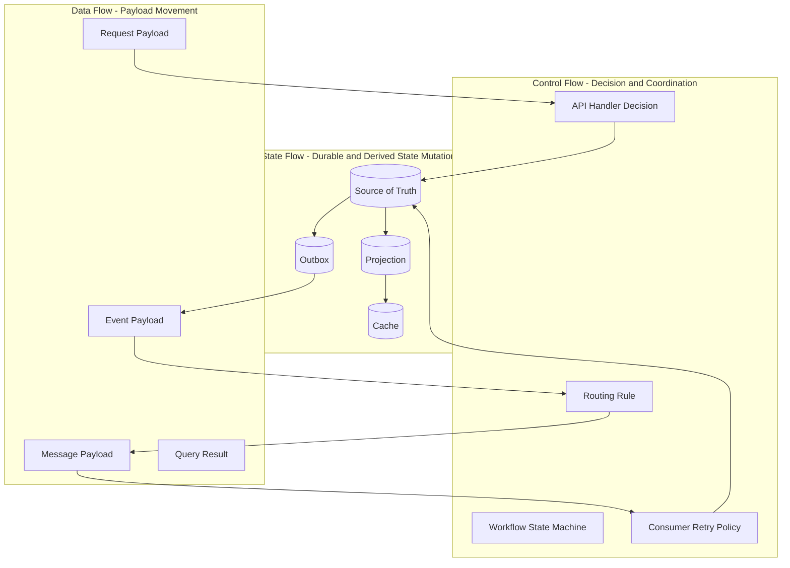
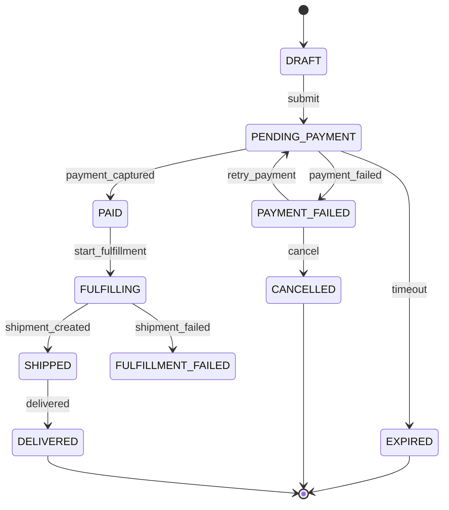
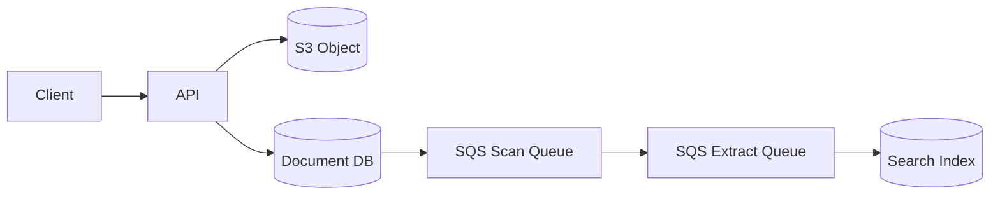
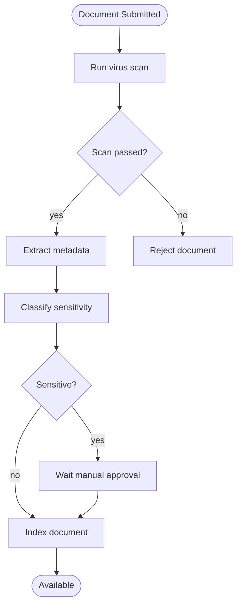
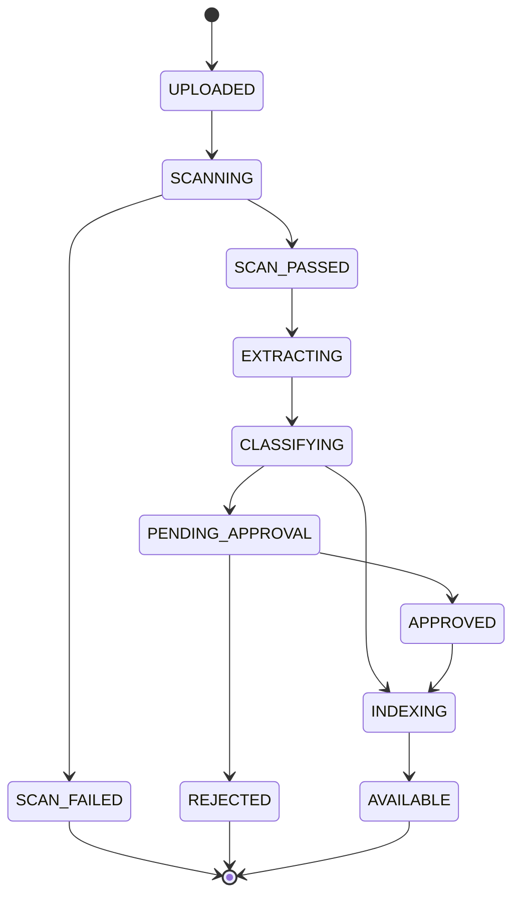
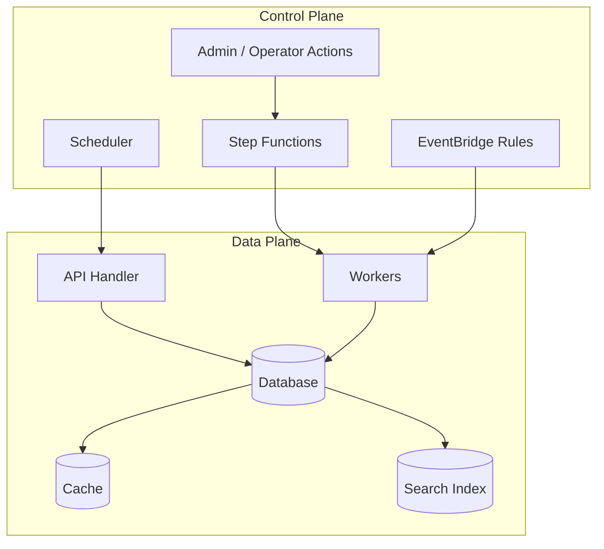
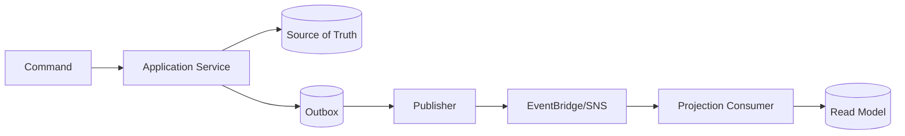
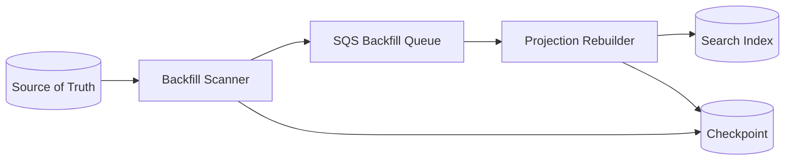
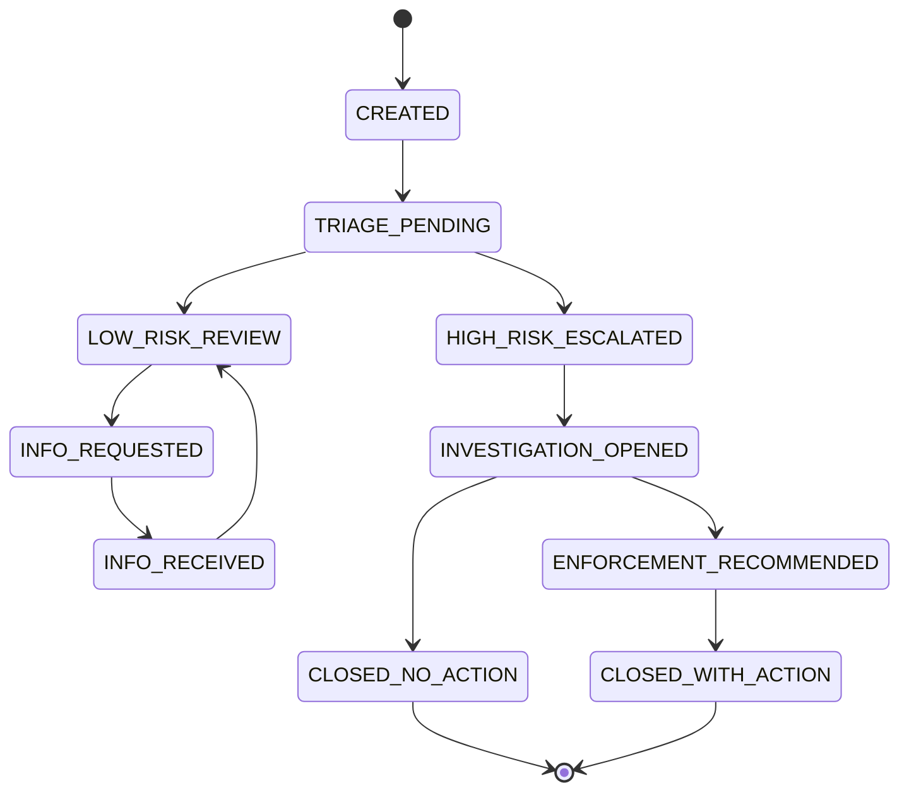

# Part 002 — Data Flow, Control Flow, State Flow: Tiga Aliran yang Harus Dipisahkan

> Banyak sistem AWS tampak rumit bukan karena domain bisnisnya rumit, tetapi karena tiga hal dicampur: data yang lewat, kontrol yang memutuskan langkah berikutnya, dan state yang menjadi kebenaran. Bagian ini memisahkan ketiganya.

Pada Part 001, kita membangun peta besar application + database sebagai satu runtime system. Sekarang kita masuk ke alat pikir yang lebih tajam:

1. **Data flow** — data bergerak dari satu tempat ke tempat lain.
2. **Control flow** — keputusan tentang langkah apa yang dijalankan berikutnya.
3. **State flow** — perubahan status yang menjadi fakta durable.

Kalau tiga aliran ini bercampur, desain menjadi sulit diuji, sulit diobservasi, sulit dipulihkan, dan sulit dimigrasikan.

---

## 1. Definisi Pendek

### Data Flow

Data flow adalah perpindahan payload.

Contoh:

- Request body dari client ke API Gateway.
- Message dari SQS ke consumer.
- Event dari service ke EventBridge.
- Record dari DynamoDB Streams ke processor.
- Query result dari Aurora ke service.
- Document metadata ke OpenSearch.

Pertanyaan data flow:

- Payload apa yang dikirim?
- Ukurannya berapa?
- Formatnya apa?
- Siapa producer dan consumer?
- Apakah payload lengkap atau hanya pointer?
- Apakah payload mengandung PII?
- Apakah payload versioned?

### Control Flow

Control flow adalah keputusan urutan eksekusi.

Contoh:

- Jika payment gagal, retry 3 kali lalu mark order failed.
- Jika dokumen classified sensitive, masuk manual approval.
- Jika inventory tidak cukup, batalkan order.
- Jika fraud score tinggi, pause shipment.
- Jika external API timeout, schedule retry dengan backoff.

Pertanyaan control flow:

- Siapa yang memutuskan langkah berikutnya?
- Apakah keputusan perlu durable?
- Apakah workflow bisa berjalan lama?
- Apakah ada compensation?
- Apakah operator perlu melihat execution history?
- Apakah langkah bisa paralel?

### State Flow

State flow adalah perubahan state canonical atau derived.

Contoh:

- `Order` berubah dari `PENDING_PAYMENT` ke `PAID`.
- `Document` berubah dari `UPLOADED` ke `SCANNED` ke `INDEXED`.
- `Payment` berubah dari `AUTHORIZED` ke `CAPTURED`.
- Cache key dibuat, diubah, expired, atau invalidated.
- Projection search di-update.

Pertanyaan state flow:

- State apa yang berubah?
- Siapa owner perubahan?
- Apa invariant transisinya?
- Apakah transisi idempotent?
- Apakah transition order penting?
- Bagaimana state dipulihkan setelah failure?

---

## 2. Kenapa Pemisahan Ini Penting?

Bayangkan satu function `submitOrder()` melakukan semua ini:

```java
public SubmitOrderResponse submitOrder(SubmitOrderRequest request) {
    validate(request);
    Order order = orderRepository.insert(request);
    inventoryClient.reserve(request.items());
    paymentClient.charge(request.paymentMethod());
    shippingClient.createShipment(order.id());
    emailClient.sendConfirmation(order.customerEmail());
    searchClient.index(order);
    return new SubmitOrderResponse(order.id(), "SUCCESS");
}
```

Di permukaan, kode ini mudah dibaca. Di production, ia menyembunyikan banyak jebakan:

- Data flow: request, order data, payment payload, shipping payload, email payload, index document.
- Control flow: validasi, reserve, charge, ship, email, index.
- State flow: order created, inventory reserved, payment charged, shipment created, email sent, search indexed.

Semua terjadi dalam satu call stack. Jika langkah ke-5 gagal, sistem harus menjawab:

- Apakah order tetap ada?
- Apakah payment sudah terjadi?
- Apakah shipment sudah dibuat?
- Apakah retry akan double charge?
- Apakah user melihat status apa?
- Apakah operator bisa melanjutkan manual?

Ketika data, control, dan state dicampur, failure handling berubah menjadi patchwork.

---

## 3. Diagram Tiga Aliran



Yang perlu diperhatikan:

- Data flow membawa informasi.
- Control flow membuat keputusan.
- State flow menyimpan fakta dan hasil keputusan.

Kalau event payload dipakai sebagai satu-satunya state, kamu kehilangan state flow yang jelas.

Kalau Step Functions menyimpan semua business state tanpa database canonical, kamu mencampur control flow dan state flow.

Kalau cache di-update langsung dari banyak handler, kamu mencampur data flow dan derived state tanpa ownership.

---

## 4. Data Flow: Mendesain Payload sebagai Contract

Data flow bukan sekadar “kirim JSON”. Payload adalah contract.

### 4.1 Jenis Payload

| Jenis payload | Tujuan | Contoh |
|---|---|---|
| Command payload | Meminta perubahan state | `SubmitOrder`, `ApproveDocument` |
| Event payload | Memberi tahu fakta terjadi | `OrderSubmitted`, `PaymentCaptured` |
| Query payload | Parameter baca | `customerId`, `orderId`, `cursor` |
| Workflow input | Input awal state machine | `documentId`, `requestedBy` |
| Work item | Unit kerja untuk worker | `paymentAttemptId`, `orderId` |
| Projection document | Bentuk baca/search | `orderSummary`, `documentSearchRecord` |

Payload yang baik tidak hanya benar secara schema. Ia juga benar secara semantik.

### 4.2 Envelope

Payload production sebaiknya punya envelope.

```json
{
  "id": "evt-01JZ6A7R4N4N5CP9G2",
  "type": "OrderSubmitted",
  "source": "order-service",
  "subject": "order/order-123",
  "time": "2026-07-06T02:45:00Z",
  "version": "1.0",
  "correlationId": "corr-abc",
  "causationId": "cmd-xyz",
  "data": {
    "orderId": "order-123",
    "customerId": "cust-789",
    "totalAmount": "125.00",
    "currency": "USD"
  }
}
```

Field penting:

| Field | Fungsi |
|---|---|
| `id` | Deduplication dan traceability |
| `type` | Routing dan semantic meaning |
| `source` | Producer ownership |
| `subject` | Aggregate/entity yang berubah |
| `time` | Waktu kejadian menurut producer |
| `version` | Compatibility dan evolution |
| `correlationId` | Menghubungkan seluruh request chain |
| `causationId` | Menjelaskan event ini akibat command/event apa |
| `data` | Business payload |

AWS EventBridge memiliki konsep event pattern dan event bus; desain envelope yang disiplin membuat routing rule lebih stabil dan consumer lebih mudah berevolusi.

### 4.3 Full Payload vs Pointer

Kadang payload kecil cukup dikirim langsung.

```json
{
  "eventType": "CustomerEmailChanged",
  "customerId": "cust-123",
  "newEmail": "new@example.com"
}
```

Kadang payload harus berupa pointer.

```json
{
  "eventType": "DocumentUploaded",
  "documentId": "doc-123",
  "objectRef": {
    "bucket": "documents-prod",
    "key": "tenant-a/doc-123/original.pdf",
    "versionId": "abc123"
  }
}
```

Gunakan pointer ketika:

- Payload besar.
- Payload binary.
- Payload sensitif dan butuh access control terpisah.
- Consumer tidak selalu butuh seluruh data.
- Data perlu lifecycle/retention sendiri.

Tetapi pointer membawa risiko:

- Object bisa berubah atau hilang jika tidak versioned.
- Consumer butuh permission tambahan.
- Replay lama bisa gagal jika object lifecycle sudah menghapus data.
- Correlation antara metadata dan object harus dijaga.

### 4.4 Data Flow Checklist

Untuk setiap payload, jawab:

- Apakah ini command, event, query, workflow input, atau work item?
- Siapa owner schema?
- Apakah perubahan additive atau breaking?
- Apakah payload punya ID unik?
- Apakah payload bisa diproses dua kali?
- Apakah payload mengandung data sensitif?
- Apakah payload terlalu besar untuk transport?
- Apakah payload bisa direplay 30 hari kemudian?
- Apakah consumer butuh data saat kejadian atau data terbaru?

Pertanyaan terakhir sangat penting.

Event `OrderSubmitted` sebaiknya memuat fakta saat order disubmit. Jika consumer harus query database untuk semua field, replay event lama bisa menghasilkan interpretasi berdasarkan state baru, bukan state saat kejadian.

---

## 5. Control Flow: Siapa Memutuskan Langkah Berikutnya?

Control flow sering tersembunyi di kode service.

Contoh:

```java
if (paymentSuccess) {
    shipmentClient.createShipment(orderId);
} else if (retryableFailure) {
    queue.enqueueRetry(orderId);
} else {
    orderRepository.markPaymentFailed(orderId);
}
```

Ini tidak salah. Untuk proses pendek dan transactional, control flow di application code masuk akal.

Tetapi ketika proses menjadi panjang, asynchronous, dan multi-step, control flow yang tersebar menjadi sulit dioperasikan.

### 5.1 Control Flow di API Handler

Cocok untuk:

- Validasi request.
- Authorization decision.
- Mapping request ke command.
- Fast rejection.
- Transaction pendek.

Tidak cocok untuk:

- Menunggu proses lama.
- Menunggu banyak external dependency.
- Retry panjang.
- Human approval.
- Compensation multi-step.

### 5.2 Control Flow di Worker

Cocok untuk:

- Unit kerja spesifik.
- Retry terhadap dependency tertentu.
- Processing batch.
- Consuming queue/event.

Risiko:

- Jika worker memutuskan terlalu banyak hal, workflow tersebar.
- Sulit melihat end-to-end progress.
- Compensation tersebar antar worker.

### 5.3 Control Flow di Event Routing

EventBridge rule atau SNS filtering dapat menentukan routing.

Cocok untuk:

- Mengirim event ke consumer yang relevan.
- Mengurangi routing logic di producer.
- Integrasi antar service/account.

Tidak cocok untuk:

- Business process yang butuh state kompleks.
- Urutan langkah yang harus eksplisit.
- Compensation logic.

### 5.4 Control Flow di Workflow Engine

Step Functions cocok ketika control flow perlu durable dan terlihat.

Cocok untuk:

- Long-running process.
- Multi-step orchestration.
- Retry/catch eksplisit.
- Parallel branch.
- Human/external callback pattern.
- Execution history untuk audit operational.

Tidak cocok untuk:

- Query request sederhana.
- Transaction kecil dalam satu database.
- Business rules yang lebih natural berada di domain model.
- High-throughput tiny operation tanpa kebutuhan orchestration.

### 5.5 Control Flow Decision Table

| Karakteristik proses | Tempat control flow yang umum masuk akal |
|---|---|
| Satu transaction pendek | Application service method |
| Satu async task retryable | Worker + queue retry/DLQ |
| Fanout event ke banyak consumer | EventBridge/SNS routing |
| Proses multi-step dan long-running | Step Functions |
| Perlu human approval | Step Functions + callback/task token + DB state |
| Perlu compensation eksplisit | Step Functions atau orchestrator application-level |
| Consumer independen bereaksi pada fakta | Event-driven choreography |
| Urutan global harus jelas | Orchestration, bukan event soup |

---

## 6. State Flow: Transisi yang Harus Dibuktikan Benar

State flow adalah bagian paling penting karena ia menentukan kebenaran sistem.

Ambil contoh order state machine:



Setiap transisi harus punya aturan:

| Dari | Ke | Trigger | Guard | Side effect? |
|---|---|---|---|---|
| `DRAFT` | `PENDING_PAYMENT` | submit command | items valid | publish order submitted |
| `PENDING_PAYMENT` | `PAID` | payment captured | capture id unique | publish payment captured |
| `PENDING_PAYMENT` | `PAYMENT_FAILED` | payment failed | attempt final/retryable evaluated | maybe notify |
| `PAID` | `FULFILLING` | fulfillment command | order paid | create shipment |
| `FULFILLING` | `SHIPPED` | shipment created | shipment id unique | publish shipped |
| `PENDING_PAYMENT` | `EXPIRED` | timeout | no successful payment | release reservation |

State transition harus ditulis sebagai data, bukan hanya if-else tersebar.

### 6.1 State Transition Guard

Guard adalah syarat sebelum transisi boleh terjadi.

Contoh SQL:

```sql
UPDATE orders
SET status = 'PAID',
    payment_capture_id = :capture_id,
    updated_at = now()
WHERE id = :order_id
  AND status = 'PENDING_PAYMENT'
  AND payment_capture_id IS NULL;
```

Jika affected row = 0, transisi tidak valid atau sudah pernah diproses.

Ini adalah bentuk idempotency dan concurrency control sederhana.

Contoh DynamoDB condition write:

```json
{
  "UpdateExpression": "SET #status = :paid, paymentCaptureId = :captureId, updatedAt = :now",
  "ConditionExpression": "#status = :pending AND attribute_not_exists(paymentCaptureId)",
  "ExpressionAttributeNames": {
    "#status": "status"
  },
  "ExpressionAttributeValues": {
    ":pending": "PENDING_PAYMENT",
    ":paid": "PAID",
    ":captureId": "cap-123",
    ":now": "2026-07-06T03:00:00Z"
  }
}
```

State flow bukan konsep abstrak. Ia muncul langsung sebagai `WHERE` clause, condition expression, uniqueness constraint, optimistic lock, transaction, dan event version.

---

## 7. Tiga Aliran pada Use Case Dokumen

Requirement:

> User upload dokumen. Sistem melakukan scan, ekstraksi metadata, klasifikasi sensitivitas, approval manual jika perlu, indexing search, dan user melihat progress.

### 7.1 Data Flow



Payload yang lewat:

- Upload metadata.
- Object pointer.
- Scan work item.
- Extraction work item.
- Index document.

### 7.2 Control Flow



Ini terlihat seperti Step Functions candidate karena:

- Multi-step.
- Ada decision branch.
- Ada wait/manual approval.
- Ada failure state.
- User perlu progress.
- Operator perlu tahu execution stuck di mana.

### 7.3 State Flow



Perhatikan perbedaan:

- Data flow: object dan payload bergerak.
- Control flow: urutan scan/extract/classify/approval/index.
- State flow: status document berubah secara durable.

Dalam implementasi yang matang, Step Functions boleh menjadi control plane, tetapi database tetap menyimpan document status canonical untuk query, audit, dan recovery.

---

## 8. Pattern: Control Plane vs Data Plane

Istilah ini berguna.

### Data Plane

Data plane memproses unit kerja utama.

Contoh:

- API menerima request.
- Worker memproses message.
- Database melayani query.
- Cache melayani read.
- Search index melayani search.

Data plane harus cepat, bounded, dan measurable.

### Control Plane

Control plane mengatur konfigurasi, koordinasi, lifecycle, dan keputusan.

Contoh:

- Step Functions mengatur workflow.
- EventBridge rule mengatur routing.
- Scheduler memicu periodic command.
- Admin operation menjalankan replay/backfill.
- Deployment pipeline menjalankan migration.

Control plane tidak boleh diam-diam menjadi bottleneck data plane tanpa disadari.



Kesalahan umum:

- Menaruh high-throughput per-request operation di workflow yang tidak perlu.
- Menaruh business state hanya di execution history.
- Menjalankan backfill lewat jalur API normal tanpa throttle.
- Membiarkan replay event membanjiri database.

---

## 9. Pattern: Source of Truth + Outbox + Projection

Ini salah satu pattern inti application/database.



Tiga aliran:

| Aliran | Di mana terjadi? | Tujuan |
|---|---|---|
| Data flow | Event payload dari outbox ke bus ke consumer | Membawa fakta perubahan |
| Control flow | Publisher retry, bus routing, consumer handling | Mengatur pengiriman/pemrosesan |
| State flow | DB transaction, outbox row, read model update | Menyimpan canonical dan derived state |

Kenapa outbox penting?

Karena database commit dan event publish tidak berada dalam satu atomic transaction. Tanpa outbox, kamu bisa punya state berubah tetapi event tidak pernah dikirim, atau event terkirim saat state belum commit.

Outbox bukan silver bullet. Ia menambah:

- tabel/collection tambahan,
- publisher process,
- deduplication,
- cleanup/retention,
- monitoring unpublished row,
- replay discipline.

Tetapi untuk banyak sistem transactional event-driven, trade-off ini masuk akal.

---

## 10. Pattern: State Machine di Database

Bahkan jika kamu memakai Step Functions, business entity tetap sering butuh state machine di database.

Contoh tabel:

```sql
CREATE TABLE document_status_history (
    id BIGSERIAL PRIMARY KEY,
    document_id UUID NOT NULL,
    from_status TEXT,
    to_status TEXT NOT NULL,
    transition_reason TEXT NOT NULL,
    causation_id TEXT NOT NULL,
    actor_type TEXT NOT NULL,
    actor_id TEXT,
    created_at TIMESTAMPTZ NOT NULL DEFAULT now()
);
```

Tabel current state:

```sql
CREATE TABLE documents (
    id UUID PRIMARY KEY,
    tenant_id UUID NOT NULL,
    status TEXT NOT NULL,
    object_key TEXT NOT NULL,
    object_version TEXT,
    classification TEXT,
    version BIGINT NOT NULL DEFAULT 0,
    created_at TIMESTAMPTZ NOT NULL,
    updated_at TIMESTAMPTZ NOT NULL
);
```

Transition update:

```sql
UPDATE documents
SET status = :to_status,
    version = version + 1,
    updated_at = now()
WHERE id = :document_id
  AND status = :expected_from_status
  AND version = :expected_version;
```

Ini memberikan:

- optimistic concurrency,
- idempotency basis,
- audit trail,
- legal/regulatory defensibility,
- recovery anchor.

Untuk regulatory/case-management style systems, status history bukan “nice to have”. Ia sering menjadi bukti mengapa keputusan terjadi.

---

## 11. Cara Menentukan Apa yang Harus Durable

Tidak semua state perlu database. Tetapi state yang salah tempat akan menyakiti sistem.

Gunakan pertanyaan berikut:

1. Apakah state ini menentukan keputusan bisnis?
2. Apakah state ini harus bertahan setelah restart?
3. Apakah state ini harus bisa diaudit?
4. Apakah state ini perlu restore?
5. Apakah state ini perlu dimigrasikan?
6. Apakah state ini perlu query oleh user/admin?
7. Apakah state ini mempengaruhi uang, akses, kepatuhan, atau hak pengguna?
8. Apakah kehilangan state ini menyebabkan side effect ganda?

Jika banyak jawaban “ya”, state itu harus durable dan dimodelkan dengan serius.

Contoh:

| State | Durable? | Alasan |
|---|---:|---|
| Idempotency record untuk payment command | Ya | Mencegah double charge |
| Current order status | Ya | Business truth |
| Email send attempt count | Biasanya ya | Retry/reconciliation/audit |
| Temporary UI loading state | Tidak | Client concern |
| Cache hasil query catalog | Tidak, jika rebuildable | Derived optimization |
| Step execution pointer | Ya, jika workflow engine mengelola | Control state |
| Fraud decision reason | Ya | Audit dan explainability |

---

## 12. Consistency Contract per Flow

Setiap flow punya consistency contract berbeda.

### Command Path

Command path biasanya butuh consistency lebih kuat.

Contoh:

- Submit order tidak boleh membuat duplicate order.
- Approve case tidak boleh terjadi jika case sudah closed.
- Capture payment tidak boleh double.

Gunakan:

- DB transaction.
- Unique constraint.
- Conditional write.
- Optimistic locking.
- Idempotency table.

### Query Path

Query path bisa punya pilihan:

- Strong read dari source of truth.
- Eventually consistent read dari projection.
- Stale read dari cache.

Yang penting: caller tahu contract-nya.

Contoh response:

```json
{
  "orderId": "order-123",
  "status": "PENDING_PAYMENT",
  "lastUpdatedAt": "2026-07-06T03:10:00Z",
  "consistency": "SOURCE_OF_TRUTH"
}
```

Atau untuk read model:

```json
{
  "results": [ ... ],
  "readModelAsOf": "2026-07-06T03:09:40Z",
  "consistency": "EVENTUAL"
}
```

Tidak semua API perlu mengekspos field seperti ini. Tetapi tim harus mengetahui contract internalnya.

### Event Path

Event path biasanya eventual.

Consumer harus mengasumsikan:

- Event bisa terlambat.
- Event bisa duplicate.
- Event bisa tidak relevan lagi karena state sudah maju.
- Consumer bisa perlu version check.

### Workflow Path

Workflow path adalah control consistency.

Pertanyaan:

- Apakah workflow state dan DB state bisa diverge?
- Siapa yang menang jika workflow mengatakan `APPROVED`, tetapi DB mengatakan `REJECTED`?
- Bagaimana recovery jika workflow execution hilang/gagal/stuck?
- Apakah workflow restart aman?

Prinsip:

> Workflow mengatur proses. Database menyimpan kebenaran bisnis yang harus dapat dipertanggungjawabkan.

---

## 13. Failure Mode Jika Flow Dicampur

### 13.1 Event sebagai Command Tersembunyi

Event:

```json
{
  "eventType": "OrderSubmitted",
  "action": "CHARGE_PAYMENT_NOW"
}
```

Masalah:

- Nama event mengatakan fakta, field mengatakan instruksi.
- Producer tahu apa yang harus dilakukan consumer.
- Consumer baru bisa salah menafsirkan action.

Lebih baik:

- Event: `OrderSubmitted`.
- Payment service memutuskan apakah event itu relevan.
- Jika perlu command eksplisit, gunakan command/work item seperti `ChargePayment` ke queue/payment workflow.

### 13.2 Workflow State sebagai Satu-satunya Business State

Jika user bertanya status order, sistem membaca Step Functions execution history.

Masalah:

- Query bisnis bergantung pada execution internals.
- Migration sulit.
- Reporting sulit.
- Recovery dan audit domain menjadi kabur.

Lebih baik:

- Workflow menyimpan control state.
- Order database menyimpan business state.
- Execution ARN/ID boleh disimpan sebagai correlation.

### 13.3 Cache Menjadi Write Model

Service A menulis DB. Service B menulis cache. Service C membaca cache untuk keputusan bisnis.

Masalah:

- Cache tidak lagi derived.
- Invalidation tidak jelas.
- Source of truth kabur.

Lebih baik:

- Cache diisi dari source of truth/projection owner.
- Decision bisnis penting membaca DB atau read model dengan consistency contract jelas.

### 13.4 Queue Message Menjadi Database

Queue menyimpan semua pekerjaan pending tanpa state canonical di DB.

Masalah:

- Sulit query progress.
- Sulit audit.
- Message retention terbatas.
- DLQ menjadi kuburan tanpa context.
- Reconciliation sulit.

Lebih baik:

- Queue membawa work item.
- DB menyimpan job/order/document status.
- Worker update status idempotently.

---

## 14. Implementation Skeleton: Submit Command dengan Flow Terpisah

Pseudo-code berikut menunjukkan pemisahan yang lebih sehat.

```java
public SubmitOrderResponse submitOrder(SubmitOrderRequest req) {
    RequestContext ctx = RequestContext.current();

    validateContract(req);

    return transaction.execute(() -> {
        IdempotencyRecord idem = idempotencyRepository.findOrCreate(
            req.customerId(),
            req.idempotencyKey(),
            hash(req)
        );

        if (idem.isCompleted()) {
            return idem.toResponse();
        }

        Order order = Order.submit(
            req.customerId(),
            req.items(),
            ctx.actor(),
            ctx.correlationId()
        );

        orderRepository.save(order);

        outboxRepository.save(EventEnvelope.of(
            "OrderSubmitted",
            "order-service",
            "order/" + order.id(),
            ctx.correlationId(),
            req.commandId(),
            Map.of(
                "orderId", order.id(),
                "customerId", order.customerId(),
                "amount", order.totalAmount()
            )
        ));

        idem.markCompleted(order.id());

        return new SubmitOrderResponse(order.id(), order.status());
    });
}
```

Perhatikan:

- API handler tidak charge payment.
- DB transaction menyimpan order + outbox + idempotency result.
- Event publish terjadi setelah commit oleh publisher terpisah.
- Response mengakui status awal, bukan hasil semua side effect.

Publisher:

```java
public void publishOutboxBatch() {
    List<OutboxEvent> events = outboxRepository.lockNextBatch(100);

    for (OutboxEvent event : events) {
        try {
            eventBus.publish(event.toEventBridgeEntry());
            outboxRepository.markPublished(event.id());
        } catch (TransientException e) {
            outboxRepository.markAttemptFailed(event.id(), e.message());
        }
    }
}
```

Consumer:

```java
public void handleOrderSubmitted(EventEnvelope event) {
    String eventId = event.id();
    String orderId = event.data().get("orderId");

    if (processedEventRepository.alreadyProcessed(eventId)) {
        return;
    }

    transaction.execute(() -> {
        Order order = orderRepository.find(orderId);

        if (!order.isPendingPayment()) {
            processedEventRepository.markProcessed(eventId);
            return;
        }

        paymentQueue.enqueue(new ChargePaymentWorkItem(
            order.id(),
            order.paymentAttemptId(),
            event.correlationId()
        ));

        processedEventRepository.markProcessed(eventId);
    });
}
```

Ini tidak sempurna untuk semua use case, tetapi menunjukkan disiplin:

- Data flow: event/work item.
- Control flow: publisher/consumer/queue decision.
- State flow: order status dan processed event record.

---

## 15. Designing Status for Humans and Machines

Status bukan hanya enum. Status adalah contract antara sistem dan manusia.

Status buruk:

```txt
PROCESSING
```

Masalah:

- Processing apa?
- Sudah sampai langkah mana?
- Apakah retry terjadi?
- Apakah butuh tindakan manusia?
- Apakah stuck?

Status lebih baik:

```txt
PENDING_PAYMENT
PAYMENT_RETRY_SCHEDULED
PAYMENT_FAILED_REQUIRES_ACTION
PENDING_FULFILLMENT
FULFILLMENT_RETRY_SCHEDULED
PENDING_MANUAL_REVIEW
COMPLETED
CANCELLED
EXPIRED
```

Tapi terlalu banyak status juga bisa merusak.

Rule of thumb:

- Status harus merepresentasikan meaningful business state.
- Attempt/retry detail bisa berada di tabel attempt/history.
- Jangan membuat status untuk setiap detail teknis kecil.
- Status harus punya owner dan transition rule.

Contoh pemisahan:

```sql
orders
- id
- status
- payment_status
- fulfillment_status
- version

payment_attempts
- id
- order_id
- provider
- status
- attempt_number
- idempotency_key
- last_error
- created_at
- updated_at

order_status_history
- order_id
- from_status
- to_status
- reason
- actor
- causation_id
- created_at
```

Ini lebih fleksibel daripada satu enum raksasa yang mencoba menjelaskan semua dimensi.

---

## 16. Flow-Aware Observability

Observability harus mengikuti tiga flow.

### Data Flow Metrics

- payload size
- event publish count
- event publish failure
- message receive count
- malformed payload count
- schema validation failure
- consumer deserialization failure

### Control Flow Metrics

- workflow execution started/succeeded/failed/timed out
- retry count per step
- branch decision count
- compensation count
- stuck workflow count
- scheduled retry delay

### State Flow Metrics

- successful transition count
- invalid transition attempt
- optimistic lock conflict
- idempotency replay count
- duplicate event ignored
- projection lag
- cache hit/miss/stale rate

### Business Flow Metrics

- order pending payment over threshold
- document stuck in scanning
- approval older than SLA
- payment captured but order not paid
- shipment created before payment captured

Sistem yang matang tidak hanya bertanya “apakah Lambda error?”. Ia bertanya “apakah invariant bisnis masih benar?”.

---

## 17. Backfill dan Replay: Ujian Pemisahan Flow

Desain yang baik biasanya terlihat saat backfill/replay.

Misalnya kita perlu rebuild search index untuk 50 juta dokumen.

Jika flow tercampur:

- Rebuild memanggil API normal.
- API mengirim email lagi.
- Workflow approval terpicu ulang.
- Payment atau external side effect ikut terpanggil.
- Operator takut menjalankan replay.

Jika flow dipisah:

- Backfill membaca source of truth.
- Backfill membuat projection document.
- Backfill tidak menjalankan command bisnis.
- Backfill tidak memicu side effect eksternal.
- Backfill punya throttle sendiri.
- Backfill punya checkpoint.

Backfill pattern:



Checklist replay/backfill:

- Apakah replay menjalankan side effect?
- Apakah replay idempotent?
- Apakah replay bisa di-pause?
- Apakah replay punya rate limit?
- Apakah replay mencemari metric production?
- Apakah replay memicu alarm palsu?
- Apakah replay mempertahankan ordering yang dibutuhkan?
- Apakah replay membaca snapshot atau live mutable state?

---

## 18. Applying This to AWS Services

### API Gateway / AppSync

Biasanya berada di data flow dan sedikit control flow:

- menerima payload,
- validasi contract,
- auth context,
- rate limit/throttle,
- mapping request,
- response shaping.

Jangan menjadikan API boundary sebagai tempat long-running state.

### SQS

SQS berada di data flow dengan control semantics untuk delivery/retry.

- message membawa work item,
- visibility timeout mengontrol kapan message muncul lagi,
- DLQ menyimpan message yang gagal berulang,
- consumer tetap bertanggung jawab atas idempotency.

SQS bukan source of truth.

### SNS

SNS terutama data flow fanout.

- topic menerima message,
- subscription menentukan penerima,
- filter policy membantu routing sederhana.

SNS bukan workflow engine.

### EventBridge

EventBridge berada di data flow + routing control.

- event bus menerima event,
- rule mencocokkan pattern,
- target menerima event,
- archive/replay bisa membantu recovery/event reprocessing.

EventBridge bukan pengganti data model dan bukan tempat menyimpan business state canonical.

### Step Functions

Step Functions adalah control flow durable.

- state machine mengekspresikan urutan,
- retry/catch/timeout terlihat,
- execution history membantu operasi,
- service integration mengurangi glue code.

Step Functions bukan pengganti semua domain logic dan bukan database canonical untuk entity bisnis.

### RDS/Aurora/DynamoDB/DSQL

Database adalah state flow utama.

- menyimpan source of truth,
- menjaga constraint/condition,
- memberi transaction atau conditional update,
- menjadi basis restore,
- menjadi anchor audit.

Database bukan message bus.

### ElastiCache/MemoryDB

Cache/in-memory store berada di low-latency state flow.

- cache-aside,
- session state,
- rate limiting,
- distributed coordination tertentu,
- hot data optimization.

Cache harus jelas apakah derived state atau primary durable state. MemoryDB bisa menjadi durable in-memory store, tetapi tetap perlu diperlakukan sebagai state store, bukan sekadar cache.

---

## 19. Flow Design Worksheet

Gunakan worksheet ini sebelum menulis implementasi.

### 19.1 Command

```txt
Command name:
Caller:
Synchronous response needed:
Idempotency key:
Validation rules:
State changed:
External side effects:
Timeout budget:
Retry policy:
```

### 19.2 Event

```txt
Event name:
Producer:
Why this is a fact:
Aggregate/entity:
Schema version:
Required fields:
Optional fields:
Retention/replay expectation:
Consumer idempotency rule:
```

### 19.3 Workflow

```txt
Workflow name:
Start trigger:
Steps:
Branch decisions:
Timeouts:
Retryable failures:
Terminal failures:
Compensation:
Human approval:
Canonical DB state fields:
Execution correlation:
```

### 19.4 State

```txt
Entity:
Source of truth:
Owner service:
Allowed states:
Allowed transitions:
Transition guards:
Concurrency control:
Audit/history:
Restore strategy:
Projection rebuild strategy:
```

---

## 20. Mini Case: Regulatory Case Escalation

Karena banyak sistem enterprise/regulatory berbasis lifecycle, kita bedah contoh case management.

Requirement:

- Case dibuat dari laporan.
- Case dinilai severity-nya.
- Jika high risk, eskalasi ke investigator senior.
- Jika butuh data tambahan, kirim request ke pihak eksternal.
- SLA harus dihitung.
- Semua keputusan harus audit-able.

### Data Flow

- Report payload masuk.
- Case created event dikirim.
- Work item risk scoring dibuat.
- External data request payload dikirim.
- Evidence metadata disimpan.

### Control Flow

- Risk scoring menentukan path.
- SLA timer menentukan escalation.
- Manual decision menentukan close/escalate/request info.
- Workflow mengatur pending external response.

### State Flow



Invariant:

- Case tidak bisa closed jika mandatory evidence belum reviewed.
- High-risk case tidak boleh ditutup oleh reviewer junior.
- SLA breach harus tercatat sebagai event/status history.
- External request tidak boleh dikirim dua kali untuk requirement yang sama kecuali explicitly reissued.
- Semua transition harus menyimpan actor, reason, dan causation.

Mapping AWS awal:

- API Gateway/AppSync untuk case commands dan query.
- Aurora/RDS atau DynamoDB untuk case source of truth, tergantung query/transaction model.
- Step Functions untuk long-running escalation/external request workflow.
- EventBridge untuk domain events seperti `CaseEscalated`, `SlaBreached`, `EvidenceReceived`.
- SQS untuk asynchronous workers seperti scoring/indexing/notification.
- OpenSearch sebagai projection untuk search case/evidence, bukan source of truth.

Ini contoh di mana pemisahan flow bukan akademis. Ia menentukan defensibility.

---

## 21. Common Design Reviews Questions

Ketika melakukan review desain, tanyakan:

1. Apa yang terjadi jika request timeout setelah state berubah?
2. Apa yang terjadi jika event yang sama diproses dua kali?
3. Apa yang terjadi jika event lama diproses setelah state lebih baru?
4. Apa yang terjadi jika workflow step sukses tetapi database update gagal?
5. Apa yang terjadi jika database update sukses tetapi event publish gagal?
6. Apa yang terjadi jika cache berhasil update tetapi DB gagal?
7. Apa yang terjadi jika search index tertinggal 15 menit?
8. Apa yang terjadi jika DLQ berisi 1 juta message?
9. Apa yang terjadi jika replay event memicu email ulang?
10. Apa yang terjadi jika operator perlu membuktikan siapa mengubah status dan kenapa?

Jika desain tidak bisa menjawab, desain belum production-ready.

---

## 22. Ringkasan Part 002

Kita memisahkan tiga aliran:

- **Data flow**: payload bergerak.
- **Control flow**: langkah diputuskan dan dikoordinasikan.
- **State flow**: fakta durable berubah.

Pemisahan ini membantu kita:

- memilih AWS service berdasarkan fungsi,
- menghindari event soup,
- menulis state machine yang bisa diaudit,
- membuat retry dan replay aman,
- membangun projection tanpa mencemari source of truth,
- mendesain workflow tanpa menjadikannya database tersembunyi,
- mengobservasi sistem berdasarkan invariant, bukan hanya error teknis.

Kalimat kunci:

> **Data flow membawa informasi, control flow menentukan langkah, state flow menjaga kebenaran. Jangan biarkan satu mekanisme memikul tiga tanggung jawab tanpa sadar.**

---

## 23. Checklist Selesai Part 002

Kamu siap lanjut jika bisa menjawab:

- Apakah sebuah payload adalah command, event, query, workflow input, atau work item?
- Siapa owner schema payload?
- Siapa owner state transition?
- Apa beda control state dan business state?
- Kapan Step Functions cocok sebagai control plane?
- Kenapa SQS bukan source of truth?
- Kenapa EventBridge bukan database?
- Kenapa cache harus punya stale/ownership contract?
- Bagaimana outbox memisahkan DB commit dari event publish?
- Bagaimana backfill/replay menguji kualitas desain flow?

---

## Referensi Resmi dan Bacaan Utama

- AWS Prescriptive Guidance: Amazon EventBridge for microservices integration — https://docs.aws.amazon.com/prescriptive-guidance/latest/modernization-integrating-microservices/eventbridge.html
- AWS Prescriptive Guidance: Orchestration — https://docs.aws.amazon.com/prescriptive-guidance/latest/modernization-integrating-microservices/orchestration.html
- AWS Step Functions: Integrating services — https://docs.aws.amazon.com/step-functions/latest/dg/integrate-services.html
- AWS Step Functions: Add EventBridge events — https://docs.aws.amazon.com/step-functions/latest/dg/connect-eventbridge.html
- AWS Well-Architected Framework — https://docs.aws.amazon.com/wellarchitected/latest/framework/welcome.html
- AWS Reliability Pillar — https://docs.aws.amazon.com/wellarchitected/latest/reliability-pillar/welcome.html
- AWS Prescriptive Guidance: Retry with backoff pattern — https://docs.aws.amazon.com/prescriptive-guidance/latest/cloud-design-patterns/retry-backoff.html
- Amazon Builders' Library: Making retries safe with idempotent APIs — https://aws.amazon.com/builders-library/making-retries-safe-with-idempotent-APIs/
- Amazon Builders' Library: Timeouts, retries, and backoff with jitter — https://aws.amazon.com/builders-library/timeouts-retries-and-backoff-with-jitter/
- Amazon Builders' Library: Avoiding insurmountable queue backlogs — https://aws.amazon.com/builders-library/avoiding-insurmountable-queue-backlogs/
- Amazon Builders' Library: Instrumenting distributed systems for operational visibility — https://aws.amazon.com/builders-library/instrumenting-distributed-systems-for-operational-visibility/
