# Part 003 — Coupling Taxonomy: Synchronous, Asynchronous, State, Schema, Temporal, Operational

> Sistem distributed jarang gagal hanya karena satu service mati. Sistem biasanya gagal karena **hubungan antar komponen terlalu rapat di tempat yang salah**. Coupling bukan selalu buruk. Coupling adalah biaya koordinasi. Tugas engineer adalah memilih coupling yang eksplisit, terukur, dan bisa dipulihkan ketika gagal.

Bagian sebelumnya memisahkan **data flow**, **control flow**, dan **state flow**. Sekarang kita masuk ke taxonomy coupling: cara membaca jenis ikatan antar komponen sebelum memilih API Gateway, SQS, SNS, EventBridge, Step Functions, Aurora, DynamoDB, cache, atau pattern lain.

Kalau bagian ini dipahami dengan benar, keputusan arsitektur berikutnya akan jauh lebih tajam:

- kapan direct API call masih masuk akal;
- kapan queue lebih tepat daripada event bus;
- kapan event-driven membuat sistem lebih kuat;
- kapan event-driven justru menyembunyikan bug consistency;
- kapan database bersama masih pragmatis;
- kapan schema versioning wajib;
- kapan workflow engine dibutuhkan;
- kapan service baru hanya menambah operational surface tanpa menyelesaikan masalah.

---

## 1. Coupling: Definisi yang Bisa Dipakai di Production

**Coupling** adalah derajat ketergantungan satu komponen terhadap komponen lain agar sebuah operasi bisnis bisa berhasil.

Definisi ini sengaja practical. Dalam production, coupling bukan diskusi estetika software design. Coupling menentukan:

- apakah caller ikut gagal saat callee lambat;
- apakah deployment satu service memaksa deployment service lain;
- apakah schema change memecahkan consumer;
- apakah retry aman;
- apakah data bisa direplay;
- apakah incident bisa diisolasi;
- apakah tim bisa mengubah sistem tanpa koordinasi besar;
- apakah audit trail masih bisa dipercaya.

AWS Well-Architected Reliability Pillar menyarankan desain loosely coupled karena dependency seperti queue, streaming system, workflow, dan load balancer dapat membantu mengisolasi behavior antar komponen. Tetapi “loosely coupled” bukan berarti “semua harus async”. Loose coupling berarti **failure dan perubahan tidak menyebar tanpa kontrol**.

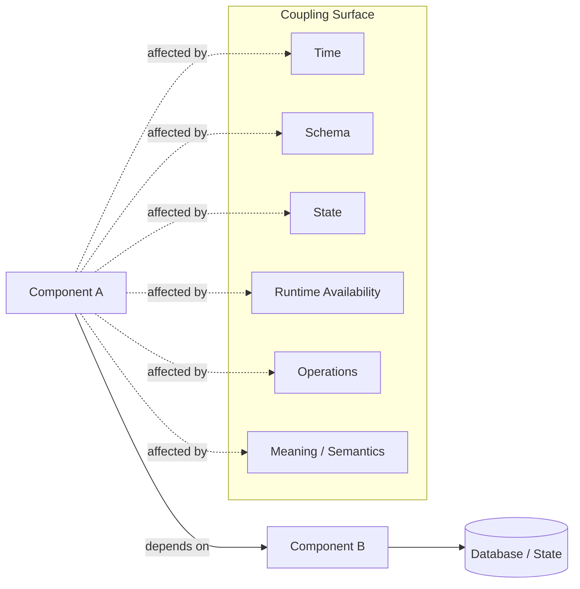

Mental model paling penting:

> Coupling tidak hilang. Ia hanya berpindah bentuk.

Contoh:

- Mengganti direct API call dengan SQS mengurangi runtime availability coupling, tetapi menambah temporal coupling dan replay responsibility.
- Mengganti shared database dengan domain event mengurangi state coupling, tetapi menambah schema/versioning coupling pada event contract.
- Mengganti distributed transaction dengan saga mengurangi database transaction coupling, tetapi menambah workflow state dan compensation coupling.
- Menggunakan cache mengurangi read latency coupling ke database, tetapi menambah staleness dan invalidation coupling.

Arsitek yang kuat tidak berkata “async lebih baik”. Ia bertanya:

```txt
Coupling apa yang sedang saya kurangi?
Coupling apa yang sedang saya tambahkan?
Siapa yang akan membayar biaya operational-nya?
```

---

## 2. Taxonomy Coupling Utama

Kita akan menggunakan taxonomy berikut sepanjang seri.

| Jenis Coupling | Pertanyaan Diagnostik | Gejala Buruk | AWS Surface yang Relevan |
|---|---|---|---|
| Runtime coupling | Apakah A harus melihat B hidup saat operasi berjalan? | cascading failure, timeout storm | API Gateway, ALB, Lambda, ECS/EKS, AppSync |
| Temporal coupling | Apakah producer dan consumer harus aktif pada waktu yang sama? | request gagal karena consumer down | SQS, EventBridge, SNS, Step Functions |
| Throughput coupling | Apakah kecepatan producer dipaksa sama dengan consumer? | overload, backlog tak terkendali | SQS, Kinesis, Lambda concurrency, autoscaling |
| Schema coupling | Apakah format data harus berubah serentak? | consumer break setelah deploy | OpenAPI, EventBridge Schema Registry, JSON Schema, Avro/Protobuf |
| Semantic coupling | Apakah meaning field dipahami berbeda? | data valid secara schema tapi salah bisnis | domain contract, ADR, event catalog |
| State coupling | Apakah dua service membaca/menulis state yang sama? | lost update, hidden invariant violation | RDS/Aurora, DynamoDB, cache, outbox |
| Transaction coupling | Apakah operasi butuh commit atomik lintas boundary? | partial commit, compensating mess | RDS transaction, DynamoDB transaction, Step Functions saga |
| Consistency coupling | Apakah caller butuh read-your-writes atau global consistency? | stale decision, duplicate approval | Aurora, DSQL, DynamoDB consistency modes, cache invalidation |
| Ordering coupling | Apakah urutan event/message penting? | state machine lompat, event lama overwrite baru | SQS FIFO, DynamoDB conditional write, sequence number |
| Deployment coupling | Apakah deploy A harus sinkron dengan B? | release train besar, rollback sulit | API versioning, event versioning, feature flag |
| Operational coupling | Apakah incident A memaksa operator B ikut debugging? | blast radius besar | CloudWatch, X-Ray, DLQ, runbook, ownership |
| Security coupling | Apakah trust boundary bercampur? | privilege leakage, confused deputy | IAM, resource policy, KMS, VPC endpoint |
| Cost coupling | Apakah satu komponen dapat membuat biaya komponen lain meledak? | retry storm, event fanout cost spike | API throttling, SQS backlog, EventBridge rules, DB capacity |

Taxonomy ini bukan teori. Ini checklist desain.

Ketika sebuah request masuk, tanyakan:

1. Komponen mana yang harus hidup saat itu?
2. State mana yang berubah?
3. Siapa yang boleh mengubah state itu?
4. Kontrak apa yang harus tetap kompatibel?
5. Apa yang terjadi jika consumer lambat?
6. Apa yang terjadi jika message diproses dua kali?
7. Apa yang terjadi jika event terlambat?
8. Apa yang terjadi jika schema producer berubah lebih dulu?
9. Apa yang terjadi jika data lama direplay hari ini?
10. Tim mana yang menerima pager saat ini gagal?

---

## 3. Runtime Coupling

Runtime coupling terjadi ketika satu komponen butuh komponen lain tersedia saat operasi berjalan.

Contoh paling sederhana:

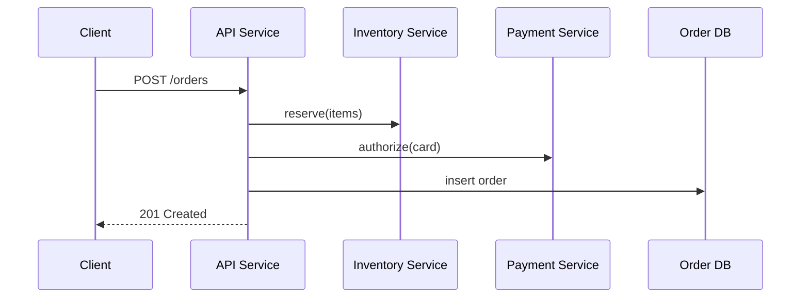

Flow ini mudah dipahami. Tetapi availability order creation sekarang tergantung pada:

- API service;
- Inventory service;
- Payment service;
- database;
- network antar service;
- timeout configuration;
- retry behavior;
- capacity semua dependency.

Jika salah satu dependency lambat, request client ikut lambat. Jika caller melakukan retry agresif, callee makin overload. Ini adalah klasik **cascading failure**.

Runtime coupling bukan selalu buruk. Direct call masih tepat ketika:

- caller benar-benar membutuhkan jawaban sekarang;
- operasi cepat dan bounded;
- callee punya SLO lebih tinggi atau setara;
- failure bisa dikembalikan ke client sebagai keputusan valid;
- tidak ada side effect yang ambigu setelah timeout;
- circuit breaker, timeout, retry budget, dan idempotency tersedia.

Contoh yang masuk akal:

- `GET /customer/{id}` membaca profile untuk menampilkan UI;
- `POST /quote` menghitung harga sementara tanpa commit permanen;
- validasi synchronous untuk field yang harus diketahui sebelum accept command.

Contoh yang rawan:

- `POST /case/submit` memanggil 8 service lalu baru menyimpan state;
- API menunggu email terkirim sebelum response;
- checkout menunggu warehouse, payment, loyalty, notification, invoice, fraud, dan CRM secara serial;
- approval workflow menyimpan lock database selama menunggu human decision.

### 3.1 Runtime Coupling Rule

Gunakan rule berikut:

```txt
Synchronous call boleh membawa query dan validasi cepat.
Synchronous call harus sangat hati-hati membawa irreversible side effect.
```

Alasannya sederhana. Timeout pada read biasanya bisa diulang. Timeout pada side effect bisa ambigu:

- payment mungkin berhasil tapi caller tidak menerima response;
- order mungkin tersimpan tapi API gateway timeout;
- external partner mungkin menerima request dua kali;
- audit record mungkin tercatat tanpa business state berubah.

Untuk command yang mengubah state, desain minimal harus punya:

- idempotency key;
- request identity;
- correlation ID;
- bounded timeout;
- retry policy eksplisit;
- status endpoint atau reconciliation path;
- persistent command record bila command mahal atau penting.

---

## 4. Temporal Coupling

Temporal coupling terjadi ketika producer dan consumer harus hidup pada waktu yang sama.

Direct API call memiliki temporal coupling tinggi:

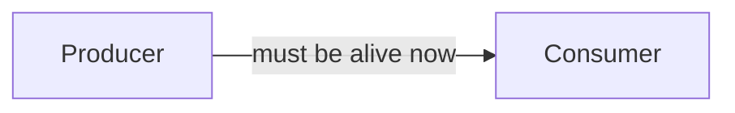

Queue mengurangi temporal coupling:

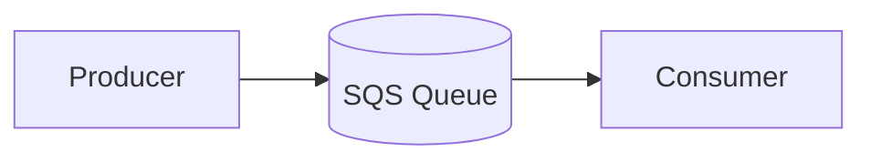

Producer hanya perlu queue tersedia. Consumer boleh down sementara. Pesan tetap menunggu selama retention window.

Tetapi temporal coupling tidak hilang. Ia berubah menjadi:

- retention coupling: berapa lama message boleh menunggu;
- backlog coupling: seberapa besar delay bisnis masih diterima;
- replay coupling: apakah message lama masih valid;
- expiry coupling: apakah command/event punya deadline;
- schema lifetime coupling: apakah consumer hari ini bisa membaca message kemarin.

### 4.1 Command vs Event dalam Temporal Coupling

Jangan campur command dan event.

**Command** adalah instruksi:

```json
{
  "type": "ShipOrder",
  "orderId": "ord-123",
  "requestedBy": "system",
  "deadline": "2026-07-06T12:00:00Z"
}
```

Command bisa basi. Jika deadline lewat, command mungkin tidak boleh dijalankan.

**Event** adalah fakta yang sudah terjadi:

```json
{
  "type": "OrderPaid",
  "orderId": "ord-123",
  "paidAt": "2026-07-06T10:15:00Z"
}
```

Event tidak basi sebagai fakta, tetapi consumer logic terhadap event lama bisa berubah. Replay harus mempertimbangkan efek samping.

Rule:

```txt
Queue berisi command harus punya expiry/deadline semantics.
Event bus berisi fact harus punya versioning/replay semantics.
```

### 4.2 AWS Implication

- **SQS** cocok untuk work queue, buffering, consumer-controlled throughput, retry, DLQ, dan load leveling.
- **SNS** cocok untuk fanout pub/sub sederhana dengan delivery ke banyak subscriber.
- **EventBridge** cocok untuk event routing berbasis rule, event bus, cross-account integration, archive/replay, dan integrasi service/SaaS.
- **Step Functions** cocok untuk durable control flow yang butuh state machine, retry, compensation, timeout, callback, dan audit trail.

Kesalahan umum:

- memakai EventBridge sebagai job queue padahal butuh consumer-controlled backlog;
- memakai SQS sebagai event catalog tanpa schema/version discipline;
- memakai SNS untuk workflow yang butuh state dan compensation;
- memakai Step Functions untuk setiap function call kecil hingga overhead operasional dan biaya tidak proporsional.

---

## 5. Throughput Coupling

Throughput coupling terjadi ketika producer dapat menghasilkan kerja lebih cepat daripada consumer memprosesnya.

Tanpa buffer:

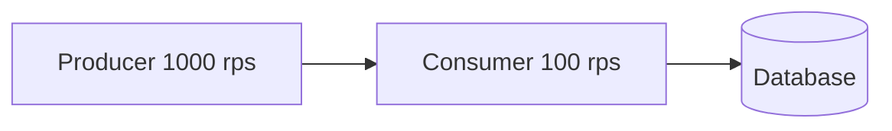

Hasilnya:

- request timeout;
- connection pool habis;
- database CPU naik;
- retry memperparah load;
- caller mengira operasi gagal padahal sebagian berhasil.

Dengan queue:

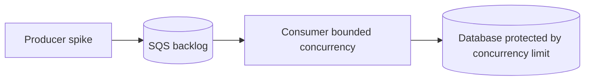

Queue memberi kemampuan penting:

- menyerap spike;
- mengontrol concurrency consumer;
- membuat backlog terlihat sebagai metric;
- memberi waktu untuk autoscaling;
- mengisolasi database dari burst langsung.

Tetapi queue juga membuat **latency bisnis** meningkat. Backlog bukan free lunch.

Metric yang harus dipikirkan:

| Metric | Meaning |
|---|---|
| enqueue rate | producer menghasilkan berapa message/detik |
| dequeue rate | consumer memproses berapa message/detik |
| oldest message age | berapa lama pekerjaan tertua menunggu |
| processing latency | waktu kerja consumer per message |
| retry rate | seberapa sering message gagal diproses |
| DLQ growth | jumlah message yang tidak bisa diproses |
| database saturation | apakah downstream menjadi bottleneck |

Rule production:

```txt
Queue bukan solusi overload permanen.
Queue hanya mengubah overload menjadi backlog yang bisa diamati dan dikendalikan.
```

Kalau enqueue rate rata-rata lebih besar dari dequeue rate rata-rata, queue hanya menunda incident.

---

## 6. Schema Coupling

Schema coupling terjadi ketika producer dan consumer harus sepakat terhadap bentuk data.

Contoh event:

```json
{
  "eventType": "OrderSubmitted",
  "orderId": "ord-123",
  "customerId": "cus-456",
  "items": [
    { "sku": "A", "qty": 2 }
  ]
}
```

Consumer mungkin bergantung pada:

- field wajib;
- tipe data;
- enum value;
- nested structure;
- format timestamp;
- semantic default;
- absence/presence field;
- naming convention;
- version.

Schema coupling buruk ketika producer deploy lebih dulu dan consumer lama gagal membaca data baru.

### 6.1 Compatible Change

Biasanya aman:

- menambah optional field;
- menambah enum hanya jika consumer punya unknown handling;
- memperluas string value tanpa mengubah meaning lama;
- menambah event type baru tanpa mengubah event type lama;
- membuat field lama tetap ada selama masa migrasi.

Biasanya tidak aman:

- rename field;
- menghapus field;
- mengubah tipe field;
- mengubah meaning field;
- mengubah unit tanpa field baru;
- mengubah timezone semantics;
- mengubah enum tanpa fallback;
- membuat optional field menjadi required;
- memakai ID baru tanpa menjaga ID lama.

### 6.2 Expand and Contract untuk Contract

Pattern aman:

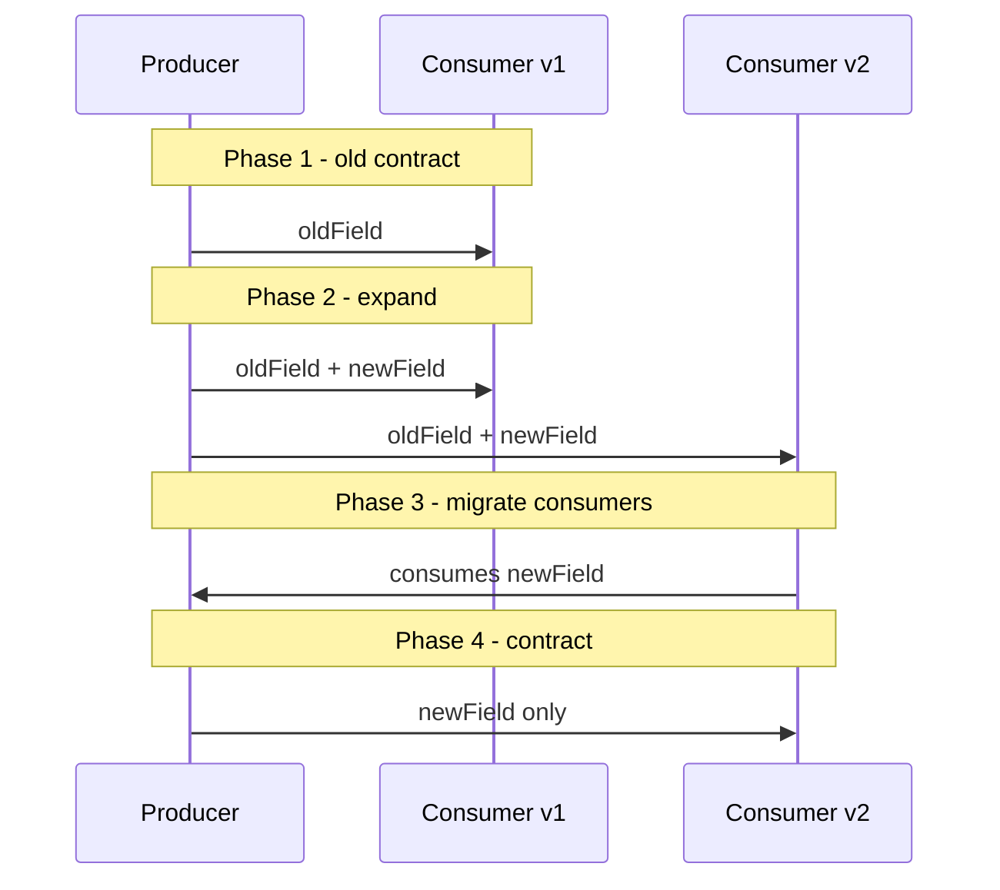

Rule:

```txt
Producer boleh cepat berubah hanya kalau contract-nya kompatibel.
Consumer boleh lambat berubah hanya kalau producer menjaga backward compatibility.
```

### 6.3 Event Schema vs Database Schema

Jangan mengekspos database row sebagai event contract.

Buruk:

```json
{
  "table": "orders",
  "op": "INSERT",
  "row": {
    "id": "ord-123",
    "st": "P",
    "v": 7,
    "created_ts": "2026-07-06 10:00:00"
  }
}
```

Lebih baik:

```json
{
  "eventType": "OrderPaid",
  "eventVersion": 1,
  "eventId": "evt-789",
  "occurredAt": "2026-07-06T10:00:00Z",
  "orderId": "ord-123",
  "paymentId": "pay-456",
  "amount": {
    "currency": "USD",
    "value": "125.00"
  }
}
```

Database schema adalah implementation detail. Event schema adalah public contract antar boundary.

---

## 7. Semantic Coupling

Schema bisa valid tetapi meaning salah.

Contoh field:

```json
{
  "status": "APPROVED"
}
```

Pertanyaan:

- approved oleh siapa?
- approved final atau sementara?
- approved untuk risk, payment, compliance, atau fulfillment?
- apakah status bisa turun kembali?
- apakah status lama masih berlaku setelah policy berubah?
- apakah consumer boleh mengirim email ketika melihat status ini?

Inilah semantic coupling. Ia lebih berbahaya daripada schema coupling karena tidak selalu membuat error teknis.

### 7.1 Cara Mengurangi Semantic Coupling

Gunakan event yang menyatakan fakta spesifik, bukan status generik.

Kurang baik:

```json
{
  "eventType": "CaseStatusChanged",
  "status": "APPROVED"
}
```

Lebih baik:

```json
{
  "eventType": "ComplianceReviewApproved",
  "reviewId": "rev-123",
  "caseId": "case-456",
  "approvedBy": "user-789",
  "approvalPolicyVersion": "2026.07",
  "occurredAt": "2026-07-06T10:00:00Z"
}
```

Lebih spesifik berarti consumer tidak perlu menebak meaning.

Rule:

```txt
Event name harus membawa business meaning, bukan hanya technical mutation.
```

### 7.2 Semantic Versioning untuk Domain Contract

Event version bukan hanya format version. Ia juga harus dipakai saat meaning berubah.

Contoh:

- `RiskApproved.v1`: approval manual oleh analyst.
- `RiskApproved.v2`: approval bisa otomatis oleh model scoring jika confidence threshold terpenuhi.

Jika consumer lama menganggap semua approval manual, perubahan ini breaking secara semantic walaupun schema tetap sama.

---

## 8. State Coupling

State coupling terjadi ketika beberapa komponen bergantung pada state yang sama.

Bentuk paling jelas: shared database.

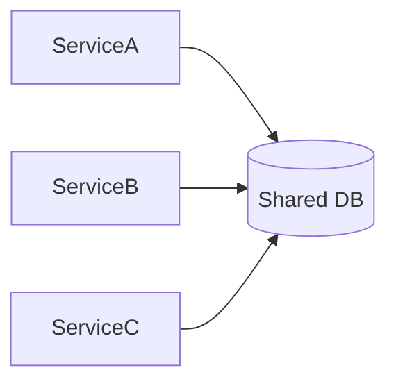

Shared database bisa pragmatis untuk monolith modular atau sistem kecil. Tetapi pada sistem yang berkembang, risiko naik:

- service A mengubah schema dan service B rusak;
- service B membaca intermediate state yang tidak dimaksudkan;
- invariant tersebar di stored procedure, trigger, service code, dan batch job;
- owner data tidak jelas;
- performance tuning satu query merusak workload lain;
- audit sulit karena semua bisa menulis.

### 8.1 State Ownership Rule

Untuk setiap state penting, jawab:

```txt
Siapa owner state ini?
Siapa satu-satunya writer yang sah?
Siapa boleh membaca langsung?
Siapa harus membaca projection?
Apa invariant yang dilindungi owner?
```

Contoh:

| State | Owner | Writer | Reader Langsung | Reader via Projection |
|---|---|---|---|---|
| order lifecycle | Order Service | Order Service | internal order API | Analytics, Notification, Search |
| payment authorization | Payment Service | Payment Service | internal payment API | Order, Risk, Finance projection |
| customer profile | Customer Service | Customer Service | customer API | CRM projection, personalization cache |

Rule:

```txt
Satu aggregate harus punya satu authority untuk mutation.
```

Ini tidak berarti satu database per service wajib. Artinya mutation path harus jelas.

### 8.2 Shared Database yang Masih Bisa Diterima

Shared database masih bisa diterima jika:

- satu tim mengontrol seluruh schema dan release;
- semua module berada dalam satu bounded context;
- invariant membutuhkan transaction lokal;
- deployment masih satu unit;
- tidak ada kebutuhan independent scaling antar module;
- read/write ownership tetap jelas di level schema/module.

Shared database mulai berbahaya jika:

- tim berbeda deploy terpisah;
- tabel sama ditulis banyak service;
- foreign key lintas domain memblokir perubahan;
- reporting query mengganggu OLTP;
- service membaca tabel internal service lain;
- schema migration butuh koordinasi besar.

### 8.3 State Coupling Lewat Cache

Cache juga menciptakan state coupling.

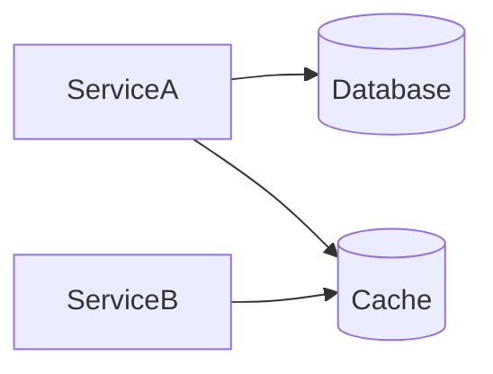

Pertanyaan:

- apakah cache hanya salinan sementara?
- siapa yang mengisi cache?
- siapa yang menghapus cache?
- apakah stale value aman?
- apa TTL?
- apakah cache miss bisa meledakkan database?
- apakah cache bisa menjadi source of truth diam-diam?

Rule:

```txt
Cache boleh mempercepat read.
Cache tidak boleh menjadi source of truth kecuali didesain sebagai durable state store dengan invariants sendiri.
```

---

## 9. Transaction Coupling

Transaction coupling terjadi ketika operasi bisnis membutuhkan commit atomik lebih dari satu resource.

Contoh buruk:

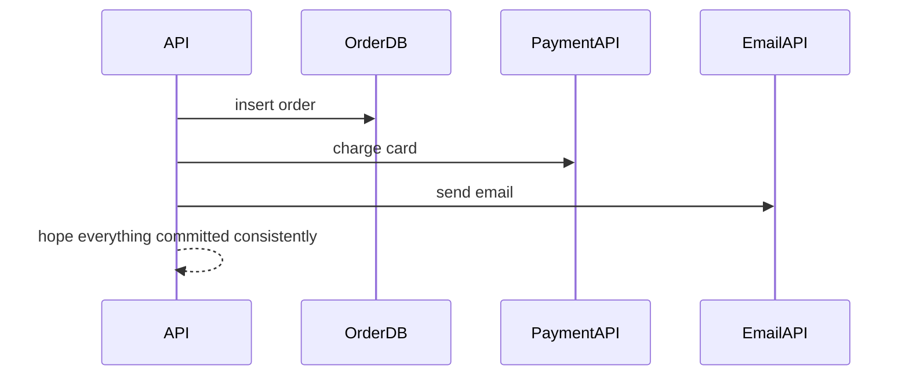

Tidak ada transaction atomik antara database lokal, payment provider, dan email provider. Kalau email gagal setelah payment berhasil, apa status order? Kalau payment timeout, apakah card sudah charged?

### 9.1 Local Transaction First

Desain yang lebih aman:

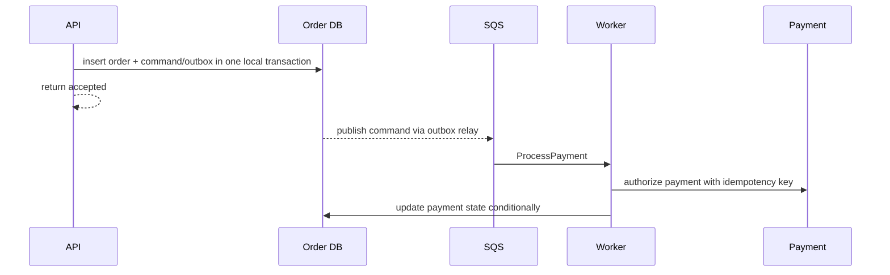

Core idea:

- commit state lokal dulu;
- side effect diproses async;
- side effect punya idempotency key;
- hasil side effect ditulis balik sebagai state transition;
- status akhir bisa diamati.

### 9.2 Saga Coupling

Saga mengurangi kebutuhan distributed transaction, tetapi menambah coupling baru:

- compensation logic;
- timeout handling;
- intermediate state;
- human escalation;
- retry policy;
- audit trail;
- workflow versioning.

Step Functions cocok ketika control flow eksplisit dan perlu durable execution history.

Rule:

```txt
Saga bukan cara membuat distributed transaction gratis.
Saga adalah cara menerima partial progress secara eksplisit dan mendefinisikan recovery path.
```

---

## 10. Consistency Coupling

Consistency coupling terjadi ketika keputusan di satu komponen bergantung pada freshness state dari komponen lain.

Contoh:

- UI submit order lalu langsung membaca order summary.
- Fraud service butuh payment status terbaru.
- Notification service tidak boleh mengirim email sebelum approval final.
- Search index boleh stale 5 menit.
- Analytics boleh stale 1 jam.

Tidak semua read butuh consistency sama.

| Use Case | Freshness Required | Pattern |
|---|---:|---|
| submit command validation | sangat tinggi | local transaction / strong read |
| user melihat hasil submit | read-your-writes | status endpoint / same source read |
| search result | medium | async projection |
| dashboard analytics | low-medium | batch/stream projection |
| fraud decision | high | authoritative read / event with version |
| notification | depends | event-driven with guard condition |

### 10.1 Read-Your-Writes Trap

Masalah umum:

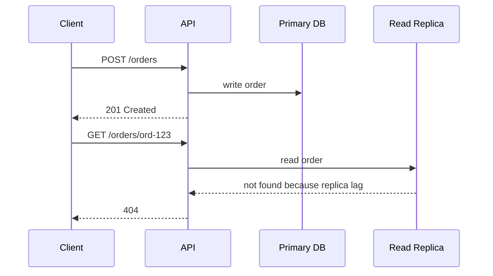

Ini bukan bug database. Ini consistency mismatch.

Solusi:

- read dari writer setelah write untuk window tertentu;
- return representation dari command response;
- gunakan session token/version;
- expose status `accepted/processing/visible`;
- desain UI untuk eventual consistency;
- ukur replica lag dan jadikan routing decision.

Rule:

```txt
Jangan memakai read replica atau async projection untuk flow yang membutuhkan read-your-writes tanpa mekanisme kompensasi UX/API.
```

---

## 11. Ordering Coupling

Ordering coupling terjadi ketika urutan message/event menentukan correctness.

Contoh event:

1. `CaseOpened`
2. `CaseAssigned`
3. `CaseApproved`
4. `CaseClosed`

Jika consumer menerima `CaseClosed` sebelum `CaseApproved`, apa yang terjadi?

### 11.1 Hindari Global Ordering

Global ordering mahal dan sering tidak perlu. Biasanya yang dibutuhkan adalah ordering per aggregate.

```txt
Order ord-123 events must be ordered relative to ord-123.
Order ord-456 can be processed independently.
```

AWS implication:

- SQS FIFO message group bisa menjaga ordering per group.
- DynamoDB conditional write bisa mencegah update dengan version lama.
- Event consumer bisa menyimpan last seen sequence per aggregate.
- Projection bisa ignore event yang version-nya lebih rendah dari current version.

### 11.2 Versioned State Transition

Event sebaiknya membawa aggregate version.

```json
{
  "eventType": "CaseApproved",
  "caseId": "case-123",
  "aggregateVersion": 8,
  "occurredAt": "2026-07-06T10:15:00Z"
}
```

Consumer projection:

```txt
if event.aggregateVersion <= projection.currentVersion:
    ignore as duplicate or stale
else if event.aggregateVersion == projection.currentVersion + 1:
    apply
else:
    park event and request repair/replay
```

Rule:

```txt
Jika ordering penting, buktikan ordering scope-nya.
Jangan meminta global ordering saat per-aggregate ordering cukup.
```

---

## 12. Deployment Coupling

Deployment coupling terjadi ketika perubahan satu komponen memaksa komponen lain deploy bersamaan.

Gejala:

- release train besar;
- banyak service harus freeze;
- rollback satu service memerlukan rollback service lain;
- event producer dan consumer harus deploy pada jam sama;
- database migration harus downtime;
- feature flag dipakai sebagai tambalan tanpa contract strategy.

### 12.1 Deployment Independence Requires Contract Discipline

Service bisa deploy independen jika:

- API backward compatible;
- event backward compatible;
- database migration expand-contract;
- consumer tolerant terhadap unknown field/enum;
- producer tidak menghapus field lama terlalu cepat;
- observability bisa membedakan versi;
- rollback path diketahui.

Deployment independence bukan didapat hanya dengan microservices. Tanpa contract discipline, microservices menjadi distributed monolith.

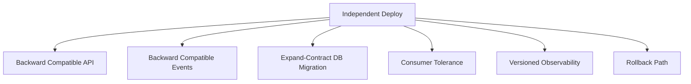

---

## 13. Operational Coupling

Operational coupling terjadi ketika menjalankan, mengamati, dan memperbaiki satu komponen membutuhkan pemahaman mendalam tentang komponen lain.

Contoh:

- DLQ penuh tetapi tidak jelas owner message;
- API latency naik tetapi sumbernya replica lag;
- retry worker membuat database down;
- event replay men-trigger email lama;
- dashboard hanya menunjukkan Lambda error, bukan business operation yang gagal;
- CloudWatch alarms service A berbunyi padahal root cause di service B.

### 13.1 Operational Contract

Setiap integration boundary harus punya operational contract:

| Area | Pertanyaan |
|---|---|
| Ownership | Tim mana owner producer, consumer, contract, dan DLQ? |
| SLO | Latency/availability/freshness target apa? |
| Retry | Retry berapa kali, backoff bagaimana, kapan stop? |
| Idempotency | Key apa yang dipakai, disimpan di mana, TTL berapa? |
| DLQ | Siapa triage, kapan alarm, bagaimana redrive? |
| Replay | Aman atau tidak? Side effect dicegah bagaimana? |
| Observability | Correlation ID apa yang dibawa? |
| Schema | Di mana contract didokumentasikan dan divalidasi? |

Rule:

```txt
Integration tanpa operational contract adalah incident yang belum terjadi.
```

---

## 14. Security Coupling

Security coupling terjadi ketika trust boundary antar komponen tidak jelas.

Contoh:

- semua service punya IAM permission ke semua table;
- event bus menerima event dari producer yang tidak jelas;
- consumer percaya payload tanpa memverifikasi source;
- satu KMS key dipakai lintas domain tanpa boundary;
- secret database dipakai banyak service;
- cross-account integration tanpa resource policy yang ketat.

Security coupling sering muncul karena convenience.

### 14.1 Trust Boundary Per Integration

Untuk setiap integration, tentukan:

- siapa principal caller;
- resource apa yang boleh diakses;
- action apa yang boleh dilakukan;
- payload berasal dari source apa;
- apakah payload perlu signature atau validation;
- data classification apa yang lewat;
- apakah log boleh menyimpan payload;
- KMS key mana yang melindungi data;
- apakah cross-account/cross-region.

Rule:

```txt
Loose coupling di runtime tidak boleh berarti loose trust di security.
```

---

## 15. Cost Coupling

Cost coupling terjadi ketika perilaku satu komponen membuat biaya komponen lain naik tidak terkendali.

Contoh:

- producer bug mengirim event 100x lebih banyak;
- EventBridge rule fanout ke banyak target;
- consumer gagal lalu retry terus;
- API client retry tanpa jitter;
- cache miss storm menekan database;
- Step Functions Express dipakai untuk high-volume workflow tanpa cost model;
- DynamoDB hot partition memicu throttling dan retry cost;
- logging payload besar membuat CloudWatch cost naik.

Cost coupling adalah bentuk operational coupling yang sering terlambat terlihat.

### 15.1 Cost Guardrail

Setiap design perlu guardrail:

- rate limit producer;
- reserved concurrency consumer;
- max receive count dan DLQ;
- event filtering sebelum fanout;
- payload size limit;
- sampling untuk logs/traces;
- budget alarm;
- per-tenant quota;
- circuit breaker untuk downstream mahal.

Rule:

```txt
Setiap retry, replay, fanout, dan polling loop harus punya cost boundary.
```

---

## 16. Coupling Matrix: Cara Membaca Desain

Gunakan matrix ini sebelum memilih pattern.

| Design | Runtime Coupling | Temporal Coupling | Throughput Coupling | Schema Coupling | State Coupling | Operational Burden |
|---|---:|---:|---:|---:|---:|---:|
| Direct API call | tinggi | tinggi | tinggi | medium | low-medium | medium |
| API + DB local transaction | medium | tinggi | medium | low | high local | medium |
| API + SQS worker | rendah ke worker | rendah | rendah | medium | medium | high |
| SNS fanout | rendah | rendah | medium | high event contract | low | medium-high |
| EventBridge routing | rendah | rendah | medium | high event contract | low | high |
| Step Functions saga | medium | rendah | controlled | medium | workflow state | high |
| Shared database | low runtime | low | high DB coupling | high | very high | medium-high |
| Cache-aside | medium | medium | medium | low | medium stale state | high |
| Async projection | low | low | low | high event contract | low source / high projection | high |

Tidak ada baris yang “selalu terbaik”. Pilihan benar tergantung invariant.

---

## 17. Invariant-Driven Coupling Decision

Jangan mulai dari service. Mulai dari invariant.

Contoh invariant:

```txt
Order tidak boleh shipped sebelum payment authorized.
```

Pertanyaan coupling:

1. Apakah shipping perlu membaca payment state terbaru secara synchronous?
2. Apakah event `PaymentAuthorized` cukup?
3. Apakah payment bisa di-revoke setelah authorized?
4. Apakah duplicate event aman?
5. Apakah shipping worker harus cek ulang payment state sebelum ship?
6. Apakah order state machine menyimpan dependency state?
7. Siapa authority final untuk transition `READY_TO_SHIP`?

Kemungkinan desain:

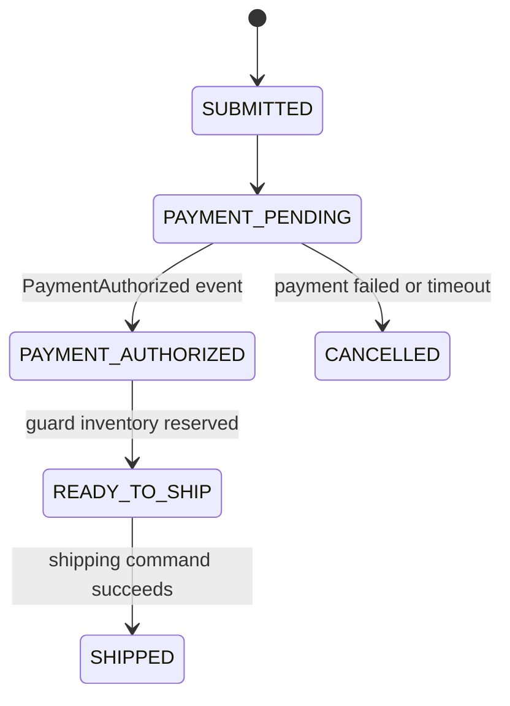

Di sini event-driven tidak berarti consumer buta. Shipping boleh tetap melakukan guard check ke authoritative state sebelum irreversible side effect.

Rule:

```txt
Untuk irreversible action, event biasanya trigger; authoritative state tetap menjadi guard.
```

---

## 18. Anti-Pattern Coupling

### 18.1 “Async All The Things”

Gejala:

- semua call diganti event;
- debugging sulit;
- user tidak tahu status operasi;
- duplicate side effect;
- replay tidak aman;
- business process tersebar di consumer.

Perbaikan:

- bedakan command/event/query;
- gunakan workflow untuk process yang punya state panjang;
- expose operation status;
- gunakan idempotency;
- buat event catalog.

### 18.2 Distributed Monolith with Queues

Gejala:

- service tetap saling tahu internal detail;
- queue hanya mengganti function call;
- message schema sama dengan DTO internal;
- deploy tetap harus serentak;
- tidak ada owner contract.

Perbaikan:

- definisikan domain event atau command contract;
- contract test;
- versioning;
- owner per boundary.

### 18.3 Shared Database as Integration Bus

Gejala:

- service membaca tabel service lain;
- trigger dipakai untuk publish business event;
- schema menjadi public API tak terdokumentasi;
- query reporting mengunci OLTP;
- migration sulit.

Perbaikan:

- expose API/query model;
- publish event dari owner;
- build projection;
- batasi writer;
- migrasi expand-contract.

### 18.4 Cache as Hidden Source of Truth

Gejala:

- nilai hanya ada di Redis;
- TTL tidak jelas;
- failover cache menghilangkan business state;
- database tidak bisa reconstruct state;
- debugging membutuhkan membaca cache live.

Perbaikan:

- database tetap source of truth;
- cache key versioning;
- write-through hanya jika invariant jelas;
- MemoryDB bila memang durable in-memory state dibutuhkan.

---

## 19. Practical Design Walkthrough

Kita ambil flow: `SubmitApplication`.

Requirement:

- user submit application;
- harus tersimpan durable;
- risk screening berjalan async;
- user langsung mendapat tracking ID;
- notification dikirim setelah submit;
- fraud review bisa memakan waktu;
- duplicate submit tidak boleh membuat dua application;
- dashboard internal boleh stale beberapa detik.

### 19.1 Naive Design

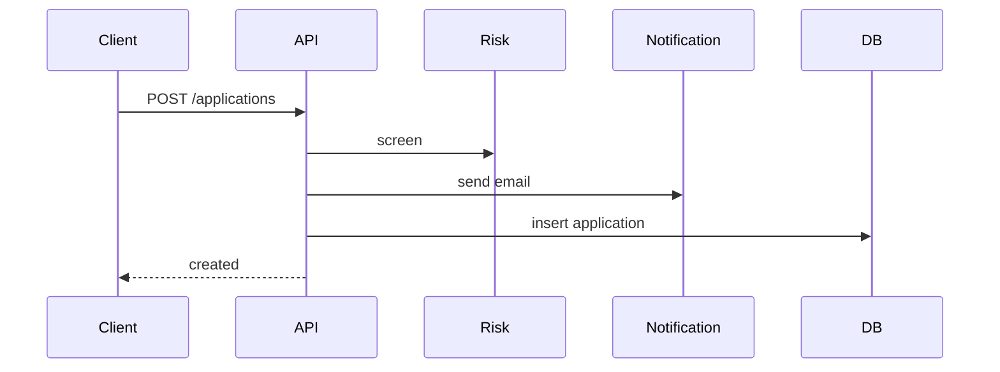

Masalah:

- runtime coupling ke Risk dan Notification;
- side effect email sebelum commit DB;
- timeout ambiguity;
- duplicate submit rawan;
- application ID mungkin tidak durable saat risk sudah berjalan.

### 19.2 Coupling-Aware Design

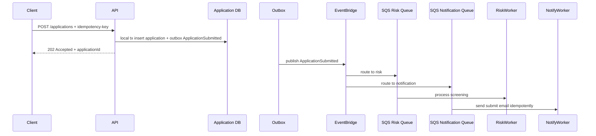

Coupling trade-off:

| Coupling | Design Choice |
|---|---|
| Runtime | API hanya bergantung pada DB lokal dan outbox path |
| Temporal | risk/notification boleh down sementara |
| Throughput | SQS buffer melindungi worker dan downstream |
| Schema | `ApplicationSubmitted` menjadi contract |
| State | application DB owner state utama |
| Transaction | insert application + outbox dalam local transaction |
| Consistency | user melihat status `SUBMITTED`, risk result muncul kemudian |
| Operational | DLQ dan replay wajib aman |

### 19.3 Critical Invariant

```txt
ApplicationSubmitted event tidak boleh muncul jika application belum committed.
```

Maka jangan publish event ke EventBridge sebelum DB commit. Gunakan outbox atau mekanisme transactional publish yang setara.

### 19.4 Irreversible Side Effect Guard

Notification worker harus idempotent:

```txt
notification_dedup_key = applicationId + notificationType + eventVersion
```

Jika message diproses dua kali, email tidak dikirim dua kali.

---

## 20. Coupling Checklist untuk Design Review

Gunakan checklist ini untuk setiap boundary.

### 20.1 Synchronous Boundary

- Apakah caller benar-benar butuh response sekarang?
- Berapa timeout total dan timeout per dependency?
- Apakah retry aman?
- Apakah callee idempotent?
- Apa yang terjadi jika caller timeout tetapi callee berhasil?
- Apakah response membawa final state atau hanya accepted state?
- Apakah circuit breaker/rate limit tersedia?
- Apakah fallback valid secara bisnis?

### 20.2 Asynchronous Boundary

- Message ini command atau event?
- Apakah message bisa basi?
- Apakah ada deadline?
- Apakah duplicate aman?
- Apakah ordering penting?
- Apakah consumer bisa replay message lama?
- Apa DLQ policy?
- Siapa owner redrive?
- Apakah payload schema versioned?
- Apakah side effect idempotent?

### 20.3 State Boundary

- Siapa owner state?
- Siapa writer?
- Apakah reader membaca source atau projection?
- Apa consistency expectation?
- Apakah migration bisa expand-contract?
- Apakah cache stale aman?
- Apakah backup/restore mempertahankan invariant?

### 20.4 Operational Boundary

- Apa metric utama?
- Apa alarm utama?
- Apa trace/correlation ID?
- Bagaimana menemukan satu business operation lintas service?
- Bagaimana replay dilakukan?
- Bagaimana mencegah replay side effect?
- Siapa pager owner?

---

## 21. Decision Heuristics

Pakai heuristik ini saat ragu.

### 21.1 Pilih Direct API Call Jika

- caller membutuhkan hasil sekarang;
- operasi cepat;
- dependency reliable dan bounded;
- side effect bisa dibuat idempotent;
- failure bisa dikembalikan sebagai response valid;
- caller tidak menahan database transaction selama call eksternal.

### 21.2 Pilih SQS Jika

- butuh buffer antara producer dan worker;
- consumer harus mengontrol rate;
- retry dan DLQ penting;
- pekerjaan bisa diproses nanti;
- message adalah command/job;
- order per group dibutuhkan dengan FIFO.

### 21.3 Pilih SNS Jika

- butuh fanout sederhana;
- publisher tidak perlu tahu subscriber;
- filtering sederhana cukup;
- delivery ke queue/Lambda/HTTP/email/SMS sesuai kebutuhan;
- event routing kompleks tidak dominan.

### 21.4 Pilih EventBridge Jika

- event routing berbasis content penting;
- banyak producer/consumer lintas domain/account;
- butuh event bus sebagai integration backbone;
- butuh archive/replay;
- butuh integrasi AWS service/SaaS;
- contract dan governance event bisa dijalankan.

### 21.5 Pilih Step Functions Jika

- process punya banyak step;
- butuh retry/catch eksplisit;
- butuh wait/timeout/callback;
- butuh compensation;
- butuh audit execution history;
- control flow lebih penting daripada pure data flow.

### 21.6 Pilih Shared Database Jika

- masih satu bounded context;
- transaction lokal penting;
- satu tim mengontrol schema;
- deploy masih satu unit;
- service boundary belum matang;
- risiko distributed data lebih besar daripada risiko shared schema.

Shared database bukan dosa. Yang berbahaya adalah shared database tanpa ownership.

---

## 22. Mini ADR: Coupling Decision Record

Gunakan template ini sebelum memutuskan integration.

```mdx
# ADR: <Boundary Name>

## Context
Apa operasi bisnisnya?
Komponen mana yang terlibat?
State apa yang berubah?

## Invariants
Apa yang tidak boleh rusak?
Apa yang harus tetap benar saat retry, duplicate, timeout, dan replay?

## Coupling Analysis
- Runtime coupling:
- Temporal coupling:
- Throughput coupling:
- Schema coupling:
- Semantic coupling:
- State coupling:
- Transaction coupling:
- Consistency coupling:
- Ordering coupling:
- Operational coupling:
- Security coupling:
- Cost coupling:

## Decision
Pattern/service apa yang dipilih?

## Why This Coupling Is Acceptable
Coupling apa yang sengaja diterima?
Coupling apa yang dikurangi?

## Failure Handling
Timeout, retry, DLQ, idempotency, reconciliation.

## Observability
Metrics, logs, traces, correlation ID, dashboards.

## Reversal Plan
Bagaimana mengubah keputusan ini jika workload berubah?
```

---

## 23. What Good Looks Like

Desain yang matang biasanya punya ciri:

- synchronous path pendek dan bounded;
- side effect irreversible tidak bergantung pada retry buta;
- async path punya DLQ, replay, dan idempotency;
- event schema bukan copy database schema;
- state owner jelas;
- read model boleh stale hanya jika business flow mengizinkan;
- database transaction tidak menunggu network call eksternal;
- cache punya TTL dan invalidation rule;
- workflow panjang punya state machine eksplisit;
- setiap boundary punya owner dan runbook;
- cost akibat retry/fanout/replay dibatasi.

---

## 24. Ringkasan

Coupling bukan musuh. Coupling yang tidak terlihat adalah musuh.

Kita membedakan coupling menjadi:

- runtime coupling;
- temporal coupling;
- throughput coupling;
- schema coupling;
- semantic coupling;
- state coupling;
- transaction coupling;
- consistency coupling;
- ordering coupling;
- deployment coupling;
- operational coupling;
- security coupling;
- cost coupling.

Setiap AWS service mengubah bentuk coupling:

- API menguatkan runtime coupling tetapi memberi immediate answer.
- SQS mengurangi temporal/throughput coupling tetapi menambah backlog/replay responsibility.
- SNS mengurangi publisher-subscriber coupling tetapi menambah fanout governance.
- EventBridge mengurangi direct integration coupling tetapi menambah event contract discipline.
- Step Functions mengurangi hidden workflow coupling tetapi menambah workflow state/versioning.
- Database lokal memperkuat transaction boundary tetapi bisa memperkuat state coupling.
- Cache mengurangi latency coupling tetapi menambah consistency coupling.

Prinsip utama:

```txt
Jangan bertanya “service apa yang bagus?”
Tanyakan “coupling apa yang bisa saya terima untuk invariant ini?”
```

---

## 25. Referensi

- AWS Well-Architected Framework — Reliability Pillar: REL04-BP02 Implement loosely coupled dependencies.  
  https://docs.aws.amazon.com/wellarchitected/latest/framework/rel_prevent_interaction_failure_loosely_coupled_system.html

- AWS Well-Architected Framework — Design interactions in a distributed system to prevent failures.  
  https://docs.aws.amazon.com/wellarchitected/latest/reliability-pillar/rel_prevent_interaction_failure.html

- AWS Decision Guide — Amazon SQS, Amazon SNS, or Amazon EventBridge?  
  https://docs.aws.amazon.com/decision-guides/latest/sns-or-sqs-or-eventbridge/sns-or-sqs-or-eventbridge.html

- AWS Prescriptive Guidance — Amazon EventBridge for integrating microservices.  
  https://docs.aws.amazon.com/prescriptive-guidance/latest/modernization-integrating-microservices/eventbridge.html

- AWS Well-Architected Framework — PERF03-BP01 Use a purpose-built data store that best supports your data access and storage requirements.  
  https://docs.aws.amazon.com/wellarchitected/latest/framework/perf_data_use_purpose_built_data_store.html

---

## 26. Lanjut

Part berikutnya:

```txt
learn-aws-application-database-part-004-purpose-built-aws-services-not-tool-shopping.mdx
```

Kita akan membahas cara memilih AWS purpose-built services berdasarkan workload, invariant, dan operational model, bukan berdasarkan popularitas service.
