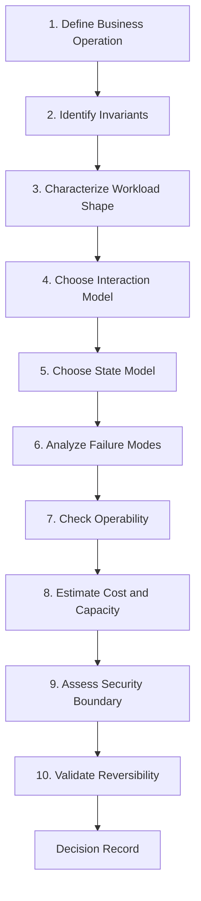
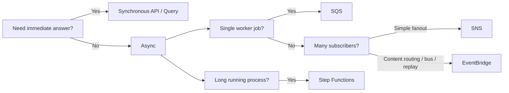
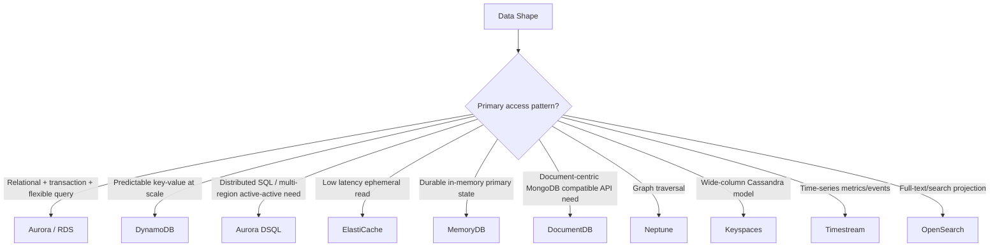
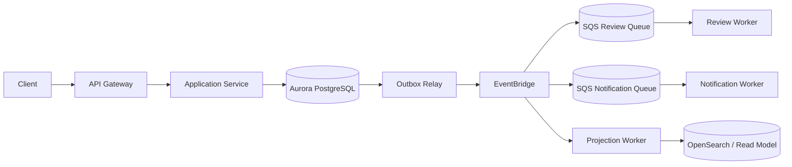
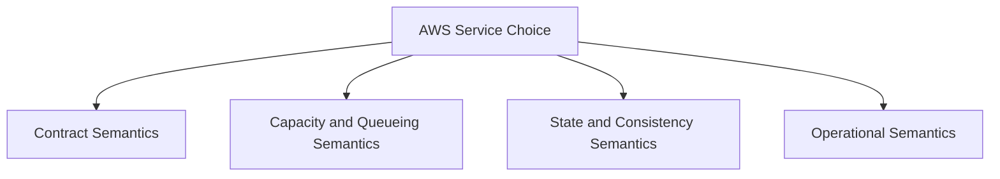
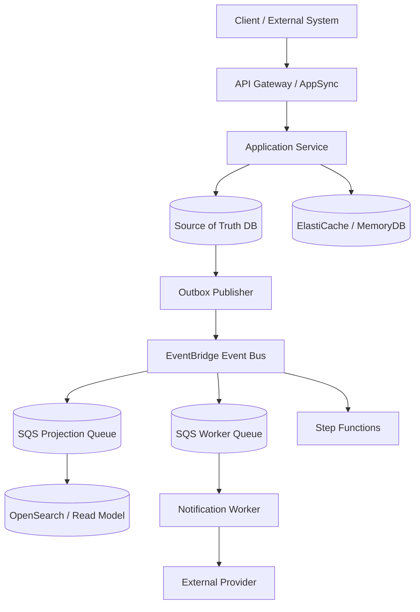

# Part 004 — Purpose-Built Services: Cara Memilih Service Tanpa Terjebak Tool Shopping

> AWS menyediakan banyak service yang terlihat saling tumpang tindih. Engineer yang kuat tidak memilih service dari nama, hype, atau diagram referensi. Engineer yang kuat memilih dari **workload shape**, **invariant**, **failure model**, **operational model**, dan **reversibility**.

Bagian ini adalah decision framework. Tujuannya bukan membuat hafalan “kalau A pakai X”. Tujuannya adalah membangun cara berpikir agar pilihan AWS service masuk akal, bisa dibela dalam architecture review, dan bisa dioperasikan saat production incident.

Kita akan membahas dua keluarga service utama:

1. **Application Integration**  
   API Gateway, AppSync, SQS, SNS, EventBridge, Step Functions, dan integration pattern yang menghubungkan application components.

2. **Database and Data Stores**  
   RDS/Aurora, Aurora DSQL, DynamoDB, ElastiCache, MemoryDB, DocumentDB, Neptune, Keyspaces, Timestream, OpenSearch sebagai projection, dan migration/evolution tooling.

---

## 1. Problem Utama: AWS Service Mirip di Permukaan, Berbeda di Semantics

Beberapa pertanyaan umum:

- “SQS atau EventBridge?”
- “SNS atau EventBridge?”
- “Step Functions atau queue worker?”
- “Aurora atau DynamoDB?”
- “DynamoDB single-table atau relational schema?”
- “ElastiCache atau MemoryDB?”
- “DocumentDB atau DynamoDB document item?”
- “Neptune atau relational join table?”
- “OpenSearch boleh jadi database utama?”

Pertanyaan itu sering kurang tepat karena dimulai dari service.

Pertanyaan yang lebih benar:

```txt
Apa operasi bisnisnya?
Apa invariant-nya?
Apa access pattern-nya?
Apa consistency requirement-nya?
Apa failure mode paling berbahaya?
Apa operational burden yang bisa ditanggung tim?
Apa path migrasi jika asumsi salah?
```

AWS Well-Architected Performance Efficiency mendorong penggunaan data store purpose-built berdasarkan karakteristik query, scaling, dan storage workload. Artinya: service dipilih karena bentuk masalah, bukan karena preferensi stack.

---

## 2. Purpose-Built Bukan Berarti Micro-Optimized

“Purpose-built” sering disalahpahami sebagai:

```txt
Setiap use case harus punya database/service khusus.
```

Itu salah.

Purpose-built berarti:

```txt
Service dipilih karena semantics dan operational model-nya cocok dengan workload.
```

Kadang purpose-built choice adalah Aurora PostgreSQL karena workload butuh relational integrity. Kadang DynamoDB karena query pattern predictable dan throughput tinggi. Kadang SQS karena worker harus mengontrol rate. Kadang direct API karena user memang butuh jawaban synchronously.

Purpose-built bukan berarti memperbanyak service. Purpose-built berarti mengurangi mismatch.

Mismatched service biasanya menghasilkan biaya tersembunyi:

- logic terlalu banyak di application code;
- consistency bug;
- retry dan idempotency tidak natural;
- query sulit dioptimalkan;
- migration sulit;
- observability tidak sesuai dengan failure mode;
- tim kecil harus mengoperasikan terlalu banyak surface area.

---

## 3. Service Selection Pipeline

Gunakan pipeline berikut untuk setiap keputusan besar.



Kita bahas satu per satu.

---

## 4. Step 1 — Define Business Operation

Jangan mulai dari “kita butuh queue”. Mulai dari operasi.

Contoh operasi:

```txt
SubmitApplication
ApproveCase
AuthorizePayment
ReserveInventory
GenerateInvoice
SendNotification
RebuildSearchIndex
ImportCustomerData
RunComplianceScreening
CloseInvestigation
```

Untuk setiap operasi, definisikan:

- command name;
- actor;
- input;
- output;
- state yang berubah;
- side effect;
- SLA/SLO;
- audit requirement;
- idempotency requirement.

Contoh:

```mdx
Operation: SubmitApplication
Actor: external user
Input: applicant profile, documents, consent, idempotency key
Output: applicationId, status=SUBMITTED
State changed: application record, submission audit
Side effects: risk screening command, notification event
SLO: p95 API response < 500 ms for accepted submit
Invariant: duplicate submit with same idempotency key must not create two applications
Audit: submission timestamp and actor must be durable before async processing
```

Dari sini terlihat bahwa operation membutuhkan durable write lebih dulu, bukan sekadar event publish.

---

## 5. Step 2 — Identify Invariants

Invariant adalah aturan yang harus tetap benar saat sistem mengalami retry, duplicate, timeout, partial failure, stale read, deployment, dan replay.

Contoh invariant:

- satu idempotency key hanya menghasilkan satu accepted command;
- payment tidak boleh captured dua kali;
- case tidak boleh closed sebelum mandatory review selesai;
- inventory tidak boleh negatif;
- notification tidak boleh dikirim sebelum consent tersimpan;
- application tidak boleh hilang setelah user menerima application ID;
- event tidak boleh dipublish jika state utama gagal commit;
- projection boleh stale, tetapi source of truth tidak boleh inconsistent.

Service dipilih untuk melindungi invariant.

| Invariant | Implikasi Design |
|---|---|
| perlu atomic update beberapa row dalam satu aggregate | relational transaction atau DynamoDB transaction |
| perlu unique constraint kuat | Aurora/RDS unique index atau DynamoDB conditional write dengan uniqueness item |
| perlu high-throughput lookup by key | DynamoDB atau cache di depan database |
| perlu graph traversal multi-hop | Neptune atau relational graph model jika kecil |
| perlu audit workflow step by step | Step Functions atau explicit workflow table |
| perlu consumer-controlled processing rate | SQS |
| perlu event routing lintas domain | EventBridge |
| perlu user immediate answer | synchronous API/query path |

Rule:

```txt
Jika service tidak membantu menjaga invariant, mungkin service itu bukan bagian inti solusi.
```

---

## 6. Step 3 — Characterize Workload Shape

Workload shape adalah bentuk traffic, data, query, mutation, dan failure.

### 6.1 Application Integration Workload Shape

Pertanyaan:

| Dimension | Pertanyaan |
|---|---|
| Interaction | request/response, command, event, workflow, stream? |
| Latency | perlu response sekarang atau boleh nanti? |
| Fanout | satu target atau banyak target? |
| Routing | fixed target atau content-based routing? |
| Persistence | message harus bertahan saat consumer down? |
| Retry | retry otomatis atau dikontrol consumer? |
| Ordering | urutan penting global/per-aggregate/per-group? |
| Backpressure | producer boleh lebih cepat dari consumer? |
| Replay | perlu replay event historis? |
| Audit | perlu execution history? |
| Human wait | ada approval/manual step? |
| Cross-account | perlu boundary antar account/org? |

### 6.2 Database Workload Shape

Pertanyaan:

| Dimension | Pertanyaan |
|---|---|
| Access pattern | query by key, relational join, document lookup, graph traversal, time range? |
| Mutation | write-heavy, read-heavy, append-only, update-in-place? |
| Transaction | single item, multi-row, multi-item, cross-aggregate? |
| Consistency | strong, eventual, read-your-writes, global? |
| Scale | GB/TB/PB, rps/wps, partition growth? |
| Latency | p50/p95/p99 target? |
| Cardinality | key distribution, hot key risk? |
| Query flexibility | ad hoc query atau fixed query? |
| Data lifecycle | TTL, archival, retention, legal hold? |
| Multi-region | read local, write local, active-active? |
| Operational | backup, restore, PITR, failover, migration? |

### 6.3 Example Workload Shape

```mdx
Workload: Regulatory case lifecycle
Writes: moderate, correctness-heavy
Reads: high internal read, dashboard and search
Queries: by caseId, by assignee, by status, by deadline, full-text search
Consistency: strong for transition, eventual for dashboard/search
Audit: high
Workflow: long-running, human approval, timeout and escalation
Data model: relational aggregate + event projection
Candidate: Aurora PostgreSQL for source of truth, Step Functions or workflow table for long-running process, EventBridge for domain events, SQS for workers, OpenSearch as search projection
```

Ini bukan karena Aurora “lebih bagus”. Ini karena workload butuh relational integrity, audit, flexible query, dan transactional lifecycle.

---

## 7. Step 4 — Choose Interaction Model

Interaction model menentukan bagaimana komponen bicara.



### 7.1 API Gateway / AppSync

Gunakan untuk:

- external API boundary;
- request/response;
- auth/throttling/validation layer;
- REST/HTTP/WebSocket/GraphQL use case;
- client-facing contract.

Jangan gunakan API sync untuk:

- menunggu banyak downstream lama;
- menahan transaction sambil call external service;
- workflow panjang;
- fire-and-forget tanpa persistent command.

### 7.2 SQS

Gunakan untuk:

- work queue;
- buffering;
- consumer-controlled processing;
- retry + DLQ;
- decoupling producer dari worker;
- smoothing spike;
- protecting database/downstream from burst.

Jangan gunakan SQS sebagai:

- event catalog jangka panjang;
- complex router;
- workflow state machine;
- replacement untuk schema governance.

### 7.3 SNS

Gunakan untuk:

- simple pub/sub;
- fanout cepat ke beberapa subscriber;
- push delivery;
- message filtering sederhana;
- integrasi ke SQS/Lambda/HTTP endpoint.

Jangan gunakan SNS jika:

- routing rules kompleks;
- perlu event archive/replay;
- perlu event bus governance lintas domain;
- workflow perlu state.

### 7.4 EventBridge

Gunakan untuk:

- event bus antar domain;
- content-based routing;
- AWS service event integration;
- SaaS/partner integration;
- cross-account eventing;
- archive/replay;
- event-driven backbone.

Jangan gunakan EventBridge sebagai:

- high-control work queue ketika consumer harus menentukan polling/backpressure;
- replacement untuk durable state;
- dumping ground semua log;
- event bus tanpa ownership contract.

### 7.5 Step Functions

Gunakan untuk:

- long-running workflow;
- orchestration;
- retry/catch/timeout explicit;
- compensation/saga;
- callback token;
- human wait;
- audit execution history;
- service integration with clear state transitions.

Jangan gunakan Step Functions untuk:

- setiap function call kecil;
- pure data pipeline high-volume tanpa cost model;
- logic yang lebih cocok menjadi local transaction;
- workflow yang berubah sangat dinamis tanpa version strategy.

---

## 8. Step 5 — Choose State Model

Database bukan sekadar tempat menyimpan data. Database adalah tempat invariant dilindungi.



### 8.1 Aurora / RDS

Pilih ketika:

- relational integrity penting;
- SQL query flexibility dibutuhkan;
- join valid dan bounded;
- transaction multi-row penting;
- unique constraints dan foreign keys membantu invariant;
- reporting/query internal masih dekat dengan OLTP;
- tim punya SQL operational skill.

Hindari sebagai default jika:

- workload utama adalah massive key-value lookup;
- schema sangat simple tetapi throughput sangat tinggi;
- scaling write horizontal adalah constraint utama;
- semua query sudah fixed by partition key;
- relational features tidak dipakai.

### 8.2 Aurora DSQL

Pilih ketika:

- butuh SQL transactional workload;
- butuh serverless distributed SQL;
- multi-region active-active menjadi requirement nyata;
- aplikasi dapat didesain dengan latency dan distributed consistency trade-off;
- operational simplicity lebih penting daripada kontrol engine tradisional.

Hati-hati jika:

- aplikasi mengasumsikan single-node relational behavior;
- query pattern tidak dipahami;
- cross-region latency tidak diterima;
- fitur engine tertentu dibutuhkan tetapi tidak tersedia.

### 8.3 DynamoDB

Pilih ketika:

- access pattern predictable;
- query by primary key/index;
- scale tinggi;
- latency konsisten;
- item/aggregate boundary jelas;
- conditional write cukup untuk invariant;
- global tables atau multi-region key-value model cocok.

Hindari jika:

- ad hoc query dominan;
- join kompleks diperlukan;
- access pattern belum stabil;
- tim belum mampu mendesain partition key dan index;
- invariant membutuhkan banyak query lintas aggregate.

### 8.4 ElastiCache / MemoryDB

ElastiCache cocok sebagai cache, session, rate limiter, leaderboard, ephemeral state, dan latency accelerator.

MemoryDB cocok ketika struktur data Redis-compatible dibutuhkan tetapi data harus durable sebagai primary state in-memory.

Hati-hati:

- cache invalidation;
- stale read;
- hot key;
- cache stampede;
- failover behavior;
- eviction policy;
- persistence expectation.

### 8.5 DocumentDB

Pilih ketika:

- document model natural;
- compatibility dengan MongoDB API dibutuhkan;
- application sudah memakai document query model;
- nested document lebih cocok daripada relational normalization.

Hati-hati:

- jangan menganggap semua fitur/behavior MongoDB upstream identik;
- query pattern dan index tetap harus didesain;
- document growth dan update pattern perlu dipahami.

### 8.6 Neptune

Pilih ketika:

- relationship adalah inti workload;
- traversal multi-hop penting;
- query “siapa terkait dengan siapa melalui path apa” dominan;
- fraud graph, knowledge graph, identity graph, dependency graph.

Hindari jika:

- graph hanya dua tabel join sederhana;
- traversal tidak dominan;
- tim belum siap memodelkan graph.

### 8.7 Keyspaces

Pilih ketika:

- workload cocok dengan Cassandra model;
- partition key dan clustering key jelas;
- write-heavy wide-column access pattern;
- compatibility Cassandra penting.

Hindari jika:

- query ad hoc;
- transaction relational;
- access pattern belum jelas.

### 8.8 Timestream

Pilih ketika:

- data time-series;
- query berdasarkan time window;
- retention tier penting;
- metrics/events IoT/operational telemetry;
- write append-heavy.

Hindari jika:

- data bukan time-series;
- update-in-place dominan;
- relational consistency dibutuhkan.

### 8.9 OpenSearch

OpenSearch sangat berguna sebagai search/read projection.

Pilih untuk:

- full-text search;
- faceted search;
- relevance ranking;
- log/search analytics;
- read model dari source of truth lain.

Jangan jadikan source of truth utama untuk transactional data kecuali benar-benar memahami trade-off durability, consistency, update semantics, dan recovery.

Rule:

```txt
OpenSearch menjawab “bagaimana mencari?”
Source database menjawab “apa yang benar?”
```

---

## 9. Step 6 — Analyze Failure Modes

Sebelum final memilih service, tulis failure mode.

### 9.1 Failure Mode untuk Synchronous API

| Failure | Pertanyaan |
|---|---|
| callee timeout | apakah side effect mungkin berhasil? |
| caller retry | apakah request idempotent? |
| partial downstream failure | apakah response harus fail atau accepted? |
| database slow | apakah API menahan connection terlalu lama? |
| auth provider degraded | apakah fallback valid? |

### 9.2 Failure Mode untuk Queue

| Failure | Pertanyaan |
|---|---|
| message duplicate | apakah consumer idempotent? |
| poison message | apakah DLQ aktif? |
| consumer slower than producer | apakah backlog acceptable? |
| visibility timeout terlalu pendek | apakah message diproses paralel duplicate? |
| redrive | apakah side effect lama aman? |

### 9.3 Failure Mode untuk Event Bus

| Failure | Pertanyaan |
|---|---|
| event schema break | apakah consumer tolerant? |
| replay old event | apakah consumer side effect guarded? |
| event routing salah | apakah rule tested? |
| too many targets | apakah fanout cost bounded? |
| consumer missing event | apakah reconciliation tersedia? |

### 9.4 Failure Mode untuk Database

| Failure | Pertanyaan |
|---|---|
| writer failover | apakah client retry aman? |
| replica lag | apakah read-your-writes rusak? |
| lock contention | apakah transaction terlalu besar? |
| hot partition | apakah key design salah? |
| backup restore | apakah RPO/RTO diuji? |
| migration fail | apakah rollback/roll-forward jelas? |

Rule:

```txt
Service choice belum selesai sampai failure mode-nya ditulis.
```

---

## 10. Step 7 — Check Operability

Service yang benar secara teori bisa salah jika tim tidak mampu mengoperasikannya.

Operability checklist:

- metric utama tersedia?
- alarm punya signal kuat?
- dashboard menunjukkan business operation, bukan hanya CPU/error?
- trace/correlation ID melewati boundary?
- log tidak membocorkan data sensitif?
- DLQ punya owner?
- replay procedure aman?
- backup/restore pernah diuji?
- schema migration punya playbook?
- capacity limit diketahui?
- quota AWS diketahui?
- cost anomaly bisa terlihat?
- runbook bisa dijalankan oleh engineer on-call?

### 10.1 Example Operability Requirements

Untuk SQS worker:

```txt
Metrics:
- ApproximateAgeOfOldestMessage
- NumberOfMessagesVisible
- NumberOfMessagesNotVisible
- consumer success/failure count
- downstream DB latency
- DLQ message count

Alarms:
- oldest message age > business SLA
- DLQ count > 0 for critical queue
- consumer error rate > threshold
- database saturation during processing

Runbook:
- inspect sample DLQ payload
- identify error class
- patch consumer if needed
- redrive safe subset
- verify idempotency record
```

Untuk Aurora:

```txt
Metrics:
- CPU
- connections
- freeable memory
- deadlocks
- lock waits
- replica lag
- transaction age
- slow query
- IOPS/throughput

Runbook:
- identify top SQL
- inspect wait events
- kill stuck transaction if needed
- route reads away from lagging replica
- scale/read replica if justified
- review connection pool
```

---

## 11. Step 8 — Estimate Cost and Capacity

Cost model harus dibuat sebelum production.

### 11.1 Application Integration Cost Drivers

| Service | Cost/Capacity Driver yang Harus Dipikirkan |
|---|---|
| API Gateway | request count, data transfer, caching, custom domain, logging |
| AppSync | query/mutation/subscription operations, realtime connections, resolver behavior |
| SQS | request count, payload size, long polling, batch size, DLQ/redrive volume |
| SNS | publish count, delivery count, fanout targets, payload size |
| EventBridge | event ingress, rule matching, delivery, archive/replay, scheduler/pipes usage |
| Step Functions | state transitions, workflow type, duration, payload size, execution volume |

### 11.2 Database Cost Drivers

| Service | Cost/Capacity Driver yang Harus Dipikirkan |
|---|---|
| Aurora/RDS | instance class, storage, I/O, backup, replicas, Multi-AZ, proxy |
| Aurora Serverless v2 | ACU range, scaling behavior, connection pattern |
| Aurora DSQL | request/transaction/storage/region usage model sesuai pricing terbaru |
| DynamoDB | read/write mode, item size, GSI, streams, global tables, TTL, backups |
| ElastiCache | node type, shards, replicas, data transfer, backup if supported/configured |
| MemoryDB | node type, shards, replicas, durable log/storage behavior |
| DocumentDB | instance, storage, I/O, backup, replicas |
| Neptune | instance/serverless capacity, storage, I/O, replicas |
| Keyspaces | read/write mode, storage, PITR, multi-region if used |
| Timestream | writes, memory store, magnetic store, queries, retention |
| OpenSearch | data nodes, master nodes, storage, UltraWarm/cold tier, indexing/query volume |

Rule:

```txt
Tidak ada retry, replay, fanout, poller, index, atau replica yang gratis secara kapasitas.
```

---

## 12. Step 9 — Assess Security Boundary

Security bukan modul terpisah. Security ikut menentukan service choice.

Pertanyaan:

- apakah producer dan consumer berada di account berbeda?
- apakah data melewati public endpoint atau private path?
- apakah payload mengandung PII/financial/regulated data?
- apakah encryption key per domain diperlukan?
- apakah event bus boleh menerima event dari semua source?
- apakah database credential dibagi lintas service?
- apakah IAM policy bisa dibuat least privilege?
- apakah logs mengandung payload sensitif?
- apakah audit access dibutuhkan?

Example:

```txt
Jika event mengandung PII dan dikirim ke banyak consumer, EventBridge/SNS fanout harus dievaluasi ketat:
- event minimization;
- encryption;
- resource policy;
- target filtering;
- access logging;
- consumer authorization;
- retention/archive policy.
```

Rule:

```txt
Semakin banyak subscriber, semakin kecil payload event yang seharusnya dibagikan.
```

---

## 13. Step 10 — Validate Reversibility

Keputusan arsitektur jarang final. Yang penting: apakah keputusan bisa dibalik saat asumsi berubah?

### 13.1 Reversibility Spectrum

| Decision | Reversibility | Catatan |
|---|---:|---|
| API route structure | medium | bisa versioning, tetapi client migration perlu waktu |
| SQS queue boundary | medium | message contract dan DLQ migration perlu hati-hati |
| Event schema | low-medium | consumer tersebar membuat perubahan sulit |
| Database engine | low | migration mahal, data model berubah |
| Partition key DynamoDB | very low | salah key bisa sangat mahal diperbaiki |
| Shared database ownership | low | memecah ownership setelah data tumbuh sulit |
| Cache strategy | medium | bisa diganti jika source of truth jelas |
| Workflow engine adoption | medium-low | execution state dan versioning harus dimigrasi |

Rule:

```txt
Semakin rendah reversibility, semakin kuat bukti yang dibutuhkan sebelum memilih.
```

### 13.2 Reversibility Pattern

- sembunyikan database di balik repository/domain API;
- jangan expose table structure sebagai public contract;
- gunakan event envelope versioned;
- simpan original command/event cukup untuk replay internal;
- batasi direct consumer ke database;
- pisahkan source of truth dari projection;
- gunakan strangler pattern untuk migrasi;
- buat dual-write hanya dengan reconciliation dan cutover plan.

---

## 14. Application Integration Decision Table

Gunakan table ini sebagai starting point, bukan hukum mutlak.

| Need | Prefer | Avoid |
|---|---|---|
| external REST/HTTP API | API Gateway HTTP/REST API | direct expose internal service tanpa boundary |
| external GraphQL/realtime | AppSync | custom realtime stack jika tidak perlu kontrol penuh |
| internal immediate query | direct service API / private API | async jika caller butuh jawaban sekarang |
| buffer write spike | SQS | direct DB writes dari semua producer |
| worker controlled rate | SQS | push fanout tanpa backpressure |
| simple pub/sub | SNS | EventBridge jika routing sangat sederhana dan tidak perlu bus governance |
| event bus lintas domain | EventBridge | shared DB atau point-to-point API chain |
| scheduled command | EventBridge Scheduler / Step Functions Wait | cron tersebar tanpa ownership |
| long-running workflow | Step Functions | ad hoc state column tanpa runbook jika flow kompleks |
| saga with compensation | Step Functions + domain state | distributed transaction palsu |
| human approval wait | Step Functions callback / explicit workflow table | holding DB transaction |
| replay historical events | EventBridge archive/replay atau event store design | manual script tanpa idempotency |

---

## 15. Database Decision Table

| Need | Prefer | Avoid |
|---|---|---|
| relational transaction | Aurora/RDS | DynamoDB hanya karena scale fear |
| PostgreSQL-compatible managed DB | Aurora PostgreSQL / RDS PostgreSQL | self-managed DB tanpa alasan kuat |
| predictable key-value high scale | DynamoDB | relational DB dengan massive hot lookup jika schema tidak butuh relational |
| multi-region active-active SQL | Aurora DSQL | manual multi-writer relational replication tanpa conflict strategy |
| low-latency cache | ElastiCache | database read untuk semua hot path |
| durable Redis-compatible state | MemoryDB | ElastiCache sebagai primary durable state tanpa memahami risk |
| document workload with MongoDB API compatibility | DocumentDB | relational JSON dump tanpa index/query discipline |
| graph traversal | Neptune | recursive joins berat di relational jika graph adalah core workload |
| Cassandra-compatible wide-column | Keyspaces | DynamoDB jika Cassandra compatibility adalah requirement keras |
| time-series telemetry | Timestream | generic relational table untuk high-volume time-window metrics |
| full-text search | OpenSearch projection | OpenSearch sebagai transactional source of truth |

---

## 16. Case Study 1 — Submit + Review + Notify

### 16.1 Requirement

- user submit application;
- application durable sebelum response;
- review async;
- notification dikirim setelah submit;
- duplicate submit dicegah;
- internal dashboard search by status;
- audit penting.

### 16.2 Service Choice

| Concern | Choice | Reason |
|---|---|---|
| External API | API Gateway + application service | request validation, auth, throttling |
| Source of truth | Aurora PostgreSQL | transactional aggregate, audit, flexible query |
| Event publication | outbox + EventBridge | event hanya setelah DB commit |
| Review worker | SQS | buffering, retry, DLQ, rate control |
| Notification | SQS worker | side effect idempotent, retryable |
| Search/dashboard | OpenSearch/DynamoDB projection | eventual read model |
| Long review process | Step Functions if multi-step/human wait | durable workflow if process complex |

### 16.3 Architecture



### 16.4 Why Not Simpler?

Could everything be synchronous? Bisa, tetapi review dan notification tidak perlu memblokir submit. Bisa langsung publish EventBridge dari API? Bisa, tetapi event bisa terkirim walaupun DB commit gagal jika tidak ada transactional boundary. Bisa pakai DynamoDB? Bisa jika access pattern fixed dan relational query/audit tidak dominan. Tetapi untuk lifecycle kompleks, Aurora sering lebih natural.

---

## 17. Case Study 2 — High-Volume Device Telemetry

### 17.1 Requirement

- jutaan device mengirim telemetry;
- write append-heavy;
- query by device/time range;
- aggregation by time window;
- alerts near real-time;
- raw retention terbatas;
- transactional relational semantics tidak penting.

### 17.2 Candidate

| Concern | Choice | Reason |
|---|---|---|
| Ingestion API | IoT Core / API ingestion layer / Kinesis depending scope | high-volume ingestion |
| Buffer/stream | Kinesis or SQS depending ordering/streaming need | smooth ingestion and processing |
| Time-series store | Timestream | time-window query, retention tier |
| Alert processing | Lambda/ECS worker | near real-time evaluation |
| Device metadata | DynamoDB or Aurora | depends on metadata query shape |
| Dashboard search | OpenSearch or purpose-built projection | query UX |

### 17.3 Why Not Aurora Main Table?

Aurora can store time-series data, but if workload is massive append + time-window retention + telemetry query, specialized time-series storage can reduce operational mismatch. Aurora may still hold device registry or configuration state.

---

## 18. Case Study 3 — Fraud Relationship Graph

### 18.1 Requirement

- find relationship among accounts, devices, IP, payment instruments;
- multi-hop traversal;
- risk analyst explores paths;
- source events come from many systems;
- graph derived from authoritative systems.

### 18.2 Candidate

| Concern | Choice | Reason |
|---|---|---|
| Source systems | existing transactional stores | authority stays with domains |
| Event routing | EventBridge | domain events to graph builder |
| Graph projection | Neptune | relationship traversal |
| Worker | SQS/Lambda/ECS | controlled ingestion |
| Search | OpenSearch optional | analyst search UX |
| Audit | source event log + graph build metadata | explainability |

### 18.3 Important Boundary

Neptune graph may be a projection, not source of truth. If graph says account A linked to device D, source event must be traceable.

Rule:

```txt
Derived graph must be explainable back to source facts.
```

---

## 19. Case Study 4 — Multi-Region Transactional Application

### 19.1 Requirement

- users in multiple regions;
- low-latency local reads/writes;
- transactional SQL model desired;
- region failure should not stop writes;
- global uniqueness and conflict semantics matter.

### 19.2 Candidate

| Concern | Choice | Reason |
|---|---|---|
| Database | Aurora DSQL candidate | distributed SQL active-active target shape |
| API | regional API endpoints | locality |
| Events | regional bus + cross-region strategy | integration and audit |
| Idempotency | global idempotency key discipline | duplicate prevention |
| Conflict | domain-level conflict avoidance | active-active correctness |

### 19.3 Warning

Multi-region active-active is not just a database feature. Application semantics must be designed for it:

- ID generation;
- uniqueness;
- conflict avoidance;
- latency expectations;
- failover behavior;
- read freshness;
- operational drill.

Rule:

```txt
Do not buy multi-region correctness from infrastructure alone.
Application invariants must be multi-region aware.
```

---

## 20. Service Choice Smells

### 20.1 “We Use DynamoDB Because It Scales”

Better question:

```txt
What are the access patterns?
What is the partition key?
What are the GSIs?
What are the hot key risks?
What invariants need conditional writes?
What query cannot be answered?
```

If these are unclear, DynamoDB may amplify uncertainty.

### 20.2 “We Use Aurora Because SQL Is Familiar”

Better question:

```txt
Do we need relational constraints?
Are joins bounded?
What are the top queries?
What is write scale?
What is connection model?
What is failover behavior?
```

Familiarity is useful, but not enough.

### 20.3 “We Use EventBridge for Everything”

Better question:

```txt
Is this a domain event, command, or job?
Do consumers need controlled polling?
Do we need archive/replay?
Who owns schema?
How do we prevent side effects during replay?
```

Event bus without governance becomes distributed chaos.

### 20.4 “We Use Step Functions Because It Is Visual”

Better question:

```txt
Is there actual long-running control flow?
Do we need retry/catch/callback/compensation?
How many executions and state transitions?
How will workflow versioning work?
```

A nice visual graph is not automatically better architecture.

### 20.5 “We Use OpenSearch as Database”

Better question:

```txt
What is the source of truth?
Can we rebuild the index?
How do we handle partial indexing failure?
What happens when search result is stale?
```

OpenSearch is excellent as projection. Treating it as OLTP store usually requires very careful justification.

---

## 21. The Minimal-Service Principle

A mature AWS architecture does not maximize number of services. It minimizes unnecessary responsibilities.

Principle:

```txt
Use the fewest services that preserve the required invariants, SLO, failure isolation, and future change path.
```

This means:

- do not add EventBridge if SNS fanout is enough;
- do not add Step Functions if a simple queue worker and status table are enough;
- do not add DynamoDB if relational query and transaction are core;
- do not add OpenSearch if normal indexed query is enough;
- do not add cache before measuring read bottleneck;
- do not split database before ownership and access pattern are understood.

But also:

- do not force Aurora to behave like high-scale key-value store;
- do not force DynamoDB to answer ad hoc relational queries;
- do not force SQS to become event governance backbone;
- do not force API chains to behave like resilient async workflow;
- do not force cache to become primary state by accident.

---

## 22. Decision Record Template

Use this template for serious service choice.

```mdx
# ADR: Choose <Service/Pattern> for <Operation/Boundary>

## Context
Business operation:
Actors:
Current pain:
Expected growth:

## Invariants
- 

## Workload Shape
Interaction:
Latency:
Throughput:
Data size:
Access pattern:
Consistency:
Ordering:
Retention:
Multi-region:

## Options Considered
1. Option A
2. Option B
3. Option C

## Evaluation Matrix
| Criteria | Weight | Option A | Option B | Option C |
|---|---:|---:|---:|---:|
| invariant fit | 5 |  |  |  |
| operational fit | 5 |  |  |  |
| scalability | 4 |  |  |  |
| cost predictability | 3 |  |  |  |
| security boundary | 4 |  |  |  |
| reversibility | 4 |  |  |  |
| team familiarity | 2 |  |  |  |

## Decision
Chosen option:

## Why

## Risks

## Mitigations

## Observability

## Rollback / Migration Plan

## Review Trigger
When should we revisit this decision?
```

---

## 23. Practical Scoring Example

Scenario: process `GenerateInvoice` after `OrderPaid`.

Requirements:

- invoice generation can happen async;
- duplicate invoice not allowed;
- if generation fails, retry;
- if template service down, do not block payment;
- accounting projection updated after invoice created;
- invoice number uniqueness required.

Options:

1. Direct API call from payment service to invoice service.
2. EventBridge event `OrderPaid` routed to invoice queue.
3. Step Functions orchestrating payment and invoice as one workflow.

Evaluation:

| Criteria | Direct API | EventBridge + SQS | Step Functions |
|---|---:|---:|---:|
| payment latency isolation | poor | good | medium |
| retry/DLQ | custom | strong | strong |
| duplicate handling | must build | must build | must build |
| workflow complexity | low | low-medium | high fit if multi-step |
| audit execution history | custom | event/log based | strong |
| cost/ops complexity | low | medium | medium-high |
| fit | weak | strong | strong only if workflow larger |

Decision:

```txt
Use EventBridge + SQS invoice worker.
Invoice uniqueness enforced in invoice database via unique invoice key.
Worker idempotency key = orderId + invoiceType.
Step Functions deferred until invoice process includes multi-step approval or callback.
```

---

## 24. Mental Model: Service as Contract + Queue + State + Operator

Every AWS service should be viewed as four things:



Example: SQS is not “just queue”.

It is:

- contract: message body and attributes;
- queueing: visibility timeout, retention, ordering mode;
- state: message lifecycle, DLQ, receive count;
- operations: backlog metrics, redrive, alarms, permissions, cost.

Example: Aurora is not “just SQL”.

It is:

- contract: schema, constraints, transaction semantics;
- queueing: connection pool, lock waits, transaction backlog;
- state: storage, replicas, backups, WAL/binlog equivalent behavior;
- operations: failover, performance insights, parameter groups, maintenance.

If you cannot explain all four, you are not ready to own the service in production.

---

## 25. Reference Architecture Baseline

Baseline untuk banyak enterprise application:



Baseline ini bukan template wajib. Ia menunjukkan pemisahan responsibility:

- API menerima command/query;
- DB menyimpan source of truth;
- outbox menjaga event publish setelah commit;
- EventBridge merutekan domain event;
- SQS memberi buffer worker/projection;
- Step Functions mengontrol workflow panjang;
- cache mempercepat read yang aman stale;
- OpenSearch/read model melayani query/search yang bukan source of truth.

---

## 26. Production Readiness Questions per Choice

### 26.1 Before API Gateway/AppSync

- Apa contract versioning strategy?
- Apa error response shape?
- Apa throttling policy?
- Apa idempotency mechanism untuk command?
- Apa timeout budget dari edge sampai DB?
- Apa correlation ID propagation?

### 26.2 Before SQS

- Apa message type: command atau event-derived work?
- Apa visibility timeout?
- Apa max receive count?
- Apa DLQ owner?
- Apa batch size?
- Apa idempotency key?
- Apa redrive policy?
- Apa backlog SLA?

### 26.3 Before EventBridge/SNS

- Apa event envelope?
- Apa event versioning?
- Siapa boleh publish?
- Siapa owner schema?
- Apa routing rules?
- Apa replay semantics?
- Apa payload minimization policy?
- Apa consumer contract test?

### 26.4 Before Step Functions

- Standard atau Express?
- Apa workflow versioning?
- Apa state payload size strategy?
- Apa retry/catch per step?
- Apa compensation path?
- Apa timeout per task dan total workflow?
- Apa human callback behavior?
- Apa cost per execution?

### 26.5 Before Aurora/RDS

- Apa schema ownership?
- Apa transaction boundary?
- Apa isolation level expectation?
- Apa connection pool strategy?
- Apa read replica lag implication?
- Apa backup/PITR requirement?
- Apa migration strategy?
- Apa top slow query risk?

### 26.6 Before DynamoDB

- Apa partition key?
- Apa sort key?
- Apa access patterns lengkap?
- Apa GSI/LSI?
- Apa hot partition risk?
- Apa conditional write invariant?
- Apa item size growth?
- Apa global table conflict semantics jika multi-region?

### 26.7 Before Cache

- Apa source of truth?
- Apa TTL?
- Apa invalidation trigger?
- Apa stale read impact?
- Apa cache miss storm protection?
- Apa hot key strategy?
- Apa failover behavior?

---

## 27. How to Avoid Tool Shopping in Team Review

Saat architecture review, larang kalimat seperti:

```txt
Kita pakai X karena best practice.
Kita pakai Y karena scalable.
Kita pakai Z karena serverless.
```

Ganti dengan:

```txt
Kita memilih X karena operation ini membutuhkan <semantics>,
invariant-nya <invariant>,
failure mode paling berbahaya adalah <failure>,
dan X memberi <specific capability> dengan trade-off <trade-off>.
```

Contoh baik:

```txt
Kita memilih SQS untuk payment settlement worker karena producer dapat menghasilkan burst lebih cepat daripada settlement provider menerima request. Consumer harus mengontrol concurrency, setiap job harus retryable, dan poison message harus bisa dipisahkan lewat DLQ. Trade-off-nya adalah settlement menjadi eventually processed, sehingga API harus mengembalikan status ACCEPTED, bukan SETTLED.
```

Ini bisa diaudit.

---

## 28. Review Trigger: Kapan Keputusan Harus Ditinjau Ulang

Setiap keputusan service harus punya trigger untuk revisi.

Contoh trigger:

- p95 latency melewati SLO selama 3 minggu;
- queue backlog rata-rata tidak pernah turun;
- DLQ menjadi operasi mingguan;
- schema change membutuhkan koordinasi lebih dari 2 tim;
- DynamoDB hot partition muncul berulang;
- Aurora connection saturation terjadi saat traffic normal;
- OpenSearch index tidak bisa rebuild dalam RTO;
- cache stale menyebabkan incident bisnis;
- Step Functions cost naik tidak proporsional terhadap value;
- multi-region requirement berubah dari read-only DR menjadi active-active.

Rule:

```txt
Architecture decision yang sehat punya expiry condition atau review trigger.
```

---

## 29. Ringkasan

Purpose-built service selection bukan tentang memilih service paling modern. Ini tentang mencocokkan semantics service dengan bentuk masalah.

Pipeline yang dipakai:

1. define business operation;
2. identify invariants;
3. characterize workload shape;
4. choose interaction model;
5. choose state model;
6. analyze failure modes;
7. check operability;
8. estimate cost and capacity;
9. assess security boundary;
10. validate reversibility;
11. write decision record.

Prinsip akhir:

```txt
Service yang benar adalah service yang membuat invariant lebih mudah dijaga,
failure lebih mudah diisolasi,
operasi lebih mudah diamati,
dan perubahan masa depan masih mungkin dilakukan.
```

Bukan service yang paling sering muncul di diagram.

---

## 30. Referensi

- AWS Well-Architected Framework — PERF03-BP01 Use a purpose-built data store that best supports your data access and storage requirements.  
  https://docs.aws.amazon.com/wellarchitected/latest/framework/perf_data_use_purpose_built_data_store.html

- AWS Documentation — Choosing an AWS database service.  
  https://docs.aws.amazon.com/databases-on-aws-how-to-choose/

- AWS Decision Guide — Amazon SQS, Amazon SNS, or Amazon EventBridge?  
  https://docs.aws.amazon.com/decision-guides/latest/sns-or-sqs-or-eventbridge/sns-or-sqs-or-eventbridge.html

- AWS Prescriptive Guidance — Amazon EventBridge for integrating microservices.  
  https://docs.aws.amazon.com/prescriptive-guidance/latest/modernization-integrating-microservices/eventbridge.html

- AWS Well-Architected Framework — REL04-BP02 Implement loosely coupled dependencies.  
  https://docs.aws.amazon.com/wellarchitected/latest/framework/rel_prevent_interaction_failure_loosely_coupled_system.html

- AWS Overview — Databases on AWS.  
  https://docs.aws.amazon.com/whitepapers/latest/aws-overview/database.html

---

## 31. Lanjut

Part berikutnya:

```txt
learn-aws-application-database-part-005-application-database-boundaries.mdx
learn-aws-application-database-part-006-operational-invariants.mdx
```

Kita akan masuk ke boundary design: di mana application berakhir, database dimulai, siapa yang boleh mengubah state, dan bagaimana invariant dijaga tanpa membuat sistem menjadi distributed monolith.
