# Part 005 — Application-to-Database Boundaries: Di Mana Application Berakhir dan Database Dimulai

> Tujuan bagian ini: membangun disiplin boundary. Bukan sekadar "service A punya database A". Yang harus jelas adalah: siapa boleh menulis state, siapa boleh membaca state, siapa boleh mengubah schema, siapa bertanggung jawab atas invariant, dan bagaimana perubahan state diberitahukan ke dunia luar tanpa merusak correctness.

Di sistem kecil, application dan database sering terlihat seperti satu benda:

```txt
Controller -> Service -> Repository -> Database
```

Di production AWS, bentuk itu terlalu miskin. Sebuah write bisa menyentuh API Gateway, service compute, Aurora/RDS atau DynamoDB, SQS, EventBridge, cache, read model, audit log, dan external system. Jika boundary tidak jelas, sistem akan terlihat berjalan sampai terjadi satu dari ini:

- retry client membuat command diproses dua kali;
- service lain membaca tabel internal dan rusak saat schema berubah;
- cache berisi state lama tetapi dianggap benar;
- workflow mengira database rollback bisa membatalkan email/payment yang sudah terkirim;
- event dikirim tetapi transaksi database gagal;
- transaksi database berhasil tetapi event tidak terkirim;
- migration menambah kolom wajib dan versi lama aplikasi mulai gagal;
- incident tidak bisa dianalisis karena tidak ada owner untuk state tertentu.

Boundary adalah cara kita menjawab pertanyaan:

> **Siapa punya hak untuk membuat sesuatu menjadi benar?**

Application layer mengeksekusi aturan, mengambil keputusan, mengorkestrasi side effect, dan mengekspos contract. Database layer menyimpan state yang harus bertahan, menjaga constraint lokal, menyediakan query shape tertentu, dan menjadi titik recovery. Keduanya saling mengunci, tetapi tidak boleh saling menutupi tanggung jawab.

---

## 1. Boundary Bukan Sama dengan Network Line

Kesalahan umum: menganggap boundary adalah garis di diagram deployment.

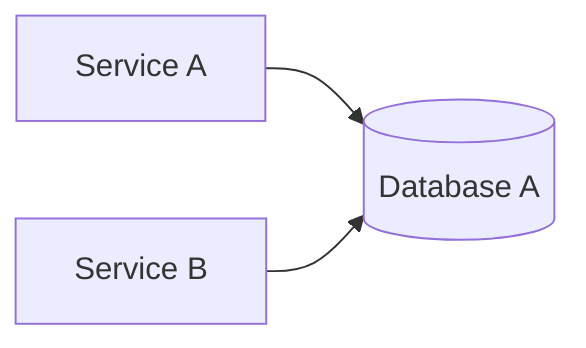

Diagram itu hanya menunjukkan koneksi. Ia tidak menjelaskan boundary. Boundary yang benar perlu menjawab minimal delapan sumbu:

| Sumbu boundary | Pertanyaan | Contoh keputusan |
|---|---|---|
| Ownership boundary | Siapa owner data ini? | `CaseService` owner tabel `case_file`; `NotificationService` tidak boleh update langsung |
| Write boundary | Siapa boleh mengubah state? | Semua perubahan status case harus melalui command API |
| Read boundary | Siapa boleh membaca dan dalam bentuk apa? | Cross-service baca via API/read model, bukan join ke tabel private |
| Transaction boundary | Operasi mana harus atomic? | Create case + initial audit record atomic; email notification tidak atomic |
| Schema boundary | Siapa boleh mengubah bentuk data? | Owner service mengubah schema dengan compatibility window |
| Failure boundary | Failure apa yang boleh menyebar? | DB unavailable boleh membuat command gagal; analytics projection tidak boleh menghentikan write utama |
| Deployment boundary | Versi mana bisa berubah sendiri? | Consumer event harus kompatibel terhadap schema event lama/baru |
| Observability boundary | Siapa membuktikan invariant masih benar? | Owner domain expose metrics, logs, traces, DLQ alarms, reconciliation report |

Network boundary bisa sama dengan ownership boundary, tetapi tidak selalu. Dua module dalam satu monolith bisa punya boundary kuat. Dua microservice berbeda bisa punya boundary buruk jika berbagi tabel secara bebas.

Mental model:

> Boundary adalah kontrak perubahan state, bukan sekadar lokasi runtime.

---

## 2. Source of Truth, Derived State, dan Illusion of Same Data

Dalam sistem application + database, data yang terlihat sama bisa memiliki status berbeda.

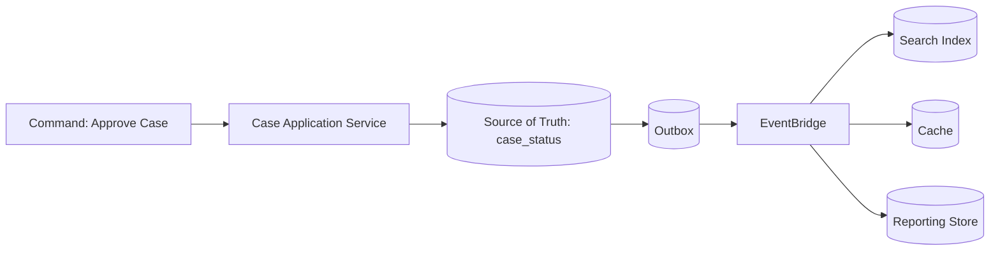

`case_status = APPROVED` mungkin muncul di banyak tempat:

- tabel utama di Aurora;
- item aggregate di DynamoDB;
- cache key untuk UI;
- search index di OpenSearch;
- reporting table;
- event archive;
- audit trail;
- notification payload.

Tetapi hanya satu yang boleh menjadi **source of truth** untuk keputusan domain utama. Yang lain adalah derived state, projection, atau artifact.

| Bentuk data | Boleh dipakai untuk keputusan utama? | Karakteristik |
|---|---:|---|
| Source of truth | Ya | Durable, owned, recoverable, punya invariant kuat |
| Read model | Kadang, hanya untuk query/read UX | Bisa stale, bisa rebuild, dioptimalkan untuk access pattern |
| Cache | Tidak untuk keputusan final | Stale by design, eviction mungkin terjadi kapan saja |
| Search index | Tidak untuk mutation correctness | Relevance/query optimized, eventual consistency |
| Event log/archive | Tergantung desain | Bisa jadi audit/replay source, tetapi perlu semantic contract kuat |
| Analytics/reporting store | Tidak untuk command path | Latency longgar, transformasi data mungkin terjadi |

Rule praktis:

> Jika data itu hilang dan bisa dibangun ulang dari sumber lain, ia bukan source of truth.

> Jika data itu dipakai untuk menolak/menyetujui command penting, ia harus berada pada boundary yang punya invariant dan recovery jelas.

---

## 3. Application Boundary: Command, Query, Event, Workflow

Application boundary bukan satu API. Ia terdiri dari beberapa permukaan.

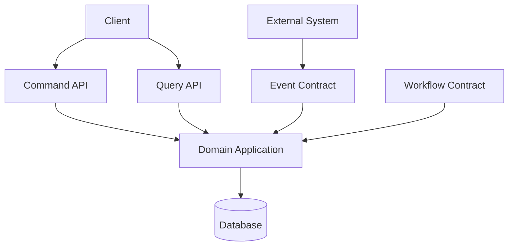

### 3.1 Command Boundary

Command adalah permintaan untuk mengubah state.

Contoh:

```txt
OpenCase
AssignInvestigator
SubmitEvidence
ApproveEnforcementAction
CloseCase
```

Command boundary harus eksplisit karena command membawa risiko:

- bisa dieksekusi dua kali;
- bisa sebagian berhasil;
- bisa timeout setelah commit;
- bisa melanggar invariant;
- bisa memicu side effect.

Command API yang sehat punya properti:

| Properti | Kenapa penting |
|---|---|
| Intent-based | `approveCase`, bukan `update status = APPROVED` mentah |
| Idempotency-aware | command yang sama bisa diulang tanpa double effect |
| Authorization-aware | permission dicek berdasarkan state dan actor |
| Validation-aware | validasi bukan hanya schema, tapi invariant domain |
| Observable | punya correlation ID, idempotency key, decision log |
| Transaction-scoped | jelas bagian mana yang atomic |

Anti-pattern:

```http
PATCH /cases/123
{
  "status": "CLOSED"
}
```

Endpoint itu tampak fleksibel, tetapi menghapus semantic. Ia tidak menjelaskan **mengapa** case ditutup, siapa boleh menutup, apakah evidence sudah lengkap, apakah appeal window sudah lewat, apakah notification harus dikirim, dan apakah audit event wajib dibuat.

Lebih sehat:

```http
POST /cases/123/commands/close
Idempotency-Key: 01J...

{
  "reasonCode": "ENFORCEMENT_COMPLETED",
  "closedBy": "officer-72",
  "decisionReference": "DEC-2026-001"
}
```

### 3.2 Query Boundary

Query adalah permintaan membaca state. Query terlihat aman, tetapi bisa merusak boundary jika service lain membaca tabel internal secara langsung.

Pertanyaan utama:

- Apakah query harus selalu fresh?
- Apakah query boleh stale beberapa detik?
- Apakah query butuh join lintas aggregate?
- Apakah query untuk UI, API eksternal, audit, atau reporting?
- Apakah query shape stabil atau sering berubah?

Query boundary sehat:

| Query need | Boundary yang cocok |
|---|---|
| Read-your-writes untuk command confirmation | baca source of truth atau session-aware cache |
| Dashboard operasional | read model/projection |
| Search text | OpenSearch projection |
| Audit legal | immutable audit store/source DB dengan retention |
| Cross-domain view | API composition atau CQRS read model |
| Analytics berat | warehouse/lake/export, bukan OLTP hot path |

Anti-pattern paling mahal:

> "Service B cuma baca tabel Service A, tidak menulis kok."

Baca langsung tetap coupling. Service B akan bergantung pada:

- nama tabel;
- nama kolom;
- semantic enum;
- index;
- transaction timing;
- retention;
- soft delete convention;
- migration cadence;
- operational availability database A.

Itu bukan read. Itu dependency contract yang tidak pernah ditulis.

### 3.3 Event Boundary

Event adalah pernyataan bahwa sesuatu sudah terjadi.

```json
{
  "source": "case.service",
  "detail-type": "CaseApproved",
  "detail": {
    "caseId": "CASE-123",
    "approvedAt": "2026-07-06T07:12:00Z",
    "decisionId": "DEC-456",
    "schemaVersion": 3
  }
}
```

Event boundary menjawab:

- event ini fakta domain atau teknis?
- siapa publisher resmi?
- apakah event muncul setelah commit database?
- apakah event bisa diduplikasi?
- apakah event bisa terlambat?
- apakah consumer boleh membuat keputusan dari event ini?
- bagaimana replay dilakukan?
- apa backward compatibility rule-nya?

Event bukan pengganti source of truth kecuali sistem memang dirancang sebagai event-sourced system dengan event log sebagai source of truth. Dalam banyak sistem AWS, event lebih sering menjadi **integration contract** setelah state utama berubah.

### 3.4 Workflow Boundary

Workflow adalah control plane untuk urutan langkah yang panjang, berulang, atau melibatkan banyak pihak.

Contoh:

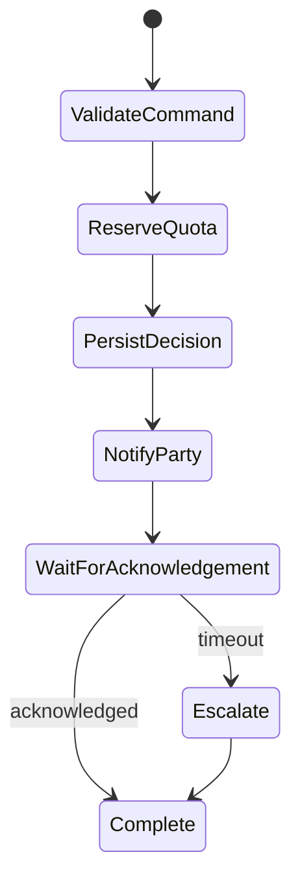

Workflow boundary harus dipisahkan dari database transaction boundary.

Database transaction cocok untuk:

- perubahan pendek;
- atomic local state;
- constraint lokal;
- commit/rollback cepat.

Workflow cocok untuk:

- proses panjang;
- call eksternal;
- human approval;
- compensation;
- retry terkontrol;
- timeout dan escalation.

Kesalahan fatal:

> Menahan database lock sambil menunggu API eksternal, user approval, atau message queue.

---

## 4. Database Boundary: Bukan Repository Pattern Saja

Repository pattern sering diajarkan sebagai boundary database. Ia berguna, tetapi tidak cukup. Boundary database production mencakup:

- ownership schema;
- connection policy;
- transaction rule;
- query rule;
- migration rule;
- backup/restore rule;
- audit rule;
- data retention rule;
- replication/read model rule;
- operational SLO.

### 4.1 Private Tables

Prinsip dasar:

> Tabel internal adalah implementation detail dari owner application.

Jika service lain perlu data, sediakan salah satu:

- API query;
- event stream;
- materialized projection;
- read-only replicated view dengan contract eksplisit;
- data export untuk analytics;
- shared reference data dengan governance.

Private table bukan berarti tidak ada orang boleh tahu. Artinya tidak ada runtime lain yang boleh bergantung tanpa contract.

### 4.2 Public Data Contract

Public data contract bisa berupa:

| Contract | Cocok untuk | Risiko |
|---|---|---|
| API response | query synchronous, read-your-writes | availability coupling |
| Event schema | integration async | duplicate, lag, replay complexity |
| Read model | high-volume cross-domain read | stale, rebuild, schema drift |
| Export dataset | analytics/reporting | latency, privacy, lineage |
| Database view | transitional compatibility | bisa berubah menjadi shared DB anti-pattern |

Rule:

> Data contract harus punya lifecycle: versioning, owner, compatibility, deprecation, observability.

### 4.3 Transaction Boundary

Transaction boundary adalah area perubahan yang harus berhasil atau gagal bersama.

Contoh transaksi lokal sehat:

```txt
ApproveCase transaction:
1. Load case row FOR UPDATE / conditional read.
2. Validate status = UNDER_REVIEW.
3. Insert decision row.
4. Update case status = APPROVED.
5. Insert audit row.
6. Insert outbox event row.
7. Commit.
```

Yang sengaja tidak masuk transaksi:

```txt
8. Publish event to EventBridge.
9. Send notification email.
10. Update search index.
11. Refresh cache.
```

Mengapa? Karena langkah 8-11 adalah side effect lintas boundary. Mereka harus dikelola dengan retry, idempotency, outbox, dan reconciliation, bukan rollback database.

### 4.4 Constraint Boundary

Database constraint tetap penting. Jangan memindahkan semua kebenaran ke application code.

Contoh invariant yang cocok dijaga database:

- unique idempotency key;
- foreign key lokal dalam satu aggregate boundary;
- enum/state constraint jika lifecycle stabil;
- not null untuk field yang selalu wajib pada versi schema tertentu;
- check constraint untuk range numerik lokal;
- optimistic version column;
- unique active record partial index.

Contoh invariant yang sering lebih cocok dijaga application/domain layer:

- user boleh approve hanya jika punya role tertentu;
- case boleh closed jika semua enforcement action selesai;
- escalation route tergantung policy dinamis;
- external agency acknowledgment sudah diterima;
- SLA dihitung berdasarkan calendar khusus.

Bukan karena database lemah. Karena invariant tersebut membutuhkan context lintas boundary, policy dinamis, atau side effect yang tidak natural di constraint database.

---

## 5. Boundary Patterns di AWS

### 5.1 Command Service + Aurora Source of Truth + Outbox

Pola ini cocok saat:

- butuh relational integrity;
- ada transaksi lokal jelas;
- query OLTP kaya;
- event harus keluar setelah commit.

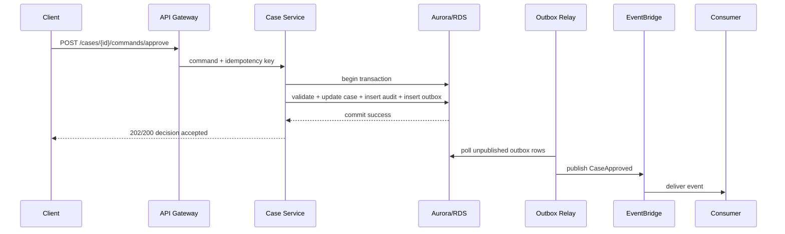

Boundary-nya:

| Boundary | Owner |
|---|---|
| Command validation | Application service |
| Transaction atomicity | Database + application transaction code |
| Event publication reliability | Outbox relay |
| Consumer side effect | Consumer service |
| Replay/reconciliation | Owner domain + platform runbook |

Catatan penting: client response boleh diberikan setelah commit lokal, bukan setelah semua consumer selesai. Jika business butuh menunggu beberapa langkah, gunakan workflow/status resource, bukan membuat API request menggantung terlalu lama.

### 5.2 DynamoDB Aggregate + Streams Projection

Cocok saat:

- access pattern bisa didesain eksplisit;
- aggregate boundary jelas;
- throughput tinggi;
- conditional write penting;
- projection async diterima.

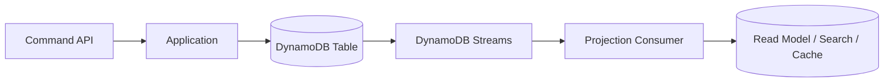

Boundary-nya:

- DynamoDB table menyimpan aggregate utama.
- Conditional write menjaga invariant lokal.
- Streams memberi change feed untuk projection.
- Read model bukan source of truth.
- Consumer harus idempotent karena delivery event stream bisa diproses ulang pada failure/retry path.

### 5.3 API Composition untuk Read Lintas Domain

Cocok saat cross-domain read butuh fresh-ish data dan volume masih masuk akal.

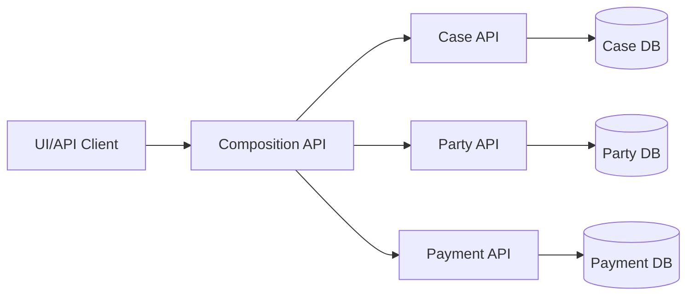

Kelebihan:

- tidak melanggar private database;
- setiap domain menjaga contract sendiri;
- cocok untuk layar detail kecil.

Kekurangan:

- latency fanout;
- availability coupling;
- error composition rumit;
- tidak cocok untuk dashboard besar atau analytics.

Jika query lintas domain menjadi high-volume, pindahkan ke CQRS/read model.

### 5.4 Event-Driven Projection

Cocok saat:

- UI/dashboard butuh query kompleks;
- data boleh eventual consistent;
- source domain banyak;
- query tidak cocok ditangani API composition.

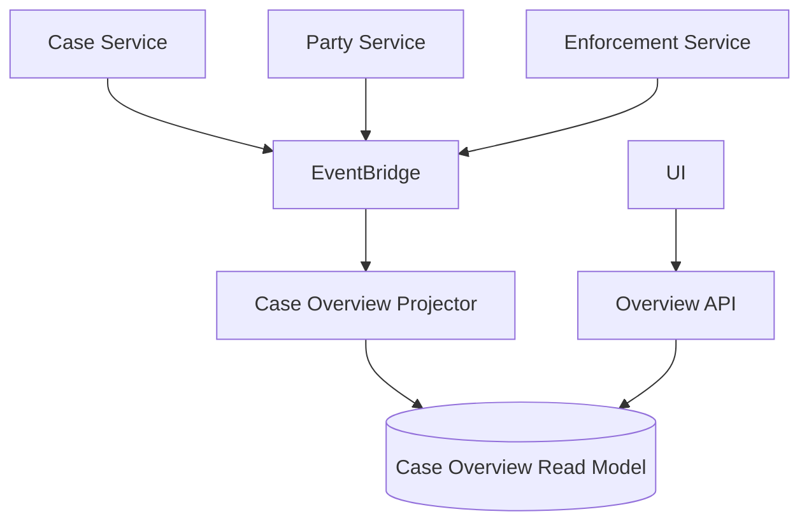

Boundary-nya:

- setiap domain publish event sesuai contract;
- projector memiliki read model sendiri;
- read model boleh rebuild;
- staleness harus diketahui;
- user action penting tetap diarahkan ke source domain command API.

### 5.5 Shared Database sebagai Transitional Pattern

Shared database bukan selalu dosa absolut. Ia bisa menjadi langkah transisi saat modernisasi monolith, tetapi harus diperlakukan sebagai **debt dengan exit plan**.

Syarat minimal jika shared database belum bisa dihindari:

- tiap service punya private schema/tables;
- tidak ada cross-service write ke table owner lain;
- perubahan schema backward-compatible;
- dependency tabel dicatat;
- ownership kolom jelas;
- migration punya compatibility window;
- query lintas owner dianggap temporary;
- ada roadmap menuju API/event/read model boundary.

AWS Prescriptive Guidance juga memperingatkan bahwa shared database perlu dinilai hati-hati, termasuk menghindari hot tables dan menjaga perubahan database tetap backward-compatible terhadap versi service yang masih berjalan.

---

## 6. Boundary Anti-Patterns

### 6.1 Generic CRUD Service

```http
POST /entity
PATCH /entity/{id}
DELETE /entity/{id}
```

Masalahnya bukan CRUD. Masalahnya ketika CRUD menggantikan command semantic.

Akibat:

- invariant tersebar di client;
- authorization lemah;
- audit tidak tahu business intent;
- workflow sulit ditempelkan;
- backward compatibility kacau;
- event menjadi `EntityUpdated`, bukan fakta domain.

Perbaikan:

- command endpoint untuk mutation penting;
- query endpoint untuk read;
- event domain untuk integration;
- repository tetap internal.

### 6.2 Direct Cross-Service Database Join

```sql
SELECT *
FROM case_db.case c
JOIN payment_db.payment p ON p.case_id = c.id
JOIN party_db.party pr ON pr.id = c.party_id;
```

Ini terlihat efisien, tetapi sebenarnya membuat deployment lockstep. Schema payment dan party tidak lagi private. Query planner, index, dan migration service lain menjadi masalah bersama.

Alternatif:

- API composition untuk volume kecil;
- read model untuk volume besar;
- export dataset untuk analytics;
- data warehouse/lake untuk reporting.

### 6.3 Database as Queue

Menggunakan tabel sebagai queue kadang masuk akal untuk outbox atau job kecil. Tetapi jika database OLTP utama menjadi general-purpose queue, tanda bahaya:

- polling berat;
- lock contention;
- vacuum/bloat/storage growth;
- retry semantics custom;
- poison message tidak tertangani;
- visibility timeout dibuat manual;
- scaling worker menekan primary DB.

Gunakan SQS/EventBridge/Step Functions ketika problem-nya memang messaging/workflow. Gunakan database table hanya jika ada alasan kuat: transaksi lokal, outbox, atau job scheduling yang sangat dekat dengan state owner.

### 6.4 Cache as Source of Truth

Cache bisa menjadi tempat data tercepat, tetapi bukan berarti data paling benar.

Tanda cache berubah menjadi source of truth tanpa sadar:

- write hanya dilakukan ke cache;
- data hilang saat eviction;
- restart cluster mengubah business state;
- tidak ada replay/rebuild;
- TTL menjadi policy domain;
- cache miss mengubah keputusan bisnis.

Jika butuh in-memory durable state, desainnya berbeda: MemoryDB, DynamoDB, atau database utama dengan cache-aside yang jelas.

### 6.5 Event as Database Replacement Without Event Discipline

Event-driven bukan berarti semua state hilang dan hanya event beterbangan. Jika event ingin menjadi source of truth, maka perlu:

- append-only immutable log;
- deterministic projection;
- versioned schema;
- replay strategy;
- snapshot strategy;
- compaction/retention policy;
- audit semantics;
- migration event versioning.

Jika tidak, event sebaiknya dianggap integration signal, bukan database.

---

## 7. Boundary Design untuk Regulatory Case Management

Karena konteks domain enforcement/case management sering punya lifecycle kompleks, mari pakai contoh nyata.

Domain awal:

- Case;
- Party;
- Evidence;
- Enforcement Action;
- Notification;
- Appeal;
- Audit.

### 7.1 Boundary yang Buruk

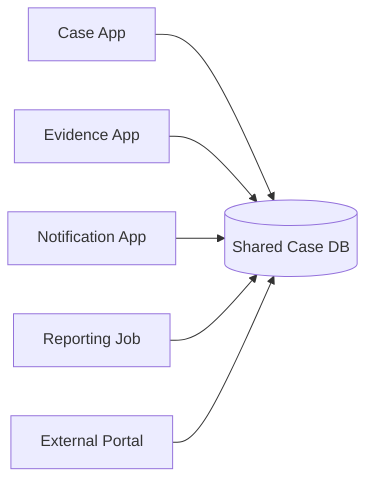

Gejala:

- semua orang bisa update `case_status`;
- evidence app tahu enum internal case;
- notification job membaca tabel yang sedang dimigrasikan;
- report query mengunci tabel OLTP;
- audit trail tidak lengkap karena update langsung lewat SQL;
- sulit menentukan siapa salah saat state tidak valid.

### 7.2 Boundary yang Lebih Sehat

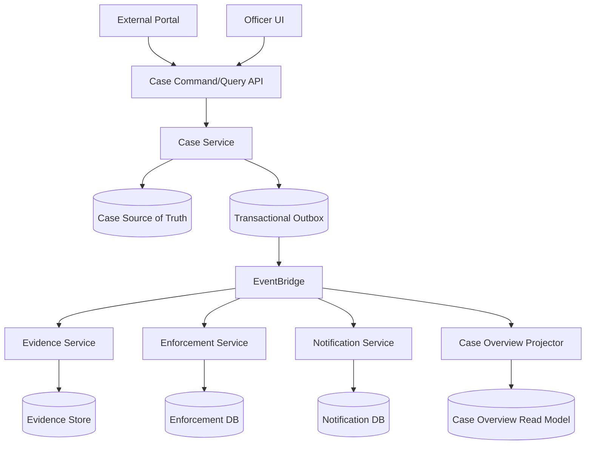

Boundary keputusan:

| State | Owner | Mutation path | Read path |
|---|---|---|---|
| Case lifecycle status | Case Service | Case command API | Case query API / overview projection |
| Evidence metadata | Evidence Service | Evidence command API | Evidence API / projected summary |
| Enforcement action | Enforcement Service | Enforcement command API | Enforcement API / projected summary |
| Notification delivery | Notification Service | event/command from workflow | Notification API/log |
| Audit trail | owner domain + audit subsystem | append-only audit write | audit query/export |
| Case overview | Projection service | event-driven projector | overview API |

### 7.3 Example: Close Case Command

Sebelum command `CloseCase` diterima, invariant mungkin:

- case exists;
- actor authorized;
- case status is `ENFORCEMENT_ACTIVE` or `APPEAL_RESOLVED`;
- no pending mandatory evidence review;
- all enforcement actions are completed or explicitly waived;
- closure reason is valid;
- audit record is mandatory;
- notification must eventually be sent;
- reporting projection may lag.

Yang harus atomic:

```txt
case.status -> CLOSED
case.closed_at -> now
case.closure_reason -> reason
append audit entry
insert outbox CaseClosed event
```

Yang tidak harus atomic:

```txt
send notification
update search index
update dashboard projection
send partner webhook
```

Jika notification gagal, case tidak otomatis dibuka lagi. Yang terjadi:

- notification service retry;
- DLQ menangkap poison case;
- reconciliation menemukan closed case tanpa notification delivered;
- operator menjalankan replay/redrive;
- audit tetap menunjukkan case closed pada waktu yang benar.

---

## 8. Schema Boundary dan Evolution

Schema boundary adalah salah satu boundary yang paling sering diremehkan.

### 8.1 Backward-Compatible Change

Umumnya aman:

- tambah nullable column;
- tambah table baru;
- tambah index non-breaking;
- tambah enum value jika consumer toleran;
- tambah field optional di event/API response;
- buat view kompatibilitas sementara.

Berisiko:

- rename column;
- drop column;
- ubah semantic enum;
- ubah type field;
- tambah not-null tanpa default/backfill;
- ubah primary key;
- ubah event field required;
- ubah meaning status.

### 8.2 Expand-Migrate-Contract

Pola aman:

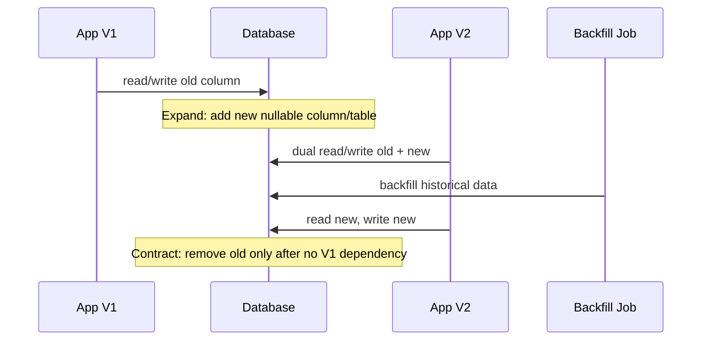

Rule:

> Database migration harus kompatibel dengan minimal dua versi aplikasi: versi yang sedang berjalan dan versi yang sedang/deploy berikutnya.

### 8.3 Event Schema Evolution

Event lebih sulit daripada database schema karena consumer mungkin tidak diketahui semuanya.

Rules:

- tambahkan field optional, jangan langsung required;
- jangan ubah arti field;
- versioning semantic event, bukan hanya angka;
- consumer harus ignore unknown fields;
- publisher menjaga compatibility window;
- archive/replay harus tahu event version lama;
- breaking change lebih baik event type baru.

---

## 9. Security Boundary dan Database Boundary

Security bukan modul terpisah dari boundary. Siapa boleh connect ke database adalah bagian dari desain state ownership.

Prinsip:

- runtime service hanya punya permission ke data yang ia own;
- migration role dipisahkan dari runtime role;
- read-only analytics role tidak boleh write;
- break-glass admin path diaudit;
- secret rotation dipikirkan bersama connection pooling;
- encryption dan retention mengikuti klasifikasi data;
- row/tenant boundary tidak hanya di UI.

Contoh permission yang buruk:

```txt
all-services-prod-role can SELECT/INSERT/UPDATE/DELETE on all tables
```

Contoh lebih sehat:

```txt
case-service-runtime-role:
  - read/write case schema
  - insert audit/outbox
  - no direct access to payment schema

case-service-migration-role:
  - alter case schema
  - short-lived deployment use

reporting-role:
  - read only projection/export
  - no OLTP write
```

---

## 10. Observability Boundary

Boundary yang tidak bisa diamati bukan boundary production. Minimal setiap boundary harus punya bukti:

| Boundary | Bukti observability |
|---|---|
| API command | request count, latency, error, validation failure, idempotency replay |
| Database transaction | commit rate, rollback, deadlock, lock wait, connection usage |
| Outbox | unpublished row age, publish success/failure, duplicate publish |
| Queue | visible messages, age of oldest message, DLQ count |
| Event consumer | processing latency, failure count, poison events |
| Projection | lag from source event, rebuild status, last processed event ID |
| Cache | hit ratio, stale read indicators, eviction, memory pressure |
| Workflow | execution started/succeeded/failed/timed out, compensation count |

Observability boundary juga menentukan **siapa bangun ketika alarm berbunyi**. Jika queue age naik, apakah owner producer, consumer, platform, atau database? Tanpa owner, alarm menjadi noise.

---

## 11. Boundary Decision Framework

Gunakan pertanyaan ini sebelum memilih service atau membuat tabel.

### 11.1 Untuk Data Baru

1. Apa business object/aggregate yang sedang dimodelkan?
2. Siapa owner state ini?
3. Siapa boleh menulis?
4. Siapa perlu membaca?
5. Apakah pembaca perlu fresh atau boleh stale?
6. Apa invariant yang harus selalu benar?
7. Apakah invariant lokal atau lintas service?
8. Apakah perubahan harus transactional?
9. Side effect apa yang terjadi setelah commit?
10. Bagaimana retry tidak membuat double effect?
11. Bagaimana data direbuild jika projection/cache hilang?
12. Bagaimana schema berubah tanpa mematikan consumer?
13. Apa metrics yang membuktikan boundary sehat?
14. Apa runbook ketika boundary gagal?

### 11.2 Untuk Service Baru

1. Apakah service ini benar-benar owner state atau hanya adapter?
2. Apakah ia membutuhkan database sendiri?
3. Apakah data yang disimpan source of truth atau derived?
4. Apakah service ini punya command semantic sendiri?
5. Apakah service ini hanya projection dari event lain?
6. Apakah service ini bisa dideploy tanpa koordinasi schema dengan service lain?
7. Apakah failure service ini boleh menghentikan command path utama?
8. Apakah service ini punya operational SLO sendiri?

### 11.3 Untuk Integrasi Baru

1. Apakah integrasi ini command, event, query, atau workflow?
2. Apakah caller perlu response langsung?
3. Apakah target harus memproses tepat sekali atau cukup idempotent?
4. Apakah ordering penting?
5. Apakah payload harus penuh atau hanya reference?
6. Apakah consumer boleh replay?
7. Apakah data sensitif boleh keluar boundary?
8. Siapa owner schema contract?

---

## 12. Boundary ADR Template

Gunakan template ini untuk keputusan penting.

```mdx
# ADR: <Boundary Decision Title>

## Context

Apa domain, workload, dan perubahan state yang sedang didesain?

## Decision

Boundary yang dipilih:

- Owner state:
- Source of truth:
- Mutation path:
- Read path:
- Event contract:
- Transaction boundary:
- Failure boundary:
- Observability owner:

## Alternatives Considered

1. Shared database
2. API composition
3. Event-driven projection
4. Database-per-service
5. Workflow orchestration

## Invariants

- Invariant 1:
- Invariant 2:
- Invariant 3:

## Compatibility Plan

- Schema migration:
- Event versioning:
- Client migration:
- Rollback plan:

## Operational Plan

- Metrics:
- Alerts:
- Runbook:
- Reconciliation:
- Recovery drill:

## Consequences

Positive:

Negative:

Risks accepted:
```

---

## 13. Worked Example: Enforcement Action Boundary

Misal ada requirement:

> Ketika enforcement action disetujui, sistem harus menyimpan keputusan, mengunci dokumen final, mengirim notifikasi ke pihak terkait, membuat deadline appeal, dan memperbarui dashboard pengawasan.

### 13.1 Naive Design

```txt
POST /enforcement-action/{id}
body: { status: "APPROVED" }

Application:
1. update status
2. call document service
3. send email
4. create appeal deadline
5. update dashboard table
```

Masalah:

- status update terlalu generic;
- tidak jelas transaction boundary;
- email gagal setelah status approved;
- dashboard update bisa membuat command gagal;
- retry bisa mengirim email dua kali;
- appeal deadline bisa dibuat dobel;
- audit intent hilang.

### 13.2 Boundary-Aware Design

Command:

```http
POST /enforcement-actions/{id}/commands/approve
Idempotency-Key: 01JXYZ...

{
  "approvedBy": "officer-42",
  "decisionDocumentId": "doc-777",
  "reasonCode": "VIOLATION_CONFIRMED"
}
```

Local transaction:

```txt
1. assert action.status = UNDER_REVIEW
2. assert actor authorized
3. assert decision document exists and is finalizable
4. update enforcement_action.status = APPROVED
5. insert appeal_deadline
6. append audit entry
7. insert outbox events:
   - EnforcementActionApproved
   - AppealDeadlineCreated
8. commit
```

Async side effects:

```txt
- Document service locks final document after event/command.
- Notification service sends email/SMS after event.
- Dashboard projector updates read model.
- Reconciliation checks approved action with missing notification.
```

Boundary table:

| Concern | Owner | Mechanism |
|---|---|---|
| Approval decision | Enforcement Service | local DB transaction |
| Appeal deadline | Enforcement Service or Appeal Service, depending domain split | local transaction or saga |
| Document locking | Document Service | command/event with idempotency |
| Notification | Notification Service | async event consumer |
| Dashboard | Projection Service | event-driven read model |
| Audit | Enforcement Service + audit store | append-only write |

This is not more complicated for fun. It is more explicit because production failure is not optional.

---

## 14. Mini Checklist: Boundary Smell Detector

Jika satu jawaban "ya", desain perlu dicek ulang.

- Apakah service lain membaca tabel private service ini?
- Apakah ada lebih dari satu writer untuk state yang sama?
- Apakah event dikirim sebelum database commit?
- Apakah database commit dan external API call dianggap satu transaksi?
- Apakah cache dipakai untuk keputusan final?
- Apakah query reporting berjalan di primary OLTP database?
- Apakah API mutation berbentuk generic update tanpa business intent?
- Apakah retry bisa menggandakan side effect?
- Apakah schema migration membutuhkan semua service deploy bersamaan?
- Apakah tidak ada owner untuk DLQ/replay?
- Apakah read model tidak bisa dibangun ulang?
- Apakah workflow menahan database lock?
- Apakah observability hanya HTTP 500 dan CPU?

---

## 15. Latihan Praktis

Ambil satu fitur yang pernah kamu bangun. Pecah menjadi tabel berikut.

| Pertanyaan | Jawaban |
|---|---|
| Apa command utamanya? |  |
| Apa source of truth-nya? |  |
| Siapa owner state? |  |
| Apa invariant yang harus atomic? |  |
| Side effect apa yang terjadi setelah commit? |  |
| Event apa yang harus diterbitkan? |  |
| Siapa consumer event? |  |
| Query mana yang boleh stale? |  |
| Data mana yang hanya projection/cache? |  |
| Apa failure mode paling berbahaya? |  |
| Apa metric untuk mendeteksinya? |  |
| Apa runbook recovery-nya? |  |

Kemudian gambar boundary-nya:

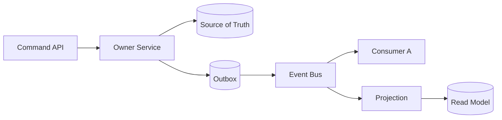

Jika kamu tidak bisa menentukan owner dan source of truth, masalahnya bukan di AWS service. Masalahnya di domain boundary.

---

## 16. Ringkasan Mental Model

Application/database boundary yang kuat punya ciri:

- mutation dilakukan lewat command semantic, bukan generic table update;
- source of truth eksplisit;
- derived state tidak diperlakukan sebagai kebenaran utama;
- transaksi lokal pendek dan jelas;
- side effect lintas boundary diproses async/idempotent;
- event contract punya owner dan versioning;
- schema migration backward-compatible;
- read path dipilih berdasarkan freshness dan query shape;
- observability membuktikan invariant, bukan hanya server hidup;
- setiap boundary punya owner operational.

Kalimat yang harus diingat:

> **Database menyimpan apa yang benar. Application menentukan perubahan apa yang sah. Integration layer menentukan bagaimana perubahan itu menyebar tanpa menghancurkan sistem.**

---

## Referensi

- AWS Well-Architected Framework — overview dan pilar arsitektur: https://docs.aws.amazon.com/wellarchitected/latest/framework/welcome.html
- AWS Well-Architected Operational Excellence — observability dan operasi workload: https://docs.aws.amazon.com/wellarchitected/latest/framework/operational-excellence.html
- AWS Well-Architected Reliability — loose coupling dan workload segmentation: https://docs.aws.amazon.com/wellarchitected/latest/framework/rel_service_architecture_monolith_soa_microservice.html
- AWS Prescriptive Guidance — Enabling data persistence in microservices: https://docs.aws.amazon.com/prescriptive-guidance/latest/modernization-data-persistence/welcome.html
- AWS Prescriptive Guidance — Database-per-service pattern: https://docs.aws.amazon.com/prescriptive-guidance/latest/modernization-data-persistence/database-per-service.html
- AWS Prescriptive Guidance — Shared-database-per-service pattern: https://docs.aws.amazon.com/prescriptive-guidance/latest/modernization-data-persistence/shared-database.html
- AWS Prescriptive Guidance — Transactional outbox pattern: https://docs.aws.amazon.com/prescriptive-guidance/latest/cloud-design-patterns/transactional-outbox.html
- AWS Prescriptive Guidance — Saga patterns: https://docs.aws.amazon.com/prescriptive-guidance/latest/cloud-design-patterns/saga.html
