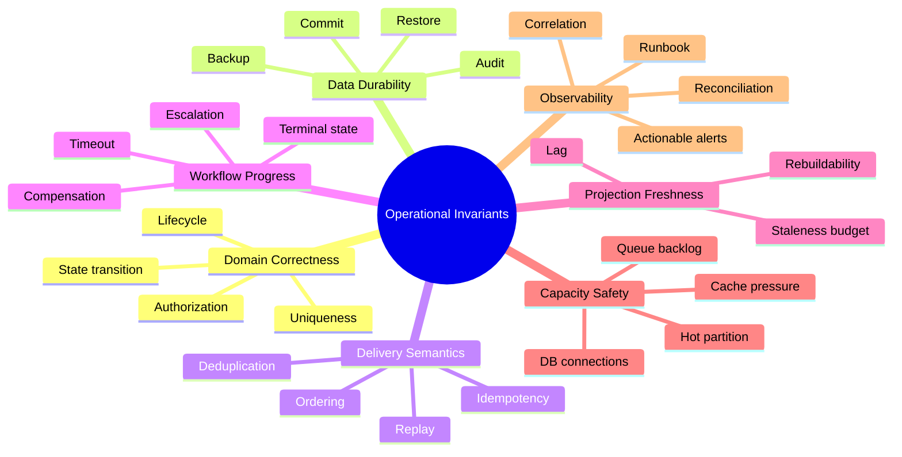
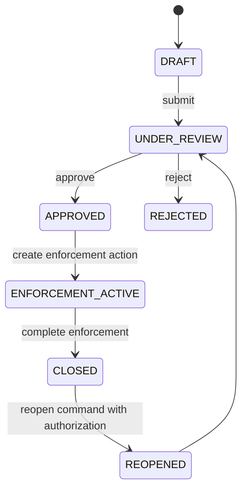
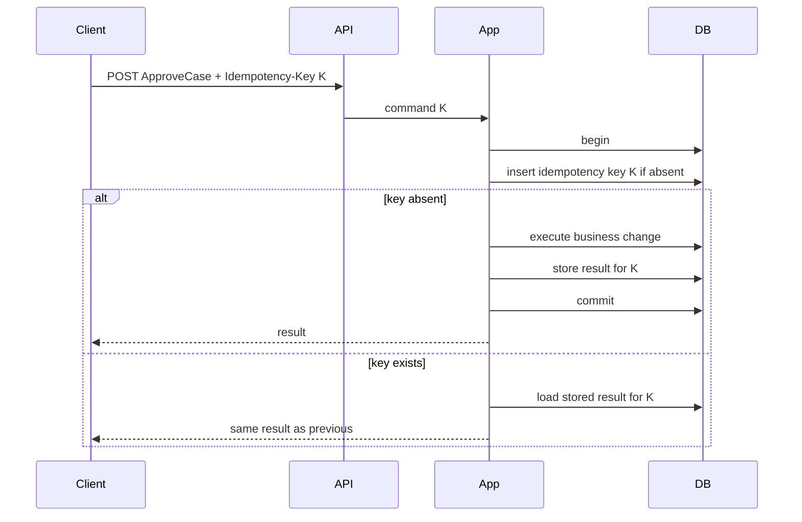
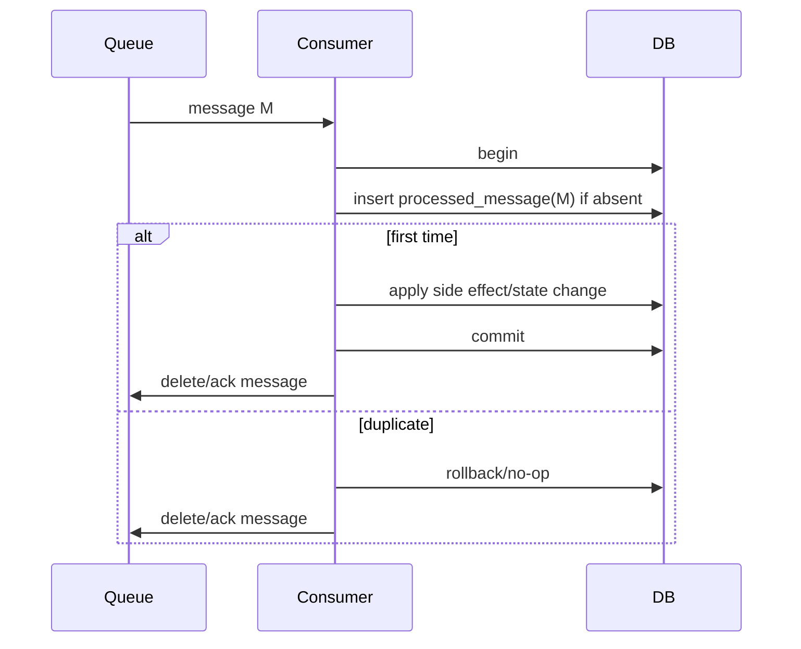
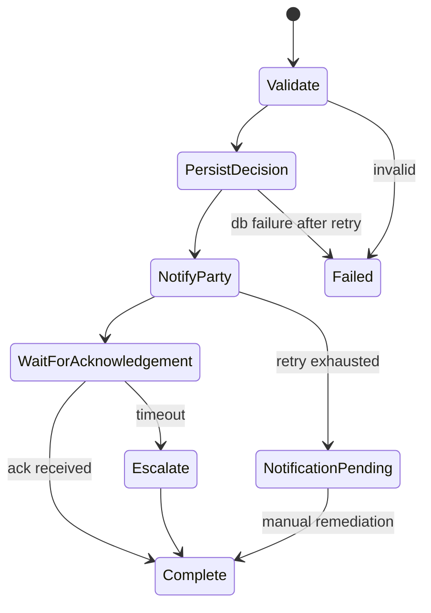
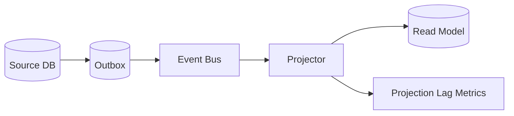
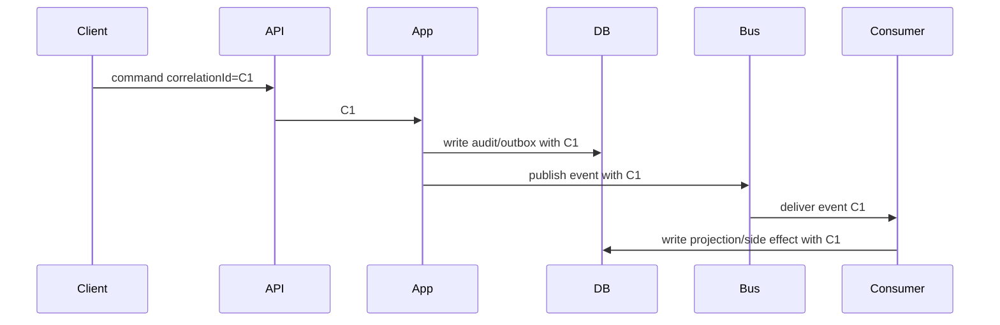
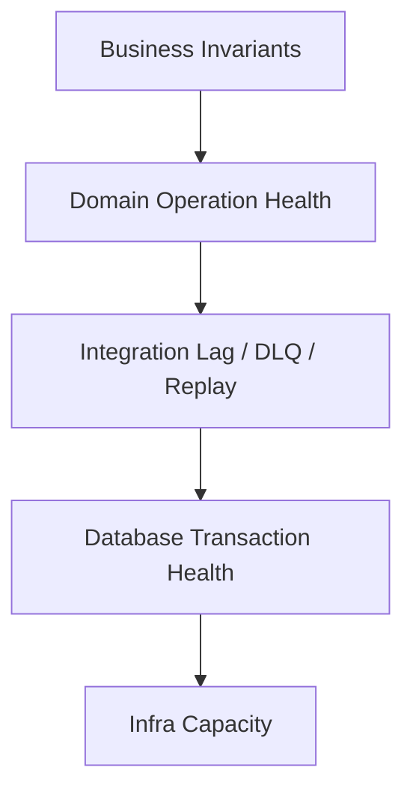

# Part 006 — Operational Invariants: Apa yang Harus Selalu Benar di Production

> Tujuan bagian ini: mengubah cara berpikir dari "service berjalan" menjadi "invariant tetap benar". Production readiness bukan berarti deployment sukses. Production readiness berarti sistem bisa membuktikan bahwa hal-hal penting tetap benar meskipun request timeout, queue backlog, database failover, duplicate event, schema migration, consumer crash, dan partial failure terjadi.

Sistem AWS application + database bukan sekadar kumpulan resource. Ia adalah mesin perubahan state. Mesin ini menerima command, membaca database, menulis state, menerbitkan event, menjalankan workflow, memproses queue, memperbarui projection, dan memicu side effect.

Pertanyaan engineer senior bukan:

```txt
Apakah Lambda/ECS/API Gateway/RDS/DynamoDB/SQS/EventBridge hidup?
```

Pertanyaannya:

```txt
Apakah sistem masih menjaga fakta yang harus selalu benar?
```

Contoh:

- Satu payment authorization tidak boleh dicapture dua kali.
- Case yang sudah closed tidak boleh kembali active tanpa reopening command yang diaudit.
- Event `CaseApproved` tidak boleh diterbitkan sebelum approval commit.
- Notification untuk keputusan final harus eventually terkirim atau masuk daftar remediasi.
- Projection dashboard boleh stale, tetapi tidak boleh diam-diam berhenti update selama berjam-jam.
- Retry tidak boleh membuat duplicate enforcement action.
- Migration tidak boleh membuat versi lama aplikasi gagal menulis.
- Cache miss tidak boleh mengubah keputusan bisnis.

Itulah operational invariant.

---

## 1. Apa Itu Invariant?

Invariant adalah kondisi yang harus tetap benar di semua eksekusi yang valid.

Dalam konteks application + database:

> **Operational invariant adalah janji correctness yang bisa dipertahankan, diamati, dan dipulihkan saat sistem berjalan di production.**

Invariant berbeda dari requirement biasa.

| Hal | Contoh | Bedanya |
|---|---|---|
| Requirement | User bisa approve case | Fitur yang harus tersedia |
| Invariant | Case hanya bisa approved dari status `UNDER_REVIEW` | Kondisi yang tidak boleh dilanggar |
| SLO | 99.9% approve API latency < 300 ms | Target kualitas layanan |
| Metric | `ApproveCase.Count` | Angka observasi |
| Alert | DLQ > 0 selama 5 menit | Sinyal risiko |
| Runbook | Redrive DLQ setelah memperbaiki poison message | Prosedur pemulihan |

Invariant adalah pusatnya. Metric, alert, log, trace, dan runbook hanya alat untuk menjaga invariant.

---

## 2. Tipe Invariant dalam Sistem AWS Application + Database



Kita bahas satu per satu.

---

## 3. Domain Correctness Invariants

Domain invariant adalah aturan bisnis yang tidak boleh dilanggar.

Contoh regulatory case management:

```txt
A case cannot be closed unless:
- all mandatory evidence reviews are complete;
- all enforcement actions are completed, cancelled, or waived;
- closure reason is recorded;
- closing actor is authorized;
- audit entry is appended in the same local transaction.
```

Di database, sebagian invariant bisa ditegakkan dengan constraint:

```sql
ALTER TABLE case_file
ADD CONSTRAINT case_status_valid
CHECK (status IN ('DRAFT', 'UNDER_REVIEW', 'APPROVED', 'CLOSED'));
```

Tetapi state transition lebih baik dijaga application/domain code:

```txt
DRAFT -> UNDER_REVIEW -> APPROVED -> ENFORCEMENT_ACTIVE -> CLOSED
```

Representasi state machine:



Invariant bukan hanya status. Ia juga mencakup transition.

Bad design:

```sql
UPDATE case_file SET status = 'CLOSED' WHERE id = ?;
```

Better design:

```txt
CloseCase(command):
1. Load current case with version/lock.
2. Verify actor authorization.
3. Verify allowed transition.
4. Verify completion dependencies.
5. Update status + version.
6. Append audit.
7. Insert outbox event.
8. Commit.
```

Operational signal:

| Invariant | Metric/check |
|---|---|
| Closed case must have closure reason | periodic SQL/DynamoDB scan/reconciliation count |
| Status transition must be valid | application validation failure count + impossible-state detector |
| Each decision must have audit row | reconciliation between decision table and audit table |
| Reopen requires explicit command | audit event type distribution + manual DB update detector |

Prinsip:

> Jika invariant penting, jangan hanya berharap aplikasi benar. Buat bukti observasi dan reconciliation.

---

## 4. Data Durability Invariants

Durability invariant menjawab:

- setelah command sukses, state apa yang tidak boleh hilang?
- backup apa yang bisa memulihkan state?
- restore point mana yang dapat diterima?
- audit apa yang harus tetap ada?
- data apa yang boleh dibangun ulang?

Contoh:

```txt
If ApproveCase returns success, then:
- case status must be durably stored;
- decision record must exist;
- audit entry must exist;
- outbox event must exist or event must have been durably published;
- idempotency record must prevent duplicate approval.
```

Durability bukan hanya "database managed by AWS". Durability production mencakup:

| Area | Pertanyaan |
|---|---|
| Commit path | Apakah response sukses hanya setelah commit berhasil? |
| Backup | Apakah backup/PITR aktif dan diuji restore? |
| Audit | Apakah audit ditulis atomic dengan decision? |
| Outbox | Apakah integration event tidak hilang saat publish gagal? |
| Idempotency | Apakah retry command menemukan hasil lama? |
| Restore | Apakah RTO/RPO diketahui dan pernah disimulasikan? |
| Derived state | Apakah read model/cache/search bisa dibangun ulang? |

### 4.1 Commit Acknowledgement Rule

Jangan balas sukses sebelum durable state minimum terpenuhi.

Buruk:

```txt
1. Accept command.
2. Publish event.
3. Return success.
4. Later write DB.
```

Jika step 4 gagal, sistem sudah memberi tahu dunia bahwa sesuatu terjadi padahal source of truth tidak berubah.

Lebih sehat:

```txt
1. Accept command.
2. Validate.
3. Write DB + audit + outbox in local transaction.
4. Commit.
5. Return success/accepted.
6. Publish outbox asynchronously.
```

### 4.2 Restore Drill as Invariant

Backup tanpa restore drill adalah asumsi. Operational invariant yang lebih jujur:

```txt
For production source-of-truth databases, the team must be able to restore to a verified environment within the declared RTO and validate domain-level record counts/checksums.
```

Bukti:

- restore job terakhir sukses;
- restore duration;
- sample domain validation;
- checksum/count comparison;
- documented gap between backup time and restore point;
- owner sign-off.

---

## 5. Idempotency Invariants

Idempotency adalah kemampuan memproses operasi yang sama berkali-kali tanpa mengubah hasil melebihi sekali secara semantic.

Dalam AWS, idempotency wajib karena:

- client retry;
- API timeout;
- Lambda retry;
- SQS at-least-once delivery;
- EventBridge retry;
- Step Functions retry;
- network ambiguity;
- deployment interruption.

Invariant:

```txt
The same command identified by the same idempotency key must produce the same business result and must not duplicate side effects.
```

### 5.1 Idempotency Record Pattern



Relational shape:

```sql
CREATE TABLE idempotency_record (
    key text PRIMARY KEY,
    command_type text NOT NULL,
    command_hash text NOT NULL,
    status text NOT NULL,
    response_json jsonb,
    created_at timestamptz NOT NULL,
    expires_at timestamptz
);
```

DynamoDB shape:

```txt
PK = IDEMPOTENCY#<key>
SK = COMMAND#<commandType>
condition: attribute_not_exists(PK)
```

### 5.2 Command Hash Invariant

Idempotency key reuse dengan payload berbeda harus ditolak.

```txt
If key K already exists with command_hash H1,
and a request arrives with key K and command_hash H2,
then H1 must equal H2; otherwise reject as idempotency conflict.
```

Tanpa ini, client bisa tidak sengaja memakai key sama untuk command berbeda.

### 5.3 Side Effect Idempotency

Side effect harus punya idempotency juga:

| Side effect | Idempotency strategy |
|---|---|
| Email | notification id + sent record |
| Payment capture | provider idempotency key / transaction reference |
| Document generation | deterministic document id |
| External webhook | delivery id + retry log |
| Projection update | event id + last processed version |
| Cache eviction | naturally idempotent key delete |

Rule:

> Idempotency tidak berhenti di API. Ia harus melewati semua side effect boundary.

---

## 6. Delivery, Ordering, and Replay Invariants

Messaging system biasanya memberikan at-least-once delivery. Artinya duplicate bukan anomali; duplicate adalah bagian dari model.

Invariant yang lebih aman:

```txt
Every consumer must tolerate duplicate messages and must either process them idempotently or detect prior processing.
```

### 6.1 Message Processing Record

```sql
CREATE TABLE processed_message (
    consumer_name text NOT NULL,
    message_id text NOT NULL,
    processed_at timestamptz NOT NULL,
    PRIMARY KEY (consumer_name, message_id)
);
```

Flow:



### 6.2 Ordering Invariant

Tidak semua sistem butuh ordering. Jika ordering diperlukan, definisikan scope-nya.

Buruk:

```txt
Events must be processed in order.
```

Lebih tepat:

```txt
For a single caseId, lifecycle events must be applied in monotonically increasing caseVersion order.
```

Ordering bisa dijaga dengan:

- aggregate version;
- message group per entity pada FIFO queue;
- conditional write `expectedVersion`;
- consumer buffer kecil untuk out-of-order event;
- reconciliation jika gap terlalu lama;
- state machine command path, bukan event consumer bebas.

### 6.3 Replay Invariant

Replay bukan hanya "kirim ulang event". Replay bisa merusak side effect jika consumer tidak didesain.

Invariant:

```txt
Replay of historical events must rebuild derived state without duplicating irreversible external side effects.
```

Karena itu consumer perlu diklasifikasikan:

| Consumer type | Replay behavior |
|---|---|
| Projection builder | safe to replay; rebuild read model |
| Cache updater | safe; overwrite/delete keys |
| Notification sender | dangerous; must suppress historical send unless requested |
| Payment processor | dangerous; must never replay blindly |
| Audit copier | safe if idempotent by event id |
| Search indexer | safe if deterministic document id |

Rule:

> Jangan punya satu event bus replay policy untuk semua consumer. Replay semantics adalah consumer-specific.

---

## 7. Workflow Progress Invariants

Workflow seperti Step Functions memberi durable control plane, tetapi workflow tetap bisa macet secara domain.

Operational invariant:

```txt
Every workflow execution must reach a terminal state, compensation state, or explicit human-wait state within its expected time budget.
```

Contoh workflow enforcement:



Metrics yang dibutuhkan:

| Invariant | Signal |
|---|---|
| Workflow tidak menggantung | executions open by age |
| Retry tidak infinite | retry count by state |
| Compensation berjalan | compensation started/succeeded/failed |
| Human wait terlihat | wait state count + age |
| Terminal state jelas | success/failure/cancelled/compensated distribution |

Workflow anti-pattern:

- semua failure masuk `Failed` tanpa business classification;
- no timeout di task eksternal;
- retry tanpa max attempt;
- compensation tidak idempotent;
- execution name tidak deterministic sehingga duplicate workflow dibuat;
- workflow status tidak dikaitkan dengan domain entity.

---

## 8. Projection Freshness Invariants

Read model boleh stale. Tetapi stale harus memiliki budget.

Invariant:

```txt
The case overview projection may lag behind source-of-truth events by at most 60 seconds during normal operation, and lag must be visible to operators.
```

Signals:

- last processed event timestamp;
- last processed event sequence/version;
- source event timestamp vs projector processing time;
- queue age;
- DLQ count;
- projection row count vs source count;
- rebuild status.



Projection invariant juga perlu rebuildability:

```txt
If the read model is deleted, the team must be able to rebuild it from source events or source database export without changing source-of-truth data.
```

Jika read model tidak bisa rebuild, ia diam-diam sudah menjadi source of truth. Itu boundary smell.

---

## 9. Capacity Safety Invariants

Capacity issue sering berubah menjadi correctness issue.

Contoh:

- SQS backlog naik → notification terlambat → SLA violation.
- DB connection exhausted → command timeout → client retry storm.
- DynamoDB hot partition → conditional writes gagal → order lifecycle macet.
- Cache memory pressure → eviction tinggi → DB overload.
- Event consumer lambat → projection stale → officer mengambil keputusan dari data lama.

Invariant:

```txt
The system must degrade by shedding optional work before it violates core command correctness.
```

### 9.1 Queue Backlog Invariant

Untuk queue:

```txt
ApproximateAgeOfOldestMessage must remain below the business freshness budget for that queue.
```

Bukan hanya jumlah message. Yang penting adalah umur pekerjaan tertua.

| Queue | Freshness budget | Action |
|---|---:|---|
| notification queue | 5 minutes | scale consumer, check provider errors, DLQ triage |
| projection queue | 60 seconds | scale projector, pause expensive rebuild |
| payment command queue | 30 seconds | page owner immediately |
| analytics export queue | 2 hours | ticket, not page |

### 9.2 Database Connection Invariant

```txt
Application connection usage must not exceed safe pool budget, and failover/restart must not cause reconnection storm.
```

Signals:

- active connections;
- pool wait time;
- connection acquisition timeout;
- DB CPU/memory;
- lock wait;
- transaction duration;
- failover events;
- RDS Proxy metrics if used.

### 9.3 Hot Partition Invariant

Untuk DynamoDB-like workloads:

```txt
No single partition key should receive sustained traffic beyond the design envelope for that access pattern.
```

Signals:

- throttled requests;
- consumed capacity by key if instrumented;
- high cardinality access logs;
- retry count;
- latency p99 per operation;
- conditional check failure split from throttling.

---

## 10. Observability Invariants

AWS Well-Architected Operational Excellence menekankan observability agar tim memahami state workload dan membuat keputusan berbasis data. Untuk sistem application + database, observability harus menjawab tiga pertanyaan:

1. Apa yang terjadi pada satu command?
2. Apakah invariant domain masih benar?
3. Apa yang harus dilakukan operator saat invariant terancam?

### 10.1 Correlation Invariant

```txt
Every externally initiated command must have a correlation ID that appears in API logs, application logs, database audit/outbox metadata, workflow execution, queue/event metadata, and downstream consumer logs where feasible.
```

Tanpa correlation ID, incident menjadi arkeologi.

Flow:



### 10.2 Structured Log Invariant

Log harus bisa dijoin oleh mesin.

Minimal fields:

```json
{
  "timestamp": "2026-07-06T09:12:13Z",
  "level": "INFO",
  "service": "case-service",
  "operation": "CloseCase",
  "correlationId": "c-123",
  "idempotencyKey": "idem-456",
  "caseId": "CASE-789",
  "actorId": "officer-42",
  "stateFrom": "ENFORCEMENT_ACTIVE",
  "stateTo": "CLOSED",
  "result": "SUCCESS",
  "durationMs": 87
}
```

Log buruk:

```txt
case closed successfully
```

Tidak bisa dipakai untuk debugging skala production.

### 10.3 Actionable Alert Invariant

Alert harus mengarah ke tindakan. AWS Well-Architected menyarankan alert yang actionable berdasarkan metric, log, dan trace yang menunjukkan KPI/outcome berisiko.

Alert buruk:

```txt
CPU > 80%
```

Mungkin penting, tetapi tidak selalu actionable.

Alert lebih baik:

```txt
PaymentCaptureQueue oldest message age > 30s for 5m
Impact: payment capture freshness invariant at risk
Owner: payment-platform
Runbook: /runbooks/payment-capture-backlog
```

Alert format:

```txt
Invariant at risk:
Metric/log condition:
Business impact:
Likely causes:
First diagnostic query:
Safe mitigation:
Escalation owner:
Rollback/redrive rule:
```

---

## 11. Invariant Registry

Production-grade team sebaiknya punya registry invariant. Tidak harus tool rumit. Markdown/table pun cukup jika dirawat.

```mdx
# Invariant: Case Closure Requires Audit

## Statement
Every case transition to CLOSED must have exactly one closure audit entry in the same local transaction.

## Owner
Case Service Team

## Scope
Aurora table: case_file, case_audit
Command: CloseCase

## Enforcement
- application state transition validation
- database transaction
- unique constraint on (case_id, audit_type, transition_version)

## Detection
- reconciliation query every 15 minutes
- metric: CaseClosureMissingAudit.Count
- alert if count > 0

## Recovery
- block further closure for affected case if possible
- reconstruct from transaction log/audit source
- append corrective audit entry with incident reference
- post-incident review

## Known Exceptions
None.
```

Registry minimal:

| Field | Isi |
|---|---|
| Invariant ID | stable identifier |
| Statement | hal yang harus selalu benar |
| Owner | team/service owner |
| Scope | service, DB, queue, workflow |
| Enforcement | code/constraint/transaction/policy |
| Detection | metric/query/log/reconciliation |
| Alert | kapan page/ticket |
| Recovery | runbook |
| Test | unit/integration/property/chaos |
| Exceptions | kondisi khusus yang diketahui |

---

## 12. Reconciliation as a First-Class Mechanism

Tidak semua invariant bisa dijaga secara synchronous. Untuk distributed side effects, reconciliation adalah mekanisme utama.

Contoh invariant:

```txt
Every approved enforcement action must eventually have a notification delivery record.
```

Karena notification adalah side effect async, synchronous transaction tidak bisa menjamin. Maka dibuat reconciliation:

```sql
SELECT ea.id
FROM enforcement_action ea
LEFT JOIN notification_delivery nd
  ON nd.entity_id = ea.id
 AND nd.notification_type = 'ENFORCEMENT_APPROVED'
WHERE ea.status = 'APPROVED'
  AND ea.approved_at < now() - interval '10 minutes'
  AND nd.id IS NULL;
```

Hasil query bukan sekadar report. Ia adalah detector invariant violation/pending remediation.

Reconciliation job harus punya:

- schedule;
- owner;
- threshold;
- output metric;
- DLQ/remediation action;
- false positive handling;
- audit trail untuk repair.

---

## 13. Failure Mode Matrix

Gunakan matrix ini saat mendesain invariant.

| Failure mode | Risiko invariant | Mitigasi |
|---|---|---|
| Client retry setelah timeout | duplicate command | idempotency key + stored result |
| DB commit sukses, response gagal | client tidak tahu hasil | idempotency lookup + status query |
| DB commit sukses, event publish gagal | consumer tidak tahu perubahan | transactional outbox + relay retry |
| Event duplicate | duplicate side effect | processed message table/idempotent consumer |
| Event out of order | projection salah | version check + buffer/reconciliation |
| Consumer crash before ack | message diproses ulang | idempotent DB transaction |
| Queue backlog | SLA/freshness violation | age alarm + autoscale + load shedding |
| DLQ growth | poison messages | owner triage + redrive after fix |
| DB failover | connection storm/timeouts | connection pooling/RDS Proxy/backoff |
| Hot partition | throttling | key redesign/write sharding/backoff |
| Cache eviction | stale/miss overload | cache-aside discipline + DB protection |
| Schema migration breaking | old app gagal | expand-migrate-contract |
| Replay historical events | duplicate external side effect | replay mode + consumer classification |

---

## 14. Designing Metrics from Invariants

Jangan mulai dari metric default. Mulai dari invariant.

### 14.1 Example: Close Case

Invariant:

```txt
A CloseCase command that returns success must result in:
- exactly one status transition to CLOSED;
- one closure audit entry;
- one outbox event;
- eventual notification delivery or remediation record.
```

Metrics:

| Metric | Type | Meaning |
|---|---|---|
| `CloseCase.Command.Count` | counter | command volume |
| `CloseCase.Command.Success` | counter | successful closures |
| `CloseCase.Command.Conflict` | counter | invalid state/idempotency conflict |
| `CloseCase.Transaction.Rollback` | counter | failed local transaction |
| `CloseCase.MissingAudit.Count` | gauge | reconciliation violation |
| `Outbox.Unpublished.AgeMax` | gauge | event publication risk |
| `Notification.Pending.AgeMax` | gauge | side effect freshness risk |
| `CloseCase.IdempotencyReplay.Count` | counter | retry/replay visibility |

### 14.2 Example: Projection

Invariant:

```txt
Case overview projection lag must remain below 60 seconds in normal operation.
```

Metrics:

| Metric | Meaning |
|---|---|
| `Projection.EventsProcessed.Count` | throughput |
| `Projection.EventLag.Seconds` | source timestamp to processing time |
| `Projection.LastProcessedEventAge.Seconds` | staleness |
| `Projection.DLQ.Count` | poison event count |
| `Projection.Rebuild.InProgress` | rebuild state |
| `Projection.Rebuild.Duration` | recovery capability |

---

## 15. Testing Invariants

Invariant tidak cukup ditulis. Ia harus diuji.

### 15.1 Unit Test

Cocok untuk state transition dan validation.

```txt
given case.status = CLOSED
when ApproveCase
then reject invalid transition
```

### 15.2 Integration Test

Cocok untuk transaction + outbox.

```txt
when CloseCase succeeds
then case row updated
and audit row inserted
and outbox row inserted
in same transaction
```

### 15.3 Idempotency Test

```txt
when same idempotency key is submitted twice
then only one business change occurs
and second response equals first response
```

### 15.4 Consumer Duplicate Test

```txt
given same event delivered twice
when consumer processes both
then side effect occurs once
and second event is acknowledged/no-op
```

### 15.5 Replay Test

```txt
given historical events
when projector rebuilds read model
then read model equals expected projection
and no external notification is sent
```

### 15.6 Migration Compatibility Test

```txt
given App V1 and App V2
when expanded schema is deployed
then both versions can read/write safely
```

### 15.7 Game Day / Failure Drill

Simulasikan:

- outbox relay mati 30 menit;
- queue consumer error dan DLQ naik;
- DB failover;
- duplicate event burst;
- projection table dihapus lalu rebuild;
- schema migration rollback;
- cache cluster restart;
- external provider timeout.

Pertanyaan bukan "apakah failure terjadi". Pertanyaannya:

```txt
Apakah invariant tetap benar, terdeteksi, atau bisa dipulihkan dengan runbook?
```

---

## 16. Invariant-Driven Runbook

Runbook harus dimulai dari invariant yang terancam.

Contoh:

```mdx
# Runbook: Notification Pending Age Exceeds Budget

## Invariant
Every closed case must have notification delivered or remediation created within 10 minutes.

## Alert
Notification.Pending.AgeMax > 600 seconds for 5 minutes.

## Impact
Parties may not receive legally required closure notification within SLA.

## First Checks
1. Check notification provider error rate.
2. Check SQS oldest message age and visible message count.
3. Check consumer deployment health.
4. Check DLQ for poison messages.
5. Check recent schema/event changes.

## Safe Mitigations
1. Scale consumers if provider healthy.
2. Pause new non-critical notification types if backlog is mixed.
3. Move poison messages to quarantine after sample analysis.
4. Redrive only after consumer fix is deployed.

## Do Not
- Do not blindly replay all historical events.
- Do not mark notification as delivered without provider confirmation.
- Do not edit source-of-truth case status to hide alert.

## Recovery Validation
- Pending age below 10 minutes.
- DLQ stable/empty.
- Reconciliation query returns zero missing required notifications.
- Incident audit record created.
```

---

## 17. AWS Service Signals Mapped to Invariants

| AWS area | Signal | Invariant it protects |
|---|---|---|
| API Gateway / app logs | 4xx/5xx, latency, request ID | command availability and validation |
| Lambda/ECS service | errors, duration, concurrency, restarts | processing capacity and correctness |
| SQS | ApproximateAgeOfOldestMessage, visible messages, DLQ | async freshness and poison message handling |
| EventBridge | failed invocations, rule metrics, archive/replay status | event routing reliability |
| Step Functions | executions failed/timed out/aborted, state duration | workflow progress |
| Aurora/RDS | connections, deadlocks, lock waits, replica lag, CPU, storage | transaction and read correctness |
| DynamoDB | throttled requests, conditional check failures, consumed capacity | key design and concurrency correctness |
| ElastiCache/MemoryDB | evictions, memory, CPU, replication lag, connections | cache availability and staleness risk |
| CloudWatch Logs/Metrics/Alarms | metric filters, alarms, dashboards | detection and response |
| X-Ray/OpenTelemetry traces | distributed trace spans | correlation and latency attribution |

Default cloud metrics are a starting point. Domain metrics are mandatory.

Example domain metric names:

```txt
CaseTransition.Invalid.Count
CaseClosure.MissingAudit.Count
Outbox.Unpublished.AgeMax
Projection.CaseOverview.LagSeconds
Notification.Required.PendingAgeMax
Workflow.EnforcementApproval.Timeout.Count
Idempotency.Conflict.Count
Consumer.DuplicateMessage.Count
```

---

## 18. Building an Invariant Dashboard

Dashboard jangan hanya CPU, memory, request count. Susun dari atas ke bawah:



Layer 1: Business invariant

- open case count by lifecycle;
- closed case missing audit;
- approved action missing notification;
- SLA breached cases.

Layer 2: Command health

- command success/error/conflict;
- p50/p95/p99 latency;
- idempotency replay/conflict;
- validation failure.

Layer 3: Integration health

- outbox unpublished age;
- queue oldest age;
- DLQ count;
- consumer processing failures;
- projection lag.

Layer 4: Database health

- connections;
- lock wait;
- deadlocks;
- slow queries;
- replica lag;
- storage growth.

Layer 5: Infrastructure health

- CPU/memory;
- concurrency;
- network errors;
- deployment events.

Dashboard yang baik memungkinkan engineer melihat:

```txt
Business symptom -> command path -> integration path -> database/infra cause
```

bukan sebaliknya.

---

## 19. Example: Full Invariant Set for Case Closure

| ID | Invariant | Enforcement | Detection | Recovery |
|---|---|---|---|---|
| CC-001 | Case can close only from allowed statuses | domain state machine | invalid transition metric | reject command |
| CC-002 | Closure requires authorized actor | auth policy + app validation | authorization failure metric | reject + audit suspicious access |
| CC-003 | Closure writes audit in same transaction | DB transaction | reconciliation query | corrective audit with incident ref |
| CC-004 | Closure emits durable integration signal | transactional outbox | outbox unpublished age | relay retry/redrive |
| CC-005 | Duplicate command does not duplicate closure | idempotency record | replay count/conflict count | return stored result |
| CC-006 | Required notification eventually sent | notification consumer | missing notification reconciliation | redrive/manual remediation |
| CC-007 | Dashboard may lag max 60s | projection consumer | projection lag metric | scale/rebuild projector |
| CC-008 | Closed case cannot be edited except reopen flow | command validation + DB policy | impossible update detector | lock record/investigate |

This table is more valuable than a beautiful architecture diagram. It tells the team what correctness means.

---

## 20. Common Mistakes

### Mistake 1: Treating Monitoring as Observability

Monitoring says something is wrong. Observability helps explain why. Invariant-driven observability says which correctness promise is at risk.

### Mistake 2: Alerting on Symptoms Without Ownership

If no one owns the alert, the alert is documentation noise.

### Mistake 3: No Reconciliation Because "Events Are Reliable"

Managed services improve reliability, but distributed systems still have ambiguity, poison messages, bugs, schema drift, and operator error. Reconciliation is not distrust; it is engineering discipline.

### Mistake 4: Assuming Idempotency at One Layer Is Enough

API idempotency does not protect notification, payment, projection, or external webhook unless propagated.

### Mistake 5: Treating Read Model as Always Correct

Read model is useful because it is shaped for reads. That also means it can lag, fail, drift, or need rebuild.

### Mistake 6: No Restore Drill

Backup configuration is not recovery capability. Restore capability is proven only after restore and validation.

### Mistake 7: Infinite Retry

Retry without budget, backoff, idempotency, and DLQ turns failure into load amplifier.

---

## 21. Practical Design Sequence

Saat mendesain fitur baru, lakukan urutan ini:

1. Tulis command utama.
2. Tulis state transition.
3. Tulis source of truth.
4. Tulis invariant domain.
5. Tentukan transaction boundary.
6. Tentukan idempotency key.
7. Tentukan side effect setelah commit.
8. Tentukan event/outbox/queue/workflow.
9. Tentukan projection/cache/read model.
10. Tulis failure mode matrix.
11. Tulis metrics dari invariant.
12. Tulis alerts dari risk threshold.
13. Tulis runbook.
14. Tulis reconciliation query/job.
15. Baru pilih detail AWS service/config.

Kenapa service/config belakangan? Karena tanpa invariant, service terbaik pun bisa dipakai untuk desain yang salah.

---

## 22. Latihan Praktis

Pilih satu flow production yang kompleks, misalnya:

- approve enforcement action;
- submit evidence;
- close case;
- create invoice;
- capture payment;
- provision account;
- publish legal notification.

Isi table ini:

| Pertanyaan | Jawaban |
|---|---|
| Command utama |  |
| Source of truth |  |
| State transition |  |
| Invariant domain |  |
| Invariant durability |  |
| Invariant idempotency |  |
| Invariant delivery |  |
| Invariant workflow progress |  |
| Invariant projection freshness |  |
| Invariant capacity |  |
| Metric utama |  |
| Alert utama |  |
| Reconciliation query/job |  |
| Runbook recovery |  |
| Game day scenario |  |

Kemudian tulis satu invariant dalam format registry:

```mdx
# Invariant: <name>

## Statement

## Owner

## Scope

## Enforcement

## Detection

## Alert

## Recovery

## Test
```

Jika kamu tidak bisa menulis invariant, kamu belum benar-benar memahami fitur itu.

---

## 23. Ringkasan Mental Model

Operational invariant adalah jembatan antara architecture dan production reality.

- Architecture diagram menunjukkan komponen.
- Sequence diagram menunjukkan aliran.
- Invariant menunjukkan apa yang harus tetap benar.
- Metrics menunjukkan apakah invariant terancam.
- Alerts mengubah risiko menjadi tindakan.
- Runbook mengubah tindakan menjadi recovery.
- Reconciliation menangkap gap yang tidak bisa dicegah synchronous.
- Drill membuktikan recovery bukan asumsi.

Kalimat yang harus diingat:

> **Sistem production tidak dinilai dari seberapa rapi diagramnya, tetapi dari kemampuannya menjaga invariant saat failure terjadi.**

Atau lebih tajam:

> **Jika kamu tidak bisa menyebutkan invariant-nya, kamu belum mendesain sistemnya. Kamu baru menggambar infrastrukturnya.**

---

## Referensi

- AWS Well-Architected Framework — overview dan pilar: https://docs.aws.amazon.com/wellarchitected/latest/framework/welcome.html
- AWS Well-Architected Operational Excellence — implement observability: https://docs.aws.amazon.com/wellarchitected/latest/operational-excellence-pillar/implement-observability.html
- AWS Well-Architected — create actionable alerts: https://docs.aws.amazon.com/wellarchitected/latest/framework/ops_workload_observability_create_alerts.html
- AWS Prescriptive Guidance — Transactional outbox pattern: https://docs.aws.amazon.com/prescriptive-guidance/latest/cloud-design-patterns/transactional-outbox.html
- AWS Prescriptive Guidance — Saga patterns: https://docs.aws.amazon.com/prescriptive-guidance/latest/cloud-design-patterns/saga.html
- AWS Prescriptive Guidance — Saga orchestration pattern: https://docs.aws.amazon.com/prescriptive-guidance/latest/cloud-design-patterns/saga-orchestration.html
- AWS Prescriptive Guidance — Saga choreography pattern: https://docs.aws.amazon.com/prescriptive-guidance/latest/cloud-design-patterns/saga-choreography.html
- Amazon SQS Developer Guide — visibility timeout, dead-letter queues, message lifecycle: https://docs.aws.amazon.com/AWSSimpleQueueService/latest/SQSDeveloperGuide/welcome.html
- AWS Step Functions Developer Guide — service integration patterns and workflow error handling: https://docs.aws.amazon.com/step-functions/latest/dg/welcome.html
