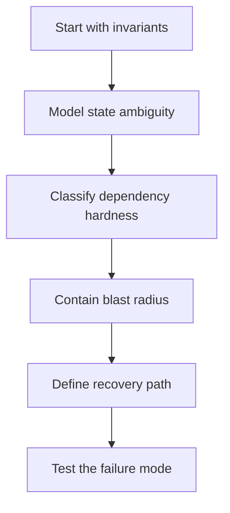
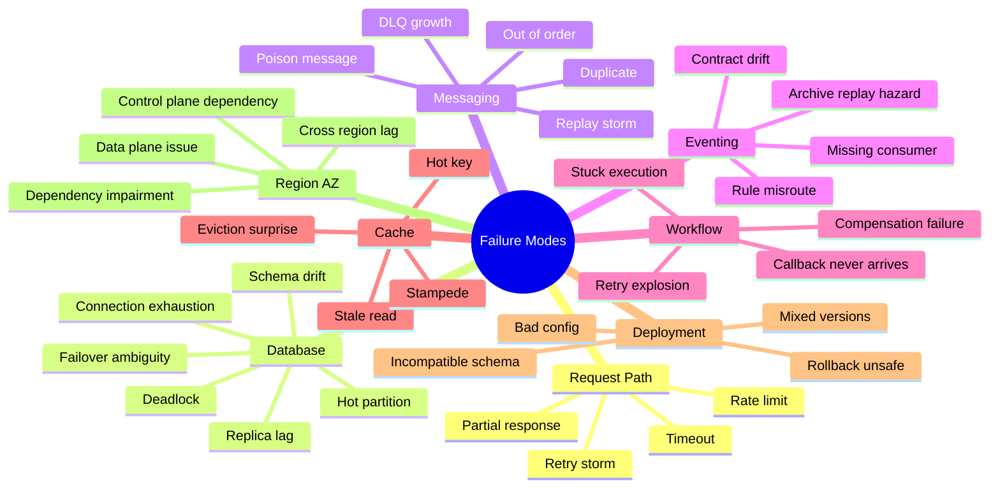
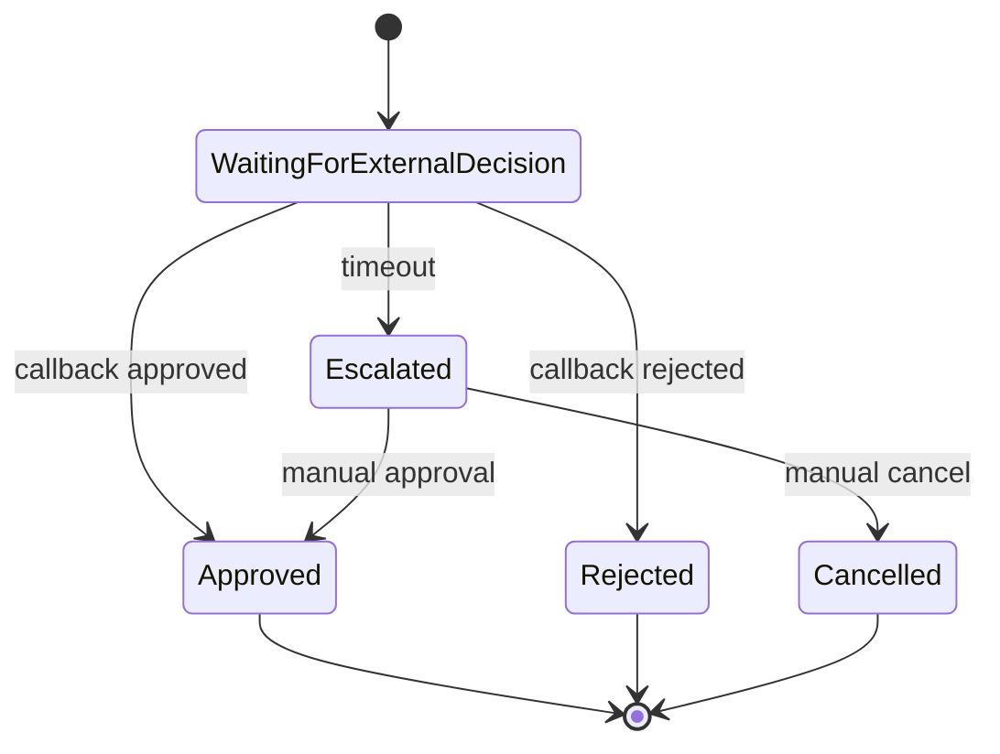
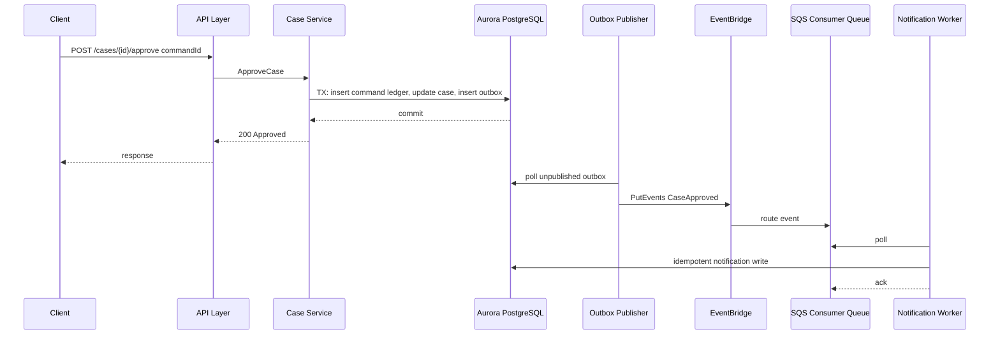

# Part 007 — Failure-Model-First Design untuk Application dan Database

> Tujuan bagian ini: membangun kebiasaan desain yang dimulai dari kegagalan. Bukan karena kita pesimis, tetapi karena sistem production tidak gagal dalam bentuk yang rapi. Ia gagal sebagian, terlambat, berulang, ambigu, dan sering meninggalkan state yang sudah berubah.

Dalam sistem application + database, happy path biasanya mudah:

```txt
request masuk -> validasi -> tulis database -> kirim event -> response sukses
```

Masalah production muncul ketika salah satu langkah tidak jelas statusnya:

```txt
request masuk -> validasi -> tulis database sukses -> response timeout -> client retry -> event terkirim dua kali?
```

Atau:

```txt
consumer baca message -> update database sukses -> ack ke queue gagal -> message dikirim ulang
```

Atau:

```txt
workflow sudah reserve inventory -> payment timeout -> compensation gagal -> order menggantung
```

Engineer yang hanya mendesain happy path akan menambahkan retry, DLQ, cache, replica, dan workflow sebagai patch. Engineer yang matang akan memulai dari pertanyaan:

```txt
Ketika dependency gagal, state mana yang sudah berubah, siapa yang tahu, siapa yang belum tahu, dan invariant apa yang masih harus benar?
```

Itulah failure-model-first design.

---

## 1. Definisi: Failure Model

Failure model adalah deskripsi eksplisit tentang:

1. komponen apa yang bisa gagal,
2. bagaimana bentuk kegagalannya,
3. bagaimana kegagalan itu terlihat oleh caller,
4. state apa yang mungkin sudah berubah,
5. invariant apa yang tetap harus dijaga,
6. bagaimana sistem membatasi dampaknya,
7. bagaimana sistem mendeteksi dan memulihkannya.

Bukan cukup menulis:

```txt
Database bisa down.
```

Itu terlalu dangkal. Bentuk yang lebih berguna:

```txt
Pada command ApproveCase, database writer Aurora bisa mengalami failover setelah commit tetapi sebelum aplikasi menerima ACK. Caller melihat timeout. State case mungkin sudah APPROVED. Client boleh retry dengan idempotency key yang sama. Sistem harus mengembalikan response deterministik berdasarkan hasil command pertama, bukan membuat approval kedua.
```

Failure model yang baik selalu menghubungkan **failure signal** dengan **state ambiguity**.

---

## 2. Error, Fault, Failure, Degradation, Incident

Kita perlu vocabulary yang presisi.

| Istilah | Arti Praktis | Contoh |
|---|---|---|
| Error | Kondisi salah pada level operasi | Query timeout, conditional write failed, 5xx dari dependency |
| Fault | Penyebab potensial error | Bug deployment, AZ impairment, hot partition, bad config |
| Failure | Sistem gagal memenuhi kontrak | Approval tidak tersimpan, payment dicapture dua kali |
| Degradation | Fungsi masih berjalan tetapi kualitas turun | Latency naik, fallback read stale, notification tertunda |
| Incident | Degradation/failure yang berdampak pada outcome bisnis atau SLO | Queue backlog membuat SLA case breach |

Tidak semua error adalah incident. Tidak semua incident diawali error yang jelas. Banyak incident application + database dimulai dari **silent degradation**:

- consumer mati tetapi queue masih menerima message,
- projection berhenti update tetapi API read masih 200,
- cache menyajikan data stale tanpa metadata freshness,
- event schema berubah dan sebagian consumer drop event,
- replica lag besar tetapi read endpoint tetap melayani query.

Failure-model-first design memaksa kita mencari silent failure sebelum user menemukannya.

---

## 3. Prinsip Utama

Ada lima prinsip yang akan dipakai sepanjang seri ini.



### 3.1 Mulai dari invariant

Jangan mulai dari service.

Bukan:

```txt
Pakai SQS supaya reliable.
```

Tapi:

```txt
Setiap CaseApproved yang sudah commit harus eventually diproses oleh notification worker, dan duplicate event tidak boleh membuat duplicate notification final.
```

Dari situ baru tentukan:

- butuh transactional outbox atau tidak,
- butuh SQS queue per consumer atau tidak,
- butuh idempotency ledger atau tidak,
- butuh DLQ dan redrive policy seperti apa,
- butuh reconciliation job apa.

### 3.2 Modelkan ambiguity, bukan hanya error

Error paling berbahaya adalah error yang tidak memberi tahu apakah state sudah berubah.

| Operasi | Error | State Ambiguity |
|---|---|---|
| Insert row | Connection reset setelah commit | Row mungkin sudah ada |
| Publish event | Timeout dari API | Event mungkin sudah diterima bus |
| Charge payment | 504 dari provider | Payment mungkin captured |
| Ack queue | Consumer crash setelah DB write | Message akan diproses ulang |
| Workflow task | Timeout callback | External party mungkin sudah bertindak |

Rule praktis:

> Jika caller tidak tahu apakah side effect sudah terjadi, operasi itu wajib punya idempotency key atau reconciliation path.

### 3.3 Dependency hardness harus eksplisit

Tidak semua dependency sama.

| Jenis Dependency | Kalau Gagal | Contoh |
|---|---|---|
| Hard dependency | Request harus gagal atau ditahan | Primary database untuk command write |
| Soft dependency | Fitur bisa degrade | Recommendation service, non-critical enrichment |
| Async dependency | Request utama tetap bisa sukses, side effect diproses nanti | Notification, audit projection |
| Optional dependency | Bisa dilewati dengan default aman | Feature flag non-critical, UI personalization |
| Administrative dependency | Tidak boleh dibutuhkan di path recovery kritis | Deploy pipeline, manual config change |
| Derived-state dependency | Bisa rebuild dari source of truth | Search index, cache, dashboard projection |

AWS Well-Architected Reliability menekankan graceful degradation untuk mengubah hard dependency yang cocok menjadi soft dependency, static stability untuk menghindari perilaku bimodal, dan penggunaan data plane daripada control plane saat recovery. Dalam desain application + database, ini berarti command path tidak boleh bergantung pada dependency yang sebenarnya hanya memperkaya response.

### 3.4 Containment lebih penting daripada hero recovery

Recovery yang bagus tidak menggantikan containment.

Containment berarti:

- satu consumer rusak tidak menjatuhkan semua consumer,
- satu tenant hot tidak menghabiskan partition capacity tenant lain,
- satu event poison tidak menghentikan seluruh stream,
- satu query mahal tidak menghabiskan connection pool,
- satu workflow stuck tidak menahan semua worker,
- satu schema migration gagal tidak memblokir rollback aplikasi.

### 3.5 Semua failure mode harus punya test

Failure model yang tidak diuji hanyalah dokumentasi aspiratif.

Setiap failure mode minimal punya:

```txt
Trigger -> Expected Behavior -> Detection -> Recovery -> Evidence
```

Contoh:

```txt
Trigger:
  kill consumer setelah DB commit sebelum message ack

Expected Behavior:
  message diproses ulang
  idempotency ledger mendeteksi duplicate
  tidak ada duplicate business effect

Detection:
  metric duplicate_processing_count naik
  no domain invariant violation

Recovery:
  tidak perlu manual recovery

Evidence:
  test integration merah kalau notification final terkirim dua kali
```

---

## 4. Failure Model Canvas

Gunakan canvas ini sebelum memilih service.

```txt
Operation:
  Nama command/query/workflow/event consumer.

Business invariant:
  Kondisi yang tidak boleh dilanggar.

State owner:
  Database/table/aggregate yang menjadi source of truth.

Side effects:
  Event, external API call, notification, projection, cache invalidation.

Dependencies:
  Hard, soft, async, optional, derived.

Ambiguous points:
  Titik di mana caller/consumer tidak tahu apakah state berubah.

Expected failure behavior:
  Fail fast, retry, degrade, enqueue, compensate, reconcile, or stop.

Containment boundary:
  Tenant, aggregate, queue, message group, partition key, workflow execution, DB transaction.

Detection:
  Metrics, logs, traces, reconciliation query, DLQ, lag, freshness.

Recovery:
  Automatic retry, redrive, manual approval, compensation, rebuild projection, restore backup.

Test:
  Unit, integration, load, chaos/game day, migration rehearsal.
```

Kunci canvas ini adalah memaksa hubungan antara **business invariant** dan **technical mechanism**.

---

## 5. Taxonomy Kegagalan pada AWS Application + Database



Kita bahas kategori yang paling relevan untuk seri ini.

---

## 6. Request Path Failure

Request path adalah alur synchronous dari caller ke service.

Contoh:

```txt
Client -> API Gateway -> Application Service -> Database -> Response
```

Failure mode utama:

1. timeout,
2. retry storm,
3. overload,
4. dependency 5xx,
5. response hilang setelah commit,
6. client retry tanpa idempotency.

### 6.1 Timeout bukan sekadar angka

Timeout adalah keputusan bisnis dan operasional.

Timeout terlalu panjang:

- thread/connection tertahan,
- caller menunggu terlalu lama,
- overload menyebar,
- retry menumpuk dari upstream.

Timeout terlalu pendek:

- operasi yang sebenarnya sehat dianggap gagal,
- retry berlebihan,
- duplicate request meningkat,
- tail latency makin buruk.

Gunakan aturan praktis:

```txt
Caller timeout > callee internal timeout + network budget + safety margin
```

Dan:

```txt
Total retry duration harus lebih kecil dari deadline bisnis operasi.
```

Jangan membuat chain seperti ini:

```txt
API timeout 30s
  Service A retry 3x @ 10s
    Service B retry 3x @ 10s
      DB query timeout 30s
```

Ini bukan reliability. Ini amplification machine.

### 6.2 Retry harus punya budget

Retry membantu transient failure, tetapi merusak sistem saat failure permanen atau overload.

Retry yang aman punya:

- bounded attempts,
- exponential backoff,
- jitter,
- total deadline,
- idempotency,
- circuit breaker atau load shedding untuk dependency yang terus gagal.

Pattern:

```txt
attempt 1 immediately
attempt 2 after randomized small delay
attempt 3 after larger randomized delay
stop when deadline exceeded
surface deterministic failure
```

Pseudo-code Java:

```java
public final class RetryBudget {
    private final Instant deadline;
    private final int maxAttempts;

    public RetryBudget(Duration totalBudget, int maxAttempts) {
        this.deadline = Instant.now().plus(totalBudget);
        this.maxAttempts = maxAttempts;
    }

    public boolean canRetry(int attempt) {
        return attempt < maxAttempts && Instant.now().isBefore(deadline);
    }
}
```

Butuh diingat: retry hanya aman untuk operasi yang idempotent atau operasi yang belum menghasilkan side effect.

### 6.3 Fail fast vs wait

Gunakan fail fast ketika:

- dependency sedang overload,
- request tidak punya chance sukses dalam deadline,
- operasi bukan business-critical,
- queue/buffer sudah penuh,
- caller bisa retry later.

Gunakan wait/enqueue ketika:

- operation bisa diproses asynchronous,
- user tidak membutuhkan hasil final saat itu juga,
- ada durability untuk command,
- ada status endpoint atau event notification.

Contoh buruk:

```txt
User klik approve -> API menunggu 7 dependency selesai -> timeout -> user retry -> duplicate side effect
```

Contoh lebih sehat:

```txt
User klik approve -> command divalidasi dan dicatat -> response 202 Accepted -> workflow/queue memproses side effect -> user melihat status progress
```

---

## 7. Database Failure

Database failure bukan hanya database mati. Banyak failure database terjadi saat database tetap “available”.

### 7.1 Connection exhaustion

Gejala:

- latency naik,
- aplikasi timeout,
- DB CPU belum tentu tinggi,
- connection pool penuh,
- retry memperburuk keadaan.

Penyebab umum:

- pool size terlalu besar per instance,
- autoscaling aplikasi menambah koneksi lebih cepat dari kapasitas DB,
- query lambat menahan connection,
- transaction terlalu lama,
- Lambda/serverless concurrency membuka koneksi terlalu banyak,
- tidak ada proxy/pooling layer yang sesuai.

Invariant:

```txt
Kenaikan concurrency aplikasi tidak boleh menghabiskan database connection secara tidak terkendali.
```

Containment:

- pool per service dibatasi,
- timeout query jelas,
- transaction pendek,
- backpressure sebelum DB,
- RDS Proxy atau pooling layer bila cocok,
- alarm pada connection utilization dan wait.

### 7.2 Transaction deadlock dan lock wait

Deadlock bukan bug database. Ia sering bug ordering aplikasi.

Contoh:

```txt
Transaction A: lock case -> lock account
Transaction B: lock account -> lock case
```

Solusi:

- lock ordering konsisten,
- transaction kecil,
- gunakan optimistic concurrency untuk aggregate update,
- retry transaction yang memang aman,
- jangan melakukan external call di dalam transaction.

Rule:

```txt
Jangan tahan DB transaction sambil menunggu network call.
```

### 7.3 Failover ambiguity

Pada managed relational database, failover bisa membuat connection putus. Aplikasi mungkin tidak tahu apakah commit terakhir berhasil.

Kasus:

```txt
BEGIN
UPDATE case SET status='APPROVED'
COMMIT
connection reset before client receives success
```

Aplikasi melihat failure. Database mungkin sudah commit.

Mitigasi:

- command idempotency key,
- unique command ledger,
- read-after-retry berdasarkan command id,
- transactionally persisted outbox,
- clear response reconstruction.

Pattern:

```sql
CREATE TABLE command_ledger (
  command_id TEXT PRIMARY KEY,
  command_type TEXT NOT NULL,
  aggregate_id TEXT NOT NULL,
  status TEXT NOT NULL,
  response_json JSONB,
  created_at TIMESTAMPTZ NOT NULL DEFAULT now()
);
```

Saat retry dengan `command_id` sama, aplikasi tidak menjalankan command ulang. Ia membaca hasil command sebelumnya.

### 7.4 Replica lag

Read replica memperbesar kapasitas baca, tetapi membawa masalah freshness.

Failure mode:

```txt
User update case -> langsung baca dari replica -> status lama -> user retry command
```

Mitigasi:

- read-your-writes dari writer untuk session tertentu,
- response command mengandung state baru,
- version token,
- fallback to writer untuk aggregate baru diubah,
- expose freshness metadata pada projection.

Jangan menyembunyikan staleness jika user perlu keputusan final.

### 7.5 Hot partition dan throttling

Pada database partitioned seperti DynamoDB, desain key yang buruk bisa membuat sebagian partition panas walau total capacity terlihat cukup.

Contoh:

```txt
partition_key = current_date
```

Semua write hari ini menuju key yang sama.

Mitigasi:

- key cardinality tinggi,
- write sharding bila diperlukan,
- access pattern eksplisit,
- adaptive capacity bukan alasan untuk desain sembrono,
- alarm pada throttling dan latency, bukan hanya total request count.

### 7.6 Schema drift dan mixed versions

Deployment modern sering membuat beberapa versi aplikasi berjalan bersamaan.

Failure mode:

```txt
v1 masih menulis kolom lama
v2 sudah membaca kolom baru mandatory
migration menghapus kolom sebelum semua v1 mati
```

Mitigasi:

- expand-migrate-contract,
- additive changes first,
- dual-read/dual-write sementara,
- backward-compatible schema,
- migration rehearsal,
- rollback plan yang realistis.

Ini akan dibahas lebih dalam di part zero-downtime schema change.

---

## 8. Messaging Failure

Queue dan event bus tidak menghapus failure. Mereka mengubah bentuk failure.

### 8.1 Duplicate message

Asumsikan duplicate akan terjadi.

Invariant:

```txt
Memproses message yang sama lebih dari satu kali tidak boleh menggandakan business effect.
```

Mechanism:

- idempotency key dalam message,
- inbox table per consumer,
- unique constraint pada side effect,
- deterministic handler.

Contoh inbox:

```sql
CREATE TABLE consumer_inbox (
  consumer_name TEXT NOT NULL,
  message_id TEXT NOT NULL,
  processed_at TIMESTAMPTZ NOT NULL DEFAULT now(),
  PRIMARY KEY (consumer_name, message_id)
);
```

Handler:

```java
@Transactional
public void handle(CaseApproved event) {
    if (inbox.alreadyProcessed("notification-worker", event.eventId())) {
        return;
    }

    notificationRepository.createFinalDecisionNotification(
        event.caseId(),
        event.eventId()
    );

    inbox.markProcessed("notification-worker", event.eventId());
}
```

### 8.2 Out-of-order message

Ordering global mahal. Biasanya yang dibutuhkan adalah ordering per aggregate.

Contoh:

```txt
CaseClosed sampai sebelum CaseApproved
```

Solusi tergantung domain:

- reject event lama berdasarkan version,
- buffer sementara,
- query source of truth,
- gunakan FIFO/message group bila ordering per key wajib,
- desain event sebagai state transition dengan `aggregateVersion`.

Event tanpa version membuat consumer menebak.

### 8.3 Poison message

Poison message adalah message yang selalu gagal diproses.

Penyebab:

- schema tidak kompatibel,
- data domain invalid,
- bug handler,
- dependency downstream permanen gagal,
- message terlalu besar atau corrupt.

Mitigasi:

- bounded retry,
- DLQ,
- alert DLQ,
- redrive setelah fix,
- quarantine untuk investigasi,
- message contract tests.

Jangan redrive DLQ sebelum tahu penyebabnya. Itu hanya membuat incident berulang.

### 8.4 Replay storm

Replay berguna untuk recovery, tetapi berbahaya jika consumer tidak siap.

Failure mode:

```txt
100 juta event replay -> consumer update projection -> DB throttling -> API ikut lambat
```

Mitigasi:

- replay window dibatasi,
- rate limit replay,
- consumer idempotent,
- projection rebuild mode terpisah,
- isolate workload replay dari online traffic,
- monitor lag dan write pressure.

---

## 9. Eventing Failure

Event bus seperti EventBridge membantu routing, filtering, archive, dan integrasi, tetapi event-driven architecture punya failure mode sendiri.

### 9.1 Contract drift

Producer mengubah shape event. Consumer diam-diam gagal parse.

Mitigasi:

- envelope stabil,
- version field,
- additive change,
- schema registry/contract tests,
- consumer tolerant reader,
- dead-letter atau failure destination untuk target yang gagal.

Envelope minimum:

```json
{
  "id": "evt_01H...",
  "source": "case-service",
  "detailType": "CaseApproved",
  "version": "1",
  "time": "2026-07-06T10:15:30Z",
  "correlationId": "corr_...",
  "causationId": "cmd_...",
  "detail": {
    "caseId": "case_123",
    "aggregateVersion": 42
  }
}
```

### 9.2 Missing consumer

Event berhasil dipublish, tetapi consumer yang seharusnya bertindak belum ada, salah rule, atau disabled.

Pertanyaan desain:

```txt
Apakah producer bertanggung jawab memastikan semua consumer ada?
```

Biasanya tidak. Tetapi sistem tetap butuh detection:

- event bus metrics,
- target invocation failure,
- consumer lag,
- business reconciliation,
- projection freshness alarm.

### 9.3 Event as notification vs event as fact

Event sebagai fact:

```txt
CaseApproved occurred.
```

Event sebagai command terselubung:

```txt
PleaseSendApprovalEmail.
```

Keduanya valid, tetapi failure model berbeda.

| Tipe | Source of Truth | Consumer Freedom | Risiko |
|---|---|---|---|
| Domain event/fact | Domain state | Consumer bebas bereaksi | Consumer harus tahu interpretasi |
| Integration command | Producer workflow | Consumer menjalankan instruksi | Coupling lebih kuat |

Jangan mencampur tanpa sadar.

---

## 10. Workflow Failure

Workflow orchestration seperti Step Functions membuat control flow eksplisit. Itu membantu audit dan recovery, tetapi bukan berarti workflow tidak bisa gagal.

Failure mode umum:

- task timeout,
- retry terlalu agresif,
- compensation gagal,
- callback token tidak pernah dipanggil,
- workflow stuck karena human approval,
- state machine version berubah saat execution lama masih berjalan,
- payload membesar,
- downstream side effect tidak idempotent.

### 10.1 Long-running transaction bukan DB transaction

Salah satu kesalahan besar:

```txt
Menahan DB transaction selama workflow beberapa menit/jam.
```

Yang benar:

```txt
Setiap step melakukan commit kecil.
Workflow menyimpan progress.
Compensation digunakan untuk membalik efek bisnis bila perlu.
```

### 10.2 Compensation bukan undo sempurna

Compensation adalah aksi bisnis baru, bukan mesin waktu.

Contoh:

```txt
Payment captured -> refund
Inventory reserved -> release
Case assigned -> unassign with audit
Notification sent -> cannot unsend, send correction
```

Karena itu sebelum side effect irreversible, desain harus jelas:

- apakah step boleh retry,
- apakah step idempotent,
- apakah ada compensation,
- apakah compensation bisa gagal,
- siapa yang eskalasi jika compensation gagal.

### 10.3 Callback timeout

Callback token pattern cocok untuk human/third-party async decision, tetapi harus punya timeout path.



Invariant:

```txt
Workflow tidak boleh menunggu callback tanpa batas tanpa visible owner.
```

---

## 11. Cache Failure

Cache memperbaiki latency dan mengurangi database load, tetapi memperkenalkan state kedua.

Failure mode:

1. stale read,
2. cache stampede,
3. hot key,
4. eviction surprise,
5. cache unavailable,
6. inconsistent invalidation.

### 11.1 Stale read

Pertanyaan utama:

```txt
Apakah data ini boleh stale?
Jika boleh, berapa lama?
Jika tidak boleh, mengapa ada cache di path ini?
```

Jangan cache decision-critical state tanpa version atau validation.

### 11.2 Stampede

Saat key populer expired, banyak request bersamaan menghantam DB.

Mitigasi:

- TTL jitter,
- request coalescing,
- stale-while-revalidate,
- lock ringan,
- pre-warming untuk key kritis,
- circuit breaker ke DB.

### 11.3 Cache as primary state

Jika kehilangan cache berarti kehilangan data bisnis, itu bukan cache. Itu database in-memory. Pilihan service, backup, durability, dan recovery harus berubah.

---

## 12. Deployment and Migration Failure

Banyak incident application + database terjadi saat change, bukan steady state.

Failure mode:

- schema incompatible,
- environment variable salah,
- IAM permission berubah,
- event rule target salah,
- queue URL salah,
- feature flag salah audience,
- mixed version tidak kompatibel,
- rollback gagal karena data sudah dimutasi versi baru.

Prinsip:

```txt
Deployment harus reversible. Data migration tidak selalu reversible.
```

Karena itu migration harus punya:

- expand phase,
- compatibility window,
- backfill idempotent,
- validation query,
- contract phase,
- rollback strategy untuk aplikasi,
- restore/reconciliation strategy untuk data.

---

## 13. Region, AZ, Data Plane, Control Plane

Untuk reliability AWS, penting membedakan data plane dan control plane.

- Data plane: path yang melayani traffic aplikasi normal.
- Control plane: path administratif untuk membuat, mengubah, mengkonfigurasi resource.

Saat incident, desain yang baik tidak bergantung pada control plane bila bisa dihindari.

Contoh kurang baik:

```txt
Saat dependency gagal, runbook meminta engineer membuat resource baru manual lewat console sebelum traffic pulih.
```

Contoh lebih baik:

```txt
Kapasitas, route, queue, replica, dan fallback path sudah tersedia atau bisa bekerja otomatis melalui data plane.
```

Static stability berarti sistem tidak berubah ke mode operasi yang sama sekali berbeda saat failure. Misalnya, kapasitas fallback sudah tersedia, bukan baru dibuat saat krisis.

---

## 14. Designing Failure Behavior: Pattern Catalog

| Failure | Pattern | Catatan |
|---|---|---|
| Transient network error | Retry with backoff + jitter | Harus bounded |
| Repeated dependency timeout | Circuit breaker | Cegah retry memperparah dependency |
| Overload | Throttle, load shedding, queue | Lindungi invariant utama |
| Unknown commit result | Idempotency ledger | Reconstruct response |
| Duplicate message | Inbox/idempotent consumer | Asumsikan duplicate normal |
| Poison message | DLQ + quarantine | Redrive setelah root cause jelas |
| Out-of-order event | Aggregate version | Jangan bergantung global order |
| Long workflow failure | Saga compensation | Compensation bisa gagal, harus ada escalation |
| Projection stale | Freshness metric + rebuild | Derived state harus rebuildable |
| Cache stampede | TTL jitter + coalescing | Jangan jadikan DB shock absorber |
| Replica lag | Read routing/version token | Jangan baca decision state stale |
| Schema migration | Expand-migrate-contract | Support mixed app versions |

---

## 15. Worked Example: Approve Case Command

Kita ambil domain case management.

Business command:

```txt
ApproveCase(caseId, approverId, decisionNote, commandId)
```

Invariant:

1. Case hanya bisa approved dari `UNDER_REVIEW`.
2. Approval hanya boleh dilakukan user dengan authority valid.
3. Command dengan `commandId` sama harus menghasilkan efek yang sama.
4. Event `CaseApproved` hanya boleh publish jika state commit berhasil.
5. Notification final boleh duplicate secara teknis, tetapi user tidak boleh menerima duplicate final notice.
6. Dashboard boleh stale maksimal 60 detik.

### 15.1 Happy path



### 15.2 Failure model

| Failure Point | Ambiguity | Expected Behavior | Mechanism |
|---|---|---|---|
| API timeout before service | No command processed | Client may retry | Same commandId |
| DB connection reset after commit | Command may have committed | Retry returns stored result | Command ledger |
| Outbox publisher fails | Case approved but event not published yet | Eventually publish | Transactional outbox + retry |
| EventBridge PutEvents timeout | Event may have been accepted | Publisher retries safely | Outbox publish status + event id |
| Worker crashes after notification write | Message will return | No duplicate notice | Inbox/unique notification key |
| Dashboard projection consumer broken | Dashboard stale | Alert and rebuild | Freshness metric + replay |

### 15.3 Transaction boundary

```sql
BEGIN;

INSERT INTO command_ledger(command_id, command_type, aggregate_id, status)
VALUES (:commandId, 'ApproveCase', :caseId, 'STARTED')
ON CONFLICT (command_id) DO NOTHING;

-- If command already exists, read stored result and return.

UPDATE cases
SET status = 'APPROVED',
    approved_by = :approverId,
    approved_at = now(),
    version = version + 1
WHERE id = :caseId
  AND status = 'UNDER_REVIEW';

INSERT INTO outbox_events(event_id, aggregate_id, aggregate_version, event_type, payload, status)
VALUES (:eventId, :caseId, :newVersion, 'CaseApproved', :payload, 'PENDING');

UPDATE command_ledger
SET status = 'SUCCEEDED', response_json = :response
WHERE command_id = :commandId;

COMMIT;
```

Ini bukan final implementation. Ini mental model transaction boundary.

### 15.4 Detection

Minimum metric:

- `ApproveCase.Success`
- `ApproveCase.Conflict`
- `ApproveCase.IdempotentReplay`
- `Outbox.PendingAgeMax`
- `Outbox.PublishFailure`
- `CaseApproved.ConsumerLag`
- `Notification.DuplicateSuppressed`
- `Dashboard.FreshnessSeconds`
- `DLQ.VisibleMessages`

Minimum logs:

- `commandId`,
- `correlationId`,
- `caseId`,
- `aggregateVersion`,
- `eventId`,
- `consumerName`,
- `attempt`,
- `failureClass`.

Minimum reconciliation:

```sql
SELECT c.id
FROM cases c
LEFT JOIN outbox_events e
  ON e.aggregate_id = c.id
 AND e.event_type = 'CaseApproved'
WHERE c.status = 'APPROVED'
  AND e.event_id IS NULL;
```

Query itu menjawab:

```txt
Apakah ada case approved tanpa event outbox?
```

Jika ada, invariant event publication rusak.

---

## 16. Observability untuk Failure Model

Observability bukan hanya dashboard resource.

Dashboard yang buruk:

```txt
CPU, memory, request count, 5xx
```

Dashboard yang lebih berguna:

```txt
Command success/conflict/idempotent replay
DB lock wait and connection saturation
Outbox max pending age
Queue age of oldest message
DLQ count by failure class
Projection freshness
Workflow stuck age
Compensation failure count
Business reconciliation drift
```

AWS Well-Architected Operational Excellence menekankan observability berbasis metrics, logs, dan traces untuk memahami perilaku internal sistem dari output eksternal, serta alert yang actionable berdasarkan risiko terhadap outcome.

Rule:

> Alert harus menunjukkan risiko terhadap invariant, bukan hanya resource yang “terlihat aneh”.

Contoh:

| Bad Alert | Better Alert |
|---|---|
| CPU > 80% | Queue oldest message age > SLA budget |
| Lambda error > 0 | Final notice DLQ > 0 for 5 minutes |
| DB connections high | DB connection utilization > 85% and API p99 increasing |
| EventBridge failed invocation | CaseApproved projection freshness > 60s |

---

## 17. Test Matrix

Failure-model-first design harus berakhir dengan test matrix.

| Test | Failure Injected | Expected Evidence |
|---|---|---|
| Duplicate command retry | Client sends same commandId twice | One state transition, same response |
| Commit ambiguity | Kill DB connection after commit simulation | Retry reads command ledger |
| Outbox publisher down | Stop publisher | Outbox pending age rises, no data loss |
| Event publish retry | Simulate PutEvents timeout | No duplicate business effect |
| Consumer crash | Crash after DB write before ack | Duplicate suppressed |
| Poison event | Send incompatible payload | DLQ receives message, alert fires |
| Projection rebuild | Delete projection table | Rebuild from source/events succeeds |
| Replica lag | Force reads from stale projection | UI shows freshness or routes to source |
| Migration mixed version | Run old and new app together | Both read/write safely |
| Cache stampede | Expire hot key under load | DB protected by coalescing/backpressure |

For serious production systems, matrix ini bukan “nice to have”. Ini bagian dari definition of done.

---

## 18. Anti-Pattern yang Harus Dihindari

### 18.1 Retry tanpa idempotency

```txt
Timeout? Retry saja.
```

Ini jalan cepat menuju duplicate side effect.

### 18.2 DLQ tanpa owner

DLQ bukan tempat sampah permanen. DLQ adalah antrian pekerjaan operasional.

Harus jelas:

- siapa owner,
- kapan alert,
- bagaimana inspect,
- bagaimana fix,
- bagaimana redrive,
- bagaimana mencegah recurrence.

### 18.3 Event publish setelah DB commit tanpa outbox

```txt
db.commit();
eventBridge.putEvents();
```

Jika proses mati di antara dua baris itu, state berubah tanpa event. Gunakan outbox ketika event adalah konsekuensi wajib dari state change.

### 18.4 Cache sebagai sumber kebenaran diam-diam

Jika aplikasi tidak bisa rebuild cache, cache itu bukan cache. Perlakukan sebagai database.

### 18.5 Workflow tanpa terminal failure state

Workflow yang hanya punya success path akan menumpuk execution menggantung.

Setiap workflow perlu:

- success terminal,
- failed terminal,
- cancelled terminal,
- escalated/manual terminal atau intermediate state,
- timeout path.

### 18.6 Shared database sebagai integrasi

Service A menulis tabel Service B langsung karena “lebih cepat”. Ini merusak ownership, schema evolution, audit, dan failure isolation.

---

## 19. Production Review Questions

Sebelum meluncurkan fitur application + database, tanyakan:

1. Apa invariant bisnis yang tidak boleh dilanggar?
2. Operasi mana yang menghasilkan side effect?
3. Di titik mana state bisa berubah tetapi caller melihat failure?
4. Apakah command punya idempotency key?
5. Apakah consumer aman terhadap duplicate?
6. Apakah event punya stable envelope dan version?
7. Apa yang terjadi kalau queue backlog 1 jam?
8. Apa yang terjadi kalau projection stale?
9. Apa yang terjadi kalau database failover saat commit?
10. Apa yang terjadi kalau replica lag?
11. Apa yang terjadi kalau cache kosong seluruhnya?
12. Apa yang terjadi kalau DLQ tumbuh?
13. Apa yang terjadi kalau deployment rollback setelah schema berubah?
14. Apakah recovery butuh control plane manual?
15. Apakah test membuktikan behavior failure, bukan hanya happy path?

---

## 20. Mental Model Akhir

Failure-model-first design bukan membuat sistem “tidak pernah gagal”. Itu mustahil.

Targetnya:

```txt
Failure terjadi -> blast radius terbatas -> invariant tetap benar -> sistem memberi sinyal jelas -> recovery path diketahui -> bukti bisa diaudit
```

Atau dalam bentuk lebih sederhana:

```txt
Correctness first.
Ambiguity explicit.
Retries bounded.
Side effects idempotent.
Queues observable.
Derived state rebuildable.
Recovery rehearsed.
```

Kalau prinsip ini tertanam, service AWS bukan lagi daftar produk. API Gateway, SQS, SNS, EventBridge, Step Functions, Aurora, DynamoDB, ElastiCache, dan database khusus menjadi komponen dalam mesin reliability yang bisa dijelaskan.

---

## 21. Latihan Praktis

Gunakan domain apa pun yang kamu kenal: enforcement case, payment, order, document approval, claim processing.

Tulis failure model untuk satu command:

```txt
Command:
Invariant:
Source of truth:
Side effects:
Ambiguous commit points:
Duplicate handling:
Retry policy:
DLQ policy:
Reconciliation query:
Alert:
Recovery runbook:
Test cases:
```

Lalu paksa jawab pertanyaan ini:

```txt
Jika proses mati setelah state berubah tetapi sebelum response/event/ack, apa yang terjadi?
```

Jika jawabannya belum jelas, desain belum production-ready.

---

## 22. Sumber Resmi AWS untuk Ditelusuri

- AWS Well-Architected Reliability Pillar — Graceful degradation: https://docs.aws.amazon.com/wellarchitected/latest/reliability-pillar/rel_mitigate_interaction_failure_graceful_degradation.html
- AWS Well-Architected Reliability Pillar — Static stability: https://docs.aws.amazon.com/wellarchitected/latest/framework/rel_withstand_component_failures_static_stability.html
- AWS Well-Architected Reliability Pillar — Rely on data plane and not control plane during recovery: https://docs.aws.amazon.com/wellarchitected/latest/reliability-pillar/rel_withstand_component_failures_avoid_control_plane.html
- AWS Prescriptive Guidance — Retry with backoff pattern: https://docs.aws.amazon.com/prescriptive-guidance/latest/cloud-design-patterns/retry-backoff.html
- AWS Prescriptive Guidance — Circuit breaker pattern: https://docs.aws.amazon.com/prescriptive-guidance/latest/cloud-design-patterns/circuit-breaker.html
- AWS Decision Guide — Amazon SQS, Amazon SNS, or EventBridge?: https://docs.aws.amazon.com/decision-guides/latest/sns-or-sqs-or-eventbridge/sns-or-sqs-or-eventbridge.html
- AWS Lambda Developer Guide — Event-driven architectures: https://docs.aws.amazon.com/lambda/latest/dg/concepts-event-driven-architectures.html
- AWS Well-Architected Operational Excellence — Implement observability: https://docs.aws.amazon.com/wellarchitected/latest/operational-excellence-pillar/implement-observability.html
- AWS Well-Architected Framework — Create actionable alerts: https://docs.aws.amazon.com/wellarchitected/latest/framework/ops_workload_observability_create_alerts.html

---

## 23. Penutup Part 007

Kita sudah punya fondasi:

- system map,
- pemisahan data/control/state flow,
- taxonomy coupling,
- service selection,
- application/database boundary,
- operational invariants,
- failure-model-first design.

Part berikutnya menyatukan semuanya menjadi **reference architecture baseline**: bukan blueprint kaku, tetapi peta minimum untuk membangun sistem AWS application + database yang bisa dioperasikan, diuji, dimigrasikan, dan dikembangkan.
