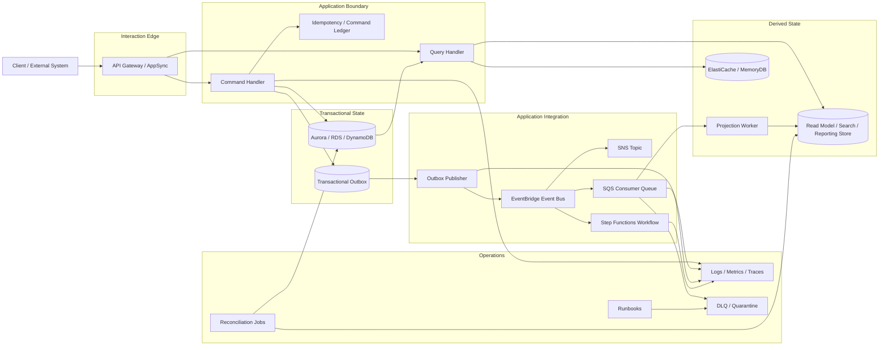
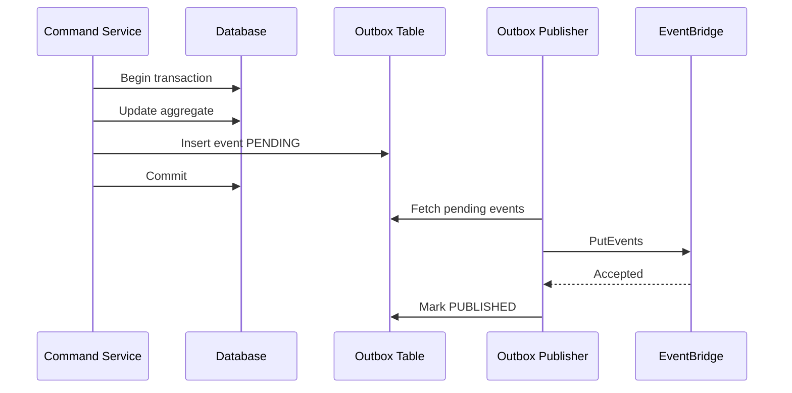
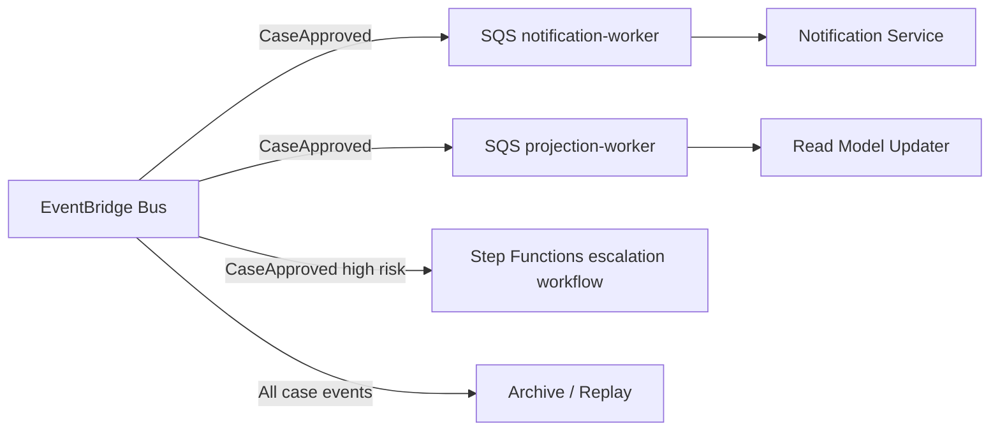
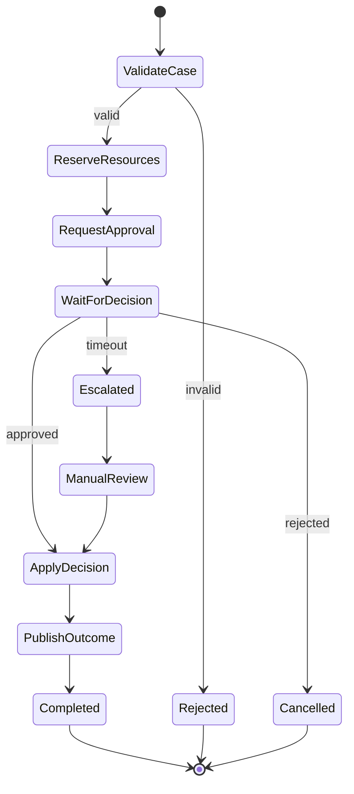
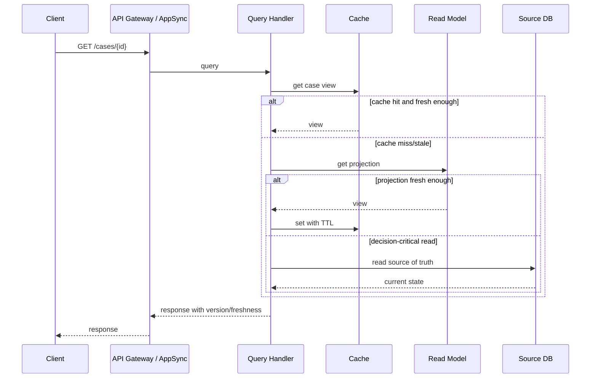
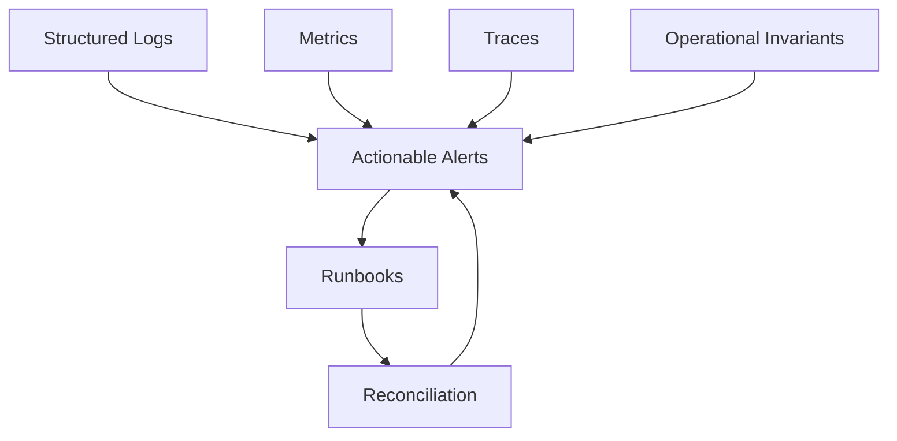

# Part 008 — Reference Architecture Baseline: API, Workflow, Event, Queue, Database, Cache

> Tujuan bagian ini: membuat peta arsitektur baseline yang akan menjadi rujukan sepanjang seri. Ini bukan template final untuk semua sistem. Ini adalah skeleton mental: di mana command masuk, di mana state berubah, di mana event diterbitkan, di mana side effect dijalankan, di mana read model dibangun, dan di mana failure harus dikurung.

Kita tidak sedang membuat diagram indah untuk presentasi. Kita sedang membuat **peta operasional**.

Peta yang baik harus menjawab:

```txt
Ketika command masuk, siapa owner state?
Kapan database commit?
Kapan event dianggap durable?
Siapa boleh retry?
Siapa boleh replay?
Siapa boleh menyajikan data stale?
Apa yang terjadi kalau consumer mati?
Apa yang terjadi kalau workflow stuck?
Apa yang terjadi kalau cache kosong?
Apa yang terjadi kalau schema berubah?
```

Reference architecture baseline ini akan dipakai sebagai orientasi sebelum masuk ke modul API Gateway, SQS, SNS, EventBridge, Step Functions, RDS/Aurora, Aurora DSQL, DynamoDB, cache, specialized database, dan migration.

---

## 1. Baseline Bukan Arsitektur Universal

Tidak ada satu arsitektur yang benar untuk semua workload.

Baseline ini cocok sebagai titik awal untuk sistem yang punya kombinasi:

- command business yang mengubah state,
- database sebagai source of truth,
- event sebagai konsekuensi state change,
- asynchronous side effect,
- workflow long-running,
- read model/projection,
- kebutuhan audit dan operability,
- kemungkinan multi-service atau modular monolith yang akan berkembang.

Baseline ini terlalu berat untuk:

- CRUD internal tool sederhana,
- prototype sekali pakai,
- static website,
- read-only analytics dashboard,
- batch offline yang tidak punya interactive command path.

Tetapi bahkan untuk sistem sederhana, mental model-nya tetap berguna: pisahkan command, state, event, side effect, dan read model.

---

## 2. Komponen Baseline



Baca diagram ini dari sudut correctness:

- API bukan tempat state utama.
- Command handler adalah boundary business decision.
- Database/source of truth menyimpan fakta yang sudah commit.
- Outbox menyambungkan commit database ke event publication.
- Event bus merutekan fakta/kejadian, bukan menyimpan source of truth utama.
- Queue memberi isolation dan backpressure per consumer.
- Workflow mengelola control flow long-running.
- Projection/read model/cache adalah derived state.
- Observability dan reconciliation bukan add-on; mereka bagian dari arsitektur.

---

## 3. Layer 1 — Interaction Edge

Interaction edge adalah permukaan tempat caller masuk.

Pilihan umum:

| Use Case | AWS Service |
|---|---|
| REST/HTTP API | Amazon API Gateway HTTP API atau REST API |
| WebSocket | API Gateway WebSocket API |
| GraphQL/realtime subscription | AWS AppSync |
| Internal service call | Private API, service discovery, ALB/NLB, atau direct integration sesuai platform |
| Direct event ingestion | EventBridge PutEvents melalui API/integration path |

Pada baseline ini, edge tidak boleh menjadi tempat business state utama.

Edge bertanggung jawab untuk:

- request authentication/authorization hook sesuai desain security,
- request shape validation,
- coarse throttling,
- mapping protocol,
- correlation id propagation,
- response envelope,
- routing ke command/query boundary.

Edge tidak bertanggung jawab untuk:

- menyimpan lifecycle domain,
- menjalankan saga kompleks,
- memutuskan state transition detail,
- melakukan direct mutation ke banyak database,
- menyembunyikan failure ambiguity.

### 3.1 API command response shape

Untuk command synchronous yang commit cepat:

```json
{
  "commandId": "cmd_01J...",
  "status": "SUCCEEDED",
  "resourceId": "case_123",
  "version": 42,
  "correlationId": "corr_01J..."
}
```

Untuk command asynchronous:

```json
{
  "commandId": "cmd_01J...",
  "status": "ACCEPTED",
  "statusUrl": "/commands/cmd_01J...",
  "correlationId": "corr_01J..."
}
```

Jangan memberi response palsu seperti `success=true` jika proses sebenarnya baru masuk queue dan bisa gagal permanen.

---

## 4. Layer 2 — Command Boundary

Command boundary adalah tempat sistem memutuskan:

```txt
Apakah perubahan state ini valid, boleh, dan harus terjadi sekarang?
```

Command bukan sekadar HTTP POST. Command adalah niat bisnis.

Contoh:

```txt
ApproveCase
AssignInvestigator
SubmitEvidence
CloseEnforcementAction
StartRemediationWorkflow
GenerateFinalNotice
```

Command handler harus melakukan:

1. parse command,
2. validate command shape,
3. authorize actor pada konteks domain,
4. check current state,
5. enforce invariant,
6. persist state change,
7. persist command result/idempotency,
8. persist outbox event jika ada consequence,
9. return deterministic response.

### 4.1 Command handler bukan transaction script sembarangan

Buruk:

```java
public void approve(String caseId) {
    caseRepository.updateStatus(caseId, "APPROVED");
    eventBridge.publish(new CaseApproved(caseId));
    emailClient.send(caseId);
    searchIndex.update(caseId);
}
```

Masalah:

- event publish bisa gagal setelah DB update,
- email duplicate saat retry,
- search index bukan source of truth,
- tidak ada idempotency,
- tidak ada command result,
- tidak jelas boundary transaction.

Lebih sehat:

```java
@Transactional
public ApproveCaseResult approve(ApproveCaseCommand command) {
    CommandRecord existing = commandLedger.find(command.commandId());
    if (existing != null) {
        return existing.reconstructResult(ApproveCaseResult.class);
    }

    CaseAggregate caze = caseRepository.loadForUpdate(command.caseId());
    caze.approve(command.actorId(), command.note());

    caseRepository.save(caze);
    outbox.save(DomainEvent.caseApproved(caze));

    ApproveCaseResult result = ApproveCaseResult.from(caze);
    commandLedger.markSucceeded(command.commandId(), result);

    return result;
}
```

Ini masih sederhana, tetapi mekanismenya benar:

- decision dan state change dalam transaction,
- event disimpan sebagai outbox dalam transaction yang sama,
- side effect eksternal tidak dipanggil dalam transaction,
- retry command bisa deterministic.

---

## 5. Layer 3 — Transactional State

Transactional state adalah source of truth untuk satu bounded context.

Pilihan database tergantung workload:

| Need | Candidate |
|---|---|
| Relational consistency, SQL, joins dalam boundary | Aurora/RDS PostgreSQL/MySQL atau engine lain |
| Predictable key-value access, massive scale, low-latency | DynamoDB |
| Distributed SQL active-active use case | Aurora DSQL bila cocok dengan constraint workload |
| Document shape dengan MongoDB compatibility need | DocumentDB |
| Graph relationship-heavy query | Neptune |
| Time-series ingestion/query | Timestream |
| Cassandra-compatible wide-column access | Keyspaces |
| Durable in-memory primary-like access | MemoryDB |

Rule baseline:

```txt
Pilih database dari access pattern dan invariant, bukan dari tren.
```

### 5.1 Satu owner untuk satu fakta

Setiap fakta bisnis harus punya satu source of truth.

Contoh:

```txt
Case.status -> Case Service DB
Final notice delivery status -> Notification Service DB
Dashboard count -> Derived projection
Search document -> Derived projection
```

Jika dua database sama-sama dianggap source of truth untuk fakta yang sama, sistem akan butuh conflict resolution. Itu mungkin valid untuk desain tertentu, tetapi jangan terjadi tanpa keputusan eksplisit.

### 5.2 Transaction boundary

Transaction boundary harus mengikuti aggregate/domain invariant.

Contoh:

```txt
ApproveCase harus atomically:
- validate current case state,
- change status,
- record approver,
- append audit/outbox event.
```

Ia tidak harus atomically:

- send email,
- update dashboard,
- update search index,
- notify external system.

Hal-hal itu side effect atau projection. Mereka butuh idempotency dan retry, bukan DB transaction yang panjang.

---

## 6. Layer 4 — Transactional Outbox

Transactional outbox menjawab masalah klasik:

```txt
Bagaimana memastikan event hanya diterbitkan jika state change commit, tanpa distributed transaction antara database dan event bus?
```

Pattern:

1. Command handler menulis state change dan outbox event dalam DB transaction yang sama.
2. Outbox publisher membaca event pending.
3. Publisher mengirim ke EventBridge/SNS/SQS sesuai desain.
4. Publisher menandai event published atau menyimpan attempt/failure.
5. Consumer tetap idempotent karena publish bisa duplicate pada kasus ambiguity.



### 6.1 Outbox table shape

```sql
CREATE TABLE outbox_events (
  event_id TEXT PRIMARY KEY,
  aggregate_type TEXT NOT NULL,
  aggregate_id TEXT NOT NULL,
  aggregate_version BIGINT NOT NULL,
  event_type TEXT NOT NULL,
  event_version TEXT NOT NULL,
  payload JSONB NOT NULL,
  status TEXT NOT NULL,
  attempts INT NOT NULL DEFAULT 0,
  next_attempt_at TIMESTAMPTZ NOT NULL DEFAULT now(),
  created_at TIMESTAMPTZ NOT NULL DEFAULT now(),
  published_at TIMESTAMPTZ
);

CREATE INDEX idx_outbox_pending
ON outbox_events(status, next_attempt_at, created_at);
```

### 6.2 Outbox invariants

- Pending event age must stay within budget.
- Event id must be stable.
- Publisher retry must be bounded per attempt but persistent across process restarts.
- Publisher crash must not lose event.
- Duplicate publish must not violate downstream invariants.

---

## 7. Layer 5 — Event Bus and Routing

Event bus adalah routing layer untuk event/fact.

EventBridge cocok untuk event routing, filtering, SaaS/service integration, archive/replay use case, dan cross-account event patterns. SNS cocok untuk pub/sub fanout dengan topic/subscription. SQS cocok untuk durable pull-based queue dan worker backpressure. AWS decision guide membedakan ketiganya berdasarkan model komunikasi, persistence, ordering, filtering, integration, use case, scalability, dan pricing.

Baseline memakai prinsip:

```txt
EventBridge/SNS untuk routing/fanout.
SQS untuk consumer isolation dan backpressure.
```

### 7.1 Event envelope baseline

```json
{
  "eventId": "evt_01J...",
  "eventType": "CaseApproved",
  "eventVersion": "1",
  "source": "case-service",
  "occurredAt": "2026-07-06T10:15:30Z",
  "correlationId": "corr_01J...",
  "causationId": "cmd_01J...",
  "aggregate": {
    "type": "Case",
    "id": "case_123",
    "version": 42
  },
  "data": {
    "approvedBy": "user_789",
    "decisionNoteHash": "sha256:..."
  }
}
```

Envelope stabil mengurangi coupling. Payload boleh bertambah secara additive. Consumer harus tolerant terhadap field tambahan.

### 7.2 Routing baseline



Setiap consumer penting sebaiknya punya queue sendiri agar:

- retry policy berbeda,
- DLQ berbeda,
- scaling berbeda,
- backlog satu consumer tidak menahan consumer lain,
- ownership operasional jelas.

---

## 8. Layer 6 — Queue and Worker Boundary

Queue bukan hanya integrasi. Queue adalah shock absorber.

Queue memberi:

- durability sementara,
- decoupling waktu,
- independent scaling,
- backpressure,
- retry dan DLQ,
- failure isolation.

Tetapi queue juga memperkenalkan:

- duplicate delivery,
- delayed processing,
- poison message,
- ordering ambiguity,
- replay risk,
- operational backlog.

### 8.1 Worker baseline

Worker yang sehat punya struktur:

```java
public void handle(Message message) {
    EventEnvelope event = parse(message);

    try {
        transactionTemplate.executeWithoutResult(tx -> {
            if (inbox.alreadyProcessed(CONSUMER_NAME, event.eventId())) {
                return;
            }

            domainSideEffect.apply(event);
            inbox.markProcessed(CONSUMER_NAME, event.eventId());
        });

        ack(message);
    } catch (RecoverableDependencyException e) {
        retryLater(message, e);
    } catch (PermanentMessageException e) {
        sendToDlq(message, e);
    }
}
```

Key points:

- parse failure bisa permanent,
- dependency timeout bisa recoverable,
- duplicate harus short-circuit,
- side effect harus idempotent,
- ack hanya setelah commit lokal sukses.

### 8.2 Queue metrics yang wajib dipahami

| Metric Concept | Kenapa Penting |
|---|---|
| Age of oldest message | Menunjukkan backlog terhadap SLA |
| Visible messages | Banyak pekerjaan belum diproses |
| In-flight messages | Worker sedang memproses tetapi belum ack |
| DLQ messages | Ada failure permanen atau retry habis |
| Processing success/failure by reason | Membedakan poison, dependency, throttling |
| Duplicate suppressed | Bukti idempotency bekerja |

---

## 9. Layer 7 — Workflow Orchestration

Workflow orchestration dipakai ketika proses memiliki:

- banyak step,
- durasi panjang,
- retry berbeda per step,
- compensation,
- human/external callback,
- audit execution history,
- branching eksplisit,
- timeout dan escalation.

Step Functions memungkinkan pembuatan state machine untuk distributed application, process automation, dan microservice orchestration. Untuk baseline, kita perlakukan workflow sebagai **durable control plane untuk proses bisnis**, bukan sebagai tempat semua logic domain dipindahkan.

### 9.1 Workflow baseline



### 9.2 Workflow boundary rules

- Workflow coordinates; domain service decides invariant.
- Workflow step must be idempotent.
- Workflow timeout path must be explicit.
- Compensation must be modeled as business action.
- Long-running process must not hold DB transaction.
- Execution id/correlation id must flow into logs/events.

### 9.3 When not to use workflow

Jangan pakai workflow untuk:

- simple single transaction CRUD,
- high-frequency low-latency operation yang tidak butuh orchestration,
- pure event fanout tanpa control flow,
- query path,
- mengganti domain model yang buruk.

---

## 10. Layer 8 — Query, Projection, and Read Model

Command side mengoptimalkan correctness. Query side mengoptimalkan pembacaan.

Read model bisa berupa:

- table query relational,
- DynamoDB table untuk lookup cepat,
- OpenSearch index untuk search,
- materialized view,
- cache,
- reporting projection,
- graph/time-series projection.

Rule:

```txt
Read model boleh derived, tetapi derived state harus punya freshness budget dan rebuild path.
```

### 10.1 Query path baseline



### 10.2 Freshness metadata

A serious read response should often include version/freshness when stale data is possible.

```json
{
  "caseId": "case_123",
  "status": "APPROVED",
  "version": 42,
  "projectionUpdatedAt": "2026-07-06T10:15:45Z",
  "freshnessSeconds": 8
}
```

This prevents false certainty.

---

## 11. Layer 9 — Cache Boundary

Cache is not a correctness engine. Cache is latency/cost optimization.

Baseline cache rules:

1. Cache only data with explicit staleness tolerance.
2. Use versioned keys for decision-sensitive view.
3. Use TTL with jitter to reduce stampede.
4. Do not let cache hide source-of-truth corruption.
5. Cache failure should degrade, not corrupt.
6. If cache is primary state, use a durable in-memory database design, not casual cache-aside.

### 11.1 Cache-aside baseline

```java
public CaseView getCaseView(String caseId) {
    String key = "case-view:" + caseId;

    CaseView cached = cache.get(key, CaseView.class);
    if (cached != null && cached.isFreshEnough()) {
        return cached;
    }

    CaseView view = readModelRepository.find(caseId);
    cache.set(key, view, ttlWithJitter(Duration.ofMinutes(5)));
    return view;
}
```

For critical reads, add version check:

```txt
If caller requires at least version 42 and cache has version 41, bypass cache/read projection and read source or wait according to contract.
```

---

## 12. Layer 10 — Observability, Reconciliation, Runbook

Baseline architecture is incomplete without operations.



### 12.1 Correlation model

Every command/event/workflow should carry:

| Field | Purpose |
|---|---|
| `correlationId` | Connect user journey/request chain |
| `causationId` | Identify command/event that caused this action |
| `commandId` | Idempotency and command result reconstruction |
| `eventId` | Deduplication and replay safety |
| `aggregateId` | Domain object traceability |
| `aggregateVersion` | Ordering/freshness/conflict handling |
| `tenantId` | Blast radius and noisy neighbor analysis |

### 12.2 Reconciliation jobs

Reconciliation checks invariants across components.

Examples:

```sql
-- Approved case without outbox event
SELECT c.id
FROM cases c
LEFT JOIN outbox_events e
  ON e.aggregate_id = c.id
 AND e.event_type = 'CaseApproved'
WHERE c.status = 'APPROVED'
  AND e.event_id IS NULL;
```

```sql
-- Outbox event pending too long
SELECT event_id, event_type, created_at, attempts
FROM outbox_events
WHERE status = 'PENDING'
  AND created_at < now() - interval '5 minutes';
```

```sql
-- Projection behind source version
SELECT c.id, c.version AS source_version, p.version AS projection_version
FROM cases c
JOIN case_projection p ON p.case_id = c.id
WHERE p.version < c.version
  AND p.updated_at < now() - interval '60 seconds';
```

Reconciliation is how you catch silent failure.

---

## 13. End-to-End Flow Examples

### 13.1 Synchronous command with durable event

```txt
POST /cases/{id}/approve
  -> validate + authorize
  -> command ledger check
  -> DB transaction: update case + insert outbox
  -> response 200
  -> outbox publisher publishes CaseApproved
  -> consumers process async side effects
```

Used when:

- state change is fast,
- caller needs immediate result,
- side effects can be async.

### 13.2 Asynchronous command

```txt
POST /reports/generate
  -> validate request
  -> persist command/job
  -> enqueue job or start workflow
  -> response 202
  -> worker/workflow processes
  -> status endpoint shows progress
```

Used when:

- processing exceeds API deadline,
- result is not immediate,
- user can poll/subscribe,
- retries need durable state.

### 13.3 Event-driven projection

```txt
CaseApproved event
  -> EventBridge rule
  -> SQS projection queue
  -> projection worker
  -> update read model
  -> freshness metric
```

Used when:

- read model is derived,
- eventual consistency acceptable,
- rebuild/replay is possible.

### 13.4 Workflow/saga

```txt
StartEnforcementWorkflow
  -> Step Functions execution
  -> reserve resources
  -> wait for approval
  -> apply decision
  -> publish outcome
  -> compensate/escalate on failure
```

Used when:

- multiple steps,
- long duration,
- explicit audit trail,
- compensation and timeout logic needed.

---

## 14. Baseline Failure Handling Matrix

| Component | Common Failure | Containment | Recovery |
|---|---|---|---|
| API Gateway/AppSync | Throttle, timeout, bad request | Rate limit, validation, deadline | Client retry with idempotency |
| Command service | Crash mid-request | Transaction boundary, command ledger | Retry reconstructs result |
| Database | Failover, lock, connection exhaustion | Pool limit, short transaction, backpressure | Retry safe transactions, failover handling |
| Outbox publisher | Down or publish timeout | Event durable in DB | Retry pending outbox |
| EventBridge/SNS | Target failure, route mismatch | Rule metrics, target DLQ where applicable | Fix route, replay/archive if available |
| SQS | Backlog, poison message | Per-consumer queue, DLQ | Scale, fix handler, redrive |
| Worker | Crash after side effect | Inbox/idempotency | Reprocess safely |
| Step Functions | Task timeout, stuck callback | Timeout state, terminal state | Retry, compensate, escalate |
| Read model | Stale or broken projection | Freshness metric, source fallback | Replay/rebuild projection |
| Cache | Eviction, stale, unavailable | TTL, version, fallback | Refill/degrade |
| Migration | Mixed version incompatibility | Expand-migrate-contract | Rollback app, reconcile data |

---

## 15. Service Selection in Baseline

### 15.1 API Gateway vs AppSync

Choose API Gateway when:

- REST/HTTP API shape,
- command/query endpoints,
- broad client compatibility,
- direct service integrations are useful.

Choose AppSync when:

- GraphQL query composition,
- realtime subscription,
- client-driven selection,
- resolver-level integration fits workload.

### 15.2 EventBridge vs SNS vs SQS

Use EventBridge when:

- event routing/filtering across services/accounts,
- event bus model,
- archive/replay useful,
- many AWS/SaaS integrations.

Use SNS when:

- topic fanout,
- pub/sub subscription model,
- push delivery semantics fit.

Use SQS when:

- durable queue,
- pull-based worker control,
- buffering/backpressure,
- per-consumer retry/DLQ.

Often they compose:

```txt
EventBridge -> SQS per consumer
SNS -> SQS fanout
API Gateway -> SQS for async command ingestion
```

### 15.3 Step Functions vs Queue Worker

Use queue worker when:

- one unit of work,
- simple retry,
- high throughput,
- worker owns state transition.

Use Step Functions when:

- multiple steps,
- branching,
- wait states,
- callback,
- compensation,
- execution history matters.

### 15.4 RDS/Aurora vs DynamoDB

Use Aurora/RDS when:

- relational constraints matter,
- SQL query flexibility needed within bounded context,
- transactional integrity across related rows,
- reporting-adjacent operational query.

Use DynamoDB when:

- access patterns are known,
- high scale low-latency key-value/document access,
- predictable query by key/index,
- horizontal partition design fits.

Do not choose DynamoDB if the team still expects ad-hoc relational query across arbitrary fields. Do not choose relational only because the team refuses to model access patterns.

---

## 16. Reference Implementation Layout

A Java/Spring-style modular service can be organized like this:

```txt
case-service/
  src/main/java/com/example/caseapp/
    api/
      CaseCommandController.java
      CaseQueryController.java
      ApiExceptionMapper.java
    application/
      ApproveCaseCommand.java
      ApproveCaseHandler.java
      CommandLedgerService.java
    domain/
      CaseAggregate.java
      CaseStatus.java
      CaseApproved.java
      CasePolicy.java
    infrastructure/
      persistence/
        CaseRepository.java
        JdbcCaseRepository.java
        OutboxRepository.java
        CommandLedgerRepository.java
      integration/
        EventBridgeOutboxPublisher.java
        SqsProjectionConsumer.java
      observability/
        CorrelationFilter.java
        MetricsRecorder.java
    operations/
      ReconciliationJob.java
      ProjectionRebuildJob.java
```

Key boundary:

```txt
api -> application -> domain
application -> infrastructure ports
infrastructure must not leak into domain decision
```

This keeps AWS service usage at the edge of the application, while domain invariants remain testable.

---

## 17. Infrastructure Layout Baseline

At IaC level, separate lifecycle concerns:

```txt
infra/
  network/
  databases/
    aurora/
    dynamodb/
    elasticache/
  integration/
    eventbridge/
    sns/
    sqs/
    stepfunctions/
  application/
    api-gateway/
    services/
    workers/
  observability/
    dashboards/
    alarms/
    log-groups/
  operations/
    runbooks/
    game-days/
```

The exact tool can be CDK, Terraform, CloudFormation, Pulumi, or internal platform tooling. The key is not the tool. The key is ownership and lifecycle separation.

---

## 18. Security Boundary Without Going Deep

This series is not the AWS security series, but baseline architecture must not ignore security boundary.

Minimum principles:

- least privilege per component,
- queue/event permissions scoped to producer/consumer,
- database credentials isolated per service,
- secrets not embedded in config files,
- audit trail for business decisions,
- encryption and network access according to organizational baseline,
- no shared superuser credential across services.

Security must support application/database ownership. If every service has broad write permission to every table and every queue, architecture boundaries are fiction.

---

## 19. Cost and Scaling Model

A baseline that ignores cost will fail politically or operationally.

Think in cost drivers:

| Component | Common Cost Driver |
|---|---|
| API Gateway/AppSync | Request volume, data transfer, caching |
| Step Functions | State transitions/executions depending workflow type |
| EventBridge/SNS/SQS | Events/messages/requests, archive/replay where used |
| RDS/Aurora | Instance/capacity, storage, I/O, backup, replicas |
| DynamoDB | Read/write capacity mode, storage, indexes, streams, global tables |
| Cache | Node size, memory, network, replication |
| Observability | Log volume, metrics cardinality, trace sampling |

Scaling levers:

- API throttling before overload,
- worker concurrency from queue lag,
- database connection pool limits,
- partition key design,
- read replica/projection/cache where safe,
- workflow type selection,
- log sampling and cardinality discipline.

Do not scale every layer blindly. Scaling the application layer can overload the database if connection and write capacity are not bounded.

---

## 20. Deployment and Change Baseline

Every production architecture needs a change model.

Minimum deployment rules:

1. Backward-compatible API changes.
2. Event changes additive by default.
3. Database schema uses expand-migrate-contract.
4. Consumers tolerate unknown event fields.
5. Feature flags do not bypass invariants.
6. Rollback plan exists before deployment.
7. Migrations are idempotent and observable.
8. Outbox and queue backlog checked before/after deployment.
9. Dashboards include new invariant metrics before feature launch.

Change safety is architecture, not ceremony.

---

## 21. Minimal Production Readiness Checklist

Before calling a system production-ready, answer yes/no:

### Command and State

- Does every command have an idempotency strategy?
- Is the source of truth explicit?
- Are transaction boundaries short and clear?
- Are external side effects outside DB transactions?
- Can ambiguous commit results be resolved?

### Event and Queue

- Are event envelopes versioned?
- Are consumers idempotent?
- Does every important queue have DLQ and owner?
- Is queue lag measured against business SLA?
- Can events/projections be replayed safely?

### Workflow

- Does every workflow have terminal states?
- Are timeout paths explicit?
- Are compensation actions modeled?
- Are workflow executions correlated with commands/events?

### Database

- Are access patterns known?
- Are indexes designed for real query shape?
- Are connection limits and query timeouts set?
- Is backup/restore tested?
- Is schema migration backward compatible?

### Cache and Read Model

- Is staleness tolerance defined?
- Can cache be rebuilt?
- Can projection be rebuilt?
- Is freshness observable?

### Operations

- Are alerts actionable?
- Are logs structured with correlation ids?
- Are reconciliation jobs present for critical invariants?
- Are runbooks tested?
- Has at least one failure game day been run?

---

## 22. What This Baseline Deliberately Does Not Decide

This baseline does not prescribe:

- monolith vs microservices,
- Spring Boot vs Quarkus vs Micronaut vs Node/Go/.NET,
- Terraform vs CDK,
- Aurora vs DynamoDB for every use case,
- EventBridge vs SNS in every topology,
- exact folder/package naming,
- exact observability vendor,
- exact deployment pipeline.

Those decisions require workload context.

What it does prescribe:

```txt
Make ownership explicit.
Persist source-of-truth state safely.
Publish consequences durably.
Make consumers idempotent.
Keep side effects retryable or compensatable.
Expose freshness and lag.
Detect silent invariant drift.
Design recovery before incident.
```

---

## 23. How to Use This Baseline in the Rest of the Series

The remaining parts will repeatedly zoom into each box:

- API layer: request contract, timeout, throttling, idempotency.
- SQS: visibility timeout, DLQ, consumer design, backlog operations.
- SNS/EventBridge: fanout, filtering, routing, archive/replay, cross-account.
- Step Functions: state machine design, error handling, saga, callback.
- Database selection: workload and access pattern framework.
- Aurora/RDS: transaction, locking, replica, backup, failover.
- Aurora DSQL: distributed SQL and active-active trade-offs.
- DynamoDB: partitioning, single-table design, transactions, streams, global tables.
- Cache: invalidation, stampede, session, rate limit.
- Specialized database: document, graph, time-series, search projection.
- Migration: DMS, CDC, zero-downtime schema change, cutover.

Every detail later should map back to this baseline. If a pattern cannot explain where state lives, where failure is contained, and how recovery works, it is not ready.

---

## 24. Sumber Resmi AWS untuk Ditelusuri

- AWS Well-Architected Framework: https://docs.aws.amazon.com/wellarchitected/latest/framework/welcome.html
- AWS Well-Architected Reliability Pillar — Graceful degradation: https://docs.aws.amazon.com/wellarchitected/latest/reliability-pillar/rel_mitigate_interaction_failure_graceful_degradation.html
- AWS Well-Architected Reliability Pillar — Static stability: https://docs.aws.amazon.com/wellarchitected/latest/framework/rel_withstand_component_failures_static_stability.html
- AWS Well-Architected Operational Excellence — Implement observability: https://docs.aws.amazon.com/wellarchitected/latest/operational-excellence-pillar/implement-observability.html
- AWS Decision Guide — Amazon SQS, Amazon SNS, or EventBridge?: https://docs.aws.amazon.com/decision-guides/latest/sns-or-sqs-or-eventbridge/sns-or-sqs-or-eventbridge.html
- AWS Prescriptive Guidance — Integrating microservices by using AWS serverless services: https://docs.aws.amazon.com/prescriptive-guidance/latest/modernization-integrating-microservices/introduction.html
- AWS Step Functions Developer Guide — What is Step Functions?: https://docs.aws.amazon.com/step-functions/latest/dg/welcome.html
- Amazon API Gateway — AWS service integrations for HTTP APIs: https://docs.aws.amazon.com/apigateway/latest/developerguide/http-api-develop-integrations-aws-services-reference.html
- AWS Lambda Developer Guide — Event-driven architectures: https://docs.aws.amazon.com/lambda/latest/dg/concepts-event-driven-architectures.html

---

## 25. Penutup Part 008

Module 01 selesai.

Kita sudah punya:

1. system map,
2. data/control/state flow,
3. coupling taxonomy,
4. service selection discipline,
5. application/database boundary,
6. operational invariants,
7. failure-model-first design,
8. reference architecture baseline.

Mulai Part 009, kita masuk Module 02: **Application Integration Decision Framework**. Fokusnya bukan menghafal service, tetapi memilih integration style berdasarkan coupling, latency, durability, ordering, replay, ownership, dan failure behavior.
