# Part 009 — Decision Tree: Kapan Pakai API, Queue, Event, Workflow, Stream, atau Direct DB

> Tujuan bagian ini: membuat cara memilih integration style berdasarkan bentuk masalah, bukan berdasarkan nama service. Di production, kegagalan integrasi hampir selalu berasal dari coupling yang tidak disadari: caller menunggu terlalu lama, receiver tidak idempotent, event dipakai sebagai command, queue dipakai sebagai database, workflow tersembunyi di beberapa consumer, atau database dibagi lintas ownership.

AWS memberi banyak primitive: API Gateway, AppSync, SQS, SNS, EventBridge, Step Functions, Kinesis, MSK, Lambda, ECS, RDS/Aurora, DynamoDB, dan lainnya. Tetapi pertanyaan arsitekturalnya bukan:

```txt
Service mana yang paling keren?
```

Pertanyaan yang benar:

```txt
Bentuk komunikasi apa yang dibutuhkan sistem agar invariants tetap benar ketika latency, retry, duplicate, partial failure, schema evolution, dan traffic spike terjadi?
```

Part ini adalah peta keputusan.

---

## 1. Integration Style Adalah Kontrak Waktu

Integrasi bukan sekadar cara komponen saling bicara. Integrasi adalah **kontrak waktu**.

Ketika service A memanggil service B, ada beberapa bentuk waktu yang mungkin terjadi:

| Style | Caller menunggu hasil? | Receiver harus online sekarang? | State progress disimpan di mana? | Cocok untuk |
|---|---:|---:|---|---|
| Synchronous API | Ya | Ya | Caller/application stack | Query, validasi cepat, command pendek |
| Queue | Tidak langsung | Tidak | Queue + consumer + database | Work distribution, load leveling, retry durable |
| Pub/Sub | Tidak | Tidak semua | Topic + subscriber | Fanout notification, multi-consumer side effect |
| Event Bus | Tidak | Tidak | Event bus + targets + archive/rule | Domain event routing, cross-account, SaaS integration |
| Workflow | Bisa ya/tidak | Tidak semua | State machine | Long-running process, saga, human/third-party step |
| Stream | Tidak per-event request | Consumer boleh lag | Log/stream offset | High-throughput ordered data movement, analytics-ish processing |
| Direct DB | Tergantung | DB harus tersedia | Database transaction | Hanya dalam ownership boundary yang sama |

Kalau kita salah memilih kontrak waktu, masalahnya muncul sebagai symptom operasional:

- API sering timeout.
- Retry membuat duplicate write.
- Consumer memproses event lama dan menimpa state baru.
- DLQ penuh tetapi tidak ada runbook replay.
- Workflow bisnis tersebar di banyak handler sehingga tidak ada satu tempat untuk melihat progress.
- Database menjadi shared integration surface dan schema change jadi berbahaya.
- Event payload berubah dan consumer diam-diam rusak.
- Cache menyajikan data stale tanpa ada aturan freshness.

Integration style harus dipilih berdasarkan invariant, bukan preferensi.

---

## 2. Lima Pertanyaan Awal

Sebelum memilih API, queue, event, atau workflow, jawab lima pertanyaan ini.

### 2.1 Apakah caller membutuhkan jawaban sekarang?

Butuh jawaban sekarang berarti caller tidak bisa lanjut tanpa response.

Contoh:

- user login,
- cek status case,
- hitung estimasi harga,
- validasi input,
- submit command dan butuh acknowledgement,
- ambil detail transaksi.

Gunakan synchronous API bila:

```txt
caller membutuhkan response deterministik dalam latency budget pendek
```

Jangan gunakan synchronous API bila:

```txt
caller hanya perlu tahu bahwa pekerjaan diterima
```

Untuk pekerjaan panjang, response API sebaiknya mengembalikan `202 Accepted` plus `operationId`, bukan menahan koneksi sampai semua side effect selesai.

---

### 2.2 Apakah receiver harus diketahui caller?

Kalau caller tahu receiver spesifik, coupling meningkat.

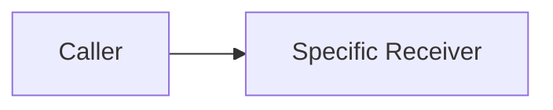

Ini wajar untuk query atau command ke owner capability.

Tetapi kalau caller hanya mengatakan “sesuatu terjadi” dan tidak perlu tahu siapa yang peduli, gunakan event.

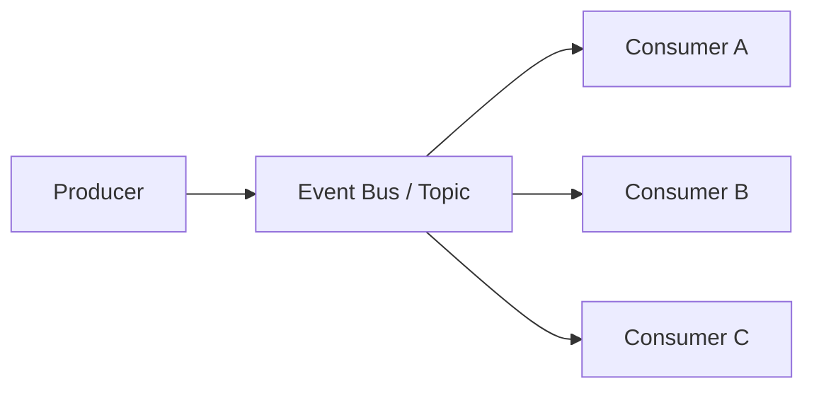

Rule:

```txt
Jika producer tahu siapa yang harus mengerjakan, itu command.
Jika producer hanya tahu fakta yang sudah terjadi, itu event.
```

---

### 2.3 Apakah pekerjaan harus durable ketika consumer mati?

Kalau work item tidak boleh hilang ketika worker mati, gunakan durable queue atau durable workflow.

Jangan mengandalkan:

- in-memory thread pool,
- fire-and-forget HTTP,
- async method lokal,
- cron tanpa state,
- event handler yang tidak punya retry boundary.

Gunakan SQS bila unit kerja independen dan bisa diproses worker.

Gunakan Step Functions bila progress pekerjaan terdiri dari beberapa step yang perlu state, retry policy, timeout, branch, compensation, atau audit execution history.

---

### 2.4 Apakah urutan penting?

Ordering adalah constraint mahal.

Tanyakan:

```txt
Apakah semua event harus ordered secara global?
Atau hanya per aggregate/entity/customer/case/order?
```

Biasanya yang benar adalah ordering per entity, bukan global.

Contoh:

- update status case harus ordered per `caseId`,
- transaksi rekening harus ordered per `accountId`,
- fulfillment order harus ordered per `orderId`,
- audit log bisa ordered per subject atau per partition.

Kalau butuh ordered work distribution per group, SQS FIFO dengan message group dapat dipertimbangkan. Kalau butuh ordered high-throughput append log, stream seperti Kinesis/MSK lebih natural. Kalau tidak butuh ordering, jangan membeli complexity ordering.

---

### 2.5 Apakah flow memiliki state jangka panjang?

Flow jangka panjang punya ciri:

- ada beberapa step,
- ada timeout bisnis,
- ada retry berbeda per step,
- ada decision branch,
- ada human approval,
- ada callback pihak ketiga,
- ada compensation,
- ada kebutuhan melihat progress.

Ini bukan sekadar event-driven architecture. Ini workflow.

Gunakan Step Functions ketika:

```txt
sistem perlu durable control plane untuk progress bisnis
```

Jangan menyembunyikan workflow di kombinasi event handler + database status + cron kalau progress-nya penting dan failure-nya harus bisa di-debug.

---

## 3. Decision Tree Utama

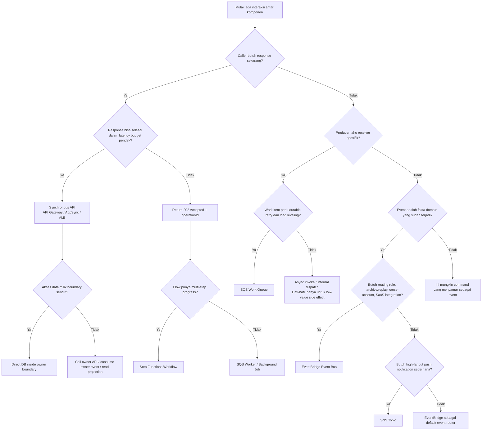

Decision tree ini bukan hukum absolut. Ia adalah guardrail agar keputusan tidak acak.

---

## 4. Style 1 — Synchronous API

Gunakan synchronous API ketika caller membutuhkan hasil langsung.

### Cocok untuk

- query read model,
- command pendek,
- validasi business rule cepat,
- submit request dengan acknowledgement,
- operasi user-facing yang harus memberikan error langsung,
- service-to-service call yang benar-benar membutuhkan jawaban untuk melanjutkan.

### AWS primitive umum

- Amazon API Gateway REST API,
- Amazon API Gateway HTTP API,
- AWS AppSync untuk GraphQL/realtime use case,
- Application Load Balancer ke ECS/EKS/EC2,
- Lambda function untuk handler pendek,
- private API atau VPC integration untuk internal surface.

### Invariant desain

```txt
Tidak ada external side effect non-idempotent di dalam critical synchronous transaction.
```

Synchronous API boleh commit state utama. Tetapi side effect seperti email, notification, indexing, downstream integration, document generation, dan analytics sebaiknya dipicu lewat outbox/event/queue setelah commit.

### Failure model

- caller timeout tetapi server sudah commit,
- retry menyebabkan duplicate command,
- dependency lambat membuat thread/concurrency habis,
- database connection pool habis,
- client memutus koneksi tapi backend tetap berjalan,
- downstream 5xx menular ke user-facing API.

### Rule of thumb

```txt
Synchronous API adalah interaction boundary, bukan tempat menyelesaikan seluruh proses bisnis.
```

---

## 5. Style 2 — Queue / Work Distribution

Queue adalah primitive untuk memisahkan **acceptance** dari **processing**.

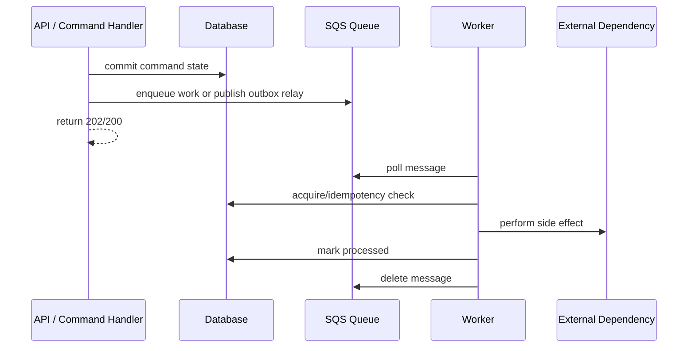

### Cocok untuk

- background job,
- load leveling,
- expensive computation,
- asynchronous side effect,
- integration dengan dependency lambat,
- retry durable,
- worker autoscaling,
- isolasi failure antar komponen.

### AWS primitive umum

- Amazon SQS Standard,
- Amazon SQS FIFO,
- Lambda event source mapping,
- ECS/EKS worker polling,
- DLQ dan redrive.

### Invariant desain

```txt
Message boleh diproses lebih dari sekali. Consumer wajib idempotent.
```

Queue bukan transaksi. Queue adalah buffer durable. Begitu ada at-least-once delivery, duplicate adalah bagian dari model, bukan edge case.

### Failure model

- duplicate message,
- poison message,
- consumer crash setelah side effect sebelum delete message,
- visibility timeout terlalu pendek,
- DLQ tumbuh,
- retry storm,
- backlog age naik,
- ordering hanya sebagian terjaga.

### Rule of thumb

```txt
Gunakan queue ketika yang kamu butuhkan adalah “kerjakan nanti dengan aman”, bukan “beri tahu semua orang bahwa sesuatu terjadi”.
```

---

## 6. Style 3 — Pub/Sub Notification

Pub/Sub memisahkan producer dari banyak subscriber.

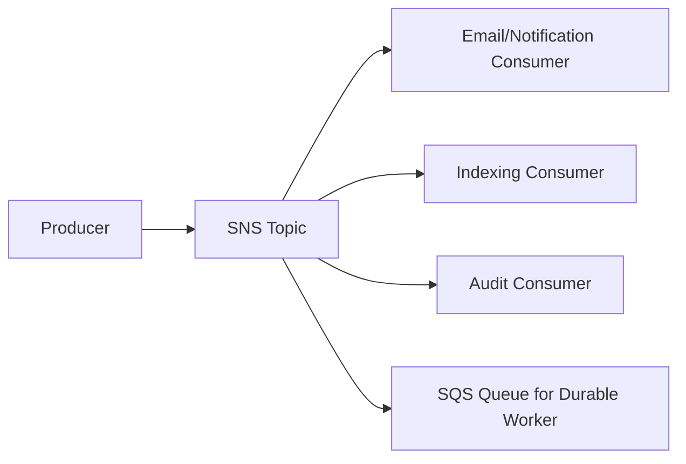

### Cocok untuk

- fanout sederhana,
- push notification,
- satu producer banyak subscriber,
- filter berbasis message attributes,
- integrasi ke SQS/Lambda/HTTP endpoint.

### AWS primitive umum

- Amazon SNS topic,
- SNS subscription filter policy,
- SNS to SQS fanout.

### Invariant desain

```txt
Subscriber tidak boleh menjadi bagian dari transaction producer.
```

Producer tidak boleh “menunggu semua subscriber berhasil” untuk menganggap command sukses. Kalau itu terjadi, pub/sub sudah berubah menjadi distributed transaction yang rapuh.

### Failure model

- subscriber down,
- delivery retry berbeda per protocol,
- filtering salah sehingga event tidak sampai,
- fanout membuat downstream overload,
- producer mengirim payload terlalu besar atau terlalu detail,
- subscriber mengandalkan event ordering yang tidak dijamin secara global.

### Rule of thumb

```txt
SNS cocok untuk fanout push; EventBridge cocok untuk routing event yang lebih kaya dan governance yang lebih eksplisit.
```

---

## 7. Style 4 — Event Bus / Domain Event Routing

Event bus cocok ketika event adalah kontrak domain lintas boundary.

```json
{
  "source": "case-management.case",
  "detail-type": "CaseEscalated",
  "detail": {
    "eventId": "evt_01J...",
    "eventVersion": 1,
    "caseId": "case_123",
    "occurredAt": "2026-07-06T10:15:30Z",
    "newEscalationLevel": "L2",
    "reasonCode": "SLA_BREACH"
  }
}
```

### Cocok untuk

- domain event,
- cross-account routing,
- integration boundary antar platform/team,
- event archive dan replay,
- SaaS/partner integration,
- rule-based routing,
- schema governance,
- auditability event flow.

### AWS primitive umum

- Amazon EventBridge event bus,
- EventBridge rules,
- EventBridge Pipes,
- EventBridge Scheduler,
- Archive and replay,
- Schema Registry bila sesuai.

### Invariant desain

```txt
Event adalah fakta yang sudah terjadi, bukan instruksi yang berharap receiver tertentu melakukan sesuatu.
```

Nama event buruk:

```txt
SendEmail
CreateInvoice
UpdateCustomerCache
```

Nama event lebih baik:

```txt
OrderConfirmed
InvoiceIssued
CustomerProfileChanged
CaseEscalated
```

### Failure model

- event contract berubah,
- replay memicu side effect lama,
- consumer belum siap menerima versi baru,
- rule terlalu luas,
- archive replay menghasilkan burst,
- event dipakai sebagai command tersembunyi.

### Rule of thumb

```txt
Gunakan EventBridge ketika routing, governance, archive/replay, cross-account, dan event contract lebih penting daripada sekadar fanout sederhana.
```

---

## 8. Style 5 — Workflow Orchestration

Workflow orchestration adalah pilihan ketika process state penting.

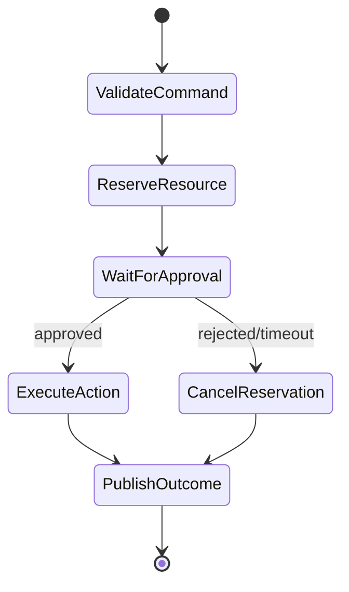

### Cocok untuk

- saga,
- long-running process,
- human approval,
- third-party callback,
- retry berbeda per step,
- compensation,
- branch/parallel step,
- audit execution history,
- SLA timeout.

### AWS primitive umum

- AWS Step Functions Standard Workflow,
- AWS Step Functions Express Workflow,
- service integrations,
- callback task token,
- `.sync` integration pattern,
- Map/Distributed Map untuk batch/work item.

### Invariant desain

```txt
Workflow engine mengontrol progress; database domain tetap source of truth untuk state bisnis inti.
```

Jangan jadikan Step Functions sebagai satu-satunya tempat menyimpan state bisnis. State machine menyimpan progress eksekusi. Domain database tetap menyimpan business state yang dapat diaudit dan direkonsiliasi.

### Failure model

- step timeout,
- retry menghasilkan duplicate side effect,
- compensation gagal,
- callback tidak pernah datang,
- execution stuck,
- payload membesar,
- workflow versioning mengubah perilaku execution lama.

### Rule of thumb

```txt
Jika kamu perlu bertanya “proses ini sekarang ada di step mana?”, kemungkinan kamu butuh workflow eksplisit.
```

---

## 9. Style 6 — Stream

Stream berbeda dari queue biasa.

Queue mendistribusikan work item agar diproses dan dihapus. Stream menyimpan ordered log per shard/partition yang dapat dibaca oleh banyak consumer dengan offset masing-masing.

### Cocok untuk

- high-throughput event/data stream,
- ordered processing per partition,
- analytics pipeline,
- CDC-like flow,
- multiple independent consumers yang membaca log yang sama,
- near-real-time aggregation.

### AWS primitive umum

- Amazon Kinesis Data Streams,
- Amazon MSK,
- DynamoDB Streams untuk perubahan item DynamoDB,
- database CDC via DMS ke stream/target tertentu.

### Invariant desain

```txt
Consumer harus siap mengelola offset, lag, replay, dan ordering per partition.
```

### Kapan tidak perlu stream

Jangan memakai stream hanya karena “event-driven”. Banyak business event lebih cocok memakai EventBridge. Banyak background work lebih cocok memakai SQS. Stream masuk akal ketika volume, ordering log, replay per offset, dan consumer group semantics memang menjadi requirement.

---

## 10. Style 7 — Direct Database Access

Direct DB access adalah style yang paling kuat sekaligus paling sering disalahgunakan.

### Cocok untuk

- application module yang memiliki database itu,
- monolith/modular monolith dengan schema ownership jelas,
- service owner yang menjalankan transaction lokal,
- read/write terhadap aggregate yang berada dalam boundary yang sama.

### Tidak cocok untuk

- integrasi antar microservice,
- shared reporting query yang menembus invariant owner,
- cross-service join,
- worker milik domain lain yang update table langsung,
- membuat database sebagai “API diam-diam”.

### Invariant desain

```txt
Hanya owner boundary yang boleh menulis source-of-truth table.
```

Boundary lain boleh:

- memanggil API owner,
- consume event owner,
- membaca projection/read model yang memang dibuat untuk sharing,
- memakai replica/reporting model dengan SLA freshness eksplisit.

### Failure model

- schema change memecahkan consumer tersembunyi,
- transaction lintas ownership sulit dikontrol,
- authorization bypass,
- audit tersebar,
- data invariant dilanggar oleh writer lain,
- performa query domain lain mengganggu workload utama.

### Rule of thumb

```txt
Database adalah implementation detail dari owner capability, bukan integration bus.
```

---

## 11. Command, Event, Job, Query: Jangan Campur Bahasa

Banyak desain kacau karena semua payload disebut “event”. Pisahkan istilah.

| Jenis | Arti | Contoh | Owner keberhasilan |
|---|---|---|---|
| Query | Minta informasi tanpa mengubah state | `GetCaseStatus` | Caller butuh response |
| Command | Minta owner melakukan perubahan | `EscalateCase` | Command handler owner |
| Event | Fakta bahwa sesuatu sudah terjadi | `CaseEscalated` | Producer sudah commit fakta |
| Job | Unit kerja untuk diproses | `GenerateCasePdfJob` | Worker + retry policy |
| Workflow step | Satu tahap proses durable | `WaitForSupervisorApproval` | State machine |

Rule penting:

```txt
Command boleh ditolak.
Event tidak boleh ditolak sebagai fakta masa lalu; consumer hanya boleh gagal memprosesnya.
Job boleh retry sampai berhasil atau masuk DLQ.
Query tidak boleh punya side effect bisnis.
```

---

## 12. Decision Matrix Praktis

| Requirement | Pilihan utama | Hindari |
|---|---|---|
| User butuh response cepat | API Gateway/AppSync/ALB | SQS langsung ke user tanpa operation tracking |
| Pekerjaan lama tetapi user hanya butuh acknowledgement | API + queue/workflow | Menahan HTTP request lama |
| Banyak consumer perlu tahu fakta domain | EventBridge/SNS | Caller memanggil semua consumer satu per satu |
| Background work bisa diproses paralel | SQS Standard | EventBridge untuk work queue berat tanpa alasan |
| Ordering per entity penting | SQS FIFO / stream partition | Global ordering palsu |
| Process multi-step dan long-running | Step Functions | Workflow tersebar di event handler tanpa state eksplisit |
| Butuh event replay governance | EventBridge archive/replay / stream | Mengandalkan log aplikasi sebagai event source |
| Butuh high-throughput ordered log | Kinesis/MSK | SQS sebagai event log permanen |
| Data owned oleh service sama | Direct DB | API call internal untuk setiap query lokal |
| Data owned oleh service lain | Owner API/event/projection | Cross-service direct DB join |

---

## 13. Latency Budget sebagai Decision Input

Pilihan integration style harus dimulai dari latency budget.

Contoh budget user-facing 2 detik:

```txt
Client/network          200 ms
API gateway/edge         50 ms
Auth/authorization      100 ms
Application handler     300 ms
Database query/commit   400 ms
Serialization/logging    50 ms
Buffer                  900 ms
```

Kalau sebuah dependency downstream bisa mengambil 5 sampai 20 detik, ia tidak boleh berada di synchronous critical path user-facing. Jadikan dependency itu asynchronous.

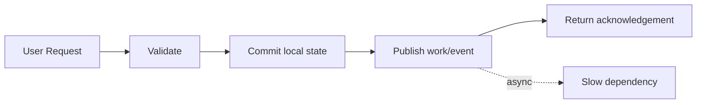

Rule:

```txt
Dependency yang latency-nya tidak bisa kamu kontrol tidak boleh menentukan availability API utama.
```

---

## 14. Data Consistency sebagai Decision Input

Pertanyaan consistency:

```txt
Apakah state harus terlihat immediately consistent oleh caller?
Apakah eventual consistency dapat diterima?
Apakah read model boleh stale?
Apakah state change harus atomic dengan event publication?
Apakah ada compensation bila downstream gagal?
```

### Strong local consistency

Gunakan database transaction lokal di owner boundary.

Contoh:

```txt
Create order + reserve order number + mark initial status
```

### Eventual cross-boundary consistency

Gunakan outbox + event/queue + idempotent consumer.

Contoh:

```txt
OrderConfirmed -> InvoiceIssued -> NotificationSent
```

### Long-running consistency

Gunakan workflow/saga.

Contoh:

```txt
Reserve inventory -> authorize payment -> create shipment -> compensate if payment fails
```

Rule:

```txt
Jangan membuat distributed transaction jika bisnis dapat menerima state antara yang eksplisit dan terkelola.
```

---

## 15. Ownership sebagai Decision Input

Ownership menentukan siapa boleh menerima command.

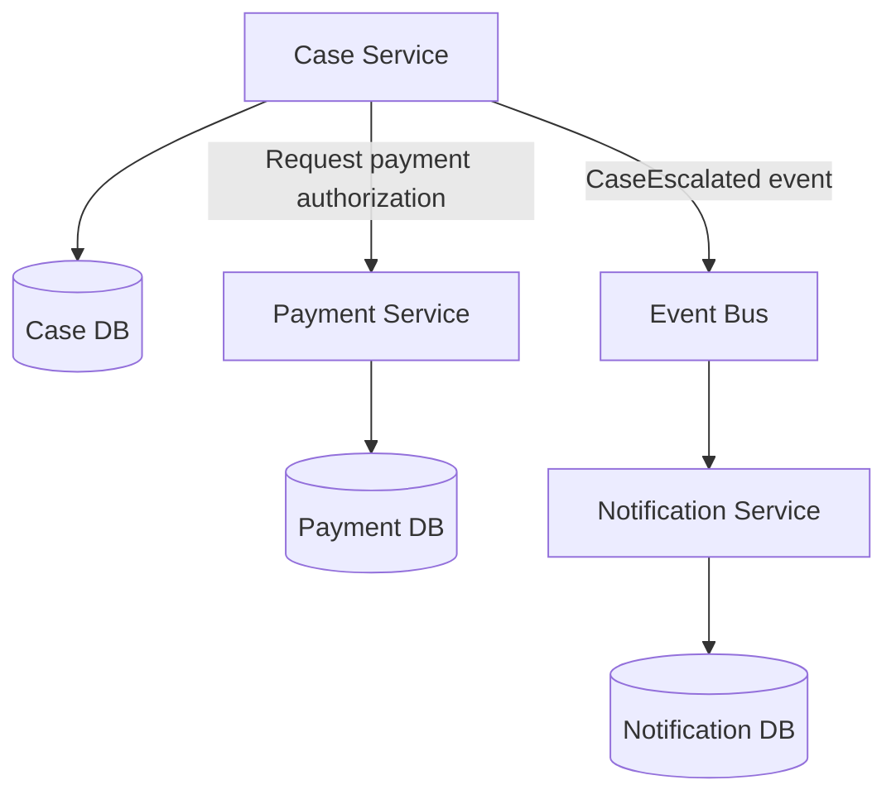

Dalam desain yang sehat:

- Case Service boleh menulis `case` state.
- Payment Service boleh menulis `payment` state.
- Notification Service boleh menulis `notification` state.
- Service lain tidak menulis database owner secara langsung.
- Event dari owner dipakai untuk projection dan side effect.

Kalau sebuah use case membutuhkan update dua owner, jangan langsung mencari distributed transaction. Modelkan prosesnya:

- command ke owner A,
- event dari owner A,
- command/job ke owner B,
- state antara,
- compensation bila perlu,
- reconciliation bila ada gap.

---

## 16. Anti-Pattern: Synchronous Call Chain

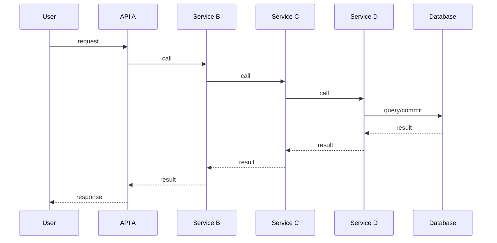

Masalah:

- latency menjumlah,
- availability mengalikan,
- timeout ambiguity meningkat,
- retry bisa terjadi di banyak layer,
- observability sulit,
- satu dependency lambat menahan seluruh request.

Perbaikan:

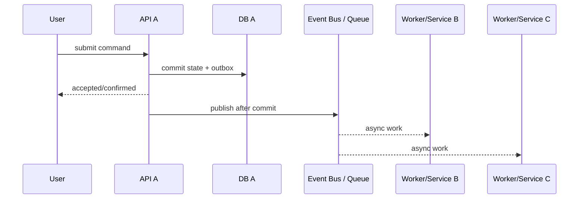

Tidak semua call chain buruk. Yang buruk adalah call chain yang membawa side effect non-kritis, pekerjaan panjang, atau dependency tidak stabil ke dalam user-facing path.

---

## 17. Anti-Pattern: Event yang Sebenarnya Command

Payload buruk:

```json
{
  "detail-type": "SendWelcomeEmail",
  "detail": {
    "userId": "u-123",
    "template": "welcome-v3"
  }
}
```

Masalah:

- producer tahu action receiver,
- event belum tentu fakta domain,
- consumer menjadi bagian tersembunyi dari use case,
- retry/replay bisa mengirim email lagi.

Lebih baik:

```json
{
  "detail-type": "UserRegistered",
  "detail": {
    "userId": "u-123",
    "registeredAt": "2026-07-06T10:00:00Z"
  }
}
```

Lalu Notification Service memutuskan apakah perlu mengirim welcome email, dengan idempotency key:

```txt
notification:user-registered:u-123:welcome-v3
```

---

## 18. Anti-Pattern: Queue sebagai Database

Queue buruk ketika digunakan untuk:

- menyimpan state permanen,
- mencari message berdasarkan attribute,
- mengubah message yang sudah dikirim,
- query status bisnis,
- menyimpan log historis tanpa retention plan,
- menjadi satu-satunya sumber kebenaran.

Queue seharusnya menyimpan work item sementara. State bisnis tetap berada di database owner.

Rule:

```txt
Queue tells workers what to do next. Database tells the business what is true now.
```

---

## 19. Anti-Pattern: Event Bus sebagai RPC Lambat

Event bus bukan cara untuk memanggil service dan menunggu hasil.

Tanda-tandanya:

- producer publish event lalu polling database menunggu consumer update,
- event name berupa imperative command,
- producer menganggap failure consumer sebagai failure transaksi,
- tidak ada state machine tetapi ada proses multi-step tersembunyi,
- timeout bisnis dikelola oleh cron ad hoc.

Jika producer butuh hasil, gunakan API atau workflow callback. Jika proses panjang, gunakan workflow. Jika hanya fakta, publish event.

---

## 20. Case Study: Enforcement Case Escalation

Misal sistem case management punya use case:

```txt
Ketika case melanggar SLA, sistem menaikkan escalation level, memberi tahu supervisor, membuat task review, dan memperbarui search projection.
```

Desain buruk:

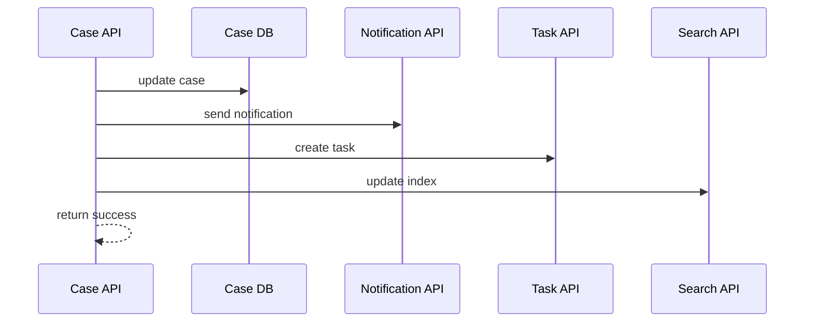

Masalah:

- update case tergantung notification/search,
- timeout search bisa membuat escalation gagal,
- retry API bisa duplicate task,
- tidak jelas apakah task creation bagian dari transaksi utama.

Desain lebih sehat:

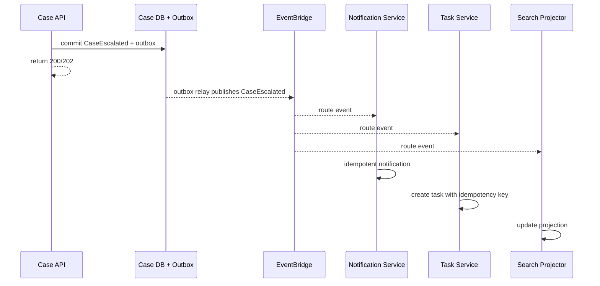

Kalau task review memiliki SLA, approval, timeout, dan compensation, tambahkan Step Functions sebagai orchestrator untuk proses review. Jangan sembunyikan workflow di beberapa event handler.

---

## 21. Decision Checklist

Sebelum memilih style, isi checklist ini.

```txt
[ ] Apakah interaksi ini query, command, event, job, atau workflow step?
[ ] Apakah caller perlu response sekarang?
[ ] Berapa latency budget end-to-end?
[ ] Apakah receiver harus online saat itu juga?
[ ] Siapa owner state yang berubah?
[ ] Apakah data yang dibaca source-of-truth atau projection?
[ ] Apakah duplicate delivery mungkin terjadi?
[ ] Apa idempotency key-nya?
[ ] Apakah ordering penting? Global atau per entity?
[ ] Apakah replay aman?
[ ] Apa yang terjadi bila consumer mati selama 1 jam?
[ ] Apa yang terjadi bila downstream lambat selama 10 menit?
[ ] Apa DLQ/retry/redrive policy-nya?
[ ] Apakah event schema/versioning sudah jelas?
[ ] Apakah ada workflow progress yang harus terlihat?
[ ] Apakah ada timeout bisnis?
[ ] Apakah ada compensation?
[ ] Apakah observability mencakup correlation id lintas boundary?
[ ] Apakah cost model berubah saat traffic spike?
[ ] Apakah service pilihan bisa diganti jika requirement berubah?
```

---

## 22. Heuristik Cepat

Gunakan ini saat design review.

```txt
Butuh jawaban sekarang? API.
Butuh pekerjaan durable nanti? Queue.
Butuh memberi tahu banyak pihak? Pub/Sub/Event Bus.
Butuh routing event lintas boundary dengan governance? EventBridge.
Butuh proses multi-step durable? Step Functions.
Butuh ordered high-throughput log? Stream.
Butuh menyimpan state kebenaran? Database owner.
Butuh data dari owner lain? API/event/projection, bukan direct DB write.
```

Heuristik ini sederhana, tetapi cukup kuat untuk mencegah banyak desain yang rapuh.

---

## 23. Mini Lab: Ubah Requirement Menjadi Integration Style

Ambil requirement:

```txt
User submit request review dokumen. Sistem harus menyimpan request, menjalankan pemeriksaan otomatis, meminta approval supervisor bila risk score tinggi, mengirim notifikasi, dan membuat search index dapat dicari dalam 1 menit.
```

Breakdown:

| Kebutuhan | Style |
|---|---|
| Submit request dan validasi input | Synchronous API |
| Simpan request sebagai source of truth | Direct DB dalam owner boundary |
| Pemeriksaan otomatis butuh waktu | Queue atau workflow task |
| Approval supervisor | Workflow |
| Notification | Event consumer / SNS / EventBridge target |
| Search index | Projection consumer |
| Status progress | Query API membaca domain DB/workflow state/read model |
| Retry pemeriksaan | SQS/Step Functions retry policy |
| Timeout approval | Step Functions wait/timeout |
| Audit event | Outbox + event bus |

Architecture sketch:

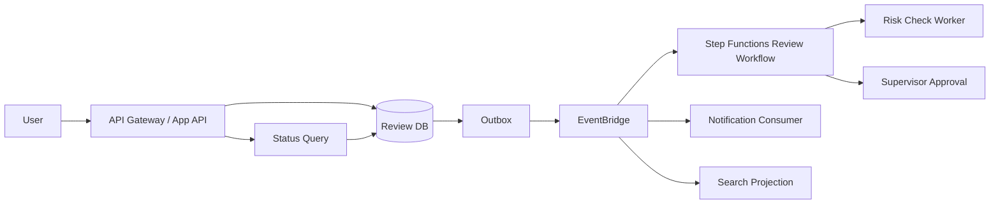

---

## 24. What Good Looks Like

Desain integration style yang matang punya ciri:

- setiap interaction bisa diklasifikasikan sebagai query, command, event, job, atau workflow step;
- synchronous path pendek dan punya timeout budget;
- pekerjaan panjang dipindah ke queue/workflow;
- state ownership eksplisit;
- database bukan integration bus;
- event adalah fakta, bukan command tersembunyi;
- consumer idempotent;
- replay aman atau jelas tidak aman;
- DLQ memiliki owner dan runbook;
- workflow long-running terlihat di state machine, bukan tersebar di cron;
- read model punya freshness SLA;
- observability melintasi boundary;
- architecture decision record menjelaskan trade-off, bukan hanya diagram.

---

## 25. Ringkasan

Integration style adalah keputusan structural.

Salah memilih service masih bisa diperbaiki. Salah memilih coupling model sering menjadi hutang arsitektur yang mahal.

Mental model utama:

```txt
API = jawab sekarang.
Queue = kerjakan nanti dengan durable retry.
Pub/Sub = beri tahu banyak pihak.
Event bus = route fakta domain lintas boundary.
Workflow = simpan progress proses.
Stream = ordered log high-throughput.
Database = source of truth milik owner.
```

Bagian berikutnya akan masuk ke synchronous request/response di AWS: API Gateway, timeout, retry, rate limit, idempotency, transaction boundary, backpressure, dan bagaimana membuat API yang tidak mengubah dependency lambat menjadi incident user-facing.

---

## Referensi

- AWS Decision Guide — Choosing an AWS application integration service: https://docs.aws.amazon.com/decision-guides/latest/application-integration-on-aws-how-to-choose/application-integration-on-aws-how-to-choose.html
- AWS Decision Guide — Amazon SQS, Amazon SNS, or EventBridge?: https://docs.aws.amazon.com/decision-guides/latest/sns-or-sqs-or-eventbridge/sns-or-sqs-or-eventbridge.html
- AWS Well-Architected Reliability — Implement loosely coupled dependencies: https://docs.aws.amazon.com/wellarchitected/latest/reliability-pillar/rel_prevent_interaction_failure_loosely_coupled_system.html
- Amazon SQS Developer Guide — What is Amazon SQS?: https://docs.aws.amazon.com/AWSSimpleQueueService/latest/SQSDeveloperGuide/welcome.html
- AWS Step Functions Developer Guide — Integrating services: https://docs.aws.amazon.com/step-functions/latest/dg/connect-to-resource.html
