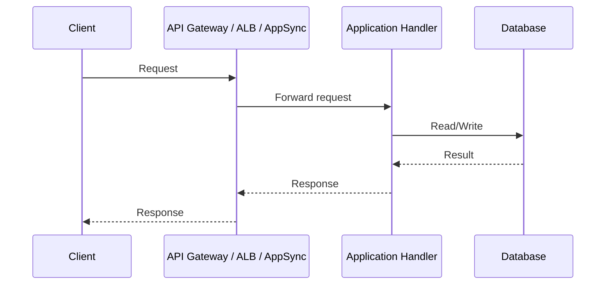
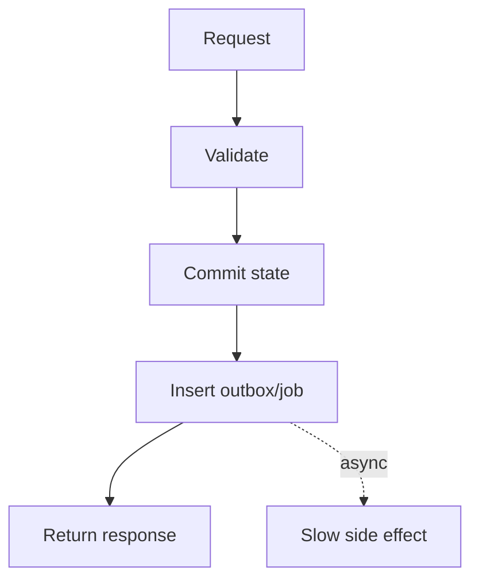
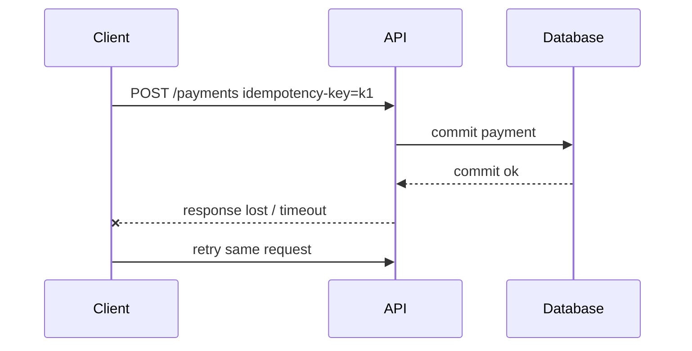
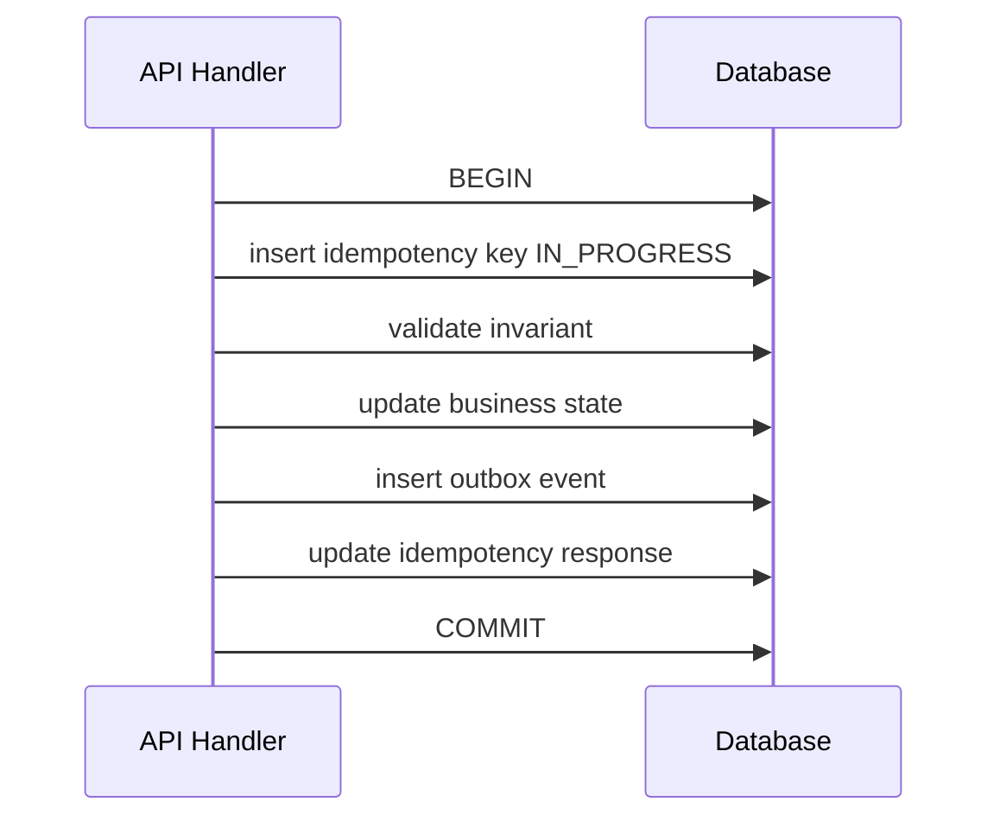
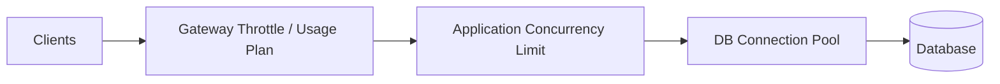
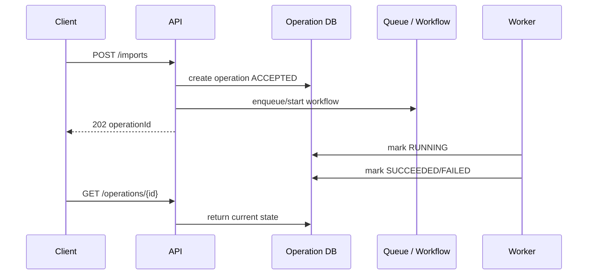
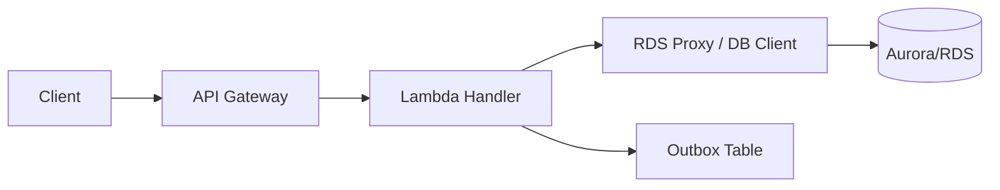
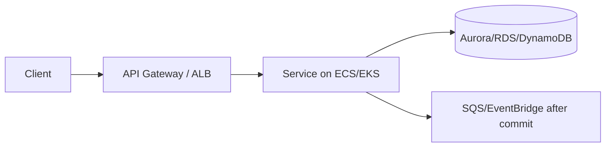
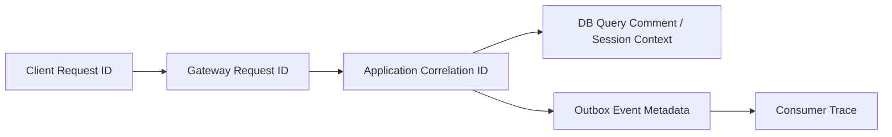

# Part 010 — Synchronous Request/Response di AWS: Contract, Latency, Timeout, Backpressure

> Tujuan bagian ini: memahami synchronous request/response sebagai kontrak latency dan failure, bukan sekadar endpoint HTTP. API yang matang bukan API yang “bisa dipanggil”, tetapi API yang tetap dapat diprediksi ketika dependency lambat, client retry, database commit ambigu, traffic spike, dan downstream failure terjadi.

Synchronous API adalah bentuk integrasi paling mudah dipahami dan paling mudah disalahgunakan.

Ia terlihat sederhana:

```txt
client -> API -> service -> database -> response
```

Tetapi di production, bentuk sebenarnya adalah:

```txt
client dengan retry
  -> edge/gateway dengan timeout dan throttle
    -> handler dengan concurrency limit
      -> dependency dengan latency distribution
        -> database dengan connection pool, lock, isolation, dan failover
          -> response yang bisa hilang walaupun commit berhasil
```

Synchronous request/response bukan masalah HTTP saja. Ini masalah **control flow**, **time budget**, **resource protection**, dan **ambiguity after failure**.

---

## 1. Definisi Synchronous API

Synchronous API berarti caller mengirim request dan menunggu response pada connection/request context yang sama.



Synchronous API cocok ketika:

- caller butuh jawaban sekarang,
- operation pendek,
- failure bisa dikembalikan sebagai error jelas,
- response menentukan langkah berikutnya,
- dependency chain terbatas,
- latency budget realistis.

Synchronous API tidak cocok ketika:

- pekerjaan membutuhkan waktu lama,
- caller tidak perlu hasil final,
- downstream lambat atau unreliable,
- side effect banyak dan tidak semuanya critical,
- retry dapat membuat duplicate side effect,
- flow membutuhkan approval/callback/timeout bisnis.

Rule:

```txt
Synchronous API boleh mengubah state inti, tetapi jangan memaksa seluruh proses bisnis selesai sebelum response.
```

---

## 2. AWS Building Blocks untuk Synchronous API

### 2.1 API Gateway REST API

Cocok untuk:

- API management yang kaya,
- REST-style API,
- request validation,
- usage plan/API key untuk use case tertentu,
- authorizer,
- mapping/integration yang fleksibel,
- edge/private/regional API pattern.

Perhatikan:

- integration timeout menjadi batas keras untuk backend response,
- quota/throttling harus dipahami,
- konfigurasi stage, deployment, custom domain, logging, dan authorizer memengaruhi operability.

### 2.2 API Gateway HTTP API

Cocok untuk:

- HTTP API yang lebih sederhana,
- latency/cost yang lebih ringan dibanding REST API pada banyak use case,
- JWT authorizer,
- Lambda/HTTP private integration tertentu,
- public API modern yang tidak butuh fitur REST API penuh.

Perhatikan:

- fiturnya tidak selalu sama dengan REST API,
- maximum integration timeout tetap menjadi boundary desain,
- cocok untuk contract yang lebih sederhana.

### 2.3 API Gateway WebSocket API

Cocok untuk:

- bidirectional communication,
- realtime notification,
- collaborative UI,
- command dari client yang tetap perlu connection identity.

Perhatikan:

- WebSocket bukan pengganti durable workflow,
- connection state perlu disimpan dan dibersihkan,
- delivery ke client bisa gagal,
- jangan menyimpan business truth hanya di connection state.

### 2.4 AWS AppSync

Cocok untuk:

- GraphQL API,
- agregasi data dari beberapa source,
- realtime subscription,
- mobile/web client yang butuh query shape fleksibel,
- resolver langsung ke DynamoDB/Lambda/HTTP/RDS via supported integration pattern.

Perhatikan:

- GraphQL memudahkan client, tetapi dapat menyembunyikan query cost,
- resolver authorization harus eksplisit,
- N+1 resolver pattern perlu dikontrol,
- schema evolution harus compatible.

### 2.5 Application Load Balancer

Cocok untuk:

- HTTP service di ECS/EKS/EC2,
- service yang memerlukan streaming/longer-running connection pattern dibanding API Gateway use case tertentu,
- internal service endpoint,
- path/host based routing.

Perhatikan:

- API management fitur tidak sama dengan API Gateway,
- throttling/rate limit biasanya perlu layer tambahan,
- auth, request validation, and usage policy perlu desain sendiri atau integrasi dengan komponen lain.

---

## 3. Synchronous API Adalah Budget, Bukan Harapan

Desain API harus dimulai dari latency budget.

Contoh budget untuk endpoint command user-facing:

```txt
Total target p95:             800 ms
Client/network:               100 ms
API Gateway/Auth:              80 ms
Application validation:        70 ms
Database transaction:         250 ms
Outbox insert:                 30 ms
Serialization/logging:         40 ms
Buffer:                       230 ms
```

Kalau dependency baru membutuhkan p95 2 detik, dependency itu tidak muat. Jangan “semoga cepat”. Ubah desain.



Budget memaksa keputusan:

- apa yang wajib terjadi sebelum response,
- apa yang boleh terjadi setelah response,
- apa yang harus dipindah ke queue/event/workflow,
- apa yang perlu cache/read model,
- apa yang perlu ditolak lebih awal.

Rule:

```txt
Jika sebuah step tidak diperlukan untuk memberi response yang benar, step itu kandidat kuat untuk asynchronous boundary.
```

---

## 4. Timeout Harus Berlapis dan Konsisten

Timeout bukan satu angka. Timeout adalah hirarki.

```txt
Client timeout
  > Gateway timeout
    > Application request deadline
      > Dependency call timeout
        > Database statement timeout / lock timeout
```

Urutan yang sehat:

```txt
Dependency timeout < application deadline < gateway timeout < client timeout
```

Kenapa?

Agar application masih punya waktu untuk:

- membatalkan dependency call,
- rollback/commit secara bersih,
- menulis log/metric,
- mengembalikan error yang benar,
- tidak dibiarkan diputus gateway tanpa kontrol.

Contoh budget:

```txt
Client timeout:             5.0 s
Gateway integration limit:  3.0 s configured target, below service max
Application deadline:       2.5 s
Downstream HTTP timeout:    1.5 s
Database statement timeout: 1.0 s
Lock timeout:               300 ms
```

Jangan membuat semua timeout 30 detik. Itu bukan reliability. Itu hanya memberi waktu lebih lama untuk resource habis.

---

## 5. Ambiguous Failure: Timeout Setelah Commit

Kasus paling penting dalam synchronous API:



Dari sudut client, request gagal.

Dari sudut database, command berhasil.

Inilah **ambiguous failure**.

Solusinya bukan “jangan retry”. Solusinya adalah idempotency.

---

## 6. Idempotency untuk Command API

Idempotency berarti request yang sama dapat diulang tanpa menghasilkan efek bisnis ganda.

### 6.1 Idempotency key

Client mengirim key:

```http
POST /case-escalations
Idempotency-Key: case-123:escalate:L2:2026-07-06
```

Server menyimpan hasil command berdasarkan key.

Schema konseptual:

```sql
CREATE TABLE api_idempotency_keys (
  tenant_id           varchar(64)  NOT NULL,
  idempotency_key     varchar(200) NOT NULL,
  request_hash        varchar(128) NOT NULL,
  status              varchar(32)  NOT NULL,
  response_code       int,
  response_body       jsonb,
  resource_type       varchar(64),
  resource_id         varchar(128),
  created_at          timestamptz  NOT NULL,
  expires_at          timestamptz  NOT NULL,
  PRIMARY KEY (tenant_id, idempotency_key)
);
```

### 6.2 Handling algorithm

```txt
1. Receive command with idempotency key.
2. Compute normalized request hash.
3. Try insert idempotency record as IN_PROGRESS.
4. If insert fails:
   a. Load existing key.
   b. If request_hash differs, return 409 conflict.
   c. If COMPLETED, return stored response.
   d. If IN_PROGRESS, return 409/425/202 depending API semantics.
5. Execute business transaction.
6. Store final response/resource reference.
7. Mark idempotency record COMPLETED.
```

### 6.3 Transaction placement

Untuk relational database, idempotency record dan business state sebaiknya berada dalam transaction boundary yang sama jika memungkinkan.



Jika idempotency store terpisah dari business database, failure model menjadi lebih kompleks. Itu bisa benar, tetapi harus dirancang eksplisit.

---

## 7. Retry: Hanya Aman Bila Dibatasi

Retry memperbaiki transient failure, tetapi memperburuk overload.

Retry yang sehat punya:

- retryable error classification,
- exponential backoff,
- jitter,
- max attempt,
- deadline total,
- idempotency,
- circuit breaker atau adaptive throttling untuk dependency yang sedang rusak.

### 7.1 Error yang biasanya retryable

| Error | Retry? | Catatan |
|---|---:|---|
| Network timeout before response | Ya, dengan idempotency | Bisa jadi commit sudah terjadi |
| 429 Too Many Requests | Ya, hormati backoff/Retry-After bila ada | Jangan immediate retry |
| 500 internal transient | Mungkin | Batasi attempt |
| 502/503/504 | Mungkin | Biasanya transient, tetapi bisa overload |
| DB serialization/deadlock | Ya | Retry transaction kecil, bukan seluruh workflow besar |

### 7.2 Error yang biasanya tidak retryable

| Error | Retry? | Catatan |
|---|---:|---|
| 400 bad request | Tidak | Request salah |
| 401/403 | Tidak | Auth/authz problem |
| 404 untuk resource final | Biasanya tidak | Kecuali eventual consistency read model |
| 409 business conflict | Tidak otomatis | Butuh caller decision atau idempotency handling |
| Validation failure | Tidak | Perbaiki input |

### 7.3 Retry multiplication

Bahaya umum:

```txt
Client retry 3x
API retry dependency 3x
SDK retry DB 3x
Worker retry 3x
= 81 possible attempts
```

Retry di banyak layer tanpa budget akan memperparah incident.

Rule:

```txt
Retry harus punya owner. Jangan biarkan semua layer merasa berhak retry.
```

---

## 8. Throttling dan Rate Limiting

Synchronous API harus melindungi backend.



Lapisan proteksi:

| Layer | Proteksi |
|---|---|
| API Gateway | throttling, quotas, usage plan untuk REST API use case tertentu |
| WAF/edge | block abusive traffic, bot/rule filtering |
| Application | concurrency limit, bulkhead, request deadline |
| Dependency client | connection pool, timeout, circuit breaker |
| Database | max connections, statement timeout, lock timeout, query plan discipline |
| Queue fallback | async overflow bila semantics cocok |

Throttling bukan kegagalan. Throttling adalah mekanisme menjaga sistem tetap hidup.

Response yang baik untuk overload:

```http
HTTP/1.1 429 Too Many Requests
Content-Type: application/json
Retry-After: 2

{
  "error": {
    "code": "RATE_LIMITED",
    "message": "Too many requests. Retry later.",
    "retryable": true,
    "correlationId": "req-abc"
  }
}
```

---

## 9. Backpressure: Jangan Terima Semua Request

Backpressure berarti sistem dapat memperlambat atau menolak input ketika kapasitas downstream tidak cukup.

Tanpa backpressure:

```txt
traffic spike -> request menumpuk -> thread habis -> DB connection habis -> timeout massal -> retry storm -> total outage
```

Dengan backpressure:

```txt
traffic spike -> throttle/queue/degrade -> core invariant tetap aman -> recovery lebih cepat
```

### 9.1 Backpressure techniques

- reject early dengan 429/503,
- limit concurrency per endpoint,
- bulkhead per dependency,
- queue pekerjaan non-interaktif,
- degrade response untuk optional data,
- disable expensive feature via feature flag,
- shed low-priority traffic,
- protect database connection pool,
- cache hot read path.

### 9.2 Jangan jadikan database sebagai shock absorber

Database bukan tempat menyerap traffic spike mentah. Jika API menerima semua request lalu membiarkan DB yang timeout, kamu tidak punya backpressure; kamu punya overload yang terlambat dideteksi.

---

## 10. Transaction Boundary di Synchronous API

Synchronous command biasanya punya transaction lokal.

Contoh sehat:

```txt
POST /cases/{caseId}/escalations

Transaction:
- verify case exists
- verify transition allowed
- update case escalation level
- insert audit row
- insert outbox event CaseEscalated
- save idempotency result
Commit

After commit:
- relay outbox
- notification consumer sends message
- task service creates review task
- search projector updates index
```

Jangan lakukan ini di dalam DB transaction:

- call third-party API,
- send email,
- publish event ke remote service tanpa outbox safety,
- generate large document,
- wait human approval,
- perform long computation,
- call multiple downstream services.

Rule:

```txt
DB transaction harus pendek, lokal, dan hanya melindungi invariant yang benar-benar atomic.
```

---

## 11. Response Semantics: 200, 201, 202, 204

Pilih status code berdasarkan apa yang benar-benar selesai.

| Status | Arti desain |
|---|---|
| 200 OK | Command/query selesai dan response berisi result |
| 201 Created | Resource source-of-truth sudah dibuat |
| 202 Accepted | Request diterima, processing belum selesai |
| 204 No Content | Command selesai tanpa response body |
| 400 | Input invalid |
| 401/403 | Auth/authz failure |
| 404 | Resource tidak ditemukan atau tidak visible |
| 409 | Conflict dengan state/invariant/idempotency mismatch |
| 422 | Semantically invalid command, jika API style memakainya |
| 429 | Rate limited/backpressure |
| 500 | Unexpected server failure |
| 503 | Service temporarily unavailable/overloaded |
| 504 | Upstream timeout |

Jangan mengembalikan 200 jika pekerjaan kritis belum selesai kecuali contract menyatakan response hanya acknowledgement.

Untuk long-running operation:

```http
HTTP/1.1 202 Accepted
Content-Type: application/json

{
  "operationId": "op_01J...",
  "status": "ACCEPTED",
  "statusUrl": "/operations/op_01J..."
}
```

---

## 12. Operation Resource Pattern

Ketika request memulai pekerjaan asynchronous, buat operation resource.



Operation state minimal:

```txt
ACCEPTED
RUNNING
WAITING
SUCCEEDED
FAILED
CANCELLED
EXPIRED
```

Operation resource membuat asynchronous work tetap user-friendly dan debuggable.

---

## 13. Error Shape yang Stabil

API error harus machine-readable.

```json
{
  "error": {
    "code": "CASE_TRANSITION_NOT_ALLOWED",
    "message": "Case cannot move from CLOSED to ESCALATED.",
    "retryable": false,
    "correlationId": "req-01J...",
    "details": {
      "caseId": "case-123",
      "currentStatus": "CLOSED",
      "requestedAction": "ESCALATE"
    }
  }
}
```

Jangan mengandalkan string message untuk logic client. `code` harus stabil.

Error shape harus menjawab:

- apakah retry aman,
- apakah masalah input, auth, conflict, overload, atau server,
- correlation id untuk support,
- detail yang cukup tanpa membocorkan data sensitif,
- apakah ada operation id untuk follow-up.

---

## 14. Contract untuk Idempotent POST

POST tidak otomatis non-idempotent. POST bisa dibuat idempotent dengan idempotency key.

Contract contoh:

```http
POST /cases/{caseId}/escalations
Idempotency-Key: <stable-client-generated-key>
Content-Type: application/json
```

Server behavior:

| Kondisi | Response |
|---|---|
| Key baru, request valid | execute command, store result |
| Key sama, request sama, sudah selesai | return stored result |
| Key sama, request berbeda | 409 conflict |
| Key sama, request masih processing | 202/409/425 tergantung contract |
| Key expired | boleh treat sebagai baru atau return explicit expired, sesuai policy |

Idempotency key harus scoped:

```txt
tenantId + actorId/clientId + endpoint/operation + key
```

Jangan membuat key global lintas tenant.

---

## 15. Database Connection Pool dan API Concurrency

API sering mati bukan karena CPU, tetapi karena connection pool habis.

```txt
1000 concurrent requests
x each holds DB connection 500 ms
x pool size 100
= queueing di app layer, timeout, retry storm
```

Guardrail:

- jangan membuka connection sebelum perlu,
- lepaskan connection segera setelah transaction selesai,
- jangan call remote service sambil memegang connection,
- batasi concurrency endpoint yang DB-heavy,
- gunakan read replica hanya bila stale read semantics aman,
- gunakan RDS Proxy untuk use case yang cocok, terutama connection management dari serverless/high-concurrency patterns,
- monitor pool wait time, active connection, idle connection, DB CPU, lock wait, slow query.

Rule:

```txt
Connection pool adalah bulkhead. Jika semua endpoint berbagi pool tanpa kontrol, satu endpoint mahal bisa menjatuhkan semuanya.
```

---

## 16. Read Path: Query Bukan Selalu Source-of-Truth

Synchronous query punya beberapa pilihan data source:

| Source | Cocok untuk | Risiko |
|---|---|---|
| Primary DB | read-your-writes, strong consistency | load ke writer, latency, lock interaction |
| Read replica | read scaling | replication lag |
| DynamoDB table | predictable key-value access | access pattern harus jelas |
| Cache | hot read, low latency | stale, invalidation |
| Search projection | search/filter complex | eventual consistency |
| Materialized view/projection | dashboard/listing | freshness SLA |

Untuk query user-facing, nyatakan freshness.

Contoh:

```txt
Case detail endpoint membaca source-of-truth.
Case search endpoint membaca projection dengan target freshness < 60 detik.
Dashboard metrics membaca aggregate projection dengan target freshness < 5 menit.
```

Jangan menjanjikan strong consistency jika backend memakai projection eventually consistent.

---

## 17. API Gateway + Lambda + Database Pattern

Pattern umum:



Cocok untuk:

- handler pendek,
- traffic burst yang masih bisa dikontrol,
- command/query sederhana,
- integrasi cepat.

Perhatikan:

- Lambda concurrency dapat menciptakan banyak DB connection jika tidak dikontrol,
- cold start mungkin relevan untuk latency tertentu,
- timeout Lambda harus lebih pendek/selaras dengan gateway/client deadline,
- database transaction harus pendek,
- idempotency wajib untuk command retryable,
- jangan memasukkan pekerjaan panjang ke Lambda synchronous path jika bisa asynchronous.

---

## 18. API Gateway/ALB + ECS/EKS + Database Pattern



Cocok untuk:

- service dengan runtime panjang,
- connection pooling lebih stabil,
- framework web penuh,
- kebutuhan internal service mesh/sidecar tertentu,
- workload yang tidak cocok dengan Lambda lifecycle.

Perhatikan:

- container autoscaling tidak instan,
- thread pool dan connection pool harus disetel bersama,
- health check harus membedakan liveness dan readiness,
- graceful shutdown harus menolak request baru dan menyelesaikan request aktif,
- deployment harus menjaga backward compatibility API dan schema.

---

## 19. GraphQL/AppSync Sync Boundary

GraphQL memberi client fleksibilitas query, tetapi fleksibilitas itu bisa memindahkan complexity ke backend.

Risiko:

- query terlalu mahal,
- nested resolver N+1,
- authorization per field tidak konsisten,
- response menggabungkan data dengan consistency berbeda,
- subscription dianggap durable notification padahal client bisa disconnect.

Guardrail:

- schema design berdasarkan use case,
- resolver cost control,
- pagination wajib,
- auth di resolver/field yang tepat,
- caching hanya dengan freshness jelas,
- mutation tetap idempotent untuk command yang retryable,
- side effect mutation tetap memakai outbox/event/queue.

---

## 20. Observability untuk Synchronous API

Minimum signal:

```txt
request_count
latency p50/p90/p95/p99
error_rate by status_code/error_code
throttle_count
timeout_count
dependency_latency
db_query_latency
db_connection_pool_wait
idempotency_replay_count
conflict_count
correlation_id coverage
```

Trace boundary:



Log minimal per request:

```json
{
  "timestamp": "2026-07-06T10:15:30Z",
  "level": "INFO",
  "correlationId": "req-01J...",
  "method": "POST",
  "pathTemplate": "/cases/{caseId}/escalations",
  "statusCode": 202,
  "latencyMs": 184,
  "tenantId": "tenant-1",
  "actorId": "user-1",
  "idempotencyKeyHash": "sha256:...",
  "operationId": "op-123"
}
```

Jangan log secret, token, raw PII, atau payload sensitif.

---

## 21. Alert yang Berguna

Alert buruk:

```txt
CPU > 80%
```

Alert lebih baik:

```txt
p95 latency endpoint POST /cases/{id}/escalations > SLO selama 10 menit
5xx rate > threshold dan request volume signifikan
429 meningkat tajam untuk tenant penting
DB connection pool wait p95 > 100 ms
idempotency IN_PROGRESS stale count > threshold
operation ACCEPTED but not RUNNING age > threshold
```

Alert harus actionable:

- siapa owner,
- apa dampaknya,
- dashboard mana,
- runbook mana,
- rollback/degrade option apa,
- apa yang harus dicek pertama.

---

## 22. Production Test Matrix

| Scenario | Expected behavior |
|---|---|
| Client retries same idempotency key after timeout | Stored result returned, no duplicate side effect |
| Client retries same key with different body | 409 conflict |
| Database lock wait spikes | Request timeout before gateway hard timeout, useful error/log |
| Downstream optional dependency fails | Response degraded or async side effect delayed |
| DB connection pool saturated | App rejects/backs off before total collapse |
| API Gateway throttles | Client receives 429 with retry guidance |
| Handler crashes after commit before response | Retry resolves via idempotency record/resource state |
| Outbox relay delayed | Core command still committed; downstream eventual consistency visible |
| Read projection stale | API indicates status/freshness or user flow tolerates it |
| Duplicate client submit | No duplicate business object |

---

## 23. Runbook: API Latency Incident

Ketika latency naik:

```txt
1. Apakah traffic naik atau latency dependency naik?
2. Endpoint mana yang p95/p99 naik?
3. Apakah error 429, 5xx, atau timeout dominan?
4. Apakah DB connection pool wait naik?
5. Apakah slow query/lock wait naik?
6. Apakah downstream call latency naik?
7. Apakah retry rate naik?
8. Apakah ada deployment/schema change baru?
9. Apakah feature flag bisa disable optional expensive path?
10. Apakah throttle perlu diturunkan untuk melindungi core DB?
```

Jangan mulai dari menambah instance secara buta. Kalau bottleneck adalah DB lock atau downstream timeout, scaling API layer bisa memperburuk masalah.

---

## 24. Anti-Pattern

### 24.1 Menahan request untuk semua side effect

Buruk:

```txt
POST /orders
- create order
- charge payment
- create invoice
- send email
- update search
- call CRM
- return 200
```

Lebih sehat:

```txt
POST /orders
- validate
- create order/payment intent state
- insert outbox events/jobs
- return 201/202
- process side effects async/workflow
```

### 24.2 Retry tanpa idempotency

Retry command non-idempotent adalah mesin duplicate.

### 24.3 Timeout panjang sebagai solusi

Timeout panjang meningkatkan resource occupancy dan memperlambat recovery.

### 24.4 Semua endpoint berbagi dependency pool tanpa bulkhead

Satu endpoint mahal dapat menghabiskan connection pool untuk endpoint penting.

### 24.5 Mengembalikan success sebelum state durable

Kalau response mengatakan berhasil, tetapi state belum durable, kamu menciptakan inkonsistensi user-facing.

---

## 25. Checklist Desain Synchronous API

```txt
[ ] Endpoint diklasifikasikan sebagai query atau command.
[ ] Latency budget p95/p99 jelas.
[ ] Gateway/client/application/dependency timeout konsisten.
[ ] Retryable error dan non-retryable error jelas.
[ ] Command retryable punya idempotency key.
[ ] Idempotency key scoped per tenant/client/operation.
[ ] DB transaction pendek dan lokal.
[ ] Tidak ada external non-idempotent side effect di dalam DB transaction.
[ ] Side effect setelah commit memakai outbox/queue/event/workflow.
[ ] Error shape machine-readable.
[ ] 202 digunakan bila processing belum selesai.
[ ] Operation resource tersedia untuk long-running work.
[ ] Throttling/rate limit/backpressure dirancang.
[ ] DB connection pool dilindungi.
[ ] Optional dependency bisa degrade.
[ ] Read model freshness dijelaskan.
[ ] Logs/metrics/traces punya correlation id.
[ ] Alert berbasis symptom user dan invariant, bukan hanya resource metric.
[ ] Test ambiguous timeout-after-commit dilakukan.
```

---

## 26. Ringkasan

Synchronous request/response adalah tool yang tepat untuk interaksi yang membutuhkan jawaban sekarang. Tetapi ia berbahaya jika dipakai untuk menyelesaikan seluruh proses bisnis dalam satu request.

Mental model utama:

```txt
Synchronous API = latency contract + failure contract + resource contract.
```

API matang memiliki:

- latency budget,
- timeout hirarkis,
- retry policy dengan jitter dan batas,
- idempotency untuk command,
- transaction boundary pendek,
- side effect asynchronous setelah commit,
- throttling/backpressure,
- error shape stabil,
- observability lintas boundary,
- runbook untuk ambiguity dan overload.

Bagian berikutnya akan masuk ke asynchronous messaging: bagaimana mengubah pekerjaan yang tidak perlu selesai sekarang menjadi work queue/event flow yang durable, idempotent, dan bisa dioperasikan.

---

## Referensi

- Amazon API Gateway quotas: https://docs.aws.amazon.com/apigateway/latest/developerguide/limits.html
- Quotas for configuring and running a REST API in API Gateway: https://docs.aws.amazon.com/apigateway/latest/developerguide/api-gateway-execution-service-limits-table.html
- Quotas for configuring and running an HTTP API in API Gateway: https://docs.aws.amazon.com/apigateway/latest/developerguide/http-api-quotas.html
- Usage plans and API keys for REST APIs in API Gateway: https://docs.aws.amazon.com/apigateway/latest/developerguide/api-gateway-api-usage-plans.html
- AWS Prescriptive Guidance — Retry with backoff pattern: https://docs.aws.amazon.com/prescriptive-guidance/latest/cloud-design-patterns/retry-backoff.html
- AWS Prescriptive Guidance — Circuit breaker pattern: https://docs.aws.amazon.com/prescriptive-guidance/latest/cloud-design-patterns/circuit-breaker.html
- AWS Well-Architected Reliability — Implement loosely coupled dependencies: https://docs.aws.amazon.com/wellarchitected/latest/reliability-pillar/rel_prevent_interaction_failure_loosely_coupled_system.html
