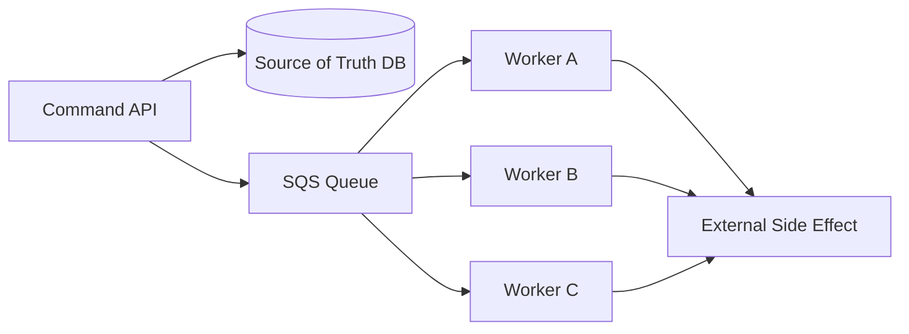
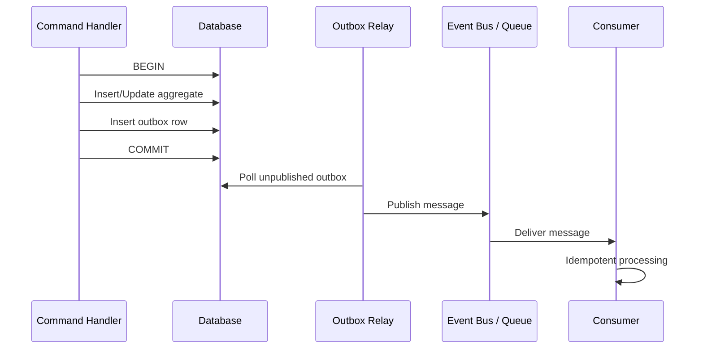
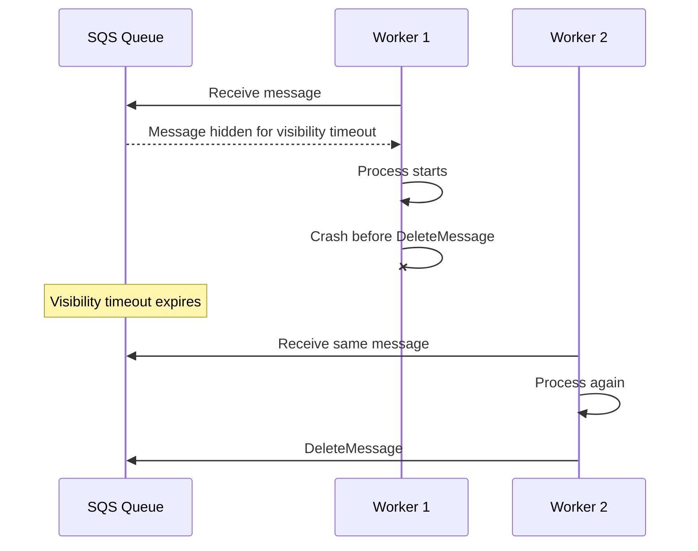
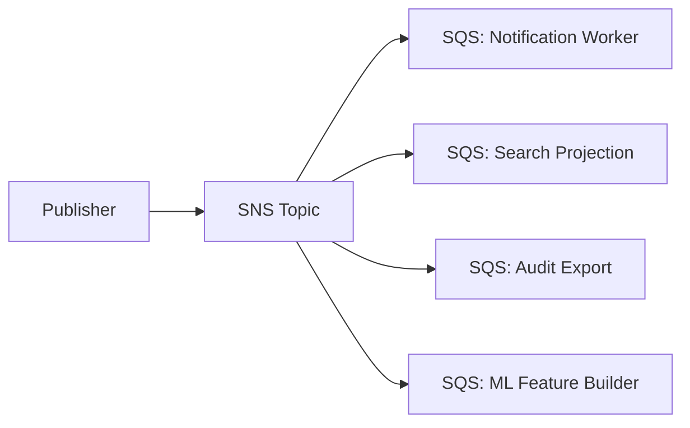
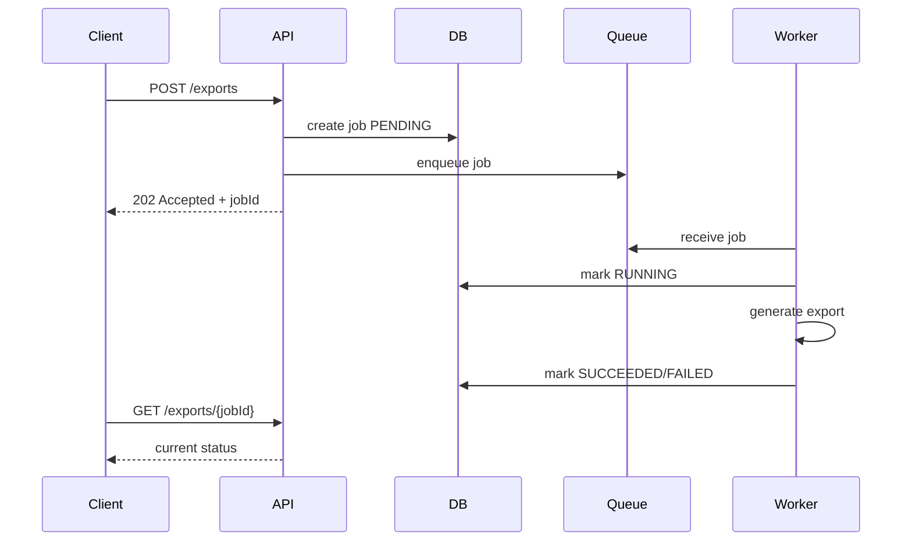
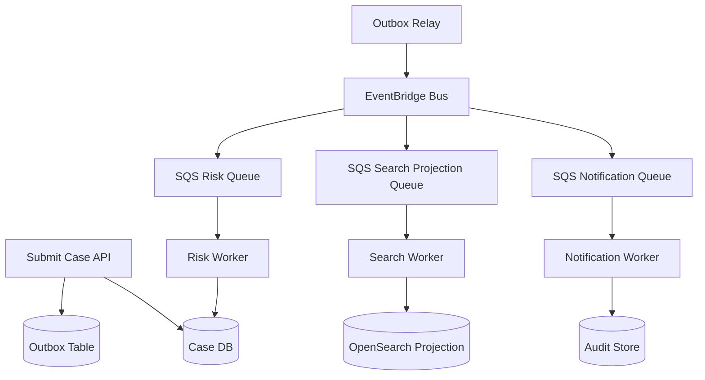

# Part 011 — Asynchronous Messaging: Work Queue, Fanout, Pub/Sub, Event Routing

> Tujuan bagian ini: memahami asynchronous messaging sebagai **mekanisme isolasi waktu, load, dan failure**, bukan sekadar cara “menjalankan proses di background”. Setelah bagian ini, kamu harus bisa mendesain command async, worker, queue, fanout, event routing, retry, DLQ, replay, idempotency, dan observability dengan mental model production.

Synchronous call membuat caller dan callee berada dalam satu rentang waktu yang sama.

Asynchronous messaging memutus rentang waktu itu.

```txt
Synchronous:
caller menunggu callee selesai sekarang.

Asynchronous:
caller menyerahkan work/event ke durable intermediary,
kemudian consumer menyelesaikan pekerjaan nanti.
```

Perubahan ini tampak kecil, tetapi efek arsitekturnya besar.

Kamu tidak lagi hanya mendesain function call.
Kamu mendesain **antrian waktu**.

---

## 1. Masalah yang Diselesaikan Async Messaging

Async messaging cocok ketika sistem membutuhkan satu atau lebih dari hal berikut:

- request masuk lebih cepat daripada kemampuan downstream memproses,
- downstream kadang gagal tetapi command tidak boleh hilang,
- side effect tidak perlu selesai sebelum user mendapat respons,
- pekerjaan bisa diproses paralel oleh worker pool,
- publisher tidak perlu tahu semua consumer,
- processing harus bisa retry tanpa menahan koneksi client,
- ada kebutuhan buffering saat spike,
- ada kebutuhan replay atau redrive saat bug consumer sudah diperbaiki,
- ada kebutuhan isolasi antar domain agar satu failure tidak menjatuhkan semua path.

Contoh:

```txt
User submit enforcement case
→ API validasi minimal
→ database commit case
→ outbox/message dibuat durable
→ worker kirim notifikasi
→ worker update search projection
→ worker create audit package
→ workflow escalation berjalan terpisah
```

User tidak perlu menunggu semua side effect selesai.
Tetapi sistem tetap harus menjamin side effect penting akhirnya diproses atau masuk failure queue yang bisa diinvestigasi.

---

## 2. Async Messaging Bukan Free Lunch

Async messaging membeli reliability dengan kompleksitas baru.

| Yang Didapat | Harga yang Dibayar |
|---|---|
| Load leveling | Backlog harus dimonitor |
| Failure isolation | Retry bisa menghasilkan duplicate |
| Temporal decoupling | State menjadi eventually consistent |
| Parallel processing | Ordering lebih sulit |
| Durable handoff | Poison message harus ditangani |
| Fanout | Contract governance lebih penting |
| Replay | Consumer harus idempotent |

Kesalahan umum engineer adalah menganggap queue membuat sistem otomatis reliable.

Queue hanya membuat failure **lebih eksplisit**.
Kalau consumer tidak idempotent, observability buruk, dan DLQ tidak punya runbook, queue hanya memindahkan bug dari request path ke background path.

---

## 3. Tiga Bentuk Utama Async di AWS

Di seri ini, kita pisahkan tiga gaya utama:

```txt
1. Work Queue
   satu pekerjaan dikonsumsi oleh satu worker dari pool.

2. Pub/Sub Fanout
   satu message dikirim ke banyak subscriber.

3. Event Routing
   event domain dirutekan berdasarkan pattern ke target berbeda.
```

Pemetaan AWS yang umum:

| Style | AWS Service Umum | Mental Model |
|---|---|---|
| Work queue | Amazon SQS | Durable queue untuk membagi kerja ke worker pool |
| Fanout pub/sub | Amazon SNS + SQS | Topic mengirim copy message ke banyak subscriber |
| Event routing | Amazon EventBridge | Event bus dengan rule, target, archive, replay |
| Workflow async | AWS Step Functions | Durable state machine untuk proses multi-step |

SQS, SNS, EventBridge, dan Step Functions bisa dipakai bersama, tetapi jangan campur mental modelnya.

---

## 4. Work Queue: Message Mewakili Pekerjaan

Work queue berarti message adalah unit of work.



Dalam work queue, message biasanya berbentuk command internal:

```json
{
  "messageType": "GenerateCaseRiskSnapshot",
  "messageVersion": 1,
  "commandId": "cmd-9d7f",
  "caseId": "case-123",
  "requestedAt": "2026-07-06T10:00:00Z",
  "idempotencyKey": "GenerateCaseRiskSnapshot:case-123:v4"
}
```

Message ini bukan “fakta domain sudah terjadi”.
Message ini adalah instruksi agar worker melakukan pekerjaan.

Karena itu, worker harus menjawab:

```txt
Apakah pekerjaan ini masih valid?
Apakah state terbaru masih membutuhkan pekerjaan ini?
Apakah pekerjaan ini sudah pernah berhasil?
Apa efek samping yang boleh diulang?
Apa yang harus dilakukan kalau gagal separuh jalan?
```

---

## 5. Event Message: Message Mewakili Fakta

Event berbeda dari command.

Command:

```txt
GenerateRiskSnapshot(caseId=123)
```

Event:

```txt
CaseRiskSnapshotRequested(caseId=123)
CaseSubmitted(caseId=123)
EvidenceAttached(caseId=123, evidenceId=456)
```

Command meminta sesuatu terjadi.
Event mengatakan sesuatu **sudah terjadi**.

Konsekuensinya:

| Aspek | Command Message | Event Message |
|---|---|---|
| Intent | Tolong lakukan X | X sudah terjadi |
| Ownership | Sender tahu pekerjaan yang diminta | Publisher hanya mengumumkan fakta |
| Consumer | Biasanya worker tertentu | Banyak subscriber independen |
| Coupling | Lebih direct | Lebih decoupled |
| Replay | Bisa berbahaya kalau side effect tidak idempotent | Bisa dipakai rebuild projection bila event contract stabil |

Dalam sistem production, pencampuran command dan event membuat debugging sulit.

Anti-pattern:

```json
{
  "eventType": "CaseSubmitted",
  "action": "send-email-and-update-risk-score-and-create-task"
}
```

Nama event bilang fakta.
Payload berisi instruksi.
Ini mencampur semantics.

---

## 6. Durable Handoff: Titik Paling Berbahaya

Async messaging sering gagal bukan di queue, tetapi di titik handoff.

Contoh buruk:

```txt
1. API commit database case.
2. API publish message ke queue.
3. Publish gagal karena network timeout.
4. API sudah terlanjur return success atau gagal tidak jelas.
```

Sekarang state database dan message queue bisa tidak sinkron.

Solusi umum untuk state-change-driven message adalah **transactional outbox**.



Invariant-nya:

```txt
Jika state change berhasil commit, outbox record juga commit.
Jika publish gagal, relay bisa retry.
Jika publish duplicate, consumer harus idempotent.
```

Outbox tidak menghilangkan duplicate.
Outbox menghilangkan **lost message after commit**.

---

## 7. Delivery Semantics: Jangan Mengejar Exactly-Once Secara Naif

Dalam distributed systems, kamu harus mendesain untuk duplicate, retry, dan ambiguity.

Amazon SQS Standard queue dirancang untuk high throughput dengan at-least-once delivery; FIFO queue memberi ordering dan deduplication semantics tertentu, tetapi tetap tidak boleh dijadikan alasan menghapus idempotency di application layer.

Prinsip aman:

```txt
Assume message can be delivered more than once.
Assume consumer can crash after side effect.
Assume delete/ack can fail after processing success.
Assume producer can publish duplicate after timeout.
```

Maka design target yang realistis adalah:

```txt
Effectively-once business outcome
melalui idempotent consumer + deduplication record + deterministic state transition.
```

Bukan:

```txt
Exactly-once transport.
```

---

## 8. Idempotent Consumer Pattern

Consumer idempotent berarti mengulang message yang sama tidak mengubah outcome secara salah.

Struktur minimal:

```txt
message_id / idempotency_key
business aggregate id
operation type
operation version
processing status
side-effect receipt
```

Contoh table:

```sql
CREATE TABLE message_processing_log (
  idempotency_key text PRIMARY KEY,
  message_type text NOT NULL,
  aggregate_id text NOT NULL,
  status text NOT NULL,
  first_seen_at timestamptz NOT NULL,
  completed_at timestamptz,
  result_hash text,
  error_code text
);
```

Pseudo-flow:

```txt
1. Receive message.
2. Start transaction.
3. Insert idempotency key.
4. If duplicate completed, skip.
5. Load current aggregate state.
6. Validate operation is still applicable.
7. Apply deterministic state transition or perform safe side effect.
8. Mark idempotency key completed.
9. Commit.
10. Delete message from queue.
```

Pseudocode Java-style:

```java
void handle(Message message) {
    String key = message.idempotencyKey();

    tx.execute(() -> {
        ProcessingRecord record = processingLog.tryStart(key, message.type(), message.aggregateId());

        if (record.isAlreadyCompleted()) {
            return;
        }

        CaseAggregate aggregate = caseRepository.loadForUpdate(message.caseId());

        if (!aggregate.needsRiskSnapshot(message.requestedVersion())) {
            processingLog.markCompleted(key, "NOOP");
            return;
        }

        RiskSnapshot snapshot = riskEngine.calculate(aggregate);
        caseRepository.attachRiskSnapshot(aggregate.id(), snapshot);
        processingLog.markCompleted(key, snapshot.hash());
    });
}
```

Perhatikan: idempotency bukan hanya “cek message id”.
Idempotency adalah desain outcome.

---

## 9. Visibility Timeout dan Consumer Crash

Pada SQS, ketika message diterima consumer, message disembunyikan sementara selama visibility timeout. Jika consumer tidak menghapus message sebelum timeout habis, message bisa terlihat lagi dan diproses ulang oleh consumer lain.

Ini bukan bug.
Ini mekanisme recovery.



Implikasi:

```txt
Visibility timeout harus lebih panjang dari expected processing time,
tetapi tidak terlalu panjang sampai recovery lambat.
```

Untuk job yang durasinya variabel, worker bisa memperpanjang visibility timeout secara eksplisit ketika progress masih sehat.

Anti-pattern:

```txt
Set visibility timeout 12 jam agar duplicate tidak terjadi.
```

Itu bukan reliability.
Itu membuat failure detection lambat.

---

## 10. Dead-Letter Queue Bukan Tempat Sampah

DLQ adalah queue khusus untuk message yang gagal diproses setelah batas retry tertentu.

DLQ yang sehat punya:

- alarm ketika jumlah message > 0 untuk queue kritis,
- dashboard age of oldest message,
- sample payload inspection,
- klasifikasi error,
- redrive runbook,
- owner jelas,
- kebijakan retention,
- mekanisme quarantine untuk message yang tidak boleh direplay massal.

DLQ yang buruk:

```txt
Message masuk DLQ.
Tidak ada yang lihat.
Retention habis.
Data hilang secara diam-diam.
```

DLQ harus dianggap sebagai **incident queue**, bukan storage permanen.

---

## 11. Retry Policy: Transport Retry vs Business Retry

Tidak semua retry sama.

| Retry Type | Contoh | Aman? | Catatan |
|---|---|---|---|
| Transport retry | network timeout ke downstream | sering aman | perlu jitter/backoff |
| Queue redelivery | consumer crash sebelum delete | wajib diasumsikan | butuh idempotency |
| Business retry | payment declined, validation failed | belum tentu | bisa butuh human review |
| Replay | rebuild projection dari event lama | aman jika consumer pure/idempotent | bahaya untuk side effect eksternal |
| Redrive DLQ | proses ulang poison message | hanya setelah root cause jelas | bisa menciptakan storm |

Rule praktis:

```txt
Retry otomatis hanya untuk failure transient.
Failure deterministic harus cepat masuk DLQ atau manual remediation.
```

Contoh deterministic failure:

```txt
Payload schema invalid.
Required aggregate tidak pernah ada.
Constraint business dilanggar.
Message version tidak didukung.
```

Contoh transient failure:

```txt
Database timeout.
Downstream 503.
Temporary throttling.
Network interruption.
```

---

## 12. Backpressure: Queue sebagai Pressure Gauge

Dalam synchronous API, pressure terlihat sebagai latency tinggi atau error.

Dalam async system, pressure terlihat sebagai backlog.

Metric penting:

```txt
ApproximateNumberOfMessagesVisible
ApproximateNumberOfMessagesNotVisible
ApproximateAgeOfOldestMessage
consumer success rate
consumer failure rate
processing duration p50/p95/p99
DLQ count
redrive count
idempotency duplicate rate
```

Interpretasi:

| Gejala | Kemungkinan Penyebab |
|---|---|
| Visible messages naik | producer lebih cepat dari consumer |
| NotVisible tinggi | banyak message sedang diproses atau stuck |
| Oldest age naik | backlog tidak terkuras |
| DLQ naik | bug consumer/schema/downstream deterministic failure |
| Duplicate rate naik | visibility timeout terlalu pendek atau consumer lambat |
| Processing duration p99 naik | DB contention/downstream latency/hot partition |

Queue adalah buffer, bukan lubang hitam.

Jika arrival rate terus lebih besar dari processing rate, queue hanya menunda kegagalan.

---

## 13. Fanout: Satu Fakta, Banyak Konsekuensi

Fanout cocok ketika satu event perlu dikonsumsi banyak downstream independen.



Dengan SNS ke SQS, setiap subscriber queue menerima copy message sendiri.

Keuntungannya:

```txt
Consumer lambat tidak menahan consumer lain.
Retry policy bisa beda per subscriber.
DLQ bisa beda per consumer.
Ownership lebih jelas.
```

Jangan fanout langsung ke banyak Lambda/function tanpa memikirkan isolation.
Untuk production workload, SQS di belakang subscription sering lebih mudah dioperasikan karena backlog dan retry bisa terlihat jelas.

---

## 14. Message Filtering: Routing Bukan Business Logic

SNS mendukung message filtering sehingga subscriber hanya menerima subset message berdasarkan attribute atau body.

EventBridge juga menggunakan event pattern untuk menentukan event mana yang dikirim ke target tertentu.

Filtering harus dipakai untuk routing, bukan menggantikan business rule.

Baik:

```json
{
  "eventType": "CaseStatusChanged",
  "caseType": "ENFORCEMENT",
  "newStatus": "ESCALATED"
}
```

Rule:

```txt
route caseType=ENFORCEMENT and newStatus=ESCALATED to escalation worker
```

Buruk:

```txt
route if complex risk formula result > 0.82 and jurisdiction-specific exception not active
```

Business decision seperti itu seharusnya ada di domain service/projection, bukan di filter policy yang tersebar di infrastructure.

---

## 15. Event Routing dengan EventBridge

EventBridge cocok ketika kamu ingin event bus yang lebih eksplisit untuk domain/application events, routing rules, SaaS/AWS integration, archive, replay, dan cross-account patterns.

Baseline event:

```json
{
  "Source": "com.acme.enforcement.case",
  "DetailType": "CaseSubmitted.v1",
  "Detail": "{\"caseId\":\"case-123\",\"submittedAt\":\"2026-07-06T10:00:00Z\"}",
  "EventBusName": "enforcement-prod"
}
```

Dalam domain system, event envelope harus punya minimal:

```txt
event_id
source
detail_type / event_type
version
occurred_at
aggregate_id
correlation_id
causation_id
producer
schema_version
```

EventBridge memberi event routing.
Ia tidak otomatis memberi domain modeling yang benar.

---

## 16. Archive and Replay: Fitur Kuat, Berbahaya Jika Consumer Tidak Siap

EventBridge archive/replay memungkinkan event disimpan dan dikirim ulang ke event bus.

Ini berguna untuk:

- recover dari bug consumer,
- rebuild projection,
- validate consumer baru,
- reprocess event setelah downstream outage,
- audit-driven reconstruction.

Tetapi replay bisa berbahaya untuk consumer yang melakukan side effect eksternal.

Aman untuk replay:

```txt
Build read model dari event.
Update search index idempotently.
Recompute risk projection deterministically.
Regenerate materialized view.
```

Berbahaya untuk replay:

```txt
Kirim email ke citizen.
Charge payment.
Create external legal notice.
Send irreversible third-party command.
```

Consumer harus punya replay mode atau side-effect guard.

```txt
if event.isReplay() and consumer.hasExternalSideEffect():
    skip or route to manual approval
```

---

## 17. Queue vs Event Bus: Decision Boundary

Gunakan SQS ketika:

```txt
Ada pekerjaan spesifik yang harus dikerjakan oleh worker pool.
Perlu backlog yang jelas.
Perlu load leveling.
Perlu per-message visibility timeout.
Perlu DLQ/redrive per worker.
```

Gunakan SNS ketika:

```txt
Satu publisher perlu mengirim copy message ke banyak subscriber.
Routing sederhana.
Fanout luas.
Subscriber bisa berupa SQS, Lambda, HTTP/S, email, SMS, mobile push, dll.
```

Gunakan EventBridge ketika:

```txt
Event domain/application perlu dirutekan berdasarkan pattern.
Perlu event bus sebagai boundary.
Perlu archive/replay.
Perlu integrasi AWS/SaaS/partner event.
Perlu cross-account event architecture.
```

Gunakan Step Functions ketika:

```txt
Ada proses multi-step yang butuh state, timeout, decision, retry, compensation, atau audit execution history.
```

---

## 18. Async Request Pattern

Kadang client tetap ingin mengetahui status pekerjaan async.

Pattern umum:

```txt
POST /exports
→ 202 Accepted
→ response berisi jobId
→ worker memproses job
→ client polling GET /exports/{jobId}
→ optional callback/event ketika selesai
```

Diagram:



Status model minimal:

```txt
PENDING
RUNNING
SUCCEEDED
FAILED_RETRYABLE
FAILED_TERMINAL
CANCELLED
EXPIRED
```

Untuk job penting, jangan jadikan queue sebagai satu-satunya sumber status.
Simpan job state di database.

---

## 19. Ordering: Jangan Meminta Global Ordering Jika Tidak Perlu

Ordering mahal.
Global ordering sangat mahal.

Pertanyaan yang benar:

```txt
Ordering dibutuhkan untuk apa?
Per aggregate?
Per customer?
Per case?
Per jurisdiction?
Per seluruh sistem?
```

Sering kali yang dibutuhkan hanya ordering per aggregate.

Contoh:

```txt
CaseSubmitted(case-1) harus diproses sebelum CaseClosed(case-1),
tetapi tidak ada kebutuhan ordering antara case-1 dan case-2.
```

SQS FIFO message group dapat membantu ordering per group, tetapi group yang terlalu besar bisa menjadi bottleneck.

Desain buruk:

```txt
messageGroupId = "all-cases"
```

Desain lebih baik:

```txt
messageGroupId = caseId
```

Tetapi walaupun transport menjaga ordering, consumer tetap harus memvalidasi state.

---

## 20. Schema Versioning untuk Message

Message contract harus versioned.

Payload minimal:

```json
{
  "schemaVersion": 2,
  "eventId": "evt-123",
  "eventType": "CaseSubmitted",
  "occurredAt": "2026-07-06T10:00:00Z",
  "aggregateId": "case-123",
  "data": {
    "caseNumber": "ENF-2026-0001",
    "jurisdiction": "ID-JK"
  }
}
```

Compatibility rules:

```txt
Menambah optional field biasanya aman.
Menghapus field tidak aman.
Mengubah meaning field sangat berbahaya.
Mengubah enum harus koordinasi consumer.
Mengubah time format hampir selalu menyakitkan.
```

Consumer sebaiknya ignore unknown fields, tetapi producer tidak boleh sembarangan mengubah semantics.

---

## 21. Security Boundary dalam Async Messaging

Async bukan berarti internal message boleh sembarangan.

Minimal:

- queue/topic/bus policy jelas,
- producer dan consumer IAM role terpisah,
- encryption at rest bila data sensitif,
- payload tidak membawa rahasia mentah,
- PII dikurangi atau direferensikan via ID,
- message retention sesuai kebutuhan legal/operational,
- cross-account publish/subscribe dibatasi,
- audit log untuk publish dan consume path penting.

Pattern aman:

```txt
Message membawa reference ID.
Consumer fetch detail dari source of truth dengan authorization internal.
```

Bukan:

```txt
Message membawa seluruh dokumen sensitif + credential + token downstream.
```

---

## 22. Operability Checklist

Sebelum async path dianggap production-ready, jawab ini:

```txt
Apa owner queue/topic/bus?
Apa message contract dan versioning policy?
Apa idempotency key?
Apa retry policy?
Apa DLQ dan alarm-nya?
Apa redrive runbook?
Apa metric backlog dan age threshold?
Apa consumer concurrency limit?
Apa happens-before relationship yang harus dijaga?
Apa max acceptable lag?
Apa replay policy?
Apa side effect yang tidak boleh replay?
Apa data retention policy?
Apa dashboard untuk producer, broker, dan consumer?
Apa reconciliation job untuk mendeteksi missed side effect?
```

Kalau jawaban ini tidak ada, async path belum selesai.

---

## 23. Common Anti-Patterns

### Anti-Pattern 1: Queue sebagai Transaction Boundary Palsu

```txt
API write DB.
API publish queue.
Tidak ada outbox.
```

Jika publish gagal setelah DB commit, side effect hilang.

### Anti-Pattern 2: Consumer Tidak Idempotent

```txt
Setiap message diterima → insert row baru / kirim email baru.
```

Duplicate delivery berubah menjadi duplicate business outcome.

### Anti-Pattern 3: DLQ Tanpa Owner

```txt
DLQ ada karena template infrastructure membuatnya.
Tidak ada alarm.
Tidak ada runbook.
```

Ini memberi ilusi safety.

### Anti-Pattern 4: Event Payload sebagai Database Dump

Event membawa semua field aggregate, termasuk field internal.
Consumer menjadi coupled ke schema internal publisher.

### Anti-Pattern 5: Semua Hal Jadi Async

Tidak semua interaksi harus async.

Jika caller membutuhkan keputusan langsung untuk melanjutkan transaksi user, synchronous mungkin lebih tepat.

### Anti-Pattern 6: Replay Consumer yang Punya Side Effect Irreversible

Replay event lama lalu mengirim ulang email/legal notice/payment.

Ini bukan bug kecil.
Ini incident.

---

## 24. Mini Case Study: Case Submission Async Side Effects

Requirement:

```txt
Ketika case disubmit:
- case harus tersimpan durable,
- audit event harus tercatat,
- notifikasi internal dikirim,
- search index diperbarui,
- risk scoring berjalan,
- user tidak perlu menunggu semuanya selesai,
- tidak boleh ada duplicate case,
- tidak boleh ada duplicate legal notice.
```

Desain:



Key invariants:

```txt
CaseSubmitted event only exists if case commit succeeded.
Every consumer uses eventId or domain idempotency key.
Search projection can replay safely.
Notification worker must dedupe by notification semantic key.
Risk worker validates latest case version before writing result.
DLQ messages page owning team.
```

---

## 25. Practical Implementation Sequence

Saat membangun async path, urutannya jangan mulai dari Terraform dulu.

Urutan yang lebih aman:

```txt
1. Definisikan message semantics: command atau event.
2. Definisikan owner dan source of truth.
3. Definisikan idempotency key.
4. Definisikan retryable vs terminal failure.
5. Definisikan DLQ dan alarm.
6. Definisikan schema version.
7. Definisikan backlog SLO.
8. Implement producer dengan durable handoff/outbox jika perlu.
9. Implement consumer idempotent.
10. Tambahkan observability.
11. Tambahkan redrive tool.
12. Jalankan chaos/failure test.
```

Failure test minimal:

```txt
Consumer crash after side effect before delete.
Publish timeout after DB commit.
Duplicate message delivery.
Message with old schema version.
Downstream 503 for 30 minutes.
Poison message enters DLQ.
Redrive 10k messages.
Consumer lag exceeds SLO.
Replay event with side-effecting consumer disabled.
```

---

## 26. Ringkasan Mental Model

Async messaging adalah desain **waktu**.

Ia menjawab:

```txt
Pekerjaan ini harus selesai sekarang atau nanti?
Kalau nanti, siapa menyimpan janji itu secara durable?
Kalau gagal, siapa retry?
Kalau duplicate, siapa dedupe?
Kalau stuck, siapa tahu?
Kalau replay, apa yang aman?
Kalau backlog naik, apa yang dikorbankan?
```

SQS memberi work queue dan load leveling.
SNS memberi fanout.
EventBridge memberi event routing, archive, dan replay.
Step Functions memberi durable orchestration.

Engineer senior tidak memilih salah satu karena nama service.
Engineer senior memilih berdasarkan semantics: command, event, work, state, ordering, retry, replay, dan ownership.

---

## Referensi

- AWS Documentation — Amazon SQS visibility timeout: https://docs.aws.amazon.com/AWSSimpleQueueService/latest/SQSDeveloperGuide/sqs-visibility-timeout.html
- AWS Documentation — Amazon SQS dead-letter queues: https://docs.aws.amazon.com/AWSSimpleQueueService/latest/SQSDeveloperGuide/sqs-dead-letter-queues.html
- AWS Documentation — Amazon SQS queue types: https://docs.aws.amazon.com/AWSSimpleQueueService/latest/SQSDeveloperGuide/sqs-queue-types.html
- AWS Documentation — Amazon SNS message filtering: https://docs.aws.amazon.com/sns/latest/dg/sns-message-filtering.html
- AWS Documentation — Fanout SNS notifications to SQS queues: https://docs.aws.amazon.com/sns/latest/dg/sns-sqs-as-subscriber.html
- AWS Documentation — What is Amazon EventBridge: https://docs.aws.amazon.com/eventbridge/latest/userguide/eb-what-is.html
- AWS Documentation — EventBridge archive and replay: https://docs.aws.amazon.com/eventbridge/latest/userguide/eb-archive.html
- AWS Prescriptive Guidance — Publish-subscribe pattern: https://docs.aws.amazon.com/prescriptive-guidance/latest/cloud-design-patterns/publish-subscribe.html
