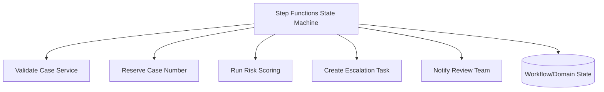
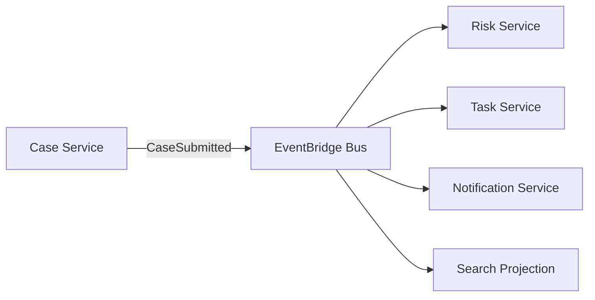
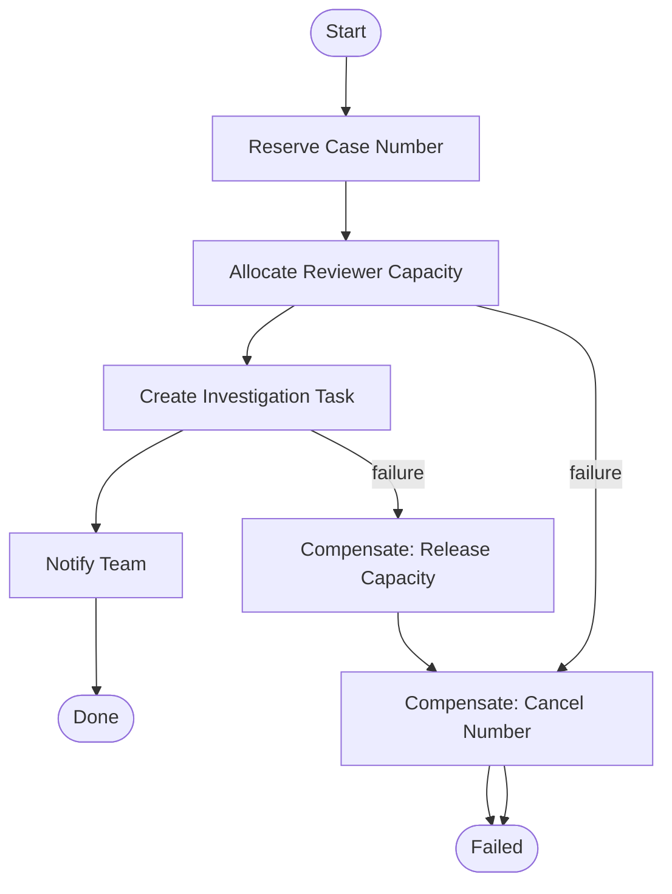
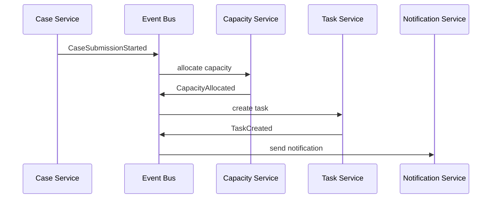
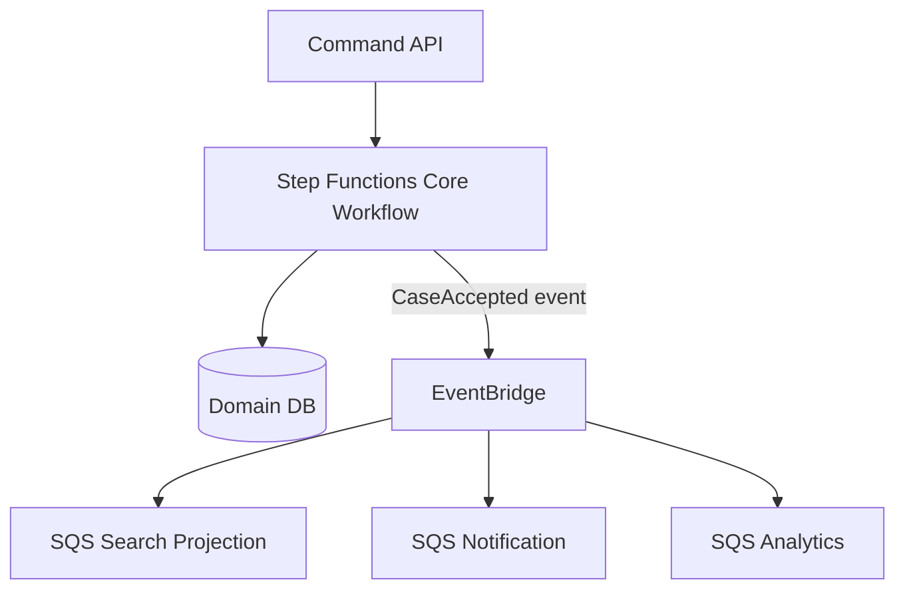
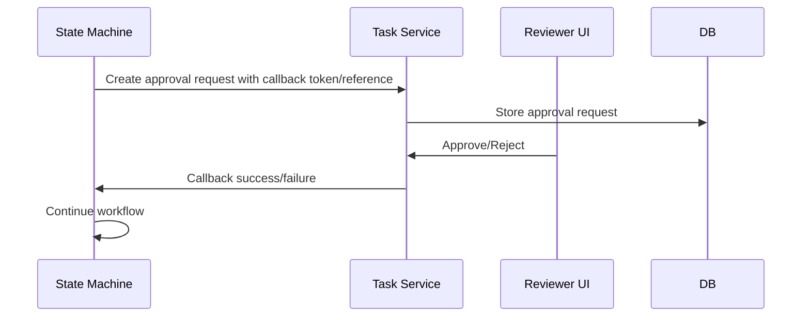

# Part 012 — Orchestration vs Choreography: Step Functions, EventBridge, dan Domain Events

> Tujuan bagian ini: memahami perbedaan orchestration dan choreography sebagai pilihan **control-flow ownership**, bukan sekadar pilihan service. Kita akan membahas kapan proses harus dipimpin oleh state machine, kapan cukup dengan event-driven choreography, kapan keduanya digabung, dan bagaimana menghindari distributed workflow yang tidak bisa di-debug.

Dalam sistem sederhana, control flow terlihat langsung di kode.

```txt
submitCase()
  validate()
  save()
  notify()
  index()
  score()
```

Dalam distributed system, langkah-langkah itu menyebar ke service, queue, event bus, database, worker, dan external system.

Pertanyaan pentingnya berubah:

```txt
Siapa yang tahu proses sedang berada di tahap apa?
Siapa yang memutuskan langkah berikutnya?
Siapa yang retry?
Siapa yang memberi timeout?
Siapa yang melakukan compensation?
Siapa yang bisa menjelaskan kenapa proses berhenti?
```

Jawaban terhadap pertanyaan itu menentukan apakah kamu butuh orchestration, choreography, atau hybrid.

---

## 1. Definisi yang Dipakai Seri Ini

### Orchestration

Orchestration berarti ada satu komponen eksplisit yang memimpin workflow.

```txt
Orchestrator tahu langkah-langkah proses,
menyimpan progress,
memanggil participant,
menangani retry/timeout,
dan menentukan langkah berikutnya.
```

Di AWS, orchestration sering direpresentasikan oleh AWS Step Functions.

### Choreography

Choreography berarti tidak ada pusat workflow tunggal.

```txt
Service menerbitkan event domain.
Service lain bereaksi terhadap event tersebut.
Setiap service tahu reaksi lokalnya sendiri.
```

Di AWS, choreography sering memakai EventBridge, SNS, SQS, Lambda/worker, dan domain events.

---

## 2. Visual Difference

### Orchestration



Satu workflow memanggil langkah-langkah.
Control flow terlihat di state machine.

### Choreography



Case Service tidak tahu siapa yang bereaksi.
Consumer memutuskan sendiri respons terhadap event.

---

## 3. Pertanyaan Inti: Siapa Owner Control Flow?

Sebelum memilih service, jawab ini:

```txt
Apakah proses punya urutan ketat?
Apakah ada branching decision?
Apakah ada timeout business?
Apakah ada compensation?
Apakah user/operator perlu melihat progress end-to-end?
Apakah kegagalan satu langkah harus menghentikan langkah berikutnya?
Apakah proses harus audit-able sebagai satu execution?
```

Jika banyak jawaban “ya”, orchestration biasanya lebih aman.

Jika proses hanya berupa konsekuensi independen dari event domain, choreography biasanya lebih natural.

---

## 4. Kapan Memilih Orchestration

Gunakan orchestration ketika workflow punya karakteristik berikut:

- multi-step process dengan urutan eksplisit,
- langkah berikut bergantung pada output langkah sebelumnya,
- ada timeout business,
- ada compensation atau rollback semantik,
- ada human approval atau external callback,
- butuh execution history end-to-end,
- proses long-running,
- operator perlu melihat “case ini stuck di tahap mana”,
- retry policy berbeda per langkah,
- failure di satu langkah harus menentukan path berikutnya.

Contoh enforcement workflow:

```txt
1. Validate case completeness.
2. Reserve official case number.
3. Generate initial risk score.
4. If high risk, request supervisor approval.
5. If approved, create investigation task.
6. Send notification.
7. Update workflow status.
```

Ini bukan sekadar event fanout.
Ini proses dengan state dan keputusan.

---

## 5. Kapan Memilih Choreography

Gunakan choreography ketika:

- publisher hanya perlu mengumumkan fakta domain,
- consumers independen,
- tidak ada urutan global antar consumer,
- kegagalan satu consumer tidak boleh menghalangi consumer lain,
- proses bisa berkembang dengan menambahkan subscriber baru,
- publisher tidak boleh tahu downstream consequences,
- event bisa dipakai membangun projection/read model,
- replay aman atau bisa dikontrol.

Contoh:

```txt
CaseSubmitted event menghasilkan:
- search index update,
- audit sink append,
- notification internal,
- metrics update,
- ML feature extraction.
```

Case service tidak perlu tahu semua itu.
Ia hanya menerbitkan fakta bahwa case sudah disubmit.

---

## 6. Tabel Keputusan

| Pertanyaan | Orchestration | Choreography |
|---|---|---|
| Siapa tahu status end-to-end? | Orchestrator | Tidak ada pusat tunggal |
| Urutan langkah penting? | Sangat cocok | Sulit jika lintas consumer |
| Consumer independen? | Bisa, tapi lebih coupled | Sangat cocok |
| Butuh compensation? | Lebih eksplisit | Sulit dan tersebar |
| Butuh audit workflow? | Kuat | Harus dibangun dari event/log |
| Tambah consumer baru? | Bisa perlu update workflow | Mudah lewat subscription/rule |
| Debugging stuck process? | Lebih mudah | Perlu tracing/correlation kuat |
| Failure isolation antar consumer | Tergantung desain | Natural jika tiap consumer punya queue |
| Coupling | Control-flow coupling | Event-contract coupling |

---

## 7. Step Functions sebagai Durable Control Plane

AWS Step Functions memungkinkan kamu membuat workflow/state machine untuk distributed applications, process automation, microservice orchestration, dan data/ML pipelines.

Mental model:

```txt
State machine = durable control plane.
Task = satu unit pekerjaan.
State transition = keputusan eksplisit.
Execution history = audit teknis workflow.
```

State machine bukan tempat menaruh semua business logic.
Ia mengatur langkah, retry, timeout, branching, dan compensation.
Business logic tetap berada di service/task.

---

## 8. Minimal State Machine Example

Contoh Amazon States Language sederhana:

```json
{
  "Comment": "Case intake workflow",
  "StartAt": "ValidateCase",
  "States": {
    "ValidateCase": {
      "Type": "Task",
      "Resource": "arn:aws:states:::lambda:invoke",
      "Next": "RiskScore"
    },
    "RiskScore": {
      "Type": "Task",
      "Resource": "arn:aws:states:::lambda:invoke",
      "Next": "IsHighRisk"
    },
    "IsHighRisk": {
      "Type": "Choice",
      "Choices": [
        {
          "Variable": "$.risk.level",
          "StringEquals": "HIGH",
          "Next": "CreateSupervisorApproval"
        }
      ],
      "Default": "CreateInvestigationTask"
    },
    "CreateSupervisorApproval": {
      "Type": "Task",
      "Resource": "arn:aws:states:::lambda:invoke",
      "Next": "WaitForApproval"
    },
    "WaitForApproval": {
      "Type": "Wait",
      "Seconds": 3600,
      "Next": "CreateInvestigationTask"
    },
    "CreateInvestigationTask": {
      "Type": "Task",
      "Resource": "arn:aws:states:::lambda:invoke",
      "End": true
    }
  }
}
```

Ini hanya contoh bentuk.
Untuk production, task sebaiknya idempotent, input/output dibatasi, timeout jelas, dan state machine tidak menyimpan payload besar.

---

## 9. Service Integration Pattern

Step Functions dapat memanggil AWS services melalui service integrations dan AWS SDK integrations. Dalam desain workflow, kamu harus membedakan:

```txt
Request-response:
  workflow memanggil task dan lanjut setelah response diterima.

Run-a-job / .sync:
  workflow menunggu job eksternal selesai.

Callback token:
  workflow pause sampai sistem eksternal/human callback mengembalikan token.
```

Pilihan pattern menentukan failure model.

| Pattern | Cocok Untuk | Risiko |
|---|---|---|
| Request-response | Task cepat dan deterministik | Timeout pendek, retry duplicate |
| `.sync` job | Batch, ECS task, Glue, Batch, job managed | Workflow menunggu lama, quota/cost |
| Callback token | Human approval, third-party callback | Token leak, callback tidak pernah datang |

Workflow long-running tidak boleh memegang database lock.
Workflow menyimpan progress di state machine/domain status, bukan transaction terbuka.

---

## 10. Saga Orchestration

Saga adalah sequence local transactions dengan compensation ketika langkah berikut gagal.

Contoh:

```txt
1. Reserve case number.
2. Allocate reviewer capacity.
3. Create investigation task.
4. Notify team.

Jika step 3 gagal:
- release reviewer capacity,
- cancel reserved case number jika belum published,
- mark workflow failed.
```

Diagram:



Compensation bukan rollback database ACID lintas service.
Compensation adalah business action yang memperbaiki state ke kondisi yang dapat diterima.

---

## 11. Choreographed Saga

Saga juga bisa dilakukan secara choreographed.



Ini terlihat decoupled, tetapi pertanyaan pentingnya:

```txt
Siapa tahu saga belum selesai?
Siapa detect timeout jika CapacityAllocated tidak pernah terbit?
Siapa memutuskan compensation?
Siapa memberi operator view?
```

Choreographed saga cocok untuk proses sederhana dan benar-benar event-native.
Untuk proses regulated, auditable, atau banyak timeout, orchestration sering lebih defensible.

---

## 12. Hidden Workflow Anti-Pattern

Anti-pattern paling berbahaya adalah hidden workflow.

```txt
Service A publish event.
Service B react, lalu publish event.
Service C react, lalu publish event.
Service D react, lalu publish event.
```

Tidak ada yang punya diagram.
Tidak ada yang punya state end-to-end.
Tidak ada yang tahu proses stuck di mana.

Gejala:

- tracing sulit,
- incident butuh grep banyak log,
- retry satu consumer mengulang side effect downstream,
- event cycle tidak sengaja,
- schema change mematahkan consumer tersembunyi,
- operator tidak bisa menjelaskan status case.

Jika choreography membentuk workflow kritis, kamu butuh minimal:

```txt
correlation id
causation id
business process id
event registry
consumer registry
process monitor/projection
timeout detector
owner end-to-end
```

Kalau tidak, gunakan orchestrator.

---

## 13. Hybrid Pattern: Orchestrate Core, Choreograph Consequences

Banyak sistem production terbaik memakai hybrid.



Prinsip:

```txt
Core business process yang perlu kontrol ketat → orchestration.
Consequences yang independen → choreography.
```

Contoh:

```txt
Submit enforcement case:
- Validate completeness → orchestrated
- Reserve case number → orchestrated
- Determine initial status → orchestrated
- Persist accepted case → orchestrated
- Publish CaseAccepted event → boundary
- Update search index → choreographed
- Notify interested teams → choreographed
- Build analytics projection → choreographed
```

Ini menjaga proses utama auditable, tetapi tetap memberi extensibility untuk konsekuensi tambahan.

---

## 14. Domain Event sebagai Boundary, Bukan RPC Terselubung

Dalam choreography, event harus merepresentasikan fakta domain.

Baik:

```txt
CaseAccepted
CaseEscalated
EvidenceAttached
ReviewerAssigned
DeadlineBreached
```

Buruk:

```txt
SendCaseEmail
CreateTaskNow
UpdateSearchIndexPlease
CallRiskService
```

Nama buruk itu sebenarnya command, bukan event.

Rule:

```txt
Jika message meminta consumer melakukan sesuatu yang spesifik, itu command.
Jika message menyatakan sesuatu sudah terjadi, itu event.
```

Choreography yang sehat berbasis event fakta.
Choreography yang sakit berbasis command terselubung.

---

## 15. Event Contract dalam Choreography

Event contract minimal:

```json
{
  "eventId": "evt-01HX",
  "eventType": "CaseAccepted",
  "eventVersion": 1,
  "source": "case-service",
  "occurredAt": "2026-07-06T10:00:00Z",
  "aggregateType": "Case",
  "aggregateId": "case-123",
  "correlationId": "corr-789",
  "causationId": "cmd-456",
  "data": {
    "caseNumber": "ENF-2026-0001",
    "jurisdiction": "ID-JK",
    "priority": "HIGH"
  }
}
```

Jangan publish internal ORM object sebagai event.

Event bukan database row dump.
Event adalah public contract.

---

## 16. Correlation dan Causation

Untuk workflow tersebar, correlation ID dan causation ID sangat penting.

```txt
correlationId:
  mengikat semua message/log/trace dalam satu business process.

causationId:
  menunjukkan message/command/event yang menyebabkan event berikutnya.
```

Contoh chain:

```txt
Command SubmitCase cmd-1
→ Event CaseSubmitted evt-1 causation=cmd-1 correlation=corr-1
→ Event RiskScoreCalculated evt-2 causation=evt-1 correlation=corr-1
→ Event EscalationTaskCreated evt-3 causation=evt-2 correlation=corr-1
```

Tanpa causation, kamu hanya punya kumpulan event.
Dengan causation, kamu punya graph proses.

---

## 17. Timeout: Perbedaan Besar Orchestration dan Choreography

Dalam orchestration, timeout bisa eksplisit di state machine.

```txt
Wait for approval 48 hours.
If no approval, escalate.
```

Dalam choreography, timeout harus dibangun sendiri.

Pattern:

```txt
CaseSubmissionStarted
→ timeout scheduler dibuat
→ jika CaseSubmissionCompleted belum ada sampai deadline
→ publish CaseSubmissionTimedOut
```

Bisa memakai EventBridge Scheduler, delayed queue pattern, Step Functions wait state, atau database-driven scheduler.

Jangan berharap event bus tahu business timeout.
Event bus merutekan event.
Ia tidak mengerti prosesmu.

---

## 18. Compensation: Centralized vs Distributed

Orchestrated compensation:

```txt
State machine tahu langkah yang sudah berhasil.
State machine memanggil compensation sesuai urutan aman.
```

Choreographed compensation:

```txt
Service mendengar failure event.
Service memutuskan apakah perlu membalik local state.
```

Choreographed compensation lebih decoupled, tetapi lebih sulit diverifikasi.

Untuk domain regulated, sering lebih baik compensation path ditulis eksplisit.

Pertanyaan defensibility:

```txt
Bisakah kita membuktikan kepada auditor/operator bahwa saat step X gagal,
compensation Y dan Z pasti dijalankan atau minimal masuk failure state yang terlihat?
```

Jika tidak, model terlalu implisit.

---

## 19. Observability untuk Orchestration

Untuk workflow orchestrated, dashboard harus menampilkan:

```txt
execution started/succeeded/failed/timed out
state duration p50/p95/p99
failure by state
retry count by state
open executions by age
stuck executions
callback waiting count
compensation count
manual intervention count
```

Logging harus menyertakan:

```txt
executionArn / executionId
stateName
businessProcessId
aggregateId
correlationId
attempt
errorType
```

Jangan hanya mengandalkan execution history manual di console.
Untuk sistem besar, operator butuh dashboard dan alarm.

---

## 20. Observability untuk Choreography

Untuk workflow choreographed, observability lebih sulit karena tidak ada pusat.

Minimal:

```txt
event publish count by type/version
consumer success/failure count
consumer lag/backlog
DLQ count per subscriber
event age at consumption
correlation trace across services
missing expected event detector
consumer registry
schema compatibility check
```

Pattern penting: **process projection**.

```txt
Subscribe ke event penting.
Bangun read model status proses.
Tampilkan progress ke operator.
```

Contoh:

```txt
case-123:
- CaseSubmitted received at 10:00
- RiskScoreCalculated received at 10:02
- EscalationTaskCreated missing after 15 minutes
- Status: STUCK_WAITING_FOR_TASK_CREATION
```

Ini memberi observability tanpa menjadikan semua proses orchestrated.

---

## 21. Failure Model Comparison

| Failure | Orchestration Handling | Choreography Handling |
|---|---|---|
| Step gagal transient | Retry per state | Consumer retry/DLQ |
| Step gagal terminal | Catch/compensation | Failure event/manual remediation |
| Consumer lambat | State menunggu/timeout | Queue backlog naik |
| Event duplicate | Task idempotency | Consumer idempotency |
| Missing event | Orchestrator tidak lanjut/timeout | Harus ada detector |
| Side effect irreversible | Guard di step | Guard per consumer |
| Schema drift | State/task contract fail | Consumer tertentu fail |
| Replay | Re-run execution atau task spesifik | Replay event bus/queue dengan guard |

Tidak ada model yang menghilangkan failure.
Yang berbeda adalah **di mana failure terlihat**.

---

## 22. Cost and Complexity Trade-Off

Orchestration menambah eksplisitness, tetapi juga menambah artefak operasional:

```txt
state machine definition
execution history
IAM per integration
timeout/retry config
payload size management
versioning workflow
deployment safety
```

Choreography menambah extensibility, tetapi juga menambah governance:

```txt
event catalog
consumer registry
schema compatibility
correlation tracing
replay policy
DLQ per consumer
process monitor
```

Pilihan matang bukan “mana lebih keren”.
Pilihan matang adalah “kompleksitas mana yang paling cocok dengan risiko domain”.

---

## 23. When Not to Use Step Functions

Jangan memakai Step Functions hanya karena ingin menggambar diagram.

Tidak ideal jika:

- proses sangat sederhana dan synchronous cukup,
- semua langkah hanya function call internal dalam satu service,
- workflow membutuhkan ultra-low-latency tight loop,
- state transition sangat granular sampai menjadi noisy,
- business logic dipindahkan ke state machine secara berlebihan,
- tim tidak siap mengoperasikan state machine lifecycle.

Step Functions adalah control plane.
Bukan pengganti desain domain.

---

## 24. When Not to Use Pure Choreography

Jangan memakai pure choreography jika:

- proses memiliki banyak dependency urutan,
- timeout business penting,
- compensation harus terjamin,
- operator butuh status proses tunggal,
- event chain sudah menjadi workflow tersembunyi,
- debugging incident membutuhkan membaca log lima service,
- audit/regulatory defensibility penting,
- kegagalan satu langkah harus mengubah jalur proses.

Dalam kondisi ini, pure choreography sering terlihat elegan di whiteboard tetapi mahal di incident.

---

## 25. Workflow State vs Domain State

Perbedaan penting:

```txt
Workflow state:
  progress proses teknis/business multi-step.
  Contoh: WAITING_FOR_APPROVAL, RUNNING_RISK_SCORE, COMPENSATING.

Domain state:
  state authoritative aggregate.
  Contoh: CASE_SUBMITTED, CASE_ACCEPTED, CASE_ESCALATED, CASE_CLOSED.
```

Jangan mencampur keduanya sembarangan.

Workflow bisa gagal sementara domain state tetap valid.
Domain state bisa berubah karena command lain sehingga workflow harus berhenti atau re-evaluate.

Contoh:

```txt
Workflow sedang WAITING_FOR_SUPERVISOR_APPROVAL.
Case dibatalkan oleh authorized user.
Workflow harus observe cancellation dan stop.
```

Karena itu task dalam workflow harus load current domain state dan memvalidasi precondition.

---

## 26. Versioning Workflow

Workflow definition berubah seiring waktu.

Pertanyaan production:

```txt
Apa yang terjadi pada execution lama saat state machine definition baru deploy?
Apakah execution lama melanjutkan definisi lama atau baru?
Apakah payload lama masih compatible?
Apakah compensation path berubah?
Bagaimana rollback workflow definition?
```

Untuk proses kritis:

- version-kan workflow name/alias,
- version-kan input schema,
- jangan hapus handler untuk task lama terlalu cepat,
- simpan workflow version pada domain/process record,
- uji migration untuk in-flight execution,
- hindari perubahan breaking pada state names yang dipakai monitoring.

---

## 27. Human-in-the-Loop Workflow

Banyak proses enterprise/regulatory bukan full automation.

Contoh:

```txt
Risk high → supervisor approval required.
Evidence incomplete → request clarification.
Case deadline breached → manual escalation.
```

Pattern:



Security rule:

```txt
Jangan expose raw callback token sembarangan.
Reviewer action harus lewat authorized domain API.
```

Workflow menunggu sinyal.
Domain service memvalidasi authority.

---

## 28. External System Integration

External system membuat orchestration lebih menarik karena failure-nya tidak bisa kamu kontrol.

Masalah umum:

```txt
external API timeout
external accepted request but response lost
external callback delayed
external duplicate callback
external idempotency tidak jelas
external SLA lebih buruk dari internal SLA
```

Pattern aman:

```txt
1. Buat local integration request record.
2. Kirim request dengan idempotency key.
3. Simpan external correlation id.
4. Wait for callback atau poll dengan bounded retry.
5. Reconcile periodically.
6. Jangan anggap timeout berarti failure business.
```

Workflow membantu mengikat langkah-langkah ini, tetapi correctness tetap bergantung pada idempotency dan reconciliation.

---

## 29. Decision Examples

### Example A: Send Email After Case Submitted

Gunakan choreography.

```txt
CaseSubmitted event → notification subscriber.
```

Alasan:

- side effect independen,
- failure email tidak boleh menggagalkan case submission,
- duplicate bisa dicegah dengan notification idempotency key,
- subscriber bisa punya DLQ sendiri.

### Example B: Reserve Case Number, Assign Reviewer, Create Investigation

Gunakan orchestration.

Alasan:

- ada urutan,
- ada state proses,
- ada compensation,
- operator perlu tahu stuck di mana.

### Example C: Search Index Update

Gunakan choreography.

Alasan:

- projection derived state,
- replay aman jika idempotent,
- lag bisa dimonitor,
- failure tidak boleh menghentikan command path.

### Example D: Legal Notice Issuance

Gunakan orchestration atau guarded command.

Alasan:

- side effect formal/irreversible,
- butuh audit,
- retry/replay harus sangat hati-hati,
- approval mungkin diperlukan.

---

## 30. Implementation Checklist

Untuk orchestration:

```txt
Apakah setiap task idempotent?
Apakah setiap state punya timeout?
Apakah retry policy bounded?
Apakah terminal failure jelas?
Apakah compensation path diuji?
Apakah execution correlation ke domain record jelas?
Apakah payload tidak terlalu besar?
Apakah in-flight versioning aman?
Apakah operator bisa melihat stuck execution?
```

Untuk choreography:

```txt
Apakah event merepresentasikan fakta domain?
Apakah event contract versioned?
Apakah setiap consumer punya owner?
Apakah setiap consumer punya queue/DLQ jika perlu isolation?
Apakah correlation/causation tersedia?
Apakah duplicate/replay aman?
Apakah process monitor dibutuhkan?
Apakah expected-event timeout detector tersedia?
```

---

## 31. Ringkasan Mental Model

Orchestration dan choreography bukan rival.
Mereka menjawab pertanyaan berbeda.

```txt
Orchestration:
  “Proses ini harus dikendalikan, dilihat, di-timeout, dan dikompensasi sebagai satu workflow.”

Choreography:
  “Fakta domain ini boleh memicu banyak konsekuensi independen tanpa publisher tahu semuanya.”
```

Gunakan orchestration untuk control flow yang kritis.
Gunakan choreography untuk independent consequences.
Gabungkan keduanya ketika core process harus auditable tetapi ekosistem downstream harus extensible.

Rule paling praktis:

```txt
Jika kamu harus menjelaskan status end-to-end ke operator/auditor,
jangan biarkan workflow kritis tersembunyi di rantai event yang tidak punya owner.
```

---

## Referensi

- AWS Documentation — What is AWS Step Functions: https://docs.aws.amazon.com/step-functions/latest/dg/welcome.html
- AWS Documentation — Step Functions use cases: https://docs.aws.amazon.com/step-functions/latest/dg/use-cases.html
- AWS Documentation — Integrating services with Step Functions: https://docs.aws.amazon.com/step-functions/latest/dg/integrate-services.html
- AWS Documentation — Optimized service integrations for Step Functions: https://docs.aws.amazon.com/step-functions/latest/dg/integrate-optimized.html
- AWS Documentation — What is Amazon EventBridge: https://docs.aws.amazon.com/eventbridge/latest/userguide/eb-what-is.html
- AWS Documentation — EventBridge event patterns: https://docs.aws.amazon.com/eventbridge/latest/userguide/eb-event-patterns.html
- AWS Documentation — EventBridge schemas: https://docs.aws.amazon.com/eventbridge/latest/userguide/eb-schema.html
- AWS Prescriptive Guidance — Publish-subscribe pattern: https://docs.aws.amazon.com/prescriptive-guidance/latest/cloud-design-patterns/publish-subscribe.html
