# Part 013 — Command, Event, Query Separation dalam Sistem AWS

> Tujuan bagian ini: membangun disiplin desain agar sistem tidak mencampur **permintaan mengubah state**, **fakta bahwa state sudah berubah**, dan **permintaan membaca state**. Di AWS, pemisahan ini menentukan apakah kamu memakai API Gateway/AppSync, command handler, Aurora/RDS/DynamoDB, transactional outbox, EventBridge, SNS, SQS, projection, cache, atau search index dengan benar.

Banyak sistem terlihat rapi di diagram, tetapi kacau di runtime karena tiga hal ini dicampur:

```txt
Command = seseorang/sistem meminta perubahan.
Event   = fakta bahwa perubahan sudah terjadi.
Query   = seseorang/sistem meminta informasi.
```

Kesalahan paling umum:

```txt
Event dipakai seperti command.
Query diam-diam mengubah state.
Command langsung broadcast event sebelum commit.
Read model dianggap source of truth.
Consumer event membuat perubahan irreversible tanpa idempotency.
```

Kalau command, event, dan query tidak dipisahkan, failure mode-nya buruk:

- user klik sekali tetapi efek terjadi dua kali,
- event terkirim tetapi database rollback,
- database commit tetapi downstream tidak pernah tahu,
- query lambat karena dipaksa join lintas domain,
- projection tertinggal tetapi UI menganggapnya final,
- replay event memicu side effect eksternal lagi,
- auditor tidak bisa membedakan intent, decision, dan fact.

Bagian ini adalah fondasi sebelum masuk delivery semantics, idempotency, API layer, queue, EventBridge, Step Functions, dan database modeling.

---

## 1. Model Paling Sederhana

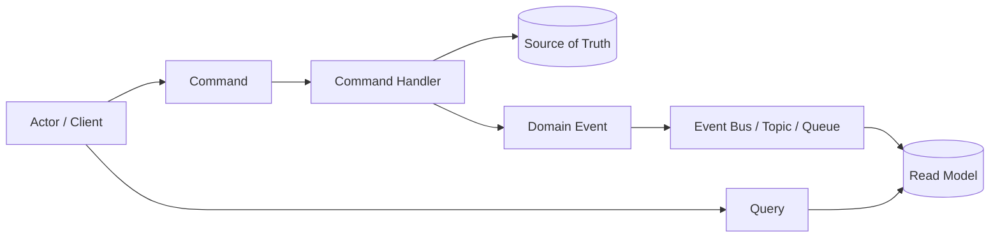

Ini bukan pola mewah. Ini hanya disiplin:

```txt
Command masuk ke boundary mutasi.
Command handler memvalidasi dan mengubah source of truth.
Event diterbitkan setelah fakta benar-benar terjadi.
Query membaca model yang cocok untuk kebutuhan baca.
```

Dalam implementasi kecil, semuanya bisa berada dalam satu service dan satu database. Dalam implementasi besar, command side, event bus, consumer, dan query side bisa tersebar.

Yang penting bukan distribusinya. Yang penting adalah **semantic separation**.

---

## 2. Command, Event, Query: Definisi Operasional

### Command

Command adalah permintaan untuk melakukan perubahan.

Ciri command:

```txt
- imperative: SubmitCase, ApproveApplication, ReserveInventory
- bisa ditolak
- punya caller
- punya authorization context
- punya idempotency key
- punya validation rule
- punya expected result
- belum tentu berhasil
```

Command menjawab:

```txt
“Apakah perubahan ini boleh dan bisa dilakukan?”
```

### Event

Event adalah fakta yang sudah terjadi.

Ciri event:

```txt
- past tense: CaseSubmitted, ApplicationApproved, InventoryReserved
- immutable
- tidak meminta siapa pun melakukan sesuatu
- boleh punya banyak consumer
- aman untuk disimpan, di-replay, dan dianalisis
- merepresentasikan perubahan domain atau lifecycle milestone
```

Event menjawab:

```txt
“Apa yang sudah terjadi?”
```

### Query

Query adalah permintaan membaca state.

Ciri query:

```txt
- tidak mengubah source of truth
- boleh dioptimalkan untuk UX/reporting/search
- boleh membaca projection/cache/search index
- harus jujur soal freshness
- harus punya consistency expectation
```

Query menjawab:

```txt
“Apa yang diketahui sistem saat ini?”
```

---

## 3. Mengapa Pemisahan Ini Penting di AWS

AWS memberi banyak building block. Tanpa pemisahan semantic, service yang benar pun bisa dipakai salah.

| Kebutuhan | Primitive AWS yang Sering Dipakai | Risiko Kalau Salah Semantik |
|---|---|---|
| Menerima command | API Gateway, AppSync, ALB, Lambda URL | API endpoint jadi generic CRUD tanpa invariant |
| Menjalankan command | Lambda, ECS/Fargate, EKS, Step Functions task | retry menyebabkan double mutation |
| Menyimpan source of truth | Aurora/RDS, DynamoDB, Aurora DSQL | source of truth bercampur projection |
| Mengeluarkan event | Transactional outbox, DynamoDB Streams, CDC/DMS, EventBridge | dual-write: DB commit tapi event hilang |
| Routing event | EventBridge, SNS | event berubah jadi remote procedure call tersembunyi |
| Work queue | SQS | consumer tidak idempotent terhadap duplicate |
| Read model | DynamoDB, Aurora replica, OpenSearch, ElastiCache, S3 | stale data dianggap canonical |
| Workflow | Step Functions | workflow dipakai untuk semua hal, termasuk konsekuensi independen |

Service AWS tidak menyelamatkan sistem dari semantik yang ambigu.

---

## 4. Rule Utama: Jangan Menamai Intent sebagai Fact

Ini buruk:

```json
{
  "eventType": "ApproveCase",
  "caseId": "C-1001"
}
```

Kenapa buruk?

Karena `ApproveCase` adalah command, bukan event. Ia meminta sesuatu terjadi.

Lebih benar:

```json
{
  "commandType": "ApproveCase",
  "commandId": "cmd-7a2",
  "caseId": "C-1001",
  "requestedBy": "user-912",
  "idempotencyKey": "approve-case:C-1001:v3"
}
```

Lalu setelah source of truth berubah:

```json
{
  "eventType": "CaseApproved",
  "eventId": "evt-88f",
  "caseId": "C-1001",
  "approvedBy": "user-912",
  "occurredAt": "2026-07-06T07:15:00Z"
}
```

Naming bukan kosmetik. Naming menentukan failure semantics.

---

## 5. Command adalah Intent, Bukan Side Effect

Command harus merepresentasikan **intent bisnis**, bukan detail teknis.

Buruk:

```txt
POST /case/123/status
body: { "status": "APPROVED" }
```

Masalah:

- tidak jelas siapa yang mengubah,
- tidak jelas rule apa yang berlaku,
- tidak jelas apakah approval, override, migration, atau correction,
- tidak ada command identity,
- sulit diaudit.

Lebih baik:

```txt
POST /cases/123/approve
body:
{
  "idempotencyKey": "...",
  "reasonCode": "EVIDENCE_SUFFICIENT",
  "comment": "...",
  "expectedVersion": 17
}
```

Command yang baik membawa intent:

```txt
ApproveCase
RejectCase
RequestMoreInformation
EscalateCase
AssignReviewer
CloseCaseAsDuplicate
ReopenCase
```

Dengan intent yang jelas, kamu bisa memasang:

- authorization rule,
- validation rule,
- state transition guard,
- idempotency scope,
- audit log,
- notification policy,
- SLA rule,
- compensation/reversal model.

---

## 6. Event adalah Fact, Bukan Request

Event harus diberi nama sebagai fakta yang sudah terjadi.

```txt
CaseSubmitted
CaseAssigned
CaseEscalated
CaseApproved
CaseClosed
PaymentCaptured
InvoiceIssued
CustomerEmailChanged
DocumentUploaded
RiskScoreCalculated
```

Event buruk:

```txt
SendEmail
UpdateSearchIndex
CreateTask
NotifyCustomer
RecalculateScore
```

Itu command/job, bukan event.

Event yang benar tidak peduli siapa yang akan merespons.

```txt
CaseApproved diterbitkan.
Notification service boleh mengirim email.
Search projection boleh update index.
Analytics boleh menghitung metric.
Audit service boleh menyimpan log.
```

Publisher tidak perlu tahu semua konsekuensi.

---

## 7. Query Tidak Boleh Mengubah Domain State

Query boleh punya efek teknis terbatas seperti:

- increment cache hit metric,
- access log,
- trace span,
- read-through cache population.

Tetapi query tidak boleh mengubah domain state.

Buruk:

```txt
GET /cases/123
```

Diam-diam:

```txt
if firstViewedByReviewer:
  markCaseAsUnderReview()
```

Itu command yang diselundupkan ke query.

Lebih baik:

```txt
POST /cases/123/start-review
GET  /cases/123
```

Kenapa penting?

Karena query biasanya:

- di-cache,
- di-prefetch,
- diulang oleh browser/mobile app,
- dipanggil oleh monitoring,
- dipanggil oleh crawler/internal tooling,
- punya retry semantics berbeda.

Jika query mengubah state, sistem menjadi tidak aman terhadap observability dan optimization.

---

## 8. AWS Mapping: Dari Semantic ke Service

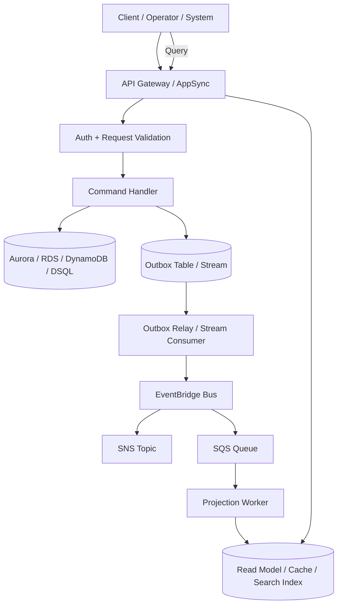

Mapping umum:

```txt
Command ingress:
  API Gateway, AppSync, ALB, private API

Command execution:
  Lambda, ECS/Fargate, EKS, Spring Boot service, Step Functions task

Source of truth:
  Aurora/RDS for relational transactional boundaries
  DynamoDB for predictable key-value access and conditional writes
  Aurora DSQL for distributed SQL use cases

Event emission:
  transactional outbox, DynamoDB Streams, CDC pipeline

Event routing:
  EventBridge for event bus routing
  SNS for fanout/pub-sub
  SQS for durable consumer isolation

Query model:
  DynamoDB table, Aurora read replica/materialized table, OpenSearch index,
  ElastiCache, S3/Parquet, Timestream depending on read shape
```

Tidak semua sistem butuh semua komponen. Tetapi semantic map tetap sama.

---

## 9. Command Side: Apa yang Harus Ada

Command handler yang production-grade minimal punya langkah ini:

```txt
1. Parse request.
2. Authenticate caller.
3. Authorize command intent.
4. Validate syntax.
5. Load aggregate/state minimal yang dibutuhkan.
6. Check state transition guard.
7. Check idempotency key.
8. Apply mutation transactionally.
9. Record event/outbox atomically with state change.
10. Return response yang jujur.
```

Dalam bentuk pseudo-code:

```java
ApproveCaseResult handle(ApproveCaseCommand command) {
    requireAuthorized(command.actor(), "case.approve", command.caseId());

    return transaction.execute(() -> {
        IdempotencyRecord prior = idempotency.find(command.idempotencyKey());
        if (prior != null) return prior.replayResult();

        Case c = cases.getForUpdate(command.caseId());
        c.approve(command.actor(), command.reasonCode(), command.expectedVersion());

        cases.save(c);
        outbox.insert(DomainEvent.caseApproved(c, command.correlationId()));

        ApproveCaseResult result = ApproveCaseResult.accepted(c.id(), c.version());
        idempotency.record(command.idempotencyKey(), result);
        return result;
    });
}
```

Poin penting:

```txt
Event dicatat dalam transaction yang sama dengan state change.
Event belum tentu langsung keluar ke EventBridge.
Yang penting fakta tidak hilang.
```

---

## 10. Command Response Bukan Event

Command response menjawab status command kepada caller.

Contoh response synchronous:

```json
{
  "commandId": "cmd-7a2",
  "caseId": "C-1001",
  "status": "ACCEPTED",
  "caseVersion": 18,
  "links": {
    "case": "/cases/C-1001",
    "operation": "/operations/cmd-7a2"
  }
}
```

Response bukan tempat untuk menyelundupkan semua konsekuensi downstream.

Untuk command yang memicu proses panjang, response harus jujur:

```txt
202 Accepted
operationId: op-123
```

Jangan berpura-pura semua downstream sudah selesai kalau sebenarnya masih asynchronous.

---

## 11. Event Envelope

Event yang production-grade membutuhkan envelope, bukan hanya payload.

```json
{
  "id": "evt-01HV...",
  "source": "case-service",
  "detailType": "CaseApproved",
  "version": "1.0",
  "time": "2026-07-06T07:15:00Z",
  "correlationId": "corr-abc",
  "causationId": "cmd-7a2",
  "tenantId": "tenant-42",
  "subject": "case/C-1001",
  "detail": {
    "caseId": "C-1001",
    "caseVersion": 18,
    "approvedBy": "user-912",
    "reasonCode": "EVIDENCE_SUFFICIENT"
  }
}
```

Field penting:

| Field | Fungsi |
|---|---|
| `id` | identitas event untuk dedupe dan audit |
| `source` | bounded context/service publisher |
| `detailType` | tipe event bisnis |
| `version` | versi contract |
| `time` | waktu kejadian menurut publisher |
| `correlationId` | menghubungkan seluruh request journey |
| `causationId` | command/event yang menyebabkan event ini |
| `tenantId` | isolation/multi-tenant routing bila relevan |
| `subject` | resource canonical |
| `detail` | payload domain |

EventBridge sendiri punya konsep event envelope seperti `source`, `detail-type`, dan `detail`; gunakan itu sebagai struktur routing, bukan sekadar JSON bebas.

---

## 12. Thin Event vs Fat Event

Ada dua gaya event.

### Thin Event

```json
{
  "detailType": "CaseApproved",
  "detail": {
    "caseId": "C-1001",
    "caseVersion": 18
  }
}
```

Kelebihan:

- payload kecil,
- tidak membocorkan banyak data,
- consumer mengambil data terbaru sendiri.

Kekurangan:

- consumer perlu call balik ke service/domain API,
- replay bisa melihat state yang sudah berubah,
- coupling runtime meningkat.

### Fat Event

```json
{
  "detailType": "CaseApproved",
  "detail": {
    "caseId": "C-1001",
    "caseVersion": 18,
    "status": "APPROVED",
    "approvedBy": "user-912",
    "approvedAt": "2026-07-06T07:15:00Z",
    "riskBand": "HIGH",
    "jurisdiction": "ID-JK"
  }
}
```

Kelebihan:

- consumer bisa bekerja tanpa call balik,
- replay lebih deterministic,
- projection lebih mudah.

Kekurangan:

- schema lebih berat,
- data privacy lebih sulit,
- perubahan payload perlu disiplin compatibility.

Rule praktis:

```txt
Gunakan event cukup kaya untuk consumer umum menjalankan konsekuensi normal,
tetapi jangan menjadikan event sebagai dump seluruh row database.
```

---

## 13. Query Side: Baca untuk Use Case, Bukan untuk Kemurnian Model

Command side menjaga invariant. Query side melayani pertanyaan.

Pertanyaan UI/reporting biasanya tidak mengikuti struktur write model.

Contoh command model:

```txt
Case
Evidence
Assignment
ReviewDecision
Escalation
SLA
```

Pertanyaan UI:

```txt
Tampilkan worklist reviewer:
- case number
- priority
- SLA remaining
- latest document count
- risk band
- assignee
- next action
```

Kalau semua query dipaksa join langsung ke source of truth, sistem akan:

- memperlambat write database,
- membuat index tidak terkendali,
- memaksa cross-domain join,
- mencampur read concern dengan write invariant.

Read model boleh denormalized.

```json
{
  "pk": "REVIEWER#user-912",
  "sk": "DUE#2026-07-07#CASE#C-1001",
  "caseId": "C-1001",
  "title": "Potential breach case",
  "priority": "P1",
  "slaRemainingMinutes": 240,
  "riskBand": "HIGH",
  "nextAction": "APPROVE_OR_REQUEST_INFO"
}
```

Ini bukan source of truth. Ini projection untuk membaca cepat.

---

## 14. CQRS: Bukan Berarti Harus Kompleks

CQRS sering disalahpahami sebagai event sourcing penuh, banyak database, dan arsitektur rumit.

Definisi yang dipakai di sini:

```txt
CQRS = pisahkan model mutasi dari model baca ketika kebutuhan write dan read berbeda.
```

Level CQRS:

| Level | Bentuk | Kapan Cukup |
|---|---|---|
| 0 | CRUD biasa | sistem kecil, query sederhana, invariant ringan |
| 1 | service method command/query terpisah | perlu semantic discipline tetapi satu DB masih cukup |
| 2 | write table dan read table terpisah dalam DB sama | read shape berbeda tetapi operasional ingin sederhana |
| 3 | async projection ke read store lain | query berat, latency/read scale tinggi, search/worklist/reporting |
| 4 | event-sourced aggregate + projections | audit/event history adalah model utama, butuh replay kuat |

Jangan mulai dari level 4 kecuali domain membutuhkannya.

---

## 15. API Composition vs CQRS Projection

Ketika query membutuhkan data dari banyak service, ada dua pendekatan umum.

### API Composition

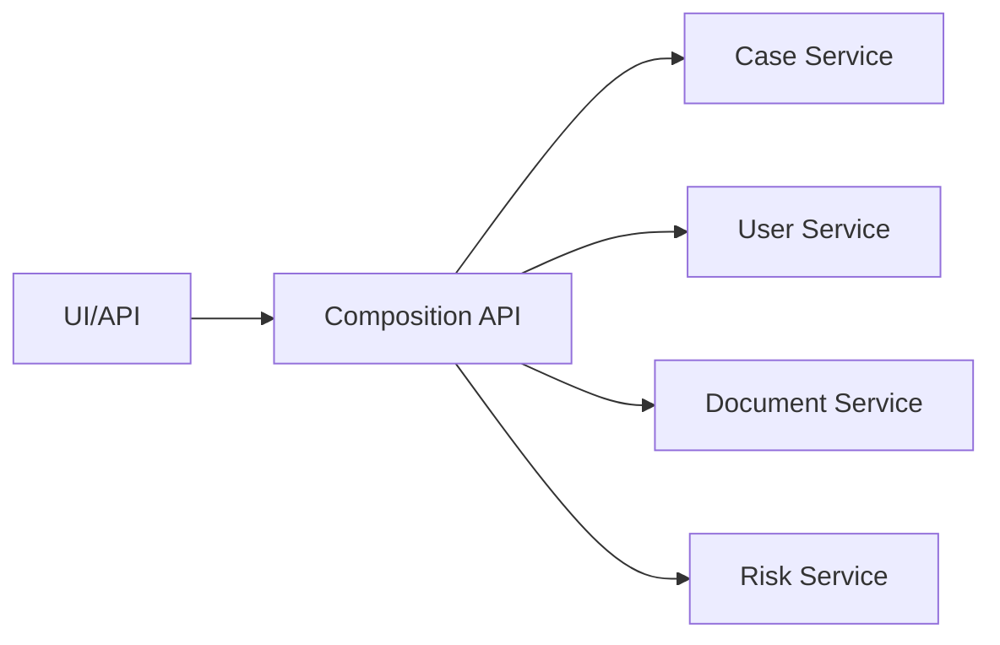

Kelebihan:

- sederhana untuk awal,
- data fresh,
- tidak perlu projection pipeline.

Kekurangan:

- latency tail buruk,
- availability ikut dependency terlemah,
- sulit untuk list besar,
- rate limit antar service,
- query menjadi distributed transaction versi baca.

### CQRS Projection

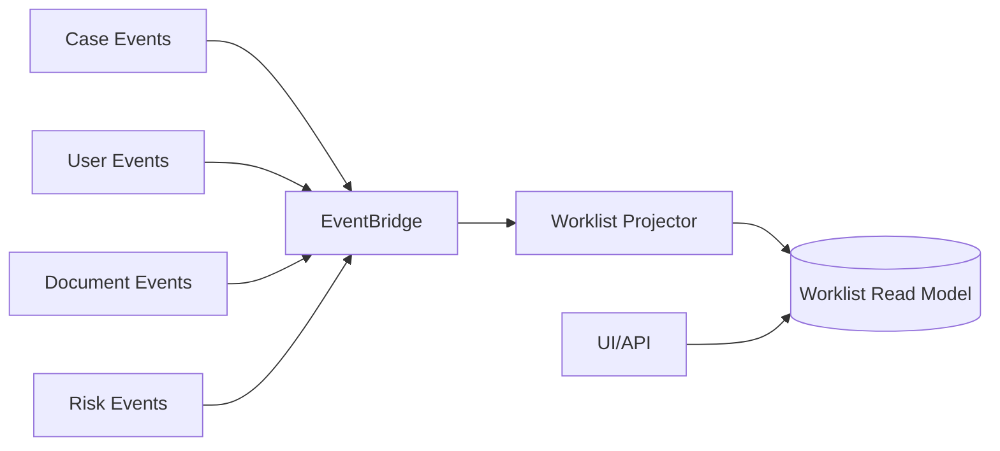

Kelebihan:

- query cepat,
- dependency runtime lebih kecil,
- cocok untuk dashboard/worklist/search,
- bisa scale independen.

Kekurangan:

- eventual consistency,
- butuh projection correctness,
- butuh replay/rebuild,
- butuh observability freshness.

Rule praktis:

```txt
Untuk detail page kecil: API composition sering cukup.
Untuk worklist/search/dashboard dengan banyak row: projection lebih sehat.
```

---

## 16. Source of Truth vs Projection

Source of truth adalah tempat invariant diputuskan.

Projection adalah salinan teroptimasi untuk membaca.

| Pertanyaan | Source of Truth | Projection |
|---|---|---|
| Boleh approve case? | Ya | Tidak |
| Apa status canonical case? | Ya | Mungkin stale |
| Tampilkan daftar case reviewer? | Tidak ideal | Ya |
| Jalankan transition guard? | Ya | Tidak |
| Search full-text? | Tidak ideal | Ya |
| Audit formal? | Ya | Bisa membantu, bukan canonical |

Anti-pattern:

```txt
Projection dipakai untuk mengambil keputusan mutasi penting.
```

Contoh buruk:

```txt
ApproveCase membaca status dari OpenSearch index.
```

OpenSearch bisa tertinggal. Command harus membaca source of truth.

---

## 17. Transactional Outbox: Jembatan Command dan Event

Masalah klasik:

```txt
1. Simpan perubahan ke database.
2. Publish event ke EventBridge.
```

Ada dua failure:

```txt
DB commit berhasil, publish event gagal.
Publish event berhasil, DB rollback/gagal.
```

Transactional outbox memecah masalah:

```txt
Dalam transaction yang sama:
  - update source of truth
  - insert row outbox

Di luar transaction:
  - relay membaca outbox
  - publish ke EventBridge/SNS/SQS
  - mark published
```

Diagram:

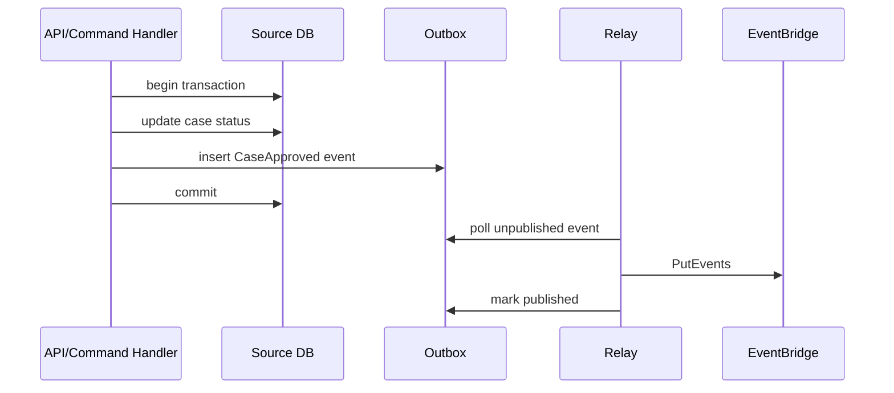

Kunci:

```txt
State change dan event record harus atomic.
Publish event boleh retry.
Consumer tetap harus idempotent.
```

Outbox bukan membuat exactly-once delivery. Outbox membuat **tidak kehilangan fakta setelah commit**.

---

## 18. DynamoDB Streams sebagai Outbox-Adjacent Pattern

Untuk DynamoDB, perubahan item bisa mengalir lewat DynamoDB Streams.

Pola umum:

```txt
Command handler melakukan conditional write ke DynamoDB.
DynamoDB Streams menangkap perubahan.
Stream consumer menerjemahkan perubahan menjadi domain event/projection.
```

Kelebihan:

- tidak perlu polling outbox manual,
- perubahan dekat dengan write path,
- cocok untuk projection dan downstream event.

Risiko:

- stream record adalah perubahan data, belum tentu domain event yang bagus,
- consumer harus menerjemahkan dengan hati-hati,
- event contract jangan bocorkan struktur tabel internal,
- ordering berlaku dalam batas tertentu, tidak boleh diasumsikan global,
- replay/rebuild perlu desain terpisah.

Rule:

```txt
Jangan membuat consumer eksternal bergantung pada bentuk item internal DynamoDB.
Gunakan translator menjadi event contract publik.
```

---

## 19. EventBridge sebagai Domain Event Router

EventBridge cocok ketika kamu ingin routing event berdasarkan pola:

```txt
source = case-service
detail-type = CaseApproved
detail.riskBand = HIGH
detail.jurisdiction = ID-JK
```

Pola sehat:

```txt
Publisher menerbitkan fact.
EventBridge rule memilih target.
Target biasanya SQS queue/Lambda/Step Functions/API destination.
Consumer punya failure isolation.
```

Anti-pattern:

```txt
Publisher membuat event detail-type = RunBillingLambdaNow.
```

Itu bukan domain event. Itu command ke implementation detail.

EventBridge sebaiknya merutekan domain fact, bukan menjadi remote procedure call disguised as event.

---

## 20. SNS dan SQS dalam Separation Model

SNS dan SQS sering muncul bersama, tetapi semantiknya berbeda.

```txt
SNS = fanout notification kepada banyak subscription.
SQS = durable queue untuk satu consumer group/worker boundary.
```

Pola umum:

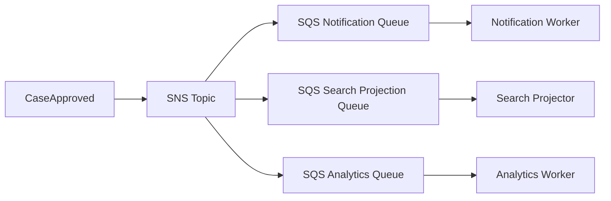

Kenapa SNS langsung ke banyak Lambda kadang berbahaya?

Karena consumer isolation lemah jika kamu tidak memikirkan:

- retry policy,
- DLQ,
- backpressure,
- replay,
- rate limit,
- consumer downtime.

Untuk konsekuensi penting, taruh SQS sebagai buffer per consumer.

---

## 21. Step Functions dalam Command/Event/Query Separation

Step Functions bukan event bus. Step Functions adalah durable workflow/control plane.

Gunakan Step Functions ketika command memulai proses multi-step:

```txt
SubmitApplication
  -> validate
  -> reserve number
  -> run risk scoring
  -> wait for manual review
  -> issue decision
```

Event tetap bisa keluar dari setiap milestone:

```txt
ApplicationSubmitted
RiskScoringCompleted
ManualReviewRequested
ApplicationApproved
```

Diagram hybrid:

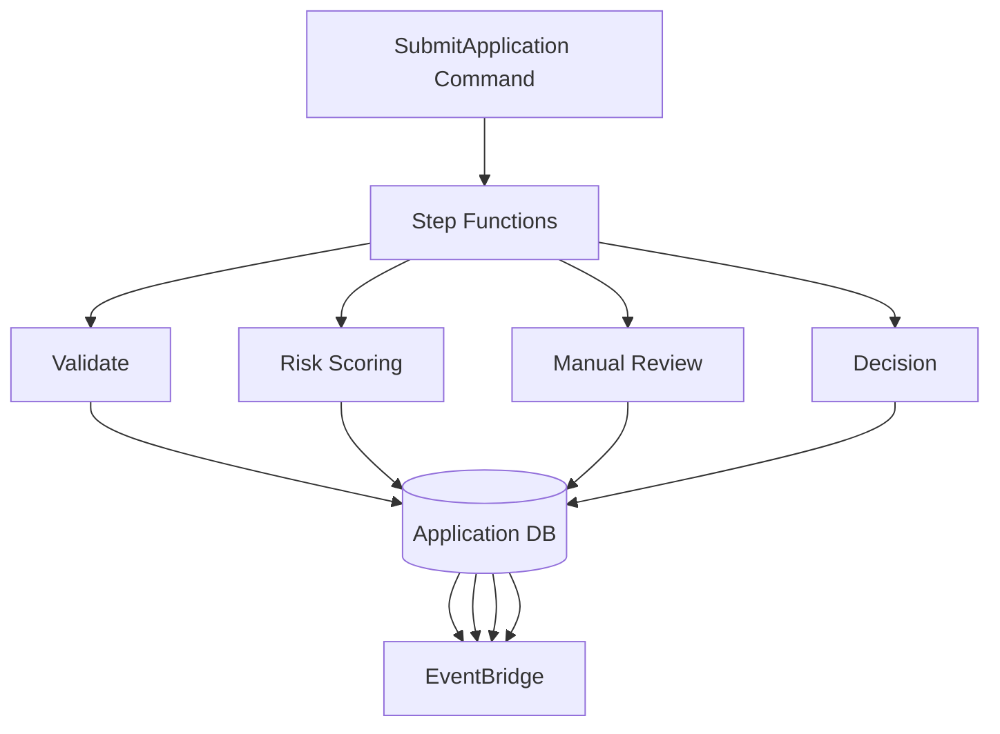

Rule:

```txt
Step Functions mengelola control flow.
EventBridge menyebarkan facts.
Jangan jadikan EventBridge sebagai state machine tersembunyi untuk workflow kritis.
```

---

## 22. Versioning: Command dan Event Berbeda Strategi

### Command Versioning

Command berasal dari client tertentu. Kamu bisa lebih ketat.

Strategi:

```txt
- version API endpoint bila perlu
- gunakan request schema validation
- tolak field invalid
- gunakan explicit command type
- support backward compatibility untuk client lama selama migration window
```

### Event Versioning

Event bisa punya banyak consumer yang tidak diketahui publisher.

Strategi:

```txt
- additive changes lebih aman
- jangan rename/remove field tanpa versi baru
- jangan ubah meaning field lama
- version detailType atau field version
- jaga sample event dan schema registry bila dipakai
```

Contoh:

```txt
CaseApproved.v1
CaseApproved.v2
```

Atau:

```json
{
  "detailType": "CaseApproved",
  "version": "2.0",
  "detail": { ... }
}
```

Yang penting consumer bisa membedakan contract.

---

## 23. Correlation dan Causation

Untuk debugging distributed system, kamu butuh dua chain.

```txt
Correlation ID = semua aktivitas dalam satu user/system journey.
Causation ID   = event/command langsung yang menyebabkan aktivitas ini.
```

Contoh:

```txt
Command: SubmitCase cmd-1 correlation=corr-9
Event:   CaseSubmitted evt-1 correlation=corr-9 causation=cmd-1
Command: RunRiskScore cmd-2 correlation=corr-9 causation=evt-1
Event:   RiskScoreCompleted evt-2 correlation=corr-9 causation=cmd-2
```

Diagram:

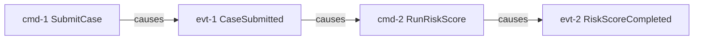

Tanpa causation, kamu hanya punya kumpulan log. Dengan causation, kamu punya execution narrative.

---

## 24. State Machine Guard: Command Side Harus Menjaga Lifecycle

Command side harus punya transition guard.

Contoh lifecycle case:

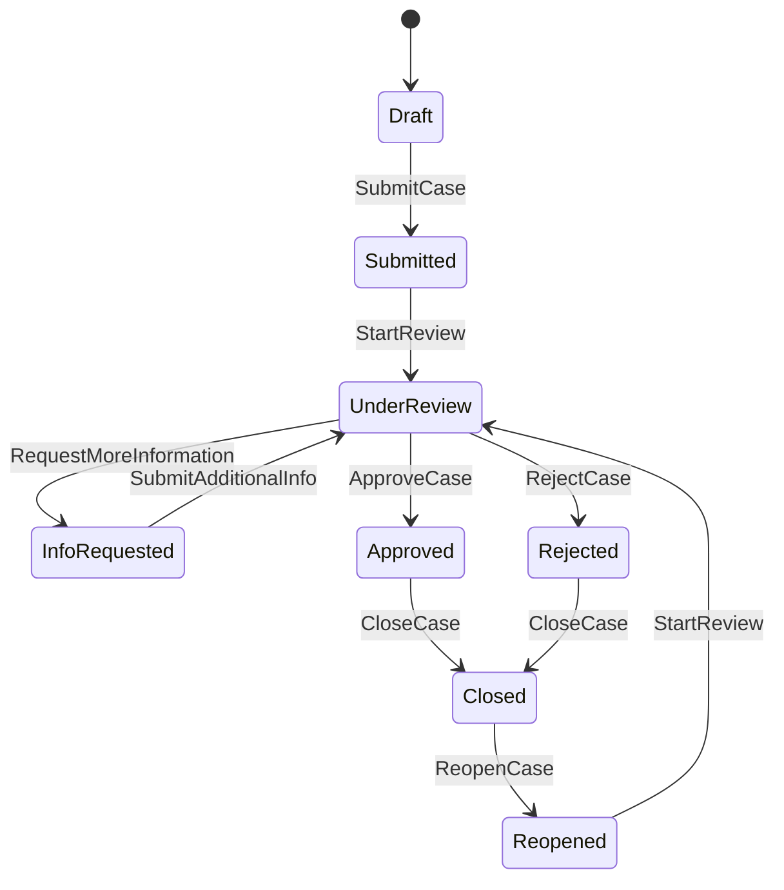

Command handler harus menolak transition invalid:

```txt
ApproveCase dari Draft -> reject command.
SubmitAdditionalInfo dari Closed -> reject command.
CloseCase dari InfoRequested -> tergantung rule domain.
```

Event tidak boleh dipakai untuk memaksa transition tanpa guard.

---

## 25. Anti-Pattern: Event-Carried State Transfer Tanpa Ownership

Event-carried state transfer berarti event membawa state cukup lengkap sehingga consumer tidak perlu call balik.

Itu bisa bagus.

Tetapi jadi buruk kalau ownership kabur.

Contoh buruk:

```txt
CustomerUpdated event membawa creditLimit.
Order service menyimpan creditLimit.
Payment service menyimpan creditLimit.
Risk service menyimpan creditLimit.
Semua service mulai memutuskan limit secara lokal.
```

Pertanyaan:

```txt
Siapa source of truth creditLimit?
Siapa boleh mengubahnya?
Jika ada correction, siapa reconcile?
Jika projection stale, command mana yang tetap aman?
```

Rule:

```txt
Projection boleh menyalin data untuk membaca atau local decision ringan.
Keputusan mutasi kritis harus kembali ke owner atau menggunakan snapshot version yang eksplisit.
```

---

## 26. Anti-Pattern: Generic CRUD API sebagai Command Boundary

Generic CRUD terlihat efisien:

```txt
POST /entities
PATCH /entities/{id}
DELETE /entities/{id}
```

Tetapi domain command hilang.

Akibat:

- authorization terlalu kasar,
- lifecycle rule bocor ke UI,
- audit log tidak punya intent,
- event menjadi `EntityUpdated`, terlalu generik,
- downstream tidak tahu apa yang sebenarnya terjadi,
- schema field menjadi workflow engine tersembunyi.

Lebih baik command explicit untuk perubahan bermakna:

```txt
POST /cases/{id}/submit
POST /cases/{id}/assign
POST /cases/{id}/request-info
POST /cases/{id}/approve
POST /cases/{id}/reject
POST /cases/{id}/close
```

CRUD masih boleh untuk resource administratif sederhana, tetapi jangan untuk lifecycle penting.

---

## 27. Anti-Pattern: Event sebagai Integration Database

Kadang tim mencoba menghindari shared database dengan membuat semua event membawa semua data.

Hasilnya:

```txt
Event bus menjadi database tidak resmi.
Consumer bergantung pada event lama untuk membangun state.
Tidak ada retention/replay policy yang jelas.
Tidak ada compacted state.
Tidak ada ownership correction.
Tidak ada schema lifecycle.
```

Event bus bukan database.

Kalau consumer perlu state, buat read model dengan ownership jelas.

```txt
Event bus menyampaikan perubahan.
Projection menyimpan state baca.
Source of truth tetap berada di owner domain.
```

---

## 28. Anti-Pattern: Query Langsung ke Database Service Lain

Buruk:

```txt
Case UI langsung join ke database User Service, Document Service, Risk Service.
```

Kenapa buruk?

- melanggar ownership,
- coupling schema keras,
- migration sulit,
- query availability bergantung banyak database,
- audit access sulit,
- security boundary kabur.

Alternatif:

```txt
- API composition melalui public/internal API owner
- read model/projection lintas event
- data product/reporting pipeline untuk analytics
```

Database per service tidak berarti semua query jadi mudah. Justru kamu harus mendesain query boundary.

---

## 29. Implementation Blueprint: Case Approval di AWS

Use case:

```txt
Reviewer menekan Approve Case.
Sistem harus mengubah status case, mencatat audit, menerbitkan event,
memperbarui worklist, mengirim notifikasi, dan membuka task follow-up bila risk tinggi.
```

### Command Path

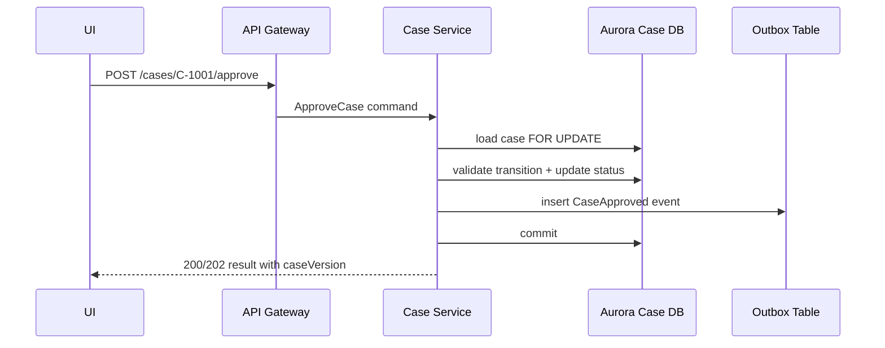

### Event Path

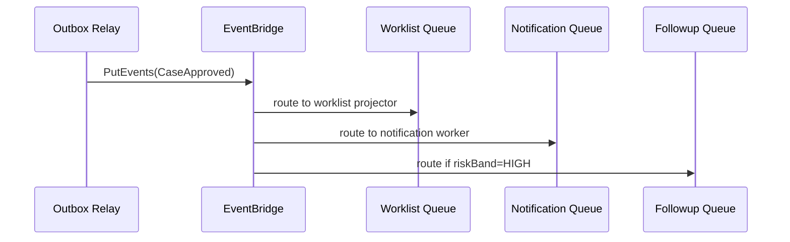

### Query Path

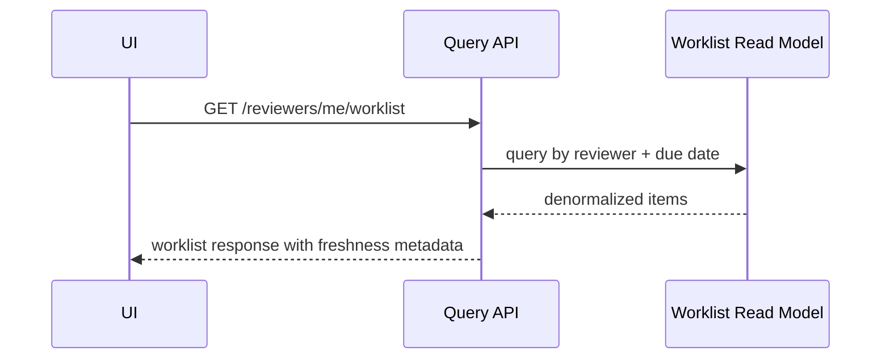

---

## 30. Freshness Contract untuk Query

Jika read model asynchronous, API harus jujur.

Contoh response:

```json
{
  "items": [ ... ],
  "freshness": {
    "model": "eventual",
    "lastProjectedEventTime": "2026-07-06T07:15:03Z",
    "lagMs": 1200
  }
}
```

Tidak semua endpoint perlu menampilkan ini ke end-user, tetapi sistem internal/ops sebaiknya punya.

Untuk command setelah write, ada beberapa strategi:

| Kebutuhan | Strategi |
|---|---|
| User butuh melihat hasil mutasi langsung | return canonical state dari command side |
| User membuka detail page | read source of truth atau read-your-write token |
| User membuka worklist | projection eventual cukup jika UI bisa tolerate |
| Legal/audit decision | selalu baca source of truth |

---

## 31. Read-Your-Writes Problem

Setelah command sukses, user refresh UI tetapi projection belum update.

Gejala:

```txt
User approve case.
Response sukses.
Worklist masih menampilkan case sebagai pending selama 2 detik.
User klik approve lagi.
```

Solusi:

```txt
- idempotency key pada command
- optimistic UI dengan operation state
- read canonical state untuk detail setelah command
- projection freshness indicator
- monotonic version check
- hide/disable action berdasarkan command result, bukan projection stale
```

Jangan menyelesaikan read-your-writes dengan membuat semua query synchronous join ke write database. Gunakan strategi per use case.

---

## 32. Idempotency Scope untuk Command dan Consumer

Command idempotency:

```txt
Sama idempotency key + sama actor + sama command intent = efek sama.
```

Consumer idempotency:

```txt
Sama eventId atau sama business effect key = efek tidak digandakan.
```

Contoh:

```txt
Command idempotency key:
  approve-case:C-1001:reviewer-user-912:client-request-abc

Consumer effect key:
  notification:case-approved:C-1001:v18:email-reviewer
  worklist-remove:C-1001:version-18
```

Idempotency tidak sama dengan deduplication sementara. Idempotency adalah invariant aplikasi.

---

## 33. Event Consumer Harus Punya Ownership Efek

Consumer yang baik tahu efek lokalnya.

```txt
CaseApproved -> Notification Service:
  Kirim email approval ke relevant parties.

CaseApproved -> Worklist Projector:
  Hapus case dari pending approval worklist.

CaseApproved -> Audit Projection:
  Tambahkan audit timeline read model.
```

Consumer buruk:

```txt
CaseApproved -> GeneralAutomationService:
  Lihat config runtime dan lakukan 17 hal berbeda.
```

Terlalu generic menyebabkan ownership kabur. Jika ada kegagalan, tidak jelas siapa yang memperbaiki.

---

## 34. Schema Compatibility Checklist

Untuk command:

```txt
Apakah field mandatory benar-benar mandatory?
Apakah client lama masih bisa memanggil selama migration?
Apakah unknown field ditolak atau diabaikan secara eksplisit?
Apakah enum punya forward compatibility plan?
Apakah error code stabil?
```

Untuk event:

```txt
Apakah perubahan additive?
Apakah consumer yang tidak tahu field baru tetap aman?
Apakah field lama tidak berubah meaning?
Apakah nullability jelas?
Apakah timestamp timezone jelas?
Apakah ID global unique?
Apakah event sample tersedia?
```

Untuk query response:

```txt
Apakah response shape cocok untuk UI?
Apakah pagination stable?
Apakah sorting deterministic?
Apakah freshness/consistency expectation jelas?
Apakah field derived diberi nama sebagai derived?
```

---

## 35. Observability untuk Command/Event/Query

Minimum telemetry:

### Command Metrics

```txt
command_attempt_total{commandType}
command_success_total{commandType}
command_rejected_total{reason}
command_idempotency_replay_total{commandType}
command_latency_ms{commandType}
command_transaction_conflict_total{commandType}
```

### Event Metrics

```txt
outbox_unpublished_count
outbox_publish_latency_ms
event_publish_failure_total
event_consumer_lag_ms{consumer}
event_consumer_duplicate_total{consumer}
event_consumer_failure_total{consumer,eventType}
dlq_message_count{queue}
```

### Query Metrics

```txt
query_latency_ms{queryName}
query_error_total{queryName}
read_model_lag_ms{model}
cache_hit_ratio{model}
stale_read_detected_total{model}
```

Trace harus membawa:

```txt
correlationId
causationId
commandId
eventId
caseId/orderId/domainId
tenantId jika relevan
```

---

## 36. Security Boundary

Command, event, dan query punya security model berbeda.

### Command Security

```txt
- authenticate caller
- authorize intent
- validate ownership/role/state
- audit actor and reason
- protect idempotency token abuse
```

### Event Security

```txt
- publisher permission ke event bus/topic
- consumer permission minimum
- avoid leaking sensitive data in event payload
- cross-account bus policy bila dipakai
- encryption and retention policy
```

### Query Security

```txt
- row/item-level authorization
- projection tidak boleh bocorkan data
- cache key harus include tenant/authorization scope
- search index harus mengikuti access boundary
```

Bug serius sering terjadi ketika projection/search/cache tidak mengikuti security boundary command/source of truth.

---

## 37. Testing Matrix

| Area | Test yang Harus Ada |
|---|---|
| Command idempotency | retry command dengan same key tidak double-effect |
| Command conflict | expectedVersion lama ditolak |
| Invalid transition | command dari state salah ditolak |
| Outbox atomicity | DB commit menghasilkan outbox row |
| Relay retry | EventBridge publish gagal lalu retry aman |
| Duplicate event | consumer menerima event sama dua kali |
| Out-of-order event | projection menerima v18 lalu v17 |
| Replay | event lama di-replay tanpa side effect irreversible |
| Query stale | UI/API tetap aman saat projection tertinggal |
| Schema evolution | consumer lama menerima event versi baru additive |
| Security | projection tidak bocorkan tenant lain |
| Audit | command intent dan resulting event bisa dilacak |

---

## 38. Decision Table

| Situasi | Pilihan yang Disarankan |
|---|---|
| Mutasi sederhana, query sederhana | Command/query method terpisah dalam service yang sama |
| Lifecycle penting dengan audit | Explicit command + source of truth + domain event |
| Downstream konsekuensi independen | Domain event ke EventBridge/SNS/SQS |
| Query worklist/dashboard berat | Async projection/read model |
| Search full-text | OpenSearch sebagai projection, bukan source of truth |
| Proses multi-step dengan timeout | Step Functions orchestration |
| Cross-service read kecil | API composition |
| Cross-service read besar/sering | CQRS projection |
| Keputusan legal/financial | baca source of truth, jangan projection stale |
| External side effect | idempotent command/effect key + audit + retry policy |

---

## 39. Mini Exercise

Ambil satu fitur nyata, misalnya:

```txt
Submit regulatory case
Approve refund
Activate subscription
Upload compliance document
Close fraud investigation
```

Pisahkan:

```txt
Commands:
  Apa saja intent yang boleh diminta?

Events:
  Fakta apa yang layak diumumkan setelah commit?

Queries:
  Layar/report apa yang butuh read model khusus?

Source of truth:
  Database mana yang memutuskan invariant?

Projection:
  Data turunan apa yang boleh stale?

Failure:
  Apa yang terjadi jika event duplicate, telat, atau hilang sementara?
```

Kalau kamu tidak bisa menjawab ini, arsitektur belum siap masuk production.

---

## 40. Ringkasan Mental Model

Command, event, dan query separation bukan dogma. Ini cara menjaga sistem tetap bisa dipahami ketika skala dan failure meningkat.

```txt
Command = intent yang boleh berhasil atau ditolak.
Event   = fact yang sudah terjadi dan bisa dikonsumsi banyak pihak.
Query   = read yang tidak mengubah domain state.
```

AWS mapping-nya natural:

```txt
API Gateway/AppSync menerima command/query.
Service/Lambda/ECS menjalankan command handler.
Aurora/RDS/DynamoDB/DSQL menyimpan source of truth.
Outbox/Streams menghubungkan commit ke event.
EventBridge/SNS/SQS mendistribusikan event/work.
Projection/cache/search melayani query shape.
Step Functions mengelola control flow multi-step.
```

Rule terakhir:

```txt
Jika kamu tidak bisa membedakan intent, fact, dan read,
kamu tidak akan bisa mendesain retry, replay, audit, dan recovery dengan benar.
```

---

## Referensi

- AWS Prescriptive Guidance — CQRS pattern: https://docs.aws.amazon.com/prescriptive-guidance/latest/modernization-data-persistence/cqrs-pattern.html
- AWS Prescriptive Guidance — Decompose monoliths into microservices by using CQRS and event sourcing: https://docs.aws.amazon.com/prescriptive-guidance/latest/patterns/decompose-monoliths-into-microservices-by-using-cqrs-and-event-sourcing.html
- AWS Prescriptive Guidance — Database-per-service pattern: https://docs.aws.amazon.com/prescriptive-guidance/latest/modernization-data-persistence/database-per-service.html
- AWS Prescriptive Guidance — Patterns for enabling data persistence in microservices: https://docs.aws.amazon.com/prescriptive-guidance/latest/modernization-data-persistence/enabling-patterns.html
- AWS Documentation — What is Amazon EventBridge: https://docs.aws.amazon.com/eventbridge/latest/userguide/eb-what-is.html
- AWS Documentation — Amazon EventBridge event patterns: https://docs.aws.amazon.com/eventbridge/latest/userguide/eb-event-patterns.html
- AWS Documentation — What is AWS Step Functions: https://docs.aws.amazon.com/step-functions/latest/dg/welcome.html
- Amazon Builders' Library — Making retries safe with idempotent APIs: https://aws.amazon.com/builders-library/making-retries-safe-with-idempotent-APIs/
