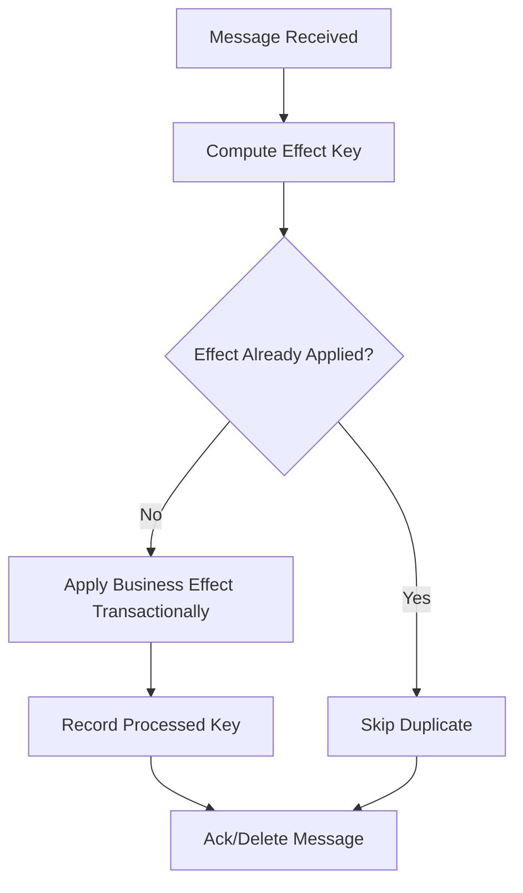
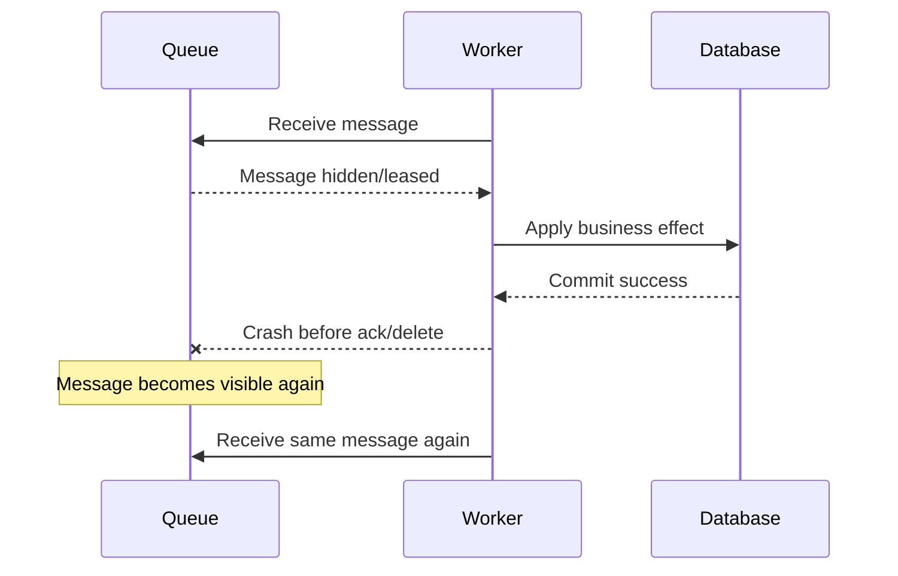
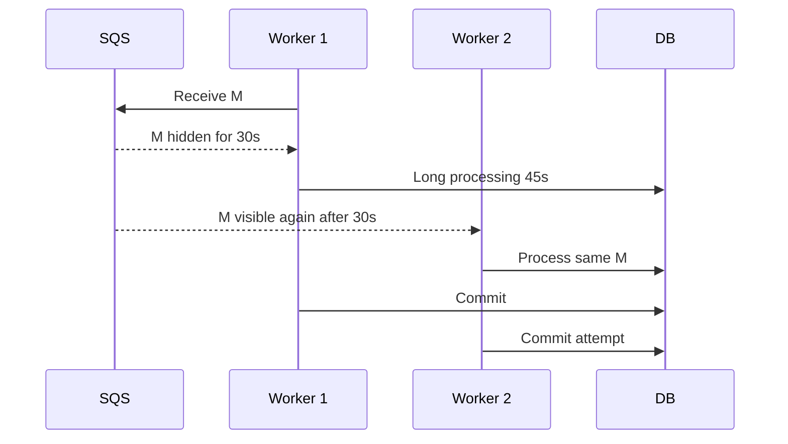
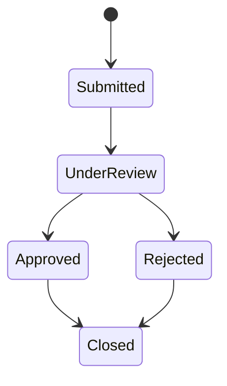
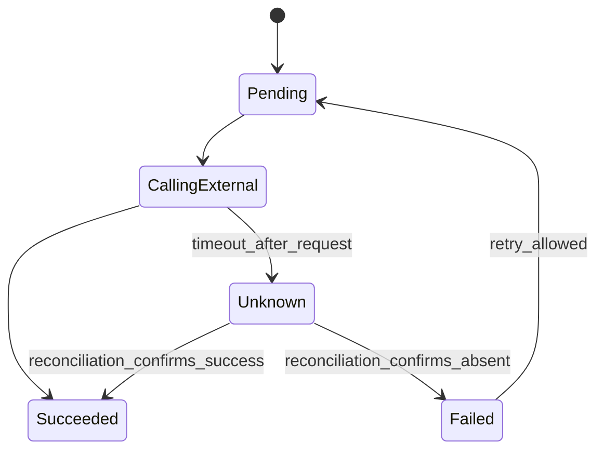

# Part 014 — Delivery Semantics: At-Most-Once, At-Least-Once, Effectively-Once

> Tujuan bagian ini: memahami apa arti delivery semantics di production, terutama ketika memakai SQS, SNS, EventBridge, Lambda/worker, database transaction, outbox, dan external side effects. Target akhirnya bukan menghafal istilah “exactly once”, tetapi mampu membangun sistem yang benar walaupun pesan duplicate, retry terjadi, ack hilang, event telat, dan replay dijalankan.

Distributed system tidak gagal dengan cara yang sopan.

Ia gagal di antara dua baris kode:

```txt
1. Efek bisnis sudah terjadi.
2. Acknowledgement belum tercatat.
```

Ia gagal ketika:

```txt
- database commit berhasil, response ke client timeout,
- worker memproses pesan, lalu crash sebelum delete message,
- EventBridge gagal deliver target dan retry,
- SNS berhasil ke satu subscriber tetapi gagal ke subscriber lain,
- SQS visibility timeout habis saat consumer masih bekerja,
- Lambda berhasil menjalankan sebagian batch lalu error,
- DLQ di-redrive dan side effect lama terjadi lagi,
- operator replay event untuk recovery tetapi consumer tidak replay-safe.
```

Delivery semantics bukan teori. Ia menentukan apakah uang tertagih dua kali, email hukum terkirim dua kali, case dieskalasi ganda, inventory negatif, atau audit trail rusak.

---

## 1. Tiga Istilah yang Sering Disalahpahami

### At-Most-Once

```txt
Pesan diproses nol atau satu kali.
Tidak ada duplicate, tetapi pesan boleh hilang.
```

Cocok untuk:

- metric non-kritis,
- telemetry sampling,
- update ephemeral,
- best-effort notification yang boleh hilang.

Tidak cocok untuk:

- pembayaran,
- order,
- lifecycle case,
- legal notice,
- inventory reservation,
- audit event.

### At-Least-Once

```txt
Pesan diproses satu kali atau lebih.
Tidak boleh hilang secara normal, tetapi duplicate mungkin terjadi.
```

Ini default mental model untuk banyak sistem messaging durable.

Konsekuensi:

```txt
Consumer harus idempotent.
Efek samping harus aman terhadap duplicate.
Ordering tidak boleh diasumsikan kecuali service/konfigurasi menjaminnya dalam scope tertentu.
```

### Exactly-Once

```txt
Pesan diproses tepat satu kali.
```

Istilah ini berbahaya karena sering hanya berlaku pada scope sempit:

- producer deduplication,
- broker internal write,
- stream processing transaction,
- dedup window tertentu,
- partition tertentu,
- bukan seluruh business side effect end-to-end.

Dalam sistem aplikasi umum, target yang realistis adalah:

```txt
Effectively-once business effect.
```

---

## 2. Effectively-Once: Target yang Benar

Effectively-once berarti:

```txt
Transport boleh mengirim duplicate.
Worker boleh retry.
Ack boleh hilang.
Replay boleh terjadi.
Tetapi efek bisnis final terjadi satu kali secara observable.
```

Caranya bukan berharap broker sempurna.

Caranya:

```txt
- idempotency key
- conditional write / unique constraint
- transactional state change
- processed-message/inbox record
- ack setelah commit
- monotonic version
- replay-safe side effect
- reconciliation job
```

Diagram:



Targetnya bukan “pesan hanya datang sekali”. Targetnya “efek bisnis tidak berganda”.

---

## 3. Receive-Process-Ack Gap

Semua queue consumer punya gap ini:



Kalau worker tidak idempotent, efek terjadi dua kali.

Ini alasan utama mengapa at-least-once delivery harus dipasangkan dengan idempotent consumer.

---

## 4. SQS Standard Queue Semantics

SQS Standard Queue dirancang untuk throughput tinggi dan at-least-once delivery. Dalam arsitektur terdistribusi, duplicate bisa terjadi, dan ordering tidak boleh dianggap strict global.

Mental model:

```txt
SQS Standard:
  - durable queue
  - highly scalable
  - at-least-once delivery
  - duplicate possible
  - best-effort ordering
```

Implikasi desain:

```txt
Jangan menaruh correctness pada asumsi message hanya datang sekali.
Jangan menaruh correctness pada asumsi ordering global.
Jangan menghapus pesan sebelum efek bisnis commit.
```

Consumer harus:

```txt
- idempotent
- punya visibility timeout sesuai processing time
- punya DLQ untuk poison message
- punya retry limit
- punya metric ApproximateAgeOfOldestMessage/backlog
```

---

## 5. SQS FIFO Queue Semantics

SQS FIFO Queue memberi ordering dalam message group dan deduplication dalam scope tertentu.

Mental model:

```txt
SQS FIFO:
  - ordering per MessageGroupId
  - deduplication via MessageDeduplicationId atau content-based dedup
  - dedup window terbatas
  - throughput dipengaruhi group cardinality
```

FIFO membantu, tetapi tidak menghapus kebutuhan idempotency aplikasi.

Kenapa?

```txt
- deduplication window terbatas
- consumer bisa crash setelah efek commit sebelum delete
- side effect eksternal bisa retry di luar FIFO
- redrive dari DLQ bisa mengulang pesan lama
- business duplicate bisa punya payload berbeda tetapi efek sama
```

Rule:

```txt
FIFO membantu ordering dan producer-side duplicate.
Effectively-once tetap tugas aplikasi.
```

---

## 6. Visibility Timeout Bukan Lock Permanen

Visibility timeout adalah masa ketika pesan yang diterima consumer disembunyikan dari consumer lain.

Jika processing melebihi timeout:

```txt
Pesan bisa muncul lagi.
Consumer lain bisa memprosesnya bersamaan.
```

Ini failure yang sering diremehkan.



Tanpa idempotency/lock/conditional write, duplicate concurrent effect bisa terjadi.

Praktik:

```txt
- set visibility timeout lebih besar dari p99 processing time
- extend visibility timeout untuk job panjang
- gunakan heartbeat/progress bila perlu
- batasi concurrency per key jika ordering penting
- gunakan conditional write untuk mencegah duplicate commit
```

---

## 7. EventBridge Delivery and Retry Semantics

EventBridge adalah event bus serverless untuk menghubungkan komponen melalui event. Target delivery bisa gagal. EventBridge mendukung retry policy dan DLQ untuk event yang tidak bisa dikirim ke target.

Mental model:

```txt
EventBridge tidak berarti target pasti sukses.
EventBridge berarti event bisa dirutekan dan delivery dicoba sesuai policy.
Jika retry habis dan tidak ada DLQ, event bisa drop untuk target tersebut.
```

Implikasi:

```txt
Setiap target penting harus punya failure strategy.
Gunakan DLQ untuk target delivery failure.
Consumer tetap harus idempotent.
Replay/archive harus diperlakukan sebagai duplicate/reprocessing.
```

EventBridge cocok untuk routing fact, tetapi bukan pengganti state machine untuk proses kritis yang membutuhkan progress eksplisit.

---

## 8. SNS Delivery and DLQ Semantics

SNS adalah pub/sub fanout. Setiap subscription punya delivery behavior sendiri.

Risiko:

```txt
Publisher berhasil publish ke topic.
Subscriber A menerima.
Subscriber B gagal.
Subscriber C throttled.
```

Jika konsekuensi penting, jangan hanya berpikir “SNS publish sukses”. Pikirkan per subscription:

```txt
- retry policy
- DLQ
- endpoint health
- backpressure
- duplicate delivery
- subscription filter correctness
```

Pola sehat untuk workload penting:

```txt
SNS Topic -> SQS Queue per consumer -> Worker
```

Dengan queue per consumer, masing-masing consumer punya retry, DLQ, backlog, dan redrive boundary sendiri.

---

## 9. Lambda Batch Semantics dengan Queue/Stream

Ketika Lambda memproses batch dari SQS/stream, failure satu record bisa memengaruhi batch.

Masalah umum:

```txt
Batch berisi 10 pesan.
9 berhasil diproses.
1 gagal.
Function mengembalikan error.
Seluruh batch bisa diproses ulang jika partial batch response tidak dipakai/dikonfigurasi.
```

Konsekuensi:

```txt
9 pesan yang sudah berhasil harus idempotent terhadap retry.
```

Praktik:

```txt
- gunakan partial batch failure response bila cocok
- idempotency tetap wajib
- jangan proses side effect irreversible tanpa record effect key
- log per record, bukan hanya per batch
- metric failure per event type/reason
```

Batch meningkatkan throughput, tetapi memperbesar blast radius duplicate jika desain consumer lemah.

---

## 10. Database Transaction sebagai Boundary Efek

Efek bisnis yang penting harus diputuskan di boundary transactional.

Contoh dengan relational DB:

```sql
BEGIN;

INSERT INTO processed_messages(message_id, consumer_name, processed_at)
VALUES (:message_id, :consumer_name, now())
ON CONFLICT DO NOTHING;

-- hanya lanjut jika insert berhasil
UPDATE cases
SET status = 'ESCALATED', version = version + 1
WHERE case_id = :case_id
  AND status = 'SUBMITTED';

COMMIT;
```

Lebih baik gunakan constraint:

```sql
CREATE UNIQUE INDEX uq_processed_message
ON processed_messages(consumer_name, message_id);
```

Dengan DynamoDB:

```txt
PutItem processedKey with condition attribute_not_exists(pk)
TransactWriteItems:
  - condition/put processed key
  - update domain item conditionally
```

Kuncinya:

```txt
Cek duplicate dan apply effect harus atomic atau setidaknya race-safe.
```

---

## 11. Idempotency Key: Scope Lebih Penting dari Bentuk

Idempotency key buruk:

```txt
caseId
```

Kenapa buruk?

Karena satu case bisa punya banyak command/event berbeda.

Lebih baik:

```txt
command:approve-case:case-C-1001:actor-user-912:client-request-abc
consumer:notification:case-approved:C-1001:version-18:template-v3
projection:worklist:case-approved:C-1001:version-18
```

Idempotency key harus menjawab:

```txt
Efek apa yang tidak boleh terjadi dua kali?
Dalam scope siapa?
Untuk versi/fakta mana?
```

Jika scope terlalu luas, efek valid akan ditolak.
Jika scope terlalu sempit, duplicate lolos.

---

## 12. Deduplication Tidak Sama dengan Idempotency

Deduplication:

```txt
Mendeteksi input sama dalam window/scope tertentu dan membuang duplicate.
```

Idempotency:

```txt
Menjamin efek akhir sama walaupun operasi dipanggil berulang.
```

Contoh:

```txt
Dua pesan berbeda:
  evt-1 CaseApproved case=C-1001 version=18
  evt-2 CaseApproved case=C-1001 version=18
```

Message ID berbeda, tetapi business effect sama.

Dedup by messageId tidak cukup. Kamu butuh effect key:

```txt
email-case-approved:C-1001:v18:recipient-x
```

Sebaliknya, pesan sama bisa diproses ulang untuk rebuild projection. Dalam mode rebuild, kamu mungkin ingin re-apply secara deterministic.

---

## 13. Ordering: Global Ordering Hampir Selalu Salah Asumsi

Pertanyaan yang benar bukan:

```txt
Apakah sistem menjamin ordering?
```

Pertanyaan yang benar:

```txt
Ordering untuk key apa?
Dalam partition/message group apa?
Untuk producer mana?
Dalam window berapa?
Apa yang terjadi saat retry/redrive/replay?
```

Contoh event:

```txt
CaseSubmitted v1
CaseAssigned v2
CaseApproved v3
```

Projection menerima:

```txt
CaseApproved v3 dulu
CaseAssigned v2 kemudian
```

Projection harus punya guard:

```txt
if incomingVersion <= currentVersion:
    ignore or route to reconciliation
```

Jangan mengandalkan waktu kedatangan sebagai urutan domain.

Gunakan:

```txt
- aggregate version
- sequence number per aggregate
- occurredAt untuk informasi, bukan satu-satunya ordering guard
- conditional update currentVersion < incomingVersion
```

---

## 14. Monotonic State Machine

Untuk lifecycle, buat transition monotonic.



Consumer projection bisa menjaga state dengan rule:

```txt
- event version lebih lama: ignore
- transition tidak dikenal: quarantine
- transition mundur: reject/reconcile
- duplicate version: idempotent no-op
```

Contoh pseudo-code:

```java
void apply(CaseApproved event) {
    readModel.updateIf(
        key = event.caseId(),
        condition = current.version < event.caseVersion(),
        update = setStatus("APPROVED", event.caseVersion())
    );
}
```

---

## 15. Ack Setelah Commit

Rule dasar consumer:

```txt
Ack/delete message hanya setelah efek yang diperlukan berhasil commit.
```

Buruk:

```txt
receive message
ack/delete message
process database update
```

Jika database update gagal setelah ack, pesan hilang.

Lebih baik:

```txt
receive message
process database update transactionally
commit
ack/delete message
```

Ini membuka kemungkinan duplicate jika crash setelah commit sebelum ack. Itulah alasan idempotency wajib.

Trade-off:

```txt
Ack before commit -> risiko lost effect.
Ack after commit  -> risiko duplicate delivery.
```

Untuk efek penting, pilih duplicate yang bisa dibuat aman, bukan kehilangan fakta.

---

## 16. External Side Effect Paling Sulit

Database bisa diberi unique constraint. External system belum tentu.

Contoh side effect:

```txt
- charge payment
- send legal notice
- send email/SMS
- create ticket in third-party system
- call regulator gateway
- issue certificate
```

Strategi:

```txt
1. Gunakan idempotency key di external API jika tersedia.
2. Simpan local effect record sebelum/sesudah call dengan state machine.
3. Jangan replay otomatis side effect irreversible tanpa guard.
4. Pisahkan “decision event” dari “side effect command”.
5. Buat reconciliation terhadap external system.
```

State machine lokal:



Status `Unknown` penting. Timeout setelah request bukan berarti gagal.

---

## 17. Ambiguous Commit Problem

Kasus klasik:

```txt
Worker memanggil payment provider.
Request timeout.
Tidak tahu apakah payment provider berhasil charge atau tidak.
```

Jangan langsung retry buta.

Gunakan:

```txt
- external idempotency key
- query status by idempotency key/reference
- local effect record status UNKNOWN
- reconciliation worker
- bounded retry
```

Pseudo-flow:

```txt
if localEffect.status == SUCCEEDED:
  no-op
if localEffect.status == UNKNOWN:
  query external by reference
if external says succeeded:
  mark SUCCEEDED
if external says absent and retry budget remains:
  retry with same idempotency key
```

Ini jauh lebih aman daripada “catch timeout lalu retry dengan request baru”.

---

## 18. Replay Safety

Replay adalah bagian dari operasi production:

```txt
- rebuild projection
- recover failed consumer
- backfill data
- fix bug
- restore after outage
- redrive DLQ
```

Replay berbahaya jika consumer mencampur projection update dan irreversible side effect.

Buruk:

```txt
on CaseApproved:
  update read model
  send approval email
```

Saat replay untuk rebuild read model, email terkirim lagi.

Lebih baik pisahkan consumer:

```txt
CaseApproved -> WorklistProjectionConsumer
CaseApproved -> NotificationCommandConsumer
```

Dan notification consumer punya effect key:

```txt
notification:case-approved:C-1001:v18:recipient-x
```

Untuk replay projection, nonaktifkan side-effect consumer atau gunakan replay mode eksplisit.

---

## 19. DLQ Bukan Tempat Sampah

DLQ adalah quarantine.

Pesan masuk DLQ karena:

```txt
- poison message/schema invalid
- dependency down terlalu lama
- bug consumer
- authorization/config error
- payload melanggar invariant
- external service selalu gagal
```

DLQ harus punya workflow:

```txt
1. Detect.
2. Classify.
3. Fix root cause.
4. Decide: redrive, transform, skip, compensate.
5. Audit decision.
```

Jangan redrive DLQ massal tanpa:

```txt
- idempotency check
- rate limit
- ordering consideration
- downstream capacity check
- replay side effect policy
```

DLQ yang tidak dimonitor sama dengan data loss tertunda.

---

## 20. Poison Message Handling

Poison message adalah pesan yang selalu gagal diproses.

Penyebab:

```txt
- schema tidak kompatibel
- required entity tidak ada
- invalid state transition
- data corruption
- consumer bug
- dependency selalu menolak
```

Consumer tidak boleh retry selamanya dengan kecepatan tinggi.

Strategi:

```txt
- bounded retry
- exponential backoff bila relevan
- DLQ setelah threshold
- classify permanent vs transient failure
- include failure reason metadata
- create repair tooling
```

Pseudo-code:

```java
try {
    process(message);
    ack(message);
} catch (PermanentSchemaException e) {
    sendToQuarantine(message, e);
    ack(message);
} catch (TransientDependencyException e) {
    throw e; // let queue retry / visibility timeout
}
```

Tidak semua error layak retry.

---

## 21. Retry Policy: Retry Bisa Menjadi Serangan ke Sistem Sendiri

Retry tanpa kontrol memperbesar outage.

Risiko:

```txt
- dependency sedang down
- semua client retry bersamaan
- queue backlog naik
- worker autoscale agresif
- database connection habis
- DLQ meledak
```

Praktik:

```txt
- exponential backoff
- jitter
- max attempts
- retry budget
- circuit breaker untuk sync call
- backpressure
- idempotency before retry
```

Rule:

```txt
Retry hanya aman jika operasi idempotent dan dependency punya kapasitas menerima retry.
```

---

## 22. Delivery Semantics per AWS Primitive

| Primitive | Mental Model Delivery | Desain Aplikasi yang Dibutuhkan |
|---|---|---|
| API Gateway request | client bisa timeout/retry | idempotent mutating API |
| SQS Standard | at-least-once, duplicate possible | idempotent consumer, no global ordering assumption |
| SQS FIFO | ordering per group, dedup window | idempotency tetap, group cardinality design |
| SNS | pub/sub delivery per subscription | subscription DLQ, duplicate-safe consumer |
| EventBridge | event routing with retry/DLQ options | target idempotency, archive/replay safety |
| Step Functions | durable workflow state | task idempotency, retry/catch/timeout design |
| DynamoDB Streams | change stream from table | consumer idempotency, ordering scope awareness |
| Outbox relay | publish retry possible | event idempotency, relay dedup/marking |
| External API | unknown after timeout | idempotency token, reconciliation |

Tidak ada baris yang mengatakan “tidak perlu idempotency”.

---

## 23. Inbox Pattern untuk Consumer

Inbox pattern menyimpan pesan yang sudah diproses oleh consumer.

Relational example:

```sql
CREATE TABLE consumer_inbox (
  consumer_name text NOT NULL,
  message_id text NOT NULL,
  effect_key text NOT NULL,
  processed_at timestamptz NOT NULL DEFAULT now(),
  result jsonb,
  PRIMARY KEY (consumer_name, effect_key)
);
```

Flow:

```txt
1. receive message
2. derive effect_key
3. begin transaction
4. insert inbox row; if conflict -> duplicate, no-op
5. apply business effect
6. commit
7. ack/delete message
```

DynamoDB version:

```txt
PK = CONSUMER#notification-service
SK = EFFECT#case-approved#C-1001#v18#recipient-x
ConditionExpression = attribute_not_exists(PK)
```

Inbox tidak harus disimpan selamanya untuk semua efek. Retensi tergantung replay horizon dan audit requirement.

---

## 24. Outbox Relay Idempotency

Relay juga bisa duplicate.

Kasus:

```txt
Relay publish event ke EventBridge berhasil.
Relay crash sebelum mark outbox row as published.
Relay restart dan publish event yang sama lagi.
```

Solusi:

```txt
- eventId stabil dari outbox row
- consumer dedupe by eventId/effectKey
- relay mark published best-effort
- monitoring unpublished age
```

Jangan menganggap outbox relay menjamin event tidak duplicate. Ia menjamin event tidak hilang setelah commit, dengan konsekuensi duplicate possible.

---

## 25. Redrive Semantics

Redrive berarti mengirim ulang pesan dari DLQ/source untuk diproses ulang.

Sebelum redrive, tanyakan:

```txt
Apakah root cause sudah diperbaiki?
Apakah consumer idempotent?
Apakah pesan masih valid menurut schema/current domain state?
Apakah ordering penting?
Apakah downstream punya kapasitas?
Apakah external side effect aman?
Apakah ada pesan yang harus di-skip/transform?
```

Redrive yang baik dilakukan bertahap:

```txt
- sample kecil
- monitor error/latency/backlog
- rate limit
- pause jika DLQ baru naik
- audit jumlah sukses/gagal/skipped
```

---

## 26. Reconciliation: Safety Net untuk Semua Semantics

Tidak ada desain messaging yang sempurna tanpa reconciliation.

Reconciliation job mencari mismatch antara source of truth dan derived state/effect.

Contoh:

```txt
Source of truth: case status APPROVED.
Expected projection: worklist no longer contains case.
Expected notification: approval notification sent once.
Expected task: follow-up task exists if risk HIGH.
```

Query reconciliation:

```txt
Find cases approved in last 24h where:
  - no CaseApproved event published, or
  - worklist still contains case, or
  - notification effect missing, or
  - high-risk follow-up task missing.
```

Reconciliation mengubah recovery dari “semoga benar” menjadi “bisa dibuktikan dan diperbaiki”.

---

## 27. Operational Metrics

Minimum metrics untuk delivery semantics:

```txt
queue_visible_messages{queue}
queue_oldest_message_age_seconds{queue}
queue_inflight_messages{queue}
dlq_messages{queue}
consumer_success_total{consumer,eventType}
consumer_failure_total{consumer,eventType,reason}
consumer_duplicate_total{consumer,eventType}
consumer_processing_latency_ms{consumer,eventType}
consumer_visibility_timeout_extension_total{consumer}
outbox_unpublished_count
outbox_oldest_unpublished_age_seconds
eventbridge_failed_invocations{rule,target}
eventbridge_dlq_messages{target}
redrive_attempt_total{queue}
reconciliation_mismatch_total{type}
```

Alarm penting:

```txt
- DLQ > 0 untuk critical queue
- oldest message age melewati SLA
- outbox unpublished age naik
- duplicate rate mendadak naik
- failure reason baru muncul
- reconciliation mismatch non-zero
```

Metric tanpa runbook hanya dashboard hiasan.

---

## 28. Logging Fields

Setiap log consumer minimal membawa:

```txt
messageId
eventId
effectKey
consumerName
eventType
aggregateId
aggregateVersion
correlationId
causationId
attemptNumber jika tersedia
queueName/source
decision: applied | duplicate | skipped | failed | quarantined
failureReason
```

Log yang buruk:

```txt
Failed to process message
```

Log yang baik:

```json
{
  "level": "WARN",
  "message": "duplicate event ignored",
  "consumerName": "worklist-projector",
  "eventType": "CaseApproved",
  "eventId": "evt-88f",
  "effectKey": "worklist:case:C-1001:v18",
  "caseId": "C-1001",
  "caseVersion": 18,
  "correlationId": "corr-abc"
}
```

---

## 29. Testing Matrix

| Failure | Expected Safe Behavior |
|---|---|
| Worker crash after DB commit before ack | message retried, consumer detects duplicate/no-op |
| Worker crash before DB commit | message retried, effect applied once |
| Visibility timeout too short | concurrent duplicate does not double-commit |
| SQS duplicate delivery | no duplicate business effect |
| EventBridge target retry | target idempotent |
| SNS subscriber receives duplicate | subscriber idempotent |
| Outbox relay publishes same event twice | consumers dedupe/effect-key no-op |
| DLQ redrive | already-applied effects skipped |
| Event replay for projection | no irreversible side effect triggered |
| Out-of-order event | stale version ignored/quarantined |
| External API timeout after request | local status UNKNOWN and reconciliation, not blind duplicate |
| Schema incompatible event | quarantine/DLQ with reason, no infinite retry |
| Dependency down | bounded retry/backoff, backlog visible |
| Batch partial failure | successful records not double-effected on retry |

---

## 30. Design Recipes

### Recipe A: Queue-to-Database Worker

```txt
SQS -> Worker -> DB
```

Rules:

```txt
- receive message
- derive effect key
- transactionally insert effect key + apply update
- commit
- delete message
- DLQ after bounded attempts
```

### Recipe B: Outbox-to-EventBridge

```txt
Command transaction -> outbox row -> relay -> EventBridge
```

Rules:

```txt
- stable eventId in outbox
- publish retry with backoff
- mark published after PutEvents success
- monitor oldest unpublished row
- consumers idempotent
```

### Recipe C: Event-to-Projection

```txt
EventBridge/SQS -> Projector -> Read Model
```

Rules:

```txt
- projection update conditional on version
- duplicate event no-op
- replay mode supported
- freshness metric exposed
```

### Recipe D: Event-to-External Side Effect

```txt
Event -> SideEffectCommand -> Worker -> External API
```

Rules:

```txt
- local effect record
- external idempotency token
- UNKNOWN state for timeout
- reconciliation job
- no mass replay without side-effect guard
```

---

## 31. Common Bad Designs

### Bad Design 1: Delete Before Process

```txt
receive SQS
immediately delete
then update DB
```

Risk: lost effect.

### Bad Design 2: Process Without Effect Key

```txt
receive event
send email
```

Risk: duplicate email on retry/replay.

### Bad Design 3: Trust FIFO as Complete Exactly-Once

```txt
FIFO queue means no idempotency needed
```

Risk: crash/redrive/external duplicate.

### Bad Design 4: Retry Timeout with New External Reference

```txt
payment timeout -> retry with new idempotency key
```

Risk: double charge.

### Bad Design 5: DLQ Redrive Without Root Cause

```txt
DLQ has 100k messages -> redrive all
```

Risk: outage loop, duplicate effects, downstream overload.

---

## 32. Checklist untuk Review Desain

Sebelum production, jawab:

```txt
Apa delivery semantics primitive yang dipakai?
Duplicate bisa muncul dari mana?
Apa idempotency key command?
Apa effect key consumer?
Apakah duplicate check atomic dengan effect?
Kapan message di-ack/delete?
Apa yang terjadi jika worker crash setelah commit?
Apa yang terjadi jika visibility timeout habis?
Apa yang terjadi jika event out-of-order?
Apa yang terjadi jika external API timeout?
Apa yang masuk DLQ?
Siapa owner DLQ?
Bagaimana redrive dilakukan?
Bagaimana replay projection dilakukan tanpa side effect?
Apa reconciliation job-nya?
Metric dan alarm apa yang membuktikan pipeline sehat?
```

Kalau jawaban masih “broker menjamin exactly once”, desain belum cukup.

---

## 33. Ringkasan Mental Model

Delivery semantics adalah kontrak antara transport dan aplikasi.

```txt
At-most-once:
  duplicate tidak ada, tetapi loss mungkin.

At-least-once:
  loss diminimalkan, duplicate mungkin.

Exactly-once:
  biasanya hanya scope sempit, jangan diasumsikan end-to-end.

Effectively-once:
  efek bisnis final satu kali karena aplikasi didesain idempotent.
```

Rule paling penting:

```txt
Untuk efek penting, lebih baik menerima duplicate delivery yang aman
daripada kehilangan pesan yang tidak bisa dipulihkan.
```

Dan rule operasionalnya:

```txt
Duplicate adalah kondisi normal.
Retry adalah kondisi normal.
Replay adalah kondisi normal.
DLQ adalah workflow, bukan tempat sampah.
Reconciliation adalah safety net, bukan nice-to-have.
```

---

## Referensi

- AWS Documentation — Amazon SQS at-least-once delivery: https://docs.aws.amazon.com/AWSSimpleQueueService/latest/SQSDeveloperGuide/standard-queues-at-least-once-delivery.html
- AWS Documentation — Amazon SQS standard queues: https://docs.aws.amazon.com/AWSSimpleQueueService/latest/SQSDeveloperGuide/standard-queues.html
- AWS Documentation — Amazon SQS FIFO exactly-once processing / deduplication: https://docs.aws.amazon.com/AWSSimpleQueueService/latest/SQSDeveloperGuide/FIFO-queues-exactly-once-processing.html
- AWS Documentation — Using MessageDeduplicationId in Amazon SQS: https://docs.aws.amazon.com/AWSSimpleQueueService/latest/SQSDeveloperGuide/using-messagededuplicationid-property.html
- AWS Documentation — Amazon SQS visibility timeout: https://docs.aws.amazon.com/AWSSimpleQueueService/latest/SQSDeveloperGuide/sqs-visibility-timeout.html
- AWS Documentation — EventBridge retry policy: https://docs.aws.amazon.com/eventbridge/latest/userguide/eb-rule-retry-policy.html
- AWS Documentation — EventBridge dead-letter queues: https://docs.aws.amazon.com/eventbridge/latest/userguide/eb-rule-dlq.html
- AWS Documentation — Amazon SNS dead-letter queues: https://docs.aws.amazon.com/sns/latest/dg/sns-dead-letter-queues.html
- AWS Well-Architected Reliability Pillar — Make mutating operations idempotent: https://docs.aws.amazon.com/wellarchitected/latest/reliability-pillar/rel_prevent_interaction_failure_idempotent.html
- AWS Well-Architected Reliability Pillar — Control and limit retry calls: https://docs.aws.amazon.com/wellarchitected/latest/reliability-pillar/rel_mitigate_interaction_failure_limit_retries.html
- Amazon Builders' Library — Making retries safe with idempotent APIs: https://aws.amazon.com/builders-library/making-retries-safe-with-idempotent-APIs/
