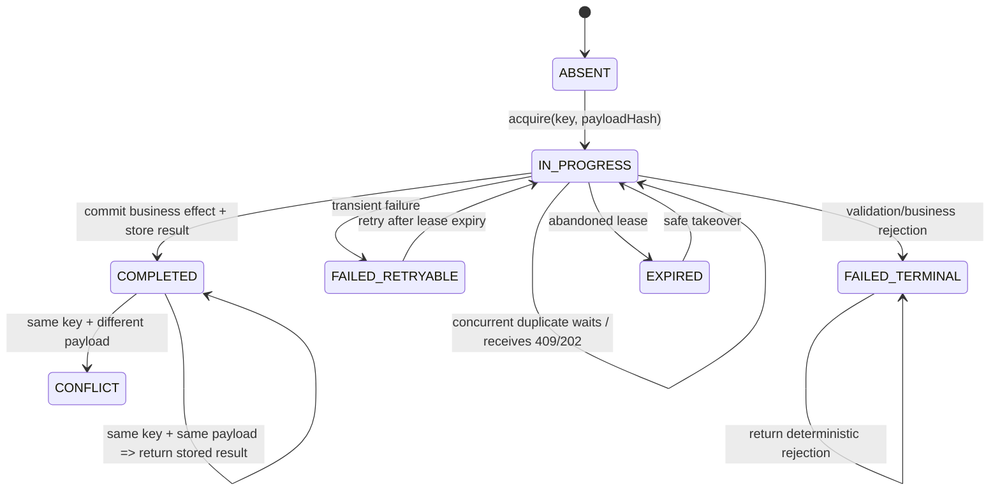
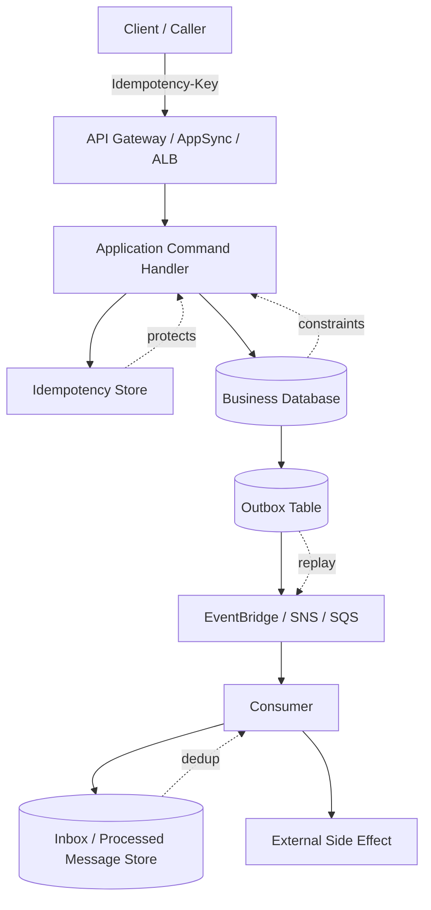
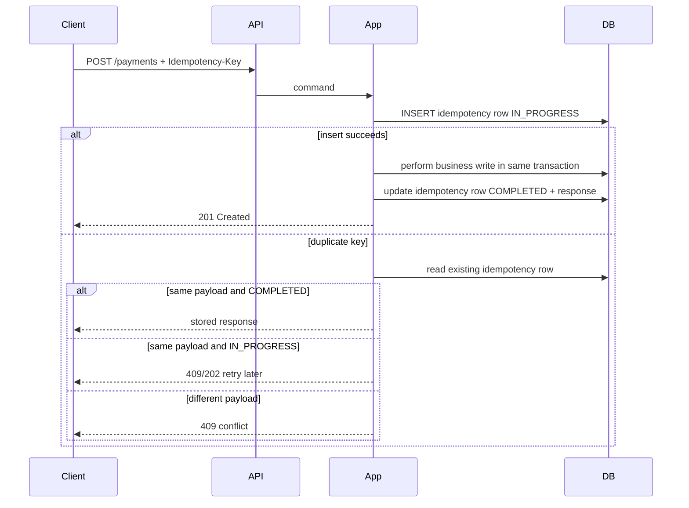
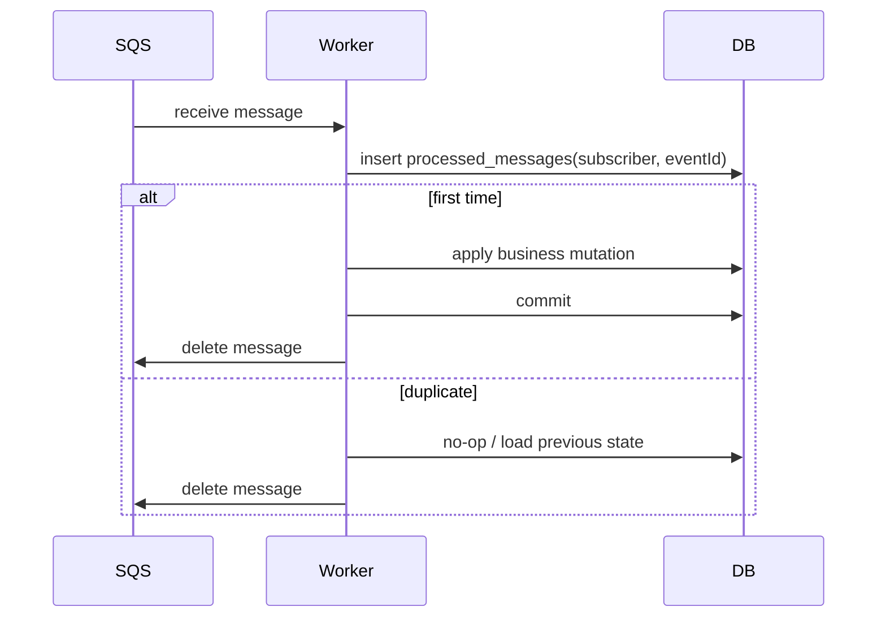

# Part 015 — Idempotency, Deduplication, Replay, and Deterministic Side Effects

> Tujuan bagian ini: membangun mental model dan implementasi praktis agar command, message, workflow, dan event replay bisa aman dijalankan berkali-kali tanpa menghasilkan state bisnis yang salah. Fokusnya bukan sekadar menambahkan `Idempotency-Key`, tetapi merancang state machine idempotency yang tahan race condition, timeout ambiguity, duplicate delivery, dan replay operasional.

Di sistem sederhana, developer sering berpikir seperti ini:

```txt
request masuk -> handler jalan -> database commit -> response sukses
```

Di production, urutannya lebih jahat:

```txt
request masuk -> handler jalan -> database commit sukses -> response timeout
client retry -> handler jalan lagi -> side effect terjadi dua kali
```

Atau:

```txt
SQS message diterima -> worker update database -> worker crash sebelum delete message
visibility timeout habis -> message muncul lagi -> worker lain memproses ulang
```

Atau:

```txt
operator replay event untuk recovery -> consumer tidak replay-safe -> invoice diterbitkan ulang
```

Maka prinsipnya:

```txt
Every non-trivial distributed operation must be safe under retry.
Every async consumer must be safe under duplicate delivery.
Every recovery mechanism must be safe under replay.
```

Idempotency bukan fitur tambahan. Ia adalah bagian dari correctness model.

---

## 1. Definisi yang Tepat

### Idempotency

Operasi idempotent berarti menjalankan operasi yang sama lebih dari sekali menghasilkan outcome bisnis yang sama seperti menjalankannya sekali.

```txt
f(f(x)) = f(x)
```

Tetapi dalam aplikasi bisnis, yang penting bukan persamaan matematis murni. Yang penting adalah:

```txt
same business command + same identity + same payload meaning
= same durable outcome
```

Contoh:

```txt
CreatePayment(commandId=abc, amount=100000, account=A)
```

Jika command yang sama dikirim dua kali, sistem tidak boleh membuat dua payment.

### Deduplication

Deduplication adalah mekanisme mendeteksi duplicate input.

```txt
same message id pernah diproses? skip
same idempotency key pernah selesai? return stored response
same event id pernah diterima oleh subscriber ini? no-op
```

Deduplication membantu idempotency, tetapi bukan idempotency itu sendiri.

SQS FIFO misalnya menyediakan deduplication window untuk mencegah duplicate message dalam interval tertentu. Itu berguna, tetapi tidak menggantikan idempotent consumer karena duplicate tetap bisa datang dari sumber lain, replay manual, bug producer, redrive DLQ, atau operasi bisnis yang identitasnya lebih panjang dari deduplication window.

### Replay

Replay adalah menjalankan ulang input lama secara sengaja.

```txt
- replay EventBridge archive,
- redrive DLQ,
- reprocess SQS messages,
- rebuild read model,
- rerun migration batch,
- rerun workflow compensation,
- reload CDC stream.
```

Replay-safe berarti sistem boleh menerima input lama tanpa merusak state saat ini.

---

## 2. Mental Model: Idempotency sebagai State Machine

Idempotency yang benar bukan `if key exists then return`. Ia state machine kecil.



State minimal:

```txt
ABSENT          belum pernah terlihat
IN_PROGRESS     ada eksekusi sedang berjalan
COMPLETED       efek bisnis sudah durable
FAILED_RETRYABLE gagal sementara, boleh dicoba ulang
FAILED_TERMINAL  gagal validasi/bisnis, hasil final
EXPIRED         lock/lease lama dianggap mati
CONFLICT        key sama tetapi payload berbeda
```

Inilah alasan idempotency perlu menyimpan lebih dari sekadar key.

Ia perlu menyimpan:

```txt
idempotency_key
payload_hash
status
response_snapshot atau result_reference
lock_owner
locked_until
created_at
updated_at
expires_at
attempt_count
business_entity_id
failure_code
```

Tanpa `payload_hash`, key yang sama bisa dipakai untuk payload berbeda.
Tanpa `status`, duplicate concurrent tidak bisa dibedakan dari retry setelah sukses.
Tanpa `expires_at`, tabel idempotency tumbuh tanpa batas.
Tanpa `business_entity_id`, reconciliation sulit.

---

## 3. Layer Idempotency dalam Sistem AWS

Idempotency sebaiknya tidak bergantung pada satu layer saja.



Lima layer utama:

| Layer | Tujuan | Contoh AWS/Implementasi |
|---|---|---|
| Client idempotency key | Caller bisa retry command yang sama | `Idempotency-Key` header, command id |
| Application idempotency store | Handler tahu command sedang/sudah diproses | DynamoDB table, RDS table, Lambda Powertools |
| Database invariant | Mencegah duplicate walaupun aplikasi bug | unique constraint, conditional write, optimistic version |
| Inbox/outbox | Message/event processing dan publish replay-safe | RDS outbox, DynamoDB streams, processed_message table |
| External side-effect key | Call ke sistem luar tidak double-effect | external idempotency key, provider reference, send log |

Arsitektur matang biasanya memakai kombinasi minimal:

```txt
API command: Idempotency-Key + DB unique invariant + outbox
Queue consumer: inbox/dedup table + idempotent write
Event projection: event id + projection version/checkpoint
External call: command id as external idempotency key + side_effect_log
```

---

## 4. Idempotency Key yang Baik

Idempotency key bukan random UUID yang dibuat ulang setiap retry. Ia harus mewakili identitas command yang sama.

### Key yang Baik

```txt
tenantId + commandType + clientCommandId
tenantId + aggregateId + operationType + operationId
caseId + transitionId
paymentIntentId
orderId + submitAttemptId
fileId + processingVersion
```

Contoh:

```txt
tenant-123:CreatePayment:cmd-9f8a
case-456:Escalate:v3:approval-789
invoice-2026-001:SendNotice:notice-v1
```

### Key yang Buruk

```txt
current timestamp
random UUID baru setiap retry
hash seluruh request termasuk field volatile
user id saja
aggregate id saja
message receipt handle SQS
```

Kenapa buruk?

```txt
timestamp/random baru -> retry tidak dikenali
hash volatile -> traceId berubah dianggap command baru
user id saja -> semua operasi user saling konflik
aggregate id saja -> create order dan cancel order dianggap sama
receipt handle -> berubah setiap receive, tidak stabil
```

### Payload Hash

Key harus disertai payload hash untuk mencegah misuse.

```txt
same key + same payload hash      => retry valid
same key + different payload hash => conflict
```

Hash sebaiknya dihitung dari canonical payload, bukan raw JSON string yang sensitif urutan field.

```java
// Pseudocode: canonicalize before hashing
String canonical = canonicalJson(Map.of(
    "tenantId", request.tenantId(),
    "amount", request.amount(),
    "currency", request.currency(),
    "targetAccount", request.targetAccount()
));
String payloadHash = sha256(canonical);
```

Jangan masukkan field ini ke hash:

```txt
traceId
requestId
timestamp client
signature
retry count
non-deterministic metadata
```

Masukkan field yang mengubah makna bisnis:

```txt
tenant/account
amount
currency
target entity
operation type
business date jika relevan
version command
```

---

## 5. Pattern A: API Command Idempotency dengan RDS/Aurora

Gunakan ketika command masuk lewat API dan efek bisnis disimpan di relational database.

### Tabel Idempotency

```sql
CREATE TABLE idempotency_keys (
    tenant_id          varchar(64)  NOT NULL,
    idempotency_key   varchar(128) NOT NULL,
    payload_hash      char(64)     NOT NULL,
    status            varchar(32)  NOT NULL,
    response_code     int,
    response_body     jsonb,
    business_ref      varchar(128),
    locked_until      timestamptz,
    attempt_count     int          NOT NULL DEFAULT 0,
    created_at        timestamptz  NOT NULL DEFAULT now(),
    updated_at        timestamptz  NOT NULL DEFAULT now(),
    expires_at        timestamptz  NOT NULL,
    PRIMARY KEY (tenant_id, idempotency_key)
);

CREATE INDEX idx_idempotency_expiry
ON idempotency_keys (expires_at);
```

### Command Flow



### Critical Transaction Pattern

Untuk command yang bisa selesai cepat:

```sql
BEGIN;

INSERT INTO idempotency_keys (
    tenant_id,
    idempotency_key,
    payload_hash,
    status,
    locked_until,
    expires_at
)
VALUES (?, ?, ?, 'IN_PROGRESS', now() + interval '60 seconds', now() + interval '7 days');

-- business invariant
INSERT INTO payments (
    tenant_id,
    payment_id,
    account_id,
    amount,
    currency,
    status
)
VALUES (?, ?, ?, ?, ?, 'ACCEPTED');

INSERT INTO outbox_events (
    event_id,
    aggregate_id,
    event_type,
    payload,
    created_at
)
VALUES (?, ?, 'PaymentAccepted', ?, now());

UPDATE idempotency_keys
SET status = 'COMPLETED',
    response_code = 201,
    response_body = ?,
    business_ref = ?,
    updated_at = now()
WHERE tenant_id = ?
  AND idempotency_key = ?;

COMMIT;
```

Rule penting:

```txt
idempotency row, business write, dan outbox write harus commit atomically
jika berada dalam database yang sama.
```

Jika idempotency row commit tetapi business write gagal, retry bisa salah menganggap command sudah jalan. Jika business write commit tetapi idempotency row tidak, retry bisa menjalankan ulang.

### Handling Duplicate

```java
public CommandResult handle(CreatePayment cmd) {
    var key = cmd.tenantId() + ":CreatePayment:" + cmd.idempotencyKey();
    var hash = payloadHash(cmd);

    try {
        return transaction.execute(() -> {
            idempotencyRepository.insertInProgress(key, hash, Duration.ofSeconds(60));

            Payment payment = paymentRepository.createAccepted(cmd);
            outboxRepository.append(paymentAccepted(payment));

            CommandResult result = CommandResult.created(payment.id());
            idempotencyRepository.markCompleted(key, hash, result);
            return result;
        });
    } catch (DuplicateKeyException duplicate) {
        IdempotencyRecord existing = idempotencyRepository.findForUpdate(key);

        if (!existing.payloadHash().equals(hash)) {
            throw new IdempotencyConflictException(key);
        }

        if (existing.isCompleted()) {
            return existing.storedResult();
        }

        if (existing.isInProgressAndLeaseAlive(clock.now())) {
            throw new OperationStillInProgressException(key);
        }

        return takeoverExpiredExecution(key, hash, cmd);
    }
}
```

Ini pseudocode. Detail locking tergantung database, isolation level, dan framework transaction.

---

## 6. Pattern B: API Command Idempotency dengan DynamoDB

Gunakan ketika command handler serverless, high-throughput, atau state idempotency tidak harus ikut satu relational transaction.

### Table Shape

```txt
Table: idempotency
PK: idempotencyKey
Attributes:
  payloadHash
  status
  result
  lockedUntilEpoch
  expirationEpoch
  businessRef
  createdAt
  updatedAt
```

DynamoDB cocok untuk idempotency store karena conditional write bisa melakukan atomic acquire.

### Acquire Lock dengan Conditional Put

```txt
PutItem:
  pk = idempotencyKey
  status = IN_PROGRESS
  payloadHash = sha256(canonicalPayload)
  lockedUntilEpoch = now + 60s
  expirationEpoch = now + 7d
ConditionExpression:
  attribute_not_exists(pk)
```

Jika conditional put berhasil, caller memperoleh hak memproses command.

Jika gagal, baca record:

```txt
COMPLETED + same hash      -> return stored result
IN_PROGRESS + lease alive  -> return 409/202/retry later
IN_PROGRESS + lease expired-> attempt takeover with conditional update
same key + different hash  -> conflict
```

### Takeover Expired Lock

```txt
UpdateItem:
  SET status = IN_PROGRESS,
      lockedUntilEpoch = :newLease,
      attemptCount = attemptCount + 1
ConditionExpression:
  pk = :key
  AND payloadHash = :hash
  AND status = 'IN_PROGRESS'
  AND lockedUntilEpoch < :now
```

Lease expiry bukan bukti bahwa eksekusi lama pasti mati. Ia hanya sinyal bahwa sistem boleh mencoba recovery. Karena itu business write tetap harus punya invariant sendiri.

### Lambda Powertools

AWS Lambda Powertools menyediakan utility idempotency untuk membantu menjadikan Lambda handler aman terhadap retry. Untuk Java, utility ini dapat menyimpan state idempotency dan mengembalikan cached result pada duplicate request. Ini sangat berguna, tetapi tetap harus dipahami sebagai building block, bukan pengganti desain invariant bisnis.

Use case yang cocok:

```txt
- Lambda handler menerima event retryable,
- idempotency key bisa diekstrak dari payload,
- hasil bisa disimpan atau direferensikan,
- TTL cocok dengan jendela retry bisnis,
- side effect dapat dikendalikan di dalam handler.
```

Tetap wajib dipikirkan:

```txt
- payload hash/canonicalization,
- external side effect,
- database unique constraint,
- response caching sensitivity,
- TTL setelah command final,
- replay dari sumber lama.
```

---

## 7. Pattern C: SQS Consumer Idempotency dengan Inbox Table

SQS Standard adalah at-least-once. FIFO membantu ordering dan deduplication di sisi queue, tetapi consumer tetap harus idempotent.

### Inbox Table

```sql
CREATE TABLE processed_messages (
    subscriber_id   varchar(128) NOT NULL,
    message_id      varchar(256) NOT NULL,
    payload_hash    char(64)     NOT NULL,
    processed_at    timestamptz  NOT NULL DEFAULT now(),
    business_ref    varchar(128),
    PRIMARY KEY (subscriber_id, message_id)
);
```

Untuk message dari EventBridge, gunakan `event.id` sebagai message id consumer-level. Untuk SQS, gunakan application message id di body/envelope, bukan hanya receipt handle.

### Consumer Flow



### Transaction Rule

```txt
insert into processed_messages dan business mutation harus berada dalam transaction yang sama.
```

Jika processed marker commit tetapi business mutation gagal, duplicate berikutnya akan di-skip padahal efek bisnis belum terjadi.

Jika business mutation commit tetapi processed marker gagal, duplicate berikutnya akan mencoba lagi. Ini masih bisa aman jika business mutation punya unique constraint, tetapi lebih mahal dan lebih berisik.

### Pseudocode

```java
void consume(EventMessage msg) {
    transaction.executeWithoutResult(() -> {
        boolean first = inboxRepository.tryInsert(
            "payment-projection",
            msg.eventId(),
            payloadHash(msg)
        );

        if (!first) {
            return;
        }

        projectionRepository.applyPaymentAccepted(
            msg.paymentId(),
            msg.accountId(),
            msg.amount(),
            msg.occurredAt()
        );
    });
}
```

---

## 8. Pattern D: Outbox Publish Idempotency

Outbox memecahkan masalah:

```txt
business state committed, event publish failed
```

Tetapi outbox sendiri harus replay-safe.

### Outbox Table

```sql
CREATE TABLE outbox_events (
    event_id        uuid PRIMARY KEY,
    aggregate_type  varchar(64) NOT NULL,
    aggregate_id    varchar(128) NOT NULL,
    event_type      varchar(128) NOT NULL,
    event_version   int NOT NULL,
    payload         jsonb NOT NULL,
    status          varchar(32) NOT NULL DEFAULT 'PENDING',
    publish_attempt int NOT NULL DEFAULT 0,
    next_attempt_at timestamptz NOT NULL DEFAULT now(),
    created_at      timestamptz NOT NULL DEFAULT now(),
    published_at    timestamptz
);
```

Publisher mengambil event `PENDING`, publish ke EventBridge/SNS/SQS, lalu mark `PUBLISHED`.

Ambiguity tetap ada:

```txt
publish berhasil -> publisher crash sebelum mark PUBLISHED
```

Solusinya bukan berharap publish exactly-once. Solusinya:

```txt
same event_id boleh dipublish ulang
consumer wajib dedup by event_id + subscriber_id
```

### Event ID Harus Stabil

Jangan generate event id baru saat retry publish.

```txt
salah: event_id dibuat saat publisher membaca outbox
benar: event_id dibuat saat business transaction menulis outbox
```

---

## 9. External Side Effects

Side effect eksternal adalah area paling berbahaya.

Contoh:

```txt
- charge payment provider,
- kirim email/SMS/legal notice,
- create ticket di sistem lain,
- call API regulator,
- generate document dengan nomor resmi,
- publish irreversible command ke third-party.
```

Jika provider mendukung idempotency key, gunakan command id yang sama.

```txt
External-Idempotency-Key: tenant-123:CreatePayment:cmd-9f8a
```

Jika provider tidak mendukung idempotency:

```txt
1. buat side_effect_log dengan unique business key,
2. gunakan status PENDING/SENT/CONFIRMED/FAILED,
3. lakukan reconciliation dengan provider reference,
4. jangan retry blindly tanpa cek status.
```

### Side Effect Log

```sql
CREATE TABLE side_effect_log (
    side_effect_key varchar(256) PRIMARY KEY,
    provider        varchar(64) NOT NULL,
    operation       varchar(64) NOT NULL,
    request_hash    char(64) NOT NULL,
    status          varchar(32) NOT NULL,
    provider_ref    varchar(256),
    last_error      text,
    attempt_count   int NOT NULL DEFAULT 0,
    created_at      timestamptz NOT NULL DEFAULT now(),
    updated_at      timestamptz NOT NULL DEFAULT now()
);
```

Rule:

```txt
side_effect_key harus berasal dari business command/event id, bukan attempt id.
```

---

## 10. Replay-Safe Design

Replay bukan exception. Replay adalah operasi production normal.

Sistem replay-safe punya properti berikut:

```txt
- setiap event punya stable event id,
- setiap consumer punya dedup identity sendiri,
- setiap mutation punya business invariant,
- setiap projection bisa menerima event lama tanpa double count,
- setiap side effect punya log/idempotency key,
- setiap replay punya scope, rate limit, dan observability,
- setiap replay dapat dihentikan tanpa meninggalkan corruption.
```

### Replay Decision Tree

```txt
Apakah replay membangun ulang read model murni?
  Ya -> boleh drop/rebuild projection jika source lengkap.
  Tidak -> lanjut.

Apakah replay memicu side effect eksternal?
  Ya -> butuh side_effect_log dan mode dry-run/suppress side-effect.
  Tidak -> lanjut.

Apakah event lama masih kompatibel dengan consumer saat ini?
  Tidak -> butuh upcaster/adapter schema.
  Ya -> lanjut.

Apakah consumer punya dedup table?
  Tidak -> replay berbahaya.
  Ya -> replay dengan rate limit dan monitoring.
```

### Projection Replay Mode

Untuk read model, sering lebih aman membedakan:

```txt
live mode    -> process new events, emit side effects if any
rebuild mode -> rebuild projection, no external side effects
repair mode  -> patch selected aggregate/event range
```

Jangan pakai handler yang sama tanpa mode guard jika handler melakukan side effect.

```java
enum ReplayMode {
    LIVE,
    REBUILD_PROJECTION,
    REPAIR_NO_EXTERNAL_SIDE_EFFECT
}
```

---

## 11. Race Condition yang Harus Diuji

### Race 1: Concurrent Duplicate API Request

```txt
T1 insert idempotency key IN_PROGRESS -> succeeds
T2 insert idempotency key IN_PROGRESS -> duplicate key
T2 reads status IN_PROGRESS -> returns 409/202
T1 commits -> COMPLETED
T2 retry -> returns stored response
```

Expected:

```txt
only one business entity created
same response for retry after completion
```

### Race 2: Commit Succeeds, Response Lost

```txt
T1 commits payment + idempotency COMPLETED
network timeout before response reaches client
client retries with same key
system returns stored 201 response
```

Expected:

```txt
no duplicate payment
client gets deterministic result
```

### Race 3: Worker Crash Before Ack

```txt
worker processes message and commits DB
worker crashes before DeleteMessage
SQS redelivers message
new worker sees processed_messages row
new worker no-ops and deletes message
```

Expected:

```txt
no duplicate mutation
queue drains
```

### Race 4: Publisher Crash After Publish

```txt
outbox event published to EventBridge
publisher crashes before mark published
publisher retries publish later
consumer receives same event id twice
consumer inbox skips duplicate
```

Expected:

```txt
consumer state correct
outbox eventually marked published
```

### Race 5: Same Idempotency Key, Different Payload

```txt
client uses same key for amount=100000
later same key for amount=200000
```

Expected:

```txt
409 IdempotencyConflict
no silent reuse
```

---

## 12. TTL, Retention, and Compliance

TTL bukan detail storage. TTL menentukan berapa lama sistem mampu menjawab retry/replay dengan benar.

Pertimbangkan:

```txt
client retry window
message retention window
DLQ retention window
EventBridge archive retention
business dispute window
regulatory audit needs
cost of idempotency table growth
privacy/data minimization requirements
```

Pattern umum:

```txt
short-lived API command idempotency: 24 jam - 7 hari
payment/legal command: mengikuti dispute/audit requirement
processed message inbox: sepanjang replay window yang didukung
projection rebuild from immutable source: bisa lebih pendek jika rebuild tidak side-effecting
outbox: sampai published + audit retention policy
```

Jangan simpan full response body jika mengandung data sensitif yang tidak diperlukan. Simpan reference ke entity lebih aman:

```txt
business_ref = payment_id
response_body = minimal stable response
```

---

## 13. Observability

Metric yang penting:

```txt
idempotency_acquire_success_total
idempotency_duplicate_completed_total
idempotency_conflict_total
idempotency_in_progress_total
idempotency_expired_takeover_total
idempotency_failed_retryable_total
inbox_duplicate_skipped_total
outbox_republish_total
side_effect_duplicate_prevented_total
replay_events_processed_total
replay_events_skipped_total
```

Log field wajib:

```txt
idempotencyKey
payloadHash
commandType
tenantId
businessRef
eventId
subscriberId
replayMode
attempt
status
conflictReason
```

Alert yang actionable:

```txt
conflict rate naik tajam -> client bug / key reuse salah
expired takeover naik -> handler timeout / lock terlalu pendek / downstream lambat
in-progress age tinggi -> stuck command
DLQ redrive duplicate side effects -> consumer tidak idempotent
outbox unpublished age tinggi -> publisher rusak / target throttling
```

---

## 14. Anti-Pattern

### Anti-Pattern 1: Idempotency hanya di client

```txt
Client tidak retry salah -> aman
```

Ini rapuh. Server tetap harus enforce.

### Anti-Pattern 2: Idempotency key tanpa payload hash

Hasilnya silent corruption ketika key dipakai ulang untuk payload berbeda.

### Anti-Pattern 3: Mengandalkan SQS FIFO dedup sebagai satu-satunya proteksi

FIFO dedup berguna, tetapi window dedup terbatas dan tidak meng-cover replay, DLQ redrive lama, bug producer, atau side effect consumer.

### Anti-Pattern 4: Mark processed sebelum business mutation

Ini bisa menyebabkan lost update permanen.

### Anti-Pattern 5: External API retry tanpa provider reference

Ini penyebab umum double charge, double email, double ticket, atau duplicate official filing.

### Anti-Pattern 6: Replay consumer yang memicu email/payment lagi

Replay harus bisa berjalan dalam mode projection-only atau side-effect-suppressed.

---

## 15. Production Checklist

Sebelum command/message/event dianggap production-ready, jawab ini:

```txt
[ ] Apa identitas bisnis operasi ini?
[ ] Apakah idempotency key stabil antar retry?
[ ] Apakah payload hash mencegah key reuse salah?
[ ] Apakah concurrent duplicate aman?
[ ] Apakah commit sukses + response lost aman?
[ ] Apakah worker crash before ack aman?
[ ] Apakah outbox publish retry aman?
[ ] Apakah DLQ redrive aman?
[ ] Apakah EventBridge archive replay aman?
[ ] Apakah side effect eksternal punya idempotency key/log?
[ ] Apakah TTL sesuai retry/replay/audit window?
[ ] Apakah conflict/in-progress/takeover terlihat di metric?
[ ] Apakah operator punya runbook untuk stuck command?
```

---

## 16. Latihan Implementasi

Bangun command `SubmitCaseForReview`:

```txt
Input:
  tenantId
  caseId
  submittedBy
  idempotencyKey
  evidenceVersion

Effect:
  transition case DRAFT -> UNDER_REVIEW
  create audit record
  append outbox event CaseSubmittedForReview
  return case status
```

Constraint:

```txt
- command boleh diretry client,
- dua request concurrent dengan key sama harus aman,
- dua key berbeda untuk case yang sudah UNDER_REVIEW harus ditolak deterministic,
- outbox publisher boleh publish duplicate,
- consumer notification tidak boleh kirim email dua kali,
- replay event tidak boleh mengubah state case.
```

Desain minimal:

```txt
idempotency_keys(tenantId, key, payloadHash, status, businessRef)
cases(caseId, status, version)
case_audit(auditId, caseId, action, commandId)
outbox_events(eventId, aggregateId, eventType, payload)
notification_inbox(subscriberId, eventId)
side_effect_log(sideEffectKey, provider, operation, status)
```

---

## 17. Ringkasan

Idempotency yang matang memiliki invariant berikut:

```txt
same command identity + same payload meaning -> same durable outcome
same event id + same subscriber -> processed at most once by that subscriber
same outbox event id -> may be published multiple times safely
same external side-effect key -> external effect not duplicated
replay old input -> no corruption, no unintended irreversible effect
```

Deduplication adalah mekanisme. Idempotency adalah properti sistem. Replay adalah operasi production yang harus diasumsikan sejak desain awal.

Jika sistem tidak aman di bawah retry, maka sistem belum siap production.

---

## References

- AWS Lambda Powertools for Java — Idempotency: https://docs.aws.amazon.com/powertools/java/latest/utilities/idempotency/
- Amazon SQS FIFO exactly-once processing and deduplication: https://docs.aws.amazon.com/AWSSimpleQueueService/latest/SQSDeveloperGuide/FIFO-queues-exactly-once-processing.html
- Amazon SQS message deduplication ID: https://docs.aws.amazon.com/AWSSimpleQueueService/latest/SQSDeveloperGuide/using-messagededuplicationid-property.html
- AWS Lambda Powertools Batch Processing for Java: https://docs.aws.amazon.com/powertools/java/latest/utilities/batch/
- AWS Prescriptive Guidance — Transactional outbox pattern: https://docs.aws.amazon.com/prescriptive-guidance/latest/cloud-design-patterns/transactional-outbox.html
