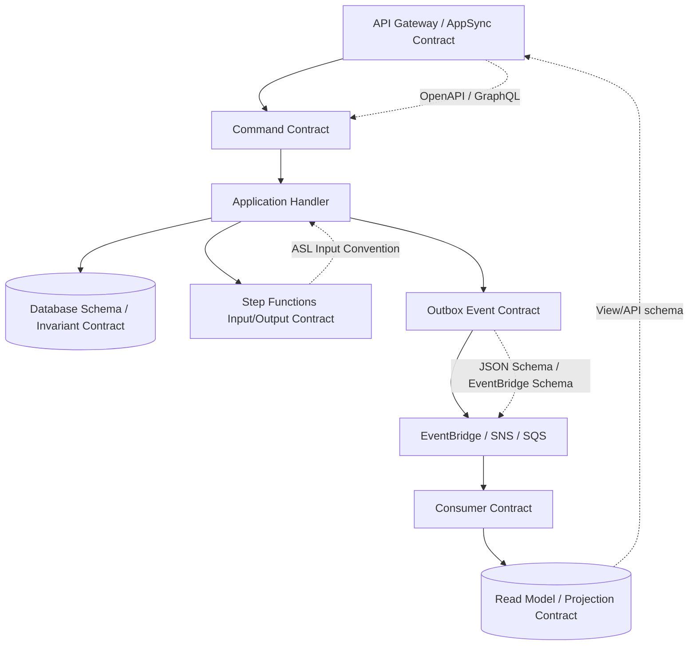

# Part 016 — Contract-First Integration: Schema, Versioning, Compatibility, Consumer Safety

> Tujuan bagian ini: membangun cara kerja contract-first untuk API, event, queue message, workflow input, dan projection. Targetnya bukan membuat dokumentasi cantik, tetapi memastikan producer dan consumer bisa berevolusi tanpa production break, silent data corruption, atau deployment coupling yang tidak terlihat.

Service tidak berkomunikasi lewat HTTP, SQS, SNS, EventBridge, atau Step Functions saja.

Service berkomunikasi lewat **contract**.

Transport hanya membawa byte.
Contract menentukan makna byte itu.

```txt
POST /payments bukan contract lengkap.
PaymentAccepted bukan contract lengkap.
SQS message body JSON bukan contract lengkap.
Step Functions input bukan contract lengkap.
```

Contract minimal harus menjawab:

```txt
apa operasi/fakta yang direpresentasikan?
field apa yang wajib?
field apa yang optional?
field apa yang stabil?
field apa yang boleh berubah?
apa satuan nilai numerik?
apa arti status?
apa semantic guarantee-nya?
apakah duplicate/replay mungkin?
apakah ordering dijamin?
bagaimana versioning dilakukan?
apa yang terjadi jika consumer lama menerima field baru?
```

Tanpa contract, integration hanya kebetulan cocok hari ini.

---

## 1. Contract-First vs Code-First

### Code-First

```txt
Developer menulis handler/model dulu.
Schema keluar belakangan dari implementasi.
Consumer membaca contoh payload dari log atau Slack.
```

Masalah:

```txt
- breaking change tidak terlihat sebelum deploy,
- dokumentasi tertinggal,
- field semantic berubah tanpa review,
- consumer mengandalkan field internal,
- event menjadi dump entity database,
- test hanya memvalidasi producer, bukan consumer compatibility.
```

### Contract-First

```txt
Contract didefinisikan sebelum implementasi producer/consumer.
Contract menjadi artifact yang direview, dites, dan diberi version.
```

Output contract bisa berupa:

```txt
OpenAPI untuk REST/HTTP API
GraphQL schema untuk AppSync
JSON Schema untuk event/message
AsyncAPI untuk async interface documentation
EventBridge schema registry artifact
Protocol Buffers/Avro untuk stream/binary contract
Amazon States Language input/output convention untuk workflow
SQL view/projection contract untuk read model
```

Contract-first bukan berarti implementasi lambat. Justru ia memotong ambiguity lebih awal.

---

## 2. Contract Bukan Hanya Shape, tapi Semantics

Shape:

```json
{
  "paymentId": "pay_123",
  "amount": 100000,
  "status": "ACCEPTED"
}
```

Semantics:

```txt
paymentId adalah stable business identifier.
amount disimpan dalam minor unit, bukan decimal floating point.
currency default tidak pernah diasumsikan; harus eksplisit.
status ACCEPTED berarti command diterima, bukan settlement selesai.
Event boleh duplicate.
Event boleh datang terlambat.
Consumer harus idempotent berdasarkan eventId.
```

Kesalahan production sering terjadi bukan karena JSON invalid, tetapi karena semantic salah.

Contoh field `status`:

```txt
PENDING   menurut producer = menunggu fraud check
PENDING   menurut consumer = siap diproses pembayaran
```

Nama sama, makna beda, state rusak.

---

## 3. Contract Surface di AWS Application + Database



Contract surface utama:

| Surface | Contract Artifact | AWS Relevance |
|---|---|---|
| REST/HTTP API | OpenAPI, JSON Schema, error model | API Gateway import/export, request validation |
| GraphQL API | GraphQL schema | AWS AppSync schema/resolver boundary |
| Event | Event envelope + JSON Schema | EventBridge Schema Registry, code bindings |
| Queue message | Message envelope + payload schema | SQS/SNS message body convention |
| Workflow | State machine input/output schema | Step Functions execution input/result discipline |
| Database read model | View/table/API DTO schema | projection compatibility, CQRS read side |
| External provider | Provider API contract + idempotency behavior | retries, provider references, side-effect logs |

---

## 4. API Contract with API Gateway

API Gateway can validate incoming REST API request bodies and parameters using models/schema. That validation is useful, but it should be treated as the first gate, not the complete business validation layer.

### Example OpenAPI Contract

```yaml
openapi: 3.0.3
info:
  title: Case Review API
  version: 1.0.0
paths:
  /cases/{caseId}/submit-review:
    post:
      operationId: submitCaseForReview
      parameters:
        - name: caseId
          in: path
          required: true
          schema:
            type: string
        - name: Idempotency-Key
          in: header
          required: true
          schema:
            type: string
            minLength: 16
            maxLength: 128
      requestBody:
        required: true
        content:
          application/json:
            schema:
              $ref: '#/components/schemas/SubmitCaseForReviewRequest'
      responses:
        '202':
          description: Accepted for review
          content:
            application/json:
              schema:
                $ref: '#/components/schemas/SubmitCaseForReviewResponse'
        '409':
          description: Conflict or invalid state transition
          content:
            application/json:
              schema:
                $ref: '#/components/schemas/ErrorResponse'
components:
  schemas:
    SubmitCaseForReviewRequest:
      type: object
      required:
        - evidenceVersion
        - submittedBy
      properties:
        evidenceVersion:
          type: integer
          minimum: 1
        submittedBy:
          type: string
        note:
          type: string
          maxLength: 2000
    SubmitCaseForReviewResponse:
      type: object
      required:
        - caseId
        - status
        - submittedAt
      properties:
        caseId:
          type: string
        status:
          type: string
          enum: [UNDER_REVIEW]
        submittedAt:
          type: string
          format: date-time
    ErrorResponse:
      type: object
      required:
        - code
        - message
        - correlationId
      properties:
        code:
          type: string
        message:
          type: string
        correlationId:
          type: string
```

### API Compatibility Rules

Safe changes:

```txt
add optional request field
add optional response field
add new endpoint
add new enum only if clients treat unknown enum safely
increase max length if downstream supports it
make validation more permissive
```

Dangerous/breaking changes:

```txt
remove field
rename field
change field type
change unit: dollars -> cents, seconds -> milliseconds
make optional field required
change error code semantics
make validation stricter for existing clients
reuse enum value with new meaning
change idempotency behavior
```

### Error Contract

Error response harus stabil.

```json
{
  "code": "CASE_INVALID_TRANSITION",
  "message": "Case cannot be submitted from CLOSED state.",
  "correlationId": "01J...",
  "details": {
    "currentState": "CLOSED",
    "requiredState": "DRAFT"
  }
}
```

Jangan membuat consumer parse text message.

```txt
salah: if message contains "closed"
benar: if code == CASE_INVALID_TRANSITION
```

---

## 5. Event Contract

Event bukan command. Event adalah fakta yang sudah terjadi.

Event contract harus stabil karena producer tidak tahu semua consumer masa depan.

### Event Envelope

```json
{
  "specVersion": "1.0",
  "eventId": "01JZ0H9N9N7KJ2R8Y4P2B9V6ZD",
  "eventType": "CaseSubmittedForReview",
  "eventVersion": 1,
  "source": "case-service",
  "tenantId": "tenant-123",
  "aggregateType": "Case",
  "aggregateId": "case-456",
  "occurredAt": "2026-07-06T10:15:30Z",
  "correlationId": "01JZ0H7...",
  "causationId": "cmd-789",
  "data": {
    "caseId": "case-456",
    "evidenceVersion": 7,
    "submittedBy": "user-111",
    "reviewQueue": "standard"
  }
}
```

Envelope field invariant:

```txt
eventId         stable unique id for dedup
source          producer identity
eventType       semantic fact name
eventVersion    payload contract version
aggregateId     ordering/reconciliation anchor
occurredAt      business occurrence time, not publish time
correlationId   trace across service boundary
causationId     command/event that caused this event
tenantId        isolation and routing boundary
```

### EventBridge Mapping

EventBridge event shape memiliki top-level fields seperti `source`, `detail-type`, dan `detail`. Praktik yang umum adalah mapping:

```txt
source      -> service/domain producer, e.g. com.company.case
detail-type -> event type, e.g. CaseSubmittedForReview
detail      -> envelope/data payload
```

Contoh PutEvents entry:

```json
{
  "Source": "com.company.case",
  "DetailType": "CaseSubmittedForReview",
  "EventBusName": "domain-events-prod",
  "Detail": "{\"eventId\":\"01J...\",\"eventVersion\":1,\"aggregateId\":\"case-456\",\"data\":{...}}"
}
```

### Event Schema Compatibility

Safe changes:

```txt
add optional data field
add new event type
add new event version with upcaster/parallel support
add metadata field that consumers may ignore
```

Breaking changes:

```txt
remove field used by consumer
rename field
change type
change semantic meaning
change eventType meaning
change event from fact to command
make old event invalid without upcaster
```

### Event Upcaster

Upcaster mengubah event versi lama menjadi model internal baru.

```java
CaseSubmittedForReviewV2 upcast(CaseSubmittedForReviewV1 old) {
    return new CaseSubmittedForReviewV2(
        old.eventId(),
        old.caseId(),
        old.evidenceVersion(),
        old.submittedBy(),
        ReviewPriority.NORMAL // default explicit migration rule
    );
}
```

Rule:

```txt
Upcaster harus deterministic.
Default value harus terdokumentasi.
Tidak boleh diam-diam mengubah meaning event lama.
```

---

## 6. EventBridge Schema Registry

EventBridge Schema Registry dapat menyimpan dan mengorganisasi schema event. AWS juga menyediakan schema untuk AWS service events dan mendukung code bindings untuk beberapa bahasa seperti Java, Python, TypeScript, dan Go.

Gunakan schema registry untuk:

```txt
- mendokumentasikan event contract,
- menghasilkan typed bindings,
- menemukan event shape dari event bus,
- membantu consumer development,
- mengurangi parsing manual payload JSON.
```

Jangan salah paham:

```txt
schema registry membantu discoverability dan typing,
tetapi tidak otomatis menjamin semantic compatibility.
```

Tetap butuh:

```txt
- review perubahan contract,
- compatibility test,
- consumer-driven contract test,
- versioning policy,
- deprecation window,
- replay test.
```

---

## 7. Queue Message Contract

SQS tidak peduli isi message body. SNS bisa filter berdasarkan message attributes. Tetapi contract tetap harus eksplisit.

### Message Envelope

```json
{
  "messageId": "01JZ...",
  "messageType": "GenerateCaseSummary",
  "messageVersion": 1,
  "producer": "case-service",
  "tenantId": "tenant-123",
  "correlationId": "01JZ...",
  "idempotencyKey": "case-456:summary:v7",
  "createdAt": "2026-07-06T10:15:30Z",
  "data": {
    "caseId": "case-456",
    "evidenceVersion": 7,
    "targetFormat": "PDF"
  }
}
```

Queue message bisa command-like, tidak selalu event.

Bedakan:

```txt
GenerateCaseSummary     command to worker
CaseSubmittedForReview  fact/event to interested consumers
```

Queue contract harus menyebut:

```txt
max processing time
visibility timeout assumption
retry behavior
DLQ policy
idempotency key
ordering requirement
message group strategy jika FIFO
payload size strategy
large payload pointer rule
```

---

## 8. Workflow Contract with Step Functions

Step Functions sering dipakai sebagai durable control plane. Input workflow adalah contract.

### Bad Workflow Input

```json
{
  "case": {
    "id": "case-456",
    "allFieldsFromDatabase": "..."
  }
}
```

Masalah:

```txt
workflow execution lama menyimpan snapshot besar,
schema internal database bocor,
perubahan entity bisa merusak running execution,
PII tersebar ke execution history tanpa sengaja.
```

### Better Workflow Input

```json
{
  "workflowVersion": 1,
  "tenantId": "tenant-123",
  "caseId": "case-456",
  "commandId": "cmd-789",
  "evidenceVersion": 7,
  "requestedBy": "user-111",
  "correlationId": "01JZ..."
}
```

Workflow dapat fetch state terbaru dari source of truth saat dibutuhkan.

Contract workflow harus menjawab:

```txt
apakah input immutable?
apakah workflow boleh berjalan lama?
apakah state machine version berubah untuk execution lama?
apakah task output disimpan penuh?
apakah retry task idempotent?
apakah callback token timeout punya compensation?
```

---

## 9. Database Projection Contract

Read model juga contract.

Jika service A mengekspos query dari projection, consumer tidak boleh bergantung pada struktur internal tabel.

Bad:

```txt
consumer membaca tabel projection langsung
consumer join ke database service lain
consumer bergantung pada kolom internal denormalized
```

Better:

```txt
projection table internal -> API/query contract eksternal
```

Untuk internal platform tertentu, shared analytical projection bisa diterima jika contract-nya formal:

```txt
view name stable
column meaning documented
deprecation policy exists
schema compatibility tested
ownership jelas
refresh lag documented
```

Projection contract harus menyebut freshness:

```txt
strong read from source of truth
read model eventually consistent, normally < 5s lag
read model rebuilt daily
field X only updated after async enrichment
```

Tanpa freshness contract, consumer akan salah membuat keputusan bisnis.

---

## 10. Consumer-Driven Contract Testing

Producer tidak tahu semua asumsi consumer. Maka consumer perlu menulis expectation.

Minimal test matrix:

```txt
producer emits event v1 with required fields
consumer ignores unknown optional fields
consumer handles missing optional field
consumer rejects incompatible type
consumer handles unknown enum safely
consumer handles duplicate event id
consumer handles old event version via upcaster
```

### Example Consumer Expectation

```java
@Test
void shouldConsumeCaseSubmittedForReviewV1WithUnknownField() {
    String event = """
    {
      "eventId": "evt-1",
      "eventType": "CaseSubmittedForReview",
      "eventVersion": 1,
      "aggregateId": "case-456",
      "occurredAt": "2026-07-06T10:15:30Z",
      "data": {
        "caseId": "case-456",
        "evidenceVersion": 7,
        "submittedBy": "user-111",
        "futureField": "must be ignored"
      }
    }
    """;

    consumer.consume(event);

    assertThat(projection.find("case-456").status()).isEqualTo("UNDER_REVIEW");
}
```

Contract test bukan hanya schema validation. Ia menguji behavior consumer di bawah compatibility rule.

---

## 11. Versioning Strategy

### Version API by Capability, Not Every Change

Tidak semua perubahan butuh `/v2`.

```txt
add optional response field -> no new version
add optional request field -> no new version
change status semantics -> new version or new field
change money unit -> new version/new field required
remove field -> deprecation then major version
```

### Prefer Additive Evolution

Daripada:

```json
{
  "amount": 100.25
}
```

Lalu mengubah meaning menjadi minor unit, lebih aman:

```json
{
  "amountDecimal": "100.25",
  "amountMinor": 10025,
  "currency": "USD"
}
```

Kemudian deprecate field lama dengan window eksplisit.

### Enum Evolution

Enum adalah breaking-change trap.

Consumer harus punya unknown handling:

```java
switch (status) {
    case "UNDER_REVIEW" -> handleUnderReview();
    case "APPROVED" -> handleApproved();
    case "REJECTED" -> handleRejected();
    default -> handleUnknownStatus(status);
}
```

Jika unknown status tidak aman, contract harus menyatakan producer tidak boleh menambah enum tanpa major version.

### Event Versioning

Event version dapat ditempatkan di envelope:

```json
{
  "eventType": "CaseSubmittedForReview",
  "eventVersion": 2,
  "data": { }
}
```

Pilihan strategi:

```txt
same eventType + eventVersion field
new eventType name, e.g. CaseSubmittedForReviewV2
parallel publish v1 and v2 during migration
upcaster in consumer
```

Tidak ada satu strategi universal. Pilih berdasarkan jumlah consumer, replay need, dan kemampuan migrasi.

---

## 12. Deployment Compatibility

Contract-first harus mendukung deployment independen.

Rule umum:

```txt
Producer baru harus kompatibel dengan consumer lama.
Consumer baru harus kompatibel dengan producer lama.
Rollback producer tidak boleh merusak consumer baru.
Replay event lama harus tetap bisa diproses.
```

### Expand-Migrate-Contract untuk Contract

Sama seperti database schema migration:

```txt
1. Expand
   Tambah field baru optional. Producer bisa mulai mengisi, consumer lama ignore.

2. Migrate
   Consumer baru membaca field baru dan masih support field lama.

3. Observe
   Pastikan consumer lama tidak lagi aktif atau tidak membutuhkan field lama.

4. Contract
   Hapus/deprecate field lama setelah window aman.
```

Contoh:

```txt
v1: amount
v1.1: amount + amountMinor + currency
v1.2: consumers migrated to amountMinor
v2: amount removed or marked unsupported
```

---

## 13. Contract Review Checklist

Sebelum contract disetujui:

```txt
[ ] Nama operasi/event merepresentasikan intent/fact yang jelas?
[ ] Field wajib benar-benar wajib secara bisnis?
[ ] Field optional punya default semantic?
[ ] ID stabil untuk idempotency/dedup?
[ ] Satuan numerik eksplisit?
[ ] Timestamp meaning jelas: occurredAt vs publishedAt vs processedAt?
[ ] Timezone/format eksplisit?
[ ] Enum punya unknown strategy?
[ ] Error code stabil?
[ ] Retry semantics dijelaskan?
[ ] Duplicate/replay kemungkinan dijelaskan?
[ ] Ordering guarantee atau non-guarantee eksplisit?
[ ] Versioning policy jelas?
[ ] Deprecation policy jelas?
[ ] PII/sensitive field dikontrol?
[ ] Consumer compatibility test ada?
[ ] Example payload valid dan realistis?
```

---

## 14. Anti-Pattern

### Anti-Pattern 1: Event sebagai Dump Entity Database

```json
{
  "eventType": "CaseUpdated",
  "data": {
    "entireCaseRow": { }
  }
}
```

Masalah:

```txt
consumer tidak tahu field mana berubah,
internal schema bocor,
PII ikut tersebar,
event meaning kabur,
perubahan database menjadi breaking event change.
```

Better:

```txt
CaseSubmittedForReview
CaseAssignedToReviewer
CaseDecisionRecorded
CaseClosed
```

### Anti-Pattern 2: Generic Event Type

```txt
EntityChanged
RecordUpdated
StatusChanged
```

Ini memindahkan kompleksitas ke consumer. Consumer harus membaca diff dan menebak makna.

### Anti-Pattern 3: Required Field Terlalu Banyak

Required field membuat evolution sulit. Jadikan required hanya jika benar-benar invariant bisnis.

### Anti-Pattern 4: Mengubah Semantic Tanpa Mengubah Contract

Contoh paling berbahaya:

```txt
status APPROVED dulu berarti supervisor approved
status APPROVED sekarang berarti system auto-approved
```

Field sama, meaning berubah. Consumer rusak tanpa schema error.

### Anti-Pattern 5: Consumer Parse Field yang Tidak Dikontrak

Jika field tidak ada di contract, consumer tidak boleh bergantung padanya.

---

## 15. Practical Repository Layout

Contoh struktur mono-repo/platform repo:

```txt
contracts/
  apis/
    case-review-api/
      openapi.yaml
      examples/
      compatibility-tests/
  events/
    CaseSubmittedForReview/
      v1.schema.json
      v1.examples.json
      compatibility.md
    CaseDecisionRecorded/
      v1.schema.json
  messages/
    GenerateCaseSummary/
      v1.schema.json
  workflows/
    SubmitCaseReviewWorkflow/
      input.v1.schema.json
      output.v1.schema.json
  shared/
    error-response.schema.json
    envelope.schema.json
```

CI checks:

```txt
schema valid
examples validate against schema
breaking-change detector runs
consumer contract tests run
generated code bindings compile
OpenAPI lint passes
no undocumented required field
no forbidden sensitive fields in event payload
```

---

## 16. Mini Case Study: Case Review Domain

### Command API

```txt
POST /cases/{caseId}/submit-review
Idempotency-Key: tenant-123:SubmitReview:cmd-789
```

Command means:

```txt
request transition from DRAFT to UNDER_REVIEW
```

It does not mean:

```txt
review completed
case approved
notification sent
all evidence validated by humans
```

### Event

```txt
CaseSubmittedForReview
```

Fact means:

```txt
case entered UNDER_REVIEW state at occurredAt
```

Consumer expectations:

```txt
notification-service may email reviewer
analytics-service may increment submitted count
search-indexer may update searchable status
case-timeline may append timeline entry
```

Each consumer must dedup by:

```txt
subscriberId + eventId
```

### Projection

```txt
GET /review-queue?status=UNDER_REVIEW
```

Freshness contract:

```txt
eventually consistent, normally under 10 seconds, may lag during replay/backfill
```

This prevents UI/business process from assuming strong consistency.

---

## 17. Ringkasan

Contract-first integration berarti:

```txt
transport is not the contract
schema shape is not enough
semantics must be explicit
compatibility must be tested
versioning must support independent deployment
consumer safety must be designed before producer rollout
```

API Gateway, AppSync, EventBridge Schema Registry, SQS, SNS, and Step Functions provide useful integration surfaces. But the engineering maturity comes from how you define, version, validate, test, and operate contracts across those surfaces.

A good contract lets services change independently.
A bad contract turns every deployment into a distributed gamble.

---

## References

- Amazon API Gateway — Request validation for REST APIs: https://docs.aws.amazon.com/apigateway/latest/developerguide/api-gateway-method-request-validation.html
- Amazon API Gateway — Set up request validation using OpenAPI: https://docs.aws.amazon.com/apigateway/latest/developerguide/api-gateway-request-validation-set-up.html
- Amazon API Gateway — OpenAPI extensions: https://docs.aws.amazon.com/apigateway/latest/developerguide/api-gateway-swagger-extensions.html
- Amazon EventBridge — Schemas: https://docs.aws.amazon.com/eventbridge/latest/userguide/eb-schema.html
- Amazon EventBridge — Schema registries: https://docs.aws.amazon.com/eventbridge/latest/userguide/eb-schema-registry.html
- Amazon EventBridge — Generate code bindings from schema: https://docs.aws.amazon.com/eventbridge/latest/userguide/eb-schema-code-bindings.html
- AWS AppSync Developer Guide: https://docs.aws.amazon.com/appsync/latest/devguide/what-is-appsync.html
- AWS Step Functions Developer Guide: https://docs.aws.amazon.com/step-functions/latest/dg/welcome.html
