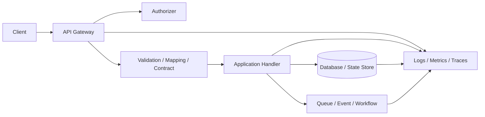
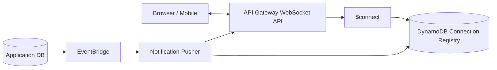
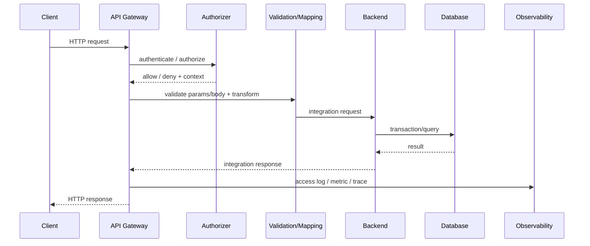
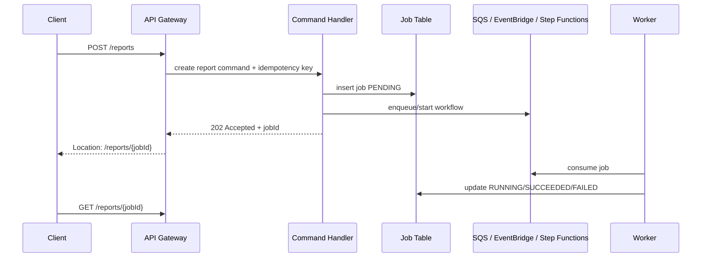
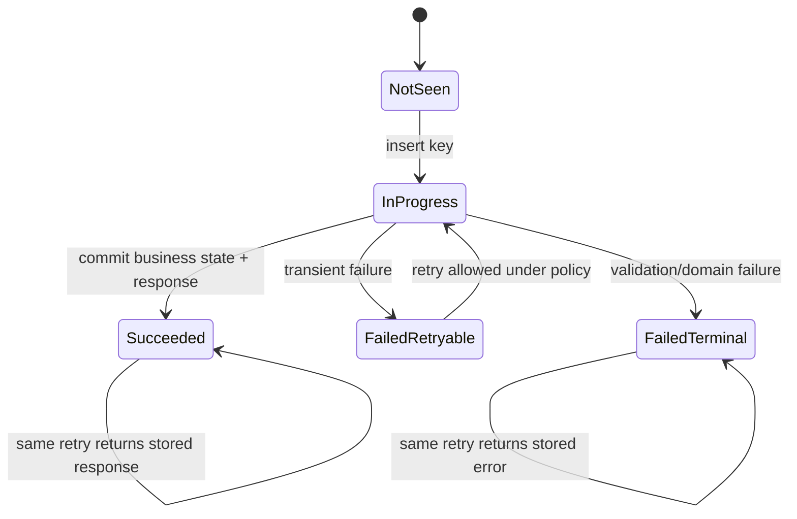
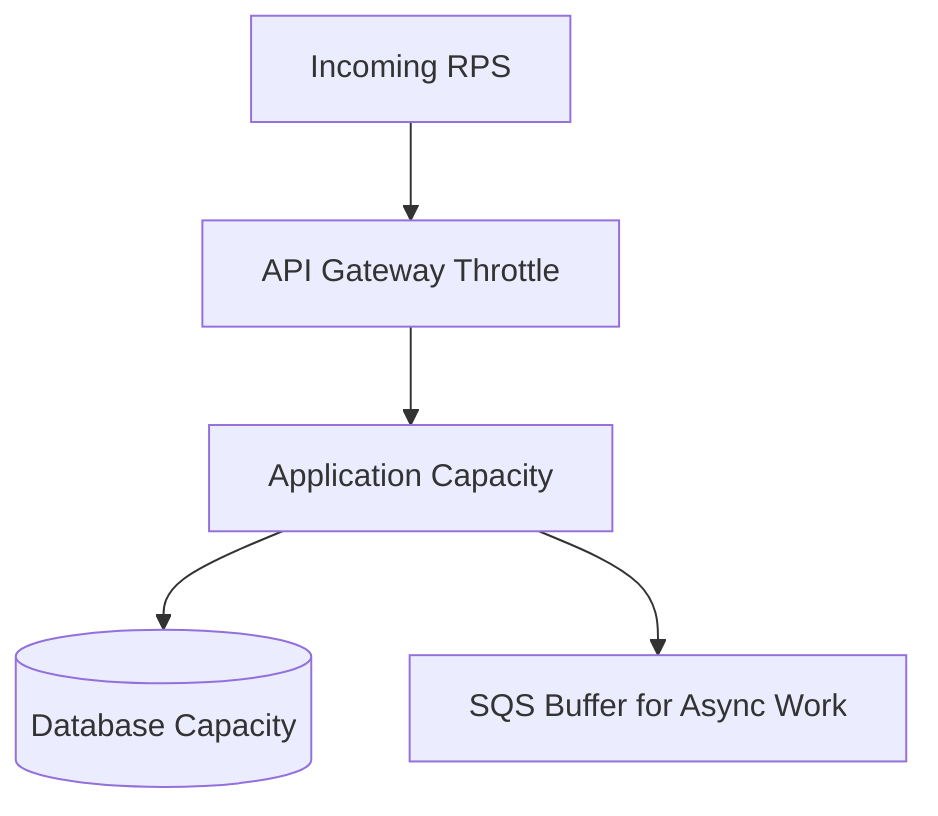
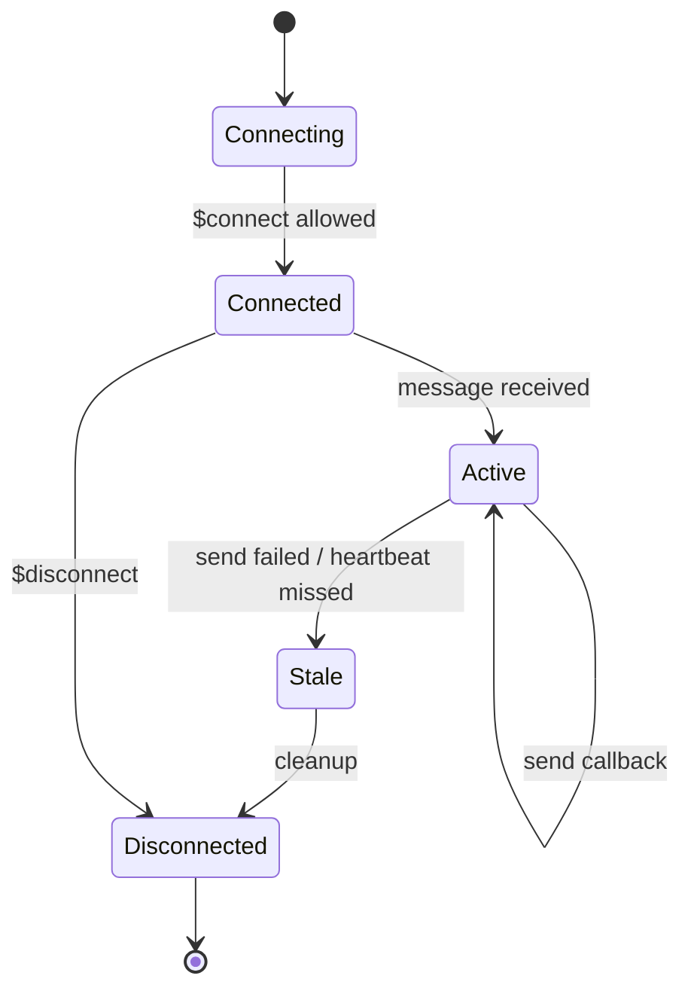
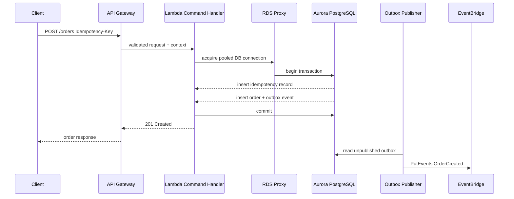
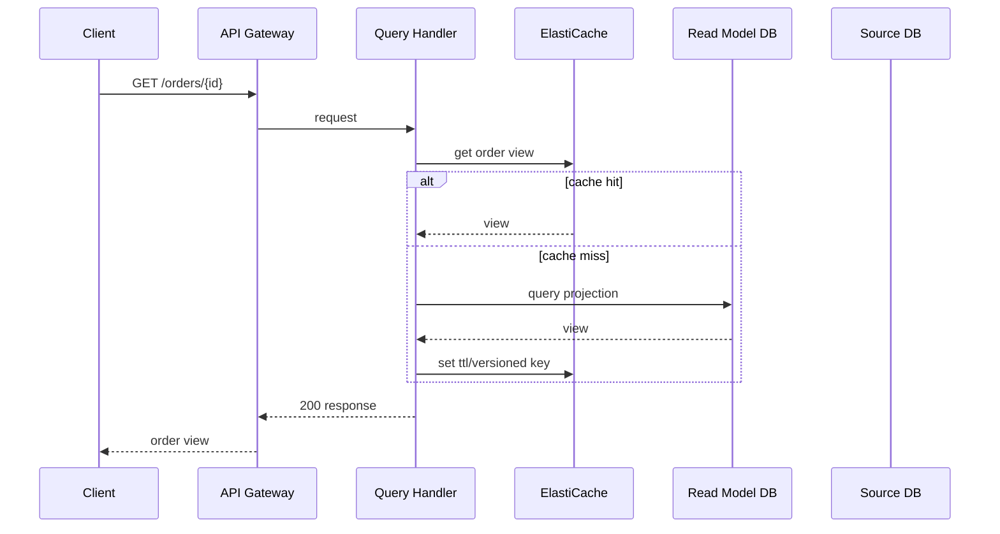
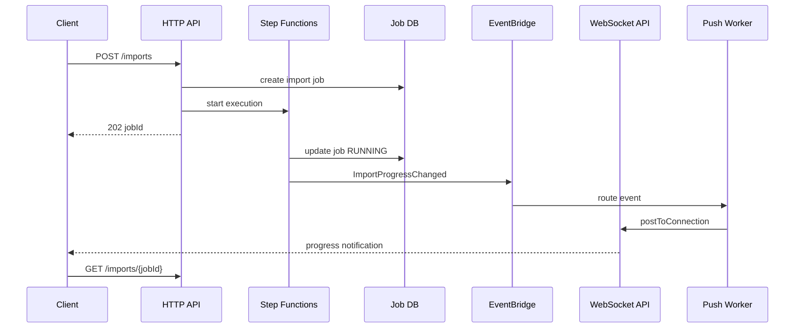

# Part 017 — API Gateway Deep Usage: REST API, HTTP API, WebSocket API

> Tujuan bagian ini: memahami API Gateway sebagai **production API boundary**, bukan sekadar “tempat expose Lambda”. Kita akan membedakan REST API, HTTP API, dan WebSocket API berdasarkan semantics, failure mode, latency, contract, operational need, dan hubungan dengan database/application state.

API Gateway sering terlihat sederhana:

```txt
client -> API Gateway -> Lambda/service -> database
```

Namun di production, API Gateway adalah **control point** untuk banyak hal:

```txt
- public contract,
- authentication boundary,
- throttling boundary,
- request validation boundary,
- routing boundary,
- transformation boundary,
- observability boundary,
- blast-radius boundary,
- backward-compatibility boundary,
- long-running workflow boundary,
- database write protection boundary.
```

Kalau boundary ini salah, masalah database akan keluar sebagai masalah API.
Kalau API contract salah, masalah API akan masuk sebagai masalah database.

Seri ini tidak memperlakukan API Gateway sebagai “service frontend”.
Kita memperlakukannya sebagai **traffic governor** untuk application state.

---

## 1. API Gateway dalam Mental Model Application + Database

Bayangkan sebuah sistem order.

```txt
POST /orders
GET /orders/{id}
POST /orders/{id}/cancel
GET /orders/{id}/events
```

Permintaan ini terlihat seperti endpoint HTTP.
Secara internal, masing-masing membawa konsekuensi state berbeda.

| Endpoint | Tipe | Dampak ke State | Failure yang Harus Dipikirkan |
|---|---|---|---|
| `POST /orders` | Command | Membuat aggregate baru | duplicate request, timeout after commit, inventory reservation failure |
| `GET /orders/{id}` | Query | Tidak mengubah state | stale projection, read replica lag, cache stale |
| `POST /orders/{id}/cancel` | Command | State transition | invalid transition, race dengan fulfillment, idempotency |
| `GET /orders/{id}/events` | Query/audit | Membaca event/projection | pagination, access control, consistency |

API Gateway tidak boleh dilihat hanya dari sisi HTTP method.
Yang lebih penting:

```txt
apakah request ini command atau query?
apakah butuh idempotency?
apakah boleh retry?
apakah response harus read-after-write accurate?
apakah operasi bisa selesai dalam request timeout?
apakah backend dependency bisa overload?
apakah database transaction boundary jelas?
```

Mental model yang benar:



API Gateway berada di depan application handler, tetapi desainnya harus sadar terhadap database dan workflow di belakangnya.

---

## 2. Tiga Jenis API Gateway: REST API, HTTP API, WebSocket API

API Gateway menyediakan beberapa tipe API. Pada seri ini, fokus kita:

```txt
REST API
HTTP API
WebSocket API
```

Jangan memilih berdasarkan nama.
Pilih berdasarkan semantics.

### 2.1 REST API

REST API adalah varian yang lebih matang dan feature-rich.
Biasanya dipilih ketika butuh:

```txt
- request validation yang kuat di gateway,
- API keys dan usage plans,
- advanced request/response transformation,
- gateway response customization,
- mature feature set,
- private/regional/edge-oriented REST deployment needs,
- kontrol detail terhadap method, resource, stage, model, mapping, deployment.
```

REST API cocok ketika API adalah **public or partner-grade contract** yang butuh governance tinggi.

Contoh use case:

```txt
- public payment API,
- partner onboarding API,
- regulatory submission API,
- enterprise B2B API,
- API dengan strict schema validation di gateway,
- API yang membutuhkan usage plan per client.
```

Trade-off:

```txt
+ feature lengkap,
+ governance kuat,
+ request validation dan model matang,
+ transformasi detail,
- konfigurasi lebih kompleks,
- biaya/latency bisa lebih tinggi dibanding HTTP API untuk use case sederhana,
- deployment/stage management lebih banyak keputusan.
```

### 2.2 HTTP API

HTTP API adalah varian yang lebih ringan untuk HTTP workloads.
Biasanya dipilih ketika butuh:

```txt
- HTTP routing sederhana,
- Lambda atau HTTP backend,
- lower-latency/lower-cost API surface,
- JWT authorizer umum,
- parameter mapping ringan,
- tidak membutuhkan seluruh feature REST API.
```

HTTP API cocok untuk:

```txt
- internal product API,
- mobile/web backend API,
- simple microservice façade,
- API berbasis Lambda proxy,
- API dengan contract validation dilakukan di application layer,
- workload high-volume yang tidak membutuhkan REST API feature set penuh.
```

Trade-off:

```txt
+ lebih sederhana,
+ cocok untuk sebagian besar API modern,
+ baik untuk Lambda/HTTP proxy workloads,
- tidak semua feature REST API tersedia,
- governance contract sering harus dipindahkan ke app/CI,
- jika butuh usage plans atau deep gateway modeling, REST API bisa lebih tepat.
```

### 2.3 WebSocket API

WebSocket API dipakai untuk komunikasi dua arah antara client dan backend.
Ini bukan REST dengan koneksi panjang.
Ini adalah **connection-oriented API boundary**.

Cocok untuk:

```txt
- realtime notification,
- collaboration presence,
- chat,
- order status push,
- trading/market updates,
- operational dashboards,
- long-running workflow progress.
```

Namun WebSocket API sering disalahpahami.

WebSocket API menyimpan koneksi.
Ia tidak otomatis menyimpan business state.

```txt
connection state != business state
```

Kamu tetap butuh:

```txt
- connection registry,
- authorization model,
- routing semantics,
- disconnect cleanup,
- fanout control,
- backpressure model,
- delivery fallback,
- replay/read model untuk client yang offline.
```

Contoh pola:



Jangan push event langsung dari database transaction ke WebSocket client.
Lebih aman:

```txt
write business state -> publish event/outbox -> push notification -> client refreshes/read model
```

Kenapa?

Karena push message bisa gagal, client bisa offline, dan WebSocket delivery bukan pengganti durable state.

---

## 3. Decision Table: REST vs HTTP vs WebSocket

| Kebutuhan | Pilihan Awal | Catatan |
|---|---|---|
| API sederhana untuk web/mobile backend | HTTP API | Validasi bisa di app + contract test di CI |
| Public API dengan usage plan/API key per client | REST API | REST API lebih cocok untuk API product governance |
| Strict gateway request model validation | REST API | HTTP API bisa tetap validasi di app, tetapi gateway model validation lebih kuat di REST API |
| Advanced mapping template/VTL | REST API | Cocok untuk legacy integration dan AWS service integration tertentu |
| JWT authorizer umum dan route sederhana | HTTP API | Cocok untuk modern auth flow |
| Realtime bidirectional communication | WebSocket API | Jangan jadikan WebSocket sebagai source of truth |
| Long-running process progress update | WebSocket API + Step Functions/EventBridge | API request awal biasanya command, progress dikirim async |
| Backend private di VPC | REST/HTTP API + VPC Link | Pikirkan timeout, health, dan backpressure |
| Internal service-to-service HTTP | Tidak selalu API Gateway | Pertimbangkan ALB, service mesh, private integration, atau direct internal API |
| Heavy transformation at edge | REST API | Tapi jangan jadikan gateway sebagai business logic layer |

Rule of thumb:

```txt
HTTP API by default untuk simple modern HTTP API.
REST API ketika butuh API governance feature yang spesifik.
WebSocket API ketika komunikasi dua arah adalah bagian dari product semantics.
```

Namun rule ini bukan hukum.
Kalau contract, security, quota, observability, dan migration plan lebih cocok di REST API, pilih REST API walaupun HTTP API terlihat lebih ringan.

---

## 4. API Gateway Runtime Pipeline

Request tidak langsung masuk backend.
Ada pipeline.



Setiap tahap punya failure sendiri.

| Tahap | Failure | Containment |
|---|---|---|
| Client to gateway | malformed request, oversized payload, auth missing | validation, payload limit, auth policy |
| Authorizer | token invalid, authorizer timeout, stale policy | fail closed, cache carefully, log reason class |
| Validation | schema mismatch, required field missing | reject before app/database |
| Mapping | wrong transform, lost field, type coercion | contract test, examples, mapping diff |
| Backend call | timeout, 5xx, overload | timeout budget, throttling, circuit breaker downstream |
| Database access | lock contention, connection exhaustion | pool limit, RDS Proxy, async offload, retry discipline |
| Response | inconsistent error shape | gateway response + backend error contract |
| Logging | missing correlation ID | access log format, trace propagation |

API Gateway design harus mengurangi invalid load sebelum mencapai database.

Database adalah resource mahal.
Jangan biarkan semua invalid request menjadi query database.

---

## 5. Endpoint Design: Command dan Query Harus Terlihat

Endpoint yang baik memperlihatkan semantics.

Buruk:

```txt
POST /updateOrder
POST /process
POST /action
POST /orders/{id}
```

Lebih baik:

```txt
POST /orders
POST /orders/{id}/cancel
POST /orders/{id}/submit
POST /orders/{id}/capture-payment
GET  /orders/{id}
GET  /orders?customerId=...
```

Namun jangan terjebak “REST purity”.
Untuk distributed systems, clarity lebih penting daripada debat kosmetik.

Command endpoint boleh berbentuk action jika memang state transition domain jelas.

```txt
POST /cases/{id}/escalate
POST /claims/{id}/approve
POST /payments/{id}/capture
POST /shipments/{id}/dispatch
```

Yang penting:

```txt
- transition valid,
- precondition jelas,
- idempotency jelas,
- response jelas,
- failure behavior jelas,
- audit event jelas.
```

Command endpoint harus diperlakukan berbeda dari query endpoint.

| Aspek | Command | Query |
|---|---|---|
| Mengubah state | Ya | Tidak |
| Idempotency key | Sering wajib | Biasanya tidak |
| Retry client | Hati-hati | Biasanya lebih aman |
| Timeout after commit | Harus dimodelkan | Tidak ada commit |
| Response | Accepted/Created/State snapshot | Data/read model |
| Database | Transaction/write path | Read replica/projection/cache |
| Observability | command id, state transition | query latency/cache/read source |

---

## 6. Long-Running Operation: Jangan Paksa Selesai dalam Satu HTTP Request

API Gateway punya timeout integration.
Backend, Lambda, ALB, database, dan client juga punya timeout.

Kesalahan umum:

```txt
POST /generate-report
-> Lambda
-> query besar ke database
-> transform file
-> upload file
-> return response
```

Ini buruk karena:

```txt
- client bisa timeout,
- API Gateway bisa timeout,
- Lambda bisa timeout,
- database lock/query bisa lama,
- retry client bisa memulai job ganda,
- response sukses/gagal tidak jelas,
- progress tidak terlihat.
```

Pattern yang lebih aman:



Response awal:

```http
HTTP/1.1 202 Accepted
Location: /reports/rpt_01J...
Content-Type: application/json

{
  "jobId": "rpt_01J...",
  "status": "PENDING",
  "statusUrl": "/reports/rpt_01J..."
}
```

Jika butuh realtime progress:

```txt
POST command -> return job id -> WebSocket/SSE/polling for progress
```

Jangan ubah HTTP request menjadi distributed transaction panjang.

---

## 7. Timeout Budget: API Gateway Bukan Tempat Menunggu Keajaiban

Timeout harus didesain sebagai budget berlapis.

```txt
client timeout
  > API Gateway integration timeout
    > application server timeout
      > database query timeout
        > downstream service timeout
```

Contoh budget buruk:

```txt
client: 10s
API Gateway: 29s
backend: 60s
database query: unlimited
```

Dampaknya:

```txt
client sudah pergi,
API masih menunggu,
backend masih bekerja,
database masih memegang resource,
retry client memulai request baru,
akhirnya terjadi duplicate side effect.
```

Budget lebih sehat:

```txt
client: 8s
API Gateway: 7s
backend app: 6s
database statement timeout: 3s
downstream call: 1-2s
```

Untuk command yang mungkin commit:

```txt
- pakai idempotency key,
- simpan command record,
- commit state secara deterministik,
- return same result saat retry,
- jangan mengandalkan client tahu apakah commit terjadi.
```

Timeout bukan rollback guarantee.

```txt
HTTP timeout says: client did not receive answer.
It does not say: backend did not commit.
```

---

## 8. Idempotency di API Boundary

Command API yang bisa di-retry harus idempotent.

Header umum:

```http
Idempotency-Key: ordcmd_01J...
```

Minimal record:

```sql
CREATE TABLE api_idempotency_record (
    tenant_id          text        NOT NULL,
    idempotency_key   text        NOT NULL,
    command_hash      text        NOT NULL,
    status            text        NOT NULL,
    response_status   integer,
    response_body     jsonb,
    created_at        timestamptz NOT NULL DEFAULT now(),
    expires_at        timestamptz NOT NULL,
    PRIMARY KEY (tenant_id, idempotency_key)
);
```

State machine:



Rules:

```txt
same idempotency key + same command hash -> return same outcome
same idempotency key + different command hash -> 409 conflict
key expires only after business-safe TTL
response is persisted only after business commit is known
external side effects also need idempotency key
```

API Gateway sendiri tidak menyelesaikan idempotency.
Idempotency adalah application/database concern.
Gateway membantu meneruskan header, memvalidasi keberadaan header, dan logging.

---

## 9. Request Validation: Gateway vs Application

Validasi punya lapisan.

| Layer | Bertanggung Jawab Untuk | Contoh |
|---|---|---|
| API Gateway | shape dasar, required parameter, content type, body model pada REST API | `amount` required, `orderId` format string |
| Application | semantic validation | order exists, status allows cancel |
| Database | invariant final | unique constraint, foreign key, check constraint |
| Workflow | cross-step invariant | payment captured before fulfillment |

Jangan pindahkan semua validasi ke API Gateway.
Gateway tidak punya konteks domain penuh.

Namun jangan pula biarkan request jelas invalid sampai database.

Validasi ideal:

```txt
cheap syntactic rejection at gateway
semantic validation in app
hard invariant in database
reconciliation for cross-system invariant
```

Contoh:

```json
{
  "customerId": "cus_123",
  "items": [
    { "sku": "SKU-001", "quantity": 2 }
  ]
}
```

Gateway bisa validasi:

```txt
- customerId wajib,
- items minimal 1,
- quantity integer >= 1,
- sku string.
```

Application harus validasi:

```txt
- customer aktif,
- SKU tersedia,
- user boleh order untuk customer,
- quantity tidak melampaui policy.
```

Database harus menjaga:

```txt
- order id unik,
- state transition valid jika dimodelkan dengan constraint,
- idempotency key unik,
- foreign key bila relational boundary memungkinkan.
```

---

## 10. Mapping dan Transformation: Gunakan Secukupnya

API Gateway bisa melakukan mapping request/response.
Pada REST API, mapping template VTL bisa sangat kuat.
Pada HTTP API, parameter mapping lebih sederhana.

Gunakan mapping untuk:

```txt
- menambahkan correlation id,
- meneruskan identity claims tertentu,
- mengubah path/query/header sederhana,
- menyembunyikan backend detail,
- compatibility shim sementara,
- integrasi legacy yang tidak bisa diubah cepat.
```

Jangan gunakan mapping untuk:

```txt
- business rule,
- domain decision,
- database-derived computation,
- complex branching,
- workflow orchestration,
- authorization domain detail yang butuh data lookup kompleks.
```

Anti-pattern:

```txt
API Gateway mapping template contains business logic.
```

Kenapa buruk?

```txt
- sulit di-test seperti code biasa,
- observability terbatas,
- review domain logic tersebar,
- error handling menjadi aneh,
- sulit refactor,
- debugging production lambat.
```

Mapping sebaiknya menjadi adapter, bukan application layer.

---

## 11. Integration Types dan Database Consequence

API Gateway dapat mengarah ke beberapa jenis backend.

| Integration | Cocok Untuk | Risiko |
|---|---|---|
| Lambda proxy | serverless command/query handler | cold start, DB connection storm, timeout after commit |
| HTTP backend | service behind ALB/NLB/internal endpoint | overload, network hop, circuit breaker needed |
| AWS service integration | langsung invoke AWS service tertentu | contract tersebar di gateway, error mapping perlu hati-hati |
| Private integration/VPC Link | backend private | health, scaling, timeout, private DNS/network complexity |
| Mock integration | simple static/testing response | jangan pakai untuk business state |

### Lambda Proxy + Database

Kesalahan umum:

```txt
API Gateway -> Lambda -> RDS directly
```

dengan traffic tinggi dan tanpa connection management.

Risiko:

```txt
- Lambda concurrency naik,
- setiap execution membuat koneksi DB,
- RDS max_connections habis,
- semua request gagal,
- retry memperburuk kondisi.
```

Mitigasi:

```txt
- RDS Proxy,
- connection reuse,
- concurrency limit,
- queue untuk write-heavy async work,
- statement timeout,
- bulkhead per command type,
- backpressure di API Gateway/app.
```

### HTTP Backend + Database

Backend container/service biasanya punya pool koneksi.
Tetap perlu:

```txt
- max pool size,
- timeout query,
- slow query alert,
- readiness/liveness yang benar,
- load shedding,
- endpoint-level rate limit,
- database circuit breaker untuk non-critical query.
```

### Direct AWS Service Integration

Contoh:

```txt
API Gateway -> SQS SendMessage
API Gateway -> Step Functions StartExecution
API Gateway -> EventBridge PutEvents
```

Pola ini berguna untuk ingestion sederhana.

Tetapi pastikan:

```txt
- request validation kuat,
- idempotency strategy ada,
- error mapping jelas,
- auth tidak hanya “boleh hit endpoint”, tetapi boleh command apa,
- schema/event envelope stabil,
- observability mencatat command id.
```

Direct integration mengurangi code, tapi tidak menghapus kebutuhan desain.

---

## 12. Throttling, Quota, dan Backpressure

API Gateway dapat melakukan throttling.
Namun throttling harus disambungkan ke kapasitas downstream.

Buruk:

```txt
API Gateway allows 10k RPS
backend can handle 2k RPS
database can handle 500 write TPS
```

Ini bukan scaling.
Ini waiting room untuk outage.

Lebih benar:

```txt
external quota <= app capacity <= database safe capacity
```

Backpressure harus berdasarkan bottleneck sebenarnya.



Untuk command write-heavy:

```txt
- throttle command endpoint lebih ketat daripada query endpoint,
- buat quota per tenant/client,
- gunakan idempotency key agar retry tidak memperbanyak write,
- pindahkan long-running mutation ke queue/workflow,
- ukur DB write latency dan lock wait sebagai scaling signal.
```

Untuk query-heavy:

```txt
- cache read model,
- pakai projection,
- pakai pagination,
- batasi filter mahal,
- hindari query “contains everywhere”,
- rate-limit expensive search.
```

Throttle bukan hanya perlindungan API.
Throttle adalah perlindungan database.

---

## 13. Error Boundary: Jangan Bocorkan Backend Failure Mentah

Client tidak seharusnya menerima error mentah dari Lambda, framework, database, atau downstream.

Buruk:

```json
{
  "errorMessage": "org.postgresql.util.PSQLException: deadlock detected"
}
```

Lebih baik:

```json
{
  "type": "https://api.example.com/problems/conflict",
  "code": "ORDER_STATE_CONFLICT",
  "message": "The order cannot be cancelled in its current state.",
  "traceId": "1-...",
  "retryable": false
}
```

Minimal error contract:

```txt
code: stable machine-readable error code
message: safe human-readable message
traceId/requestId: support/debug reference
retryable: whether client may retry
fieldErrors: validation details when applicable
```

Mapping HTTP status:

| Status | Gunakan Untuk | Jangan Gunakan Untuk |
|---|---|---|
| 400 | malformed request / schema invalid | domain state conflict |
| 401 | unauthenticated | unauthorized domain action |
| 403 | authenticated but not allowed | validation failure |
| 404 | resource not found or hidden | backend timeout |
| 409 | idempotency conflict / state transition conflict | generic validation |
| 422 | semantically invalid request | malformed JSON |
| 429 | throttled / quota exceeded | backend arbitrary 5xx |
| 500 | unexpected server failure | user/domain error |
| 503 | temporary unavailable / overload | permanent validation failure |
| 504 | gateway/backend timeout | confirmed failed command |

Important:

```txt
504 does not mean the command did not commit.
```

For mutation endpoints, client retry must use same idempotency key.

---

## 14. Access Logs, Execution Logs, Metrics, Traces

Minimal observability untuk API Gateway:

```txt
- requestId,
- traceId,
- route/method/resource,
- status,
- integration status,
- latency,
- integration latency,
- caller/tenant/client id,
- user agent,
- throttled count,
- 4xx/5xx count,
- authorizer error,
- validation error,
- backend timeout,
- payload size class,
- idempotency key presence for command endpoints.
```

Access log sebaiknya structured JSON.

Contoh field:

```json
{
  "requestId": "$context.requestId",
  "extendedRequestId": "$context.extendedRequestId",
  "routeKey": "$context.routeKey",
  "status": "$context.status",
  "integrationStatus": "$context.integrationStatus",
  "responseLatency": "$context.responseLatency",
  "integrationLatency": "$context.integrationLatency",
  "sourceIp": "$context.identity.sourceIp",
  "userAgent": "$context.identity.userAgent"
}
```

Untuk API command, tambahkan correlation di application log:

```txt
traceId
apiRequestId
idempotencyKey
commandId
tenantId
aggregateId
stateTransition
transactionId/outboxId
```

Debug production biasanya gagal bukan karena tidak ada log.
Debug gagal karena log gateway, app, database, queue, dan workflow tidak bisa dikorelasikan.

---

## 15. WebSocket API: Connection Registry Pattern

WebSocket connection bersifat transient.
Jangan simpan business state hanya di connection.

Minimal connection registry:

```txt
PK: tenantId#userId
SK: connectionId
attributes:
  - connectedAt
  - lastSeenAt
  - principal
  - channel subscriptions
  - ttl
```

DynamoDB cocok untuk registry ini karena access pattern jelas:

```txt
find all connections for user
delete connection by connectionId
expire stale connection by TTL
query all connections for tenant/channel if fanout dibutuhkan
```

Connection lifecycle:



Risiko yang harus dirancang:

```txt
- $disconnect tidak selalu menjadi satu-satunya sumber cleanup,
- client reconnect membuat connection id baru,
- user bisa punya banyak device/tab,
- send callback bisa gagal karena connection gone,
- fanout besar bisa overload,
- push message bisa duplicate,
- offline client butuh read model/replay via HTTP query.
```

Pattern aman:

```txt
critical state -> durable database/read model
notification -> WebSocket best-effort push
client -> GET latest state after receiving notification
```

Push message idealnya kecil:

```json
{
  "type": "ORDER_STATUS_CHANGED",
  "orderId": "ord_123",
  "version": 42
}
```

Bukan seluruh aggregate:

```json
{
  "entireOrderObject": "...large mutable object..."
}
```

Client menerima notification, lalu fetch read model terbaru.

---

## 16. API Gateway sebagai Anti-Corruption Layer

API Gateway dapat menyembunyikan backend shape.

Misal backend lama punya endpoint:

```txt
POST /svc/v1/legacy/doCancel?oid=123
```

Public API yang lebih sehat:

```txt
POST /orders/123/cancel
```

Gateway/application adapter dapat menjaga public contract tetap stabil saat backend berubah.

Namun ada batas.

API Gateway boleh menjadi anti-corruption adapter untuk:

```txt
- route rewrite,
- header normalization,
- auth context forwarding,
- simple field rename sementara,
- request envelope adaptation.
```

API Gateway tidak ideal sebagai tempat:

```txt
- domain policy,
- state machine transition,
- data enrichment kompleks,
- multi-step workflow,
- cross-database validation.
```

Jika logic membutuhkan database lookup, audit, retry, dan test mendalam, itu application logic.

---

## 17. Stage, Deployment, dan Environment Strategy

API Gateway API biasanya punya stage/environment.

Common pattern:

```txt
dev
staging
prod
```

Namun production-grade API perlu lebih dari environment name.

Perhatikan:

```txt
- stage variable/config drift,
- deployment immutability,
- rollback strategy,
- custom domain mapping,
- canary release jika tersedia dan dibutuhkan,
- contract versioning,
- consumer migration,
- log retention per stage,
- metrics per route/stage,
- WAF/auth config parity,
- quota parity.
```

Jangan ubah contract production secara manual dari console.
Gunakan IaC.

Minimum pipeline:

```txt
OpenAPI/CDK/SAM/Terraform change
-> lint
-> contract diff
-> security review
-> deploy staging
-> integration test
-> backward compatibility test
-> deploy prod
-> monitor 4xx/5xx/latency/throttle
```

---

## 18. Example: Command API Gateway to Lambda to Aurora

Flow:



Key decisions:

```txt
- API Gateway validates syntactic request shape.
- Lambda validates domain rules.
- Aurora enforces unique order/idempotency constraints.
- Outbox prevents state/event split-brain.
- EventBridge is not called before DB commit.
- Client can safely retry with same idempotency key.
```

Failure cases:

| Failure | Expected Behavior |
|---|---|
| Client retries before first request completes | same idempotency key returns same/in-progress outcome |
| Lambda times out after DB commit | retry returns stored committed response |
| EventBridge publish fails | outbox publisher retries later |
| DB deadlock | transaction retry if safe; otherwise 409/503 with idempotency preserved |
| API Gateway timeout | client treats result unknown and retries with same key |

---

## 19. Example: Query API with Cache and Projection

Flow:



Important:

```txt
GET endpoint must declare freshness expectation.
```

Examples:

```txt
- strongly consistent source read,
- eventually consistent read model,
- cached with max staleness,
- read-after-write token/version.
```

Response can expose freshness metadata when useful:

```json
{
  "orderId": "ord_123",
  "status": "CONFIRMED",
  "version": 42,
  "generatedAt": "2026-07-06T09:00:00Z",
  "source": "ORDER_READ_MODEL"
}
```

Do not let clients assume query freshness if architecture cannot guarantee it.

---

## 20. Example: WebSocket Notification for Workflow Progress

Command starts workflow.
WebSocket pushes progress.
HTTP query remains source of truth.



Rules:

```txt
- workflow state is durable in Step Functions/job DB,
- WebSocket is notification channel,
- client can recover by querying job status,
- missed WebSocket message does not lose business state,
- notification payload includes version/progress pointer.
```

---

## 21. Common Anti-Patterns

### 21.1 API Gateway as Database Proxy

```txt
GET /query?sql=...
```

Ini bukan API.
Ini remote database exposure.

Masalah:

```txt
- authorization impossible at domain level,
- query cost unbounded,
- schema leaks,
- migration impossible,
- client coupling to database,
- injection/security risk besar.
```

### 21.2 One Endpoint to Rule Them All

```txt
POST /execute
{
  "action": "cancelOrder",
  "payload": {...}
}
```

Masalah:

```txt
- observability per operation buruk,
- throttling per command sulit,
- auth per action tersembunyi,
- OpenAPI tidak bermakna,
- client contract tidak jelas.
```

### 21.3 200 OK for Every Error

```json
{
  "success": false,
  "error": "INVALID"
}
```

Masalah:

```txt
- caches/proxies/client libraries salah interpretasi,
- monitoring 4xx/5xx tidak bekerja,
- retry policy bingung,
- API Gateway metrics kehilangan makna.
```

### 21.4 WebSocket as Durable Delivery

```txt
If WebSocket message sent, user has received state.
```

Salah.

WebSocket bukan durable queue untuk user.
Buat read model dan unread notification state jika perlu delivery guarantee.

### 21.5 Gateway Mapping Contains Business Workflow

```txt
if status == A call service X else call service Y
```

Ini workflow/application logic.
Gunakan application code atau Step Functions.

---

## 22. Production Readiness Checklist

Sebelum API Gateway endpoint dianggap production-ready:

```txt
[ ] endpoint diklasifikasikan sebagai command/query/notification
[ ] API type dipilih dengan alasan tertulis: REST/HTTP/WebSocket
[ ] OpenAPI/contract tersedia dan direview
[ ] request validation boundary jelas
[ ] domain validation ada di application layer
[ ] database invariant ada di database layer bila memungkinkan
[ ] idempotency key wajib untuk mutation yang retryable
[ ] timeout budget ditentukan end-to-end
[ ] long-running operation memakai 202 + job/workflow pattern
[ ] throttling disesuaikan dengan backend/database capacity
[ ] error response stabil dan tidak membocorkan backend
[ ] access log structured JSON
[ ] trace/correlation id masuk ke app/database/workflow log
[ ] 4xx/5xx/throttle/latency alarm ada
[ ] canary/synthetic test ada untuk critical route
[ ] rollback strategy ada
[ ] WebSocket connection registry punya cleanup dan TTL
[ ] direct AWS service integration punya schema, auth, dan DLQ/retry plan
[ ] public contract tidak expose database schema
```

---

## 23. Latihan: Desain API Boundary untuk Case Management

Scenario:

```txt
Regulatory case management platform.
Case can be created, assigned, escalated, reviewed, closed.
Some actions trigger async notifications and SLA timers.
Some clients need realtime dashboard updates.
```

Desain minimal:

```txt
POST /cases
GET /cases/{caseId}
POST /cases/{caseId}/assign
POST /cases/{caseId}/escalate
POST /cases/{caseId}/close
GET /cases?status=OPEN&assignee=...
WebSocket channel: case-progress notifications
```

Pertanyaan desain:

```txt
which endpoints require idempotency key?
which transitions require optimistic concurrency version?
which actions start Step Functions workflow?
which events go to EventBridge?
which queries read source DB vs projection?
which route has strictest throttle?
which errors are 409 vs 422?
what happens if API returns 504 after escalation committed?
what if WebSocket notification fails?
```

Jawaban yang matang tidak dimulai dari service.
Jawaban matang dimulai dari invariant.

---

## 24. Ringkasan

API Gateway adalah tempat public traffic masuk, tetapi konsekuensinya menjalar sampai database.

Mental model utama:

```txt
API Gateway is not business logic.
API Gateway is not database protection by default.
API Gateway is not workflow engine.
API Gateway is not durable event delivery.
```

API Gateway adalah:

```txt
- contract boundary,
- traffic boundary,
- auth integration point,
- validation adapter,
- integration adapter,
- observability edge,
- blast-radius control.
```

Gunakan:

```txt
HTTP API untuk common modern API yang sederhana dan efisien.
REST API untuk governance dan feature-rich API product boundary.
WebSocket API untuk bidirectional/realtime notification, bukan source of truth.
```

Selalu desain API berdasarkan:

```txt
command/query semantics,
state mutation risk,
timeout budget,
idempotency,
database capacity,
contract compatibility,
observability,
failure recovery.
```

Jika API layer benar, database layer terlindungi.
Jika API layer kabur, database akan menjadi tempat semua kekacauan berakhir.

---

## References

- Amazon API Gateway Developer Guide — https://docs.aws.amazon.com/apigateway/latest/developerguide/welcome.html
- API Gateway WebSocket APIs — https://docs.aws.amazon.com/apigateway/latest/developerguide/apigateway-websocket-api.html
- Overview of WebSocket APIs — https://docs.aws.amazon.com/apigateway/latest/developerguide/apigateway-websocket-api-overview.html
- API Gateway quotas — https://docs.aws.amazon.com/apigateway/latest/developerguide/limits.html
- Quotas for HTTP APIs — https://docs.aws.amazon.com/apigateway/latest/developerguide/http-api-quotas.html
- Quotas for REST APIs — https://docs.aws.amazon.com/apigateway/latest/developerguide/api-gateway-execution-service-limits-table.html
- Mapping template transformations for REST APIs — https://docs.aws.amazon.com/apigateway/latest/developerguide/models-mappings.html
- Transform API requests and responses for HTTP APIs — https://docs.aws.amazon.com/apigateway/latest/developerguide/http-api-parameter-mapping.html
- x-amazon-apigateway-integration object — https://docs.aws.amazon.com/apigateway/latest/developerguide/api-gateway-swagger-extensions-integration.html
