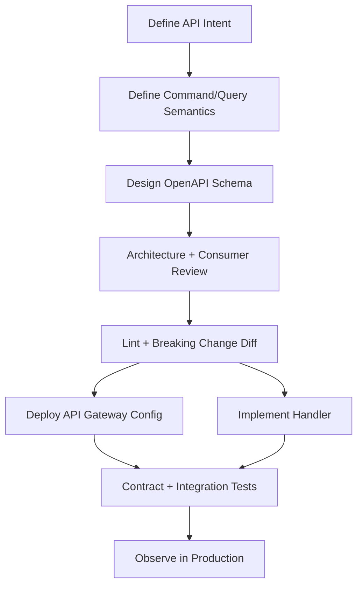

# Part 018 — API Contract Design: OpenAPI, Request Validation, Error Shape, Compatibility

> Tujuan bagian ini: membangun API contract yang bisa dipakai sebagai artefak engineering sungguhan: bisa direview, divalidasi, di-diff, diuji, digenerate, dan dijaga kompatibilitasnya. OpenAPI bukan dokumentasi kosmetik; OpenAPI adalah boundary antara client, API Gateway, application handler, dan state machine di belakangnya.

API contract yang buruk membuat sistem terlihat jalan pada awalnya.
Lalu rusak saat:

```txt
- field baru ditambahkan,
- enum baru muncul,
- client lama belum upgrade,
- database schema berubah,
- error code berubah,
- retry behavior tidak jelas,
- long-running operation berubah dari sync ke async,
- satu consumer mengandalkan field internal,
- API Gateway validation tidak sinkron dengan application validation.
```

Contract-first bukan berarti semua hal harus waterfall.
Contract-first berarti **semantics diputuskan sebelum implementation leak menjadi public API**.

---

## 1. API Contract: Lebih dari Path dan JSON Shape

Banyak tim menganggap contract API seperti ini:

```yaml
POST /orders
request body: OrderRequest
response body: OrderResponse
```

Itu belum cukup.

Contract API harus menjelaskan:

```txt
operation semantics,
command vs query,
authentication/authorization expectation,
required headers,
idempotency rule,
request schema,
response schema,
error schema,
state transition rule,
consistency expectation,
retry behavior,
pagination behavior,
versioning rule,
compatibility rule,
rate limit/quota expectation,
observability fields,
security redaction boundary.
```

Path dan JSON hanya permukaan.
Semantics adalah contract sebenarnya.

---

## 2. Contract-First Workflow

Workflow sehat:



Jangan mulai dari controller code.
Mulai dari public behavior.

Minimal repository layout:

```txt
api/
  openapi/
    orders.v1.yaml
  examples/
    create-order-request.json
    create-order-response-201.json
    error-validation-400.json
    error-conflict-409.json
  rules/
    api-lint.yaml
  tests/
    contract/
      create-order.compat.test.ts
      error-shape.compat.test.ts
```

OpenAPI harus berdampingan dengan examples dan compatibility tests.
Tanpa examples, schema sering ambigu.
Tanpa compatibility tests, review hanya bergantung pada mata manusia.

---

## 3. Operation Semantics: Command, Query, Async Command

Setiap operation harus diklasifikasikan.

| Tipe | HTTP Pattern | State Impact | Response |
|---|---|---|---|
| Query | `GET /resources/{id}` | no mutation | `200 OK` + representation |
| Create command | `POST /resources` | creates new state | `201 Created` atau `202 Accepted` |
| Transition command | `POST /resources/{id}/cancel` | state transition | `200/202/409/422` |
| Replace command | `PUT /resources/{id}` | replace idempotently | `200/204` |
| Partial update | `PATCH /resources/{id}` | patch state | use carefully, define patch semantics |
| Async command | `POST /jobs` | creates job/workflow | `202 Accepted` + status URL |
| Collection query | `GET /resources?...` | no mutation | paginated result |

Yang harus jelas:

```txt
can client retry?
should client retry?
what makes duplicate safe?
does success mean committed?
does 202 mean accepted but not done?
does GET read source or projection?
what conflict status is returned for invalid state transition?
```

---

## 4. OpenAPI as Executable Boundary

OpenAPI bisa digunakan untuk:

```txt
- human-readable API review,
- generated documentation,
- request/response examples,
- API Gateway import/update,
- client SDK generation,
- server stub generation,
- schema validation,
- breaking change detection,
- contract tests,
- security review,
- API catalog.
```

Namun OpenAPI tidak otomatis membuat desain benar.

OpenAPI adalah alat.
Contract thinking adalah disiplin.

Contoh struktur sederhana:

```yaml
openapi: 3.0.3
info:
  title: Orders API
  version: 1.0.0
servers:
  - url: https://api.example.com
paths:
  /orders:
    post:
      operationId: createOrder
      summary: Create an order
      parameters:
        - $ref: '#/components/parameters/IdempotencyKey'
      requestBody:
        required: true
        content:
          application/json:
            schema:
              $ref: '#/components/schemas/CreateOrderRequest'
      responses:
        '201':
          description: Order created
          content:
            application/json:
              schema:
                $ref: '#/components/schemas/OrderResponse'
        '400':
          $ref: '#/components/responses/ValidationError'
        '409':
          $ref: '#/components/responses/ConflictError'
```

Bagian penting bukan hanya schema.
Bagian penting adalah `operationId`, parameter, status code, error responses, examples, dan extension untuk deployment bila dipakai.

---

## 5. Naming: OperationId Harus Stabil

`operationId` sering diremehkan.
Padahal ia dipakai oleh:

```txt
- generated SDK,
- documentation anchor,
- test naming,
- metrics naming,
- client code references,
- governance tooling.
```

Buruk:

```yaml
operationId: postOrders
operationId: handler1
operationId: create
```

Lebih baik:

```yaml
operationId: createOrder
operationId: cancelOrder
operationId: getOrder
operationId: listOrders
operationId: startImportJob
```

Rule:

```txt
operationId expresses business operation, not HTTP mechanics.
operationId is stable unless operation meaning changes.
operationId must be unique across API.
```

---

## 6. Request Schema: Jangan Expose Database Shape

Buruk:

```json
{
  "order_table_customer_id": "cus_123",
  "order_status_cd": "P",
  "created_by_user_fk": 42
}
```

Ini menunjukkan database schema bocor ke public contract.

Lebih baik:

```json
{
  "customerId": "cus_123",
  "items": [
    {
      "sku": "SKU-001",
      "quantity": 2
    }
  ],
  "shippingAddressId": "addr_456"
}
```

Request schema harus merepresentasikan command intent, bukan tabel.

Rules:

```txt
- jangan expose surrogate database fields yang tidak bermakna bagi client,
- jangan paksa client mengirim status internal,
- jangan expose foreign key raw jika domain id lebih stabil,
- jangan menerima field yang server seharusnya hitung sendiri,
- jangan menerima audit field dari client kecuali memang domain input.
```

Contoh buruk:

```json
{
  "status": "APPROVED",
  "approvedAt": "2026-07-06T01:00:00Z",
  "approvedBy": "u123"
}
```

Untuk command `approveCase`, request lebih sehat:

```json
{
  "decisionNote": "Evidence complete",
  "expectedVersion": 17
}
```

Server menentukan:

```txt
status = APPROVED
approvedAt = server time
approvedBy = authenticated principal
```

---

## 7. Required vs Optional: Compatibility Trap

Field required itu mahal.

Ketika field sudah required untuk client, mengubahnya menjadi optional biasanya aman.
Menambahkan required field baru ke request existing biasanya breaking.

Request compatibility:

| Change | Usually Safe? | Catatan |
|---|---:|---|
| Add optional request field | Ya | Server harus tetap bekerja jika field absent |
| Add required request field | Tidak | Client lama akan gagal |
| Remove request field | Tidak | Client lama masih mengirim field |
| Loosen validation | Biasanya ya | Bisa punya konsekuensi domain |
| Tighten validation | Tidak selalu | Client lama bisa gagal |
| Rename field | Tidak | Treat as remove + add |
| Change type | Tidak | Breaking |
| Add enum value to request | Tergantung | Client may send; server must understand |

Response compatibility:

| Change | Usually Safe? | Catatan |
|---|---:|---|
| Add response field | Ya jika client toleran unknown fields | Harus jadi rule eksplisit |
| Remove response field | Tidak | Client bisa bergantung |
| Change field type | Tidak | Breaking |
| Rename field | Tidak | Breaking |
| Add enum value in response | Sering breaking | Client switch-case bisa gagal |
| Make nullable non-null | Biasanya aman | Tapi depends on client assumptions |
| Make non-null nullable | Breaking | Client mungkin tidak handle null |

Contract harus menyatakan:

```txt
clients must ignore unknown response fields
clients must handle unknown enum values safely where documented
server must not require newly added request fields in same version
```

Kalau client ecosystem tidak bisa menjamin unknown field tolerance, add field pun bisa menjadi breaking secara praktis.

---

## 8. Null, Missing, Empty: Harus Dibedakan

JSON punya jebakan:

```json
{}
```

```json
{ "name": null }
```

```json
{ "name": "" }
```

Ketiganya berbeda.

Contract harus mendefinisikan:

```txt
missing field means default/no change?
null means clear value?
empty string valid?
empty array valid?
```

Untuk `PATCH`, ini kritis.

Contoh buruk:

```json
{
  "displayName": null
}
```

Apakah ini berarti:

```txt
- clear displayName?
- ignore field?
- invalid input?
```

Jangan biarkan framework menentukan semantics secara tidak sengaja.

Lebih eksplisit:

```json
{
  "displayName": {
    "op": "clear"
  }
}
```

Atau gunakan JSON Merge Patch/JSON Patch dengan standard semantics, tapi pastikan consumer paham konsekuensinya.

---

## 9. Money, Time, and Numeric Precision

Field seperti uang dan waktu harus ketat.

Buruk:

```json
{
  "amount": 10.5,
  "date": "07/06/2026"
}
```

Masalah:

```txt
- floating point precision,
- currency tidak jelas,
- timezone ambigu,
- format tanggal regional ambigu.
```

Lebih baik:

```json
{
  "amount": {
    "currency": "USD",
    "minorUnits": 1050
  },
  "requestedAt": "2026-07-06T09:00:00Z"
}
```

Rules:

```txt
money uses currency + integer minor units, or decimal string with explicit scale
instant uses ISO-8601 timestamp with timezone/UTC
local date uses YYYY-MM-DD only when business date is local-date semantic
never rely on server locale
never use float for money
```

---

## 10. Error Shape: Stable Machine Contract

Error response harus menjadi contract, bukan exception dump.

Recommended base shape:

```json
{
  "type": "https://api.example.com/problems/validation-error",
  "code": "VALIDATION_ERROR",
  "message": "The request is invalid.",
  "traceId": "1-65f...",
  "retryable": false,
  "fieldErrors": [
    {
      "field": "items[0].quantity",
      "code": "MIN_VALUE",
      "message": "Quantity must be at least 1."
    }
  ]
}
```

Field rules:

| Field | Purpose | Stability |
|---|---|---|
| `type` | human/docs URI for class of problem | stable |
| `code` | machine-readable code | very stable |
| `message` | safe human message | can change mildly |
| `traceId` | support/debug correlation | per request |
| `retryable` | client retry hint | stable semantics |
| `fieldErrors` | validation details | structured |

Do not expose:

```txt
- stack trace,
- SQL query,
- database host,
- internal class name,
- cloud resource ARN unless safe,
- IAM policy details,
- PII in error message.
```

### Error Code Taxonomy

Good error codes:

```txt
VALIDATION_ERROR
AUTHENTICATION_REQUIRED
ACCESS_DENIED
RESOURCE_NOT_FOUND
IDEMPOTENCY_CONFLICT
ORDER_STATE_CONFLICT
QUOTA_EXCEEDED
RATE_LIMITED
TEMPORARILY_UNAVAILABLE
INTERNAL_ERROR
```

Bad error codes:

```txt
ERROR
FAILED
BAD_REQUEST
DB_ERROR
EXCEPTION
```

Error code should explain client action class.

---

## 11. HTTP Status Mapping

HTTP status is not enough, but it should still be meaningful.

| Status | Meaning | Example |
|---|---|---|
| 400 | syntactically invalid request | malformed body, missing required field |
| 401 | missing/invalid authentication | no token, expired token |
| 403 | authenticated but not allowed | user cannot approve case |
| 404 | resource not visible/found | case id not found or hidden |
| 409 | state conflict/idempotency conflict | expected version mismatch, duplicate key mismatch |
| 422 | semantic validation failed | cannot close case without required evidence |
| 429 | throttled/quota exceeded | tenant exceeded write quota |
| 500 | unexpected server failure | unhandled bug |
| 503 | temporary unavailable/overload | database failover, service degraded |
| 504 | timeout | gateway/backend timeout, command outcome may be unknown |

Never use `200 OK` for domain errors just because response has `{ success: false }`.

Monitoring, retry, proxies, and client libraries use status codes.

---

## 12. Idempotency Contract

For retryable mutation, define idempotency header.

```yaml
components:
  parameters:
    IdempotencyKey:
      name: Idempotency-Key
      in: header
      required: true
      schema:
        type: string
        minLength: 16
        maxLength: 128
      description: >
        Stable client-generated key for retrying the same command safely.
        Reusing the same key with a different request body returns 409.
```

Document behavior:

```txt
same key + same body -> same outcome
same key + different body -> 409 IDEMPOTENCY_CONFLICT
key retained for at least N hours/days
client must retry unknown timeout with same key
server may return in-progress status if first command still running
```

Response examples:

```http
HTTP/1.1 201 Created
Idempotency-Key: ordcmd_01J...
```

Conflict example:

```json
{
  "code": "IDEMPOTENCY_CONFLICT",
  "message": "The idempotency key was already used with a different command.",
  "traceId": "1-...",
  "retryable": false
}
```

Idempotency is not only a header.
It is a database-backed invariant.

---

## 13. Optimistic Concurrency Contract

For state transition command, expose version or ETag.

Pattern A: request field:

```json
{
  "expectedVersion": 17,
  "reason": "Evidence complete"
}
```

Pattern B: HTTP precondition:

```http
If-Match: "case-version-17"
```

Conflict response:

```http
HTTP/1.1 409 Conflict
```

```json
{
  "code": "VERSION_CONFLICT",
  "message": "The case was modified by another operation.",
  "currentVersion": 18,
  "traceId": "1-...",
  "retryable": false
}
```

Database enforcement example:

```sql
UPDATE regulatory_case
SET status = 'APPROVED', version = version + 1
WHERE case_id = :caseId
  AND version = :expectedVersion
  AND status = 'IN_REVIEW';
```

If affected rows = 0, application maps to conflict or invalid transition.

Contract must separate:

```txt
version conflict -> someone changed resource
invalid transition -> requested transition not allowed even on current state
```

Both may be 409/422 depending on API convention, but error code must distinguish.

---

## 14. Pagination Contract

Collection query without pagination is production risk.

Bad:

```txt
GET /cases?status=OPEN
```

returning unlimited rows.

Better:

```txt
GET /cases?status=OPEN&pageSize=50&pageToken=eyJ...
```

Response:

```json
{
  "items": [
    { "caseId": "case_001", "status": "OPEN" }
  ],
  "nextPageToken": "eyJ...",
  "pageSize": 50
}
```

Rules:

```txt
page size has max limit
page token is opaque
client must not parse token
sort order documented
result consistency documented
filters indexed or bounded
expensive filters rejected or async exported
```

For database safety:

```txt
no unbounded offset pagination for huge tables
prefer keyset/cursor pagination
align query contract with index/access pattern
limit arbitrary sorting
```

If using DynamoDB, contract should reflect access pattern:

```txt
pageToken maps to LastEvaluatedKey, but do not expose raw internal key if it leaks schema.
```

---

## 15. Filtering and Sorting Contract

Every filter is a database promise.

```txt
GET /orders?status=OPEN&customerId=cus_123&createdAfter=...
```

This implies backend can support that query efficiently.

Before exposing filter:

```txt
is it indexed?
is cardinality healthy?
can it be combined with other filters?
what is maximum result size?
what is latency SLO?
what happens if query becomes expensive?
```

Anti-pattern:

```txt
Expose arbitrary filter/sort because frontend asked.
```

Example dangerous endpoint:

```txt
GET /cases?sortBy=anyField&filter=anyExpression
```

Unless backed by a search engine or query service with guardrails, this becomes database abuse.

Contract should define allowed filters explicitly:

```yaml
parameters:
  - name: status
    in: query
    schema:
      type: string
      enum: [OPEN, IN_REVIEW, ESCALATED, CLOSED]
  - name: assigneeId
    in: query
    schema:
      type: string
  - name: createdAfter
    in: query
    schema:
      type: string
      format: date-time
```

---

## 16. API Gateway Request Validation

API Gateway REST APIs can validate request parameters and request body models.
This is useful to reject invalid requests before they reach application/database.

But know the boundary:

```txt
Gateway validation handles syntax/shape.
Application handles semantics.
Database enforces hard invariants.
```

Example OpenAPI with request validator extension:

```yaml
x-amazon-apigateway-request-validators:
  all:
    validateRequestBody: true
    validateRequestParameters: true
x-amazon-apigateway-request-validator: all
```

Request body schema:

```yaml
components:
  schemas:
    CreateOrderRequest:
      type: object
      required:
        - customerId
        - items
      additionalProperties: false
      properties:
        customerId:
          type: string
          minLength: 1
        items:
          type: array
          minItems: 1
          maxItems: 100
          items:
            $ref: '#/components/schemas/CreateOrderItem'
    CreateOrderItem:
      type: object
      required:
        - sku
        - quantity
      additionalProperties: false
      properties:
        sku:
          type: string
        quantity:
          type: integer
          minimum: 1
          maximum: 999
```

Be careful with `additionalProperties: false`.

Pros:

```txt
- catches typo fields,
- prevents unknown payload creep,
- stricter API contract.
```

Cons:

```txt
- adding request fields can break old gateway validation if clients send future fields,
- can make compatibility harder for some clients,
- schema evolution must be deliberate.
```

For response objects, clients should tolerate unknown fields.
For request objects, server can be strict if versioning strategy supports it.

---

## 17. AWS API Gateway OpenAPI Extensions

API Gateway uses OpenAPI extensions to configure AWS-specific behavior.

Common extension:

```yaml
x-amazon-apigateway-integration:
  type: aws_proxy
  httpMethod: POST
  uri: arn:aws:apigateway:us-east-1:lambda:path/2015-03-31/functions/${CreateOrderFunctionArn}/invocations
  timeoutInMillis: 29000
```

Conceptually, this binds public contract to backend integration.

Useful, but be careful:

```txt
OpenAPI now contains both public contract and deployment wiring.
```

Two common styles:

### Style A: Contract-only OpenAPI

```txt
api/openapi/orders.public.yaml
infra/cdk/api-gateway.ts
```

Pros:

```txt
- clean public contract,
- infra code owns deployment,
- easier for external consumers.
```

Cons:

```txt
- need tooling to ensure infra and contract stay aligned.
```

### Style B: Deployable OpenAPI

```txt
api/openapi/orders.apigateway.yaml
```

Pros:

```txt
- API Gateway import directly uses contract,
- less duplication.
```

Cons:

```txt
- AWS-specific config mixed into public spec,
- harder to share externally,
- environment substitution needed.
```

Pragmatic approach:

```txt
keep canonical contract clean,
generate deployable API Gateway spec from canonical contract + environment overlay.
```

---

## 18. Full Example: Create Order Contract

```yaml
openapi: 3.0.3
info:
  title: Orders API
  version: 1.0.0
paths:
  /orders:
    post:
      operationId: createOrder
      summary: Create a new order
      description: >
        Creates an order command. This operation is idempotent by Idempotency-Key.
        If the same key is reused with a different request body, the server returns 409.
      parameters:
        - $ref: '#/components/parameters/IdempotencyKey'
        - $ref: '#/components/parameters/CorrelationId'
      requestBody:
        required: true
        content:
          application/json:
            schema:
              $ref: '#/components/schemas/CreateOrderRequest'
            examples:
              minimal:
                value:
                  customerId: cus_123
                  items:
                    - sku: SKU-001
                      quantity: 2
      responses:
        '201':
          description: Order created
          headers:
            Location:
              schema:
                type: string
              description: URL of the created order
          content:
            application/json:
              schema:
                $ref: '#/components/schemas/OrderResponse'
        '400':
          $ref: '#/components/responses/ValidationError'
        '409':
          $ref: '#/components/responses/ConflictError'
        '429':
          $ref: '#/components/responses/RateLimitedError'
        '500':
          $ref: '#/components/responses/InternalError'
components:
  parameters:
    IdempotencyKey:
      name: Idempotency-Key
      in: header
      required: true
      schema:
        type: string
        minLength: 16
        maxLength: 128
    CorrelationId:
      name: X-Correlation-Id
      in: header
      required: false
      schema:
        type: string
        maxLength: 128
  schemas:
    CreateOrderRequest:
      type: object
      required:
        - customerId
        - items
      additionalProperties: false
      properties:
        customerId:
          type: string
          minLength: 1
        items:
          type: array
          minItems: 1
          maxItems: 100
          items:
            $ref: '#/components/schemas/CreateOrderItem'
    CreateOrderItem:
      type: object
      required:
        - sku
        - quantity
      additionalProperties: false
      properties:
        sku:
          type: string
          minLength: 1
        quantity:
          type: integer
          minimum: 1
          maximum: 999
    OrderResponse:
      type: object
      required:
        - orderId
        - status
        - version
        - createdAt
      properties:
        orderId:
          type: string
        status:
          type: string
          enum: [PENDING, CONFIRMED, CANCELLED]
        version:
          type: integer
          minimum: 1
        createdAt:
          type: string
          format: date-time
    Problem:
      type: object
      required:
        - code
        - message
        - traceId
        - retryable
      properties:
        type:
          type: string
        code:
          type: string
        message:
          type: string
        traceId:
          type: string
        retryable:
          type: boolean
        fieldErrors:
          type: array
          items:
            $ref: '#/components/schemas/FieldError'
    FieldError:
      type: object
      required: [field, code, message]
      properties:
        field:
          type: string
        code:
          type: string
        message:
          type: string
  responses:
    ValidationError:
      description: Invalid request
      content:
        application/json:
          schema:
            $ref: '#/components/schemas/Problem'
    ConflictError:
      description: Conflict with current resource state or idempotency record
      content:
        application/json:
          schema:
            $ref: '#/components/schemas/Problem'
    RateLimitedError:
      description: Request was throttled
      content:
        application/json:
          schema:
            $ref: '#/components/schemas/Problem'
    InternalError:
      description: Unexpected server error
      content:
        application/json:
          schema:
            $ref: '#/components/schemas/Problem'
```

This is already much better than ad-hoc JSON.
But production still needs compatibility checks and implementation tests.

---

## 19. Contract Test Matrix

Contract tests should check both producer and consumer assumptions.

### Producer-side tests

```txt
[ ] valid example request accepted
[ ] missing required field rejected
[ ] invalid type rejected
[ ] unknown field behavior matches contract
[ ] each documented error response can be produced
[ ] idempotency conflict returns documented 409 shape
[ ] timeout/overload returns stable error shape
[ ] response matches schema
[ ] correlation/trace id present in errors
```

### Consumer-side tests

```txt
[ ] consumer ignores unknown response field
[ ] consumer handles unknown enum fallback where required
[ ] consumer handles retryable=false
[ ] consumer handles 429 with backoff
[ ] consumer handles 202 async response if operation uses async pattern
[ ] consumer does not parse opaque pageToken
[ ] consumer does not rely on undocumented fields
```

### Gateway tests

```txt
[ ] API Gateway rejects malformed body before backend
[ ] API Gateway forwards required headers
[ ] API Gateway maps authorizer context correctly
[ ] API Gateway access log includes operation/request id
[ ] API Gateway error response is not raw backend exception
[ ] integration timeout behavior is understood
```

---

## 20. Breaking Change Detection

CI should detect breaking contract changes.

Examples of breaking changes:

```txt
- remove endpoint,
- change HTTP method,
- remove response field,
- change field type,
- add required request field,
- remove enum value,
- add response enum without fallback policy,
- change status code semantics,
- remove error code,
- change pagination token semantics,
- change idempotency retention rule,
- change consistency guarantee.
```

Some changes are syntactically invisible but semantically breaking.

Example:

```txt
GET /cases/{id} used to return source-of-truth state.
Now it returns eventually consistent projection.
```

OpenAPI diff may not catch this unless documented through extension/description/tests.

Therefore review checklist must include semantic compatibility.

---

## 21. Versioning Strategy

There is no free versioning.
All options have cost.

### URI versioning

```txt
/v1/orders
/v2/orders
```

Pros:

```txt
clear routing,
easy parallel support,
easy deprecation communication.
```

Cons:

```txt
coarse-grained,
can duplicate many endpoints,
clients may delay migration forever.
```

### Header/media type versioning

```http
Accept: application/vnd.example.orders.v1+json
```

Pros:

```txt
clean URI,
can version representation.
```

Cons:

```txt
harder routing/operability,
less visible,
more client complexity.
```

### Additive evolution without major version

```txt
keep same endpoint,
only additive compatible changes.
```

Pros:

```txt
simpler,
works well with disciplined contracts.
```

Cons:

```txt
requires strict compatibility discipline,
major semantic changes still need break mechanism.
```

Recommended default:

```txt
avoid new major version for additive changes.
use major version only for semantic breaking changes.
combine with deprecation windows and consumer telemetry.
```

---

## 22. Deprecation Contract

Breaking change is not a deployment event.
Breaking change is a migration program.

Deprecation plan:

```txt
1. Identify consumers.
2. Measure endpoint/field usage.
3. Publish replacement contract.
4. Support dual behavior.
5. Add warning/deprecation headers if appropriate.
6. Notify consumers.
7. Monitor migration.
8. Enforce deadline.
9. Remove only after safety window.
```

Possible headers:

```http
Deprecation: true
Sunset: Wed, 31 Dec 2026 23:59:59 GMT
Link: <https://docs.example.com/migrations/orders-v2>; rel="deprecation"
```

Internal APIs need deprecation too.
“Internal” does not mean “safe to break”.

---

## 23. Security Contract

OpenAPI should document security schemes.

Example:

```yaml
components:
  securitySchemes:
    bearerAuth:
      type: http
      scheme: bearer
      bearerFormat: JWT
security:
  - bearerAuth: []
```

But auth contract needs more than token shape.

For each operation:

```txt
which principal type can call this?
which tenant boundary applies?
which resource ownership rule applies?
which scopes/roles/permissions are required?
which fields are redacted by role?
```

Example:

```yaml
x-domain-permissions:
  - case:approve
x-tenant-boundary: required
x-resource-ownership: case-assigned-or-supervisor
```

Custom extensions like this are not standard OpenAPI behavior, but they can power internal review and tests.

Never assume API Gateway authorizer alone handles domain authorization.
Authorizer authenticates and may provide coarse authorization.
Fine-grained resource authorization usually lives in application layer with domain data.

---

## 24. Database-Aware API Contract

Every API contract implies data model pressure.

Examples:

```txt
GET /orders/{id} -> primary key lookup
GET /orders?customerId=x -> index by customer
GET /orders?status=OPEN -> index/projection by status
GET /orders?text=abc -> search projection
POST /orders/{id}/cancel -> conditional state update
POST /orders/{id}/items -> aggregate mutation
```

Before adding endpoint, ask:

```txt
what database access pattern does this require?
is it point lookup, range query, scan, graph traversal, search, aggregation?
which store owns source of truth?
is response from source DB, replica, projection, or cache?
what is freshness guarantee?
what is maximum cardinality?
what is the failure behavior if projection lags?
```

Contract should not promise what data model cannot provide.

Example:

```txt
GET /cases?anyFieldContains=foo&sortBy=lastUpdated&includeHistory=true
```

This probably cannot be served safely from OLTP database at scale.
Maybe it belongs to OpenSearch projection, report export, or analytical system.

---

## 25. API Gateway Import/Export Strategy

API Gateway can import REST APIs from OpenAPI definition files, and can export API definitions depending on API type and configuration.

Practical strategy:

```txt
source of truth should be repository, not exported console state.
```

Use export for:

```txt
- inspection,
- drift detection,
- migration from manual config,
- documentation bootstrap.
```

Do not use export as canonical contract if developers keep editing console manually.
That creates drift.

Recommended pipeline:

```txt
OpenAPI source in git
-> generate API Gateway deployable spec if needed
-> deploy via IaC/CI
-> run smoke test
-> optionally export deployed API
-> compare important pieces for drift
```

---

## 26. Example CI Contract Gates

Pseudo pipeline:

```yaml
name: api-contract
on:
  pull_request:
    paths:
      - api/openapi/**

jobs:
  validate:
    steps:
      - checkout
      - run: openapi-lint api/openapi/orders.v1.yaml
      - run: openapi-diff --fail-on-breaking main:api/openapi/orders.v1.yaml api/openapi/orders.v1.yaml
      - run: run-contract-examples api/openapi/orders.v1.yaml
      - run: run-consumer-contract-tests
```

Rules worth enforcing:

```txt
no operation without operationId
no 2xx response without schema
no 4xx/5xx response without Problem schema
no mutation without idempotency decision
no collection GET without pagination decision
no date-time without timezone semantics
no money number without currency/precision rule
no undocumented enum fallback
no endpoint without owner/team tag
```

---

## 27. API Review Checklist

Before approving a new endpoint:

```txt
[ ] Is this operation command, query, or async command?
[ ] Is the path named by domain semantics, not implementation detail?
[ ] Does request schema avoid database leakage?
[ ] Are required fields truly required from day one?
[ ] Are null/missing/empty semantics explicit?
[ ] Is money/time precision safe?
[ ] Is idempotency required for mutation?
[ ] Is optimistic concurrency needed?
[ ] Are error codes stable and actionable?
[ ] Are retry semantics documented?
[ ] Is pagination bounded?
[ ] Are filters backed by access patterns/indexes?
[ ] Is freshness/consistency documented?
[ ] Are auth/resource permissions clear?
[ ] Is API Gateway validation aligned with application validation?
[ ] Are examples included?
[ ] Are breaking change checks in CI?
[ ] Is observability/correlation defined?
[ ] Is deprecation/migration path possible?
```

---

## 28. Common Anti-Patterns

### 28.1 Schema Generated from Entity

```txt
JPA entity -> JSON response -> OpenAPI generated after the fact
```

Problem:

```txt
- database schema leaks,
- lazy-loaded fields leak accidentally,
- internal rename becomes API breaking change,
- consumer sees fields not intended for public use.
```

Use DTO/contract model intentionally.

### 28.2 Everything Optional

```yaml
CreateCaseRequest:
  type: object
  properties:
    title:
      type: string
    description:
      type: string
```

No required fields because team wants flexibility.

Problem:

```txt
- validation moves to hidden code,
- docs lie,
- client gets late semantic errors,
- gateway cannot reject bad load.
```

Make required fields explicit, but be careful adding new ones later.

### 28.3 Enum as Closed World Forever

Client code:

```java
switch (status) {
  case OPEN -> ...;
  case CLOSED -> ...;
  default -> throw new IllegalStateException();
}
```

Then server adds `ESCALATED`.
Client breaks.

Mitigation:

```txt
- document enum expansion policy,
- provide UNKNOWN fallback in generated clients if possible,
- avoid exposing internal workflow states unless needed,
- distinguish public status from internal status.
```

### 28.4 Ambiguous PATCH

```http
PATCH /profile
```

without patch semantics.

Problem:

```txt
- null ambiguity,
- partial update race,
- validation unclear,
- audit diff unclear.
```

Use explicit commands for important transitions.

### 28.5 Error Code Per Exception Class

```txt
NULL_POINTER_EXCEPTION
PSQL_EXCEPTION
TIMEOUT_EXCEPTION
```

Problem:

```txt
client now depends on implementation failure.
```

Map implementation exceptions to stable domain/API error codes.

---

## 29. Case Management Example

API operations:

```txt
POST /cases
GET /cases/{caseId}
POST /cases/{caseId}/assign
POST /cases/{caseId}/escalate
POST /cases/{caseId}/close
GET /cases?status=OPEN&assigneeId=...
```

`escalateCase` request:

```json
{
  "expectedVersion": 12,
  "reasonCode": "SLA_RISK",
  "note": "Case has exceeded review threshold."
}
```

Contract decisions:

```txt
Idempotency-Key required? yes.
Expected version required? yes.
Can repeated same command succeed? yes, same outcome.
Invalid transition? 409 CASE_STATE_CONFLICT.
Missing evidence? 422 CASE_CLOSURE_REQUIREMENT_NOT_MET.
Audit event? CaseEscalated event emitted after DB commit.
Read freshness? GET /cases/{id} reads source DB for detail.
List freshness? GET /cases reads projection, eventually consistent.
Realtime update? WebSocket notification only, not source of truth.
```

OpenAPI alone cannot infer this.
You must encode it in descriptions, schemas, examples, tests, and implementation invariants.

---

## 30. Ringkasan

API contract adalah boundary yang melindungi client dari implementation churn dan melindungi backend/database dari invalid assumptions.

Contract yang matang menjawab:

```txt
what operation means,
what state it may change,
what request is valid,
what response means,
what errors mean,
what retry means,
what consistency is promised,
what compatibility is guaranteed,
what database access pattern is implied.
```

OpenAPI membantu membuat contract bisa dieksekusi:

```txt
linted,
diffed,
validated,
deployed,
tested,
documented,
generated,
reviewed.
```

Namun desain tetap harus dilakukan oleh engineer.

Rule utama:

```txt
Do not let implementation shape become public contract by accident.
```

Jika API contract rapi, client bisa berkembang, backend bisa refactor, database bisa berevolusi, dan integration tidak menjadi jebakan permanen.

---

## References

- Develop REST APIs using OpenAPI in API Gateway — https://docs.aws.amazon.com/apigateway/latest/developerguide/api-gateway-import-api.html
- Import a Regional API into API Gateway — https://docs.aws.amazon.com/apigateway/latest/developerguide/import-export-api-endpoints.html
- Request validation for REST APIs in API Gateway — https://docs.aws.amazon.com/apigateway/latest/developerguide/api-gateway-method-request-validation.html
- Set up basic request validation in API Gateway — https://docs.aws.amazon.com/apigateway/latest/developerguide/api-gateway-request-validation-set-up.html
- x-amazon-apigateway-integration object — https://docs.aws.amazon.com/apigateway/latest/developerguide/api-gateway-swagger-extensions-integration.html
- Gateway response types for API Gateway — https://docs.aws.amazon.com/apigateway/latest/developerguide/supported-gateway-response-types.html
- Export HTTP APIs from API Gateway — https://docs.aws.amazon.com/apigateway/latest/developerguide/http-api-export.html
- API Gateway quotas — https://docs.aws.amazon.com/apigateway/latest/developerguide/limits.html
