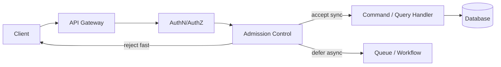
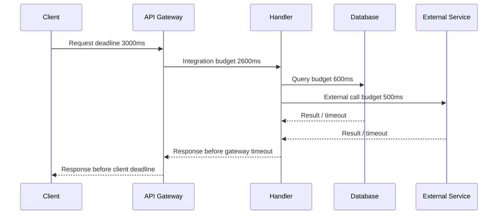
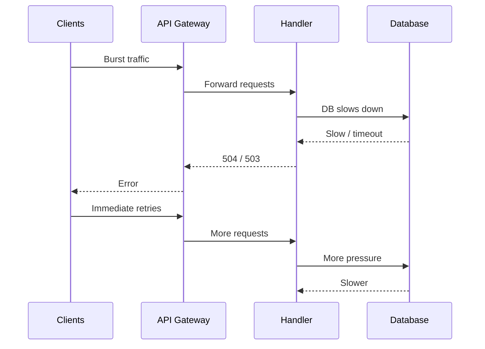
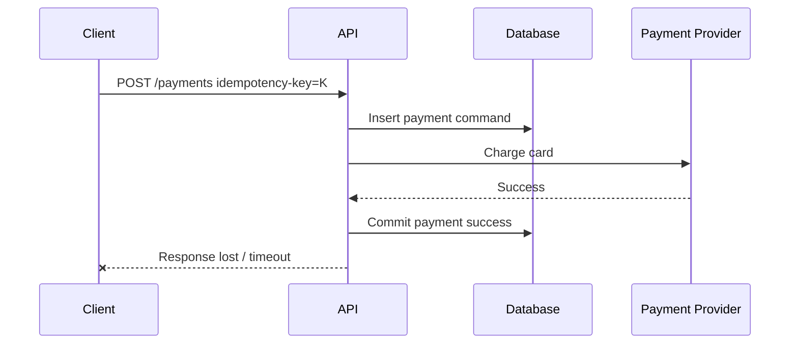
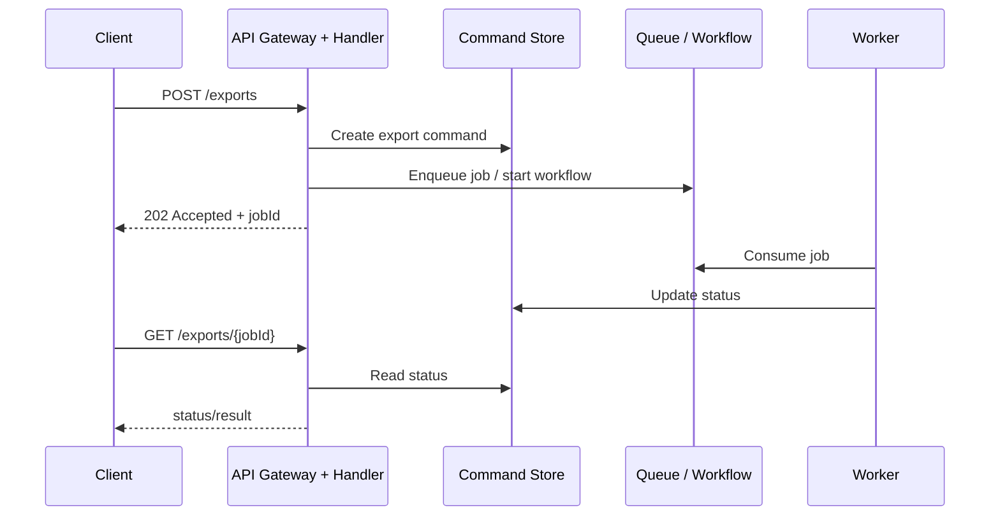
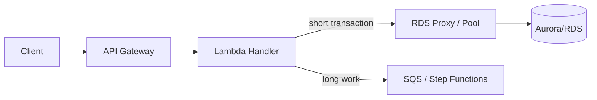
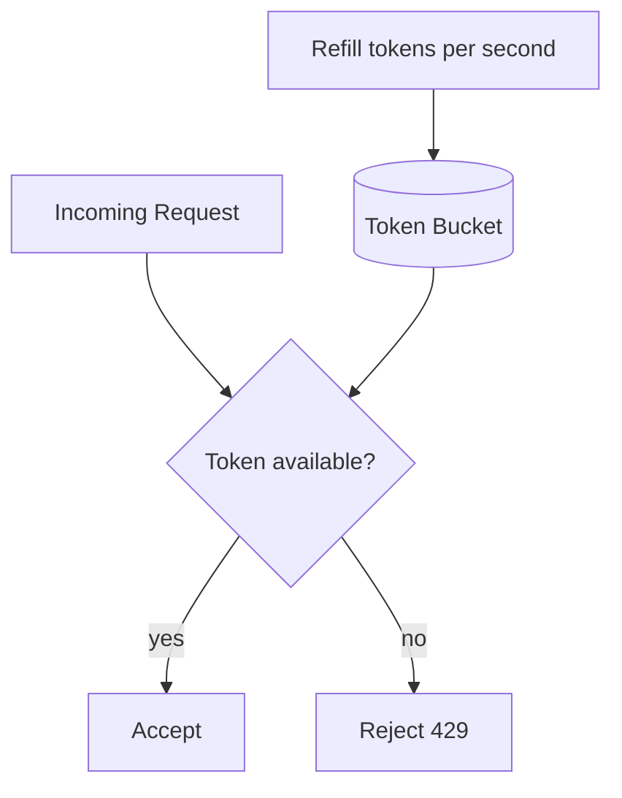
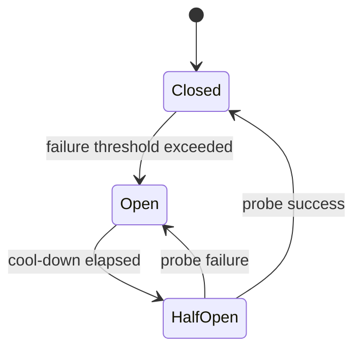

# Part 019 — Timeout, Retry, Rate Limit, Quota, and Throttling pada API Layer

> Tujuan bagian ini: memahami synchronous API sebagai **control system**, bukan sekadar endpoint HTTP. API layer harus mengatur admission, timeout, retry, quota, rate limit, concurrency, dan backpressure supaya kegagalan backend tidak berubah menjadi kegagalan sistemik.

API yang terlihat sederhana:

```txt
POST /orders
GET /orders/{id}
PATCH /cases/{id}/status
```

sebenarnya adalah titik pertemuan banyak sistem:

```txt
client timeout,
mobile network,
CDN/proxy,
API Gateway,
authorizer,
Lambda/container/backend service,
database connection pool,
transaction lock,
external dependency,
retry policy,
observability pipeline.
```

Jika setiap layer membuat keputusan sendiri tanpa budget bersama, sistem akan terlihat normal pada traffic rendah, lalu gagal tajam pada traffic tinggi.

Kegagalan yang paling sering muncul:

```txt
- client retry terlalu agresif,
- API Gateway timeout lebih pendek dari backend timeout,
- backend masih bekerja setelah client sudah menyerah,
- database connection pool habis,
- retry menambah load saat backend sedang lambat,
- rate limit hanya dipakai sebagai fitur komersial, bukan proteksi sistem,
- 429/503/504 diperlakukan sama,
- long-running command dipaksakan tetap synchronous,
- tidak ada idempotency key untuk request yang boleh di-retry,
- alarm dibuat dari error count, bukan dari saturation dan latency budget.
```

Mental model utama:

```txt
Synchronous API bukan tempat untuk menyembunyikan kerja berat.
Synchronous API adalah boundary untuk menerima, menolak, atau mengubah request menjadi pekerjaan asynchronous dengan kontrak yang jelas.
```

---

## 1. API Layer sebagai Admission Controller

API layer bukan hanya routing layer.
API layer adalah admission controller.

Tugasnya:

```txt
1. Menentukan apakah request valid.
2. Menentukan apakah caller boleh melakukan operasi.
3. Menentukan apakah sistem punya kapasitas menerima operasi.
4. Menentukan apakah operasi bisa selesai dalam latency budget.
5. Menentukan apakah operasi aman di-retry.
6. Menentukan response contract saat overload, timeout, conflict, atau partial failure.
```

Diagram sederhana:



Jika admission control tidak eksplisit, sistem biasanya menerima terlalu banyak request, lalu gagal di layer paling mahal: database.

Itu buruk karena database adalah shared bottleneck.

Lebih baik menolak cepat di API layer daripada membiarkan request masuk sampai menumpuk di database lock, connection pool, atau transaction log.

---

## 2. Bedakan Timeout, Deadline, dan SLA

Banyak engineer memakai istilah timeout secara longgar.
Di production, bedakan tiga hal.

```txt
Timeout  = batas waktu satu operasi teknis.
Deadline = batas waktu end-to-end untuk request.
SLA/SLO  = target perilaku sistem yang dijanjikan/diukur.
```

Contoh:

```txt
Client deadline:         3.0s
API Gateway timeout:     2.8s
Backend handler timeout: 2.4s
DB query timeout:        700ms
External call timeout:   500ms
Retry budget:            maksimum 1 retry, hanya untuk error transient
```

Salah:

```txt
Client timeout:          3s
API Gateway timeout:     29s
Lambda timeout:          60s
DB statement timeout:    unlimited
HTTP client timeout:     default library
```

Mengapa salah?

Karena request bisa tetap berjalan setelah client menyerah.
Backend tetap mengonsumsi CPU, memory, connection, lock, dan downstream capacity untuk pekerjaan yang hasilnya tidak akan dipakai.

---

## 3. Timeout Budget dari Luar ke Dalam

Aturan praktis:

```txt
Setiap inner timeout harus lebih pendek daripada outer timeout.
```

Bukan sebaliknya.



Budget contoh untuk API command biasa:

| Layer | Budget | Reasoning |
|---|---:|---|
| Client deadline | 3000 ms | UX masih wajar untuk command interaktif sederhana. |
| API Gateway integration | 2500 ms | Memberi ruang untuk gateway overhead dan response serialization. |
| Handler total | 2200 ms | Handler harus selesai sebelum gateway menyerah. |
| DB transaction | 600–1200 ms | Transaction panjang meningkatkan lock contention. |
| External dependency | 300–700 ms | Dependency lambat tidak boleh menahan command utama tanpa batas. |
| Retry budget | 0–1 retry | Retry synchronous harus sangat dibatasi. |

Budget untuk query read-only bisa berbeda.
Budget untuk mutation yang berat seharusnya sering berubah menjadi async command.

---

## 4. API Gateway Timeout: Jangan Jadikan Batas Maksimal sebagai Desain

API Gateway punya quota dan timeout yang berbeda tergantung API type.
Secara desain, jangan mulai dari pertanyaan:

```txt
Berapa timeout maksimum yang bisa diberikan API Gateway?
```

Pertanyaan yang benar:

```txt
Berapa lama caller masih membutuhkan jawaban synchronous?
Berapa lama backend bisa memegang resource tanpa merusak sistem?
Apakah operasi ini seharusnya command acceptance, bukan command completion?
```

Untuk banyak use case production:

```txt
- API command cepat: 500ms–3s
- query biasa: 100ms–2s
- query agregat berat: async export/projection
- file processing: async job
- payment/case escalation complex: workflow
- LLM/generative AI: streaming, async job, atau timeout sadar trade-off
```

Timeout lebih panjang bukan gratis.
Ia meningkatkan:

```txt
- concurrency in-flight,
- memory residency,
- open connection duration,
- retry collision,
- tail latency,
- blast radius saat dependency melambat,
- kebutuhan account-level throttle trade-off.
```

AWS mendukung peningkatan integration timeout untuk Regional dan private REST API melebihi batas lama 29 detik, tetapi dokumentasi quota menyatakan hal itu dapat memerlukan pengurangan Region-level throttle quota. Artinya timeout dan throughput adalah trade-off kapasitas, bukan knob independen.

---

## 5. Retry: Obat yang Bisa Menjadi Racun

Retry berguna saat kegagalan transient.
Retry berbahaya saat kegagalan berasal dari overload.

Retry aman bila:

```txt
- operasi idempotent,
- error memang transient,
- ada exponential backoff,
- ada jitter,
- jumlah retry dibatasi,
- ada deadline total,
- retry tidak melewati transaction boundary yang ambiguous,
- caller memahami error code.
```

Retry berbahaya bila:

```txt
- request adalah non-idempotent command,
- timeout terjadi setelah backend mungkin sudah commit,
- dependency sedang overload,
- semua client retry bersamaan,
- retry dilakukan di banyak layer sekaligus,
- tidak ada circuit breaker,
- tidak ada observability untuk retry attempt.
```

Diagram retry storm:



Retry tanpa backoff mengubah transient slowdown menjadi self-inflicted outage.

---

## 6. Retry Classification Matrix

Jangan retry berdasarkan rasa.
Gunakan klasifikasi.

| Condition | Retry? | Response ke caller | Catatan |
|---|---:|---|---|
| `400 Bad Request` | Tidak | 400 | Request invalid. Retry tidak mengubah hasil. |
| `401 Unauthorized` | Tidak langsung | 401 | Refresh token mungkin di client, bukan retry API command mentah. |
| `403 Forbidden` | Tidak | 403 | Authorization failure. |
| `404 Not Found` untuk query | Biasanya tidak | 404 | Kecuali eventual consistency documented. |
| `409 Conflict` | Tidak otomatis | 409 | Caller harus resolve state conflict. |
| `412 Precondition Failed` | Tidak otomatis | 412 | Optimistic concurrency mismatch. |
| `422 Unprocessable Entity` | Tidak | 422 | Domain validation failure. |
| `429 Too Many Requests` | Ya, dengan backoff | 429 + `Retry-After` bila mungkin | Caller harus mengurangi rate. |
| `500 Internal Error` | Terbatas | 500 | Retry hanya bila idempotent dan transient. |
| `502 Bad Gateway` | Terbatas | 502 | Bisa transient integration failure. |
| `503 Service Unavailable` | Ya, dengan backoff/circuit breaker | 503 + optional `Retry-After` | Sinyal overload/maintenance. |
| `504 Gateway Timeout` | Hati-hati | 504 | Ambiguous untuk command: backend mungkin sudah commit. |

Khusus command mutation:

```txt
504 tidak boleh dianggap “pasti gagal”.
504 berarti caller tidak tahu hasilnya.
```

Karena itu command mutation harus punya:

```txt
- idempotency key,
- command status endpoint,
- correlation id,
- durable command record,
- retry-safe response behavior.
```

---

## 7. Multi-Layer Retry: Masalah yang Sering Tidak Terlihat

Retry bisa terjadi di banyak layer:

```txt
mobile SDK,
frontend HTTP client,
edge/proxy,
API client generated from OpenAPI,
backend HTTP client,
AWS SDK,
database driver,
message consumer,
workflow task.
```

Jika masing-masing layer melakukan 3 retry, total attempt bisa meledak.

Contoh:

```txt
Client retry: 3 attempt
Backend SDK retry: 3 attempt
DB driver retry: 2 attempt
Total worst-case: 3 * 3 * 2 = 18 operation attempts
```

Padahal engineer sering hanya melihat “retry=3”.

Aturan desain:

```txt
1. Tentukan satu layer utama yang boleh retry.
2. Inner dependency retry harus lebih kecil dan lebih cepat.
3. Semua retry harus tunduk pada deadline end-to-end.
4. Command non-idempotent tidak boleh retry tanpa idempotency state.
5. Log retry attempt sebagai field, bukan hanya sebagai error message.
```

Contoh structured log:

```json
{
  "event": "downstream_call_failed",
  "operation": "reserveInventory",
  "requestId": "req-abc",
  "correlationId": "corr-123",
  "attempt": 2,
  "maxAttempts": 3,
  "elapsedMs": 840,
  "remainingDeadlineMs": 1160,
  "errorClass": "timeout",
  "retryable": true
}
```

---

## 8. Exponential Backoff dan Jitter

Backoff tanpa jitter masih bisa membuat retry collision.

Buruk:

```txt
semua client retry setelah 100ms,
semua retry lagi setelah 200ms,
semua retry lagi setelah 400ms.
```

Lebih baik:

```txt
retry delay = random antara 0 dan capped exponential delay
```

Pseudocode:

```java
Duration computeDelay(int attempt) {
    long baseMs = 100;
    long capMs = 2_000;
    long exponential = Math.min(capMs, baseMs * (1L << attempt));
    long jitter = ThreadLocalRandom.current().nextLong(0, exponential + 1);
    return Duration.ofMillis(jitter);
}
```

Tetapi jangan lupa:

```txt
Backoff bukan pengganti capacity planning.
Backoff hanya mengurangi sinkronisasi retry.
```

Jika backend selalu overload, retry harus dikurangi, bukan dihaluskan.

---

## 9. Rate Limit vs Throttling vs Quota

Istilah ini sering tercampur.

```txt
Rate limit  = batas request per satuan waktu.
Throttling  = mekanisme menolak/melambatkan request saat melewati batas.
Quota       = alokasi maksimum dalam periode tertentu atau batas konfigurasi service.
Burst limit = toleransi lonjakan pendek.
Concurrency = jumlah pekerjaan in-flight pada saat yang sama.
```

API Gateway mendukung throttling pada beberapa level, tergantung API type dan konfigurasi.
Untuk REST API, usage plan dan API key dapat dipakai untuk mengatur throttling/quota per customer atau API method.
Untuk HTTP API, throttling bisa dikonfigurasi pada stage/route dan account-level limit tetap berlaku.

Jangan desain rate limit hanya untuk monetization.
Rate limit juga adalah safety valve.

---

## 10. Rate Limit sebagai Proteksi Database

Misal database aman pada:

```txt
maksimum 800 write transaction per second,
p95 transaction latency < 80ms,
connection pool 200,
peak lock wait < 100ms.
```

API tidak boleh menerima 5.000 write command per second hanya karena API Gateway mampu menerimanya.

Design path:

```txt
Database capacity -> handler concurrency -> API throttling -> client contract.
```

Bukan:

```txt
Marketing traffic target -> API Gateway quota -> berharap database kuat.
```

Contoh mapping:

| System constraint | API control |
|---|---|
| DB write TPS terbatas | Route-level throttling untuk mutation endpoint |
| External vendor quota | Per-operation rate limiter sebelum call vendor |
| Tenant noisy neighbor | Tenant-aware token bucket |
| Expensive report query | Async export + job status, bukan direct sync query |
| Lock-heavy workflow | Queue/workflow serialization per aggregate |

---

## 11. Backpressure: Cara Sistem Mengatakan “Jangan Sekarang”

Backpressure adalah mekanisme memberi sinyal bahwa downstream tidak bisa menerima lebih banyak pekerjaan.

Bentuk backpressure:

```txt
- 429 Too Many Requests,
- 503 Service Unavailable,
- Retry-After header,
- queue handoff,
- circuit breaker open,
- admission control reject,
- degraded response,
- stale cached response,
- async job acceptance,
- per-tenant throttling,
- load shedding.
```

Backpressure yang baik:

```txt
jelas,
cepat,
terukur,
aman untuk caller,
tidak menyembunyikan kegagalan,
menjaga sistem inti tetap hidup.
```

Backpressure yang buruk:

```txt
request dibiarkan menggantung,
timeout setelah puluhan detik,
client menebak sendiri apakah harus retry,
semua caller terkena dampak tenant paling bising,
database tumbang sebelum API menolak.
```

---

## 12. 429 vs 503 vs 504

Gunakan status code sebagai operational signal.

### 429 Too Many Requests

Artinya:

```txt
Caller mengirim terlalu cepat untuk policy yang berlaku.
```

Cocok untuk:

```txt
- tenant quota,
- API key usage plan,
- user-level rate limit,
- route-level burst protection,
- expensive operation protection.
```

Response ideal:

```json
{
  "error": {
    "code": "RATE_LIMITED",
    "message": "Too many requests for this operation.",
    "retryable": true,
    "retryAfterSeconds": 10,
    "correlationId": "corr-123"
  }
}
```

### 503 Service Unavailable

Artinya:

```txt
Service tidak siap menerima pekerjaan saat ini.
```

Cocok untuk:

```txt
- overload global,
- dependency critical down,
- circuit breaker open,
- maintenance window,
- failover sedang berlangsung.
```

### 504 Gateway Timeout

Artinya:

```txt
Gateway tidak menerima response tepat waktu dari integration.
```

Untuk query, caller bisa retry dengan backoff.
Untuk command, caller harus melakukan status check atau retry dengan idempotency key yang sama.

---

## 13. Command Timeout adalah Ambiguous State

Ini bagian paling penting.

Misal:

```txt
POST /payments
```

Timeline:



Client menerima timeout.
Apakah payment gagal?

Tidak tahu.

Kemungkinan:

```txt
- command belum diterima,
- command diterima tapi belum diproses,
- command diproses dan berhasil,
- command diproses dan gagal,
- response sukses hilang,
- response gagal hilang,
- provider sukses tapi DB commit gagal,
- DB sukses tapi provider response gagal dibaca.
```

Karena itu mutation endpoint harus punya command identity dan status semantics.

Minimal:

```txt
Idempotency-Key: caller-generated stable key
Command-Id: server-generated durable id atau same as key after validation
Correlation-Id: tracing id across components
GET /commands/{id}: status endpoint
```

---

## 14. Long-Running Operation: Synchronous Completion vs Async Acceptance

Jangan memaksakan operasi panjang menjadi synchronous hanya karena client ingin satu response.

Gunakan pattern:

```txt
POST /exports
-> 202 Accepted
-> Location: /exports/{jobId}
-> worker/process asynchronously
-> GET /exports/{jobId}
```

Diagram:



Gunakan synchronous completion hanya jika:

```txt
- operasi cukup cepat pada p99,
- side effect kecil,
- retry semantics jelas,
- capacity cukup,
- timeout budget realistis,
- caller benar-benar butuh hasil final sekarang.
```

---

## 15. API Gateway + Lambda + Database: Failure Pattern Umum

Pattern buruk:

```txt
API Gateway -> Lambda -> RDS
```

bila:

```txt
- Lambda concurrency naik bebas,
- tiap invocation membuka DB connection baru,
- tidak ada RDS Proxy/pooling strategy,
- query lambat menumpuk,
- retry client memperbanyak invocation,
- database connection pool habis,
- API Gateway mulai 504,
- client retry makin agresif.
```

Architecture lebih aman:



Guideline:

```txt
- Batasi reserved concurrency untuk Lambda mutation endpoint.
- Gunakan RDS Proxy atau pooling yang sesuai untuk database relational.
- Set statement timeout di database.
- Jangan membuka transaksi sebelum external call lambat.
- Pisahkan route ringan dan route berat.
- Route berat sebaiknya async.
```

---

## 16. Per-Operation Rate Limit

Jangan hanya rate limit seluruh API.
Rate limit harus memahami operation cost.

Contoh:

| Operation | Cost | Limit Strategy |
|---|---|---|
| `GET /orders/{id}` | rendah | high RPS, cacheable |
| `GET /orders?filter=...` | sedang/tinggi | pagination, query limit, stricter throttle |
| `POST /orders` | write + invariant | tenant/user rate limit, idempotency required |
| `POST /reports/export` | sangat mahal | async only, low quota |
| `PATCH /cases/{id}/status` | lock/transition | per-aggregate serialization if needed |
| `POST /payments` | external side effect | strict idempotency, low retry, circuit breaker |

Desain yang baik memperlakukan endpoint sebagai beban sistem yang berbeda.

---

## 17. Tenant-Aware Throttling

Dalam multi-tenant system, global throttling tidak cukup.

Masalah:

```txt
Tenant A mengirim traffic ekstrem.
Tenant B ikut terkena latency/error.
```

Solusi:

```txt
- tenant-level quota,
- tenant-level token bucket,
- per-tier rate limit,
- noisy-neighbor isolation,
- separate queue group untuk workload berat,
- tenant id dalam metric dimension,
- fairness policy.
```

Tapi hati-hati cardinality metric.
Untuk tenant sangat banyak, jangan jadikan semua tenant sebagai high-cardinality CloudWatch metric tanpa strategy.
Gunakan aggregation, sampled logs, atau top-N offender dashboard.

---

## 18. Token Bucket Mental Model

Token bucket sederhana:

```txt
bucket capacity = burst allowance
token refill rate = steady rate
request membutuhkan token
jika token ada -> accept
jika tidak -> reject/throttle
```

Diagram:



Token bucket baik untuk:

```txt
- burst tolerance,
- steady rate enforcement,
- tenant fairness,
- expensive operation control.
```

Tetapi token bucket bukan solusi untuk semua hal.
Untuk database lock contention per aggregate, lebih baik gunakan serialization per aggregate atau optimistic concurrency.

---

## 19. Circuit Breaker di API/Backend Boundary

Circuit breaker mencegah caller terus memanggil dependency yang sudah berulang kali gagal.

State umum:



Gunakan untuk:

```txt
- external payment provider,
- third-party verification service,
- internal service dependency,
- database-adjacent non-critical dependency,
- search projection yang bisa degraded.
```

Jangan gunakan circuit breaker untuk menyembunyikan bug permanen.
Jika request invalid, return 4xx.
Jika dependency critical down, 503 atau async recovery mungkin lebih jujur.

---

## 20. Load Shedding

Load shedding adalah menolak sebagian pekerjaan untuk menjaga sistem inti tetap hidup.

Prioritas contoh:

```txt
1. Health-critical command.
2. User-visible critical mutation.
3. Normal query.
4. Expensive search.
5. Analytics/export.
6. Background refresh.
```

Saat overload:

```txt
- matikan endpoint non-critical,
- turunkan expensive query limit,
- return stale cache untuk read tertentu,
- ubah synchronous command menjadi 202 async acceptance,
- reject tenant yang melewati quota,
- disable optional enrichment.
```

Load shedding harus dirancang sebelum incident.
Jika baru diputuskan saat incident, biasanya sudah terlambat.

---

## 21. Error Response Contract untuk Retry

Error response harus membantu caller membuat keputusan.

Contoh schema:

```json
{
  "error": {
    "code": "DEPENDENCY_TIMEOUT",
    "message": "The request could not be completed within the allowed time.",
    "retryable": true,
    "retryAfterSeconds": 5,
    "correlationId": "corr-01HX...",
    "statusUrl": "/commands/cmd-123"
  }
}
```

Field penting:

```txt
code: stable machine-readable code
message: human-readable, tidak bocor internal
retryable: boolean hint
retryAfterSeconds: optional guidance
correlationId: support/debugging
statusUrl: untuk ambiguous command
```

Jangan expose:

```txt
- stack trace,
- SQL error mentah,
- internal host name,
- AWS account id bila tidak perlu,
- secret/config value,
- vendor payload sensitif.
```

---

## 22. Observability untuk Timeout/Retry/Rate Limit

Metric minimal:

```txt
request_count by route/status,
latency p50/p90/p95/p99 by route,
integration_latency,
4xx_count,
5xx_count,
429_count,
503_count,
504_count,
throttle_count,
retry_attempt_count,
backend_timeout_count,
database_query_timeout_count,
connection_pool_utilization,
queue_handoff_count,
command_ambiguous_count.
```

Log minimal:

```txt
requestId,
correlationId,
route,
tenantId hash/bucket,
caller category,
operation,
idempotencyKey hash,
deadlineMs,
elapsedMs,
remainingDeadlineMs,
retryAttempt,
rateLimitDecision,
backendStatus,
dbElapsedMs,
errorCode.
```

Trace boundary:

```txt
Client -> API Gateway -> Handler -> Database/External -> Response
```

Untuk long-running command:

```txt
Client -> API acceptance -> Queue/Workflow -> Worker -> DB -> Projection -> Status API
```

---

## 23. Alert yang Actionable

Alert buruk:

```txt
5xx > 100
```

Mengapa buruk?
Karena tidak menjawab apakah masalahnya user impact, overload, dependency, atau deployment.

Alert lebih baik:

```txt
- p95 latency route mutation > SLO selama 5 menit,
- 504 rate naik + backend latency naik,
- 429 tenant top-N melebihi baseline,
- DB connection pool utilization > 85%,
- queue handoff count naik tidak normal,
- command ambiguous count > 0 untuk payment/case critical,
- retry attempt per request > threshold,
- error budget burn rate tinggi.
```

Dashboard harus menjawab:

```txt
Apakah API menolak cepat?
Apakah backend lambat?
Apakah database saturated?
Apakah retry memperparah?
Apakah hanya tenant tertentu?
Apakah deployment baru memicu?
Apakah async fallback berjalan?
```

---

## 24. Implementation Checklist

Untuk setiap endpoint API, isi checklist ini.

```txt
[ ] Endpoint diklasifikasikan sebagai command/query/long-running command.
[ ] Timeout budget end-to-end jelas.
[ ] API Gateway timeout lebih panjang sedikit dari backend budget, bukan jauh lebih panjang.
[ ] Backend punya deadline propagation.
[ ] Database query/transaction timeout dikonfigurasi.
[ ] Retry policy jelas dan terbatas.
[ ] Retry hanya untuk error yang tepat.
[ ] Mutation endpoint punya idempotency contract.
[ ] 429/503/504 punya semantics berbeda.
[ ] Rate limit route-level ditentukan berdasarkan cost.
[ ] Tenant/caller fairness dipertimbangkan.
[ ] Long-running operation memakai 202 + status endpoint.
[ ] External dependency punya circuit breaker/time limiter.
[ ] Metrics/logs/traces mencakup retry, throttling, timeout, saturation.
[ ] Runbook overload tersedia.
```

---

## 25. Failure Drill

Latihan yang wajib dilakukan sebelum production scale:

```txt
1. Buat database lambat 5x.
2. Simulasikan external dependency timeout.
3. Paksa API Gateway 504.
4. Kirim burst traffic melebihi rate limit.
5. Simulasikan satu tenant noisy.
6. Matikan downstream non-critical.
7. Naikkan retry client secara terkendali.
8. Pastikan circuit breaker membuka.
9. Pastikan 429/503/504 benar.
10. Pastikan command mutation tidak double side effect.
```

Expected outcome:

```txt
- sistem menolak cepat,
- database tidak collapse,
- retry tidak menjadi storm,
- caller menerima error contract yang jelas,
- critical path tetap hidup,
- operator tahu tindakan berikutnya.
```

---

## 26. Anti-Pattern

### Anti-Pattern 1 — Timeout Panjang untuk Menutupi Desain Buruk

```txt
Masalah: proses lambat.
Solusi palsu: naikkan timeout.
Solusi benar: ubah menjadi async workflow atau optimalkan bottleneck.
```

### Anti-Pattern 2 — Retry Semua 5xx

Tidak semua 5xx aman di-retry.
Untuk command, timeout bisa berarti commit sukses tapi response hilang.

### Anti-Pattern 3 — Rate Limit Setelah Database Tumbang

Rate limit harus melindungi database sebelum database saturated.

### Anti-Pattern 4 — Global Limit Saja di Multi-Tenant System

Global limit tidak mencegah noisy neighbor.

### Anti-Pattern 5 — Error Message Tidak Machine-Readable

Client butuh stable error code, bukan string bebas.

### Anti-Pattern 6 — 202 Accepted Tanpa Status Endpoint

Async acceptance tanpa status endpoint hanya memindahkan kebingungan dari server ke client.

---

## 27. Mental Model Ringkas

```txt
Timeout menentukan berapa lama sistem boleh menahan resource.
Retry menentukan apakah kegagalan sementara diberi kesempatan ulang.
Rate limit menentukan siapa boleh masuk dan seberapa cepat.
Backpressure menentukan bagaimana sistem melindungi dirinya.
Idempotency menentukan apakah retry aman.
Observability menentukan apakah operator bisa membedakan overload, bug, dan dependency failure.
```

API layer production bukan endpoint router.
API layer adalah **traffic governor**.

Jika traffic governor benar, database dan worker punya ruang untuk pulih.
Jika traffic governor salah, semua layer di bawahnya akan dipaksa menyerap kekacauan.

---

## 28. Referensi

- Amazon API Gateway quotas — https://docs.aws.amazon.com/apigateway/latest/developerguide/limits.html
- Quotas for configuring and running a REST API in API Gateway — https://docs.aws.amazon.com/apigateway/latest/developerguide/api-gateway-execution-service-limits-table.html
- Quotas for configuring and running an HTTP API in API Gateway — https://docs.aws.amazon.com/apigateway/latest/developerguide/http-api-quotas.html
- Throttle requests to your REST APIs for better throughput — https://docs.aws.amazon.com/apigateway/latest/developerguide/api-gateway-request-throttling.html
- Throttle requests to your HTTP APIs for better throughput — https://docs.aws.amazon.com/apigateway/latest/developerguide/http-api-throttling.html
- Usage plans and API keys for REST APIs in API Gateway — https://docs.aws.amazon.com/apigateway/latest/developerguide/api-gateway-api-usage-plans.html
- Retry with backoff pattern — https://docs.aws.amazon.com/prescriptive-guidance/latest/cloud-design-patterns/retry-backoff.html
- Circuit breaker pattern — https://docs.aws.amazon.com/prescriptive-guidance/latest/cloud-design-patterns/circuit-breaker.html
- Increase in the integration timeout for Amazon API Gateway — https://aws.amazon.com/about-aws/whats-new/2024/06/amazon-api-gateway-integration-timeout-limit-29-seconds/
