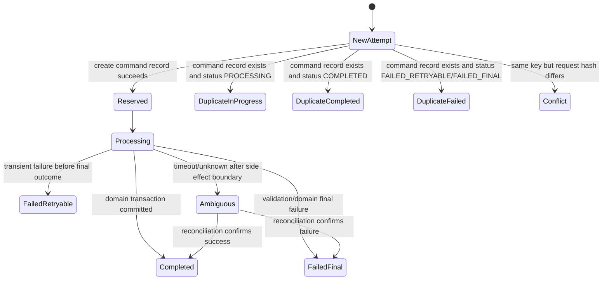
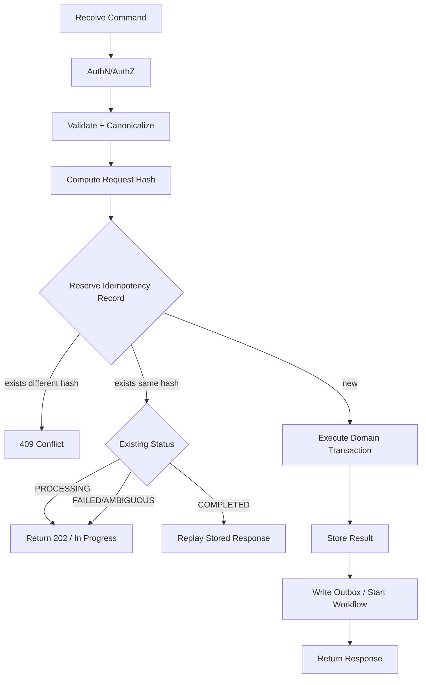
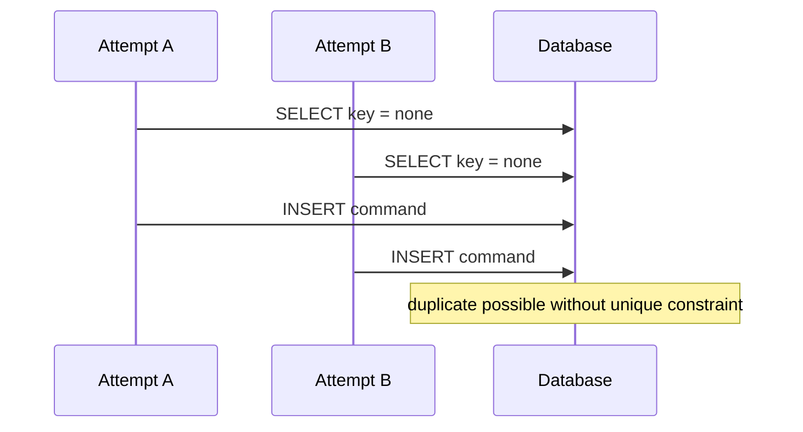
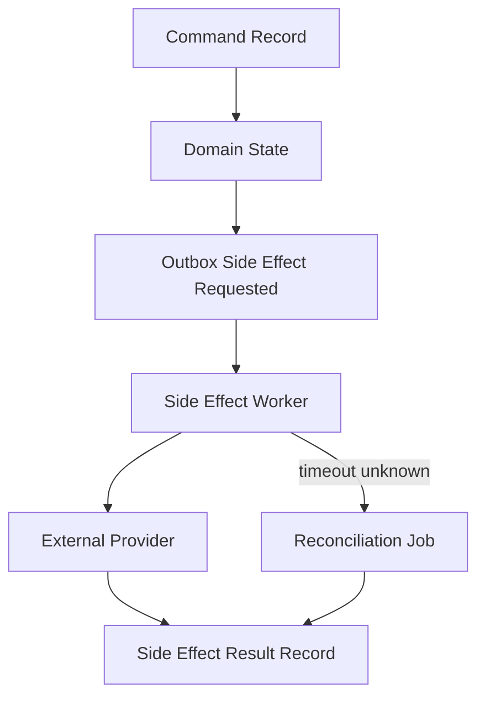

# Part 020 — Idempotent Command Handling di API Layer

> Tujuan bagian ini: membangun mutation endpoint yang aman terhadap retry, timeout, duplicate submit, network failure, dan ambiguous commit. Fokusnya bukan hanya `Idempotency-Key`, tetapi keseluruhan **command handling state machine** dari API sampai database dan side effect.

Command endpoint seperti ini berbahaya bila tidak idempotent:

```http
POST /orders
POST /payments
POST /case-escalations
POST /refunds
PATCH /cases/{id}/status
POST /documents/{id}/approve
```

Mengapa?

Karena client bisa mengirim request lebih dari sekali walaupun user hanya klik sekali.
Penyebabnya:

```txt
- mobile network timeout,
- browser retry,
- load balancer connection reset,
- API Gateway 504,
- backend response hilang setelah commit,
- client tidak menerima response,
- user double click,
- worker retry,
- deployment restart,
- SDK retry,
- upstream event replay.
```

Tanpa idempotent command handling, duplicate request bisa menjadi duplicate effect:

```txt
- order ganda,
- payment ganda,
- email ganda,
- status transition ganda,
- inventory berkurang dua kali,
- enforcement action tereksekusi dua kali,
- audit trail misleading,
- case lifecycle melompat state.
```

Mental model:

```txt
Idempotency bukan fitur HTTP.
Idempotency adalah invariant bisnis yang disimpan secara durable.
```

---

## 1. Apa Itu Command?

Dalam seri ini:

```txt
Command = permintaan untuk mengubah state.
```

Contoh command:

```txt
CreateOrder,
ReserveInventory,
SubmitCase,
ApproveDocument,
EscalateInvestigation,
CreatePayment,
IssueRefund,
AssignInspector,
CloseEnforcementCase.
```

Command punya karakteristik:

```txt
- memiliki intent,
- bisa diterima atau ditolak,
- bisa mengubah state,
- bisa memicu side effect,
- butuh authorization,
- butuh validation,
- butuh audit,
- sering butuh idempotency,
- sering punya lifecycle.
```

Command bukan sekadar HTTP request body.
Command adalah unit semantik.

---

## 2. Idempotency: Definisi yang Berguna di Production

Definisi formal sederhana:

```txt
Operasi idempotent menghasilkan efek akhir yang sama walaupun dijalankan lebih dari sekali dengan input yang sama.
```

Namun untuk API command, definisi yang lebih operasional:

```txt
Untuk identity command yang sama dan payload semantik yang sama, sistem harus melakukan side effect paling banyak sekali, dan duplicate attempt harus mengembalikan hasil yang konsisten.
```

Ada tiga bagian:

```txt
1. Same command identity.
2. Same semantic request.
3. Same durable outcome atau same observable status.
```

Jika hanya memakai `Idempotency-Key` tetapi tidak memverifikasi payload, bug tetap bisa terjadi.

Contoh buruk:

```txt
Request 1: Idempotency-Key: abc, amount=100
Request 2: Idempotency-Key: abc, amount=999
```

Sistem tidak boleh diam-diam menganggap request kedua sama.
Response yang benar biasanya `409 Conflict` atau `422/400` tergantung contract.

---

## 3. Idempotency-Key Bukan Command ID Selalu

Ada beberapa identifier berbeda.

| Identifier | Dibuat oleh | Fungsi |
|---|---|---|
| `Request-Id` | gateway/system | Identitas attempt teknis. Berubah tiap attempt. |
| `Correlation-Id` | client/gateway | Menghubungkan trace lintas service. Bisa sama untuk satu user journey. |
| `Idempotency-Key` | client/caller | Identitas logical command dari sisi caller. Stabil saat retry. |
| `Command-Id` | server atau derived | Identitas durable command di sistem. |
| `Aggregate-Id` | domain | Entity yang diubah command. |
| `Event-Id` | event publisher | Identitas fact yang diterbitkan setelah state berubah. |

Jangan mencampur semuanya.

Salah:

```txt
Gunakan requestId sebagai idempotency key.
```

Mengapa salah?
Karena request id biasanya berbeda pada retry.

Lebih benar:

```txt
Idempotency-Key stabil untuk logical command.
Request-Id berbeda untuk tiap technical attempt.
Correlation-Id mengikat semua attempt dalam user journey.
```

---

## 4. State Machine Command Handling

Idempotent command handling sebaiknya dimodelkan sebagai state machine.



Minimal statuses:

```txt
PROCESSING,
COMPLETED,
FAILED_RETRYABLE,
FAILED_FINAL,
AMBIGUOUS.
```

Untuk sistem sederhana, bisa mulai dari:

```txt
IN_PROGRESS,
COMPLETED,
FAILED.
```

Tetapi untuk payment, case escalation, atau regulatory workflow, bedakan failure final dan ambiguous.

---

## 5. Basic Algorithm

Algorithm umum:

```txt
1. Receive command request.
2. Authenticate and authorize caller.
3. Validate request shape.
4. Canonicalize semantic payload.
5. Compute request hash.
6. Try reserve idempotency record atomically.
7. If record already exists:
   a. If hash differs -> conflict.
   b. If completed -> return stored response/status.
   c. If processing -> return 202/409 depending contract.
   d. If failed retryable -> retry or resume safely.
   e. If ambiguous -> return status requiring reconciliation.
8. Execute domain transaction.
9. Store result and response summary.
10. Publish outbox/event or start workflow safely.
11. Return response.
```

Diagram:



---

## 6. Validation Order: Shape, Auth, Semantics, Idempotency

Urutan matters.

Recommended order:

```txt
1. Parse request.
2. Authenticate caller.
3. Authorize operation.
4. Validate shape and required fields.
5. Canonicalize semantic payload.
6. Build idempotency scope.
7. Reserve/check idempotency record.
8. Execute domain validation inside transaction.
9. Commit command result.
```

Mengapa auth sebelum idempotency?

Karena idempotency key tidak boleh menjadi oracle untuk mengecek existence command milik caller lain.

Mengapa shape validation sebelum idempotency?

Karena request invalid tidak perlu mencemari idempotency store.

Mengapa domain validation sering setelah reserve?

Karena beberapa domain validation terkait state saat command diterima dan perlu hasilnya konsisten pada retry.

Contoh:

```txt
Approve case saat status = REVIEWED.
Retry command approval harus mengembalikan hasil command pertama,
bukan gagal karena status sekarang sudah APPROVED.
```

---

## 7. Idempotency Scope

Key harus discoped.

Jangan hanya:

```txt
idempotency_key = abc
```

Gunakan scope:

```txt
tenant_id + caller_id/client_id + operation + idempotency_key
```

Contoh unique key:

```txt
UNIQUE (tenant_id, caller_id, operation, idempotency_key)
```

Mengapa?

Karena dua tenant berbeda bisa memakai idempotency key yang sama.
Dua operation berbeda juga bisa kebetulan memakai key sama.

Scope yang salah bisa menyebabkan:

```txt
- false duplicate,
- cross-tenant leakage,
- denial of service,
- security issue,
- impossible debugging.
```

---

## 8. Request Hash dan Canonicalization

Request hash digunakan untuk memastikan key yang sama tidak dipakai untuk payload berbeda.

Jangan hash raw JSON string langsung jika field order tidak stabil.

Buruk:

```json
{"amount":100,"currency":"USD"}
```

vs

```json
{"currency":"USD","amount":100}
```

Secara semantic sama, raw string berbeda.

Gunakan canonicalization:

```txt
- normalize field order,
- remove ignored fields,
- normalize numeric precision,
- normalize timestamps bila contract mengizinkan,
- include operation name,
- include caller/tenant scope,
- include version bila schema berubah.
```

Pseudocode:

```java
String canonical = canonicalJson(Map.of(
    "operation", "CreatePayment",
    "tenantId", tenantId,
    "callerId", callerId,
    "amount", money.amountMinorUnits(),
    "currency", money.currency(),
    "orderId", orderId
));

String requestHash = sha256(canonical);
```

Jangan masukkan field volatile:

```txt
requestId,
traceId,
signature timestamp,
client local timestamp,
headers yang tidak memengaruhi semantics.
```

---

## 9. SQL/Aurora/RDS Command Store Pattern

Schema contoh:

```sql
CREATE TABLE api_command_idempotency (
    id BIGSERIAL PRIMARY KEY,
    tenant_id VARCHAR(64) NOT NULL,
    caller_id VARCHAR(128) NOT NULL,
    operation VARCHAR(128) NOT NULL,
    idempotency_key VARCHAR(256) NOT NULL,
    request_hash CHAR(64) NOT NULL,
    command_id UUID NOT NULL,
    aggregate_type VARCHAR(128),
    aggregate_id VARCHAR(128),
    status VARCHAR(32) NOT NULL,
    http_status INT,
    response_body JSONB,
    error_code VARCHAR(128),
    locked_until TIMESTAMPTZ,
    expires_at TIMESTAMPTZ NOT NULL,
    created_at TIMESTAMPTZ NOT NULL DEFAULT now(),
    updated_at TIMESTAMPTZ NOT NULL DEFAULT now(),
    UNIQUE (tenant_id, caller_id, operation, idempotency_key)
);

CREATE INDEX idx_api_command_expiry
    ON api_command_idempotency (expires_at);

CREATE INDEX idx_api_command_status
    ON api_command_idempotency (status, updated_at);
```

Reserve command atomically:

```sql
INSERT INTO api_command_idempotency (
    tenant_id,
    caller_id,
    operation,
    idempotency_key,
    request_hash,
    command_id,
    status,
    expires_at
)
VALUES (?, ?, ?, ?, ?, ?, 'PROCESSING', now() + interval '24 hours')
ON CONFLICT (tenant_id, caller_id, operation, idempotency_key)
DO NOTHING;
```

Jika insert berhasil, attempt ini owner baru.
Jika tidak, baca existing record.

Important:

```txt
Unique constraint adalah lock-free correctness primitive.
Jangan implementasikan idempotency dengan read-then-insert tanpa unique constraint.
```

Read-then-insert race:



---

## 10. Domain Transaction dengan Command Record

Ada dua pilihan umum.

### Option A — Command Record dan Domain Write dalam Satu Transaction

Cocok bila idempotency store dan domain data berada di database yang sama.

```sql
BEGIN;

-- reserve idempotency record or lock existing
-- validate current aggregate state
-- update domain tables
-- write outbox event
-- update idempotency record COMPLETED + response summary

COMMIT;
```

Keuntungan:

```txt
- atomic,
- sederhana untuk relational DB,
- outbox bisa satu transaction,
- failure semantics lebih jelas.
```

Kekurangan:

```txt
- transaksi bisa menjadi besar bila response body besar,
- tidak cocok bila side effect external dilakukan di tengah transaction,
- contention jika command store terlalu hot.
```

### Option B — Reserve Record, Lalu Domain Transaction Terpisah

Cocok bila command store berada di DynamoDB atau operasi memulai workflow.

```txt
1. Reserve idempotency record.
2. Execute domain transaction.
3. Update idempotency record with outcome.
```

Kelemahan:

```txt
Ada gap antara domain commit dan idempotency completion update.
```

Perlu reconciliation.

---

## 11. DynamoDB Command Store Pattern

DynamoDB cocok untuk idempotency store karena conditional write kuat untuk reserve key.

Key design:

```txt
PK = TENANT#{tenantId}#CALLER#{callerId}#OP#{operation}
SK = IDEMPOTENCY#{idempotencyKey}
```

Attributes:

```txt
requestHash,
commandId,
status,
httpStatus,
responseSummary,
errorCode,
expiresAt,
createdAt,
updatedAt,
lockExpiresAt.
```

Reserve dengan condition:

```json
{
  "TableName": "ApiCommandIdempotency",
  "Item": {
    "pk": {"S": "TENANT#t1#CALLER#c1#OP#CreatePayment"},
    "sk": {"S": "IDEMPOTENCY#abc"},
    "requestHash": {"S": "..."},
    "commandId": {"S": "cmd-123"},
    "status": {"S": "PROCESSING"},
    "expiresAt": {"N": "1780000000"}
  },
  "ConditionExpression": "attribute_not_exists(pk) AND attribute_not_exists(sk)"
}
```

Jika `ConditionalCheckFailedException`, baca item existing.

DynamoDB conditional writes dapat menjadi primitive idempotency karena write dilakukan hanya jika kondisi yang diharapkan masih benar.

---

## 12. In-Progress Duplicate Handling

Saat duplicate attempt datang sementara command pertama masih `PROCESSING`, ada beberapa response strategy.

| Strategy | Response | Cocok untuk |
|---|---|---|
| Return `202 Accepted` + status URL | Caller polling | Long-running command |
| Return `409 Conflict` with `COMMAND_IN_PROGRESS` | Client harus menunggu | Command yang tidak boleh concurrent |
| Wait briefly then replay if completed | UX synchronous | Command sangat cepat dan duplicate immediate |
| Attach to same workflow status | Workflow command | Step Functions / job pattern |

Jangan menjalankan domain transaction kedua.

Response contoh:

```json
{
  "status": "PROCESSING",
  "commandId": "cmd-123",
  "statusUrl": "/commands/cmd-123",
  "retryable": true,
  "retryAfterSeconds": 2
}
```

---

## 13. Completed Duplicate Handling

Jika status `COMPLETED`, duplicate attempt harus mengembalikan hasil yang konsisten.

Ada dua model.

### Replay Full Response

Simpan response body dan status code.

```txt
Duplicate -> return exactly same HTTP status and response body.
```

Cocok untuk:

```txt
- create payment,
- create order,
- create resource,
- command yang response-nya kecil.
```

### Return Current Resource Representation

Duplicate return current state dari resource.

Cocok bila:

```txt
- resource state bisa berubah setelah command,
- response original tidak perlu identik,
- contract menyatakan response adalah current representation.
```

Lebih aman untuk idempotency adalah replay response summary minimal:

```json
{
  "commandId": "cmd-123",
  "resourceId": "payment-789",
  "status": "SUCCEEDED"
}
```

Jangan simpan response besar atau sensitif tanpa redaction/encryption policy.

---

## 14. Failed Duplicate Handling

Failure tidak selalu sama.

| Failure type | Retry behavior | Example |
|---|---|---|
| Validation final | Jangan retry | Amount invalid, forbidden transition |
| Authorization final | Jangan retry | Caller tidak boleh operasi |
| Conflict final | Caller action required | Version mismatch |
| Transient infra | Retry possible | DB timeout before transaction |
| Ambiguous | Check/reconcile | Provider timeout after side effect call |

Jangan semua `FAILED` diperlakukan sama.

Untuk command kritikal, gunakan:

```txt
FAILED_FINAL,
FAILED_RETRYABLE,
AMBIGUOUS.
```

---

## 15. External Side Effect: Boundary Paling Berbahaya

Database transaction bisa rollback.
External side effect tidak selalu bisa rollback.

Contoh:

```txt
charge payment,
send email,
submit government filing,
create third-party ticket,
publish irreversible notification,
call vendor that lacks idempotency.
```

Pattern aman:

```txt
1. Durable command record.
2. Durable side-effect attempt record.
3. Provider idempotency key bila tersedia.
4. Outbox/workflow untuk eksekusi side effect.
5. Reconciliation untuk ambiguous result.
```

Diagram:



Jangan panggil provider irreversible di tengah transaksi database panjang.

---

## 16. Idempotency dengan Step Functions

Jika command memulai workflow:

```txt
POST /case-escalations
-> create command record
-> StartExecution Step Functions
-> return command/workflow status
```

Untuk Standard Workflows, `StartExecution` idempotent bila name dan input sama saat execution masih berjalan. Jika execution sudah closed atau input berbeda, API mengembalikan error `ExecutionAlreadyExists`, dan nama bisa dipakai ulang setelah 90 hari menurut dokumentasi AWS.

Tetapi jangan mengandalkan ini sebagai satu-satunya idempotency API layer.

Mengapa?

```txt
- Express Workflows tidak punya idempotency StartExecution yang sama.
- Command response contract tetap perlu disimpan.
- Caller butuh status endpoint.
- Execution name uniqueness bukan pengganti domain invariant.
- Input canonicalization tetap perlu.
```

Pattern:

```txt
executionName = safeSlug(commandId or idempotencyScopeHash)
```

Simpan mapping:

```txt
commandId -> stepFunctionsExecutionArn
```

---

## 17. API Gateway, Lambda Powertools, dan Idempotency

AWS Lambda Powertools menyediakan utility idempotency untuk membuat Lambda handler retry-safe dengan persistence layer seperti DynamoDB.

Itu berguna untuk:

```txt
- Lambda-backed API endpoint,
- async consumer,
- event handler,
- simple command handler,
- deterministic response replay.
```

Tetapi tetap pahami boundary:

```txt
Powertools membantu implementasi mekanik idempotency.
Ia tidak menggantikan desain command semantics, request hash, domain transaction, external side-effect reconciliation, dan status contract.
```

Gunakan library untuk mengurangi boilerplate.
Jangan gunakan library untuk menghindari reasoning.

---

## 18. Optimistic Concurrency dan Idempotency Berbeda

Idempotency menjawab:

```txt
Apakah command yang sama dijalankan lebih dari sekali?
```

Optimistic concurrency menjawab:

```txt
Apakah command ini masih valid terhadap versi aggregate saat ini?
```

Contoh:

```http
PATCH /cases/case-123/status
Idempotency-Key: k-1
If-Match: "version-7"
```

Kemungkinan:

```txt
- First attempt valid, update version 7 -> 8.
- Retry dengan key sama harus return original success.
- New command dengan key berbeda tapi If-Match version 7 harus gagal 412.
```

Tanpa idempotency, retry bisa gagal palsu karena version sudah berubah oleh attempt pertama.
Tanpa optimistic concurrency, command berbeda bisa overwrite state tanpa sadar.

Keduanya dibutuhkan.

---

## 19. Idempotency TTL

Idempotency record tidak harus disimpan selamanya untuk semua operasi.

Tetapi TTL harus sesuai risiko bisnis.

| Command | Suggested TTL thinking |
|---|---|
| Create UI draft | pendek, misal jam/hari |
| Create order | hari/minggu sesuai retry dan support window |
| Payment/refund | panjang sesuai audit/chargeback/reconciliation |
| Regulatory enforcement action | sangat panjang atau permanen sebagai audit record |
| Export report | sampai job/result expired |

Jangan pilih TTL hanya karena biaya storage.

Pertanyaan desain:

```txt
Berapa lama caller boleh retry?
Berapa lama duplicate request masih mungkin datang?
Berapa lama audit membutuhkan bukti?
Apakah command punya external irreversible side effect?
Apa konsekuensi jika key expired lalu request lama datang lagi?
```

Jika key expired, duplicate lama bisa menjadi command baru.
Untuk side effect kritikal, TTL pendek bisa berbahaya.

---

## 20. Security Considerations

Idempotency store bisa membocorkan informasi bila salah desain.

Risiko:

```txt
- caller menebak idempotency key milik caller lain,
- response replay mengembalikan data milik tenant lain,
- status endpoint expose command existence,
- idempotency key disimpan mentah dan muncul di log,
- response body sensitif disimpan tanpa redaction,
- key tidak discoped by tenant/caller/operation.
```

Mitigasi:

```txt
- scope key dengan tenant/caller/operation,
- authorize sebelum lookup,
- hash idempotency key di logs,
- encrypt sensitive response if stored,
- store response summary, not full sensitive payload,
- avoid user-provided key as primary public identifier,
- use status endpoint authorization.
```

---

## 21. Observability

Metric:

```txt
idempotency_reserve_success_count,
idempotency_duplicate_in_progress_count,
idempotency_duplicate_completed_count,
idempotency_conflict_count,
idempotency_ambiguous_count,
command_processing_duration_ms,
command_completion_count,
command_failed_final_count,
command_failed_retryable_count,
command_reconciliation_count,
external_side_effect_duplicate_prevented_count.
```

Log fields:

```txt
requestId,
correlationId,
tenantId bucket/hash,
operation,
idempotencyKeyHash,
requestHash,
commandId,
aggregateId,
statusBefore,
statusAfter,
httpStatus,
retryAttempt,
sideEffectProvider,
providerIdempotencyKeyHash,
errorCode.
```

Trace:

```txt
API receive -> idempotency reserve -> domain transaction -> outbox/workflow -> side effect -> command complete
```

Audit trail:

```txt
who requested,
when,
what operation,
which aggregate,
which previous state,
which resulting state,
which idempotency scope,
which side effects,
which reconciliation outcome.
```

---

## 22. Testing Matrix

Test idempotency with concurrency, not just sequential retry.

```txt
[ ] Same key + same payload sequential retry returns same result.
[ ] Same key + different payload returns conflict.
[ ] 100 concurrent same-key attempts produce one domain effect.
[ ] Timeout after domain commit returns success/status on retry.
[ ] Timeout before domain commit retries safely.
[ ] External provider timeout enters AMBIGUOUS.
[ ] Reconciliation resolves AMBIGUOUS.
[ ] Expired key behavior matches documented contract.
[ ] Unauthorized caller cannot discover another caller's command.
[ ] Replay response does not expose sensitive data.
[ ] Duplicate in-progress returns 202/409 as contract states.
[ ] Optimistic concurrency retry with same key succeeds/replays.
[ ] New key with stale version fails 412.
```

Concurrency test pseudocode:

```java
int attempts = 100;
ExecutorService pool = Executors.newFixedThreadPool(20);
List<Future<Response>> futures = new ArrayList<>();

for (int i = 0; i < attempts; i++) {
    futures.add(pool.submit(() -> callCreatePayment(
        "Idempotency-Key", "same-key-123",
        Map.of("amount", 1000, "currency", "USD")
    )));
}

List<Response> responses = futures.stream().map(Future::get).toList();

assertThat(countPaymentRowsForCommand("same-key-123")).isEqualTo(1);
assertThat(countProviderCharges("same-key-123")).isEqualTo(1);
assertThat(responses).allMatch(r -> r.isSuccess() || r.isAcceptedInProgress());
```

---

## 23. Example: Create Payment Command

Request:

```http
POST /payments
Idempotency-Key: pay-20260706-0001
Content-Type: application/json
```

```json
{
  "orderId": "ord-123",
  "amount": 125000,
  "currency": "IDR",
  "paymentMethodId": "pm-456"
}
```

Flow:

```txt
1. API validates caller can pay order ord-123.
2. Build idempotency scope tenant+caller+CreatePayment+key.
3. Compute request hash.
4. Reserve command record.
5. Check order payable.
6. Mark payment as PENDING.
7. Write outbox PaymentChargeRequested.
8. Return 202 or 201 depending synchronous/asynchronous contract.
9. Worker calls provider using provider idempotency key.
10. Reconciliation handles provider timeout.
```

Key point:

```txt
The API command completion and provider charge completion do not have to be the same synchronous boundary.
```

---

## 24. Example: Case Status Transition

Request:

```http
PATCH /cases/case-123/status
Idempotency-Key: esc-abc
If-Match: "case-version-17"
```

```json
{
  "targetStatus": "ESCALATED",
  "reasonCode": "HIGH_RISK_FINDING"
}
```

Flow:

```txt
1. Authorize case transition.
2. Reserve command key.
3. Check request hash.
4. In transaction:
   - load case with version 17,
   - validate transition REVIEWED -> ESCALATED,
   - update status,
   - increment version,
   - write audit event,
   - write outbox CaseEscalated.
5. Mark command completed.
6. Return status.
```

Retry behavior:

```txt
Same key + same payload -> return original success.
Different key + stale If-Match -> 412.
Same key + different targetStatus -> 409 idempotency conflict.
```

This distinction is critical in regulatory workflow systems.

---

## 25. Anti-Pattern

### Anti-Pattern 1 — Idempotency Key Without Request Hash

Same key can accidentally apply to different request.
This is dangerous.

### Anti-Pattern 2 — Read-Then-Insert Without Unique Constraint

Concurrent attempts can both pass the read and both insert effects.

### Anti-Pattern 3 — Store Only “Seen Key”

A boolean seen flag is not enough.
You need status, request hash, outcome, timestamps, and failure classification.

### Anti-Pattern 4 — Retry Non-Idempotent External Side Effect

Calling payment provider twice without provider idempotency key is how duplicate charges happen.

### Anti-Pattern 5 — Treat 504 as Failed Command

504 is unknown, not failed.

### Anti-Pattern 6 — TTL Too Short for Critical Commands

Expired idempotency record can allow duplicate old command.

### Anti-Pattern 7 — No Status Endpoint

If command can outlive request, status endpoint is part of the contract.

---

## 26. Production Checklist

```txt
[ ] Every mutation endpoint has command semantics documented.
[ ] Idempotency-Key required for non-trivial command.
[ ] Idempotency scope includes tenant/caller/operation.
[ ] Request hash uses canonical semantic payload.
[ ] Same key + different hash returns conflict.
[ ] Reserve operation is atomic via unique constraint/conditional write.
[ ] Domain transaction cannot double-apply command.
[ ] Duplicate in-progress response is defined.
[ ] Duplicate completed response is defined.
[ ] Failure statuses distinguish final, retryable, and ambiguous.
[ ] External side effect has provider idempotency or side-effect record.
[ ] Timeout after commit is handled by status/replay.
[ ] TTL matches business risk.
[ ] Idempotency key is not leaked in logs unmasked.
[ ] Response replay does not expose unauthorized/sensitive data.
[ ] Metrics distinguish new, duplicate, conflict, in-progress, ambiguous.
[ ] Concurrency tests prove one side effect under 100 duplicate attempts.
```

---

## 27. Mental Model Ringkas

```txt
API request adalah attempt.
Command adalah logical intent.
Idempotency key menghubungkan attempts ke command yang sama.
Request hash memastikan command yang sama tidak berubah makna.
Command store menyimpan lifecycle.
Database constraint/conditional write memberi atomicity.
Outbox/workflow menjaga side effect tidak hilang.
Status endpoint mengatasi unknown outcome.
Reconciliation menyelesaikan ambiguity.
```

Idempotency bukan “return same response kalau key sama”.
Itu hanya permukaan.

Idempotency production adalah kemampuan sistem untuk berkata:

```txt
Saya tahu command ini sudah pernah diterima,
saya tahu apakah payload-nya sama,
saya tahu apakah sedang diproses atau sudah selesai,
saya tahu side effect apa yang sudah terjadi,
dan saya bisa memberi caller jawaban yang aman tanpa menjalankan efek ganda.
```

---

## 28. Referensi

- Idempotency — Powertools for AWS Lambda Java — https://docs.aws.amazon.com/powertools/java/latest/utilities/idempotency/
- Idempotency — Powertools for AWS Lambda Python — https://docs.aws.amazon.com/powertools/python/latest/utilities/idempotency/
- Working with items and attributes in DynamoDB: Conditional write idempotence — https://docs.aws.amazon.com/amazondynamodb/latest/developerguide/WorkingWithItems.html
- TransactWriteItems — Amazon DynamoDB API Reference — https://docs.aws.amazon.com/amazondynamodb/latest/APIReference/API_TransactWriteItems.html
- Error handling with DynamoDB — https://docs.aws.amazon.com/amazondynamodb/latest/developerguide/Programming.Errors.html
- StartExecution — AWS Step Functions API Reference — https://docs.aws.amazon.com/step-functions/latest/apireference/API_StartExecution.html
- Best practices for Step Functions — https://docs.aws.amazon.com/step-functions/latest/dg/sfn-best-practices.html
- Retry with backoff pattern — https://docs.aws.amazon.com/prescriptive-guidance/latest/cloud-design-patterns/retry-backoff.html
