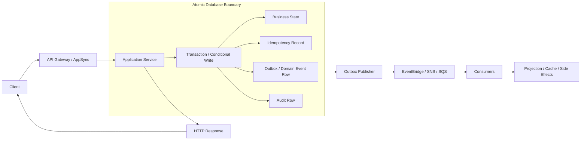
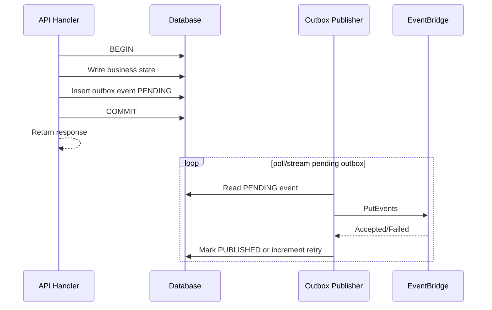
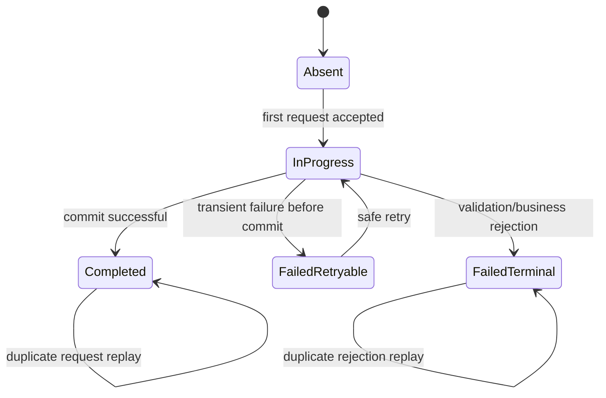
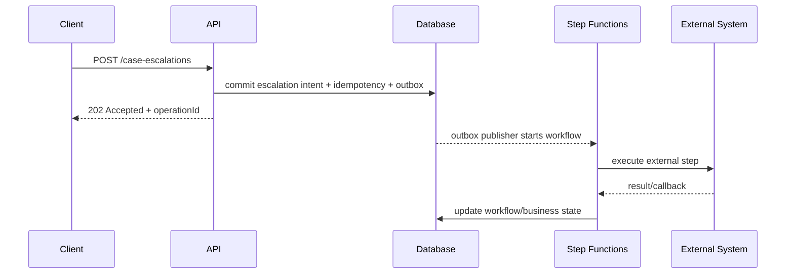
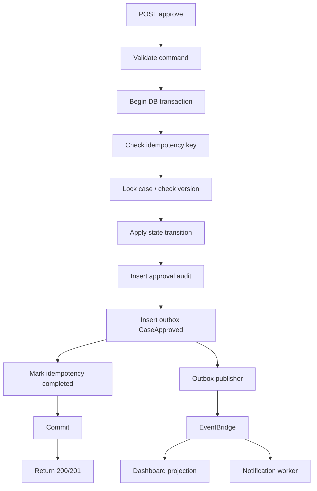

# Part 021 — API-to-Database Transaction Boundary

> Tujuan bagian ini: memahami batas transaksi antara API layer dan database layer sehingga mutation endpoint tidak hanya "berhasil di happy path", tetapi tetap benar saat timeout, retry, duplicate request, partial failure, failover, lock contention, dan downstream event delivery gagal.

API endpoint yang menulis database tampak sederhana:

```txt
client -> API Gateway -> service -> database -> response
```

Tetapi production reality jauh lebih tajam:

```txt
client -> API Gateway -> service -> database commit -> response lost
client -> API Gateway -> service -> database timeout -> commit maybe happened
client -> API Gateway -> service -> database success -> event publish failed
client -> API Gateway -> service -> database deadlock -> retry unsafe?
client -> API Gateway -> service -> DB write success -> cache update failed
client -> API Gateway -> service -> partial external payment call -> DB rollback impossible
```

Pertanyaan yang harus dijawab bukan:

```txt
"Bagaimana cara insert row dari API?"
```

Pertanyaannya:

```txt
"Apa atomic boundary dari command ini, apa yang boleh diulang, apa yang tidak boleh diulang, dan state mana yang menjadi sumber kebenaran setelah failure?"
```

Itulah **API-to-database transaction boundary**.

---

## 1. Mental Model

Transaction boundary adalah garis yang memisahkan:

```txt
- operasi yang bisa dijadikan atomic,
- operasi yang hanya bisa eventual,
- operasi yang harus direkonsiliasi,
- operasi yang tidak boleh dilakukan sebelum commit,
- operasi yang tidak boleh dilakukan dua kali,
- operasi yang harus bisa di-replay.
```

Dalam database relational, boundary transaksi biasanya terlihat jelas:

```sql
BEGIN;
  INSERT INTO orders (...);
  INSERT INTO order_items (...);
  INSERT INTO idempotency_records (...);
COMMIT;
```

Tetapi dalam sistem AWS yang memakai API Gateway, Lambda/ECS, Aurora/RDS, DynamoDB, EventBridge, SNS, SQS, Step Functions, dan cache, boundary-nya sering kabur.

Contoh boundary yang salah:

```java
createOrderInDatabase();
publishOrderCreatedEvent();
chargePayment();
updateCache();
return 201;
```

Kode ini terlihat linear, tetapi tidak atomic. Empat operasi itu menyentuh empat sistem berbeda:

```txt
1. database,
2. event bus,
3. payment provider,
4. cache.
```

Tidak ada satu transaksi database yang bisa menjamin semuanya commit atau rollback bersama.

Maka model yang benar:

```txt
API command should commit one durable source-of-truth state.
Everything outside that atomic write must be derived, retried, reconciled, or compensated.
```

---

## 2. Diagram Besar Boundary



Invariant utama:

```txt
Jika business state berubah, idempotency/audit/outbox yang relevan ikut berubah dalam atomic boundary yang sama.
```

Jika event publish gagal setelah commit, outbox publisher bisa retry.
Jika client retry karena response hilang, idempotency record bisa replay response.
Jika projection tertinggal, read model bisa dibangun ulang dari durable state/event.

---

## 3. Apa yang Boleh Masuk ke Database Transaction?

Masukkan ke transaksi hanya hal yang memenuhi syarat ini:

```txt
- menggunakan database yang sama,
- berada dalam ownership boundary yang sama,
- perlu atomic terhadap business state,
- tidak melakukan network call eksternal,
- tidak menunggu operasi lambat,
- tidak memegang lock lebih lama dari perlu,
- bisa selesai dalam latency budget command.
```

Contoh yang biasanya boleh masuk:

```txt
- insert/update aggregate utama,
- insert idempotency record,
- insert audit event,
- insert outbox row,
- update version number,
- condition check state transition,
- append domain event row,
- enforce uniqueness via unique constraint,
- reserve local resource yang dimiliki service.
```

Contoh yang biasanya tidak boleh masuk:

```txt
- publish ke EventBridge secara langsung,
- call payment provider,
- kirim email,
- update OpenSearch,
- update Redis cache,
- call service lain,
- call API partner,
- generate file besar,
- melakukan HTTP callback,
- menunggu human approval.
```

Rule praktis:

```txt
No remote I/O inside a database transaction unless you can prove the failure semantics are safe.
```

Dalam banyak kasus, jawabannya: tidak aman.

---

## 4. Unit of Work yang Benar

Unit of Work bukan "semua kode dalam handler".

Unit of Work adalah:

```txt
Semua perubahan durable yang harus commit atau rollback bersama untuk mempertahankan invariant bisnis.
```

Contoh: `ApproveCaseCommand`.

Business invariant:

```txt
Case hanya boleh berubah dari SUBMITTED ke APPROVED jika:
- approver punya authority,
- case belum closed,
- evidence sudah lengkap,
- approval record dibuat,
- case version naik,
- audit trail tercatat,
- event CaseApproved diproduksi untuk downstream.
```

Atomic write:

```txt
- update case status SUBMITTED -> APPROVED,
- increment version,
- insert approval row,
- insert audit row,
- insert outbox row CaseApproved,
- insert/update idempotency record.
```

Bukan atomic write:

```txt
- notify investigator,
- update dashboard projection,
- index to OpenSearch,
- invalidate cache,
- send email,
- trigger SLA workflow.
```

Mereka adalah derived effects.

---

## 5. Transaction Boundary untuk Relational Database

Untuk Aurora/RDS PostgreSQL atau MySQL, pattern paling umum:

```txt
1. validate request shape,
2. normalize command,
3. open transaction,
4. lock/read aggregate with expected version,
5. enforce state transition,
6. write business mutation,
7. write idempotency record,
8. write outbox row,
9. commit,
10. return response,
11. publisher emits outbox asynchronously.
```

Contoh PostgreSQL-style:

```sql
BEGIN;

SELECT id, status, version
FROM cases
WHERE id = :case_id
FOR UPDATE;

-- Application verifies allowed transition.

UPDATE cases
SET status = 'APPROVED',
    version = version + 1,
    updated_at = now()
WHERE id = :case_id
  AND status = 'SUBMITTED';

INSERT INTO case_approvals (
  case_id,
  approved_by,
  approved_at,
  decision_reason
) VALUES (
  :case_id,
  :user_id,
  now(),
  :reason
);

INSERT INTO outbox_events (
  event_id,
  aggregate_type,
  aggregate_id,
  event_type,
  event_version,
  payload,
  created_at,
  publish_status
) VALUES (
  :event_id,
  'Case',
  :case_id,
  'CaseApproved',
  1,
  :payload_json,
  now(),
  'PENDING'
);

COMMIT;
```

Kekuatan pattern ini:

```txt
- business state dan event intent tidak bisa terpisah,
- event publish boleh gagal tanpa kehilangan event,
- retry API bisa dikontrol dengan idempotency key,
- downstream bisa eventual,
- audit bisa dipercaya.
```

Kelemahannya:

```txt
- membutuhkan publisher outbox,
- membutuhkan cleanup/archival outbox,
- membutuhkan observability atas stuck pending event,
- membutuhkan ordering strategy bila event per aggregate harus berurutan.
```

---

## 6. Transaction Boundary untuk DynamoDB

DynamoDB tidak sama dengan relational database. Mental modelnya:

```txt
DynamoDB correctness berasal dari key design, condition expression, version attribute, dan TransactWriteItems saat benar-benar perlu atomic multi-item.
```

AWS mendokumentasikan bahwa DynamoDB transactions bisa mengelompokkan beberapa aksi menjadi satu operasi all-or-nothing dengan `TransactWriteItems` atau `TransactGetItems`; `TransactWriteItems` dapat menggabungkan sampai 100 write actions dalam satu Region dan account yang sama, dengan batas aggregate item size 4 MB.

Pattern command write:

```txt
- gunakan condition expression untuk mencegah invalid transition,
- gunakan version attribute untuk optimistic concurrency,
- gunakan idempotency item untuk duplicate command,
- gunakan outbox/event item dalam transaction bila event harus atomic dengan state,
- hindari transaksi luas lintas banyak aggregate.
```

Contoh single-item conditional update:

```json
{
  "TableName": "CaseTable",
  "Key": {
    "PK": { "S": "CASE#123" },
    "SK": { "S": "META" }
  },
  "UpdateExpression": "SET #status = :approved, #version = #version + :one",
  "ConditionExpression": "#status = :submitted AND #version = :expectedVersion",
  "ExpressionAttributeNames": {
    "#status": "status",
    "#version": "version"
  },
  "ExpressionAttributeValues": {
    ":approved": { "S": "APPROVED" },
    ":submitted": { "S": "SUBMITTED" },
    ":expectedVersion": { "N": "7" },
    ":one": { "N": "1" }
  }
}
```

DynamoDB condition expression menentukan apakah `PutItem`, `UpdateItem`, atau `DeleteItem` boleh memodifikasi item. Jika kondisi false, operasi gagal dan state tidak berubah.

Contoh `TransactWriteItems` logical model:

```txt
TransactWriteItems:
  - ConditionCheck idempotency key does not exist OR completed with same hash
  - Update CASE#123 status SUBMITTED -> APPROVED with expected version
  - Put APPROVAL#abc
  - Put OUTBOX#event-id
  - Put IDEMPOTENCY#key status COMPLETED
```

Trade-off:

```txt
- TransactWriteItems memberi atomicity lintas beberapa item.
- TransactWriteItems lebih mahal dan punya batas ukuran/aksi.
- Transaction conflict harus dianggap sebagai normal concurrency signal.
- Global Tables punya semantics khusus yang harus dianalisis per workload.
```

---

## 7. The Dual-Write Trap

Dual write adalah akar banyak bug distributed system.

Contoh salah:

```java
repository.save(order);
eventBridge.putEvents(orderCreatedEvent);
```

Failure matrix:

| DB Write | Event Publish | Result |
|---|---|---|
| gagal | gagal | aman, tidak ada perubahan |
| gagal | sukses | event palsu, downstream korup |
| sukses | gagal | source berubah, downstream tidak tahu |
| sukses | sukses | happy path |
| sukses | unknown | ambiguous, butuh rekonsiliasi |

AWS Prescriptive Guidance menjelaskan transactional outbox pattern untuk menyelesaikan masalah dual write saat operasi melibatkan database write dan message/event notification; failure pada salah satu operasi dapat menyebabkan data tidak konsisten.

Pattern benar:

```txt
Dalam transaksi database:
  - tulis business state,
  - tulis outbox row.

Di luar transaksi:
  - publisher membaca outbox row PENDING,
  - publish ke EventBridge/SNS/SQS,
  - mark PUBLISHED atau retry.
```

Diagram:



Critical invariant:

```txt
Tidak boleh ada business state change tanpa durable event intent bila downstream bergantung pada event tersebut.
```

---

## 8. Response Lost After Commit

Salah satu failure paling sering diabaikan:

```txt
Database commit berhasil.
Backend mengirim response.
Connection putus.
Client menerima timeout atau 502/504.
Client tidak tahu apakah command berhasil.
```

Tanpa idempotency:

```txt
client retry -> duplicate command -> duplicate state/effect
```

Dengan idempotency:

```txt
client retry dengan key sama -> server menemukan completed command -> replay response atau return canonical resource state
```

State machine:



API response strategy:

| Condition | Response |
|---|---|
| first command committed | `201 Created` / `200 OK` |
| duplicate same key + same payload + completed | replay previous response or `200 OK` canonical state |
| duplicate same key + different payload | `409 Conflict` |
| command still in progress | `202 Accepted` or `409 Conflict` with retry-after depending semantics |
| validation failed before durable write | `400`/`422` |
| optimistic concurrency conflict | `409 Conflict` |

---

## 9. Transaction Scope Anti-Patterns

### 9.1 Remote Call Inside Transaction

```java
transaction.begin();
caseRepository.approve(caseId);
paymentClient.charge(...);       // remote I/O inside DB transaction
outboxRepository.insert(...);
transaction.commit();
```

Masalah:

```txt
- lock ditahan selama network call,
- payment mungkin sukses lalu DB rollback,
- timeout payment ambiguous,
- retry transaction bisa men-charge ulang,
- database pool cepat habis,
- deadlock probability naik.
```

Lebih aman:

```txt
1. Commit intent/reservation local.
2. Emit event/workflow task.
3. Execute remote side effect with idempotency key.
4. Record result.
5. Compensate jika perlu.
```

### 9.2 Transaction Terlalu Besar

```txt
- update banyak aggregate sekaligus,
- loop ribuan row dalam satu request,
- backfill dilakukan lewat API transaction,
- user action memicu table scan + update,
- lock semua dependent entity.
```

Dampak:

```txt
- latency tinggi,
- lock contention,
- deadlock,
- connection pool exhaustion,
- failover recovery lebih sakit,
- retry mahal dan tidak aman.
```

Pisahkan menjadi:

```txt
- command kecil,
- batch job asynchronous,
- workflow orchestration,
- chunked migration,
- eventual projection.
```

### 9.3 Updating Cache as Part of Truth

```java
repository.save(entity);
redis.set(key, entity);
```

Jika Redis update gagal setelah DB commit, cache stale. Jika Redis update sukses lalu DB rollback, cache palsu.

Lebih aman:

```txt
- cache-aside dengan TTL,
- invalidate via event after commit,
- versioned cache key,
- projection rebuild,
- stale-while-revalidate untuk read-heavy non-critical data.
```

### 9.4 Direct Cross-Service DB Write

```txt
Service A transaction:
  update A database
  update B database directly
```

Ini menghancurkan ownership boundary.

Gunakan:

```txt
- API command ke owning service,
- event-driven projection,
- saga/workflow,
- shared kernel hanya untuk truly shared immutable reference data.
```

---

## 10. Isolation Level: Jangan Dianggap Default Selalu Aman

Relational database memberi isolation level, tetapi business correctness tidak otomatis terjamin.

Failure yang perlu dipahami:

```txt
- lost update,
- dirty read,
- non-repeatable read,
- phantom read,
- write skew,
- deadlock,
- serialization failure,
- stale replica read.
```

Contoh lost update:

```txt
T1 reads case.version=7, status=SUBMITTED
T2 reads case.version=7, status=SUBMITTED
T1 approves -> version 8
T2 rejects -> version 8 or overwrites approval
```

Mitigasi:

```sql
UPDATE cases
SET status = :new_status,
    version = version + 1
WHERE id = :case_id
  AND version = :expected_version
  AND status = :expected_status;
```

Jika affected row = 0:

```txt
409 Conflict, not 500.
```

Karena ini bukan infrastructure failure. Ini concurrency conflict.

---

## 11. Pessimistic vs Optimistic Concurrency

### Optimistic Concurrency

Gunakan ketika:

```txt
- konflik jarang,
- command pendek,
- user bisa retry/refresh,
- aggregate punya version,
- latency penting.
```

Pattern:

```txt
read version -> send command with expectedVersion -> update where version matches
```

Kelebihan:

```txt
- lock duration rendah,
- scalable,
- cocok untuk API.
```

Kekurangan:

```txt
- conflict harus ditangani eksplisit,
- client perlu stale-state strategy,
- high contention bisa menyebabkan banyak retry.
```

### Pessimistic Locking

Gunakan ketika:

```txt
- konflik sering,
- state transition harus serial,
- operasi pendek,
- database relational,
- jumlah row kecil,
- user tidak boleh membuat keputusan dari stale state.
```

Pattern:

```sql
SELECT * FROM cases WHERE id = :id FOR UPDATE;
```

Kelebihan:

```txt
- serialisasi jelas,
- business invariant mudah dijaga.
```

Kekurangan:

```txt
- lock contention,
- deadlock,
- timeout,
- pool pressure,
- buruk untuk operasi panjang.
```

Rule:

```txt
Pessimistic lock hanya aman bila transaksi sangat pendek dan tidak melakukan remote I/O.
```

---

## 12. Retry Boundary

Tidak semua error boleh di-retry.

| Error | Retry? | Reason |
|---|---|---|
| network timeout before reaching service | yes, with idempotency key | request mungkin belum diproses |
| API Gateway 429 | yes, after backoff | capacity signal |
| 409 version conflict | usually no automatic retry | business state berubah |
| DB deadlock | yes, if transaction idempotent | transient concurrency failure |
| DB unique constraint duplicate idempotency key | inspect existing record | duplicate command |
| validation error | no | client bug |
| downstream event publish failed after DB commit | retry outbox, not API transaction | dual-write safety |
| payment timeout after charge attempt | query provider / idempotency key | ambiguous external side effect |

Retry tanpa idempotency adalah amplifikasi kerusakan.

```txt
Retry correctness = retry policy + idempotency + bounded attempts + observability.
```

---

## 13. Database Connection Boundary

API-to-database design bukan hanya transaction semantics, tetapi juga connection pressure.

Di Lambda/serverless atau autoscaled ECS, jumlah concurrent request bisa naik lebih cepat daripada kapasitas koneksi database.

RDS Proxy membantu dengan pool koneksi dan reuse koneksi database. AWS menjelaskan bahwa RDS Proxy dapat menangani surge traffic, mengurangi overhead membuat koneksi baru, mengontrol jumlah koneksi ke database, serta queue/throttle/reject koneksi agar database tidak overwhelmed.

Tetapi RDS Proxy bukan magic.

Masalah pinning:

```txt
- session variable,
- temporary table,
- prepared statement behavior tertentu,
- transaction/session state,
- long-running transaction.
```

AWS menjelaskan bahwa saat connection dipin, transaksi berikutnya memakai underlying database connection yang sama sampai session berakhir, sehingga connection reuse turun.

Production rules:

```txt
- keep transaction short,
- avoid session state mutation,
- set statement timeout,
- set connection acquisition timeout,
- expose pool metrics,
- cap concurrency before DB melts,
- use RDS Proxy when connection storm risk exists,
- understand pinning before assuming pooling works.
```

---

## 14. API Handler Pseudocode: Relational

```java
public ApproveCaseResponse approveCase(ApproveCaseRequest request) {
    var command = normalizeAndValidate(request);
    var requestHash = hashCanonicalRequest(command);

    return transactionTemplate.execute(tx -> {
        var idem = idempotencyRepository.findForUpdate(command.idempotencyKey());

        if (idem != null) {
            return handleDuplicate(idem, requestHash);
        }

        idempotencyRepository.insertInProgress(
            command.idempotencyKey(),
            requestHash,
            command.actorId()
        );

        var caseRow = caseRepository.findForUpdate(command.caseId())
            .orElseThrow(NotFound::new);

        casePolicy.assertCanApprove(caseRow, command.actorId());
        caseStateMachine.assertTransition(caseRow.status(), APPROVED);

        caseRepository.approve(
            command.caseId(),
            caseRow.version(),
            command.reason()
        );

        var event = CaseApprovedEvent.from(command, caseRow.version() + 1);
        outboxRepository.insert(event);
        auditRepository.record(command, event);

        var response = ApproveCaseResponse.from(event);

        idempotencyRepository.markCompleted(
            command.idempotencyKey(),
            response
        );

        return response;
    });
}
```

Important details:

```txt
- duplicate check berada dalam transaction,
- request hash mencegah key reuse dengan payload berbeda,
- business state dan outbox event commit bersama,
- external effects tidak terjadi di transaction,
- response bisa direplay dari idempotency record,
- lock dipegang sesingkat mungkin.
```

---

## 15. API Handler Pseudocode: DynamoDB

```java
public ApproveCaseResponse approveCase(ApproveCaseRequest request) {
    var command = normalizeAndValidate(request);
    var event = CaseApprovedEvent.from(command);

    dynamo.transactWriteItems(builder -> builder
        .transactItems(
            conditionCheckIdempotencyKeyAbsent(command.idempotencyKey()),
            updateCaseStatusIfSubmittedAndVersionMatches(command),
            putApprovalRecord(command),
            putOutboxEvent(event),
            putIdempotencyCompleted(command, event.response())
        )
        .clientRequestToken(command.idempotencyKey())
    );

    return event.response();
}
```

Design notes:

```txt
- gunakan condition expression untuk state transition,
- gunakan transaction hanya jika multi-item atomicity dibutuhkan,
- gunakan client request token/idempotency where applicable,
- jangan campur aggregate tidak terkait dalam satu transaction,
- transaction conflict adalah concurrency signal.
```

---

## 16. Transaction Boundary dan Auditability

Untuk regulatory/case-management workload, audit bukan logging biasa.

Audit harus menjawab:

```txt
- siapa melakukan apa,
- kapan,
- berdasarkan state apa,
- command input apa,
- authorization decision apa,
- state berubah dari apa ke apa,
- event apa yang diterbitkan,
- downstream side effect apa yang terjadi,
- apakah command duplicate/replay,
- apakah ada compensation.
```

Maka audit row idealnya berada di atomic boundary:

```txt
business state change + audit fact + outbox intent = one commit
```

Jangan hanya mengandalkan application logs:

```txt
- log bisa hilang,
- log bisa terlambat,
- log bukan relational business evidence,
- log retention berbeda,
- log tidak selalu transactional dengan business state.
```

Gunakan logs untuk observability. Gunakan audit table/event untuk evidentiary record.

---

## 17. Read Replica Trap Setelah Write

Dalam Aurora/RDS, read replica atau reader endpoint bisa lag.

Jika API melakukan:

```txt
1. write ke writer,
2. langsung read dari reader,
3. return response berdasarkan reader,
```

maka response bisa stale.

Pattern aman:

```txt
- return state yang baru saja ditulis dari writer transaction,
- atau read-after-write dari writer,
- atau return 202 + polling canonical resource,
- atau gunakan version token dan wait/refresh policy,
- jangan menjanjikan read-your-writes dari eventually consistent projection.
```

API contract harus eksplisit:

```txt
POST /cases/{id}/approve -> returns committed command result
GET /cases/{id} -> may be eventually consistent only if documented
GET /case-dashboard -> projectionFreshness <= N seconds
```

---

## 18. Transaction Boundary dan Step Functions

Jika command membutuhkan proses panjang:

```txt
- approval multi-step,
- waiting external provider,
- document generation,
- human review,
- timeout/compensation,
- multi-service saga,
```

jangan memegang DB transaction sepanjang proses.

Pattern:

```txt
API transaction:
  - validate command,
  - create workflow instance / business intent,
  - record idempotency,
  - insert outbox/workflow-start intent,
  - commit.

Workflow:
  - execute steps,
  - call services,
  - wait/callback,
  - compensate,
  - update durable state per step.
```

Diagram:



The API commits the intent. The workflow executes the process.

---

## 19. Error Mapping

| Internal condition | HTTP status | Notes |
|---|---:|---|
| request schema invalid | 400 | parse/shape error |
| business rule invalid | 422 | syntactically valid, semantically rejected |
| unauthorized | 401/403 | authn/authz boundary |
| aggregate missing | 404 | hide/expose based on policy |
| optimistic concurrency conflict | 409 | caller has stale version |
| idempotency key reused with different payload | 409 | client bug or malicious replay |
| command accepted but async processing pending | 202 | operation resource recommended |
| DB connection pool exhausted | 503 | capacity/backpressure |
| transaction deadlock after bounded retry | 503 or 409 | depends on semantics |
| unknown after commit | handled by idempotency replay | avoid ambiguous client state |
| outbox publish delayed | usually 200/201 with internal alert | DB commit succeeded |

Never leak raw database errors as API contract.

Instead, map to stable error shape:

```json
{
  "error": {
    "code": "CASE_VERSION_CONFLICT",
    "message": "The case was modified by another operation.",
    "retryable": false,
    "correlationId": "req-abc",
    "details": {
      "expectedVersion": 7,
      "currentVersion": 8
    }
  }
}
```

---

## 20. Observability at the Boundary

Minimum logs:

```txt
- correlation_id,
- command_id,
- idempotency_key hash, not raw if sensitive,
- actor_id,
- aggregate_id,
- aggregate_version_before,
- aggregate_version_after,
- transaction_duration_ms,
- db_wait_ms,
- lock_wait_ms,
- rows_affected,
- outbox_event_id,
- response_status,
- retry_attempt,
- error_code.
```

Minimum metrics:

```txt
- command_success_total,
- command_conflict_total,
- command_duplicate_total,
- command_validation_failed_total,
- transaction_duration_p50/p95/p99,
- db_connection_acquire_latency,
- db_pool_exhaustion_total,
- deadlock_total,
- serialization_failure_total,
- outbox_pending_count,
- outbox_oldest_age_seconds,
- idempotency_in_progress_oldest_age_seconds.
```

Critical alarms:

```txt
- outbox oldest pending age exceeds SLO,
- DB connection pool saturation,
- transaction p99 exceeds API timeout budget,
- conflict rate spikes unexpectedly,
- deadlock rate spikes,
- idempotency in-progress stuck,
- command failure rate crosses burn-rate threshold.
```

---

## 21. Testing Matrix

| Test | Expected Result |
|---|---|
| duplicate POST same idempotency key and same payload | one business mutation, same response |
| duplicate POST same key different payload | 409 conflict |
| response lost after commit then retry | response replay/canonical state |
| DB deadlock injected | bounded retry, no duplicate effect |
| outbox publisher down | API commit succeeds, pending outbox grows, alarm fires |
| outbox publish duplicate | consumer idempotency prevents duplicate effect |
| optimistic conflict | 409, no overwrite |
| cache invalidation failure | source of truth correct, cache eventually fixed/expired |
| read replica lag | response does not use stale replica state |
| external provider timeout | no duplicate external effect; status becomes pending/unknown until reconciled |
| transaction takes too long | timeout/error without partial local commit except committed durable intent |
| DB failover during commit | idempotency/reconciliation resolves ambiguity |

---

## 22. Implementation Checklist

Before shipping a mutation API, answer:

```txt
[ ] What is the command?
[ ] What aggregate/entity owns the state?
[ ] What is the source of truth?
[ ] What invariant must hold after commit?
[ ] What goes into the atomic transaction?
[ ] What must not be inside the transaction?
[ ] What is the idempotency key?
[ ] How is request hash stored and compared?
[ ] How are duplicate completed commands handled?
[ ] How are in-progress commands handled?
[ ] What optimistic/pessimistic concurrency strategy is used?
[ ] What is the outbox/event strategy?
[ ] How are external side effects made idempotent?
[ ] How are DB errors mapped to API errors?
[ ] What retry errors are safe?
[ ] What retry errors are unsafe?
[ ] What metrics prove transaction health?
[ ] What alarm catches stuck outbox/state?
[ ] What reconciliation job detects drift?
[ ] What load test validates connection pool and transaction p99?
```

---

## 23. Common Design Decisions

### Decision: Return 201 or 202?

Use `201/200` when:

```txt
- local durable state is committed,
- command is complete from caller perspective,
- downstream effects are not required for immediate contract.
```

Use `202 Accepted` when:

```txt
- command starts a long-running operation,
- external process/workflow must finish,
- state is pending,
- client should poll operation status or receive callback/event.
```

### Decision: SQL Transaction or DynamoDB Transaction?

Use SQL transaction when:

```txt
- relational constraints matter,
- joins/foreign keys are core to write invariant,
- aggregate mutation spans normalized tables,
- ad hoc query/debugging is valuable,
- strong transaction semantics are primary.
```

Use DynamoDB conditional/transaction write when:

```txt
- access patterns are known,
- latency/scale predictability matters,
- aggregate maps well to item collection,
- conditional write can encode invariant,
- multi-item transaction is small and bounded.
```

### Decision: Outbox or Direct Publish?

Use outbox when:

```txt
- event must not be lost after DB commit,
- downstream relies on event for correctness,
- audit/replay matters,
- dual-write inconsistency is unacceptable.
```

Direct publish may be acceptable when:

```txt
- event is best-effort telemetry,
- source can be polled/reconciled cheaply,
- duplicate/missing event does not violate business invariant,
- explicit risk is accepted in ADR.
```

---

## 24. Mini Case Study: Case Approval API

Requirement:

```txt
POST /cases/{caseId}/approve
```

Rules:

```txt
- case must be SUBMITTED,
- approver must have role,
- approval reason required,
- command must be idempotent,
- dashboard must update eventually,
- notification must be sent eventually,
- audit must be reliable,
- duplicate approval must not happen.
```

Architecture:



Core invariant:

```txt
A case cannot be APPROVED unless there is exactly one durable approval record and at least one durable event intent for CaseApproved.
```

---

## 25. What Top Engineers Watch

Top engineers do not only ask:

```txt
"Does the transaction commit?"
```

They ask:

```txt
- What happens if response is lost after commit?
- What happens if publish fails after commit?
- What happens if DB says timeout but commit actually happened?
- What happens if two actors mutate same aggregate?
- What happens if cache is stale?
- What happens if read model lags?
- What happens if retry happens five minutes later?
- What happens if event is replayed six months later?
- What happens if schema changed between original command and replay?
- What happens if failover occurs during commit?
```

That mindset is the difference between CRUD engineering and production system engineering.

---

## 26. Summary

API-to-database transaction boundary is the heart of mutation correctness.

Key ideas:

```txt
- Keep atomic boundary small and explicit.
- Commit source-of-truth state, idempotency, audit, and outbox together.
- Never assume remote side effects are part of DB transaction.
- Treat lost response after commit as normal, not rare.
- Use optimistic/pessimistic concurrency intentionally.
- Use outbox to avoid dual-write inconsistency.
- Use RDS Proxy/pooling/backpressure to protect database connections.
- Use DynamoDB condition expressions/transactions as correctness primitives, not just performance tools.
- Expose stable API error semantics instead of raw DB failure.
- Test ambiguous commit, duplicate request, deadlock, replay, and outbox delay.
```

The next part moves from transaction correctness to network/private boundary: **API Gateway Private Integration and VPC Link**.

---

## References

- AWS Prescriptive Guidance — Transactional outbox pattern: https://docs.aws.amazon.com/prescriptive-guidance/latest/cloud-design-patterns/transactional-outbox.html
- Amazon DynamoDB Developer Guide — Transactions: https://docs.aws.amazon.com/amazondynamodb/latest/developerguide/transaction-apis.html
- Amazon DynamoDB Developer Guide — Condition expressions: https://docs.aws.amazon.com/amazondynamodb/latest/developerguide/Expressions.OperatorsAndFunctions.html
- Amazon RDS User Guide — RDS Proxy: https://docs.aws.amazon.com/AmazonRDS/latest/UserGuide/rds-proxy.html
- Amazon RDS User Guide — Avoiding RDS Proxy pinning: https://docs.aws.amazon.com/AmazonRDS/latest/UserGuide/rds-proxy-pinning.html
