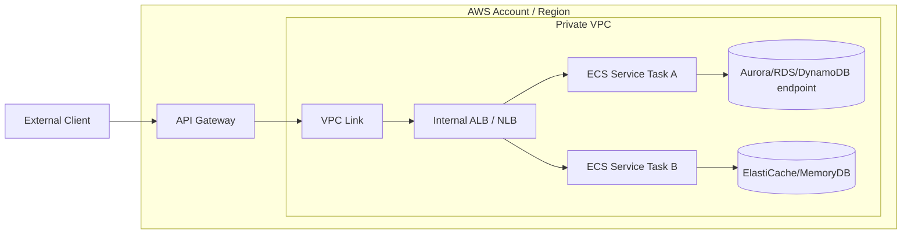
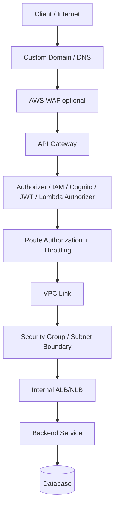
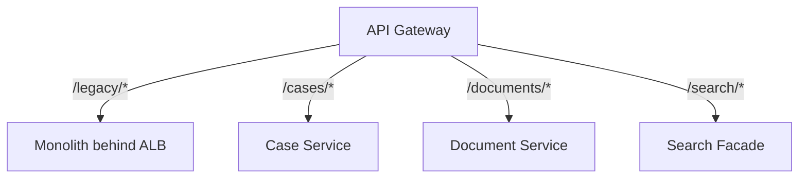
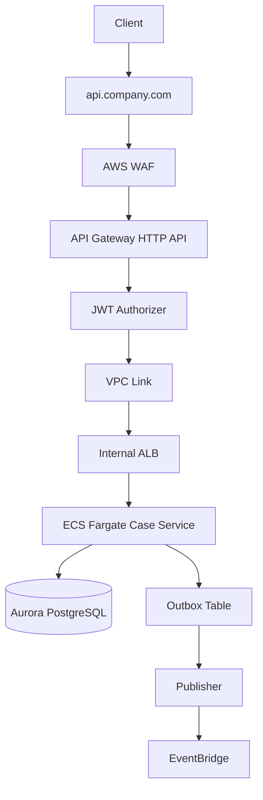

# Part 022 — API Gateway Private Integration and VPC Link

> Tujuan bagian ini: memahami cara mengekspos private application service melalui API Gateway tanpa membuat backend menjadi public, serta memahami boundary, routing, security, failure mode, observability, dan trade-off REST API vs HTTP API private integration.

Di banyak sistem production, API publik tidak langsung menuju service publik.

Model yang lebih umum:

```txt
Internet / external client
  -> API Gateway public endpoint
  -> private integration
  -> private ALB/NLB/Cloud Map/service
  -> ECS/EKS/EC2/internal service
  -> database/cache/event layer
```

Tujuannya bukan hanya "membuat API bisa akses VPC".

Tujuannya:

```txt
- menjaga backend tetap private,
- memisahkan external API contract dari internal service topology,
- menerapkan authorization/throttling/logging di edge API boundary,
- menghindari direct exposure ke load balancer/service,
- memberi migration layer untuk backend implementation,
- mempertahankan operational isolation antara client-facing API dan internal runtime.
```

---

## 1. Mental Model

API Gateway private integration adalah jembatan dari managed API boundary ke resource private dalam VPC.

AWS mendokumentasikan bahwa private integration dipakai untuk mengekspos HTTP/HTTPS resource dalam Amazon VPC untuk client di luar VPC. Untuk membuat private integration, API Gateway membutuhkan VPC link. Dokumentasi REST API terbaru menyebut API Gateway mendukung VPC links V2 untuk REST API, yang dapat menghubungkan REST API ke Application Load Balancer tanpa Network Load Balancer; VPC links V1 dianggap legacy dan AWS merekomendasikan tidak membuat VPC links V1 baru.

Untuk HTTP API, AWS tutorial menunjukkan pola API Gateway HTTP API yang memakai VPC link untuk mengakses ECS service dalam VPC melalui private integration.

Mental model:

```txt
API Gateway is the external API control plane.
VPC Link is the managed network bridge.
ALB/NLB/Cloud Map is the private service entry point.
The backend service remains private.
```

---

## 2. Diagram Baseline



Boundary penting:

```txt
Client tidak tahu IP/service internal.
Client hanya tahu API contract.
API Gateway tidak harus membuat backend public.
Backend tetap berada di private subnet/security boundary.
```

---

## 3. Public API vs Private Backend

Jangan campur dua hal ini:

```txt
Public API = contract yang dilihat client.
Private backend = implementasi internal untuk memenuhi contract.
```

API Gateway bertanggung jawab atas:

```txt
- route/method/path,
- authentication/authorization integration,
- throttling/quota,
- request validation/mapping,
- access logs,
- custom domain/stage,
- WAF/front-door policy bila digunakan,
- client-facing error shape.
```

Backend service bertanggung jawab atas:

```txt
- business command/query handling,
- transaction boundary,
- database consistency,
- domain validation,
- idempotency,
- internal observability,
- downstream integration.
```

VPC Link tidak mengubah tanggung jawab itu. VPC Link hanya membuat jalur private.

---

## 4. Decision: Kapan Memakai Private Integration?

Gunakan private integration ketika:

```txt
- backend harus tetap private dalam VPC,
- backend berjalan di ECS/EKS/EC2/private ALB/NLB,
- API Gateway tetap diperlukan untuk public API management,
- ingin migrasi backend tanpa mengubah client contract,
- ingin central edge throttling/auth/logging,
- internal service tidak boleh terekspos dengan public load balancer,
- compliance/security boundary melarang public service endpoint,
- API Gateway menjadi facade untuk beberapa private service.
```

Tidak selalu perlu ketika:

```txt
- backend adalah Lambda public integration yang cukup,
- API hanya internal dalam VPC dan tidak butuh API Gateway,
- service-to-service internal traffic lebih cocok via service mesh/private ALB/Cloud Map,
- client adalah worker/event consumer, bukan external HTTP client,
- latency overhead API Gateway tidak sepadan dengan value API management.
```

Weak assumption yang perlu ditantang:

```txt
"Private integration berarti lebih aman."
```

Lebih tepat:

```txt
Private integration mengurangi public exposure backend, tetapi security tetap bergantung pada authn/authz, resource policy, security group, IAM, TLS, logging, secret handling, and least privilege.
```

---

## 5. REST API vs HTTP API Private Integration

API Gateway punya beberapa API type. Untuk private integration, perbedaan penting:

| Dimension | REST API | HTTP API |
|---|---|---|
| Primary use | feature-rich API management | lower-latency/lower-cost HTTP APIs |
| Private integration | VPC link; V2 supports ALB for REST API per latest docs | VPC link to private resources such as ALB/NLB, used commonly with ECS |
| Features | richer legacy feature set, usage plans/API keys, request validation features | simpler, modern, often cheaper, JWT authorizers strong fit |
| Mapping | mature REST mapping templates/stage model | simpler integration and route model |
| Choice driver | need REST-specific features | want simpler HTTP API and feature set fits |

Rule:

```txt
Choose HTTP API when its feature set satisfies your contract and operational needs.
Choose REST API when you require REST API-specific capabilities.
```

Do not choose REST API only because it is older. Do not choose HTTP API only because it is cheaper. Choose based on contract and operational requirements.

---

## 6. VPC Link Resource Boundary

VPC Link adalah API Gateway resource yang menghubungkan route/integration ke private VPC resource.

For HTTP API tutorial, AWS menjelaskan bahwa VPC link memungkinkan API Gateway mengakses private resources di Amazon VPC, dan setelah dibuat API Gateway memprovision Elastic Network Interfaces untuk mengakses VPC.

Operational implications:

```txt
- VPC Link creation/update can take time.
- It consumes networking resources in selected subnets.
- Security groups/subnets matter for reachability.
- Routing to backend is still via load balancer/listener/service discovery integration.
- Deleting VPC Link may be blocked if integrations still reference it.
```

Design rule:

```txt
Treat VPC Link as production infrastructure, not just an API setting.
```

It needs IaC, naming, ownership, tagging, monitoring, and lifecycle discipline.

---

## 7. Target Options: ALB, NLB, Cloud Map

Depending on API type and feature support, private integration can target private resources such as load balancers or service discovery patterns.

### ALB as Target

Good fit when:

```txt
- backend is HTTP/HTTPS service,
- path-based routing needed,
- host-based routing needed,
- ECS/EKS/EC2 web app behind ALB,
- want L7 health checks/routing,
- multiple services share one internal ALB carefully.
```

Risks:

```txt
- ALB rules become hidden API routing layer,
- path rewriting mismatch with API Gateway stage/path,
- health check green does not mean business dependency healthy,
- security group path must allow traffic from VPC Link ENIs.
```

### NLB as Target

Good fit when:

```txt
- L4 TCP/TLS behavior needed,
- static performance characteristics desired,
- legacy REST VPC link patterns require NLB,
- backend is not purely L7 HTTP-routed.
```

Risks:

```txt
- less L7 routing intelligence,
- backend must handle protocol details,
- troubleshooting may require lower-level network thinking.
```

### Cloud Map / Service Discovery

Good fit when supported and:

```txt
- service discovery is canonical,
- avoid shared load balancer rule explosion,
- service topology is dynamic,
- internal service registry is already disciplined.
```

Risks:

```txt
- harder for teams without service-discovery maturity,
- observability path must be explicit,
- operational behavior differs from ALB/NLB.
```

---

## 8. Request Path and Stage Gotcha

API Gateway path handling can surprise backend services.

AWS REST private integration docs note that in private integration, API Gateway includes the stage portion of the API endpoint in the request to backend resources by default; parameter mapping can override/remove it.

Example:

```txt
Client calls:
  https://api.example.com/prod/orders/123

Backend might receive:
  /prod/orders/123

But backend expects:
  /orders/123
```

Possible strategies:

```txt
- configure parameter mapping/path override,
- make backend aware of base path,
- use custom domain/base path mapping carefully,
- use greedy proxy only when backend contract is stable,
- document route transformation in API ADR.
```

Anti-pattern:

```txt
"It works in dev because backend tolerated both paths."
```

In production, path ambiguity creates subtle 404, auth bypass risk, broken metrics, and routing drift.

---

## 9. Greedy Proxy vs Explicit Routes

AWS tutorial examples often use `ANY /{proxy+}` for simplicity. It is useful for migration, but dangerous as a permanent default.

### Greedy Proxy

```txt
ANY /{proxy+} -> private ALB
```

Pros:

```txt
- fast migration,
- minimal route config,
- backend controls routing,
- useful for strangler facade.
```

Cons:

```txt
- API Gateway loses contract clarity,
- weak request validation,
- harder per-route throttling/auth,
- backend accidentally exposes internal endpoint,
- observability less precise,
- OpenAPI contract may become fiction.
```

### Explicit Routes

```txt
POST /orders -> order service
GET /orders/{id} -> order service
POST /cases/{id}/approve -> case service
```

Pros:

```txt
- API contract explicit,
- per-route auth/throttling/logging,
- easier deprecation/versioning,
- safer public surface,
- better observability.
```

Cons:

```txt
- more API Gateway config,
- more IaC discipline,
- mapping complexity if backend routes differ.
```

Rule:

```txt
Use greedy proxy for controlled migration, not as permanent public API design unless intentionally accepted.
```

---

## 10. Security Layers

Private integration is one layer. A serious API has several layers:



Checklist:

```txt
[ ] Backend load balancer is internal, not internet-facing.
[ ] Backend service does not trust API Gateway blindly unless network/auth boundary is proven.
[ ] Authorization decision is enforced at API layer and/or service layer based on risk.
[ ] Security groups allow only required traffic.
[ ] Route-level auth matches business sensitivity.
[ ] Internal admin/debug endpoints are not reachable through greedy proxy.
[ ] Logs do not leak secrets/tokens/PII.
[ ] TLS requirement is explicit between API Gateway and backend if needed.
[ ] Resource policy/custom domain/WAF strategy is documented.
```

Important:

```txt
Network privacy is not authorization.
```

A request reaching private backend can still be malicious if authn/authz boundary is weak.

---

## 11. Header and Identity Propagation

Backend usually needs identity/context:

```txt
- authenticated subject,
- tenant/org,
- roles/scopes,
- correlation id,
- request id,
- source IP/user agent if needed,
- idempotency key,
- trace context.
```

Do not pass raw, untrusted client headers as authority.

Pattern:

```txt
Client header -> API Gateway validates/authenticates -> API Gateway/service creates trusted context -> backend uses trusted context.
```

Example internal headers:

```txt
X-Correlation-Id: generated or propagated
X-Request-Id: API Gateway request id
X-Authenticated-Subject: derived from authorizer claims
X-Tenant-Id: derived/validated, not blindly copied
X-Idempotency-Key: validated command key
traceparent: OpenTelemetry trace context
```

Backend rule:

```txt
Reject privileged identity headers unless request came through trusted path and signature/context is verifiable.
```

---

## 12. Timeout Budget Across API Gateway and Private Backend

Private integration does not remove timeout constraints.

You need a timeout stack:

```txt
client timeout
  > API Gateway timeout
    > load balancer idle timeout / target response budget
      > backend handler timeout
        > database timeout
          > downstream timeout
```

Healthy budget example:

```txt
Client timeout:              10s
API Gateway integration:      8s
Backend request timeout:      7s
DB statement timeout:         2s
External dependency timeout:  1s each with budget
```

Bad budget:

```txt
API Gateway timeout: 8s
Backend DB query:    30s
DB pool acquire:     unlimited
```

Result:

```txt
API returns timeout while backend keeps working.
Client retries.
Backend duplicate pressure increases.
Database remains saturated.
```

Rule:

```txt
The inner timeout must usually be shorter than the outer timeout, and mutation endpoints must be idempotent.
```

---

## 13. Load Balancer Health Check Is Not Business Health

ALB/NLB health check may say target is healthy if:

```txt
GET /health -> 200
```

But the service may be unable to:

```txt
- acquire DB connection,
- write to primary database,
- publish outbox,
- read required secrets,
- access cache,
- call dependency,
- satisfy command latency.
```

Design health endpoints carefully:

```txt
/health/live
  - process is alive,
  - should not depend on DB deeply.

/health/ready
  - ready to serve traffic,
  - checks critical dependencies lightly.

/health/deep
  - diagnostic only,
  - not necessarily LB health check,
  - may be used by runbooks.
```

Do not make LB health check so deep that transient dependency issue causes total traffic churn. Do not make it so shallow that dead service receives traffic forever.

---

## 14. Failure Modes

| Failure | Symptom | Design Response |
|---|---|---|
| VPC Link unavailable/misconfigured | API Gateway 5xx/integration error | IaC, deployment validation, canary test |
| Security group blocks traffic | timeout/connection refused | explicit SG rules, reachability testing |
| ALB target unhealthy | 502/503 | health check, autoscaling, rollback |
| Backend slow | API timeout/504 | timeout budget, load shedding, DB tuning |
| DB pool exhausted | backend 503/timeout | RDS Proxy/pool limits/backpressure |
| Greedy proxy exposes internal path | security incident | explicit routes/denylist/service auth |
| Stage path forwarded unexpectedly | backend 404 | path mapping tests |
| TLS/cert mismatch | integration failure | cert/SNI config, test in preprod |
| Header spoofing | auth bypass | trusted context propagation |
| Deployment changed route mapping | partial outage | contract tests/canary |
| Backend returns raw errors | data leakage | error mapping boundary |

---

## 15. Observability

At API Gateway layer:

```txt
- request id,
- route key,
- integration status,
- response status,
- integration latency,
- authorizer latency,
- client error count,
- server error count,
- throttled requests,
- stage/deployment id,
- source identity where safe.
```

At load balancer layer:

```txt
- target response time,
- target 5xx,
- LB 5xx,
- healthy host count,
- request count,
- rejected connection count,
- target connection error count.
```

At backend layer:

```txt
- route handler latency,
- database latency,
- DB pool acquire latency,
- command success/conflict/failure,
- idempotency duplicate rate,
- dependency timeout,
- error code, not just exception class.
```

Correlation fields:

```txt
- API Gateway request id,
- correlation id,
- trace id,
- backend request id,
- command id,
- tenant id,
- aggregate id where safe.
```

Without correlation, troubleshooting private integration becomes guesswork:

```txt
Client sees 504.
API Gateway logs integration timeout.
ALB logs 200 after 11 seconds.
Backend logs DB pool wait 9 seconds.
Database logs lock wait.
```

You need one trace to connect these facts.

---

## 16. API Gateway as Anti-Corruption Layer

Private integration is a good place to decouple external API contract from internal service routes.

External API:

```txt
POST /cases/{caseId}/approve
```

Internal backend route:

```txt
POST /internal/v2/workflow/case-approval-commands
```

Mapping boundary can:

```txt
- normalize paths,
- inject request context,
- hide internal route names,
- transform legacy shapes,
- preserve backward compatibility,
- allow backend migration from monolith to service.
```

But avoid making API Gateway mapping too magical.

Bad:

```txt
all business transformations hidden in mapping templates
```

Better:

```txt
API Gateway handles protocol/contract edge concerns.
Backend handles business semantics.
```

---

## 17. Strangler Migration Pattern

Private integration is useful when moving from monolith to services.

Initial state:

```txt
API Gateway -> VPC Link -> internal ALB -> monolith
```

Intermediate:

```txt
API Gateway route /orders/* -> monolith
API Gateway route /cases/* -> new case service
API Gateway route /documents/* -> document service
```

Final:

```txt
API Gateway exposes stable public contract.
Internal service topology can evolve behind it.
```

Diagram:



Risks:

```txt
- route ownership unclear,
- duplicate auth logic,
- shared database remains hidden coupling,
- monolith endpoint accidentally remains exposed,
- contract tests missing.
```

Governance:

```txt
- route ownership registry,
- ADR per migrated route,
- consumer contract tests,
- deprecation dates,
- dashboard per route/backend target,
- rollback route switch plan.
```

---

## 18. Internal API Surface Control

A private backend may have endpoints like:

```txt
/internal/reindex
/internal/replay-events
/admin/reset-cache
/debug/env
/actuator
/metrics
```

If using greedy proxy, these might become externally reachable unless blocked.

Defenses:

```txt
- explicit API Gateway routes,
- backend service requires internal auth for admin paths,
- ALB listener rules separate public-route target group from admin-route target group,
- security group/subnet separation,
- route tests that assert forbidden paths are not reachable,
- WAF rules where applicable,
- no debug endpoints in production public path.
```

Rule:

```txt
Never rely on obscurity of path names for internal API protection.
```

---

## 19. Multi-Tenant Considerations

For SaaS/regulatory platforms, private integration must preserve tenant boundaries.

Checklist:

```txt
[ ] Tenant id is derived from authenticated context, not only request body.
[ ] API Gateway authorizer validates tenant access where possible.
[ ] Backend revalidates tenant ownership before database access.
[ ] Logs include tenant id safely for operations.
[ ] Throttling can protect tenant noisy neighbor scenarios.
[ ] Rate limit and quota policy are tenant-aware when needed.
[ ] Backend database query always includes tenant boundary.
[ ] Internal headers cannot be spoofed by direct backend access.
```

Private network does not solve tenant isolation. It only reduces exposure surface.

---

## 20. Deployment Strategy

For private integration changes, deploy like application code.

Safe deployment pipeline:

```txt
1. Provision backend service/load balancer target.
2. Validate health checks.
3. Create/update VPC Link if needed.
4. Create route/integration in non-prod.
5. Run contract tests through API Gateway endpoint.
6. Run negative tests for forbidden paths.
7. Deploy stage/canary.
8. Watch API Gateway + ALB + backend metrics.
9. Promote traffic gradually if routing supports it.
10. Keep rollback mapping ready.
```

Rollback possibilities:

```txt
- revert API Gateway route integration,
- shift ALB target group traffic,
- rollback backend deployment,
- disable new route,
- return 503 with safe retry-after for non-critical endpoint,
- route back to monolith in strangler migration.
```

Do not make API route migration irreversible in one deployment.

---

## 21. IaC Shape

Conceptual resources:

```txt
- API Gateway API,
- stage/deployment,
- routes/methods,
- authorizer,
- integration,
- VPC Link,
- internal ALB/NLB,
- listener/rules,
- target groups,
- ECS/EKS/EC2 service,
- security groups,
- log groups,
- metrics/alarms,
- custom domain/base path mapping.
```

Pseudo Terraform/CDK shape:

```txt
ApiGatewayHttpApi
  Route: POST /cases/{caseId}/approve
  Integration: private ALB listener via VPC Link
  Authorizer: JWT/Lambda/IAM as needed
  AccessLog: structured JSON

VpcLink
  Subnets: private subnets
  SecurityGroups: allow API Gateway ENI -> ALB listener

InternalALB
  Scheme: internal
  Listener: HTTPS/HTTP
  TargetGroup: case-service

ECSService
  DesiredCount: N
  HealthCheckGracePeriod: ...
  SecurityGroup: allow ALB -> service
```

Important IaC tests:

```txt
- ALB scheme is internal,
- route requires authorizer,
- access logging enabled,
- no wildcard route unless approved,
- VPC Link subnets are private,
- security group ingress is minimal,
- forbidden paths absent,
- timeout settings match standard,
- alarms exist.
```

---

## 22. Production Alarms

API Gateway alarms:

```txt
- 5xx rate high,
- 4xx spike unexpected,
- integration latency p95/p99 high,
- throttling spike,
- authorizer errors,
- route-specific failure.
```

ALB/NLB alarms:

```txt
- healthy host count below threshold,
- target 5xx high,
- target response time high,
- rejected/connection errors,
- target group no healthy targets.
```

Backend alarms:

```txt
- DB pool saturation,
- command p99 high,
- dependency timeout high,
- CPU/memory saturation,
- error budget burn,
- outbox stuck if endpoint writes state.
```

Synthetic/canary checks:

```txt
- public API route through API Gateway,
- auth-required route rejects anonymous,
- forbidden internal path inaccessible,
- mutation endpoint idempotency works,
- backend health visible internally.
```

---

## 23. Troubleshooting Playbook

### Symptom: API Gateway 502

Check:

```txt
- integration URI/listener correct,
- ALB/NLB target healthy,
- backend returns valid HTTP response,
- TLS/SNI/cert mismatch,
- path mapping correct,
- backend closed connection early,
- response exceeded protocol expectation.
```

### Symptom: API Gateway 504

Check:

```txt
- integration latency,
- backend request duration,
- ALB target response time,
- DB pool acquire latency,
- lock wait/deadlock,
- slow downstream dependency,
- timeout budget mismatch.
```

### Symptom: Works from inside VPC, fails via API Gateway

Check:

```txt
- VPC Link status,
- subnets/security groups,
- listener port/protocol,
- ALB/NLB target group,
- path stage forwarding,
- host header expectation,
- backend auth expecting different header.
```

### Symptom: Unauthorized access possible

Check:

```txt
- route authorizer missing,
- greedy proxy exposed internal path,
- backend trusts spoofable header,
- direct ALB access possible,
- admin endpoint lacks service-level auth,
- custom domain/base path mismatch.
```

---

## 24. Design Review Questions

Ask before shipping:

```txt
[ ] Is the backend load balancer internal?
[ ] Why do we need API Gateway instead of direct internal service route?
[ ] Why do we need private integration instead of Lambda integration?
[ ] Which API type is selected and why?
[ ] Which features require REST API or HTTP API?
[ ] What is the VPC Link lifecycle owner?
[ ] What subnets/security groups are used?
[ ] What backend target is used: ALB, NLB, Cloud Map?
[ ] Are routes explicit or greedy proxy?
[ ] If greedy proxy, what prevents admin/internal endpoint exposure?
[ ] Is path/stage mapping tested?
[ ] Is identity context trusted and protected from spoofing?
[ ] Are backend services still performing authorization where required?
[ ] Are API Gateway, ALB, backend, and DB logs correlated?
[ ] Are timeout budgets aligned?
[ ] What happens when backend is slow but still processing?
[ ] Is mutation endpoint idempotent?
[ ] Are 502/504 playbooks ready?
[ ] Are canary checks deployed?
[ ] Is rollback route mapping tested?
```

---

## 25. Mini Case Study: Private Case Service Behind API Gateway

Requirement:

```txt
External clients call public compliance case API.
Case service runs on ECS Fargate in private subnets.
Database is Aurora PostgreSQL private.
Service must not expose public load balancer.
```

Architecture:



Route design:

```txt
POST /cases
GET /cases/{caseId}
POST /cases/{caseId}/approve
POST /cases/{caseId}/escalate
GET /cases/{caseId}/timeline
```

Avoid:

```txt
ANY /{proxy+}
```

unless migration phase requires it.

Controls:

```txt
- authorizer on every sensitive route,
- backend revalidates tenant/case ownership,
- idempotency key required on mutation routes,
- structured access logs,
- ALB internal only,
- forbidden path synthetic test for /admin, /debug, /actuator,
- outbox alarm for state-changing commands.
```

---

## 26. Anti-Patterns

### Anti-Pattern 1: Public ALB Behind API Gateway

```txt
Client -> API Gateway -> public ALB -> backend
```

This may still be valid for some cases, but if public ALB remains directly reachable, API Gateway controls can be bypassed unless ALB is locked down.

Better:

```txt
API Gateway -> VPC Link -> internal ALB
```

or enforce ALB access restrictions explicitly.

### Anti-Pattern 2: API Gateway as Blind Tunnel

```txt
ANY /{proxy+} -> monolith
```

without route audit.

Risk:

```txt
- accidental exposure,
- no clear external contract,
- weak throttling/auth granularity,
- impossible API lifecycle management.
```

### Anti-Pattern 3: Backend Trusts X-User-Id From Client

```txt
X-User-Id: admin
```

If backend trusts this without verifying it came from authorizer/service boundary, auth bypass is possible.

### Anti-Pattern 4: No Timeout Alignment

```txt
API timeout: 8s
backend keeps processing mutation for 60s
client retries every 8s
```

Result:

```txt
duplicate pressure + ambiguous state + database saturation
```

### Anti-Pattern 5: Health Check Equals `/`

Root endpoint returns 200 while DB is unreachable.

Better:

```txt
- liveness endpoint for process,
- readiness endpoint for traffic,
- deep diagnostics for runbook.
```

---

## 27. How This Connects to Database Correctness

Private integration is an API/network boundary. It does not solve:

```txt
- duplicate mutation,
- ambiguous commit,
- transaction isolation,
- outbox publish failure,
- cache staleness,
- stale read model,
- cross-service consistency,
- tenant authorization,
- schema compatibility.
```

Therefore, combine Part 022 with Part 021:

```txt
API Gateway private integration protects backend exposure.
API-to-database transaction boundary protects business correctness.
```

Both are required.

---

## 28. Summary

Private integration with VPC Link is a powerful AWS application boundary pattern.

Key ideas:

```txt
- API Gateway remains the public API control plane.
- Backend service can stay private in VPC.
- VPC Link is managed network bridge, not an auth system.
- Explicit routes are safer than permanent greedy proxy.
- REST API vs HTTP API should be chosen by feature/contract needs.
- ALB/NLB/Cloud Map choice affects routing and operations.
- Path/stage mapping must be tested.
- Identity headers must be trusted, derived, and protected.
- Timeout budgets must align across API Gateway, load balancer, backend, and database.
- Observability must correlate API Gateway, LB, backend, and DB.
- Internal/admin endpoints must not leak through public API surface.
```

The next part moves from API Gateway to **AWS AppSync in action**: GraphQL API, resolver design, subscription/realtime use cases, and database boundary.

---

## References

- Amazon API Gateway Developer Guide — Private integrations for REST APIs: https://docs.aws.amazon.com/apigateway/latest/developerguide/private-integration.html
- Amazon API Gateway Developer Guide — HTTP API private integration tutorial: https://docs.aws.amazon.com/apigateway/latest/developerguide/http-api-private-integration.html
- AWS Compute Blog — Understanding VPC links in API Gateway private integrations: https://aws.amazon.com/blogs/compute/understanding-vpc-links-in-amazon-api-gateway-private-integrations/
- AWS Whitepaper — Best practices for API Gateway private APIs integration, HTTP API: https://docs.aws.amazon.com/whitepapers/latest/best-practices-api-gateway-private-apis-integration/http-api.html
