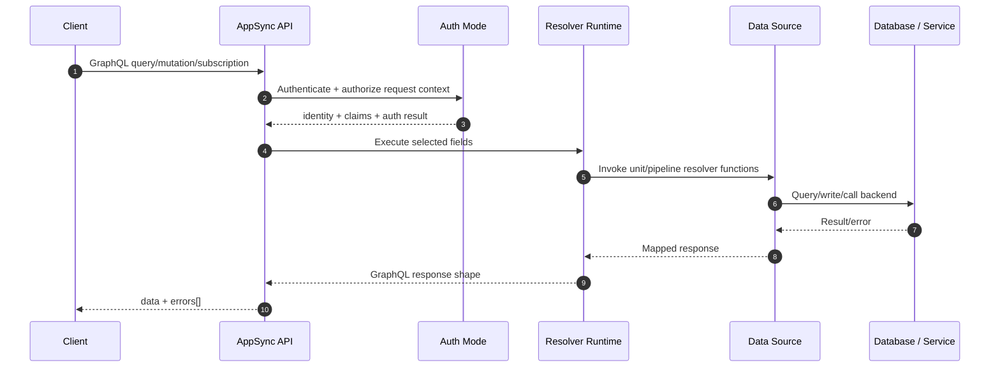
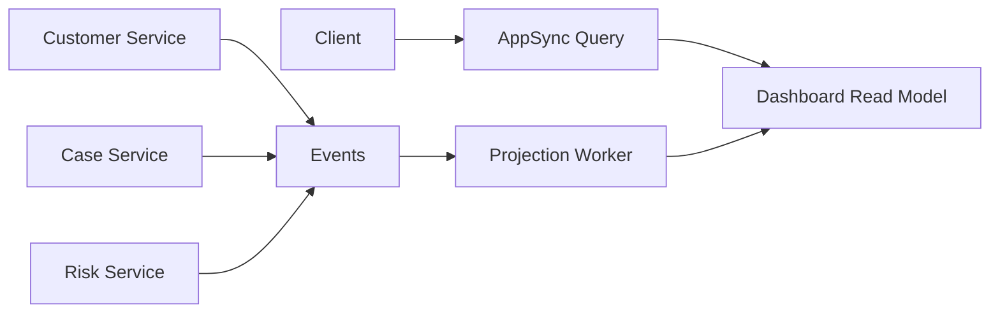
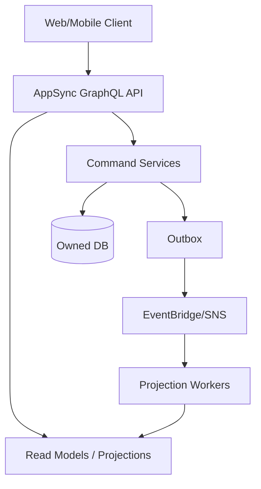
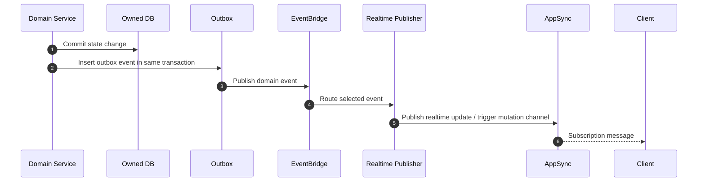
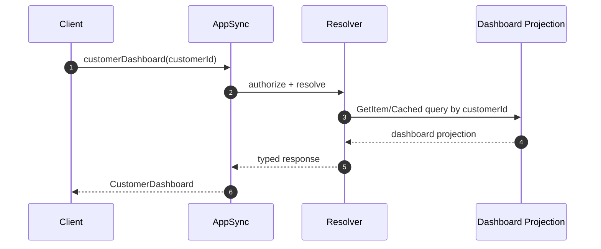
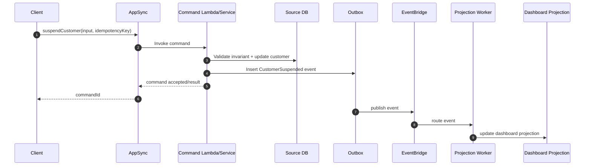

# Part 023 — GraphQL AppSync in Action

GraphQL bukan sekadar cara mengganti REST dengan query fleksibel. Di production, GraphQL adalah **API composition layer** yang dapat mempercepat client development, tetapi juga dapat menyembunyikan coupling, authorization leak, N+1 query, over-fetching internal, dan database boundary yang buruk.

AWS AppSync memberi managed GraphQL API, Pub/Sub API, real-time subscription, resolver, pipeline resolver, multi-data-source access, dan integration ke Lambda, DynamoDB, HTTP endpoint, OpenSearch, Aurora/RDS melalui Lambda atau service integration tertentu. Tetapi kemampuan ini bukan alasan untuk menjadikan AppSync sebagai tempat semua business logic. Mental model yang benar:

> AppSync adalah programmable API edge untuk graph-shaped client contract. Source of truth tetap berada di bounded service/database owner.

Bagian ini membahas AppSync sebagai sistem nyata: schema, resolver, data source, mutation boundary, subscription, authorization, caching, observability, dan failure model.

---

## 1. Problem yang Dipecahkan AppSync

REST bagus ketika resource contract stabil dan client dapat menerima endpoint granular. Masalah muncul ketika:

- mobile/web client butuh data dari banyak service untuk satu layar;
- client berbeda membutuhkan shape berbeda;
- realtime update dibutuhkan tanpa mengelola WebSocket fleet sendiri;
- API perlu schema typed yang bisa diinspeksi;
- backend terdiri dari DynamoDB, Lambda, HTTP service, OpenSearch, dan database projection;
- client perlu offline/sync-like pattern;
- API team ingin memisahkan external contract dari internal service topology.

GraphQL memberi client kemampuan meminta field spesifik. AppSync menambahkan managed execution, resolver, authorization mode, WebSocket subscription, dan integration runtime.

Namun ada trade-off:

| Keuntungan | Biaya tersembunyi |
|---|---|
| Client dapat meminta shape data yang tepat | Query complexity dapat menjadi unpredictable |
| Satu endpoint untuk banyak use case | Endpoint tunggal dapat menjadi operational choke point |
| Strong schema contract | Schema buruk menjadi coupling global |
| Resolver per field | N+1 dan fanout tidak terlihat dari client |
| Subscription managed | Realtime consistency semantics sering disalahpahami |
| Multi-source composition | Ownership data bisa kabur |

Jadi AppSync harus dipakai dengan discipline: schema sebagai **product contract**, resolver sebagai **composition boundary**, database tetap sebagai **owned state**.

---

## 2. AppSync Mental Model

Secara runtime, satu GraphQL request berjalan seperti ini:



Important: GraphQL response bisa berisi `data` sebagian dan `errors[]`. Ini berbeda dari banyak REST API yang biasanya mengembalikan satu HTTP status sebagai representasi utama outcome. Maka error design AppSync harus eksplisit.

---

## 3. Kapan Memakai AppSync

Gunakan AppSync ketika minimal satu kondisi ini benar:

1. UI membutuhkan data graph-shaped dari beberapa sumber.
2. Banyak client memiliki kebutuhan field berbeda.
3. Realtime subscription adalah kebutuhan produk, bukan gimmick.
4. API contract perlu typed schema yang kuat.
5. Backend topology ingin disembunyikan dari client.
6. Query/mutation dapat dibatasi dan diprediksi.
7. Resolver bisa diarahkan ke read model/projection, bukan query liar ke source-of-truth.

Hindari AppSync ketika:

- hanya ada CRUD sederhana dengan shape tetap;
- semua client butuh payload yang sama;
- backend belum punya ownership data yang jelas;
- authorization per-field terlalu kompleks dan belum siap diuji;
- query complexity tidak bisa dibatasi;
- tim ingin GraphQL agar client bisa “query database sendiri”.

Rule of thumb:

> AppSync bagus sebagai API composition layer. AppSync buruk sebagai database abstraction layer yang membiarkan client mendesain query runtime seenaknya.

---

## 4. REST vs GraphQL vs AppSync Subscription

| Use case | REST/API Gateway | AppSync GraphQL | AppSync Subscription |
|---|---|---|---|
| Command sederhana | Sangat cocok | Cocok jika domain sudah GraphQL | Tidak relevan |
| Query fixed shape | Sangat cocok | Bisa terlalu berat | Tidak relevan |
| Query per-screen dengan nested data | Banyak endpoint/BFF | Sangat cocok | Tidak relevan |
| Realtime notification | WebSocket API/manual infra | Subscription built-in | Sangat cocok |
| Public partner API | REST sering lebih mudah governance | Bisa, tapi perlu schema discipline | Jarang |
| Internal admin console | Bisa | Sangat cocok | Cocok untuk live status |
| High-throughput ingestion | Tidak ideal | Tidak ideal | Tidak ideal |
| Transaction-heavy command | Cocok | Cocok jika mutation maps to command | Tidak relevan |

---

## 5. Schema Design: Jangan Menyalin Tabel Database

Kesalahan paling umum adalah membuat schema GraphQL dari tabel database:

```graphql
# Anti-pattern
 type customer_table {
   id: ID!
   first_name: String
   last_name: String
   created_at: String
   updated_at: String
 }
```

Ini membocorkan physical model. Schema harus mewakili language domain/client contract:

```graphql
 type Customer {
   id: ID!
   displayName: String!
   lifecycleStatus: CustomerLifecycleStatus!
   primaryEmail: EmailAddress
   riskSummary: CustomerRiskSummary
 }

 enum CustomerLifecycleStatus {
   PROSPECT
   ACTIVE
   SUSPENDED
   CLOSED
 }
```

Prinsip schema:

1. **Name by domain**, bukan table/column.
2. **Expose stable contract**, bukan internal representation.
3. **Mutation = command**, bukan generic update.
4. **Query = read model**, bukan arbitrary database query.
5. **Subscription = domain notification**, bukan raw row change.
6. **Nullable field berarti compatibility decision**, bukan malas desain.
7. **Enum lebih aman daripada string liar** untuk lifecycle/status yang bounded.
8. **Pagination wajib untuk list**.
9. **Input object harus command-specific**.
10. **Error semantics harus terdokumentasi**.

---

## 6. Query Design: Read Model, Bukan Source-of-Truth Join

Contoh query yang masuk akal:

```graphql
 type Query {
   customerDashboard(customerId: ID!): CustomerDashboard!
   customerCases(customerId: ID!, first: Int!, after: String): CaseConnection!
 }
```

`customerDashboard` boleh menggabungkan beberapa projection:

- customer summary;
- latest enforcement case summary;
- risk score projection;
- unresolved task count;
- last communication summary.

Tetapi jangan membiarkan resolver melakukan distributed join setiap request ke banyak source-of-truth. Pattern yang lebih aman:



GraphQL query yang baik sering membaca dari **projection/read model**, bukan melakukan runtime aggregation mahal.

---

## 7. Mutation Design: Mutation Harus Berarti Command

Anti-pattern:

```graphql
 type Mutation {
   updateCustomer(id: ID!, patch: AWSJSON!): Customer!
 }
```

Masalah:

- tidak jelas invariant apa yang dijaga;
- authorization sulit;
- audit event tidak bermakna;
- idempotency sulit;
- validation melebar;
- client tahu terlalu banyak tentang internal state.

Desain lebih baik:

```graphql
 type Mutation {
   activateCustomer(input: ActivateCustomerInput!): ActivateCustomerPayload!
   suspendCustomer(input: SuspendCustomerInput!): SuspendCustomerPayload!
   changeCustomerPrimaryEmail(input: ChangeCustomerPrimaryEmailInput!): ChangeCustomerPrimaryEmailPayload!
 }

 input SuspendCustomerInput {
   customerId: ID!
   reasonCode: SuspensionReasonCode!
   explanation: String
   idempotencyKey: ID!
 }

 type SuspendCustomerPayload {
   customer: Customer!
   commandId: ID!
 }
```

Mutation harus:

- mengandung `idempotencyKey` untuk command yang retryable;
- memetakan ke satu domain command;
- menjaga invariant di backend owner;
- menghasilkan audit/domain event;
- tidak melakukan multi-aggregate write sembarangan;
- mengembalikan payload yang cukup untuk UI tanpa memaksa immediate read join mahal.

---

## 8. Resolver Model

AWS AppSync memiliki resolver yang melekat ke field schema. Resolver adalah unit eksekusi untuk menyelesaikan field dari data source. Secara umum ada dua model:

| Resolver | Kegunaan |
|---|---|
| Unit resolver | Satu field langsung ke satu data source |
| Pipeline resolver | Satu field menjalankan beberapa function berurutan |

Pipeline resolver berguna untuk:

- authorization check;
- input normalization;
- idempotency lookup;
- data fetch;
- enrichment;
- response shaping;
- audit side-effect terbatas.

Tetapi pipeline bukan tempat ideal untuk business transaction kompleks. Untuk command yang memiliki banyak invariant, gunakan Lambda/service backend yang memiliki testability lebih baik.

---

## 9. Resolver Strategy by Data Source

| Data source | Cocok untuk | Hati-hati |
|---|---|---|
| DynamoDB direct resolver | Simple key-value/query access, projection, lookup | Hot partition, complex business logic, over-coupled schema |
| Lambda resolver | Business logic, RDS access, multi-step validation | Cold start, N+1 Lambda invoke, connection management |
| HTTP resolver | Calling internal/public HTTP APIs | Timeout, retry semantics, auth propagation |
| OpenSearch resolver | Search/read projection | Search index bukan source of truth |
| None/local resolver | Computed response/simple transformation | Jangan sembunyikan state change |

Rule:

> Direct resolver cocok untuk read model sederhana. Mutation penting sebaiknya lewat command service atau Lambda yang menjaga invariant.

---

## 10. N+1 Problem di AppSync

GraphQL membuat field nested mudah. Tetapi setiap nested field dapat memicu resolver sendiri.

Contoh:

```graphql
 query {
   customers(first: 20) {
     edges {
       node {
         id
         displayName
         openCases {
           id
           status
         }
       }
     }
   }
 }
```

Jika resolver `openCases` dipanggil per customer, request bisa menjadi:

```txt
1 query customers + 20 query openCases = 21 backend calls
```

Solusi:

1. **Batch resolver** — gunakan Lambda `BatchInvoke` atau desain resolver yang menerima banyak key.
2. **Denormalized projection** — dashboard/list view membaca projection yang sudah disiapkan.
3. **Limit nested collection** — batasi `first` pada nested field.
4. **Avoid deeply nested queries** — schema tidak harus mengizinkan semua traversal.
5. **Persisted query/allowlist** — untuk public/high-risk API.
6. **Cost analysis di gateway/app layer** — reject query terlalu mahal.

Mental model:

> GraphQL field selection adalah execution plan. Jangan izinkan client membuat execution plan yang database dan service layer tidak bisa prediksi.

---

## 11. Pagination dan Connection Pattern

Jangan expose list tanpa pagination:

```graphql
# Anti-pattern
 type Query {
   allCases: [Case!]!
 }
```

Gunakan connection:

```graphql
 type Query {
   customerCases(customerId: ID!, first: Int!, after: String): CaseConnection!
 }

 type CaseConnection {
   edges: [CaseEdge!]!
   pageInfo: PageInfo!
 }

 type CaseEdge {
   cursor: String!
   node: Case!
 }

 type PageInfo {
   hasNextPage: Boolean!
   endCursor: String
 }
```

Cursor harus opaque. Jangan membuat client bergantung pada `created_at#id` format internal. Cursor boleh encode state, tetapi harus diperlakukan sebagai token.

---

## 12. Authorization Model

AppSync mendukung beberapa authorization mode. Yang penting bukan hanya memilih mode, tetapi mendesain **authorization boundary**.

| Layer | Pertanyaan |
|---|---|
| API auth | Siapa caller-nya? |
| Operation auth | Boleh memanggil mutation/query ini? |
| Object auth | Boleh melihat object ini? |
| Field auth | Boleh melihat field sensitif ini? |
| Data source auth | Resolver boleh mengakses backend apa? |
| Domain auth | Berdasarkan state domain, aksi ini boleh? |

Jangan menaruh semua authorization di client. Jangan juga hanya mengandalkan API-level auth jika field sensitif berbeda antar role.

Contoh field-sensitive schema:

```graphql
 type Customer {
   id: ID!
   displayName: String!
   primaryEmail: EmailAddress
   regulatoryFlags: [RegulatoryFlag!]!
   internalNotes: [InternalNote!]!
 }
```

`internalNotes` mungkin hanya boleh untuk investigator internal. Jika resolver mengembalikan object lengkap lalu field disaring client-side, itu data leak.

Pattern aman:

1. Gunakan identity claims dari auth context.
2. Enforce operation-level auth di resolver/backend.
3. Enforce object-level auth di data query.
4. Enforce field-level auth untuk field sensitif.
5. Log denied access dengan correlation ID.
6. Test authorization matrix sebagai contract.

---

## 13. AppSync sebagai BFF: Baik, Tapi Jangan Menjadi God Layer

AppSync sering dipakai sebagai Backend-for-Frontend. Ini bagus ketika schema mengikuti kebutuhan UI. Tetapi BFF dapat berubah menjadi god layer jika:

- semua domain logic masuk resolver;
- resolver memanggil banyak service source-of-truth;
- mutation melakukan cross-service transaction;
- authorization tersebar di template/pipeline yang sulit diuji;
- schema mengikuti layout UI terlalu literal;
- tidak ada owner untuk field/data.

Boundary yang lebih baik:



AppSync boleh menjadi BFF, tetapi **domain invariant tetap di command service/database owner**.

---

## 14. Subscription: Realtime Bukan Konsistensi Instan

AppSync subscription memungkinkan client menerima update realtime melalui secure WebSocket connection yang dikelola AppSync. Subscription umumnya dipicu oleh mutation atau event publication pattern.

Contoh:

```graphql
 type Subscription {
   onCaseStatusChanged(customerId: ID!): CaseStatusChanged!
     @aws_subscribe(mutations: ["changeCaseStatus"])
 }
```

Realtime bukan berarti:

- semua event pasti diterima client yang offline;
- subscription menggantikan source-of-truth read;
- UI tidak perlu reconciliation;
- event order selalu sesuai ekspektasi domain;
- client boleh langsung percaya local state tanpa version check.

Pattern UI yang aman:

1. Initial query mengambil state saat ini.
2. Subscription menerima delta/update.
3. Delta memiliki `version` atau `occurredAt`.
4. Client ignore stale update.
5. Client dapat re-fetch saat gap dicurigai.
6. Server menyediakan query reconciliation.

Contoh event payload:

```graphql
 type CaseStatusChanged {
   caseId: ID!
   customerId: ID!
   previousStatus: CaseStatus!
   currentStatus: CaseStatus!
   version: Long!
   occurredAt: AWSDateTime!
 }
```

---

## 15. Event-to-Subscription Bridge

Dalam domain event-driven, mutation tidak selalu berasal dari AppSync. Update bisa terjadi dari worker, Step Functions, admin service, batch reconciliation, atau external callback.

Arsitektur aman:



Jangan membuat subscription hanya dari UI mutation jika state juga berubah dari proses lain. Jika tidak, client akan kehilangan update yang berasal dari non-GraphQL path.

---

## 16. Error Model untuk GraphQL

GraphQL response bisa seperti ini:

```json
{
  "data": {
    "customer": null
  },
  "errors": [
    {
      "message": "Customer not found",
      "path": ["customer"],
      "extensions": {
        "code": "CUSTOMER_NOT_FOUND",
        "correlationId": "req-123"
      }
    }
  ]
}
```

Prinsip error:

- gunakan stable `extensions.code`;
- jangan expose internal exception;
- sertakan correlation ID;
- bedakan validation, authorization, conflict, not found, rate limit, dependency failure;
- untuk mutation, jelaskan apakah command diterima, ditolak, atau outcome ambiguous;
- dokumentasikan retryable vs non-retryable.

Contoh error taxonomy:

| Code | Retry? | Meaning |
|---|---:|---|
| `VALIDATION_FAILED` | No | Input tidak valid |
| `UNAUTHORIZED` | No | Caller belum authenticated |
| `FORBIDDEN` | No | Caller authenticated tapi tidak boleh |
| `NOT_FOUND` | No/Maybe | Resource tidak ditemukan atau disembunyikan |
| `CONFLICT` | Maybe | Version/state conflict |
| `IDEMPOTENCY_IN_PROGRESS` | Yes with delay | Command sama sedang diproses |
| `DEPENDENCY_UNAVAILABLE` | Yes | Backend dependency gagal sementara |
| `RATE_LIMITED` | Yes with backoff | Throttled |

---

## 17. Database Boundary dalam AppSync

### 17.1 Direct DynamoDB Resolver

Cocok untuk read model:

```graphql
 type Query {
   customerSummary(customerId: ID!): CustomerSummary
 }
```

DynamoDB key:

```txt
PK = CUSTOMER#<customerId>
SK = SUMMARY
```

Resolver dapat melakukan `GetItem`. Ini bagus karena predictable.

Tidak cocok untuk mutation kompleks seperti:

```graphql
 suspendCustomer(input: SuspendCustomerInput!): SuspendCustomerPayload!
```

Jika suspend membutuhkan audit, authorization berdasarkan case, external notification, outbox, dan workflow, sebaiknya lewat command service/Lambda.

### 17.2 RDS/Aurora via Lambda

Untuk relational DB, AppSync sering memanggil Lambda yang menggunakan connection pool/RDS Proxy. Hindari resolver field-level yang membuka koneksi per field. Buat coarse-grained resolver:

```graphql
 type Query {
   customerDashboard(customerId: ID!): CustomerDashboard!
 }
```

Backend Lambda melakukan satu optimized query atau membaca materialized projection.

### 17.3 OpenSearch as Projection

OpenSearch cocok untuk search query:

```graphql
 type Query {
   searchCases(input: SearchCasesInput!): CaseSearchConnection!
 }
```

Tapi search result harus dianggap projection. Untuk command/decision penting, fetch source-of-truth by ID setelah user memilih item.

---

## 18. Cache Strategy

AppSync-level caching bisa mengurangi latency dan backend load. Namun cache di GraphQL lebih berbahaya karena response bergantung pada:

- field selection;
- identity/tenant;
- authorization scope;
- input variables;
- resolver result;
- stale tolerance.

Cache key harus mempertimbangkan identity dan auth scope jika data user-specific.

Jangan cache:

- field sensitif tanpa auth-aware key;
- mutation result yang membawa correctness semantics;
- data dengan strict read-after-write requirement;
- response yang depends on current permission tetapi permission sering berubah.

Cache cocok untuk:

- reference data;
- public catalog;
- read model yang stale beberapa detik dapat diterima;
- computed summary mahal dengan explicit TTL;
- search suggestion.

---

## 19. Cost and Performance Model

AppSync cost/performance tidak hanya jumlah request. Faktor lain:

- resolver count per query;
- Lambda invocation per field;
- backend read/write capacity;
- subscription connection/message volume;
- cache hit ratio;
- response size;
- query depth;
- fanout to downstream services;
- retry behavior client;
- resolver logs/traces volume.

Performance checklist:

1. Batasi query depth.
2. Batasi page size.
3. Hindari per-item Lambda invocation.
4. Gunakan batch resolver untuk list nested fields.
5. Gunakan projection untuk dashboard.
6. Ukur resolver latency per field.
7. Pisahkan expensive query ke explicit operation.
8. Gunakan persisted query/allowlist bila API publik.
9. Hindari response besar yang membuat mobile client lambat.
10. Jangan gunakan GraphQL sebagai replacement analytical query engine.

---

## 20. Observability untuk AppSync

Minimal signal:

| Signal | Kenapa penting |
|---|---|
| Request count | Traffic baseline |
| Error count by operation | Operation mana gagal |
| Latency by operation | SLO per query/mutation |
| Resolver latency | Field/data source bottleneck |
| Data source error | Dependency failure |
| Throttle/reject count | Capacity atau abuse |
| Subscription connection count | Realtime load |
| Subscription delivery error | Realtime reliability |
| Query depth/complexity distribution | Abuse/expensive query |
| Auth failure rate | Misconfig/security probing |

Log harus memuat:

- request ID;
- operation name;
- caller tenant/user hash, bukan PII mentah;
- resolver/data source;
- latency;
- error code;
- correlation ID downstream;
- idempotency key untuk mutation;
- command ID/event ID jika ada.

---

## 21. Example: Customer Dashboard API

### 21.1 Schema

```graphql
 scalar Long

 type Query {
   customerDashboard(customerId: ID!): CustomerDashboard!
 }

 type Mutation {
   suspendCustomer(input: SuspendCustomerInput!): SuspendCustomerPayload!
 }

 type Subscription {
   onCustomerDashboardChanged(customerId: ID!): CustomerDashboardChanged!
 }

 type CustomerDashboard {
   customer: CustomerSummary!
   openCases: [CaseSummary!]!
   risk: RiskSummary!
   pendingActions: [PendingAction!]!
   projectionVersion: Long!
 }

 input SuspendCustomerInput {
   customerId: ID!
   reasonCode: SuspensionReasonCode!
   explanation: String
   idempotencyKey: ID!
 }

 type SuspendCustomerPayload {
   commandId: ID!
   customerId: ID!
   acceptedAt: AWSDateTime!
 }
```

### 21.2 Read Path



### 21.3 Write Path



Notice: mutation response does not pretend all read models are instantly updated. It returns command result. UI can refetch or wait for subscription/projection update.

---

## 22. Java Command Handler Example

```java
public final class SuspendCustomerHandler {
    private final CustomerRepository customers;
    private final CommandLogRepository commandLog;
    private final OutboxRepository outbox;
    private final Clock clock;

    public SuspendCustomerResult handle(SuspendCustomerCommand command) {
        return commandLog.runIdempotently(
            command.idempotencyKey(),
            command.requestHash(),
            () -> suspend(command)
        );
    }

    private SuspendCustomerResult suspend(SuspendCustomerCommand command) {
        return customers.inTransaction(tx -> {
            Customer customer = customers.getForUpdate(command.customerId(), tx)
                .orElseThrow(() -> new DomainException("CUSTOMER_NOT_FOUND"));

            customer.suspend(command.reasonCode(), command.explanation(), clock.instant());
            customers.save(customer, tx);

            OutboxEvent event = OutboxEvent.domain(
                "customer.lifecycle",
                "CustomerSuspended",
                customer.id().value(),
                customer.version(),
                Map.of(
                    "customerId", customer.id().value(),
                    "reasonCode", command.reasonCode().name(),
                    "version", customer.version()
                )
            );
            outbox.insert(event, tx);

            return new SuspendCustomerResult(command.commandId(), customer.id(), clock.instant());
        });
    }
}
```

The GraphQL mutation resolver should call this command handler; it should not reimplement domain logic in mapping templates.

---

## 23. Anti-Patterns

### 23.1 GraphQL as Public Database

Symptom:

```graphql
 type Query {
   queryTable(table: String!, filter: AWSJSON!): AWSJSON!
 }
```

This is not API design. This is database tunneling.

### 23.2 Generic Mutation

```graphql
 updateEntity(entity: String!, id: ID!, patch: AWSJSON!): AWSJSON!
```

This destroys validation, authorization, audit, and compatibility.

### 23.3 Resolver Doing Distributed Transaction

Resolver calls service A, then service B, then service C, and returns success if all pass. When B succeeds and C fails, the system has no durable recovery plan.

Use Step Functions or command service with saga/outbox.

### 23.4 Subscription as Durable Event Log

Subscription is not a guaranteed event store for offline clients. Provide query reconciliation.

### 23.5 Field-Level Authorization by Accident

Returning full object and hoping client hides fields is a security bug.

### 23.6 Query Depth Without Limit

Deep nested query can become an unbounded backend fanout.

---

## 24. Production Readiness Checklist

Before AppSync production launch:

- [ ] Schema names use domain language, not table names.
- [ ] Mutations are command-specific.
- [ ] Every retryable mutation has idempotency contract.
- [ ] Authorization matrix exists for operation/object/field.
- [ ] Query pagination is mandatory for lists.
- [ ] Query depth/page size/complexity are constrained.
- [ ] Expensive dashboards use projection/read model.
- [ ] Resolver latency is observable per operation/field.
- [ ] Downstream calls propagate correlation ID.
- [ ] Error taxonomy is stable and documented.
- [ ] Subscription update has version/occurredAt.
- [ ] Client has reconciliation query for missed subscription events.
- [ ] Cache keys are identity/tenant aware.
- [ ] Sensitive fields are never cached incorrectly.
- [ ] Mutation command service owns invariants.
- [ ] Source-of-truth database is not exposed as arbitrary query surface.
- [ ] Load test includes realistic nested query shapes.
- [ ] Failure test includes downstream timeout, duplicate mutation, stale subscription, auth denial, and projection lag.

---

## 25. Mental Model Summary

AppSync is powerful because it lets you model client-facing data as graph. But the graph is not the domain model, and it is not the physical database model. It is a **contract surface**.

The production-safe model:

```txt
Client shape     -> GraphQL schema
Read need        -> projection/read model
Write intent     -> command mutation
Domain invariant -> command service/database owner
State change     -> outbox/domain event
Realtime update  -> subscription/projection event
Debugging        -> operation + resolver + downstream correlation
```

A senior engineer does not ask, “Can AppSync call this data source?”

A senior engineer asks:

1. Who owns this field?
2. Is this field source-of-truth or projection?
3. Can this resolver execute predictably at p99?
4. Can this mutation be retried safely?
5. What happens if subscription delivery is missed?
6. Is authorization enforced before data leaves the backend?
7. Can we debug one user request from AppSync to database?

That is the difference between using GraphQL and operating GraphQL.

---

## References

- AWS AppSync Developer Guide — What is AWS AppSync: https://docs.aws.amazon.com/appsync/latest/devguide/what-is-appsync.html
- AWS AppSync Developer Guide — Resolvers: https://docs.aws.amazon.com/appsync/latest/devguide/resolver-components.html
- AWS AppSync Developer Guide — Data sources: https://docs.aws.amazon.com/appsync/latest/devguide/data-source-components.html
- AWS AppSync Developer Guide — JavaScript resolver overview: https://docs.aws.amazon.com/appsync/latest/devguide/resolver-reference-overview-js.html
- AWS AppSync Developer Guide — Pipeline resolvers: https://docs.aws.amazon.com/appsync/latest/devguide/pipeline-resolvers.html
- AWS AppSync Developer Guide — Real-time data/subscriptions: https://docs.aws.amazon.com/appsync/latest/devguide/aws-appsync-real-time-data.html
